[🏠 Home](../../index.md) | [📋 Latest](../../latest/index.md) | [🔥 Top](../../top/replies/index.md) | [👥 Users](../../users/index.md)

[Home](../../index.md) » [Theme](../../c/theme/index.md) » A reddit-ish theme for Discourse

---

# A reddit-ish theme for Discourse (Page 2 of 3)

> **Category:** Theme
> **Author:** you_wu
> **Created:** 2023-06-23 22:06

[← Previous](269466.md) | **Page 2 of 3** | [Next →](269466-page-3.md)

---

### Post #52 by [you_wu](../../users/you_wu.md)
*Posted: 2024-06-11 19:43*

I met the same problem, do you find the way to resize the post area?

---

### Post #54 by [ag411](../../users/ag411.md)
*Posted: 2024-06-20 20:19*

I just started using the theme and I am noticing that when I am in the category pages, the a tag for the category header is a slug that matches the category name exactly.

As an example, if I create a category as “New Category”, I can enter a slug or leave it as is, the page itself will be accessed through c/new-category/ using the sidebar menu. But when you hover over the header name of the category when on the category page, the a tag is c/New Category. It is capitalized just like the title and also has a space between the words which when clicked cause a 404 error. So even if I add a slug of new-category, it will still show as the title for the slug.

Am I doing something wrong?

---

### Post #55 by [ag411](../../users/ag411.md)
*Posted: 2024-06-24 17:09*

I created my own Git and have updated the files javascripts/discourse/components/custom-category-banner.hbs and javascripts/discourse/components/custom-category-banner.js and I have fixed my issue.

---

### Post #58 by [Gotchur](../../users/Gotchur.md)
*Posted: 2024-07-30 18:30*

The share modal in the topic list has not been converted to the new modal component API. This error gets thrown on meta as well.

P.S. [@community-moderators](/groups/community-moderators) wasn’t sure if this is best posted here or in support

[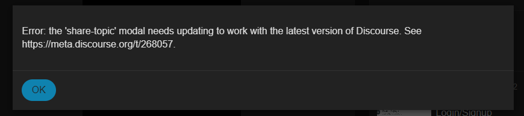](../../../assets/images/269466/2552fae36f0a645e9fbcb90fb6fb37af8a65f2ff.png "image")

 you_wu:

> I met the same problem, do you find the way to resize the post area?

You can solve this by overriding the CSS for grid-template-columns. Note that you’ll need to specify the media size you are targeting or it will override them all.

---

### Post #59 by [JammyDodger](../../users/JammyDodger.md)
*Posted: 2024-07-30 18:52*

 Gotchur:

> P.S. [@community-moderators](/groups/community-moderators) wasn’t sure if this is best posted here or in support

Posting on this topic is the best place for this one. 👍 It’s one of [@awesomerobot](/u/awesomerobot)’s personal ones and not an [official](/tag/official) theme, so all issues should be kept to this topic.

---

### Post #63 by [syedkhairi](../../users/syedkhairi.md)
*Posted: 2024-08-10 15:11*

Hiya, any idea how to edit the
    
    
    {{avatar topic.posters.0.user imageSize="large"}}
    

so it also shows the **avatar flair**? At the moment it doesn’t. The flair does show up elsewhere, so I’m assuming it’s the Avatar component needs editing but I don’t know where the component originates from? Is it a root component or something?

Any help is appreciated!

---

### Post #64 by [syedkhairi](../../users/syedkhairi.md)
*Posted: 2024-08-10 19:25*

Nevermind - I got it! Not elegant but works!
    
    
    {{#if topic.posters.0.user.flair_url}}
      
    {{/if}}

---

### Post #65 by [irregular](../../users/irregular.md)
*Posted: 2024-10-07 06:07*

amazing work!

---

### Post #66 by [MCATAKCIN](../../users/MCATAKCIN.md)
*Posted: 2024-10-17 00:43*

i just built my community with this theme and within 1 month i reached almost 1.000 members. so thanks!

i think this theme can turn into great designs with customization. for example a design in twitter layout? since it is a 3 column structure.

but when I make flex instead of grid in css, it’s a mess.

how can we make 3 columns centered equidistantly? i think we can turn into this design even with a small css change. can you give tips for this css change friends?

🙏

---

### Post #67 by [denvergeeks](../../users/denvergeeks.md)
*Posted: 2024-10-17 01:51*

 MCATAKCIN:

> how can we make 3 columns centered equidistantly

What sections or content would you like displayed in each of the three columns? Can you draw a diagram?

---

### Post #68 by [Moin](../../users/Moin.md)
*Posted: 2024-10-17 05:44*

I think this was solved in

 [In 1 month I'm close to 1,000 members but I'm missing one thing!](../../../assets/images/269466/238a4c2e6ea98da411fce8e2d5cdb3015a64ea5f_2_1035x466.png) [Support](/c/support/6)

> As I see your site right now, the three columns are responsive. But if what you want is for the 3 columns to shrink in place as you narrow the window (except in mobile of course), you could try this: /* Container to hold the 3 columns */ #main-outlet-wrapper { display: flex; justify-content: space-between; gap: 20px; /* Adjust space between columns if needed */ } /* Each column */ .sidebar-wrapper, #main-outlet, .custom-right-sidebar { flex: 1; padding: 10px; background-color: #f4…

---

### Post #70 by [MCATAKCIN](../../users/MCATAKCIN.md)
*Posted: 2024-10-24 09:43*

I’ve made great progress (: now how can i show the custom-right-sidebar on the homepage here too?

If I can show that sidebar on my topic page, I’ll be happy 

[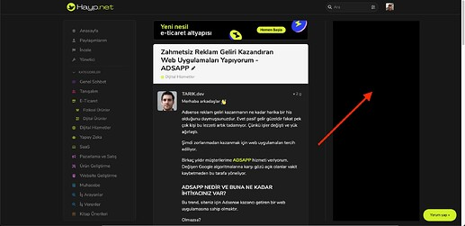](../../../assets/images/269466/6b85d8e1c68269fc5427878a664ae8ca1b77f501.jpeg "Ekran Resmi 2024-10-24 12.36.32")

---

### Post #71 by [joo](../../users/joo.md)
*Posted: 2024-11-01 12:01*

After activating a theme (without any components), the topic list overlaps with the right sidebar. This issue persists even in [safe mode](https://meta.discourse.org/t/53504?silent=true). How can I resolve this?  

")

---

### Post #72 by [awesomerobot](../../users/awesomerobot.md)
*Posted: 2024-11-01 16:09*

I’m unable to reproduce this, which browser are you using? is Discourse up-to-date?

[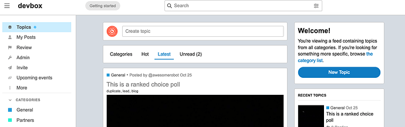](../../../assets/images/269466/d632a1225cb2d7a81b7b3d326356ab16b687c6a5.png "The image depicts the homepage of a web forum called DevBox, featuring a prominent search bar, links to various topics, and a welcome message to new users. \(Captioned by AI\)")

---

### Post #73 by [fsaccount](../../users/fsaccount.md)
*Posted: 2024-11-01 21:25*

Hello,

Love this theme but there is a little problem for mobile,  
there is no reply button for mobile, is it possible to have a reply button similar to create a new topic button when browsing categories?

---

### Post #74 by [Heliosurge](../../users/Heliosurge.md)
*Posted: 2024-11-01 23:15*

I see what you mean. No reply to topic. Only comment reply.

[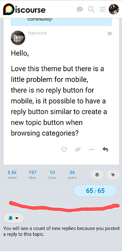](../../../assets/images/269466/43448c7e2f720002530f29286ed7745ffc377ce6.jpeg "You are looking at a screenshot of a conversation on a mobile platform, with a new post inquiring about a reply button similar to the one used when browsing categories. \(Captioned by AI\)")

---

### Post #75 by [joo](../../users/joo.md)
*Posted: 2024-11-02 03:17*

 Kris:

> I’m unable to reproduce this, which browser are you using? is Discourse up-to-date?

The issue was resolved by activating the Full Width component. However, there’s now a large gap on the right side. Is there a way to adjust it so that both sides have equal spacing?  

")

---

### Post #76 by [joo](../../users/joo.md)
*Posted: 2024-11-02 04:09*

I noticed your setup looks great and aligns with what I’m aiming for. If you’re comfortable with it, would you be open to sharing some of your configuration settings?

---

### Post #77 by [MCATAKCIN](../../users/MCATAKCIN.md)
*Posted: 2024-11-06 09:47*

unfortunately they don’t share much advice for the customization we need. it took me 1 week to get this consistent design. whereas theme developers could have offered this skin as an alternative.

Anyway…

I disabled the full-width component. and added these as custom css.
    
    
    #main-outlet-wrapper {
      display: flex;
      justify-content: space-between;
    }
    .sidebar-wrapper,
    #main-outlet,
    .custom-right-sidebar {
      flex: 1;
      box-sizing: border-box;
    }
    .sidebar-wrapper,.custom-right-sidebar{max-width:280px;}
    
    @media (max-width: 768px) {
      #main-outlet-wrapper {
        flex-direction: column;
      }
    }
    body[class*=user-] .custom-tag-banner, body[class*=user-] 
    .custom-category-banner, body[class*=user-] 
    .custom-right-sidebar, body.archetype-regular 
    .custom-tag-banner, body.archetype-regular 
    .custom-category-banner, body.archetype-regular 
    .custom-right-sidebar {
        display: flex;
    }
    

[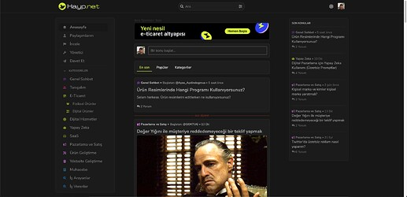](../../../assets/images/269466/139c7115f5bbceffe8f6494514042bfbe423319c.jpeg "Ekran Resmi 2024-11-06 12.56.14")

  

[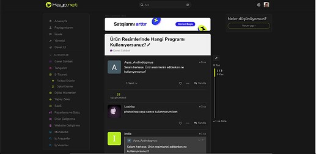](../../../assets/images/269466/3e9b18e166a13c32b596ad4880f959bb462399e3.jpeg "Ekran Resmi 2024-11-06 12.53.00")

I hope it helps. I will reply when you send me a message if necessary.

---

### Post #78 by [joo](../../users/joo.md)
*Posted: 2024-11-06 15:50*

Thanks for sharing your CSS! I appreciate you taking the time, especially since it took you a week to get it working.

---

### Post #79 by [Zomb](../../users/Zomb.md)
*Posted: 2024-11-26 05:30*

I really love this one!

---

### Post #80 by [Zomb](../../users/Zomb.md)
*Posted: 2024-11-27 07:22*

Is there a way to make subcategories show on mobile. It’s beautiful on desktop, but I don’t see them at all under the main category.

---

### Post #81 by [MihirR](../../users/MihirR.md)
*Posted: 2024-11-29 13:57*

Just wanted to confirm is this now equipped to work with Discourse Topic/Post Voting and also can we add leaderboard on the right side just as in the central theme?

---

### Post #82 by [MCATAKCIN](../../users/MCATAKCIN.md)
*Posted: 2024-12-03 06:05*

I want to share. it does not appear on the “custom-right-sidebar” topic page on the homepage. how can I make it display here. if you help, I am about to make a twitterish design with 3 columns. i would be happy to share the codes.

**the place I marked in orange**  

[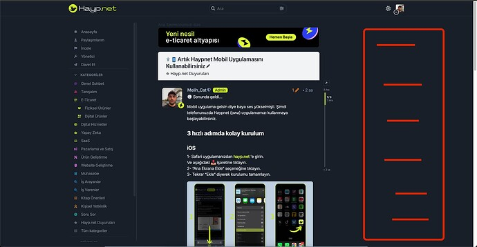](../../../assets/images/269466/63ab3b3c306201496e74c6332822d02bb5e56707.jpeg "Ekran Resmi 2024-12-03 09.01.46")

thanks guys

---

### Post #83 by [joo](../../users/joo.md)
*Posted: 2024-12-05 13:38*

 MCATAKCIN:

> 

I’m also looking to display the “custom-right-sidebar” on topic pages, but so far, none of the existing sidebar components seem to work for this. It would be fantastic if this feature could be added directly to the theme.

---

### Post #84 by [Gotchur](../../users/Gotchur.md)
*Posted: 2025-01-09 19:23*

Given the popularity of this theme, it would be cool to see it supported officially 😉

---

### Post #85 by [digitalsc4rz](../../users/digitalsc4rz.md)
*Posted: 2025-01-12 23:42*

Nice looks great - I’m going to try this on my website 😊

---

### Post #86 by [NateDhaliwal](../../users/NateDhaliwal.md)
*Posted: 2025-01-15 07:33*

The code blocks are very round, is this intentional?  
Also, the topic progress in the topic timeline isn’t in the centre of the topic timeline.

---

### Post #87 by [Canapin](../../users/Canapin.md)
*Posted: 2025-01-22 19:03*

A few bugs / UX issues:

  * The numbers are not vertically centered on the topic progress toggle on [mobile](/tag/mobile), as mentioned above :  

[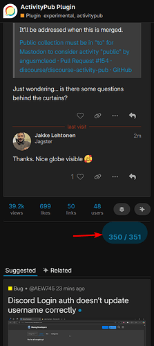](../../../assets/images/269466/14659bd26c55a75050de6e3a9f0144b25902382d.png "The image is a screenshot of a forum post discussing issues related to the ActivityPub plugin and a bug in Discord's login authentication feature. \(Captioned by AI\)")

  * The AI summary toggle doesn’t show up on [desktop](/tag/desktop).

  * The toggle is present on [mobile](/tag/mobile), but summaries don’t show up:  

  * Some text overflow on the right sidebar on [desktop](/tag/desktop) :  

[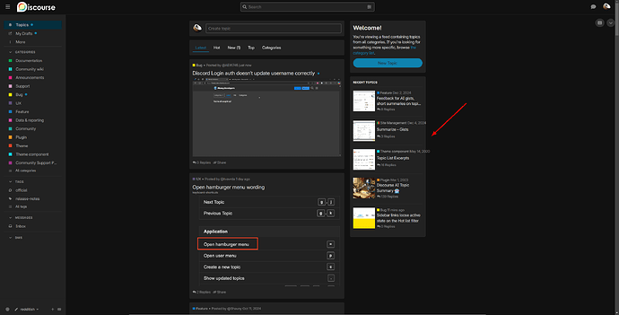](../../../assets/images/269466/cceb1c7edbe1a5846ef27a80e6d979f40bc69a71.png "The image shows a Discord interface with a roaming cursor highlighting the "Open hamburger menu" button. \(Captioned by AI\)")

---

### Post #88 by [Damian_Boon](../../users/Damian_Boon.md)
*Posted: 2025-02-14 17:17*

Is the standard behaviour of this theme that clicking on an image does nothing when viewing topics, you have to physically click the topic text to view that topic, where as if no image is present i can click in the box or on the excertp and it takes me to the topic.

---

### Post #89 by [awesomerobot](../../users/awesomerobot.md)
*Posted: 2025-02-19 20:34*

 Nate Dhaliwal:

> Also, the topic progress in the topic timeline isn’t in the centre of the topic timeline.

 Coin-coin le Canapin:

> Some text overflow on the right sidebar on [desktop](/tag/desktop) :

 Damian Boon:

> clicking on an image does nothing when viewing topics

Thanks for reporting these, they’ve been fixed in the latest update

---

### Post #90 by [Damian_Boon](../../users/Damian_Boon.md)
*Posted: 2025-02-20 00:39*

Thanks, didn’t know if it was intended or a bug, also there is another bug when logged in as admin. Visit a tag and these don’t work (clicking this link, the bell and the spanner)

[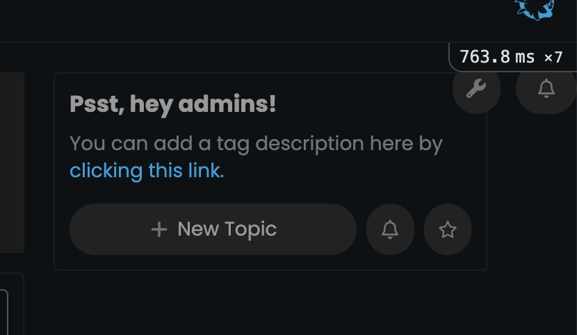](../../../assets/images/269466/2e4c75630cefcebd26caf8bcebe8ff55d37f130f.png "Screenshot 2025-02-20 at 00.38.07")

---

### Post #91 by [Damian_Boon](../../users/Damian_Boon.md)
*Posted: 2025-02-20 01:06*

Just installed the new update, the reply button (below the 1m ago) doesn’t work when you have finished reading the content, you have to scroll back up for it to work.

Also when viewing topics clicking the image does nothing still. Great theme though 😉

[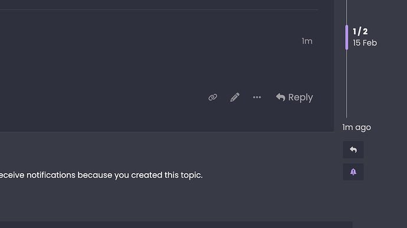](../../../assets/images/269466/f9891711535fcef394f4a680db2efcc6cc9ed023.png "Screenshot 2025-02-20 at 01.04.55")

---

### Post #92 by [awesomerobot](../../users/awesomerobot.md)
*Posted: 2025-02-20 15:57*

Thanks again! I’ve made some more updates

---

### Post #93 by [Damian_Boon](../../users/Damian_Boon.md)
*Posted: 2025-02-20 16:09*

What a legend . All working now. So much appreciated…

Just a quick one though, is there an easy way of adding some code so when viewing topics “clicking on the image” takes you to that topic?

---

### Post #95 by [ByteOS](../../users/ByteOS.md)
*Posted: 2025-02-20 18:24*

Agreed, would be great to have the entire box around the image trigger like clicking on the title of the post. Should be possible to make the container a link.

I have noticed a visual glitch on IOS safari.  
It’s like a line/border which is laggy when scrolling up and down.

Line  

[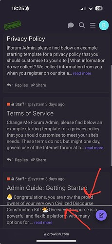](../../../assets/images/269466/dd9f22a683781651c2cac407adda3fd5bd99e3e5.jpeg "The image shows a mobile app interface for Growlish, with an open forum thread highlighting discussions about a Privacy Policy and Terms of Service, including a highlighted section titled "Admin Guide: Getting Started". \(Captioned by AI\)")

---

### Post #96 by [awesomerobot](../../users/awesomerobot.md)
*Posted: 2025-02-20 18:38*

 Damian Boon:

> Just a quick one though, is there an easy way of adding some code so when viewing topics “clicking on the image” takes you to that topic?

ah yes, I thought I had already fixed this but it needed another update — should start working if you update again

---

### Post #97 by [Damian_Boon](../../users/Damian_Boon.md)
*Posted: 2025-02-20 18:58*

Hes just updated and does exactly this 

---

### Post #98 by [Damian_Boon](../../users/Damian_Boon.md)
*Posted: 2025-02-20 18:58*

Kris your a superstar. So much appreciated

---

### Post #99 by [awesomerobot](../../users/awesomerobot.md)
*Posted: 2025-02-20 19:10*

 ByteOS:

> ")

just added a fix for this too!

---

### Post #100 by [Damian_Boon](../../users/Damian_Boon.md)
*Posted: 2025-02-22 03:47*

Search not working - not sure if the theme is updated on this site but when searching the box goes below the screen and no scroll bar is present so can’t see the “more” to actually search  

[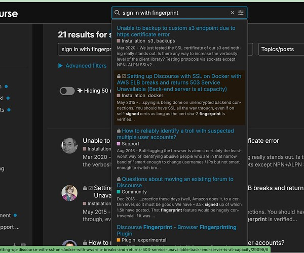](../../../assets/images/269466/25cba24b5166500c9683cd9082b1acb95ca31461.jpeg "Screenshot 2025-02-22 at 03.48.35")

---

### Post #101 by [CAX.DO](../../users/CAX.DO.md)
*Posted: 2025-02-22 05:24*

Hi Kris . Thank you for your work; this theme is very useful. However, when I pair it with this component, the position of the “New” button is not very suitable.

[github.com](https://github.com/VaperinaDEV/f-nav-for-mobile)

### [GitHub - VaperinaDEV/f-nav-for-mobile: F NAV - Mobile Navigation Tabs](https://github.com/VaperinaDEV/f-nav-for-mobile)

F NAV - Mobile Navigation Tabs

[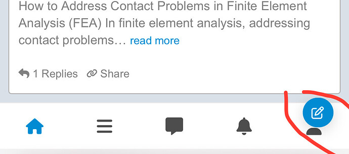](../../../assets/images/269466/f54b8c44f134af12991f00e80e882b9a1fd5dea3.jpeg "This image is a screenshot of an article discussing contact problems in finite element analysis. \(Captioned by AI\)")

---

### Post #102 by [Damian_Boon](../../users/Damian_Boon.md)
*Posted: 2025-02-22 12:52*

add this to mobile custom css

.navigation-container {  
–nav-space: 39px;  
}

---

### Post #103 by [Timelord](../../users/Timelord.md)
*Posted: 2025-02-23 17:42*

Anyone care to share your site that is running this theme? Would love to see how it looks in “production”.

---

### Post #104 by [Arkshine](../../users/Arkshine.md)
*Posted: 2025-02-23 18:03*

I’ve installed it on Theme Creator; you can give it a try: [Theme Creator](https://discourse.theme-creator.io/theme/Arkshine/redditish)

---

### Post #105 by [Timelord](../../users/Timelord.md)
*Posted: 2025-02-23 19:28*

Thank you for this.

---

### Post #106 by [Gotchur](../../users/Gotchur.md)
*Posted: 2025-02-23 21:17*

you can also use the redditish theme here on meta

---

### Post #107 by [Damian_Boon](../../users/Damian_Boon.md)
*Posted: 2025-02-25 14:47*

Anyone know how to change this text? “Create topic” I can’t find it in site text.

[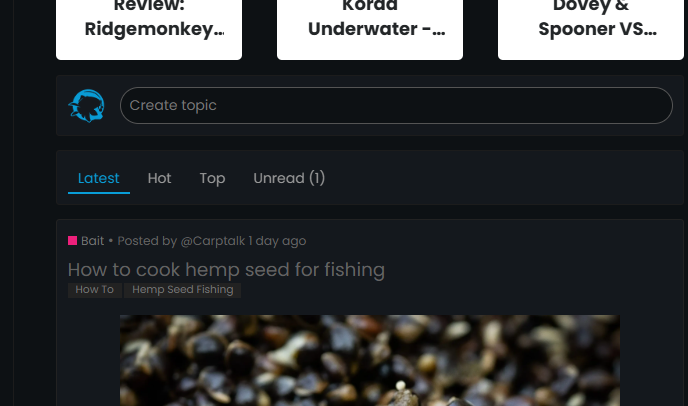](../../../assets/images/269466/afa6d0e16954880b515f5ebcd871aa419e30f4d9.png "Screenshot 2025-02-25 144549")

---

### Post #108 by [Arkshine](../../users/Arkshine.md)
*Posted: 2025-02-25 14:59*

[@Damian_Boon](/u/damian_boon) Go to the theme settings; you will see the translations below.

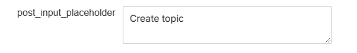

---

### Post #109 by [Damian_Boon](../../users/Damian_Boon.md)
*Posted: 2025-02-25 15:07*

Ive already done that and it doesnt change it.

Edit. [@Arkshine](/u/arkshine) i dont have that in the site texts

[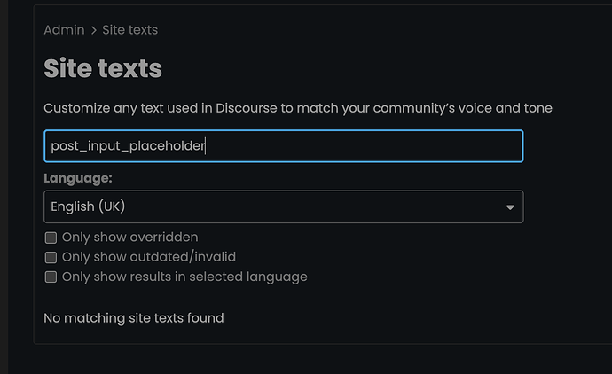](../../../assets/images/269466/bb15e8756aeb3da2eb78ad13c9ba3c081e6d9084.png "Screenshot 2025-02-25 at 15.12.50")

---

[← Previous](269466.md) | **Page 2 of 3** | [Next →](269466-page-3.md)
