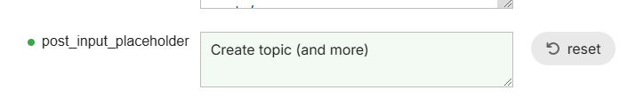
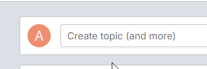
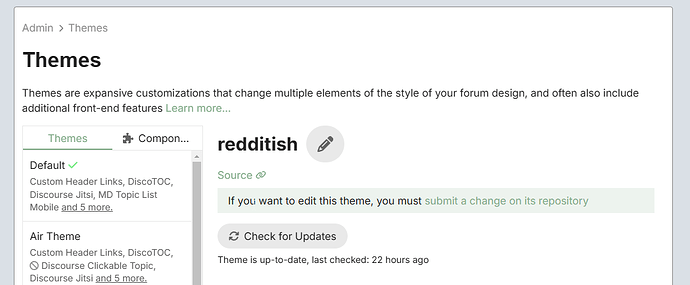
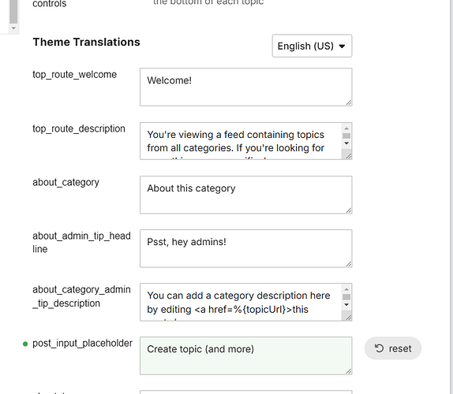
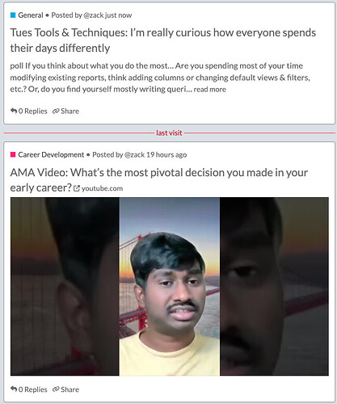
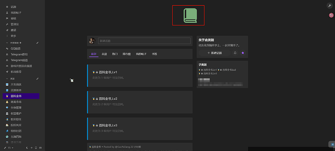
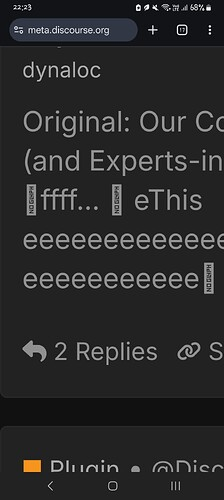
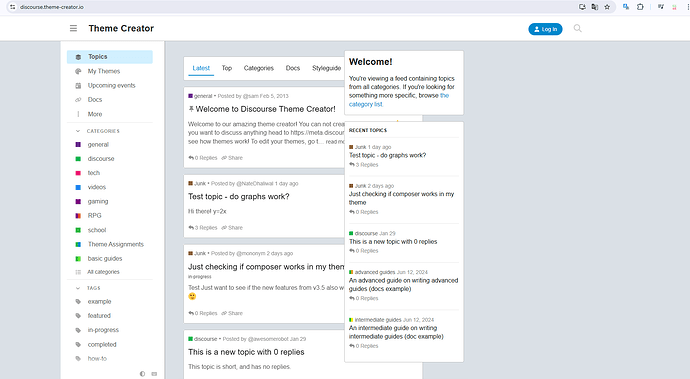

[🏠 Home](../../index.md) | [📋 Latest](../../latest/index.md) | [🔥 Top](../../top/replies/index.md) | [👥 Users](../../users/index.md)

[Home](../../index.md) » [Theme](../../c/theme/index.md) » A reddit-ish theme for Discourse

---

# A reddit-ish theme for Discourse (Page 3 of 3)

> **Category:** Theme
> **Author:** Arkshine
> **Created:** 2023-06-23 22:06

[← Previous](269466-page-2.md) | **Page 3 of 3** | Next →

---

### Post #110 by [Arkshine](../../users/Arkshine.md)
*Posted: 2025-02-25 15:13*

Odd, it works for me:

  

 Damian Boon:

> Edit. [@Arkshine](/u/arkshine) i dont have that in the site texts

It’s not part of the site texts. It’s part of the theme.

")

Go below where all the related translations are located:

")

I understand it might be confusing!

---

### Post #111 by [Damian_Boon](../../users/Damian_Boon.md)
*Posted: 2025-02-25 15:14*

I feel so stupid now, been so used to using the site texts, didn’t even realise they were there. Thankyou so much 🙂

---

### Post #112 by [penttbomb](../../users/penttbomb.md)
*Posted: 2025-04-05 08:05*

Awesome work! Is there any way I can add a image background to the theme at all?

---

### Post #113 by [datagoatsdotorg](../../users/datagoatsdotorg.md)
*Posted: 2025-04-29 18:28*

Hey - I really love the theme. I think it really works well for encouraging discussion and showing media.

Two things I’m trying to solve for (in attached image) and curious if anyone has suggestions. Keep in mind, I’m new to hosting a discourse community. I’m self-hosted.

  1. YouTube loads beautifully in the post itself, but I only get a thumbnail in the post preview on the homepage. I’m sure this is a performance play potentially but is there a way to make it to where it would actually load the video so you could watch directly from the home page on the topic preview? I understand the trade off that it’s less likely someone may click into the topic to engage in the discussion, so I can see why this was an intentional choice but wanted to see what the options are there.
  2. The top post in my screenshot has a poll as the first thing on the post, but the poll doesn’t get shown on the topic preview. Can this be changed to show polls just like images (or the Youtube thumbnail in the above example) - essentially make it a media type that would be displayed in the topic preview rather than having to click into the topic?

Thank you so much in advance for the guidance.

---

### Post #114 by [Aurora](../../users/Aurora.md)
*Posted: 2025-04-30 11:26*

I would be interested in that too!! [It seems to be possible here.](https://meta.discourse.org/t/what-are-some-of-the-hardest-moments-you-had-as-a-moderator/117677)

---

### Post #115 by [awesomerobot](../../users/awesomerobot.md)
*Posted: 2025-04-30 13:00*

 datagoatsdotorg:

> is there a way to make it to where it would actually load the video so you could watch directly from the home page on the topic preview? I

It’s somewhat possible, but has a lot of shortcomings… if a youtube video is posted as the `featured link` (i.e., the URL is entered as the title of the topic), which it appears it is in your screenshot, then the URL is available in the topic list and this can be used to embed the video (this will take some additional work in the theme)

The shortcoming is that if the link is simply posted in the body of the first post, it doesn’t get picked up as a featured link… and Discourse would still grab the thumbnail, but the video URL wouldn’t be available on the topic list. So it’s almost a hidden feature.

Also each video provider would need some custom logic in the theme to support embeds, so it wouldn’t work automatically for every video.

Generally this is something a custom plugin could do better. A plugin could check for video links in the original post and pull them out as the featured link automatically.

 datagoatsdotorg:

> Essentially make it a media type that would be displayed in the topic preview rather than having to click into the topic?

This is also fairly tricky because of similar issues, at the topic list level we have no idea if the original post has a poll… we don’t serialize any data about it. We could maybe check for `poll` in the excerpt, and then try to fetch the data from the topic as a separate request… but this would only work if the poll is at the top of the post and may have some performance issues.

A custom plugin would also be able to handle this better.

---

### Post #116 by [datagoatsdotorg](../../users/datagoatsdotorg.md)
*Posted: 2025-04-30 19:48*

Thank you! This is a helpful response. I’ll look into some potential solutions for this based on what you suggested. Ultimately, may be too big of a lift for me to attempt on my own but I might give it a go.

If I come up with a solution that might help others on that, I’ll share it. I see the challenges for sure though, and it may be a “is the juice worth the squeeze?” sort of situation.

---

### Post #118 by [祁同伟](../../users/祁同伟.md)
*Posted: 2025-05-02 11:28*

")

  
When category logos are set, only the logo image is displayed at the top.

---

### Post #119 by [NateDhaliwal](../../users/NateDhaliwal.md)
*Posted: 2025-05-24 14:42*

If the topic post has code fences (triple backticks), the topic list preview has a rectangle that says ‘No Glyph’ in its place.

")

This happened here on Meta.

---

### Post #120 by [HiAI](../../users/HiAI.md)
*Posted: 2025-08-23 09:13*

Hi everyone, I met the same problem: Theme is not center when wide screen higher than 2560px. Thanks

---

### Post #121 by [HiAI](../../users/HiAI.md)
*Posted: 2025-08-23 09:15*

Hi arkshine, your theme is not center

---

### Post #123 by [Eric_Wynn](../../users/Eric_Wynn.md)
*Posted: 2025-11-21 22:13*

Anyone have some examples of this in mobile?

---

[← Previous](269466-page-2.md) | **Page 3 of 3** | Next →
