[🏠 Home](../../index.md) | [📋 Latest](../../latest/index.md) | [🔥 Top](../../top/replies/index.md) | [👥 Users](../../users/index.md)

[Home](../../index.md) » [Theme](../../c/theme/index.md) » A reddit-ish theme for Discourse

---

# A reddit-ish theme for Discourse (Page 1 of 3)

> **Category:** Theme
> **Author:** awesomerobot
> **Created:** 2023-06-23 22:06

← Previous | **Page 1 of 3** | [Next →](269466-page-2.md)

---

### Post #1 by [awesomerobot](../../users/awesomerobot.md)
*Posted: 2023-06-23 22:06*

[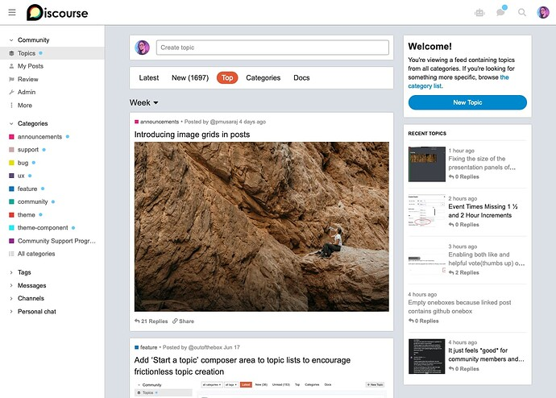](../../../assets/images/269466/3ee50c581e5c7a38c72fe1b554af3b40e8623f6e.jpeg "Screenshot 2023-06-23 at 5.20.23 PM")

|  |   
---|---|---  
ℹ️ | **Summary** | A Discourse theme that looks a little like reddit  
🛠️ | **Repository** | [github.com/discourse/discourse-redditish-theme](https://github.com/discourse/discourse-redditish-theme)  
❓ | **Install Guide** | [How to install a theme or theme component](https://meta.discourse.org/t/how-do-i-install-a-theme-or-theme-component/63682)  
📖 | **New to Discourse Themes?** | [Beginner’s guide to using Discourse Themes](https://meta.discourse.org/t/beginners-guide-to-using-discourse-themes/91966)  
  
> ⚠️ This is still a work in progress and not all features are supported yet (bulk topic select for example), but it’s usable as-is with most of the default Discourse feature set.

Other things to note:

  * There’s no up/down-voting, though if there’s interest I can look at how this can integrate with [Discourse Topic Voting](https://meta.discourse.org/t/discourse-topic-voting/40121) and [Discourse Post Voting](https://meta.discourse.org/t/discourse-post-voting/227808)

  * Strongly recommend using it with the `desktop category page style`: `category boxes with subcategories`

  * This dramatically changes the layout so it won’t be compatible with every plugin or theme-component.

  * Some areas are more well-polished than others at the moment, tag pages, user pages, chat, etc can use some more work.

  * If you haven’t updated Discourse recently, you should do it before using this theme, as it required a couple new plugin outlets.

Some more screenshots

[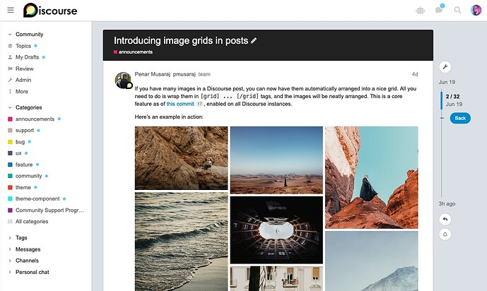](../../../assets/images/269466/395d3de7e15241cef8d954e0efbdb377d3cf3b58.jpeg "Screenshot 2023-06-23 at 5.39.02 PM")

[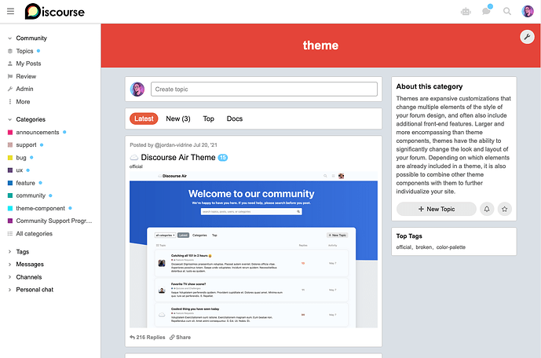](../../../assets/images/269466/0ea0d3ac8a6ab09098c9f10792ac4047207487e0.png "Screenshot 2023-06-23 at 5.20.01 PM")

[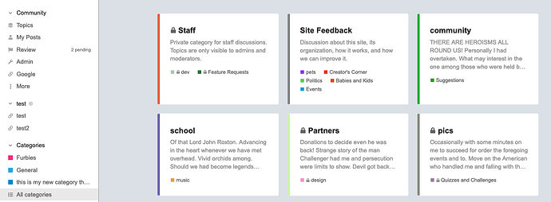](../../../assets/images/269466/e8513aac0b84c9277372435eab195681e1dae5ce.png "Screenshot 2023-06-23 at 5.35.42 PM")

---

### Post #2 by [Tiago_santos](../../users/Tiago_santos.md)
*Posted: 2023-06-24 01:28*

Wooww great job, i really really love this theme. Thank for all Kris.

---

### Post #3 by [Lilly](../../users/Lilly.md)
*Posted: 2023-06-24 04:33*

oh nice you did the create new topic box.

nice theme, i like the boxes layout. beautiful work as always 🙂 👏

---

### Post #4 by [satonotdead](../../users/satonotdead.md)
*Posted: 2023-06-24 18:36*

Super nice, thanks!

Where I need to look if I want ‘about’, ‘welcome’, ‘recent topics’ and ‘top tags’ boxes and/or the ‘Create topic’ header?

I wonder if I can implement this perks in another theme, just to keep away from Reddit but take some of their UI/UX features 🙂

---

### Post #5 by [hoangviet](../../users/hoangviet.md)
*Posted: 2023-06-25 05:26*

A beautiful theme.

  * You should have the User name who posted the latest post (with the last posting time, and that user’s Avatar): The purpose is to update the user to know that it is a “live” topic.
  * There should be a total number of likes, next to the comment button

Want to know what the Mobile version looks like?

---

### Post #6 by [anon5108266](../../users/anon5108266.md)
*Posted: 2023-06-25 20:03*

this is cool 👀

I will use it in my forum

---

### Post #7 by [outofthebox](../../users/outofthebox.md)
*Posted: 2023-06-26 02:21*

Hey [@awesomerobot](/u/awesomerobot),

_This is incredible!_

I’m not seeing the Welcome box and the Recent Topics on the homepage. Do those functionalities require a more recent version of Discourse? If so, which one is required?

Many thanks!

---

### Post #8 by [HAWK](../../users/HAWK.md)
*Posted: 2023-06-26 05:03*

You will need to update to latest as per:

 Kris:

> If you haven’t updated Discourse recently, you should do it before using this theme, as it required a couple new plugin outlets.

---

### Post #9 by [Jay91](../../users/Jay91.md)
*Posted: 2023-06-27 09:47*

This is awesome [@awesomerobot](/u/awesomerobot) , thank you.  
i always was waiting for something like this.  
a question please, this supports RTL for now?

---

### Post #10 by [Canapin](../../users/Canapin.md)
*Posted: 2023-06-27 10:22*

Hello Jay 👋

 Jay Abie:

> a question please, this supports RTL for now?

It seems it does:

LTR  

[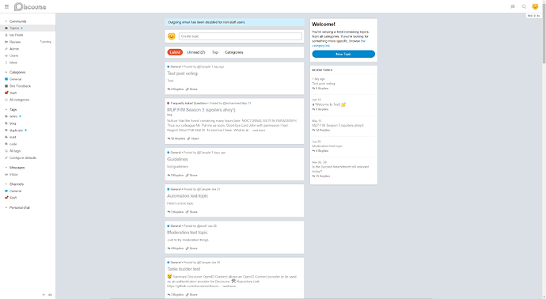](../../../assets/images/269466/2ce3327990cd1d8e54cdfee8a21ea10b738bc391.png "LTR")

RTL  

[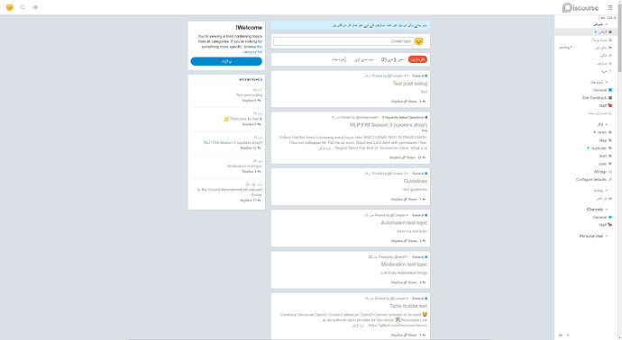](../../../assets/images/269466/7c7cdea38c39a8a67783ece5913f9f002d469999.png "RTL")

---

### Post #11 by [Octoberon](../../users/Octoberon.md)
*Posted: 2023-06-28 22:54*

 Carson:

> I’m not seeing the Welcome box and the Recent Topics on the homepage.

I also seem to be unable to get the Welcome and Recent elements to display on the page. I’m running the latest Discourse beta version. I’ve tried three different browsers and looked over the settings but can’t seem to work out what’s wrong.

---

### Post #12 by [dadberg](../../users/dadberg.md)
*Posted: 2023-06-29 09:39*

Impressive!

---

### Post #13 by [JammyDodger](../../users/JammyDodger.md)
*Posted: 2023-06-29 10:10*

 Octoberon:

> I also seem to be unable to get the Welcome and Recent elements to display on the page. I’m running the latest Discourse beta version. I’ve tried three different browsers and looked over the settings but can’t seem to work out what’s wrong.

Having a look at the forum linked in your profile it seems it’s on [f736748853](https://github.com/discourse/discourse/commits/f7367488536ce92a02b4eba4376b447c622fb490), which is from the 19th June. My test site, for instance, was updated this morning and is on [ea0b8ca38c](https://github.com/discourse/discourse/commits/ea0b8ca38cad5681ad413a11ac5cfef1b0a8ac18) \- so I think there’s a good chance that if you update your forum from your `/upgrade` page everything should then magically work.  🙂

You can tell precisely which version you’re on using this link here on your dashboard:

[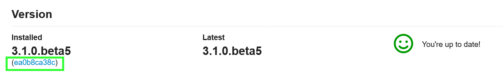](../../../assets/images/269466/c2307041dc7f39b81abcb0b4f73a1bebdd769255.png "Untitled2")

---

### Post #14 by [Octoberon](../../users/Octoberon.md)
*Posted: 2023-06-29 13:26*

I’m also on my test server but it’s in sync with the production one so yes, you’re quite right! I’ve been relying on the smiley face to tell me when it’s time to upgrade but I guess it doesn’t account for latest builds. I’ve upgraded now and the missing bits of the page have appeared. 🙌

Thanks for the spot.

---

### Post #15 by [Octoberon](../../users/Octoberon.md)
*Posted: 2023-07-03 17:18*

[@awesomerobot](/u/awesomerobot) I’ve implemented this theme on my forum and have a few members trialling it to get some feedback.

There doesn’t seem to be a way to share, bookmark or flag a topic, unless I’m missing something. The usual Reply button is also not there. People can reply to a post directly but I think they like the UX of the large button.

Am I missing something or is this how the theme works in the current version?

---

### Post #16 by [awesomerobot](../../users/awesomerobot.md)
*Posted: 2023-07-03 17:23*

That’s the expected functionality of the theme at the moment, I figured since reddit doesn’t have these footer buttons I’d remove them here too.

I can add them back since they’re missed, they’re hidden with one line of CSS
    
    
    #topic-footer-buttons .topic-footer-main-buttons {
      display: none;
    }
    

So if you’d like to unhide them immediately you can add this CSS to a theme component
    
    
    #topic-footer-buttons .topic-footer-main-buttons {
      display: block;
    }

---

### Post #17 by [Octoberon](../../users/Octoberon.md)
*Posted: 2023-07-03 17:25*

I thought that might be the case. Some people may like the clean interface and prefer to stay closer ro the Reddit look-and-feel so maybe have it as a theme setting, if that’s possible?

---

### Post #18 by [Octoberon](../../users/Octoberon.md)
*Posted: 2023-07-04 09:39*

More feedback from my users. Looking at the Latest view shows a preview of the first post in a topic. It would be useful if the last unread post were the preview so people can scan latest replies before diving in to the topic. Is this technically possible to implement?

---

### Post #19 by [awesomerobot](../../users/awesomerobot.md)
*Posted: 2023-07-06 21:21*

 Octoberon:

> I thought that might be the case. Some people may like the clean interface and prefer to stay closer ro the Reddit look-and-feel so maybe have it as a theme setting, if that’s possible?

I’ve added a `hide topic footer controls` setting to the theme, if you disable this they’ll appear again

 Octoberon:

> It would be useful if the last unread post were the preview so people can scan latest replies before diving in to the topic. Is this technciall possible to implement?

This isn’t possible from within a theme, showing the images/text from the first post is a feature built-in to Discourse that I’m utilizing here… changing the image would require a custom plug-in. Showing the text from the latest reply is likely possible in a theme… but could possibly cause some performance issues, so a plugin to serialize that would also be the better route (though I’m not sure how feasible it would be… might still cause some performance issues as a plugin).

---

### Post #20 by [Octoberon](../../users/Octoberon.md)
*Posted: 2023-07-07 20:04*

Thanks, [@awesomerobot](/u/awesomerobot). I added the CSS (and now how I know how to do that so another Discourse learning box ticked) to show the reply button but I appreciate the enhancement.

Even without knowing how the software works in detail I had a feeling that the ‘last post in preview’ idea would be complicated and performance impacting. I don’t think it matters in many themes but with this one it’s food for thought. Might have a crack it myself when I get to that level of expertise.

---

### Post #21 by [Heliosurge](../../users/Heliosurge.md)
*Posted: 2023-07-08 02:28*

This looks pretty cool. Will the team eventually put the threading feature that was trialed awhile back?

Can you add the option to preview theme?

---

### Post #22 by [syandriz](../../users/syandriz.md)
*Posted: 2023-07-10 13:38*

[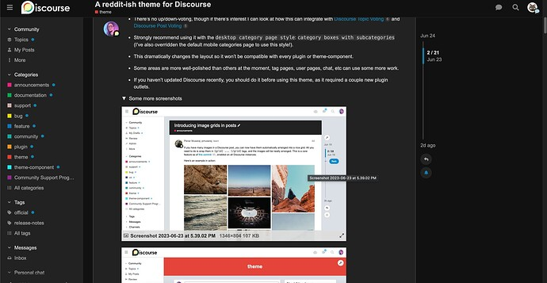](../../../assets/images/269466/5c7b515853f0cc2c5405c13c6b8abb25d7d1e2b4.jpeg "Screenshot 2023-07-10 at 9.36.52 PM")

how to fix blank area on right… is that from my mac or theme?

---

### Post #23 by [awesomerobot](../../users/awesomerobot.md)
*Posted: 2023-07-12 20:59*

 Dan DeMontmorency:

> This looks pretty cool. Will the team eventually put the threading feature that was trialed awhile back?

Can you be more specific? is this about chat threads? threads in [Discourse Post Voting Plugin](https://meta.discourse.org/t/discourse-post-voting/227808) perhaps?

 Dan DeMontmorency:

> Can you add the option to preview theme?

You can switch to the theme here on Meta with the toggle at the bottom left of the sidebar, it seems like there’s an error on our theme creator site so I can’t upload a preview there at the moment.

---

### Post #25 by [awesomerobot](../../users/awesomerobot.md)
*Posted: 2023-07-12 21:12*

 syandriz:

> how to fix blank area on right… is that from my mac or theme?

do you mean to the right of the image? I believe you’ll have to increase the site setting `max image width` from `admin/site_settings` — though note that this will only change new uploads, if you wanted to change the old ones the posts would have to be rebaked ([Rebake all posts matching a pattern](https://meta.discourse.org/t/rebake-all-posts-matching-a-pattern/48713)).

if you mean the post width itself, that’s just the theme… I might try to add some content there in the future

---

### Post #26 by [falcon9](../../users/falcon9.md)
*Posted: 2023-07-14 23:52*

 Kris:

> do you mean to the right of the image?

I seem to be having a similar issue… but only on the main screen. Here is a screenshot from right here on meta…

[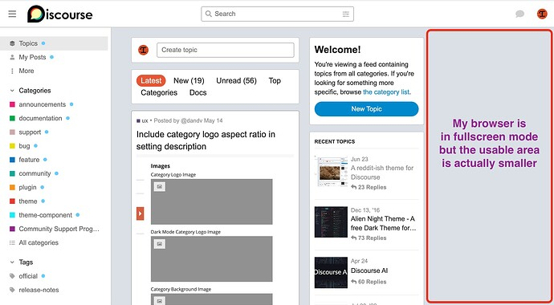](../../../assets/images/269466/c8f32c95aafd77b6d0803e54cf70c7647edb7a65.jpeg "Screenshot 2023-07-14 at 6.46.32 PM")

If I decrease the screen size a little bit… then everything jumps wider.

---

### Post #27 by [Heliosurge](../../users/Heliosurge.md)
*Posted: 2023-07-22 08:43*

 Kris:

>  Heliosurge:
>
>> This looks pretty cool. Will the team eventually put the threading feature that was trialed awhile back?
> 
> Can you be more specific? is this about chat threads? threads in [Discourse Post Voting](https://meta.discourse.org/t/discourse-post-voting/227808) perhaps

Hi Chris,

Awhile back the team was testing an idea where you could click on a post snd only view replies linked to that post. It would hide so to speak other comments on the topic save the one you chose to focus on.

So for example on your post it would show 1 reply iirc was on left bottom snd if clicked it would show my reply under your post with an option to go back to all.

---

### Post #28 by [renato](../../users/renato.md)
*Posted: 2023-07-22 17:53*

There’s a site setting for something like what you described, “enable filtered replies view”.

---

### Post #29 by [Alex_王](../../users/Alex_王.md)
*Posted: 2023-08-07 16:41*

[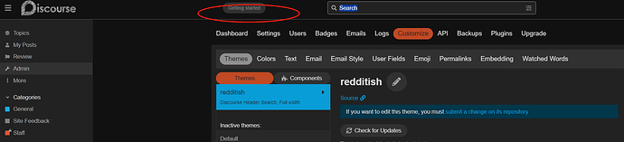](../../../assets/images/269466/15f5fed773319dde2b7b69f1013442eab00455fa.png "image")

  
Seems the geting start doesn’t work. Could you please fix it? Thank you very much!! 😃

---

### Post #30 by [Steve_Emerson](../../users/Steve_Emerson.md)
*Posted: 2023-08-11 15:00*

[@awesomerobot](/u/awesomerobot) This is an awesome theme! I really like it however I can’t seem to be able to create a new topic via the ‘Create Topic’ textbox, nor the ‘+ New Topic’ sidebar.

I cannot see any other comments that show others experiencing this issue so not sure if this is common or not? Does it work fine for you?  

[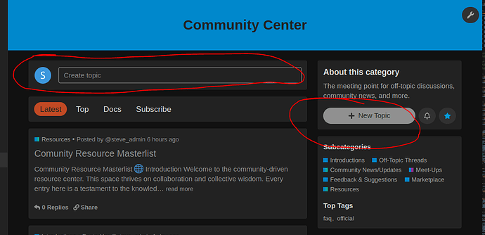](../../../assets/images/269466/de0a56b5274e39b03654bd417e3d2ecb6205e254.png "image")

---

### Post #31 by [Canapin](../../users/Canapin.md)
*Posted: 2023-08-11 15:37*

I have the last version of the theme and no issue creating topics.  
Maybe it’s caused by one of your other theme components.

Do you have an error message in your browser’s javascript console from the developer tools?

---

### Post #32 by [Steve_Emerson](../../users/Steve_Emerson.md)
*Posted: 2023-08-11 15:58*

Thanks for the prompt response and good suggestion; I do indeed have an error when selected New Topic.
    
    
    Uncaught TypeError: this.composer.openComposer is not a function
        customCreateTopic fake-input-create.js:56
        Cr runtime.js:6179
        install runtime.js:6316
        _ runtime.js:4048
        track validator.js:668
        commit runtime.js:4046
        commit runtime.js:4121
        It runtime.js:4141
        Ember 5
        invoke queue.ts:203
        flush queue.ts:98
        flush deferred-action-queues.ts:75
        _end index.ts:616
        end index.ts:298
        _run index.ts:667
        run index.ts:339
        d Ember
        success ajax.js:105
        jQuery 6
        b ajax.js:154
        O rsvp.js:460
        O rsvp.js:916
        h ajax.js:167
        listForParent category-list.js:80
        _createSubcategoryList build-category-route.js:78
        afterModel build-category-route.js:61
        runAfterModelHook router_js.js:707
        resolve router_js.js:619
        y rsvp.js:435
        v rsvp.js:421
        invoke queue.ts:203
        flush queue.ts:98
        flush deferred-action-queues.ts:75
        _end index.ts:616
        _boundAutorunEnd index.ts:257
        promise callback*n/< platform.ts:28
        flush Ember
        _scheduleAutorun index.ts:803
        _ensureInstance index.ts:791
        schedule index.ts:384
        Ember 6
        <anonymous> start-app.js:4
        <anonymous> discourse-boot.js:20
        <anonymous> discourse-boot.js:1
    
    

The components I’m using are:  

[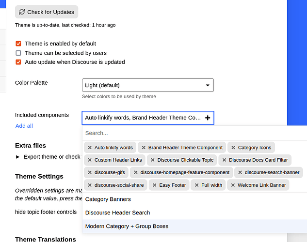](../../../assets/images/269466/3fad638b42c941eddc8e253bef869db61b78fc70.png "image")

Whether or not the components are causing the issue I’m not sure - I did remove all then try again and still had the same error upon clicking New Topic. Quite strange 

---

### Post #33 by [Steve_Emerson](../../users/Steve_Emerson.md)
*Posted: 2023-08-11 16:04*

So looks like it’s not finding this function:
    
    
        customCreateTopic() {
          if (document.querySelector(".d-editor-input")) {
            document.querySelector(".d-editor-input").focus();
          } else {
            this.composer.openComposer({
              action: _composer.default.CREATE_TOPIC,
              draftKey: _composer.default.NEW_TOPIC_KEY,
              categoryId: this.category?.id,
              tags: this.tag?.id
            });
          }
        }
      },
    

I’ve tested on Firefox and Chrome from my Ubuntu OS. Not sure if it’s the plugins I’m using or something, guess I’ll have to have a play around and drilldown deeper. Weird it seems only I’m experiencing this though 😒 Hopefully get to the bottom of it.

---

### Post #34 by [awesomerobot](../../users/awesomerobot.md)
*Posted: 2023-08-16 20:44*

Yes, it looks like `openComposer` has been changed to `open` — I’ve just fixed this in the theme, so it should resolve once updated. Thanks for reporting it!

---

### Post #35 by [Steve_Emerson](../../users/Steve_Emerson.md)
*Posted: 2023-09-07 14:24*

Hi [@awesomerobot](/u/awesomerobot) , I cannot seem to find how I can add a category when I am on this theme. When I go to the categories section I couldn’t find the option so ended up switching theme temporarily to add new one then switched back.

Am I doing something wrong? Can you advise please? 🙂

---

### Post #36 by [Thien_Nguyen_Ngoc](../../users/Thien_Nguyen_Ngoc.md)
*Posted: 2023-09-08 01:46*

hi [@awesomerobot](/u/awesomerobot) , your theme is amazing and i really love it.

I have some problems with the mobile view when I scrolled to the end of the site (homepage) it was not loading more new topics. It worked fine when I went to a specific category, however on the homepage (mixed categories) it was not. Could you take a look at it? It also worked well on PC.  

<https://d11a6trkgmumsb.cloudfront.net/original/4X/d/5/9/d59f3d5c1e8457c3dae8f8058cc150eb0fd131d3.mov>

  
Thank you so much.

---

### Post #37 by [spd](../../users/spd.md)
*Posted: 2023-09-16 11:17*

Hi all,

We’re loving the Reddit-ish theme!

Just one question. It would be great if when people first arrived at my forum it looked like **/latest**

Is there any way to make that the default homepage kind of thing please?

Thank you!

---

### Post #38 by [simon](../../users/simon.md)
*Posted: 2023-09-16 17:02*

 spd:

> It would be great if when people first arrived at my forum it looked like **/latest**

I think what you are wanting to do is set /latest as your forum’s homepage. If that is correct, you can do that by setting latest as the first item in your `top menu` site setting:

[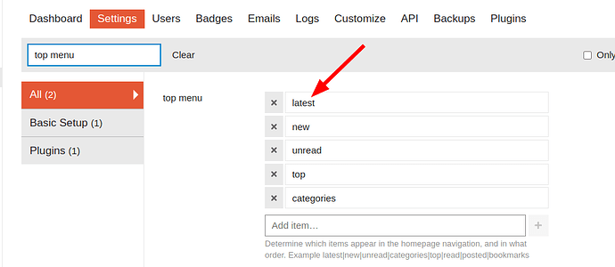](../../../assets/images/269466/6f32ef3d69f15d8c04c10b76b8f03da61c3a73ac.png "image")

---

### Post #39 by [Lilly](../../users/Lilly.md)
*Posted: 2023-09-16 17:44*

In addition to [@simon](/u/simon)’s reply, it’s probably worth noting that users can override that setting with their own default homepage in `user/preferences/interface` and `Default Home Page` . 🙂

---

### Post #40 by [spd](../../users/spd.md)
*Posted: 2023-09-17 16:57*

Ah yes! Thank you very much.

I do have the global setting set to have Latest at the top, but my own User was set to have Categories as the Default Homepage.

The question is - do all my users also have their default homepages set to Categories too?

Can I do some kind of reset to change everyone’s default homepage to Latest?

Thank again for your help

---

### Post #41 by [Lilly](../../users/Lilly.md)
*Posted: 2023-09-17 17:17*

If you really want to do that, then you may need to do it in rails with an `update_all` command on the user site setting after you have set the global default to latest (which you said you have). If you go this route, be sure to backup first.

---

### Post #42 by [Thien_Nguyen_Ngoc](../../users/Thien_Nguyen_Ngoc.md)
*Posted: 2023-09-18 03:17*

could anyone help me with this one? . I really appreciated it

---

### Post #43 by [simon](../../users/simon.md)
*Posted: 2023-09-18 04:24*

 spd:

> The question is - do all my users also have their default homepages set to Categories too?

I’m assuming that you changed your user’s Default Homepage option to Categories. Unless a user has explicitly set their Default Homepage option, their homepage will be the homepage that is set by the `top menu` site setting.

If you have access to your site’s Rails console, you could reset all of your user’s Default Homepage settings so that it will be set based on your `top menu` setting. To do that, enter the Rails console and run:
    
    
    UserOption.update_all(homepage_id: nil)
    

If you are unsure about running this command, I would just not do it. It is likely that most or all of your users will already have their Default Homepage set to Latest.

---

### Post #44 by [awesomerobot](../../users/awesomerobot.md)
*Posted: 2023-09-20 16:00*

I’ve just made an update to the theme to address these two issues:

 Steve Emerson:

> Hi [@awesomerobot](/u/awesomerobot) , I cannot seem to find how I can add a category when I am on this theme. When I go to the categories section I couldn’t find the option so ended up switching theme temporarily to add new one then switched back.

I may have temporarily removed it while building the theme and neglected to add it back — this will now appear again after updating.

 Thien Nguyen Ngoc:

> I have some problems with the mobile view when I scrolled to the end of the site (homepage) it was not loading more new topics. It worked fine when I went to a specific category, however on the homepage (mixed categories) it was not.

This was an issue caused by the “recent topics” list shown on the homepage — we check for a specific class at the bottom of the page to continue loading more topics, and since the sidebar includes this class further up the page it was preventing the load more behavior. Changing the class for these sidebar items fixes the issue.

Thanks for the bug reports everyone!

---

### Post #45 by [Lilly](../../users/Lilly.md)
*Posted: 2023-09-20 16:17*

Which navigation menu sidebar items and classes? I just want to know if they will affect any of my related theme components.

---

### Post #46 by [awesomerobot](../../users/awesomerobot.md)
*Posted: 2023-09-20 16:20*

Previously in the sidebar template I was using `{{topic-list-item topic=topic}}`, which produces a `tr` element with the class `topic-list-item`. Removing that class from the sidebar solved the issue.

---

### Post #47 by [R2BB1T](../../users/R2BB1T.md)
*Posted: 2023-10-16 14:36*

  
Please tell me how to translate into other languages

---

### Post #48 by [Zup](../../users/Zup.md)
*Posted: 2023-11-21 08:07*

nice theme. 🙂

 Kris:

> There’s no up/down-voting, though if there’s interest I can look at how this can integrate with [Discourse Topic Voting ](https://meta.discourse.org/t/discourse-topic-voting/40121) and [Discourse Post Voting ](https://meta.discourse.org/t/discourse-post-voting/227808)

just making it known that yes, there is indeed interest. 👍 👍

---

### Post #49 by [Heather13](../../users/Heather13.md)
*Posted: 2024-05-27 21:37*

I love this theme, however I would like to replace “share” with number of likes next to number of replies on the bottom of the topic cards. What would the custom CSS be to do this?

---

### Post #50 by [NateDhaliwal](../../users/NateDhaliwal.md)
*Posted: 2024-06-07 05:59*

This theme looks great! However, I spotted 2 issues with it:

  1. The nav bar at the top showing the chat icon, search etc has a few of the icons smaller than the rest, and not aligned too.  

  2. The topic timeline looks weird: it’s the curve-edge rectangle (bar) within the box-rectangle (box with bar within). Maybe the box with bar within could be curved as well?  

---

### Post #51 by [awesomerobot](../../users/awesomerobot.md)
*Posted: 2024-06-07 18:14*

Thanks for reporting these! I’ve just made an update that should fix them.

---

← Previous | **Page 1 of 3** | [Next →](269466-page-2.md)
