[🏠 Home](../../index.md) | [📋 Latest](../../latest/index.md) | [🔥 Top](../../top/replies/index.md) | [👥 Users](../../users/index.md)

[Home](../../index.md) » [Theme](../../c/theme/index.md) » Air Theme

---

# Air Theme (Page 2 of 8)

> **Category:** Theme
> **Author:** daming
> **Created:** 2021-07-20 20:24

[← Previous](197703.md) | **Page 2 of 8** | [Next →](197703-page-3.md)

---

### Post #228 by [daming](../../users/daming.md)
*Posted: 2022-02-14 08:15*

Does anyone know how to change the header text size and color in the front page?

---

### Post #229 by [jordan.vidrine](../../users/jordan.vidrine.md)
*Posted: 2022-02-14 16:02*

I’d direct you here to get a better sense of how Discourse works, and how to customize areas of the site.

[Air Theme](https://meta.discourse.org/t/discourse-air-theme/197703/223) [Theme](/c/theme/61)

> Feel free to read through the following topics to get a better sense of how to customize the look and feel of your site 👍 As well as these: [Designer’s Guide to Discourse Themes](https://meta.discourse.org/t/designers-guide-to-discourse-themes/152002) [Developer’s guide to Discourse Themes](https://meta.discourse.org/t/developer-s-guide-to-discourse-themes/93648)

---

### Post #230 by [jordan.vidrine](../../users/jordan.vidrine.md)
*Posted: 2022-02-15 15:43*

A post was merged into an existing topic: [Dark / Light mode toggle component](/t/dark-light-mode-toggle-component/215585/21)

---

### Post #234 by [f1r4s](../../users/f1r4s.md)
*Posted: 2022-02-16 18:02*

any idea how to change this font color as we create a component for that ? this issue only in mobile …so component can be only for mobile design

[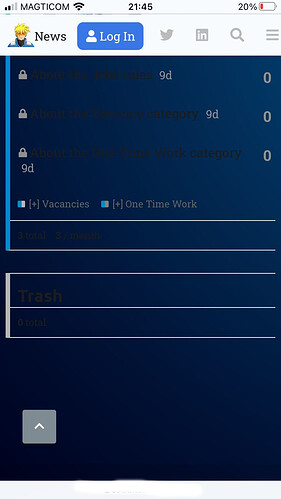](../../../assets/images/197703/0c4253cbde7545463568069298e3ca3de4240f04.jpeg "0fb1a2af-661e-411b-b5d1-5b6c846a51d6")

search button  

[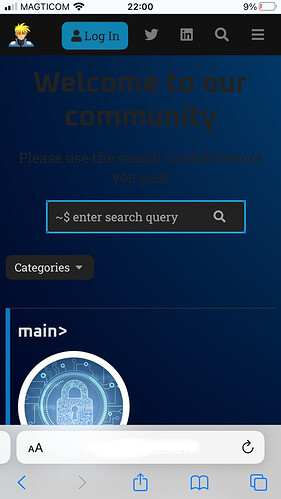](../../../assets/images/197703/f84e9a813eba16197d2e407c3be252a1facabfaa.jpeg "7310f019-61ed-4b38-981f-03e73e478302")

footer search

[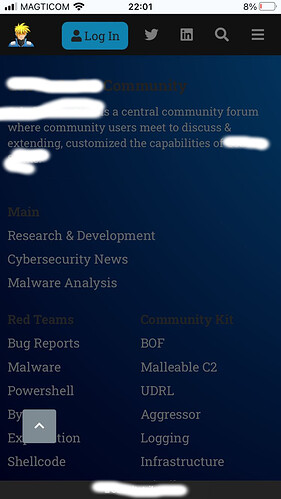](../../../assets/images/197703/dd7427383a2c4493593253f9aef229ff84453e3d.jpeg "181d2f20-91c2-48f2-9830-b4b7f7218f57")

---

### Post #235 by [jordan.vidrine](../../users/jordan.vidrine.md)
*Posted: 2022-02-16 18:08*

Hmm  , it’s hard to tell from your screenshot what page you are on, or what specific font you are referring to. In the image you have shared there are 4 or more different text items that could possible be customized.

You seem to be interested in customizing a good bit of Discourse for yourself, which is awesome 🙌

I would suggest to read through the following topics to get a better sense of how to customize the look and feel of your site 👍

[Beginner's guide to using Discourse Themes](https://meta.discourse.org/t/beginners-guide-to-using-discourse-themes/91966) [Site Management](/c/documentation/site-management/53)

> This is a crash course in Discourse theme basics. The target audience is everyone who is not familiar with Discourse themes. If you’ve already used Discourse theme / theme components, this guide is probably not something you need to read. What are themes and theme components? A theme or theme component is a set of files packaged together designed to either modify Discourse visually or to add new features. Let’s start with themes. Themes In general, themes are not supposed to be compatible … 

As well as these:

[Designer’s Guide to Discourse Themes ](https://meta.discourse.org/t/designers-guide-to-discourse-themes/152002)

[Developer’s guide to Discourse Themes](https://meta.discourse.org/t/developer-s-guide-to-discourse-themes/93648)

---

### Post #236 by [f1r4s](../../users/f1r4s.md)
*Posted: 2022-02-16 18:10*

Jordan, i see your above and last messages is all mention to read more, i understand that and i respect it, but please note i’m not designer and i spend almost a week customize the theme with my basic knowledge… and i’m not a rich to spend $500 customize on my “not profit community”.

so consider assist us in this will be apprecaite it not for me, for other user community who will definitely like your theme with them basic knowledge in customization.

---

### Post #237 by [jordan.vidrine](../../users/jordan.vidrine.md)
*Posted: 2022-02-16 18:14*

The best thing about Discourse is while there _is_ of course a learning curve (as with anything technical these days), you are highly capable of being able to customize the things you wish to customize. I promise!

We write these topics to help our community to learn how to do things on their own, and sometimes when things get a little too difficult, we are always here to help.

That being said, the help you are asking for can definitely be attained by reading through the topics I linked earlier!

---

### Post #239 by [Arta_S](../../users/Arta_S.md)
*Posted: 2022-02-21 07:46*

Is it possible to bring back the number of views alongside latest activity and number of responses?

---

### Post #240 by [jordan.vidrine](../../users/jordan.vidrine.md)
*Posted: 2022-02-21 12:41*

You should be able to do so in a theme component. I’m not at a computer right now, but I’d you inspect the topic list element with a browser inspector like chrome, you should be able to see which rows have been hidden with css. You can then target those rows to make them visible with a custom theme component.

---

### Post #241 by [yhmtsai](../../users/yhmtsai.md)
*Posted: 2022-03-13 21:59*

Hi, I use Air Theme with [Topic List Thumbnails Theme Component - theme - Discourse Meta](https://meta.discourse.org/t/topic-list-thumbnails-theme-component/150602/211) theme component grid mode. However, the topic arrangement is different grid view from other theme did.  
for example,  

[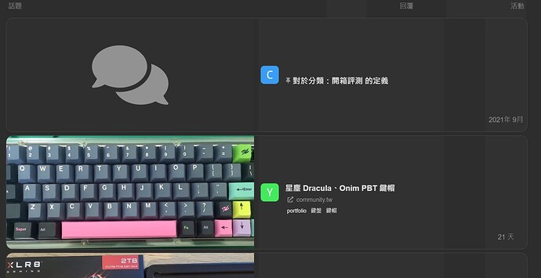](../../../assets/images/197703/3296e5435c4919f2814f0b546cfec404971b2a41.jpeg "image")

  
other theme with the component,  

[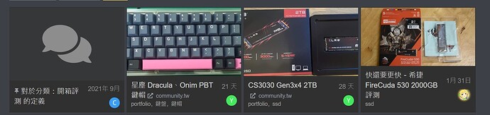](../../../assets/images/197703/bf0024b02913f586183cfde35c378960b421438f.jpeg "image")

Is it a issue or is there any suggested theme component to show the thumbnail of topic?

---

### Post #242 by [jordan.vidrine](../../users/jordan.vidrine.md)
*Posted: 2022-03-14 14:27*

Can you try the `list` mode instead? The air theme customizes the topic list, as does the thumbnails theme component, so the two will not interact together very well.

---

### Post #243 by [yhmtsai](../../users/yhmtsai.md)
*Posted: 2022-03-15 20:59*

Thanks, I try the list mode with air theme.  
It looks good with list mode  

[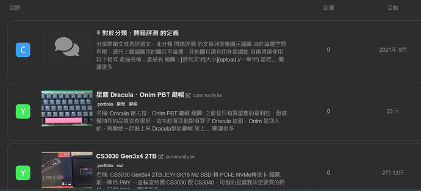](../../../assets/images/197703/d9c8fd257d4a2bc7f25f116e1085b3aa27e0e34e.jpeg "image")

---

### Post #244 by [cookieman768](../../users/cookieman768.md)
*Posted: 2022-03-25 00:07*

Is there a way to make the theme use higher resolution profile pictures on the category view? The images appear very fuzzy, and I would like to avoid just directly changing the theme, so I can receive updates.

[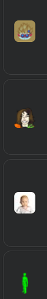](../../../assets/images/197703/bfd7e6f258522350ba89c2a4d1ac11fca2d90a08.png "image")

---

### Post #245 by [jordan.vidrine](../../users/jordan.vidrine.md)
*Posted: 2022-03-25 13:30*

That is a good question, I will look into this 👍

---

### Post #246 by [piffy](../../users/piffy.md)
*Posted: 2022-03-27 05:26*

Thanks for the theme! There’s a subtle mobile issue I’ve noticed. It _could_ be due to a change in the discourse source. I say this because the issue is present on my site (and the [theme-creator.io](http://theme-creator.io)) however it does not seem to be present on the test site linked in the OP

It’s a formatting issue on the topic list. I’ve highlighted a few issues.

  1. vertical alignment of title and postcount (red)
  2. gap between date and bottom of the element (green)
  3. horizontal gap between avatar and left side (blue)
  4. misaligment of dates (yellow) and postcount sometimes (not shown)
  5. forgot to annotate it, but the content sometimes spills over onto the post count number

[https://discourse.theme-creator.io/?preview_theme_id=6150&mobile_view=1](https://discourse.theme-creator.io/?preview_theme_id=6150&mobile_view=1)  

[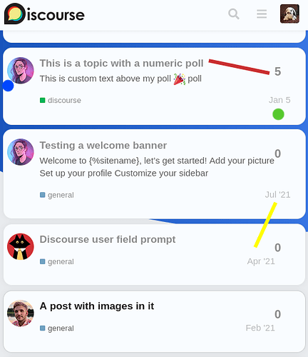](../../../assets/images/197703/66eba5743a84dd644f8165bbdd18ab6659597507.png "themecreator")

  
<https://discourse.jordanvidrine.com/?mobile_view=1>  

[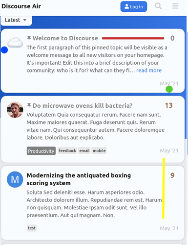](../../../assets/images/197703/7cdbe1f4f0b6227a4b9c0043150bdc8b4d33c24e.png "jordan")

I wanted to highlight the difference between topic-list-data in the inspector.  

[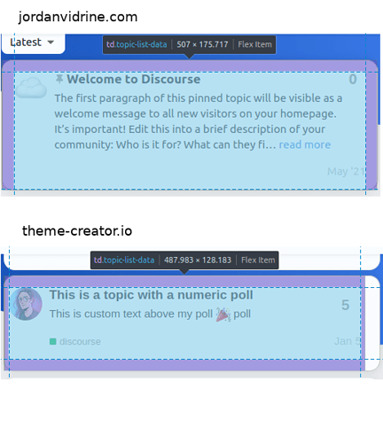](../../../assets/images/197703/def607e0e36f57b69dec39da29f3aa40c62de867.png "inspect")

Hope the issue is clear. Thanks again

---

### Post #250 by [ammar37](../../users/ammar37.md)
*Posted: 2022-04-05 05:51*

Hi [@jordan.vidrine](/u/jordan.vidrine) and contributors of this theme, would like to say thank you so much for such an amazing and modern theme!

I realised that there is a line on the topic summary card (for a particular topic), after clicking the topic and hitting the back button from the browser, is this intentional? it disappears if we refresh the browser.

[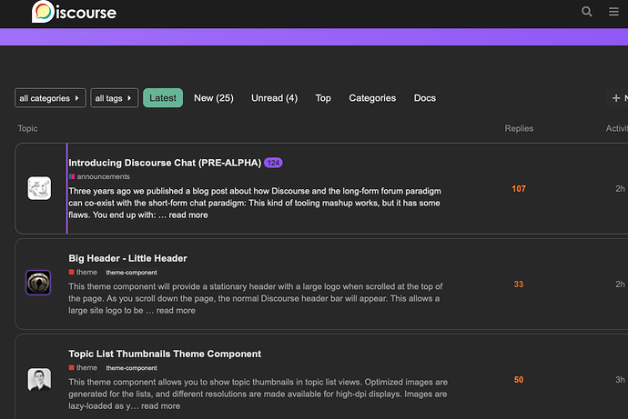](../../../assets/images/197703/62a9380fbda1f9f1c5751423c11debb21e9df330.png "Screenshot 2022-04-05 at 1.38.08 PM")

How do I remove it (is it coming from the styling of one of the CSS pseudo-classes?)

Thank you.

---

### Post #251 by [Petr_Mindl](../../users/Petr_Mindl.md)
*Posted: 2022-04-05 11:03*

Hey. Hey,  
Thank you for the nice theme, too.

But we try to have categories + some html block + listing of latest articles on our main page.  
I tried searching here on the forum, but I still don’t know how to achieve it. Can someone please guide me?

Should I create my own Component or how can we achieve this?

Thank you.

[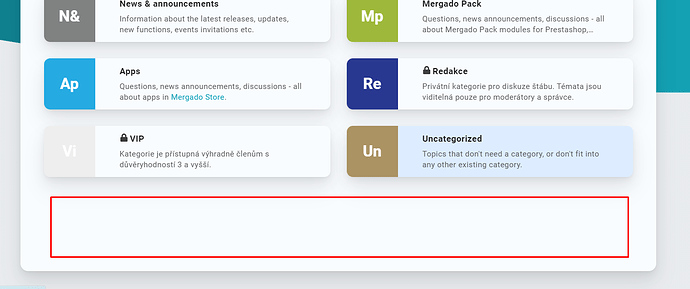](../../../assets/images/197703/96d203831dda2bcc63d4dcd15e6aebc767d1af45.png "image")

---

### Post #252 by [jordan.vidrine](../../users/jordan.vidrine.md)
*Posted: 2022-04-05 17:53*

I believe this is something worth adding into the theme. I will add some CSS for you to be able to select `categories & latest` as a category display setting, and the `latest topics` area will display below, like so:

[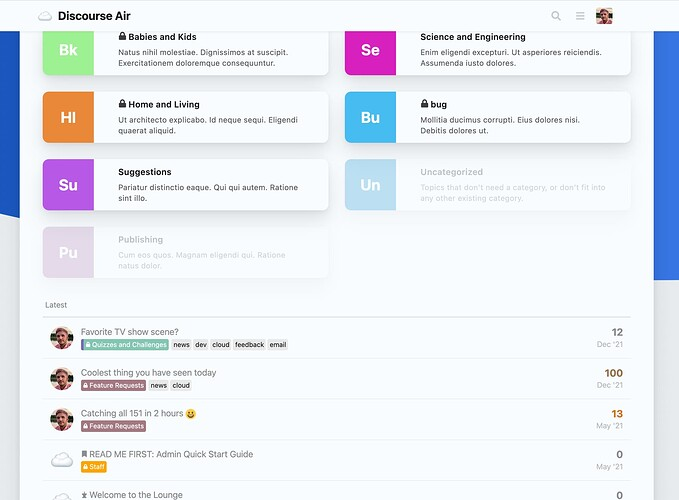](../../../assets/images/197703/0fa982c5c3c5f5eb5fcf89b708233ebbe78de302.jpeg "image")

---

### Post #254 by [Petr_Mindl](../../users/Petr_Mindl.md)
*Posted: 2022-04-06 06:32*

Thank you [@jordan.vidrine](/u/jordan.vidrine) that is amazing.

And can you help me with the other problem? We want to add custom HTML block into HP (probably somewhere below the main content - under Latest posts). How can I do that? I know that I must install theme not from repository but from my device to do some custom changes. But than my knowledge ends.

---

### Post #255 by [jordan.vidrine](../../users/jordan.vidrine.md)
*Posted: 2022-04-06 13:42*

 Petr_Mindl:

> HP

Im not familiar with what you mean by HP, could you explain?

 Petr_Mindl:

> (probably somewhere below the main content - under Latest posts)

If you want these types of customizations, I would read through this topic, it goes into detail about how to create components & customizations of this nature.

 [Beginner's guide to developing Discourse Themes](https://meta.discourse.org/t/developer-s-guide-to-discourse-themes/93648) [Developer Guides](/c/documentation/developer-guides/56)

> So, you want to create Discourse themes? Not sure where to start? Or maybe you have created Discourse themes before, but want to learn how to do even more cool things. Well, you’ve come to the right place 😉 Developer’s guide to Discourse Themes Subjects include a general overview of Discourse themes, creating and sharing Discourse themes, theme development examples, searching for and finding information / examples in the Discourse repository, and best practices. Prerequisites: …

---

### Post #256 by [jordan.vidrine](../../users/jordan.vidrine.md)
*Posted: 2022-04-06 13:46*

This is something Discourse Core added for A11Y, to know what was the latest topic you just visited. Because I re-structure the order of topic-list items here, it doesnt look correct.

I can take a look at this.

---

### Post #257 by [daemon](../../users/daemon.md)
*Posted: 2022-04-06 14:37*

 jordan.vidrine:

> Im not familiar with what you mean by HP, could you explain?

I think he is meaning “homepage”.

 jordan.vidrine:

> If you want these types of customizations, I would read through this topic, it goes into detail about how to create components & customizations of this nature.

I read through all posts but couldn’t find the solution for this (look at your post [Air Theme - #252 by jordan.vidrine](https://meta.discourse.org/t/discourse-air-theme/197703/252) ). Or do you implement it by yourself with a next update? Maybe as a new component?  
Can you please direct me to the post where it describes how to set it like this?

---

### Post #258 by [jordan.vidrine](../../users/jordan.vidrine.md)
*Posted: 2022-04-06 14:58*

 daemon:

> Can you please direct me to the post where it describes how to set it like this?

If you update the `modern-category-boxes` theme component on your site, this should now be available.

You would set your category layout to `categories & latest` in order to see the list under the boxes.

---

### Post #259 by [daemon](../../users/daemon.md)
*Posted: 2022-04-06 15:15*

Thank you very much! I must have been blind. 

---

### Post #260 by [ammar37](../../users/ammar37.md)
*Posted: 2022-04-08 02:45*

Thank you so much for your time.

 jordan.vidrine:

> This is something Discourse Core added for A11Y, to know what was the latest topic you just visited. Because I re-structure the order of topic-list items here, it doesnt look correct.
> 
> I can take a look at this.

---

### Post #261 by [Matze](../../users/Matze.md)
*Posted: 2022-04-08 08:30*

Do you think there is a easy solution to show categories and latest side by side in columns like on the standard theme? Thank you!

---

### Post #262 by [daemon](../../users/daemon.md)
*Posted: 2022-04-10 14:20*

Hi [@jordan.vidrine](/u/jordan.vidrine)

I have installed your theme but I’m missing the Dark Light Theme Toggle (and Auto Detect) in the hamburger menu like it is in your screenshot.

 [☁️ Discourse Air Theme](https://meta.discourse.org/t/discourse-air-theme/197703#dark-light-scheme-toggle-2) [theme](/c/theme/61)

>  Summary Discourse Air Theme is a clean & modern theme with a handful of theme-components included to enhance your forum! 🛠️ Repository Link <https://github.com/discourse/discourse-air> 📖 New to Discourse Themes? [Beginner’s guide to using Discourse Themes](https://meta.discourse.org/t/beginners-guide-to-using-discourse-themes/91966) Install this theme Light Mode [[Light Mode]](../../../assets/images/197703/52297fe2ab838db1902f6acbbbdee53d1271a840.png "Light Mode") Dark Mode [[Dark Mode]](../../../assets/images/197703/7b592c6f1f901dce0ca9e9cbd01c8f2734847fe9.png "Dark Mode") Categories Page [[Categories Page]](../../../assets/images/197703/bdb109def295c9954125124b9fc33be49d12e4f2.png "Categories Page") This theme includes a handful of components to enhance your forum as well. … 

How can I enable it?

EDIT:  
Found it!  
It was this setting which hides the setting inside the hamburger menu.  
`Add color scheme toggle button to site header`

EDIT2:

With the dark color scheme is something wrong (or maybe it’s something with my pc).

With Firefox all colors are correct, but with Chromium-based browser the colors are somehow different.  
It’s a fresh install from Vivaldi, so no cache was active.  
Please have a look at the screenshot.

For some reasons I can’t upload any image (png).  

 [ImgBB](https://ibb.co/yg8NLWx) 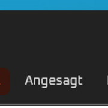

### [airtheme-edge hosted at ImgBB](https://ibb.co/yg8NLWx)

Image airtheme-edge hosted in ImgBB

 [ImgBB](https://ibb.co/N6P4v4N) 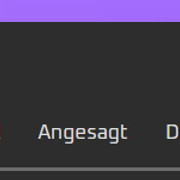

### [airtheme-firefox hosted at ImgBB](https://ibb.co/N6P4v4N)

Image airtheme-firefox hosted in ImgBB

 [ImgBB](https://ibb.co/qYRnXDG) 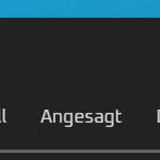

### [airtheme-vivaldi hosted at ImgBB](https://ibb.co/qYRnXDG)

Image airtheme-vivaldi hosted in ImgBB

---

### Post #263 by [jordan.vidrine](../../users/jordan.vidrine.md)
*Posted: 2022-04-11 14:51*

You may want to go into your specific user preferences page and make sure the `dark-theme` that is selected is the same across the browswers. Each browser stores its own user-setting so I am imagining this is what the issue is.

---

### Post #264 by [daemon](../../users/daemon.md)
*Posted: 2022-04-11 15:59*

I’m sorry but this can’t be the solution because

  1. I did a fresh install of the OS and browsers on my Laptop, and
  2. I wasn’t logged in and I saw the color differences.

---

### Post #265 by [jordan.vidrine](../../users/jordan.vidrine.md)
*Posted: 2022-04-11 16:30*

Have you tried logging in to make sure?

---

### Post #266 by [daemon](../../users/daemon.md)
*Posted: 2022-04-11 16:42*

For which reason?  
The colors are different in Chromium based browser.

---

### Post #267 by [jordan.vidrine](../../users/jordan.vidrine.md)
*Posted: 2022-04-11 17:05*

Have you tried clearing the cache? And can you share a link?

---

### Post #268 by [daemon](../../users/daemon.md)
*Posted: 2022-04-11 18:20*

I don’t need to clear the cache because I installed the browser 5 seconds before I visited the site.

I could share a link but I don’t use it anymore so the problem for me is solved.

---

### Post #269 by [Petr_Mindl](../../users/Petr_Mindl.md)
*Posted: 2022-04-12 06:37*

 jordan.vidrine:

> Im not familiar with what you mean by HP, could you explain?

Thx for reply. I ment Homepage.

 jordan.vidrine:

> If you want these types of customizations, I would read through this topic, it goes into detail about how to create components & customizations of this nature.

Thanks for the advice. I’ll keep looking deeper.

---

### Post #270 by [daemon](../../users/daemon.md)
*Posted: 2022-04-12 12:06*

 Matze:

> Do you think there is a easy solution to show categories and latest side by side in columns like on the standard theme? Thank you!

I second this! 👍

Is there an easy way to it?

---

### Post #271 by [bksubhuti](../../users/bksubhuti.md)
*Posted: 2022-04-13 13:10*

1. How do I show views in the topic list (that column is missing) ?
  2. Is there a way to show the user and excerpt of the content of the latest most post when showing latest? Or could that be a feature?

When I look at my latest topic list, I’m interested in a sneak-peek at the content of the last person who posted rather than the content of the original post.

---

### Post #272 by [jordan.vidrine](../../users/jordan.vidrine.md)
*Posted: 2022-04-13 13:54*

1. 

[Air Theme](../../../assets/images/197703/805f7f3a276e2bdbe1bc007910ca1681677b693d_2_1332x1000.jpeg) [Theme](/c/theme/61)

> I believe this should work: .full-width .contents .topic-list thead th.posts { width: 10%; } .full-width .contents .topic-list thead th.activity { width: 10%; order: 4; } th.num.views { width: 10%; order: 3; display: block; } .full-width .contents .topic-list tbody tr:not(.topic-list-item-separator) td.posts { width: 10%; order: 2; } .topic-list .views { width: 10%; order: 3; } .full-width .contents .topic-list tbody tr:not(.topic-list-item-separator) td.age { width: 10%; order: 4; } 

  2. I’ll have to think about that one!

---

### Post #273 by [bksubhuti](../../users/bksubhuti.md)
*Posted: 2022-04-13 14:26*

I exported so that I’m able to edit the CSS. There is quite a lot.  
Should I just paste that section in the common or just the desktop or in the header?  
or carefully overwrite what is there?

---

### Post #274 by [jordan.vidrine](../../users/jordan.vidrine.md)
*Posted: 2022-04-13 15:38*

I would create a new theme-component in your theme area of the admin panel and add to the desktop css page.

---

### Post #275 by [daming](../../users/daming.md)
*Posted: 2022-04-24 11:20*

My site is every post must be reviewed, but when I update the theme to last, user’s interface is show “post need review”, I don’t want user to see this interface, and try turn it off, but it still here.  

[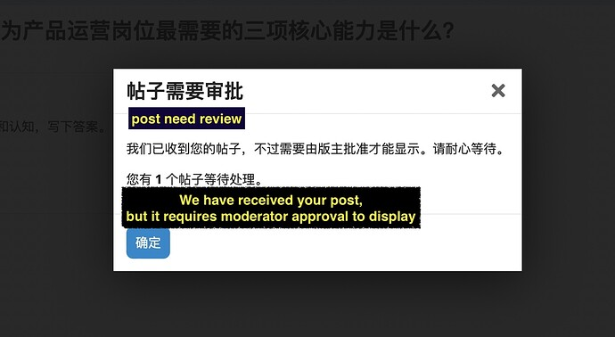](../../../assets/images/197703/2543b610fba9d92a7cbdba547bf332a5d5b0d4fd.jpeg "审批")

  

[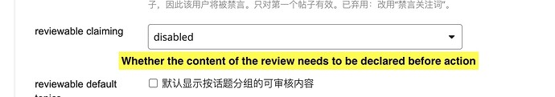](../../../assets/images/197703/77f4ca7b2f2aaeebb674cd93fdd11234acb26c5d.jpeg "声明")

---

### Post #276 by [Jagster](../../users/Jagster.md)
*Posted: 2022-04-29 20:06*

CSS-wizards… how do I get mobile view a bit less minimalistic and clear, it should look more like desktop version? I’m looking for some space on the left hand side.

This is mobile:

[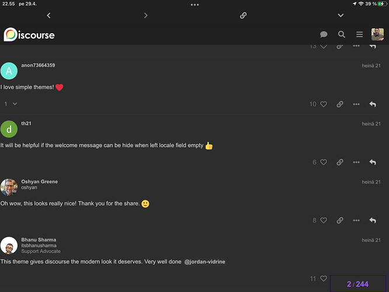](../../../assets/images/197703/d6c87c0255df334a41d1c746e294f9fc97d6793b.png "kuva")

And this is desktop:

[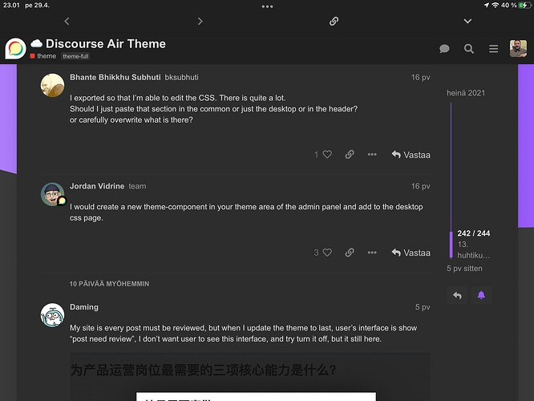](../../../assets/images/197703/805f7f3a276e2bdbe1bc007910ca1681677b693d.jpeg "kuva")

Some margins would make it look better and easier readible.

This isn’t new thing. It has been like this ages, but now my users have started complaining about it.

---

### Post #277 by [awesomerobot](../../users/awesomerobot.md)
*Posted: 2022-04-30 00:08*

what kind of device is that? seems large enough to handle the desktop view well, mobile’s really meant for screens under 600px wide or so

---

### Post #278 by [Jagster](../../users/Jagster.md)
*Posted: 2022-04-30 06:06*

iPad. But I used it only to get screenshot easily, because smaller devices aren’t ment to writing… But same happends with iPhone, other ecosystems aren’t familiar to me — but I’m quite sure majority of my users aren’t at Apple-camp.

And when it is matter of left hand side, size of screen doesn’t matter as you know 😉 Only that matters there is zero marginal.

---

### Post #279 by [eiJil](../../users/eiJil.md)
*Posted: 2022-06-01 15:39*

Got the same problem here, it’s been like this for months on my 2 android phones.  
If a user log out, the UI will become normal, but when log in, the UI will become like this.

---

### Post #280 by [av203](../../users/av203.md)
*Posted: 2022-06-23 09:26*

I really like this theme and considering to use it, but with some modifications.

The theme is currently [not pointing towards a License file](https://github.com/discourse/discourse-air/blob/main/about.json#L3). I’m assuming that since it’s officially published under Discourse, it’s a GNU license.

Is that indeed the case?

---

### Post #281 by [Usman_Perwaiz](../../users/Usman_Perwaiz.md)
*Posted: 2022-06-27 08:27*

Hi, [@awesomerobot](/u/awesomerobot). Thank you for creating this theme! It is clean and lovely. I am wondering if we can remove the gradient from the banner. Is there a way in theme settings to do that?

---

### Post #282 by [pierreozoux](../../users/pierreozoux.md)
*Posted: 2022-07-06 08:19*

[github.com/discourse/discourse-air](https://github.com/discourse/discourse-air/blob/main/LICENSE)

#### [LICENSE](https://github.com/discourse/discourse-air/blob/main/LICENSE)

[`main`](https://github.com/discourse/discourse-air/blob/main/LICENSE)
    
    
                        GNU GENERAL PUBLIC LICENSE
                           Version 2, June 1991
    
     Copyright (C) 1989, 1991 Free Software Foundation, Inc.,
     51 Franklin Street, Fifth Floor, Boston, MA 02110-1301 USA
     Everyone is permitted to copy and distribute verbatim copies
     of this license document, but changing it is not allowed.
    
                                Preamble
    
      The licenses for most software are designed to take away your
    freedom to share and change it.  By contrast, the GNU General Public
    License is intended to guarantee your freedom to share and change free
    software--to make sure the software is free for all its users.  This
    General Public License applies to most of the Free Software
    Foundation's software and to any other program whose authors commit to
    using it.  (Some other Free Software Foundation software is covered by
    the GNU Lesser General Public License instead.)  You can apply it to
    your programs, too.
    
    

This file has been truncated. [show original](https://github.com/discourse/discourse-air/blob/main/LICENSE)

---

### Post #283 by [DeanGibbs](../../users/DeanGibbs.md)
*Posted: 2022-08-02 11:20*

I have same problem 🙂 maybe it is solved already?

---

### Post #285 by [ammar37](../../users/ammar37.md)
*Posted: 2022-08-03 08:55*

I don’t think it has NOT been resolved yet

---

### Post #286 by [JammyDodger](../../users/JammyDodger.md)
*Posted: 2022-08-03 09:01*

That is an intentional thing. 👍 You should see a similar one here on Meta in the default Light theme too. It’s to show which topic you were last in, and then disappears once you swop pages/enter another topic.

It is likely that it can be hidden with a little CSS, but when I try and inspect it in my browser it disappears too quick for me to identify. 🙂 I’ll see what I can find out. 👍

---

[← Previous](197703.md) | **Page 2 of 8** | [Next →](197703-page-3.md)
