[🏠 Home](../../index.md) | [📋 Latest](../../latest/index.md) | [🔥 Top](../../top/replies/index.md) | [👥 Users](../../users/index.md)

[Home](../../index.md) » [Theme](../../c/theme/index.md) » Air Theme

---

# Air Theme (Page 3 of 8)

> **Category:** Theme
> **Author:** Don
> **Created:** 2021-07-20 20:24

[← Previous](197703-page-2.md) | **Page 3 of 8** | [Next →](197703-page-4.md)

---

### Post #287 by [Don](../../users/Don.md)
*Posted: 2022-08-03 09:04*

Hello [@ammar37](/u/ammar37),

You can hide it with CSS.  
Create a new component in admin and paste this in the CSS section:
    
    
    .topic-list .main-link.focused {
      box-shadow: none;
    }

---

### Post #288 by [ammar37](../../users/ammar37.md)
*Posted: 2022-08-03 09:14*

 JammyDodger:

> That is an intentional thing. 👍 You should see a similar one here on Meta in the default Light theme too. It’s to show which topic you were last in, and then disappears once you swop pages/enter another topic.
> 
> It is likely that it can be hidden with a little CSS, but when I try and inspect it in my browser it disappears too quick for me to identify. 🙂 I’ll see what I can find out. 👍

But the default light theme looks okay because it’s displaying the line at the far left edge of last-visited topic, as opposed to the Discourse Air Theme which is showing in between user avatar and topic text.

I was trying to identify the CSS too… 😦

---

### Post #289 by [ammar37](../../users/ammar37.md)
*Posted: 2022-08-03 09:15*

 Don:

> Hello [@ammar37](/u/ammar37),
> 
> You can hide it with CSS.  
>  Create a new component in admin and paste this in the CSS section:
>     
>     
>     .topic-list .main-link.focused {
>       box-shadow: none;
>     }
>     

Thanks for your help. I tried adding the css into an existing component (which I use to modify css for this theme), the code unfortunately does not seem to work so far.

[EDIT] The code is working, I actually copied your older code (.topic-list .main-**outlet**.focused) instead of the latest one (.topic-list .main-**link**.focused)

Thank you so much. Appreciate your help [@Don](/u/don) 🙏

---

### Post #290 by [Don](../../users/Don.md)
*Posted: 2022-08-03 09:25*

I tried it now with Discourse Air theme and it works fine for me.  
Could you try add it again? I changed the code in the first few minutes maybe you was fast and copy the wrong one.

<https://d11a6trkgmumsb.cloudfront.net/original/4X/3/4/6/346d4a649fd9db20ae0f8444786b4dc403a7c9a5.mov>

---

### Post #291 by [ammar37](../../users/ammar37.md)
*Posted: 2022-08-03 09:33*

 Don:

> I tried it now with Discourse Air theme and it works fine for me.  
>  Could you try add it again? I changed the code in the first few minutes maybe you was fast and copy the wrong one.

Nice. It’s working great now… Yeah, I actually copied your old code (.topic-list .main-**outlet**.focused) instead of (.topic-list .main-**link**.focused)

Thank you so much. Appreciate your help 🙏

---

### Post #292 by [Lachlan_Wintour](../../users/Lachlan_Wintour.md)
*Posted: 2022-08-04 19:39*

Is it possible to change the colour of the dark mode background? I changed it using a different colour palette (as seen here).  

  
But it is still the default blue in light mode.  

  
Thanks in advance.

---

### Post #293 by [darkpixlz](../../users/darkpixlz.md)
*Posted: 2022-08-05 04:54*

Change your color scheme, the circle follows tertiary and tertiary=hover

---

### Post #294 by [Idan](../../users/Idan.md)
*Posted: 2022-09-03 06:36*

is there an option for custom HTML to the head in this theme?

---

### Post #295 by [Petr_Mindl](../../users/Petr_Mindl.md)
*Posted: 2022-09-06 14:02*

 Jordan Vidrine:

> I believe this is something worth adding into the theme. I will add some CSS for you to be able to select `categories & latest` as a category display setting, and the `latest topics` area will display below, like so:

Hello again [@jordan.vidrine](/u/jordan.vidrine)

Is it possible to make this section visible **on mobile**? Category boxes + Latest post below.

Thank you in advance. 😇

---

### Post #296 by [BaneWilliams](../../users/BaneWilliams.md)
*Posted: 2022-09-09 04:31*

Hey there,

I really would like to use this theme, but on the topics view user avatars are VERY pixellated. Is there any way to make it use a higher quality user avatar image?

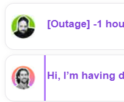

---

### Post #297 by [ChrisTucker](../../users/ChrisTucker.md)
*Posted: 2022-09-18 05:24*

The theme isn’t taking the light logo when I switch to light theming. It only retains the dark logo.

---

### Post #298 by [jordan.vidrine](../../users/jordan.vidrine.md)
*Posted: 2022-09-20 21:05*

The following merged PR fixes the issue with clicked topic list items & selected topic list item styling.

[github.com/discourse/discourse-air](../../../assets/images/197703/2273f90b629a4fd36a4e93a346d03b20a16317bb_2_345x150.png)

####  [FIX: Adjust location of selected & focus styling of topic list items](../../../assets/images/197703/2273f90b629a4fd36a4e93a346d03b20a16317bb_2_345x150.png)

`main` ← `selected-fixes`

merged 09:05PM - 20 Sep 22 UTC

[  jordanvidrine ](https://github.com/jordanvidrine)

[ +24 -0 ](https://github.com/discourse/discourse-air/pull/22/files)

### After -56a8a530-0f39-47f2-8a44-598e6aeb2460.png)  ### Before  

---

### Post #299 by [ChrisTucker](../../users/ChrisTucker.md)
*Posted: 2022-09-21 06:36*

The header text doesn’t contrast off of the background color. Probably a quick tweak of a class name somewhere is needed.  

[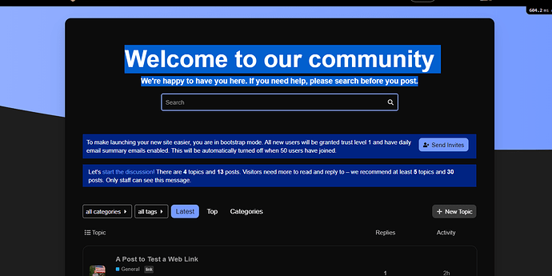](../../../assets/images/197703/56afde77b3bb8a1b4977da7b283980cf164a1e59.png "Capture")

  
Here I’ve got the header text highlighted to bring it out. Otherwise it’d be completely hidden.

Otherwise, I love the theme!

---

### Post #300 by [eiJil](../../users/eiJil.md)
*Posted: 2022-09-22 10:00*

Thanks for this great theme! But I got one tiny problem here:

[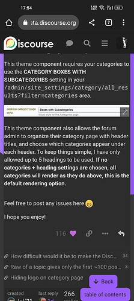](../../../assets/images/197703/c5a9d7095839ce2f42626b0e3563db37a62272d0.jpeg "Screenshot_2022-09-22-17-54-35-38_40deb401b9ffe8e1df2f1cc5ba480b12")

  
This is what the theme looks like once I logged in.

[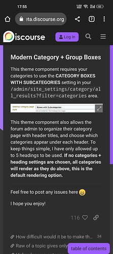](../../../assets/images/197703/9c009ef7963d9159546777370b0a5b238424f747.jpeg "Screenshot_2022-09-22-17-55-08-34_40deb401b9ffe8e1df2f1cc5ba480b12")

  
This is when I logged out.

It seems that the margins are different. I know nothing about web dev.

My phone is OnePlus 9 pro.

---

### Post #301 by [jordan.vidrine](../../users/jordan.vidrine.md)
*Posted: 2022-09-22 14:15*

Sorry about that! I believe this may have to do with the new sidebar we have enabled on meta. I have disabled this theme for selection on meta for now.

---

### Post #302 by [eiJil](../../users/eiJil.md)
*Posted: 2022-09-22 14:43*

Well, actually this issue has existed for like 2 months.

---

### Post #303 by [jordan.vidrine](../../users/jordan.vidrine.md)
*Posted: 2022-09-22 17:09*

Oh wow, sorry about that! I’ll look into it when I get some free space.

Thanks!

---

### Post #304 by [Moolli](../../users/Moolli.md)
*Posted: 2022-10-10 17:30*

Hi, love the theme! One question, not sure if this is the right place to post… but is there a way to put the categories on the left and recent conversation on the right? Would appreciate any help since I am really not technical and have not found a way to change it. Thank you!

---

### Post #305 by [1378434153](../../users/1378434153.md)
*Posted: 2022-10-11 02:12*

Great theme! thanks a lot  
Can I change the background to images?  
I uploaded the picture, but it doesn’t fit  

---

### Post #306 by [jordan.vidrine](../../users/jordan.vidrine.md)
*Posted: 2022-10-11 18:34*

You will want to add some custom `css`:
    
    
    html .background-container {
        background-size: cover;
    }

---

### Post #307 by [jordan.vidrine](../../users/jordan.vidrine.md)
*Posted: 2022-10-11 18:37*

The only way to do this would be to disable the component that customized the category page. You will want to go to `https://discourse.jordanvidrine.com/admin/customize/themes`, click on `Components` and find `Modern Category + Group Boxes`. Once on that page, scroll to the bottom and click on `Disable`

---

### Post #308 by [1378434153](../../users/1378434153.md)
*Posted: 2022-10-12 01:55*

Okay. But the theme can not to custom 😵

---

### Post #309 by [1378434153](../../users/1378434153.md)
*Posted: 2022-10-12 06:26*

One more question, I need to show the number of views in the topic list, please tell me how to do that thank you very much

---

### Post #313 by [Moolli](../../users/Moolli.md)
*Posted: 2022-10-12 16:44*

Hi Jordan, thank you for your response! I really appreciate it!

---

### Post #315 by [mati_h](../../users/mati_h.md)
*Posted: 2022-10-12 18:54*

Hey [@jordan.vidrine](/u/jordan.vidrine) thanks for the great theme! I’m wondering if there’s a way to show categories and latest in the homepage? let us know.

---

### Post #316 by [wendellverli](../../users/wendellverli.md)
*Posted: 2022-11-04 05:35*

My theme is [discourse.fotografos.online](https://discourse.fotografos.online/) \- for the life of me WHY IS THE TOP white? Where is my header!??  someone help! It’s a fresh install! what do I do to add an image there instead of solid blue?

---

### Post #317 by [eddy2](../../users/eddy2.md)
*Posted: 2022-11-05 08:07*

[@jordan.vidrine](/u/jordan.vidrine) Is it possible to add a Views column? If so, where can I access this option? Thanks.

---

### Post #318 by [jordan.vidrine](../../users/jordan.vidrine.md)
*Posted: 2022-11-07 12:49*

[Air Theme](../../../assets/images/197703/805f7f3a276e2bdbe1bc007910ca1681677b693d_2_1332x1000.jpeg) [Theme](/c/theme/61)

> I believe this should work: .full-width .contents .topic-list thead th.posts { width: 10%; } .full-width .contents .topic-list thead th.activity { width: 10%; order: 4; } th.num.views { width: 10%; order: 3; display: block; } .full-width .contents .topic-list tbody tr:not(.topic-list-item-separator) td.posts { width: 10%; order: 2; } .topic-list .views { width: 10%; order: 3; } .full-width .contents .topic-list tbody tr:not(.topic-list-item-separator) td.age { width: 10%; order: 4; }

---

### Post #321 by [eddy2](../../users/eddy2.md)
*Posted: 2022-11-24 03:20*

Thank you for the reply and for sending this info. I only wish I knew how to apply this to the theme!

---

### Post #322 by [jordan.vidrine](../../users/jordan.vidrine.md)
*Posted: 2022-12-02 15:45*

1. Go here `admin/customize/themes`
  2. Click on components
  3. Click Install
  4. Click create new & give it a name
  5. Click on the new component in the components list
  6. Click `Edit Html/css`
  7. Add the linked code above to the common css file.
  8. Add this new component to the currently used theme

---

### Post #323 by [eddy2](../../users/eddy2.md)
*Posted: 2022-12-06 17:28*

Thank you. I really appreciate your help.

---

### Post #324 by [eddy2](../../users/eddy2.md)
*Posted: 2022-12-08 06:42*

I have not gotten the HTML/CSS to work with the current theme. However, I can see the “Views” section when previewing the new component. The theme also shows the new component as added.

Here is a short video: <https://share.cleanshot.com/ekutkT>

Please let me know if you see something I am doing wrong with the setup when time allows.

Thanks for all your help.

---

### Post #325 by [Brady1](../../users/Brady1.md)
*Posted: 2022-12-13 02:37*

where do I add this? this will fix the background image being cutoff like in the image, yes?  

[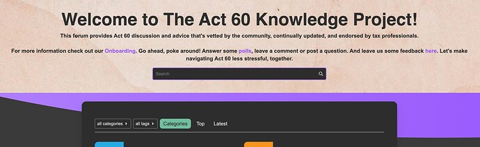](../../../assets/images/197703/f1e67dfc01f584c91f8e5a07e0111f870ed074b8.jpeg "Screen Shot 2022-12-12 at 9.37.35 PM")

---

### Post #326 by [jordan.vidrine](../../users/jordan.vidrine.md)
*Posted: 2022-12-13 13:33*

You could go through the following and add the css there:

 jordan.vidrine:

>   * Go here `admin/customize/themes`
>   * Click on components
>   * Click Install
>   * Click create new & give it a name
>   * Click on the new component in the components list
>   * Click `Edit Html/css`
>   * Add the linked code above to the common css file.
>   * Add this new component to the currently used theme
>

---

### Post #327 by [UnitedFreedom](../../users/UnitedFreedom.md)
*Posted: 2022-12-15 02:58*

# How to add the “View” column in the topics list.

I am in no way a developer, or programmer. I spent a few hours playing around with the CSS code using the Inspect Element feature in Google Chrome. I was able to get the view column to display correctly, and also did some re-sizing of every column to my preferred liking. You are more than welcome to adjust the width in the CSS code below. I have also added comments in the code so you can easily tell which code is for which column. For each column, there are 2 areas (Header, and row). These widths need to match.

I hope this helps all of you: [@daming](/u/daming) [@bksubhuti](/u/bksubhuti) [@eddy2](/u/eddy2)

 Daming:

> I have a suggestion: maybe can add a data display of views to the main interface of the post. This gives users direct access to the most popular posts in the community.

 Bhante Bhikkhu Subhuti:

> How do I show views in the topic list (that column is missing) ?

 Eddy:

> Is it possible to add a Views column? If so, where can I access this option? Thanks.

## Instructions

### 1\. Create a new component.

 jordan.vidrine:

>   * Go here `admin/customize/themes`
>   * Click on components
>   * Click Install
>   * Click create new & give it a name
>   * Click on the new component in the components list
>   * Add this new component to the currently used theme
>   * Click `Edit Html/css`
>   * ~~Add the linked code above to the common css file.~~
> 

### 2\. Copy this CSS

Use this updated CSS below instead of the code provided by [@jordan.vidrine](/u/jordan.vidrine) above.

**Option A)** Add the Views column for only Desktop (Recommended)

  * Add the CSS code into the `Desktop` tab.

**Option B)** Add the Views column for both Desktop & Mobile.

  * Add the CSS code into the `Common` tab.

**Option C)** Add the Views column for only Mobile.

  * Add the CSS code into the `Mobile` tab.

#### Note: If you chose Option B or C…

On mobile the 3 columns (Replies, Views, Activity) takes up to much room and is squished. If you need this for mobile, I suggest removing one of the 3 columns. You can do so by adding `Display: none` to both areas (Header, Rows) in the CSS code below for the column you want to hide.
    
    
    /* [Topic] */
    
        /* Topic Header */
        .full-width .contents .topic-list .topic-list-body .topic-list-item .topic-list-data.main-link {
            width: 66%;
        }
        
        /* Topic Row */
        .full-width .contents .topic-list .topic-list-header .topic-list-data.default {
            width: 66%;
        }
    
    /* [Replies] */
    
        /* Replies Header */
        .full-width .contents .topic-list .topic-list-header .topic-list-data.posts {
            width: 7%;
            order: 2;
        }
        
        /* Replies Rows */
        .full-width .contents .topic-list .topic-list-body .topic-list-item .topic-list-data.posts {
            width: 7%;
            order: 2;
        }
    
    /* [Views] */
    
        /* Views Header */
        .full-width .contents .topic-list .topic-list-header .topic-list-data.views {
            display: block;
            width: 7%;
            order: 3;
        }
        
        /* Views Rows */
        .full-width .contents .topic-list .topic-list-body .topic-list-item .topic-list-data.views {
            width: 7%;
            order: 3;
            display: flex;
            justify-content: center;
            align-items: center;
        }
    
    /* [Activity] */
    
        /* Activity Header */
        .full-width .contents .topic-list .topic-list-header .topic-list-data.activity {
            display: block;
            width: 7%;
            order: 4;
        }
        
        /* Activity Rows */
        .full-width .contents .topic-list .topic-list-body .topic-list-item .topic-list-data.age {
            width: 7%;
            order: 4;
        }
    

[@jordan.vidrine](/u/jordan.vidrine) If you have any revisions to the CSS I wrote please let me know. I don’t fully know what I’m doing…but it works lol.

---

### Post #328 by [UnitedFreedom](../../users/UnitedFreedom.md)
*Posted: 2022-12-15 06:01*

### Here is my CSS changes to improve the Mobile View.

I absolutely love this theme, but noticed some little minor odd bits, so I also added the following CSS to make it look a little nicer in my perspective. I hope this helps someone else with the same preferences.

#### Here is the Original (Unedited)

[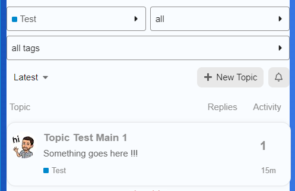](../../../assets/images/197703/466a811652ba917f27d86c63b4616d8c8d79827c.png "image")

#### Note the following in the picture above:

  * The number `1` which represents the Replies is to far to the left.
  * The topic bubble is slightly overlapping the blue background.
  * There is no padding between all the content and the blue background.
  * The blue background does not look nice in the category page. I love it on the home page though.

#### Here is the CSS code I added in the `Mobile` tab.
    
    
    /* Add some padding to the Category, Sub-Category, Tags, searc, latest, new topic, and notification area*/
    .list-controls {
        padding: 5px;
    }
    
    /* Adds some padding to the Topics area */
    div#list-area {
        padding: 6px;
    }
    
    /* Aligns the Replies number more to the right */
    .full-width .contents .topic-list .topic-list-body .topic-list-item .topic-list-data.posts {
        float: right;
    }
    
    

#### Updated (After adding the CSS)

[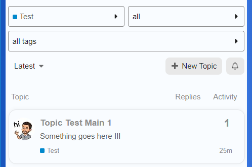](../../../assets/images/197703/c13d51fcf4e9b343c83254bf159872168c813702.png "image")

#### If you too, prefer to remove the blue background, here is the code to only remove it from the category pages.
    
    
    /* Removes the blue background for category only */
    html .category .background-container {
        background: #fff;
        clip-path: none;
    }
    

#### Here is what It looks like with all the changes.

[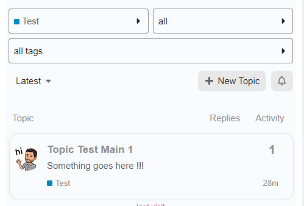](../../../assets/images/197703/5c58c73320e52aeb7ad479a095af714e4de7fd84.png "image")

---

### Post #329 by [UnitedFreedom](../../users/UnitedFreedom.md)
*Posted: 2022-12-15 06:36*

### Flagging Mobile Issue

On mobile, there is a Category dropdown. When clicked and either Latest, Unread, or Top is selected, you cant select Categories from the dropdown again.

### 1.Before

[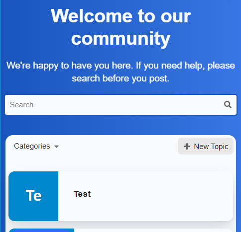](../../../assets/images/197703/74dd3789f15d0ac0b15cc48b2fc61837f746fe9a.png "image")

### 2.When the dropdown menu is clicked

[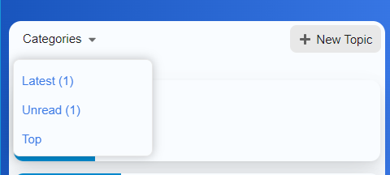](../../../assets/images/197703/61cd8fa5c0aa40daec62f8f38fe476789d64ae6f.png "image")

### 3.After you click

[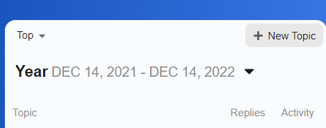](../../../assets/images/197703/c90dd5326e8c901fa221bddcd041f4b89d7ace44.png "image")

### 4\. Dropdown menu (missing Categories)

[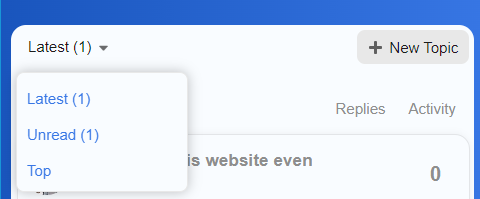](../../../assets/images/197703/56f33eb671e50d51cf66064a70fe2fa3d1a0ef3b.png "image")

At this point, a user is unable to select the dropdown and choose Categories again.

Any advise on how to fix this issue?

Thanks

---

### Post #330 by [jordan.vidrine](../../users/jordan.vidrine.md)
*Posted: 2022-12-15 12:26*

[@UnitedFreedom](/u/unitedfreedom)

👏 👏 👏

Thanks a ton for posting these helpful instructions for those wanting the view column to be visible.

 James:

> On mobile, there is a Category dropdown. When clicked and either Latest, Unread, or Top is selected, you cant select Categories from the dropdown again.

Do you have a link to you site? I am trying this on mine locally and am unable to reproduce.

---

### Post #331 by [Heliosurge](../../users/Heliosurge.md)
*Posted: 2023-01-22 10:56*

Thank for this complete polished full theme.

I am having an issue with featured topics component not showing the cards. I would like to also have the option to have it only show featured topics within specified categories. Which in theory it should or even in the variants based on the official one.

see pic below

[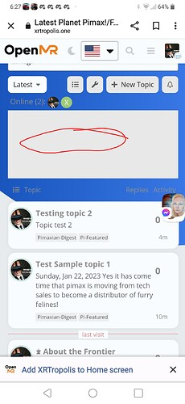](../../../assets/images/197703/b7086c079000f59a37e50740108755dcc1713d04.jpeg "Screenshots_2023-01-22-06-28-09")

I can if needed dm you a link to take a look. Both test topics have pics that are featured; though using custom tag pi-featured. Running test-passed

---

### Post #332 by [jordan.vidrine](../../users/jordan.vidrine.md)
*Posted: 2023-01-23 12:57*

 Dan DeMontmorency:

> I can if needed dm you a link to take a look.

Please send a link, Ill take a look 👍

---

### Post #333 by [Heliosurge](../../users/Heliosurge.md)
*Posted: 2023-02-07 02:29*

Just cross posting this here. Thought Chat plugin had a conflict issue with Discourse Search Banner. But after trying a preview of just the Banner. Ir seems to be an issue related to Air Theme background.

See in Link below.

[https://meta.discourse.org/t/issue-with-discourse-search-banner/254231?u=heliosurge](https://meta.discourse.org/t/issue-with-discourse-search-banner/254231)

---

### Post #334 by [Heliosurge](../../users/Heliosurge.md)
*Posted: 2023-02-08 03:17*

Just wondering if you have had a chance to evaluate the Chat plugin issue? as described above? My apologies as imagine your quite busy. I thought it was a conflict with Search Banner but it seems to be the Air Theme background. The chat plugin seems to be creating a white central column that overlays over the blue background.

---

### Post #335 by [Heliosurge](../../users/Heliosurge.md)
*Posted: 2023-02-06 15:15*

Hi,

Found an issue when Discourse chat plugin activated the Banner of Discourse Search Banner blanks.

[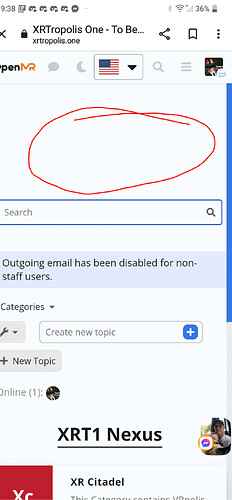](../../../assets/images/197703/baa9ce7e090541d08b2a98c009755018669959a5.jpeg "Screenshots_2023-01-28-21-38-25")

Running Test-passed

using Air theme. When Chat plugin disabled it displays no issues. After chat enabled as above.

**EDiT** : Was mistaken. Re confirmed it is actually a conflict/issue with Air theme background see blue is cut out/off. See posts below with chat off Blue background is displayed properly with Discourse search banner overlayed properly in white on blue.

---

### Post #336 by [Canapin](../../users/Canapin.md)
*Posted: 2023-02-06 20:33*

 Dan DeMontmorency:

> Banner of Discourse Search Banner blanks.

Hi Heliosurge, I’m not quite sure to understand the issue (I do see an empty area on your screenshot though)

Can you share the **exact steps** we need to do to experience the issue so we can reproduce it ourselves? 🙂

---

### Post #337 by [Heliosurge](../../users/Heliosurge.md)
*Posted: 2023-02-07 02:11*

It was very simple. The Air Theme had the Discourse Search Banner installed as part if the complete theme.

As stated running Test-Passed.

Once the Chat Plugin is enabled the Wrlcome banner if the Discourse Search Banner no longer displays the Welcome message.

Turn Chat plugin off. The Welcome banner is displayed.

Chat plugin Disabled

You can see in this ss the Chat plugin icon is gone from the header. You can also see tge other effects that the chat plugin is sermingly doing to the background creating a white empty rectangle ignoring the blue background.

Now looking at it might it be interfering with Air Thene’s blue wallpaper? as text is white in the banner. So I might be on the wrong track with the Discourse Search banner. It might be a conflict with part of the Air theme… ??

---

### Post #338 by [Heliosurge](../../users/Heliosurge.md)
*Posted: 2023-02-07 02:26*

Confirmed. my apologies it seems ti be a conflict with Air theme background. Jist tried a preview of just Discourse Search Banner with Chat plugin.

see below  

[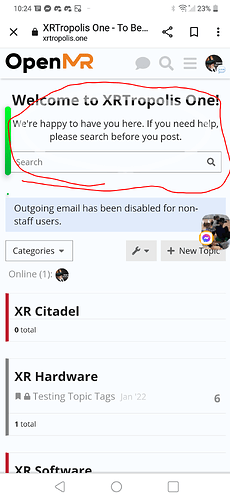](../../../assets/images/197703/0d898bf0a609eba179397c65d6cd42af3470bc3e.png "Screenshots_2023-02-06-22-24-29")

Sorry for the incorrect duiagnosis… 

Taking a further look in the Air Theme the blue part of the background is blocked in that center column when scrolling the blue is just on the outer edges. When chat disabled the blue part of the background connects from left to right through the center.

[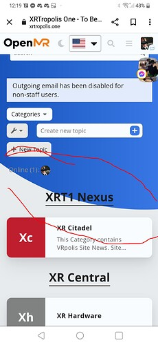](../../../assets/images/197703/5797aa99098964c673e08b28c5a213025888a377.jpeg "Screenshots_2023-02-07-00-19-49")

vs

[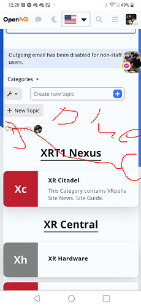](../../../assets/images/197703/e699e891c753da8d6fd507df2cacaaeccf430516.jpeg "Screenshots_2023-02-07-00-21-13")

---

### Post #339 by [Heliosurge](../../users/Heliosurge.md)
*Posted: 2023-02-08 03:23*

Just giving this a bump. It seems to be actually the Air Theme background having a central white column. see pics above.

Just wondering if the team has been able to reproduce as have isolated to the Air Theme background and not an issue with search banner.

---

### Post #340 by [Don](../../users/Don.md)
*Posted: 2023-02-08 07:25*

Hello Dan,

It seems your Search Banner plugin outlet is on the default `above-main-container`? I think you need to change this to place the Search Banner out from the `#main-outlet` 🔽

Jordan Vidrine:

> ## Discourse Search Banner
> 
> In the options for the `discourse-search-banner` theme component, the `plugin-outlet` options needs to be set to **BELOW-SITE-HEADER** for this theme to render properly.
> 
> 

* * *

However the theme [has a chat custom style](https://github.com/discourse/discourse-air/blob/main/scss/chat-mobile.scss) when enabled on the `#main-outlet` which I think only need to be active on chat pages.  
This is adding the background with `!important` to the `#main-outlet` which override the theme background transparency on `#main-outlet` etc…

[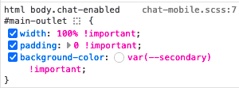](../../../assets/images/197703/4e0ad5c780f16d21a246961ef43c92953c3e3021.png "Screenshot 2023-02-08 at 7.49.56")

I think this is would be better with restrict this to `.has-full-page-chat` so only appears on chat pages?

* * *

With `above-main-container` setting 🔽  

[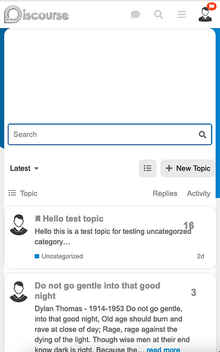](../../../assets/images/197703/f4f447cd12d7f073649e6f15dac8e2c19a74b8ea.png "Screenshot 2023-02-08 at 7.57.26")

With `below-site-header` setting 🔽  

[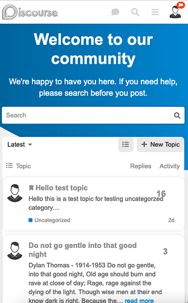](../../../assets/images/197703/5623a3b3556801e2b4fbeaad5a1a4d2200f651ca.png "Screenshot 2023-02-08 at 7.59.46")

---

### Post #341 by [Heliosurge](../../users/Heliosurge.md)
*Posted: 2023-02-08 13:21*

Okay that fixes the primary display. What would be the code to fix the chat? As it still has the white column under the search banner header on the categories as per your last screen shot.

[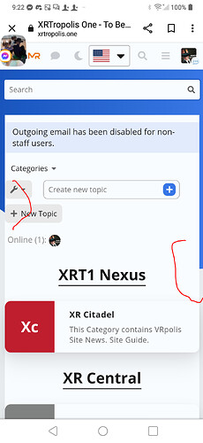](../../../assets/images/197703/6caf561236fc2756b54e955c6a631180070567f4.jpeg "Screenshots_2023-02-08-09-23-00")

Thank you for your help.

---

### Post #342 by [juiceer](../../users/juiceer.md)
*Posted: 2023-02-11 05:26*

I’m adding “category logo” Images to some, but not all, of my categories.

_expected behavior_ : When I add a logo image to a category, the size of the label **remains the same** as those of other categories.

_observed behavior_ : When I add a logo image to a category, the **square is comparatively larger** than the squares in the labels of categories without logo images. Beyond not lining up with categories in the same column, **rows with categories with logo images are taller** than rows with categories without logo images.

This happens on mobile and desktop

How can I fix this?

[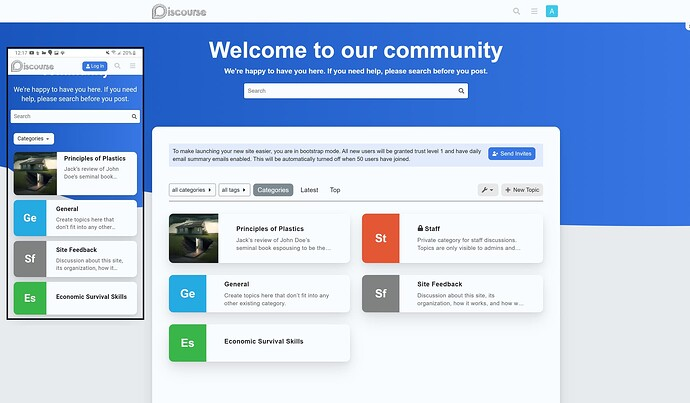](../../../assets/images/197703/b3e0661baf59cfa09543c7d8a3865f4e986b1cad.jpeg "image")

---

[← Previous](197703-page-2.md) | **Page 3 of 8** | [Next →](197703-page-4.md)
