[🏠 Home](../../index.md) | [📋 Latest](../../latest/index.md) | [🔥 Top](../../top/replies/index.md) | [👥 Users](../../users/index.md)

[Home](../../index.md) » [Theme](../../c/theme/index.md) » Air Theme

---

# Air Theme (Page 4 of 8)

> **Category:** Theme
> **Author:** Heliosurge
> **Created:** 2021-07-20 20:24

[← Previous](197703-page-3.md) | **Page 4 of 8** | [Next →](197703-page-5.md)

---

### Post #343 by [Heliosurge](../../users/Heliosurge.md)
*Posted: 2023-02-11 20:19*

I can confirm that is how it displays on my site. I belirleve it is due to non cat logo uses a very small descriptor vs a cat logo.

I inagine you can likely use css to make non logo categories match box size of logo ones.

---

### Post #344 by [juiceer](../../users/juiceer.md)
*Posted: 2023-02-11 20:24*

Thanks for the confirmation. CSS makes my skin crawl. It’s my kryptonite. I’ve never been less productive then when working on getting margins to look right using CSS.

---

### Post #345 by [Heliosurge](../../users/Heliosurge.md)
*Posted: 2023-02-11 20:28*

I hear you still learning. But imagine the author or a team member might help with a css code fix.

Just discovered light/dark toggle. Eorks well. save if you refresh the page it seems discourse will display the light thene logo instead. I suspect that is duue to discourse not detecting the web browser not being in dark mode.

* * *

Weird it seems to have fixed itself. lol

---

### Post #346 by [Wojtekxtx](../../users/Wojtekxtx.md)
*Posted: 2023-02-16 18:50*

I just switched to it and I must say that its very clean, nice theme. I like it very much. Great work whoever designed it. Thanks.

---

### Post #347 by [UnitedFreedom](../../users/UnitedFreedom.md)
*Posted: 2023-02-18 23:31*

 Jordan Vidrine:

> Do you have a link to you site? I am trying this on mine locally and am unable to reproduce

Would it be possible to send me a direct message? I dont feel comfortable with sharing the link publicly. Thanks for your willingness to help! <3

I uninstalled Air Theme and all of its plugins, and re-installed them. I have tried everything I can think if to fix it but cant.

### Default Theme - Category Dropdown does **not disappear** after selecting a different option (On Mobile)

### Air Theme - Category Dropdown **disappears** after selecting a different option. (On Mobile)

---

### Post #348 by [UnitedFreedom](../../users/UnitedFreedom.md)
*Posted: 2023-02-26 02:57*

I found the issue for the missing “Category” dropdown for mobile using the Air Theme.

**In reference to posts…**

  * [☁️ Discourse Air Theme - #329 by UnitedFreedom](../../../assets/images/197703/3296e5435c4919f2814f0b546cfec404971b2a41_2_1035x532.jpeg)
  * [☁️ Discourse Air Theme - #347 by UnitedFreedom](https://meta.discourse.org/t/discourse-air-theme/197703/347)

**The code in your repo** `Common.scss` **states…**
    
    
    .mobile-view {
      .cm-header-links {
        display: none;
      }
      .list-controls .nav-pills .drop li:first-of-type {
        display: none;
      }
    }
    

**I updated the code to**
    
    
    .mobile-view {
      .cm-header-links {
        display: none;
      }
      .list-controls .nav-pills .drop li:first-of-type {
        display: block;
      }
    }
    

And now the Categories dropdown does not disappear after choosing another dropdown option. 🙂

---

### Post #349 by [AkaiBukai](../../users/AkaiBukai.md)
*Posted: 2023-03-03 20:22*

Hello everybody…

I’m trying to customize my self hosted Discourse and I found that theme to be a good starting point!

How do you guys make changes in the CSS (like changing the background)?  
Since there’s no “Custom CSS/HTML” section in the Theme page when I select that theme like there is in the default theme.

---

### Post #350 by [kinetiksoft](../../users/kinetiksoft.md)
*Posted: 2023-03-03 20:58*

Hi,

  1. Start with creating a new theme component for your forum.
  2. Include your new component to the theme desired (the one which is used or a “dev” theme for you to check it first)
  3. Find **Edit CSS/HTML** button in the component settings
  4. Create and expand the horizons! 🔥 

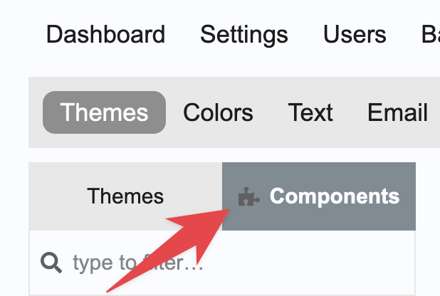

---

### Post #351 by [AkaiBukai](../../users/AkaiBukai.md)
*Posted: 2023-03-04 04:08*

Cool… I didn’t thought about a component being just a CSS tweak.

Thanks.

---

### Post #352 by [commercial](../../users/commercial.md)
*Posted: 2023-03-08 10:42*

Hello,  
I have an alert in the console:
    
    
    deprecated.js:61 Deprecation notice: PluginOutlet arguments should now be passed using `@outletArgs=` instead of `@args=` (outlet: category-box-below-each-category) [deprecation id: discourse.plugin-outlet-args]
    in 
    

did I forget something in my theme settings?  
I looked, I don’t see …

---

### Post #353 by [jordan.vidrine](../../users/jordan.vidrine.md)
*Posted: 2023-03-08 13:16*

you did not, the themes syntax just needs to be updated a bit 👍

---

### Post #354 by [commercial](../../users/commercial.md)
*Posted: 2023-03-08 15:28*

Everything is fine, it’s not a red flag 🙂  
I don’t have the skills to help anyway. Thanks again for the beautiful theme!

---

### Post #355 by [Heliosurge](../../users/Heliosurge.md)
*Posted: 2023-03-14 14:31*

A member reported an issue with Dark mode color the highlight makes emoji selector text and pm selector text unreadable.

[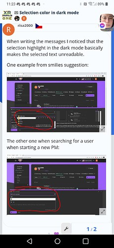](../../../assets/images/197703/b120bb23b38528968bb3fd6b18c89a36efb5767d.jpeg "Screenshots_2023-03-14-11-24-08")

---

### Post #356 by [squarecranium](../../users/squarecranium.md)
*Posted: 2023-03-17 14:36*

Hi there, I am very new to discourse, so apologies in advances if I am missing something obvious here. After installing the Air Theme there seems to be a couple of issues.

  1. The “welcome to our community” message is invisible as it is the same colour as the background. I have tried updating colours but could not get the colour of this text to change.  

[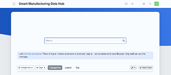](../../../assets/images/197703/29eedc27ce2335746216216fbe05de2c18908956.png "image")

  
As you can see below, the text is there but only visible when highlighted  

  2. Thew welcome text is appearing in the wrong place - i expected this to appear within the colour background however as you can see in the images above, it is not doing this.

Any help or tips would be much appreciated!

---

### Post #357 by [jordan.vidrine](../../users/jordan.vidrine.md)
*Posted: 2023-03-17 15:42*

This should be fixed if you follow these steps

 Jordan Vidrine:

> ## Discourse Search Banner
> 
> In the options for the `discourse-search-banner` theme component, the `plugin-outlet` options needs to be set to **BELOW-SITE-HEADER** for this theme to render properly.
> 
> 

---

### Post #358 by [jordan.vidrine](../../users/jordan.vidrine.md)
*Posted: 2023-03-17 20:51*

Hmmm, im not seeing this behavior. Are you using the most up to date version of discourse & theme?

---

### Post #359 by [Heliosurge](../../users/Heliosurge.md)
*Posted: 2023-03-18 00:30*

Yes on both. Just completing a new upgrade for discourse available today… Will check again once complete.

You should still have the test account details I sent you. Will update this post shortly.

Mobile on emoji selector using “:” the drop down

[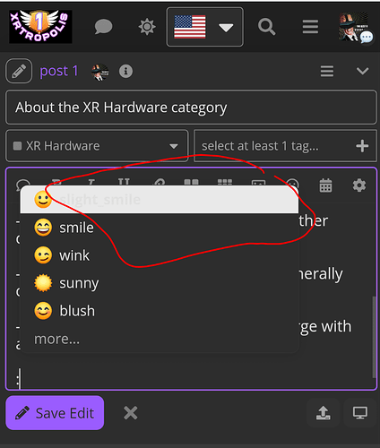](../../../assets/images/197703/d2e88d2f4ba75653e4e3ff6c03616f4ec350753a.png "Screenshots_2023-03-17-21-34-13")

Mobile name search dm/pm

[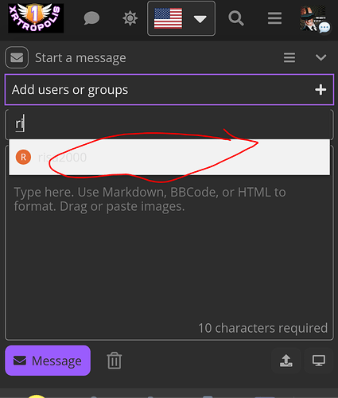](../../../assets/images/197703/29bc63a963d285eda9eef59f2ea4834317a7e003.png "Screenshots_2023-03-17-21-40-31")

---

### Post #360 by [Heliosurge](../../users/Heliosurge.md)
*Posted: 2023-03-18 02:34*

After discourse update no change in above the selector in dark mode the highlighted info is blank as above.

How do you disable the air theme’s topic thumbnail/excerpts to default behavior? Only showing topic title unless pinned?

---

### Post #361 by [squarecranium](../../users/squarecranium.md)
*Posted: 2023-03-20 12:21*

Thank you very much - this has done the trick 🙂

---

### Post #362 by [JammyDodger](../../users/JammyDodger.md)
*Posted: 2023-03-22 08:44*

A post was split to a new topic: [Add Preference for sidebar vertical scrollu](/t/add-preference-for-sidebar-vertical-scrollu/258997)

---

### Post #363 by [BH10](../../users/BH10.md)
*Posted: 2023-03-22 14:22*

Love the theme 🙏

I want to use the Modern Category + Group Boxes plug-in, but is there a way to rearrange the main page?

My issue is that all the categories appear in boxes on top, and the Latest section is below. While it’s really well designed, it might not be user-friendly for someone who is in the Community for a quick browse. Is there a way to place the category boxes on the left side of the home page (I know it’s possible to use the sidebar, but still) and then the Latest on the right, similar to the Discourse Clickable Topic plug-in?

---

### Post #364 by [jordan.vidrine](../../users/jordan.vidrine.md)
*Posted: 2023-03-22 15:04*

This is not currently possible, sorry about that!

---

### Post #365 by [Heliosurge](../../users/Heliosurge.md)
*Posted: 2023-03-24 22:50*

How would I fix the background? I narrowed it diwn to the Chat plugin.

With the Chat plugin disabled or logged out it displays properly. See pic 1

[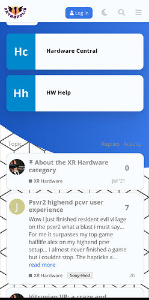](../../../assets/images/197703/79d290db2fe34b41a10a11ceba17081bf2b41b67.jpeg "Screenshots_2023-03-24-19-46-15")

Logged in with chat plugin enabled

[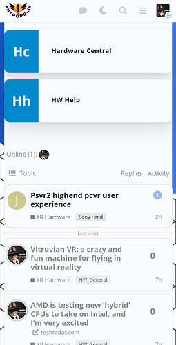](../../../assets/images/197703/a129d7cfe5916c8ad99221ac4c7058c9bd6d1604.jpeg "Screenshots_2023-03-24-19-47-18")

See how there us a white column instead of the background between bubbles and the blue is cut in the center.

---

### Post #366 by [jordan.vidrine](../../users/jordan.vidrine.md)
*Posted: 2023-03-25 00:49*

Thanks for sharing, this is def. an interesting visual bug. Ill take a look

---

### Post #367 by [jordan.vidrine](../../users/jordan.vidrine.md)
*Posted: 2023-03-28 02:58*

This should now be fixed. Thanks again for reporting.

---

### Post #368 by [BH10](../../users/BH10.md)
*Posted: 2023-03-29 12:53*

Hi, everyone! I hope you’re all doing great.

I plan to install the air theme and check it on different devices, but I have an issue with how it looks on iOS.

[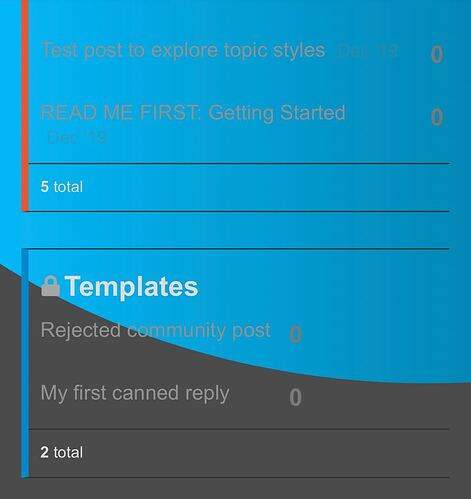](../../../assets/images/197703/29b4305618fdf8b02b8867dc1d2a0faa27fe7aa9.jpeg "IMG_5897")

Is there a way to make the background static so you can only see the blue & grey on top when you’re logged in? What I’m looking for is to have a grey background when scrolling down through categories.

---

### Post #369 by [jordan.vidrine](../../users/jordan.vidrine.md)
*Posted: 2023-03-29 14:00*

This theme is meant to be used in tandem with the modern category theme component that is also installed with the theme.

 Jordan Vidrine:

> ## Modern Category + Group Boxes
> 
> This theme component requires your categories to use the **CATEGORY BOXES WITH SUBCATEGORIES** setting in your `/admin/site_settings/category/all_results?filter=categories` area.
> 
> 
> 
> This theme component also allows the forum admin to organize their category page with header titles, and choose which categories appear under each header. To keep things simple, I have only allowed up to 5 headings to be used. **If no categories + heading settings are chosen, all categories will render as they do above, this is the default rendering option.**

---

### Post #370 by [UnitedFreedom](../../users/UnitedFreedom.md)
*Posted: 2023-04-01 07:13*

### Visual Bugs as of 03/31/2023

**Update:** Most if not all bugs are not caused by Air Theme, but rather a patch update by Discourse.

  * Using the latest version of Discourse (at the time), Air Theme, and Modern Category + Group Boxes.
  * All settings from the OP tips area are matching.
  * All custom CSS has been disabled to rule out any conflicts.

* * *

#### ~~Bug #1 \- Categories are displayed as 2 columns. ~~

When logged in, categories display as blocks (1 column) which is correct.

**Update:** Not related to Air Theme

  * Impacts Android, iOS, and Windows-Chrome using Mobile view when logged out.

**Solution:** Updating Discourse To: ` discourse v3.1.0.beta2 +864`

[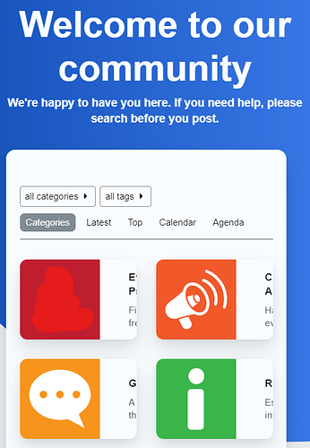](../../../assets/images/197703/08a3070638ff11024dd98e1f59b7d457c0778ce7.png "image")

* * *

#### ~~Bug #2 \- Header is missing. Users cant login.~~

**Update:** Not related to Air Theme  
**Solution:** Updating Discourse To: ` discourse v3.1.0.beta2 +864`

[Why the top header part missing](../../../assets/images/197703/4989bd4903fa488e30f8daeb6c2f96cd19d070f5_2_1035x577.jpeg) [Bug](/c/bug/1)

> Looks like this may be an issue with a recent update, we’ll investigate. [@0talal.mash0](/u/0talal.mash0) when logged in, if you go to admin → settings, search for bootstrap mode and set the bootstrap_mode_min_users setting to 0 it may fix this issue. I think the error is related to that feature. 

  * Impacts Android, iOS, and Windows-Chrome using Mobile view when logged out.

* * *

#### ~~Bug #3 \- When logged out, the categories page displays the Air Theme pill shaped categories (good), and also repeats the categories using the original category style native to Discourse (bad).~~

**Update:** Not related to Air Theme  
**Solution:** Updating Discourse To: ` discourse v3.1.0.beta2 +864`  
**Result:** This entire are is no longer displayed. Only the Air Themed styles category pills are visable.  

[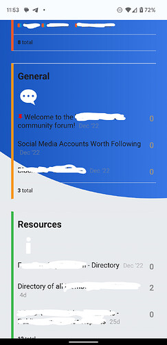](../../../assets/images/197703/b6ebcce17e6bfbf84ed85cccd4f902c0e3e1266e.jpeg "image")

* * *

#### Bug #4 \- White wrapper around categories missing.

  * Impacts Android, and iOS on mobile view (logged in or out)

#### Mobile View on Desktop - vs - Mobile View using App

[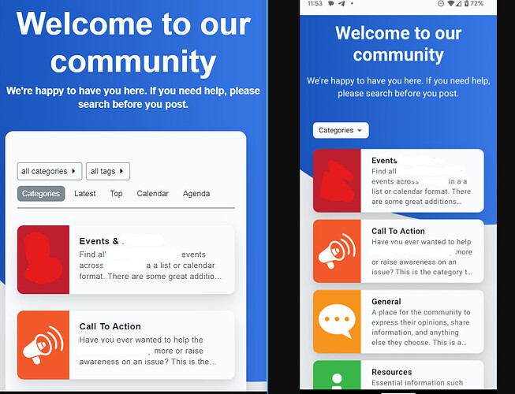](../../../assets/images/197703/ae0234b9469d08b9b32108ba4e04d5aea875f6f9.jpeg "image")

The `html body #main-outlet` css class does not appear to be compatible on mobile devices.

---

### Post #371 by [Loleyy](../../users/Loleyy.md)
*Posted: 2023-04-02 20:04*

Hello there,

I really love the template and i use it from maybe 2 weeks, and i would like to add analytics to my forum. But i cant modify the CSS for adding the google tag code from analytics.

Did u know if its possible to add it somewhere ?

thanks a lot for ur anwser !

---

### Post #372 by [Arkshine](../../users/Arkshine.md)
*Posted: 2023-04-02 23:16*

Hi, welcome back 👋

You don’t need to modify your theme. Unless I misunderstand, you can set up Google Analytics in the admin settings (`Basic Setup` or type `ga` in the search bar)

[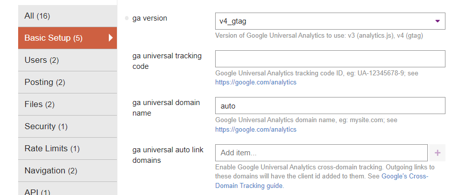](../../../assets/images/197703/1a0d50ef84d61031e1e8c210a4c3072c5a7fb55a.png "image")

---

### Post #373 by [Heliosurge](../../users/Heliosurge.md)
*Posted: 2023-04-03 02:48*

What version of discourse are you using?

My testing site is displaying properly on mobile.

**Logged in**

**Logged out**

Do you have any plugins installed?

I am running “Tests passed”

---

### Post #374 by [UnitedFreedom](../../users/UnitedFreedom.md)
*Posted: 2023-04-03 15:23*

 Dan DeMontmorency:

> What version of discourse are you using?

### 3.1.0.beta3

* * *

And as per your screenshot you are also experiencing the bug below…

 James:

> Bug #4 \- White wrapper around categories missing.

* * *

 Dan DeMontmorency:

> Do you have any plugins installed?

All plugins disabled, and the issues still occur on multiple devices, cache refreshed, and also tried incognito.

---

### Post #375 by [Lilly](../../users/Lilly.md)
*Posted: 2023-04-03 15:46*

 James:

> The `html body #main-outlet` css class does not appear to be compatible on mobile devices.

not sure about this theme specifically, but i’m running a live custom theme that uses #main-outlet css to make the white background in a very similar way (with rounded corners too) and it seems to work as expected on mobiles. i’ve set it a dark color and changed other attributes like size and the rounding corners (border radius) and i haven’t found any issues yet with how it looks on mobile.

---

### Post #376 by [Heliosurge](../../users/Heliosurge.md)
*Posted: 2023-04-03 19:55*

 James:

> ### 3.1.0.beta3
> 
> * * *
> 
> And as per your screenshot you are also experiencing the bug below…
> 
>  UnitedFreedom:
>
>> Bug #4 \- White wrapper around categories missing.

My screenshot is how it os supposed to display on mobile White bubble around the categories vs a white column pane.

As I reported here and was fixed.

[Air Theme](https://meta.discourse.org/t/discourse-air-theme/197703/365) [Theme](/c/theme/61)

> How would I fix the background? I narrowed it diwn to the Chat plugin. With the Chat plugin disabled or logged out it displays properly. See pic 1 [[Screenshots_2023-03-24-19-46-15]](../../../assets/images/197703/79d290db2fe34b41a10a11ceba17081bf2b41b67.jpeg "Screenshots_2023-03-24-19-46-15") Logged in with chat plugin enabled [[Screenshots_2023-03-24-19-47-18]](../../../assets/images/197703/a129d7cfe5916c8ad99221ac4c7058c9bd6d1604.jpeg "Screenshots_2023-03-24-19-47-18") See how there us a white column instead of the background between bubbles and the blue is cut in the center. 

It was partially broken before creating the white wrapped column.

 Jordan Vidrine:

> Thanks for sharing, this is def. an interesting visual bug. Ill take a look

 Jordan Vidrine:

> This should now be fixed. Thanks again for reporting

I am sure Jordon might provide some css code possibly to restore the bug if you prefer the white column. Mobile now for me matches mobile.

**EDiT: Looking at Op post you might be right. But the fix imho looks better as it flows properly with background. Perhaps Jordon can add a toggle for desired effect.

I have to locate the fix so my modified Air Lite theme matches. By like rhe Topic excerpts js was removed as it was excerpting all topics instead of just pinned topics.

I added Topic excerpts theme component to put excerpts in categories I want to have it. Unfortunately though it did not restore the pinned topics excerpts but many users wanted a default listing style for more posts per screen.

---

### Post #377 by [Heliosurge](../../users/Heliosurge.md)
*Posted: 2023-04-04 00:36*

[@jordan.vidrine](/u/jordan.vidrine) I was wondering how to add your bubbles around the Who’s onkine plugin and search results?

[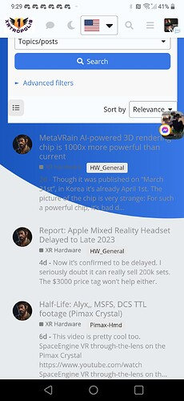](../../../assets/images/197703/dd071951922c0d4ff9284df49fd4f47ff9a2ad21.jpeg "Screenshot_20230403-212914")

---

### Post #378 by [UnitedFreedom](../../users/UnitedFreedom.md)
*Posted: 2023-04-04 10:29*

Thanks for your reply.

It looks like most of the bugs were fixed with a Discourse Update that was released today.

I have update the [original post](https://meta.discourse.org/t/discourse-air-theme/197703/370) to reflect the first 3 bugs which are not as a result of Air Theme.

The version which I am using now which fixed of the first 3 bugs, is:  
Discourse: 3.1.0.beta3 ([e014635a12](https://github.com/discourse/discourse/commits/e014635a127dd787c3e0d1bb433a109a0073c024))

* * *

Now that those bugs are fixed, all thats left is

 James:

> Bug #4 \- White wrapper around categories missing.

Which is not a big deal at all. Although I still believe its a bug since Mobile View on Desktop and Mobile View on App/Browser (which should display the same) do not with the white #main-outlet style. I’m not sure which I prefer now. I’m happy with either outcome.

---

### Post #379 by [StephaneFe](../../users/StephaneFe.md)
*Posted: 2023-05-14 20:26*

Hi,

Is it possible to remove the search bar on the homepage? I’ve noticed it’s not displayed on [meta.Discourse.org](http://meta.Discourse.org) when I switch to this theme but I don’t see any place to edit the css. 😕

---

### Post #380 by [Titi](../../users/Titi.md)
*Posted: 2023-05-14 21:48*

[@jordan.vidrine](/u/jordan.vidrine) is it mandatory to modify directly the code like this :
    
    
    .background-container {
        position: fixed;
        top: 0;
        left: 0;
        height: 100vh;
        width: 100vw;
        background: url(https://i.ibb.co/GCcS8Zw/Abstract-futuristic-Molecules-technology-with-polygonal-shapes-on-dark-blue-background-Illustration.jpg); 
        background-size: cover;
        clip-path: unset;
    

Or can I just use the form like this:  

[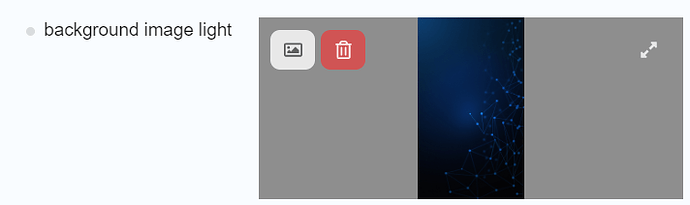](../../../assets/images/197703/e883bdfba5e50049eb4bb22a39c9633798f020c5.png "image")

I try with the form but the picture don’t cover all the blue part as you can see bellow  

Do you have any idea to solve this issue please ?

---

### Post #381 by [jordan.vidrine](../../users/jordan.vidrine.md)
*Posted: 2023-05-15 14:46*

Yep, this is actually a component that you just need to disable in the customization section of your forum.

This theme installs a couple components on install and this is where its coming from. You will want to look for `discourse-search-banner` in the theme components and disable it.

---

### Post #382 by [Jeremie_Leroy](../../users/Jeremie_Leroy.md)
*Posted: 2023-05-16 05:53*

i do have the same problem with <https://forum.francaisalondres.com/>

Any solution to this ?

---

### Post #383 by [jordan.vidrine](../../users/jordan.vidrine.md)
*Posted: 2023-05-16 15:06*

There is actually, I will push an update to fix this today 😄

Sorry for such a delayed fix for this.

---

### Post #384 by [jordan.vidrine](../../users/jordan.vidrine.md)
*Posted: 2023-05-16 20:30*

This has been fixed 😄

---

### Post #385 by [Jeremie_Leroy](../../users/Jeremie_Leroy.md)
*Posted: 2023-05-16 20:44*

Amazing 👏 thanks [@jordan.vidrine](/u/jordan.vidrine)

---

### Post #386 by [sinhvienxaydung](../../users/sinhvienxaydung.md)
*Posted: 2023-05-24 10:11*

How can I show Sub-Categories in boxes in the Main Category page?

---

### Post #387 by [jordan.vidrine](../../users/jordan.vidrine.md)
*Posted: 2023-05-24 13:50*

If you mean like this:

[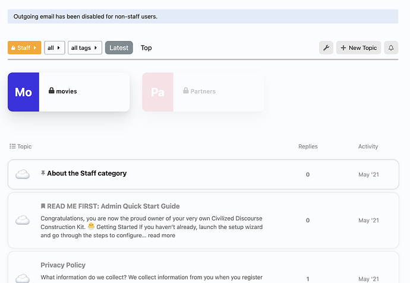](../../../assets/images/197703/32661a0ebc2141d2b697890e30e8261474d6520f.png "image")

Go to the parent / main category page and select the wrench icon to allow you to edit the category.

Click on “settings” and scroll down until you see this area:

**“show subcategory list above topics in this category”**

[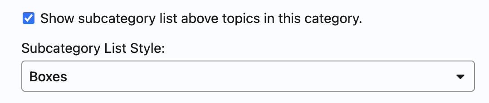](../../../assets/images/197703/2dcd2b3116df5a1f6b514a6801eafac46187edd4.png "image")

Select that option, and choose “boxes” as the dsiplay style.

* * *

If you mean on the `/categories` page, this is not an option. The only option there would be to edit the CSS to unhide the subcategories in order to show them inside the parent’s boxes.

---

### Post #388 by [sinhvienxaydung](../../users/sinhvienxaydung.md)
*Posted: 2023-05-24 15:24*

 Jordan Vidrine:

> ent’s boxes.

Thank you so much.

---

### Post #389 by [nanohits](../../users/nanohits.md)
*Posted: 2023-06-14 08:48*

I just installed this theme and the search banner text if I change to dark or light doesnt show. Can anyone guide me as to where I can change this?

Here is a screenshot

 [d.pr](https://d.pr/i/Qb7e1c)

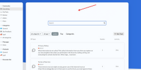

### [Markup 2023-06-14 at 16.48.03.png](https://d.pr/i/Qb7e1c)

Shared with Droplr

---

### Post #390 by [atg1130](../../users/atg1130.md)
*Posted: 2023-06-15 00:54*

[@jordan.vidrine](/u/jordan.vidrine) thank you so much for this great theme! As a new discourse developer this made everything so easy. We are having two small issues that we cannot seem to find a workaround for, when following your instructions.

  1. the light mode / dark mode toggle is not available, even when selecting two color themes as available to choose from
  2. perhaps not your theme issue, we are trying to add a custom link to the hamburger menu underneath badges, to send to an external zendesk site. We are using [this component](https://meta.discourse.org/t/custom-hamburger-menu-links/87644?page=2), which should be compatible, but the default or custom links do not show. Any ideas?

The community site can be found [here](https://community.brewops.com)

Thank you for your help!

Aaron

---

### Post #391 by [jordan.vidrine](../../users/jordan.vidrine.md)
*Posted: 2023-06-15 01:10*

 Aaron:

> the light mode / dark mode toggle is not available, even when selecting two color themes as available to choose from

Hmmm… I’m not sure why that is the case. It is working on my demo instance.

 Aaron:

> perhaps not your theme issue, we are trying to add a custom link to the hamburger menu underneath badges, to send to an external zendesk site. We are using [this component ](https://meta.discourse.org/t/custom-hamburger-menu-links/87644?page=2), which should be compatible, but the default or custom links do not show. Any ideas?

That component is no longer compatible with our new drop down header.

As an admin of your forum though, you should see a pencil in the upper right corner of the drop down.

[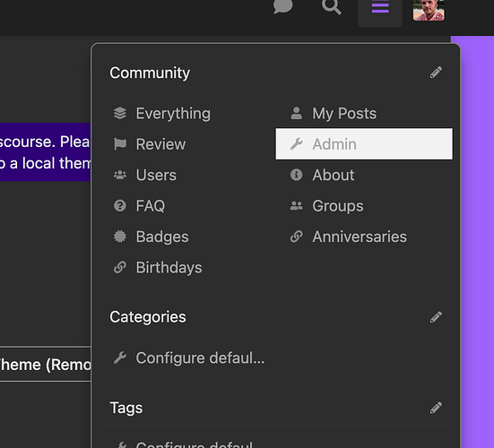](../../../assets/images/197703/5e4af973b02df005e919ca8cc2dcc463c32883cc.png "image")

Clicking this will allow you to edit the links in that menu, and add a custom link as well.

---

### Post #392 by [atg1130](../../users/atg1130.md)
*Posted: 2023-06-15 01:24*

We might have accidentally jumped on the beta version , so there was no going back! I will update to the latest beta and try again.

Regarding the link addition via admin, that seems to only work for internal links, not external

[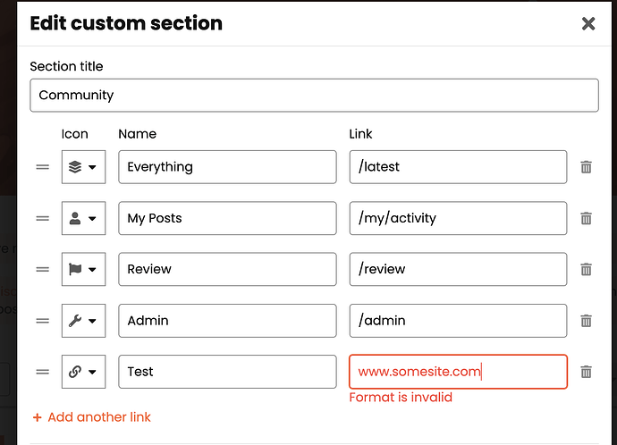](../../../assets/images/197703/5d43f8d99ee1d3ce3773e2d1cb378b45611a1aba.png "image")

---

[← Previous](197703-page-3.md) | **Page 4 of 8** | [Next →](197703-page-5.md)
