[🏠 Home](../../index.md) | [📋 Latest](../../latest/index.md) | [🔥 Top](../../top/replies/index.md) | [👥 Users](../../users/index.md)

[Home](../../index.md) » [Theme](../../c/theme/index.md) » Air Theme

---

# Air Theme (Page 5 of 8)

> **Category:** Theme
> **Author:** Lilly
> **Created:** 2021-07-20 20:24

[← Previous](197703-page-4.md) | **Page 5 of 8** | [Next →](197703-page-6.md)

---

### Post #393 by [Lilly](../../users/Lilly.md)
*Posted: 2023-06-15 01:50*

you need to add the full “`https://somesite.com`” url.

---

### Post #394 by [atg1130](../../users/atg1130.md)
*Posted: 2023-06-15 01:59*

Definitely thought that was tried before. Just upgraded to the latest beta, tried your suggestion and works great. Thank you so much!!! 🙌

---

### Post #395 by [atg1130](../../users/atg1130.md)
*Posted: 2023-06-15 23:51*

A few more quick questions that I thought would make sense to post here for the benefit of all.

  1. when using darker backgrounds, light mode / dark mode switching does not always work out so well for readability. Is there a way to disable the dark mode text color switching for the welcome header and description line?

[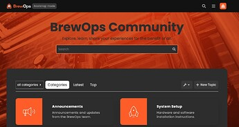](../../../assets/images/197703/c1f38ced18035a5fdbc80865c1378d5329458ad6.jpeg "image")

  2. Above the category selection and filter header on each category page there is a lot of wasted space. Either a thin category banner or none at all would free up space and look cleaner (especially when light mode/dark mode icons both need to be white for style reasons). Is there a way to remove this header? This might be a bug? It only seems to occur when a category image is uploaded.

[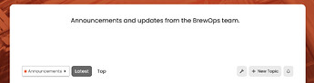](../../../assets/images/197703/60cba143c2faa31fed9157bff7763cbc4b4a2bc0.jpeg "image")

---

### Post #396 by [Wil34](../../users/Wil34.md)
*Posted: 2023-06-16 08:03*

Hello,  
is it possible that the avatar that appears to the left of each post represents the creator of the post and not the last person to comment on that same post?

I’ve already installed something that fixes it on mobile, but not on computer.

[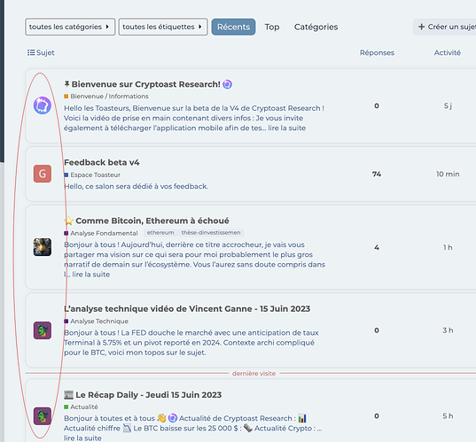](../../../assets/images/197703/ec5c5bfc396f679f8cde83d41c90a486b479cce2.png "CleanShot 2023-06-15 at 12.55.31")

---

### Post #397 by [jordan.vidrine](../../users/jordan.vidrine.md)
*Posted: 2023-06-16 17:19*

 Aaron:

> Is there a way to remove this header? This might be a bug? It only seems to occur when a category image is uploaded.

Hmm, Im not seeing the category image in the screenshot here.

---

### Post #398 by [atg1130](../../users/atg1130.md)
*Posted: 2023-06-16 17:30*

It’s because the category image is white. Only occurs when an image is uploaded.

---

### Post #399 by [jordan.vidrine](../../users/jordan.vidrine.md)
*Posted: 2023-06-16 17:32*

You’ve uploaded a blank white square as a category image?

Just trying to understand what’s going on.

---

### Post #400 by [atg1130](../../users/atg1130.md)
*Posted: 2023-06-16 17:46*

No it’s a blank square with a white icon. Can be seen at [community.BrewOps.com](http://community.BrewOps.com)

---

### Post #401 by [jordan.vidrine](../../users/jordan.vidrine.md)
*Posted: 2023-06-16 18:00*

Oh I see thanks for sharing more details.

You can use this CSS in a custom theme component to hide the image.
    
    
    .category-logo.aspect-image {
        display: none;
    }

---

### Post #402 by [atg1130](../../users/atg1130.md)
*Posted: 2023-06-17 00:53*

That worked great, thank you! Any idea on why the light/dark switcher is not working? Also can you recommend how to disable the dark mode font color switch for the welcome headline and text line below it? AKA how to force it to remain the same font style at all times regardless of light/dark mode.

Thank you again for all of your help.

---

### Post #403 by [Lilly](../../users/Lilly.md)
*Posted: 2023-06-17 01:15*

maybe try this:

 [Topic Author](https://meta.discourse.org/t/topic-author/111021) [theme-component](/c/theme-component/120)

>  Summary Topic Author will change the layout of the /latest and categories and latest topic homepage showing in the first column the author of the topic. It works both on desktop and mobile. 👓 Preview [Preview on theme-creator.discourse.org](https://discourse.theme-creator.io/theme/Dax/author) 🛠️ Repository Link <https://github.com/discourse/discourse-topic-author> 📖 New to Discourse Themes? [Beginner’s guide to using Discourse Themes](https://meta.discourse.org/t/beginners-guide-to-using-discourse-themes/91966) Install this theme component [[image]](../../../assets/images/197703/20dc114480d6d9c04002c0b9f56e83e8be2f77a5.png "image")

---

### Post #404 by [Wil34](../../users/Wil34.md)
*Posted: 2023-06-18 07:04*

Humm…

I have this when i copy/past the Github link :

[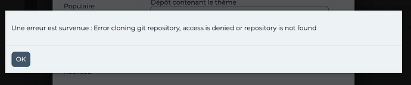](../../../assets/images/197703/dc53268d5558f020588b4ca1130ebbc3ac1e2742.png "CleanShot 2023-06-18 at 09.01.53")

---

### Post #405 by [Krusty](../../users/Krusty.md)
*Posted: 2023-06-30 10:55*

Similar issue here, got any solution ?

---

### Post #406 by [jordan.vidrine](../../users/jordan.vidrine.md)
*Posted: 2023-06-30 15:13*

[@nanohits](/u/nanohits) & [@Krusty](/u/krusty) the solution is in the OP:

 Jordan Vidrine:

> ## Discourse Search Banner
> 
> In the options for the `discourse-search-banner` theme component, the `plugin-outlet` options needs to be set to **BELOW-SITE-HEADER** for this theme to render properly.
> 
> 

---

### Post #407 by [Krusty](../../users/Krusty.md)
*Posted: 2023-06-30 21:11*

Thank you, this solved it!

---

### Post #408 by [TheDarkWizard](../../users/TheDarkWizard.md)
*Posted: 2023-07-10 23:30*

[@jordan.vidrine](/u/jordan.vidrine)

Is it possible to insert one latest topic under it/the subcategories if any exist?

[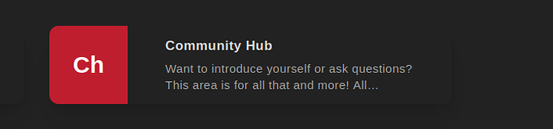](../../../assets/images/197703/e2759c3c3dd2c908d6d5ba26440d9ae8e14e7cef.png "image")

I want to condense all this

[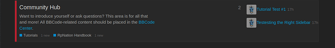](../../../assets/images/197703/1f6d99ac9d1c58cc891ac4808475f3848e979cba.png "image")

Into the box above, so one topic and the little bullet style view of the sub categories.

---

### Post #409 by [jordan.vidrine](../../users/jordan.vidrine.md)
*Posted: 2023-07-11 12:27*

At the moment, no this is not possible. This is a nice request though, maybe something to think about adding in the future.

---

### Post #410 by [barto_95](../../users/barto_95.md)
*Posted: 2023-07-11 14:44*

Thank’s for the theme

How size it’s necessary for the background image behind search bar ?

---

### Post #411 by [jordan.vidrine](../../users/jordan.vidrine.md)
*Posted: 2023-07-11 14:46*

 🇵🇹 | :

> Thank’s for the theme

Youre welcome!

Ideally, I’d say 1920 pixels wide x 1080 pixels high.

---

### Post #412 by [Nick-Permaculture](../../users/Nick-Permaculture.md)
*Posted: 2023-08-18 14:21*

Hi [@jordan.vidrine](/u/jordan.vidrine)

A few questions.

First, the dark mode toggle is also not appearing on my site, even with the 2 color pallets selected. I’m using the sidebar so perhaps that’s part of the issue?

Second, I’m wondering if it’s possible to adjust the Category Box text. In my instance, I have 14 modules, and once I get to Module 10, it shows M1. The same is true for Modules 11, 12, 13, and 14. This would be confusing for users. Can I edit these specifically?

[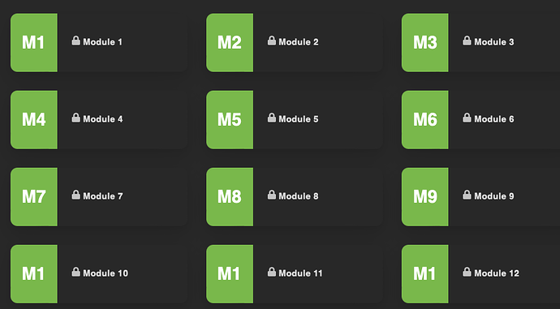](../../../assets/images/197703/ae37b67bc13cb4e98906f82ce9a834a57fae856e.png "Screenshot 2023-08-18 at 10.19.25 AM")

Third, what is the pixel size for the Category Boxes? Now that I’ve switched, all of the category images are squished trying to fit to the dimensions. I’ll need to resize everything to fix this.  

[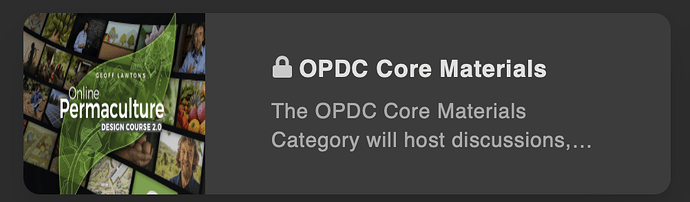](../../../assets/images/197703/98f0eee0cdbfd489f675025bf815c389405c404a.png "Screenshot 2023-08-18 at 10.45.47 AM")

Fourth, can I adjust how much of the search banner background image is shown? It seems a recent update has reduced the size of the image that displays here dramatically.

---

### Post #413 by [jordan.vidrine](../../users/jordan.vidrine.md)
*Posted: 2023-08-18 15:07*

 Nick J:

> First, the dark mode toggle is also not appearing on my site, even with the 2 color pallets selected. I’m using the sidebar so perhaps that’s part of the issue?

Have you made sure to follow all of the steps [outlined in that component](https://meta.discourse.org/t/dark-light-mode-toggle/215585)? You also need to enable a dark theme needs to be at: `/admin/site_settings/category/basic?filter=dark`

I haven’t had an issue with this, even with sidebar enabled.

* * *

 Nick J:

> Second, I’m wondering if it’s possible to adjust the Category Box text. In my instance, I have 14 modules, and once I get to Module 10, it shows M1. The same is true for Modules 11, 12, 13, and 14. This would be confusing for users. Can I edit these specifically?

Unfortunately no, there isn’t a way to change this. Would it be possible for you to label them as 01, 02, and so on? Without the world module attached?

* * *

 Nick J:

> Third, what is the pixel size for the Category Boxes? Now that I’ve switched, all of the category images are squished trying to fit to the dimensions. I’ll need to resize everything to fix this.

The dimensions are 132x132.

* * *

 Nick J:

> Fourth, can I adjust how much of the search banner background image is shown? It seems a recent update has reduced the size of the image that displays here dramatically.

Would you mind sharing a screenshot of what is happening here? I havent noticed this on my demo site.

---

### Post #414 by [Nick-Permaculture](../../users/Nick-Permaculture.md)
*Posted: 2023-08-18 15:27*

Thanks for the explanations and help here! I didn’t realize there was an extra component for the Dark/Light. I can figure out a way to make the module numbers more clear, perhaps adding an image to replace the text default. Your suggestion of 01 is good too.

For the search banner:  

[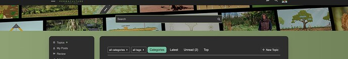](../../../assets/images/197703/2fbb2f6b387ac312acd87cb69647f7cb3d78b8fc.jpeg "Screenshot 2023-08-18 at 11.19.53 AM")

Before, I was able to see at least 2x more of this image. When I started the day (even before adjusting the theme) the image was reduced in size, so it seems it was an update that caused it? Even if I upload a file per your suggested dimensions in another post above (1920x1080) it still does this stretching thing.

---

### Post #415 by [jordan.vidrine](../../users/jordan.vidrine.md)
*Posted: 2023-08-18 15:53*

Have you also followed the instructions on how to set the search banner? I dont see any text there, but maybe you removed that?

Also, to add this image, did you do this in a theme component?

[Air Theme](https://meta.discourse.org/t/discourse-air-theme/197703/215) [Theme](/c/theme/61)

> Sure! You would just want to target this element like so: html .background-container { position: fixed; top: 0; left: 0; height: 100vh; width: 100vw; background: url(https://d11a6trkgmumsb.cloudfront.net/original/3X/8/3/8352b68….jpeg); background-size: cover; /* background: linear-gradient(90deg, var(--tertiary-hover) 0%, var(--tertiary) 100%); */ clip-path: ellipse(148% 70% at 91% -14%); Here is how that looked locally when editing through Chrome’s inspect…

---

### Post #416 by [Nick-Permaculture](../../users/Nick-Permaculture.md)
*Posted: 2023-08-18 18:41*

I did follow all the instructions on how to set the search banner. It is set below site header as required. I removed the text, yes. But previously there was also no text and it showed much more. It still only shows a sliver of the image. I uploaded the image as background to the search banner, not in the theme component.

This is how I had it setup before I made any changes, and even this morning before I changed everything the image appeared much more cut off than it had previously, which is why I suspect an update has caused it. At this point, I’m only seeing maybe 1/4 of the image at most.

I also tried editing the theme component to recreate this, but the image was very pixelated when I did that. Not sure why it starting doing this today. I also noticed today many of my other theme details were off, so perhaps it’s just a buggy day. That’s what prompted me to try a new theme, this one. In the end, not a big deal I can make a new image that works better. Just curious as to why there’s such a big difference all of a sudden.

---

### Post #417 by [kynic](../../users/kynic.md)
*Posted: 2023-08-29 19:58*

There is a bug in the theme with the mobile view when the reply count value increases the layout gets messy and does not remain aligned anymore.

See

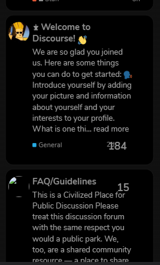

---

### Post #418 by [kynic](../../users/kynic.md)
*Posted: 2023-09-01 21:10*

After the update, it gets better but still has alignment issues with the date and reply count.

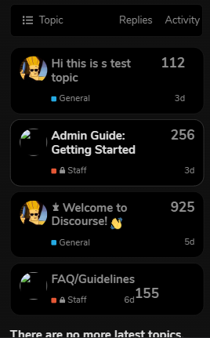

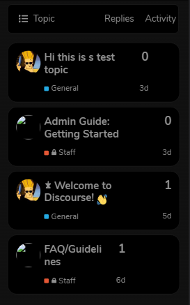

---

### Post #419 by [kynic](../../users/kynic.md)
*Posted: 2023-09-01 21:25*

Please put this in the theme I created a component and added the code as you said but still views column does not appear. 😕

Edit:

[Air Theme](https://meta.discourse.org/t/discourse-air-theme/197703/327) [Theme](/c/theme/61)

> How to add the “View” column in the topics list. I am in no way a developer, or programmer. I spent a few hours playing around with the CSS code using the Inspect Element feature in Google Chrome. I was able to get the view column to display correctly, and also did some re-sizing of every column to my preferred liking. You are more than welcome to adjust the width in the CSS code below. I have also added comments in the code so you can easily tell which code is for which column. For each column,… 

I was trying to add the view column with Jordan-provided code but dunno why it was not working I applied your code and it works Thank you 😀

---

### Post #420 by [imgh05t](../../users/imgh05t.md)
*Posted: 2023-09-12 02:18*

Hey guys! Beautiful theme, been enjoying it very much.

Does anyone know how to display subcategories here instead of category description? I use layout Categories + Latest Topics for homepage.

Thank you in advance

[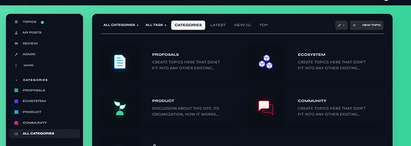](/secure-uploads/original/4X/2/6/7/2676a3b21ef312f0a487bc31dbc05ef49d83d026.png "Screenshot 2023-09-12 at 04.13.41")

  
a

---

### Post #421 by [jordan.vidrine](../../users/jordan.vidrine.md)
*Posted: 2023-09-12 13:49*

Installing your own theme-component and attaching it to the theme should work. You will want to add this line into the css of the theme component.
    
    
    .custom-category-boxes .description {
        display: none;
    }
    

To install a custom theme component you will go to `/admin/customize/themes` click `Install` then click `Create New`.

From there you will be taken to the new component’s page, where you will select which theme you want it to be included on.

You can then click `Edit CSS + Html` and add the code I sent you above to the common.scss file.

---

### Post #422 by [imgh05t](../../users/imgh05t.md)
*Posted: 2023-09-12 22:59*

Thanks, that worked! But what about displaying sub-categories? This code isn’t working for some reason
    
    
    .category-boxes .subcategories {
        display: flex !important;
        flex-flow: wrap;
    }

---

### Post #423 by [kynic](../../users/kynic.md)
*Posted: 2023-09-13 02:06*

Can you tell me how you added those icons for the categories? 😀

---

### Post #424 by [imgh05t](../../users/imgh05t.md)
*Posted: 2023-09-13 02:19*

1. Click on the category you want to edit
  2. Go to settings (tool icon)
  3. Images → Category Logo Image

---

### Post #425 by [kynic](../../users/kynic.md)
*Posted: 2023-09-13 14:16*

I see, Thanks 😃

---

### Post #427 by [JammyDodger](../../users/JammyDodger.md)
*Posted: 2023-09-14 09:52*

A post was split to a new topic: [How to change search banner headline font size?](/t/how-to-change-search-banner-headline-font-size/278993)

---

### Post #428 by [Steve_Emerson](../../users/Steve_Emerson.md)
*Posted: 2023-09-15 17:48*

This theme would be near perfect if the issue was sorted that appears to have been raised many times in this thread by multiple users.

  * [☁️ Discourse Air Theme - #370 by UnitedFreedom](https://meta.discourse.org/t/discourse-air-theme/197703/370)
  * [☁️ Discourse Air Theme - #368 by BH10](https://meta.discourse.org/t/discourse-air-theme/197703/368)
  * [☁️ Discourse Air Theme - #342 by juiceer](https://meta.discourse.org/t/discourse-air-theme/197703/342)

I’m experiencing the same where the background on mobile is inconsistent with the desktop, making things unreadable. It basically makes it unusable on mobile under certain scenarios.

**Mobile Example** :  
Light theme:  

[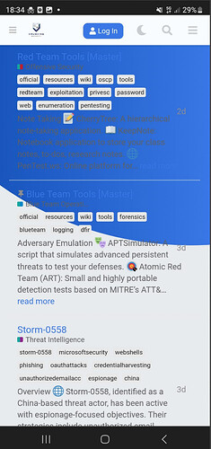](../../../assets/images/197703/13d2a74ec13c35b64811fa3cc94e8e032d667d5a.jpeg "image")

Dark Theme:  

[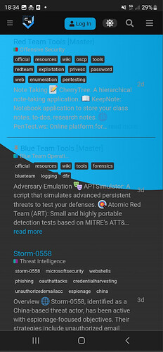](../../../assets/images/197703/ad7cd3521805b5624cd657703ce2b8d56893324c.jpeg "image")

**Desktop Example:**

Light Theme:  

[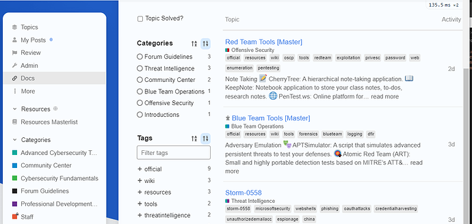](../../../assets/images/197703/fdd211dbcdd66b86a1d3db1b7a42f1c5ee766884.png "image")

Dark Theme  

[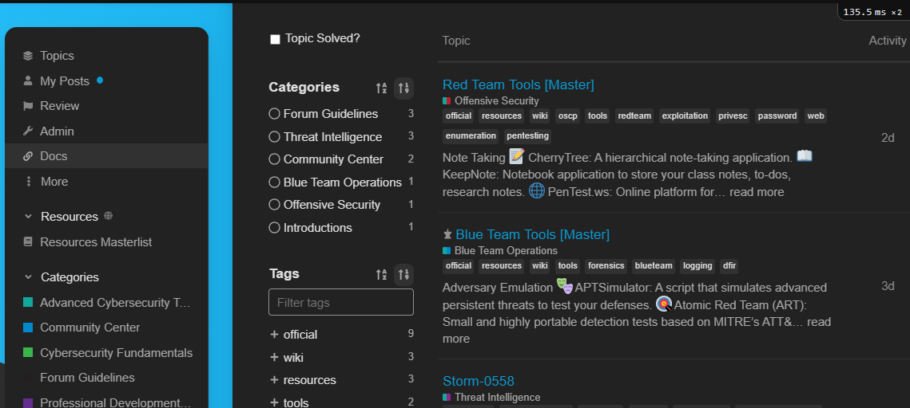](../../../assets/images/197703/24a8c7dfb8195724791d8be8fa1614a0ae00d346.png "image")

I appreciate the effort and work on this theme however it’s a shame this inconsistency is being treated as some sort of feature rather than a bug despite it being raised many times. I will certainly start using it if this can be sorted out.

**UPDATE**

I think it’s just the discourse-docs plugin that has the above issue. I’m not sure how this can be sorted out though, ideally it would be nice to have the discourse docs working well with theme this as they’re both nice features for the forum.

---

### Post #429 by [simon](../../users/simon.md)
*Posted: 2023-09-15 18:38*

I just tried installing the Air Theme on a new Discourse site. On my site there is a background color being set for various elements that fixes the readability issue you are finding:

[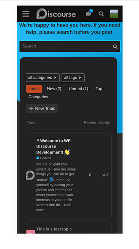](../../../assets/images/197703/80fac8bd38f1c5af08374444a71f565f15712f28.png "image")

Is there any custom CSS on your site that could be overriding the Air Theme’s CSS?

---

### Post #430 by [Steve_Emerson](../../users/Steve_Emerson.md)
*Posted: 2023-09-15 18:52*

Interesting, I have no custom CSS. I also removed all theme components to see if anything was interfering but the issue persisted.

I have no idea then 

---

### Post #432 by [Steve_Emerson](../../users/Steve_Emerson.md)
*Posted: 2023-09-15 18:59*

Just to confirm were you using a mobile?

If I use a desktop browser and reduce the screen size I can see my layout is consistent with yours, whereas on a mobile device browser, I don’t have the same structure. For example, it only shows ‘latest’ as a dropdown… which makes me think yours isn’t being detected as a mobile which is why the theme isn’t being ‘buggy’ like my mobile examples above?

---

### Post #433 by [Steve_Emerson](../../users/Steve_Emerson.md)
*Posted: 2023-09-15 19:04*

Ah tbh it seems fine on the majority of the site - maybe this issue is limited to the ‘discourse-docs’ plugin. The don’t seem to work well together.

---

### Post #434 by [simon](../../users/simon.md)
*Posted: 2023-09-15 19:17*

 Steve Emerson:

> Just to confirm were you using a mobile?

Yes. I’m testing mobile mode on my desktop by adding the `?mobile_view=1` parameter to the URL. The results should be the same as what you get on a mobile device. I’m definitely being served the mobile view in the screenshot.

 Steve Emerson:

> maybe this issue is limited to the ‘discourse-docs’ plugin.

I think you found it!

[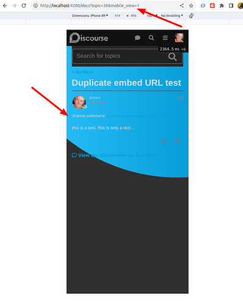](../../../assets/images/197703/c1e731be1fea88e92165252358f4c4a85ee0c527.png "image")

The issue only seems to affect doc topics on mobile, desktop seems fine.

---

### Post #435 by [Steve_Emerson](../../users/Steve_Emerson.md)
*Posted: 2023-09-15 19:20*

Yeah just the mobile docs, so not too much of an issue. Would be nice if it was fixed eventually though.

Thanks for digging into this 🙂

---

### Post #436 by [simon](../../users/simon.md)
*Posted: 2023-09-15 20:33*

 Steve Emerson:

> Would be nice if it was fixed eventually though.

The problem seems to be here:

[github.com/discourse/discourse-air](https://github.com/discourse/discourse-air/blob/main/mobile/mobile.scss#L14)

#### [mobile/mobile.scss](https://github.com/discourse/discourse-air/blob/main/mobile/mobile.scss#L14)

[`main`](https://github.com/discourse/discourse-air/blob/main/mobile/mobile.scss#L14)
    
    
          
    
    
              
        4.   .custom-search-banner-headline,
    
              
        5.   h1 {
    
              
        6.     font-size: 2.5em !important;
    
              
        7.   }
    
              
        8. 
              
        9.   p {
    
              
        10.     font-weight: normal;
    
              
        11.     font-size: $font-up-1;
    
              
        12.   }
    
              
        13. }
    
              
        14. 
              
        15. html
    
              
        16.   body:not(
    
              
        17.     .static-tos,
    
              
        18.     .static-faq,
    
              
        19.     .static-privacy,
    
              
        20.     .about-page,
    
              
        21.     .static-faq,
    
              
        22.     .badges-page,
    
              
        23.     .tags-page,
    
              
        24.     .archetype-banner,
    
          
    
        

I thought it might be possible to fix the issue by just adding some CSS to a theme component, but it’s turning out to be a tricky problem because the main docs page doesn’t add a CSS class to the `body` tag. That means that it’s not enough to just use this. It fixes the issue on individual docs topics, but not on the docs topic list:
    
    
    html body.archetype-docs-topic #main-outlet {
      border-radius: 0px !important;
      width: calc(100% - 3em) !important;
      background-color: var(--secondary) !important;
      margin-bottom: 0px !important;
    }
    

I suspect the fix will require small changes be made to both the docs plugin and the air theme. I’ll follow up on this with the team. It should get fixed fairly soon.

---

### Post #437 by [Steve_Emerson](../../users/Steve_Emerson.md)
*Posted: 2023-09-15 20:49*

Appreciate you looking into this, thank you 😃

---

### Post #438 by [simon](../../users/simon.md)
*Posted: 2023-09-19 19:35*

Jordan Vidrine:

> This theme includes a handful of components to enhance your forum as well.

Just adding a note here that the Loading Slider and Dark Light Scheme Toggle have been removed from the theme component:

[github.com/discourse/discourse-air](https://github.com/discourse/discourse-air/blob/main/about.json#L5-L9)

#### [about.json](https://github.com/discourse/discourse-air/blob/main/about.json#L5-L9)

[`main`](https://github.com/discourse/discourse-air/blob/main/about.json#L5-L9)
    
    
          
    
    
              
        5. "license_url": "https://github.com/discourse/discourse-air/blob/main/LICENSE",
    
              
        6. "components": [
    
              
        7.   "https://github.com/discourse/discourse-minimal-category-boxes.git",
    
              
        8.   "https://github.com/discourse/discourse-clickable-topic.git"
    
              
        9. ],
    
          
    
        

I’ve removed the reference to the Loading Slider from the OP. Should the Dark Light Scheme toggle be removed as well, or is there a similar component that works with the sidebar that should get added?

---

### Post #439 by [jordan.vidrine](../../users/jordan.vidrine.md)
*Posted: 2023-09-25 20:06*

I believe this component works with the sidebar now. There is a setting to set it to be either in the header, or in the sidebar.

---

### Post #441 by [erikds](../../users/erikds.md)
*Posted: 2023-10-02 23:40*

Hi folks, great theme. I have a minor nit with the border radius on the `.nav-pils:not(.user-nav)>li>a` selector, causing an inconsistent pointy border on the active tab:  

[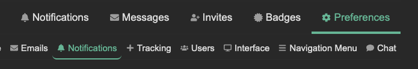](../../../assets/images/197703/230fd074a9c29742a036524134f73b455c322242.png "image")

setting the bottom border radii to 0 fixes this. would you be open to a PR, or am I missing something?  

[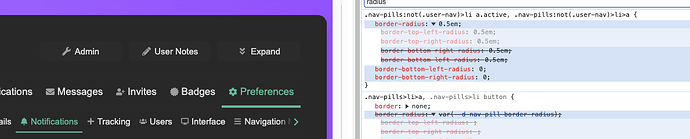](../../../assets/images/197703/b8bc7ed16bd51f3acf57726a56ed3acda2992bf3.png "image")

Edit: since it was only a few lines I went ahead and made a PR [here](https://github.com/discourse/discourse-air/pull/38).

---

### Post #442 by [erikds](../../users/erikds.md)
*Posted: 2023-10-03 14:55*

Sorry, one more nit - wondering if this is a similar issue using the [events plugin](https://meta.discourse.org/t/events-plugin/69776):  

[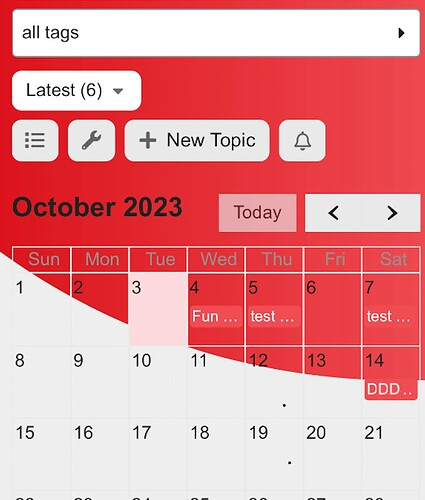](../../../assets/images/197703/77d6d1a2b2f5e7928f810c83fe0b1023c45b4780.jpeg "image")

---

### Post #443 by [cmahns](../../users/cmahns.md)
*Posted: 2023-10-04 12:45*

Looks like there’s a slight CSS hangnail when opening up the Threads pane in Chat when using it in full screen. Right hand side by the X button for threads:

[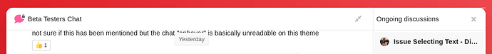](../../../assets/images/197703/280c89070dda57ebdb2ab2a58de8faf132075c38.png "Screenshot from 2023-10-04 08-39-18")

  

[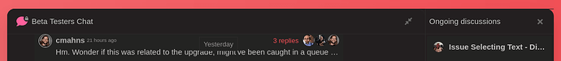](../../../assets/images/197703/e5a9b9d44186481322daf4c851b2ace7afac2763.png "Screenshot from 2023-10-04 08-37-26")

---

### Post #444 by [jenmck](../../users/jenmck.md)
*Posted: 2023-10-11 00:22*

 imgh05t:

> Thanks, that worked! But what about displaying sub-categories? This code isn’t working for some reason
>     
>     
>     .category-boxes .subcategories {
>         display: flex !important;
>         flex-flow: wrap;
>     }
>     

Wondering if anyone might have a solution for this, to show the subcategories in the category box?

---

### Post #447 by [Heliosurge](../../users/Heliosurge.md)
*Posted: 2023-10-13 02:18*

Hi [@jordan.vidrine](/u/jordan.vidrine) modern category boxes said update was available. Now displays blank page after update.

[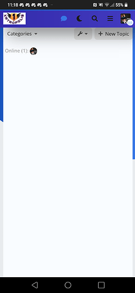](../../../assets/images/197703/85a2cd8f3e5539744f439b2eb6f4e9ad8d6ec5ef.png "Screenshot_20231012-231827")

Tests Passed

## Fixed after upgrading Docker & Discourse. Though update was not showing required.

---

[← Previous](197703-page-4.md) | **Page 5 of 8** | [Next →](197703-page-6.md)
