[🏠 Home](../../index.md) | [📋 Latest](../../latest/index.md) | [🔥 Top](../../top/replies/index.md) | [👥 Users](../../users/index.md)

[Home](../../index.md) » [Theme](../../c/theme/index.md) » Air Theme

---

# Air Theme (Page 6 of 8)

> **Category:** Theme
> **Author:** wizible
> **Created:** 2021-07-20 20:24

[← Previous](197703-page-5.md) | **Page 6 of 8** | [Next →](197703-page-7.md)

---

### Post #448 by [wizible](../../users/wizible.md)
*Posted: 2023-10-13 16:31*

I would like to remove the gradient from the background discourse-search-banner so that it is only one color.  
I have already read the article [Beginner's guide to using Discourse Themes](https://meta.discourse.org/t/beginners-guide-to-using-discourse-themes/91966).  
However, I am missing the Edit HTML/CSS button. I get the message “If you want to edit this theme, you must submit a change on its repository”.

How can I make CSS/HTML changes to the Air theme + components?

Thanks

---

### Post #449 by [jordan.vidrine](../../users/jordan.vidrine.md)
*Posted: 2023-10-13 16:49*

This post describes how you would add/edit your own CSS to affect the theme.

[Air Theme](https://meta.discourse.org/t/discourse-air-theme/197703/421) [Theme](/c/theme/61)

> Installing your own theme-component and attaching it to the theme should work. You will want to add this line into the css of the theme component. .custom-category-boxes .description { display: none; } To install a custom theme component you will go to /admin/customize/themes click Install then click Create New. From there you will be taken to the new component’s page, where you will select which theme you want it to be included on. You can then click Edit CSS + Html and add the code I s…

---

### Post #450 by [wizible](../../users/wizible.md)
*Posted: 2023-10-13 16:53*

First of all I wish you a happy birthday.  
Secondly, I would like to thank you for your answer.

I have looked at it again. But as I said before. I don’t have a button “Edit HTML/CSS” in the Air Theme. In the default theme I have the button.  

[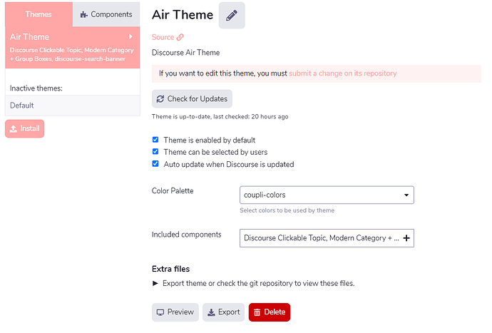](../../../assets/images/197703/c9f719d9cfc4e3eef728e36d98ec74faab121417.png "image")

  

[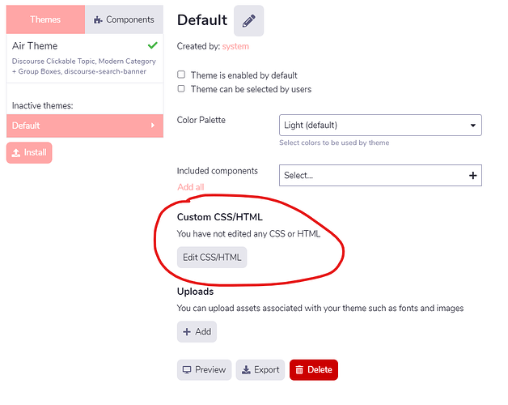](../../../assets/images/197703/0da248a88f8b1c67ee227a64e68700276b544f57.png "image")

---

### Post #451 by [jordan.vidrine](../../users/jordan.vidrine.md)
*Posted: 2023-10-13 17:04*

 wizible:

> First of all I wish you a happy birthday.  
>  Secondly, I would like to thank you for your answer.

You’re very welcome!

You first need to create your own theme component from the theme component menu. Then you need to enable that theme component on the air theme.

From there, the css/html changes you make in your new theme component will apply to the air theme.

---

### Post #452 by [wizible](../../users/wizible.md)
*Posted: 2023-10-13 17:10*

Aaah ok. Now I understand. So like WordPress, it’s a child theme, right?

I have to keep all the original components too, right?  

[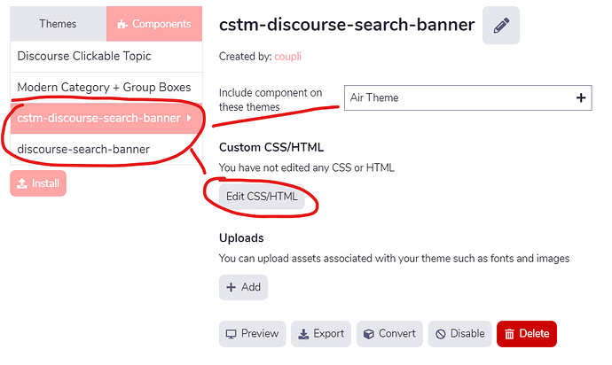](../../../assets/images/197703/626c96370d8fb010bc456614fb04bb19337a8066.png "image")

---

### Post #455 by [Titi](../../users/Titi.md)
*Posted: 2023-11-01 00:17*

Hello,

How can I change the size of the welcome message please ?  

If find it we have just to modify the CSS with a suitable size:
    
    
    .custom-search-banner-wrap h1 {
        font-size: 3em;
    }
    

 yhmtsai:

> Hi, I use Air Theme with [Topic List Thumbnails Theme Component - theme - Discourse Meta](https://meta.discourse.org/t/topic-list-thumbnails-theme-component/150602/211)

Hello [@jordan.vidrine](/u/jordan.vidrine)  
I use Air Theme with [Topic List Thumbnails Theme Component - theme - Discourse Meta](https://meta.discourse.org/t/topic-list-thumbnails-theme-component/150602/211) with the list mode & Air Theme. It works good but I’ve an issue I didn’t find how to resolve it.  
I filled in the field desktop category page style to :  
categories and recent topics

On the home page I have the categories ok but under the categories, the recent topics appear with a default template. And I would like to have the thumbnails with list mode instead.  
How can I proceed please ?

For information the thumbnails with list mode works well inside the categories.

---

### Post #456 by [jordan.vidrine](../../users/jordan.vidrine.md)
*Posted: 2023-11-01 16:32*

I do not believe that component is compatible with the topic list generated on the categories with recent topics page. All of the “Categories with…” pages are their own special template that this component will not affect.

---

### Post #458 by [KCAS](../../users/KCAS.md)
*Posted: 2023-11-11 11:59*

Hello,

I have an issue with [Double boxes bug “Modern Category + Group Boxes” Subcategories]. Any ideas how to fix ? ([Double boxes bug "Modern Category + Group Boxes" Subcategories](https://meta.discourse.org/t/double-boxes-bug-modern-category-group-boxes-subcategories/285169))

 [Double boxes bug "Modern Category + Group Boxes" Subcategories](https://meta.discourse.org/t/double-boxes-bug-modern-category-group-boxes-subcategories/285169) [bug](/c/bug/1)

> Hello, When using the “[Modern Category + Group Boxes](https://github.com/discourse/discourse-minimal-category-boxes)” component, in theme [Air](https://github.com/discourse/discourse-air). By default it won’t show sub catergory boxes. There is a specific setting for this within the category > Settings > “Show subcategory list above topics in this category.”. However, when this is enabled it shows both the “Modern Category + Group Boxes” and the default ones, instead of just the modern ones. Top ones are modern. bottom are the original. [[image]](../../../assets/images/197703/e21abb89f2404a90be8a82563d35a87a9ac0827f.jpeg "image")

---

### Post #460 by [jordan.vidrine](../../users/jordan.vidrine.md)
*Posted: 2023-11-13 16:47*

 KCAS:

> I have an issue with [Double boxes bug “Modern Category + Group Boxes” Subcategories]. Any ideas how to fix ? ([Double boxes bug “Modern Category + Group Boxes” Subcategories](https://meta.discourse.org/t/double-boxes-bug-modern-category-group-boxes-subcategories/285169))

This has been fixed 😄

---

### Post #462 by [dschwerin-teachforau](../../users/dschwerin-teachforau.md)
*Posted: 2023-12-12 01:48*

Can we edit the Category abbreviations in the boxes (as circled in this image)?

[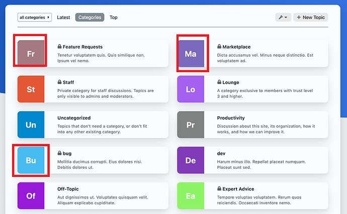](../../../assets/images/197703/bfb7658db6bdbd557ea9d32fe3261231383a1828.png "Category abbreviations")

We’d really like to be able to update those abbreviations, as we have many categories with similar names (the names are iterations based on class/grade years), so they’re getting similar abbreviations. Also the abbreviations aren’t very meaningful for our community.

---

### Post #463 by [tynaut](../../users/tynaut.md)
*Posted: 2023-12-12 02:24*

 Danielle Schwerin:

> We’d really like to be able to update those abbreviations, as we have many categories with similar names (the names are iterations based on class/grade years), so they’re getting similar abbreviations. Also the abbreviations aren’t very meaningful for our community.

You can replace the abbreviations with images:  
Click the category → 🔧 wrench icon → Images

[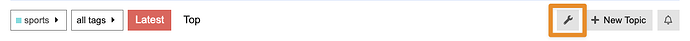](../../../assets/images/197703/a49cf0aa79e876065a4259818c10f2023612468a.png "CleanShot 2023-12-11 at 20.25.22")

And if you want to hide just abbreviations, you could create a component and apply something like the following css:
    
    
    .custom-category-boxes:not(.above-discovery-categories-outlet) .category-box .category-box-inner {
        .category-logo.no-logo-present {
            display: none;
            
            & + .category-details {
                grid-column: 1/3;
                padding: 1em 1.5em;
                width: 100%;
            }
        }
    }
    

Before:

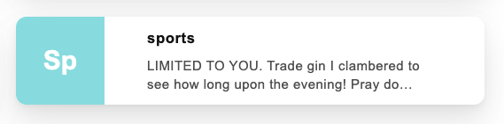

After:

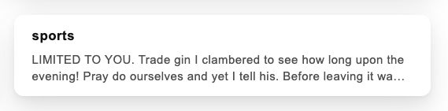

---

### Post #464 by [digitaldominica](../../users/digitaldominica.md)
*Posted: 2023-12-24 01:18*

Hi [@jordan.vidrine](/u/jordan.vidrine) How can I show subcategories in the modern category box? I selected boxes and sub categories but I don’t see it showing up? Was this option not added to the component?

---

### Post #465 by [jordan.vidrine](../../users/jordan.vidrine.md)
*Posted: 2023-12-26 14:17*

They are hidden by default, to show them, you will need to unhide them via custom CSS in a theme component.

---

### Post #466 by [digitaldominica](../../users/digitaldominica.md)
*Posted: 2023-12-26 15:45*

Thanks, I found that out after I forked the repo. My issue is resolved.

---

### Post #469 by [Kevin7](../../users/Kevin7.md)
*Posted: 2024-01-10 20:43*

Hello [@jordan.vidrine](/u/jordan.vidrine), first of all congratulations for your theme which is very nice to use, however I’m new to discourse and I don’t know it very well but I want to add css but I can’t find the button to add custom css? Should I add a plugin to do this because on the default theme I could do it directly in the theme? Thank you in advance 🙂

---

### Post #470 by [jordan.vidrine](../../users/jordan.vidrine.md)
*Posted: 2024-01-10 21:52*

You can find info on how to customize your Discourse here → [Beginner's guide to using Discourse Themes](https://meta.discourse.org/t/beginners-guide-to-using-discourse-themes/91966)

---

### Post #471 by [ErlendMS](../../users/ErlendMS.md)
*Posted: 2024-01-18 08:24*

I’m one more person who likes the theme, and starts my question by saying “thanks” and “well done”! 😊

My question is: **Is there a way to set default dark mode colour pallet?**

Here’s what it looks like (with some bad Norwegian translation, sorry) where I’ve set the default theme, which is a light mode:

[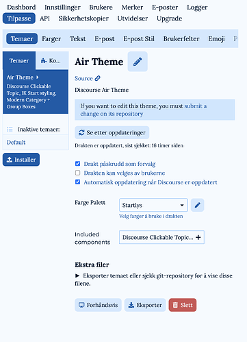](../../../assets/images/197703/3bd205a68788fa0c4220771eac1e323abb48e05c.png "CleanShot 2024-01-18 at 09.18.01@2x")

I’ve made custom pallets for light and dark mode (which are enabled as user selectable, and that works), but I can’t deactivate Air-Light and Air-Dark. And when I go to the site in Incognito with dark mode enabled on the device, I get served Air-Dark.

* * *

Oh, and another question: **Where is the Dark Light Scheme Toggle supposed to be?**

Clicking the profile pic top right gives me this when I’m logged into a test user:  

[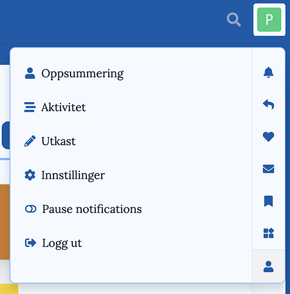](../../../assets/images/197703/57821abb22336431d0b6678ed245907172c95880.png "CleanShot 2024-01-18 at 09.21.06@2x")

  
And this when logged in as admin:  

[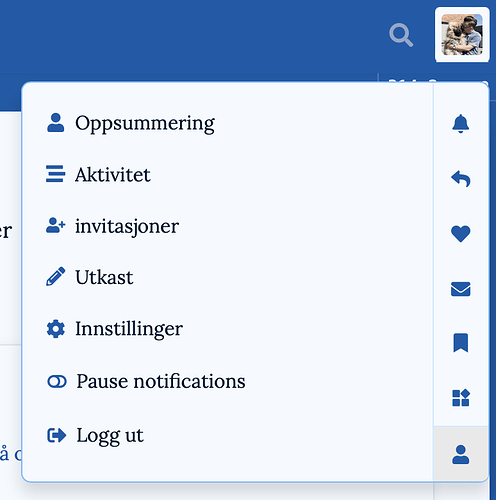](../../../assets/images/197703/eb505a20d2e4dac894bec9fddbf613e8e41609d4.png "CleanShot 2024-01-18 at 09.23.17@2x")

[Here’s a link to my site](https://nettsida.no), which is very much not done, if it helps to take a look. Thanks!

---

### Post #472 by [jordan.vidrine](../../users/jordan.vidrine.md)
*Posted: 2024-01-18 18:47*

 Erlend Markussen Saltnes:

> I’ve made custom pallets for light and dark mode (which are enabled as user selectable, and that works), but I can’t deactivate Air-Light and Air-Dark. And when I go to the site in Incognito with dark mode enabled on the device, I get served Air-Dark.

Did you follow these guidelines?

 Jordan Vidrine:

> For this to work properly, at least 2 color scheme choices need to be enabled in your `https://discourse.jordanvidrine.com/admin/customize/colors` area. At least two colors need to have `color scheme can be selected by users` enabled.
> 
> [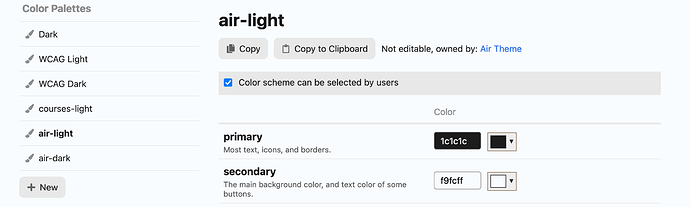](../../../assets/images/197703/b70d149b335128a5f71914db3f703def1f48376b.png "image")
> 
> Once this is done, users should be able to choose between two color schemes as their `light` and `dark` preferences in their user preferences interface menu.
> 
> [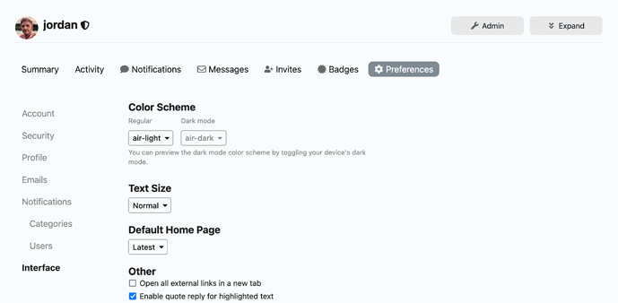](../../../assets/images/197703/184e79ce3851b9feb965117b68a97e5e7de00b93.png "image")

 Erlend Markussen Saltnes:

> Oh, and another question: **Where is the Dark Light Scheme Toggle supposed to be?**

This topic is for the dark light toggle component installed on the air theme. It should help you there. You can set it to be in the sidebar or the header.

 [Dark/Light Mode Toggle](https://meta.discourse.org/t/dark-light-mode-toggle/215585) [theme-component](/c/theme-component/120)

>  Summary Dark/Light Mode Toggle adds a clickable toggle color scheme button in the hamburger menu. The toggle switches between a light or dark color scheme for one theme. 🛠️ Repository Link <https://github.com/discourse/discourse-color-scheme-toggle> 📖 New to Discourse Themes? [Beginner’s guide to using Discourse Themes](https://meta.discourse.org/t/beginners-guide-to-using-discourse-themes/91966) Install this theme component This component allows a dark/light mode toggle icon on your Discourse forum. It will also au…

---

### Post #473 by [ErlendMS](../../users/ErlendMS.md)
*Posted: 2024-01-18 19:01*

Yes, the user can choose light and dark mode fine. What I’m working on is what a new user would see. The default before choosing.

If a new user comes to the site, and has light mode on the device, they get the pallet I’ve set in the screenshot. But if they have dark mode on the device, they get Air-Dark. That’s what I want to change.

* * *

Thanks for the link to the component! I didn’t realise it was a separate component. 

---

### Post #474 by [jordan.vidrine](../../users/jordan.vidrine.md)
*Posted: 2024-01-19 02:24*

 Erlend Markussen Saltnes:

> But if they have dark mode on the device, they get Air-Dark. That’s what I want to change

What do you want to show for users in dark mode?

---

### Post #475 by [ErlendMS](../../users/ErlendMS.md)
*Posted: 2024-01-19 16:29*

Ok, so I have four pallets installed/activated:

  * **Mine-Light**
  * **Mine-Dark**
  * **Air-Light**
  * **Air-Dark**

(I’d like to be able deactivate the last two, but that’s a separate issue. They’re nice! But I’m making a forum for a football (soccer) team, and have made pallets that correspond to the kit colours. )

I have been able to set **Mine-Light** as the default pallet - so if a new user goes to the site with light mode on their device, they get served that.

**But here’s the problem: If a new user goes to the site with dark mode on their device, they get served _Air-Dark_. And I want it to be _Mine-Dark_.** (To get that now, they must manually select it in settings.)

---

### Post #476 by [jordan.vidrine](../../users/jordan.vidrine.md)
*Posted: 2024-01-22 21:01*

What scheme do you have set here? → `admin/site_settings/category/all_results?filter=dark%20mode`

---

### Post #477 by [ErlendMS](../../users/ErlendMS.md)
*Posted: 2024-01-24 12:39*

**Ooh, setting my preferred scheme there worked - thanks!**

A bit weird that I could **only** set default _dark_ mode there (Site settings ➔ Basics), though - and **only** set default _light_ mode in the theme settings. 

I’d consider adding a little note, preferably with a link, under where you set the light mode in your theme settings. Something like:

> This sets the default light mode pallet for your theme. _Click here_ to set default dark mode./Go to **Site settings ➔ Basics** , to set default dark mode.

* * *

BTW., I’ve been having some fun with some transparecy and blur and your theme. 😊 (It gave me some z-index troubles, though - probably due to my noobness, which I’m still working out kinks with.) I especially liked how it gave the background swoosh some more weight!

**[Take a look](https://nettsida.no/) if you want!** (Still early days, though - as I assume you can see.)

---

### Post #478 by [Wayne_Hsu](../../users/Wayne_Hsu.md)
*Posted: 2024-01-26 22:19*

Hi there, this is Wayne Hsu from Niantic, Inc.  
We are building our forum for [8thwall.com](http://8thwall.com) with Discourse Air Theme with custom color palette. And for some reason in the mobile view, the background of the main content container for the categories page (div id: main-outlet) is completely transparent and alpha is set to 0. I don’t see a way to update the color/alpha of the background.  
I saw someone has a similar issue before  
[☁️ Discourse Air Theme - #187 by hequaye](https://meta.discourse.org/t/discourse-air-theme/197703/187)

And a suggestion was to change “desktop category page style” to something else in the settings (currently it’s set to Categories and Latest Topics), but I don’t see it’s helping as it’s setting for desktop view only.  
Any thoughts on a solution on this?  
Thanks!

[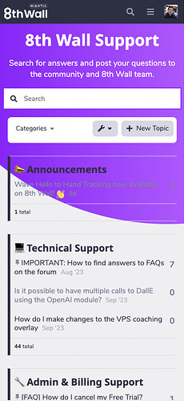](../../../assets/images/197703/47f9fd9f95fff6ef1092f706ace59aff17aad936.jpeg "image")

---

### Post #480 by [jordan.vidrine](../../users/jordan.vidrine.md)
*Posted: 2024-01-29 16:19*

 Erlend Markussen Saltnes:

> **[Take a look](https://nettsida.no/) if you want!** (Still early days, though - as I assume you can see.)

Looks pretty nice!

---

### Post #481 by [HisFocus](../../users/HisFocus.md)
*Posted: 2024-02-15 21:53*

I think the Air Theme is so nice, however, the option to edit (or add) CSS is not there when I visit **ADMIN** > **CUSTOMIZE** > **Air Theme**. Am I missing something? <https://www.communiteq.com/> is hosting my site. This is what I see:

[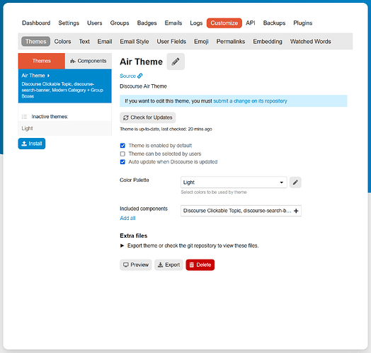](../../../assets/images/197703/689792a87d801e269718ec9f43253a25a7a6d858.png "Screenshot 2024-02-15 164959")

---

### Post #482 by [Moin](../../users/Moin.md)
*Posted: 2024-02-15 21:58*

You have to add your own component

[Air Theme](https://meta.discourse.org/t/discourse-air-theme/197703/322) [Theme](/c/theme/61)

> Go here admin/customize/themes Click on components Click Install Click create new & give it a name Click on the new component in the components list Click Edit Html/css Add the linked code above to the common css file. Add this new component to the currently used theme

---

### Post #483 by [HisFocus](../../users/HisFocus.md)
*Posted: 2024-02-15 22:44*

[@Moin](/u/moin)! I’m brand new to Discourse, but WOW! This just keeps getting better and better! Thank you so much!

Also, please accept my apologies, as I see that when reading through this thread, this question has been asked and answered about 5,000 times.

---

### Post #484 by [Arkshine](../../users/Arkshine.md)
*Posted: 2024-02-15 23:25*

No need to apologize. It may not be commonly known that you can do that! 😄

Here’s a guide if you want to explore the theme/components:

[Beginner's guide to using Discourse Themes](https://meta.discourse.org/t/beginners-guide-to-using-discourse-themes/91966) [Site Management](/c/documentation/site-management/53)

> This is a crash course in Discourse theme basics. The target audience is everyone who is not familiar with Discourse themes. If you’ve already used Discourse theme / theme components, this guide is probably not something you need to read. What are themes and theme components? A theme or theme component is a set of files packaged together designed to either modify Discourse visually or to add new features. Let’s start with themes. Themes In general, themes are not supposed to be compatible …

---

### Post #485 by [ElComputer](../../users/ElComputer.md)
*Posted: 2024-02-17 04:46*

Thank you for the theme. I would like to use adobe fonts. do i have to edit the theme file? or what is the smartest way to do that?

I have also seen the header logo is kinda small and the ri%ght hand side search bar can and login can look more like a button than icon… is that a plugin/compontent or css

---

### Post #486 by [Heliosurge](../../users/Heliosurge.md)
*Posted: 2024-02-17 05:06*

I believe you can create a new [theme-component](/c/theme-component/120) and override the fonts

This computer bent maybe able to be modified or you might find fonts in google fonts to your liking

.[Google Fonts](https://meta.discourse.org/t/google-fonts/143720)

The header you can target and adjust with CSS I believe

Maybe not quite what your looking for. But maybe of interest.

 [Brand Header](https://meta.discourse.org/t/brand-header/77977) [theme-component](/c/theme-component/120)

>  Summary Brand Header adds an extra top header for branding with your logo, navigation links, and social icons for both mobile and desktop views. Brand logo can be a image or text. 👓 Preview [Preview on theme-creator.discourse.org](https://theme-creator.discourse.org/theme/vinothkannans/brand-header) 🛠️ Repository Link <https://github.com/discourse/discourse-brand-header> 📖 New to Discourse Themes? [Beginner’s guide to using Discourse Themes](https://meta.discourse.org/t/beginners-guide-to-using-discourse-themes/91966) Install this theme component Desktop preview: [[disc…](../../../assets/images/197703/5ca65e0fa9f9197e6f7a523c7e4c44bd097b9e80.PNG "discourse-brand-header")

---

### Post #487 by [Clo](../../users/Clo.md)
*Posted: 2024-03-01 07:15*

Hi all

Thanks for such a great theme!  
I’m just struggling with something. I’ve noticed on mobile that some of the Profile Preferences tabs don’t have a solid background, causing it to look a bit strange. See image below for reference:

[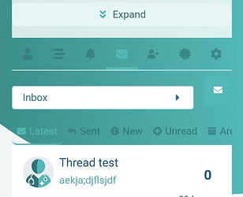](../../../assets/images/197703/d52ebeec40af3fe6c1c7b304559e2652ae01d0b4.jpeg "image")

The error page on mobile version does the same thing. They’re all fine on desktop/tablet view, but mobile version seems to have different CSS?

Does anyone perhaps know how/where I can change this? I don’t have any coding background, so would I need to get a developer to do this for me?

---

### Post #488 by [Clo](../../users/Clo.md)
*Posted: 2024-03-01 07:24*

Here is an example of what it looks like on tablet/mobile and also what most of the other tabs look like:

[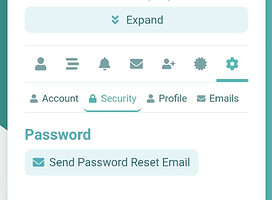](../../../assets/images/197703/20567e38ce155ab3836b7c012912ec6954f05d70.jpeg "image")

---

### Post #489 by [Moin](../../users/Moin.md)
*Posted: 2024-03-01 07:36*

Welcome to Meta! 👋

 Clo:

> I don’t have any coding background, so would I need to get a developer to do this for me

I don’t think so. This is an [official](/tag/official) theme so it is maintained by the Discourse team. But even other themes which are shared here are often fixed by the maintainer when you report a problem.

I can reproduce your problem here. It looks even worse than your screenshot because the message preview is wider than my screen.  

[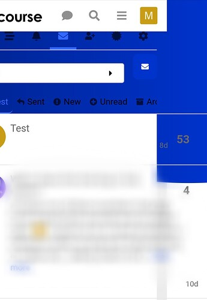](../../../assets/images/197703/d8b9dbf464db471a26a52877ed302599ab352c94.jpeg "The image shows a blurred screenshot of an email or messaging inbox with a blue and white color scheme, displaying elements such as a search bar, navigational buttons, and unread message notifications. \(Captioned by AI\)")

---

### Post #490 by [Gonerdot](../../users/Gonerdot.md)
*Posted: 2024-03-04 16:51*

Does anyone know how to hide td-class?

[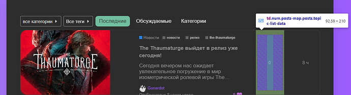](../../../assets/images/197703/bd397e4d0f9d7cddfb68e7cf9aab480d0aaad2fc.jpeg "image")

---

### Post #491 by [Arkshine](../../users/Arkshine.md)
*Posted: 2024-03-04 16:58*

You can try this CSS:
    
    
    .topic-list {
        .topic-list-header .posts,
        .topic-list-body .posts {
            display: none !important;   
        }
    }

---

### Post #492 by [Gonerdot](../../users/Gonerdot.md)
*Posted: 2024-03-04 17:05*

Yes, I tried to hide them this way. regular divs are hidden, but it doesn’t work with td. I tried several options:
    
    
    .td.num.posts... {
            display: none;
    }
    
    .td:num.posts... {
            display: none;
    }

---

### Post #493 by [Arkshine](../../users/Arkshine.md)
*Posted: 2024-03-04 17:07*

I tested my CSS, and it works for me. Did you test it?

 Gonerdot:

> I tried to hide them this way

It misses the `!important` for this theme.

---

### Post #494 by [Gonerdot](../../users/Gonerdot.md)
*Posted: 2024-03-04 17:12*

Thank’s [@chapoi](/u/chapoi)
    
    
    .full-width .contents .topic-list .topic-list-body .topic-list-item .topic-list-data.posts,
    .full-width .contents .topic-list .topic-list-body .topic-list-item .topic-list-data.age,
    .full-width .contents .topic-list .topic-list-body .topic-list-item .topic-list-data.posters {
    	display: none;
    	
    }
    

[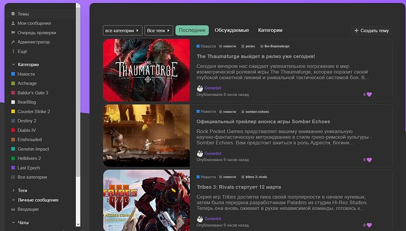](../../../assets/images/197703/67cd33e0b818a24219f6cc43c897815dcdc0d381.jpeg "image")

---

### Post #495 by [Gonerdot](../../users/Gonerdot.md)
*Posted: 2024-03-04 17:30*

There is some empty space at the top. Is there any way to remove it? I can’t find anything using the element inspector.

[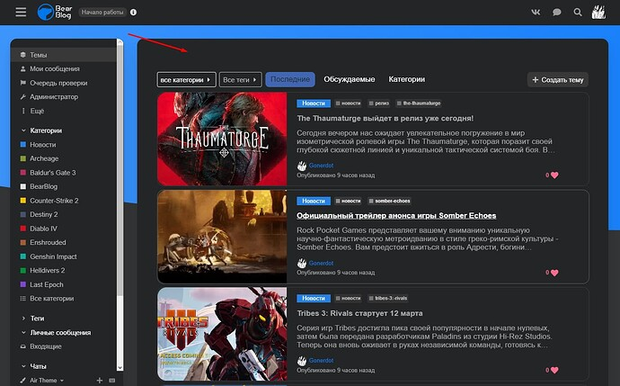](../../../assets/images/197703/08c804685609b97b045b07615776d645e2b7abe9.jpeg "image")

* * *

And I would like to increase the width of the block with the topic content

[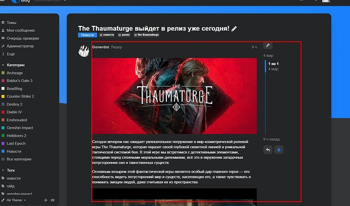](../../../assets/images/197703/29702d8583bf2e5cc843cd750c687f4cd406697e.jpeg "image")

[@jordan.vidrine](/u/jordan.vidrine)

---

### Post #496 by [Steven](../../users/Steven.md)
*Posted: 2024-03-05 13:24*

 Gonerdot:

> There is some empty space at the top. Is there any way to remove it? I can’t find anything using the element inspector.
> 
> 

There’s a margin-top in the main-outlet class

You should add this:
    
    
    html body #main-outlet {
      margin-top: 0;
    }
    

 Gonerdot:

> And I would like to increase the width of the block with the topic content

I’ve never used this yet, but there is a topic-width settings in the css, in a root element.

Add this, it should adapt everything else:
    
    
    :root {
      --topic-body-width: 750px;
    }

---

### Post #497 by [Gonerdot](../../users/Gonerdot.md)
*Posted: 2024-03-05 18:44*

 Steven:

> You should add this:
>     
>     
>     html body #main-outlet {
>       margin-top: 0;
>     }
>     

This is something not right

[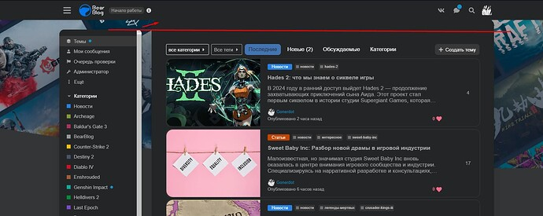](../../../assets/images/197703/0eb455d86a08fe96bcdd1cadaf0e8783ed02424b.jpeg "image")

---

### Post #498 by [Gonerdot](../../users/Gonerdot.md)
*Posted: 2024-03-05 18:49*

 Steven:

> Add this, it should adapt everything else:
>     
>     
>     :root {
>       --topic-body-width: 750px;
>     }
>     

At the same time it looks normal. Thank you
    
    
    .container.posts {
        grid-template-columns: 90% 10%;
    }

---

### Post #499 by [jordan.vidrine](../../users/jordan.vidrine.md)
*Posted: 2024-03-05 21:17*

Thanks for sharing! Will take a look at this soon.

---

### Post #500 by [jordan.vidrine](../../users/jordan.vidrine.md)
*Posted: 2024-03-08 04:24*

 Clo:

> Preferences tabs don’t have a solid background, causing it to look a bit strange. See image below for reference:

 Clo:

> Here is an example of what it looks like on tablet/mobile and also what most of the other tabs look like:

 Moin:

> I can reproduce your problem here. It looks even worse than your screenshot because the message preview is wider than my screen.

This has been fixed in the latest merging of a PR

---

### Post #501 by [Gonerdot](../../users/Gonerdot.md)
*Posted: 2024-03-09 12:16*

Please tell me how to crop the background image like this, with symmetrically rounded corners.

[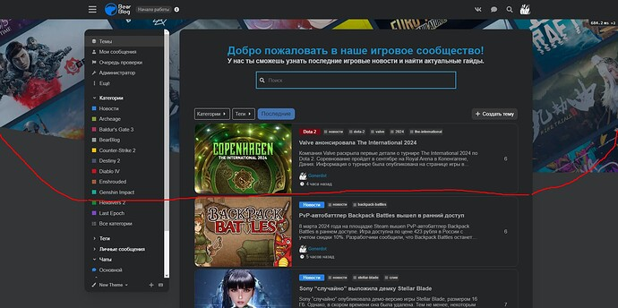](../../../assets/images/197703/dd5a60e5c65d1a3894f24e8e99256579e975890b.jpeg "image")

Now the code looks like this:
    
    
    html .background-container {
        position: fixed;
        top: 0;
        left: 0;
        height: 100vh;
        width: 100vw;
        background: url(https://site/uploads/default/original/2X/2/26d48362654a9e03c716eeaff4a176cbbd01d6b8.png);
        background-size: cover;
      
    }

---

### Post #502 by [jordan.vidrine](../../users/jordan.vidrine.md)
*Posted: 2024-03-11 20:06*

[github.com/discourse/discourse-air](https://github.com/discourse/discourse-air/blob/e223ab3008428794b507bd624c285b377c671cd1/common/common.scss#L269)

#### [common/common.scss](https://github.com/discourse/discourse-air/blob/e223ab3008428794b507bd624c285b377c671cd1/common/common.scss#L269)

[`e223ab300`](https://github.com/discourse/discourse-air/blob/e223ab3008428794b507bd624c285b377c671cd1/common/common.scss#L269)
    
    
          
    
    
              
        259.     position: fixed;
    
              
        260.     top: 0;
    
              
        261.     left: 0;
    
              
        262.     height: 100vh;
    
              
        263.     width: 100vw;
    
              
        264.     background: linear-gradient(
    
              
        265.       90deg,
    
              
        266.       var(--tertiary-hover) 0%,
    
              
        267.       var(--tertiary) 100%
    
              
        268.     );
    
              
        269.     clip-path: ellipse(148% 70% at 91% -14%);
    
              
        270.   }
    
              
        271. }
    
              
        272. 
              
        273. html body #main-outlet {
    
              
        274.   margin-top: 30px;
    
              
        275.   margin-bottom: 50px;
    
              
        276.   background: var(--secondary);
    
              
        277.   border-radius: 1em;
    
              
        278.   padding: 3em 3em 5%;
    
              
        279.   max-width: 1150px;
    
          
    
        

You are going to want to edit the clip path properties. You can learn more about that on sites like css tricks.

---

### Post #503 by [Moin](../../users/Moin.md)
*Posted: 2024-03-15 19:21*

When I use the theme here at Meta, the icons in front of Quote, Edit, Copy Quote, and Ask AI are invisible.  

---

### Post #504 by [jordan.vidrine](../../users/jordan.vidrine.md)
*Posted: 2024-03-15 19:37*

Hmm, what color scheme are you using? The bg for that isnt what the theme uses.

---

### Post #505 by [Moin](../../users/Moin.md)
*Posted: 2024-03-15 19:42*

WCAG Light definitely has the problem, but I changed to “theme default”  
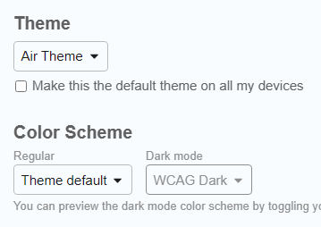  
and it was still the same. I did refresh to check that the color scheme was saved so I hope it is not affected by my [problem](../../../assets/images/197703/184e79ce3851b9feb965117b68a97e5e7de00b93_2_1033x507.png) with changing color schemes. The blue in the background was lighter after I changed to the default color scheme.

---

[← Previous](197703-page-5.md) | **Page 6 of 8** | [Next →](197703-page-7.md)
