[🏠 Home](../../index.md) | [📋 Latest](../../latest/index.md) | [🔥 Top](../../top/replies/index.md) | [👥 Users](../../users/index.md)

[Home](../../index.md) » [Theme](../../c/theme/index.md) » Air Theme

---

# Air Theme (Page 7 of 8)

> **Category:** Theme
> **Author:** Arkshine
> **Created:** 2021-07-20 20:24

[← Previous](197703-page-6.md) | **Page 7 of 8** | [Next →](197703-page-8.md)

---

### Post #506 by [Arkshine](../../users/Arkshine.md)
*Posted: 2024-03-15 19:56*

I see the same issue with the default Color Scheme (I did not switch the scheme before).

Oddly, the background and the icon use the same `--primary-low-mid` color, and I can’t see any recent changes around that. 

---

### Post #507 by [jordan.vidrine](../../users/jordan.vidrine.md)
*Posted: 2024-03-15 20:47*

Ok thanks for the report, I found the issue and it has been fixed.

---

### Post #509 by [friday7474](../../users/friday7474.md)
*Posted: 2024-03-29 19:10*

Hey guys. I’m using the Air Theme and would like to show the latest posts to the users on the homepage of the forum but Air Theme only shows the categories and there is also no latest activity post shown (like in the default theme).

How can I make it show both, the categories and the latest posts (right below the categories) on the homepage of mobile devices?

---

### Post #510 by [Ragnar](../../users/Ragnar.md)
*Posted: 2024-03-31 13:26*

Hello everyone, is it possible to show how many people viewed the topics?

[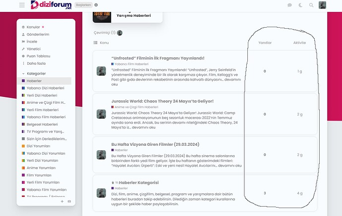](../../../assets/images/197703/f6f60ec69a9109cfba023a786e8f9d1e41c9d3f9.jpeg "forrummmm")

---

### Post #511 by [Steven](../../users/Steven.md)
*Posted: 2024-04-01 16:51*

It may not be the cleanest way to do it, but add these lines in Desktop css
    
    
    .topic-list-data.num.views {
      display: unset;
    }
    td.topic-list-data.num.views {
      display: flex;
      order: 4;
      justify-content: center;
      align-items: center;
    }

---

### Post #512 by [Adam_Fox](../../users/Adam_Fox.md)
*Posted: 2024-04-02 10:40*

Hi all, I just updated to the Air Theme. Love it by the way.

But I used to have a background image on the login screen using `discourse-trendy-login` but now I am using the Air Theme I can’t get the background image to show up. How do I change this? Thanks in advance.

[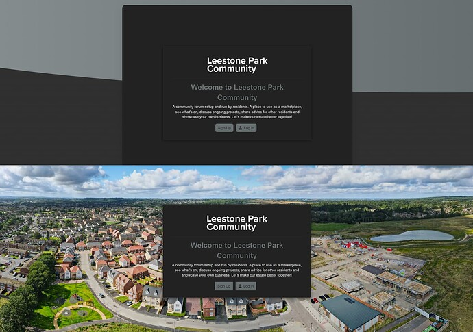](../../../assets/images/197703/5a70311ff4f37191f91bef443fdae4a12a45d362.jpeg "LeestoneParkLogin")

---

### Post #513 by [jordan.vidrine](../../users/jordan.vidrine.md)
*Posted: 2024-04-02 16:11*

Can you share a link to your site?

I _think_ this should work for you:
    
    
    .background-container {
        display: none;
    }
    

Please report back here if it does not.

---

### Post #514 by [Heliosurge](../../users/Heliosurge.md)
*Posted: 2024-04-10 21:54*

Hi Jordan,

I am experiencing an interesting effect with setting a Banner with image. It is stretching the image making it scroll horizontally.

While a onebox seems to respect the with.

[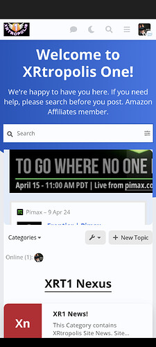](../../../assets/images/197703/72ea8904723666d7b9e961b2587ccf47f2298859.jpeg "Screenshot_20240410-170851")

The below shows the top bar of the banner scrolled to the right centering the cleaning sed and edit

I have tried different image sizes. In the topic user for the banner post displays fine. This also seems to affect YouTube boxes pulled at least using the RSS plugin. Have not tested with regular YouTube onebox.

How can I fix this? And is there a way with CSS to increase height of the visible banner?

---

### Post #515 by [icaria36](../../users/icaria36.md)
*Posted: 2024-06-14 14:21*

Several people have asked about showing the subcategories in Categories page. This is about the [Modern Category + Group Boxes](https://github.com/discourse/discourse-minimal-category-boxes) component, but since it doesn’t have a topic of its own (right?) I’ll share my findings here:

This works:
    
    
    /* Displays subcategories */
    .custom-category-boxes:not(.above-discovery-categories-outlet) .subcategories {
      display: inline-flex;
      flex-flow: wrap;
    }
    
    .custom-category-boxes:not(.above-discovery-categories-outlet) .subcategory {
      display: inline-flex;
      align-items: baseline;
      margin-right: .3em;
    }
    
    /* Removes the category images from the list */
    .custom-category-boxes:not(.above-discovery-categories-outlet) .subcategories .subcategory .subcategory-image-placeholder {
      display: none;
    }
    

Also, if you have many subcategories, perhaps you want to show one category per row.
    
    
    /* One category per row */
    .custom-category-boxes:not(.above-discovery-categories-outlet) {
      grid-template-columns: 1fr;
    }
    

The result looks like this:

[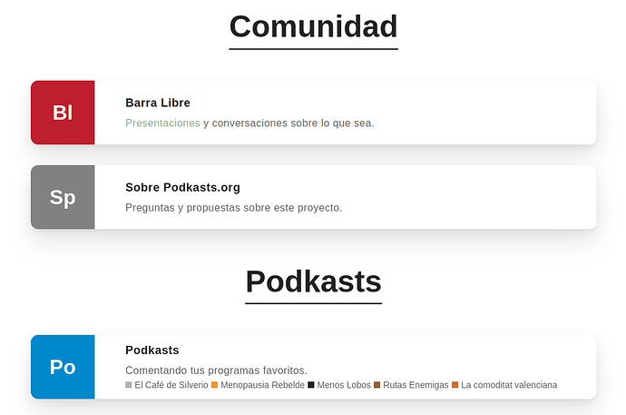](../../../assets/images/197703/5d6e888f3008b9a96895b5097749920f21707b9f.png "image")

I think the boxes have a height limit but I haven’t found the way to remove it. We don’t have enough subcategories yet to see the problem on desktop, but we are hitting the limit on mobile:

[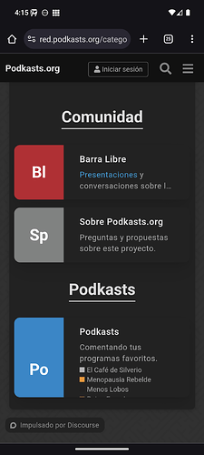](../../../assets/images/197703/e324fa0bb923ad61b0651ed5dadf602881d9e76e.png "Screenshot_20240614-161524")

Any ideas to solve this problem?

---

### Post #516 by [thaidb](../../users/thaidb.md)
*Posted: 2024-07-03 01:22*

I have error responsive with this them by chrome and edge browser, with firefox is OK.  
How can i fix it.  
Tks you

[ 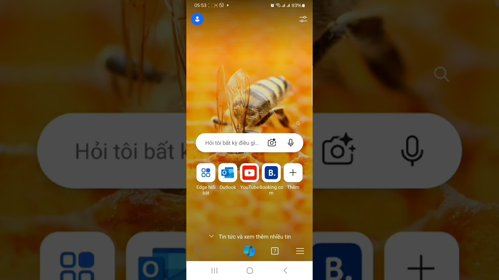 ](https://www.youtube.com/watch?v=VGj05M7s1nU)

---

### Post #517 by [the220hq](../../users/the220hq.md)
*Posted: 2024-07-21 03:23*

Is there anyway to keep avatars at topic list on desktop in circle format? I checked on mobile it is in circle, but why square in desktop.

---

### Post #518 by [Heliosurge](../../users/Heliosurge.md)
*Posted: 2024-07-21 05:11*

Hi on my Air Theme the desktop avatars are circle as per mobile.

Do you have maybe a component that is changing the avatar to Square?

Edit according to Op post looks like should be square…

---

### Post #519 by [the220hq](../../users/the220hq.md)
*Posted: 2024-07-21 07:29*

No, I don’t. I’m using Discourse default theme and Air theme. Discourse default is using circle format. If you look at another board images above, all of them are square.

And the avatars doesn’t look smooth.

---

### Post #520 by [Heliosurge](../../users/Heliosurge.md)
*Posted: 2024-07-21 09:41*

Might be able to use this [Theme component](/c/theme-component/120) to correct it.

[Avatar Size and Shape](https://meta.discourse.org/t/avatar-size-and-shape/106124) [Theme component](/c/theme-component/120)

>  Summary Avatar Size and Shape will allow you to easily change the size and shape of the avatars on your site. 👓 Preview [Preview on Discourse Theme Creator](https://discourse.theme-creator.io/theme/Discourse/avatar-size-and-shape) 🛠️ Repository Link <https://github.com/discourse/discourse-avatar-component> 📖 New to Discourse Themes? [Beginner’s guide to using Discourse Themes](https://meta.discourse.org/t/beginners-guide-to-using-discourse-themes/91966) Install this theme component Features Avatar Size and Shape allows you to easily customise the size and shape of avatars on…

---

### Post #521 by [the220hq](../../users/the220hq.md)
*Posted: 2024-07-21 10:50*

Exactly what I need to use. Thanks so much!

---

### Post #522 by [yekta](../../users/yekta.md)
*Posted: 2024-08-04 07:11*

can someone tell me how to change the background of this theme?

---

### Post #523 by [Heliosurge](../../users/Heliosurge.md)
*Posted: 2024-08-05 00:12*

Can you be more specific? There are a few places you can modify th background with a pic.

---

### Post #524 by [Heliosurge](../../users/Heliosurge.md)
*Posted: 2024-08-11 08:50*

Hi [@jordan.vidrine](/u/jordan.vidrine) I have noticed in a couple of spots there is no container around the content.

I would prefer to bubble these elements. As it makes it hard to read when some text for example moves from white background to blue.

[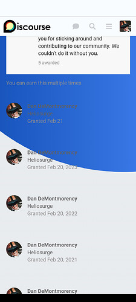](../../../assets/images/197703/a39fc0b9b2618d62c9cf0a1aeb41ce2d123cedf4.jpeg "The image shows a screenshot of a mobile device displaying a social media platform interface with a profile picture and accompanying name.  \(Captioned by AI\)")

This is badges. But also does it in “Earned …”

I would prefer the bubble vs the straight say white column as I think it has a Nicer effect. This would also be good for other floating elements and even the modern category group headers.

---

### Post #525 by [Heliosurge](../../users/Heliosurge.md)
*Posted: 2024-08-14 01:05*

Mod for Air Theme support who’s online [plugin](/c/plugin/22)

Create [theme-component](/c/theme-component/120)

Edit common CSS and add this code
    
    
    // Whis Online Customization
    .discovery-list-container-top-outlet.online_users_widget {
          display: flex;
          padding-top: .38em;
          background-color: var(--secondary);
          border: 1px solid rgba(var(--primary-rgb), 0.2);
          border-radius: 0.65em;
          transition: box-shadow 100ms ease-in-out;
          box-shadow: 0px 0px 8px rgba(0, 0, 0, 0.05);
    }
    

Enable Component in air theme

Result previous this displayed without background color or border making it hard to see read

[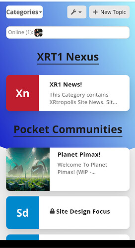](../../../assets/images/197703/6591d5b2d371ae65f4af80ec53b397b142f75871.jpeg "Screenshot_20240813-222849")

There are a few areas would like to fix up that have this issue.

Example shown in my previous post.

* * *

EDiT New additional fix for Global banner [problem](https://meta.discourse.org/t/air-theme/197703/514)

Additional info on Global Banner Specs:

[Using an Image for a Global Banner Topic - Dimensions?](../../../assets/images/197703/3296e5435c4919f2814f0b546cfec404971b2a41_2_1035x532.jpeg)

> Global pinned banner you can fit a 1050px x 150px image in there without hitting any scrollbars.

* * *

[Using an Image for a Global Banner Topic - Dimensions?](../../../assets/images/197703/3296e5435c4919f2814f0b546cfec404971b2a41_2_1035x532.jpeg)

> Note that as you narrow the browser the image won’t fit, and scroll will return. You can avoid this with a little custom CSS added to your theme to re-scale the image… but the image will start getting really small once you’re down to the size of a mobile device, so it’s not perfect
    
    
    //global banner image fix
    #banner img {
        width: 100%;
        height: auto;
    }
    

Special thanks [@awesomerobot](/u/awesomerobot) for providing this code snippet

---

### Post #526 by [dviedma](../../users/dviedma.md)
*Posted: 2024-08-23 00:32*

Hi everybody, I was just trying to add some custom CSS to this theme but the option is not there together with the other theme customization options. What am I missing?

---

### Post #527 by [Heliosurge](../../users/Heliosurge.md)
*Posted: 2024-08-23 00:56*

Did you create a new theme component & add it to in this case the air theme?

You have seen my mods above. Are you trying to override parts of the theme settings or like my post above add mod/fixes?

---

### Post #528 by [dviedma](../../users/dviedma.md)
*Posted: 2024-08-23 16:20*

Thank you Dan! I was able to figure out the adding a new component and then add custom CSS there.

---

### Post #529 by [Heliosurge](../../users/Heliosurge.md)
*Posted: 2024-08-23 17:43*

If you’re wanting to Override a setting. Use “!important”  
Ie
    
    
    .some-selector {
        padding-top: 2.5em !important;
    {
    

Still learning myself. Discourse is quite diverse.

---

### Post #530 by [musicmaker3112](../../users/musicmaker3112.md)
*Posted: 2024-09-05 04:51*

Thanks for the great theme. it all works. But I have the question how I can change the background image ?  
Thanks for the help

---

### Post #531 by [Vaping_Community](../../users/Vaping_Community.md)
*Posted: 2024-09-19 02:27*

Create a theme component and add this with your background image
    
    
    html .background-container {
        position: fixed;
        top: 0;
        left: 0;
        height: 100vh;
        width: 100vw;
        background-image: url();
        background-size: cover;
        opacity: 1;
        /* background: linear-gradient(90deg, var(--tertiary-hover) 0%, var(--tertiary) 100%); */
        clip-path: unset;
        background-color: var(--secondary) !important;
    }
    
    

 [Beginner's guide to developing Discourse Themes](https://meta.discourse.org/t/beginners-guide-to-developing-discourse-themes/93648) [Developer Guides](/c/documentation/developer-guides/56)

> So, you want to create Discourse themes? Not sure where to start? Or maybe you have created Discourse themes before, but want to learn how to do even more cool things. Well, you’ve come to the right place 😉 Developer’s guide to Discourse Themes Subjects include a general overview of Discourse themes, creating and sharing Discourse themes, theme development examples, searching for and finding information / examples in the Discourse repository, and best practices. Prerequisites: …

---

### Post #532 by [Liseré](../../users/Liseré.md)
*Posted: 2024-10-03 10:21*

Hello guys,

Is there a way to add some external links in the header close to the logo?

Thank you!

---

### Post #533 by [Heliosurge](../../users/Heliosurge.md)
*Posted: 2024-10-03 15:27*

There is this one

[Custom Header Links (icons)](https://meta.discourse.org/t/custom-header-links-icons/86307) [Theme component](/c/theme-component/120)

>  Summary Custom Header Links (icons) will allow you to easily add linked icons to the Discourse header. 👓 Preview [Preview on Discourse Theme Creator](https://discourse.theme-creator.io/theme/Discourse/custom-header-links-icons) 🛠️ Repository Link <https://github.com/discourse/discourse-icon-header-links> 📖 New to Discourse Themes? [Beginner’s guide to using Discourse Themes](https://meta.discourse.org/t/beginners-guide-to-using-discourse-themes/91966) Install this theme component Features Screenshots Desktop [[Capture3]](../../../assets/images/197703/914bac903b1e05b669520d450b2f7f3106459609.PNG "Capture3") Mobile [[Capture]](../../../assets/images/197703/eedc0cb90e0b1e786730e85dc910c17c7e88187b.PNG "Capture") Settings This component includes a … 

And

[ Dropdown Header](https://meta.discourse.org/t/dropdown-header/226170) [Theme component](/c/theme-component/120)

> 🔍 Overview This theme component allows you to add links with text, icons, and dropdowns to the native header of your Discourse site. [[image]](../../../assets/images/197703/70173d2b3eec325ce82671dfa168c3e6d0b0d255.jpeg "image") Bug reports, feature requests, and PRs are most welcome; sponsorship enables work on this component to be prioritised by the Pavilion team. 💻 Code [View the GitHub Repo](https://github.com/paviliondev/discourse-dropdown-header) ⚙️ Settings There are a variety of settings you can configure to customize the component, including link customizations, icon sourcing, adding link security, positioning… 

There is also one that adds a bar with dropdowns below site header

[Header Submenus](../../../assets/images/197703/67cd33e0b818a24219f6cc43c897815dcdc0d381_2_1035x588.jpeg) [Theme component](/c/theme-component/120)

> Nice update Joe, I’ve only run into two problems on mobile. You can no longer scroll side to side if you have a lot of menu items. When you tap an item in the dropdown, the dropdown stays open

---

### Post #534 by [Liseré](../../users/Liseré.md)
*Posted: 2024-10-03 16:49*

Hi,

Thank you very much for taking the time to reply.

I was using this one but was not entirely satisfied : [Custom Top Navigation Links](https://meta.discourse.org/t/custom-top-navigation-links/87225)

Your second suggestion is exactly what I need, I am really happy with the result.

Thank you very much for your help!

---

### Post #535 by [Liseré](../../users/Liseré.md)
*Posted: 2024-10-04 13:19*

Hello all,

Sorry for this double message but is there a way to show the subcategories on both desktop and mobile and in the same time display the full category titles on mobile when they are a bit long?

My config is CATEGORY BOXES WITH SUBCATEGORIES but without using Modern Category + Group Boxes.

The result is great on desktop and mobile when I use the desktop version. But with the mobile version you cannot read the end of some category titles.

Thanks a lot for your help!

---

### Post #536 by [Heliosurge](../../users/Heliosurge.md)
*Posted: 2024-10-04 17:12*

Can you post a ss?

---

### Post #537 by [Liseré](../../users/Liseré.md)
*Posted: 2024-10-04 17:28*

Sure please find attached 2 SS with my iPhone one mobile version and one desktop version.  

[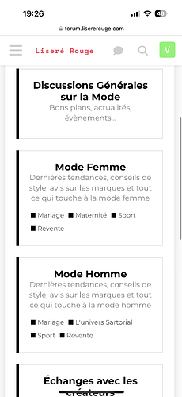](../../../assets/images/197703/f63fdf4df42413fed6689739630d80c0b89b1d3d.png "IMG_8421")

  

[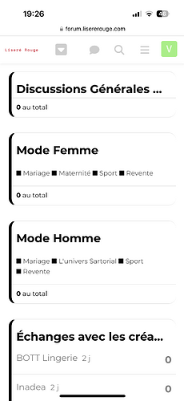](../../../assets/images/197703/74f505d2a91ef316b323231bfd2577b2c374acbe.png "The image shows a black and white screenshot of a mobile phone displaying a list of personal items and their corresponding quantities. The items listed are in French.  \(Captioned by AI\)")

---

### Post #538 by [Heliosurge](../../users/Heliosurge.md)
*Posted: 2024-10-04 17:48*

I see subcategories showing in both ss. Are you looking to have category description in both? Or mirror desktop with no desc?

---

### Post #539 by [Liseré](../../users/Liseré.md)
*Posted: 2024-10-04 17:58*

Sorry if I was not clear.

I would like to see the full category titles

For example on the desktop version you have «General discussions about fashion» but on the mobile version you have only «General discussions »

---

### Post #540 by [Heliosurge](../../users/Heliosurge.md)
*Posted: 2024-10-04 18:05*

I am not sure the CSS code off hand. But you should be able to have the category title wrap like in the first pic you posted.

Maybe try inspect element on desktop to see if you can identify the CSS used to wrap the category name to use 2 lines.

---

### Post #541 by [Liseré](../../users/Liseré.md)
*Posted: 2024-10-05 10:13*

I tried some CSS with ChatGPT and Claude for example:

.category-box-heading,  
.category-box-heading a,  
.category-box-heading h3 {  
max-width: 100%;  
width: 100%;  
display: block;  
word-break: break-word;  
overflow-wrap: break-word;  
white-space: normal !important;  
overflow: visible !important;  
text-overflow: clip !important;  
line-height: 1.4;  
padding: 5px 0;  
}

.parent-box-link {  
display: block;  
width: 100%;  
}

[@media](/u/media) screen and (max-width: 767px) {  
.category-box-heading h3 {  
font-size: 16px; /* Ajustez cette valeur selon vos besoins */  
}  
}

But it’s not working .

Is there a way to force the desktop view on mobile? It will be perfect to have description and subcategories.

Thanks!

---

### Post #542 by [Jagster](../../users/Jagster.md)
*Posted: 2024-10-05 11:06*

Have you tried how the desktop view looks in a mobile? It isn’t that great in some mobiles.

---

### Post #543 by [Liseré](../../users/Liseré.md)
*Posted: 2024-10-05 12:52*

Thank you for your reply.

I just tried on 2 iPhone and it was like this.

Which is exactly what I am looking for.

Ideally I would like that my users have this view directly without playing with the settings.  

")

---

### Post #544 by [Heliosurge](../../users/Heliosurge.md)
*Posted: 2024-10-06 00:16*

Disable your custom component. Create a new test component in mobile CSS try this
    
    
    .category-box-heading h3 {
    //* You may need to uncomment the 2 lines below.
    //      Overflow: unset !important;
    //      Text-overflow: unset !important;
         text-wrap: balance !important;
    }
    

I am pretty sure you will not need any other CSS modifications.

Just tested. Not working with my snippet either.

---

### Post #545 by [inlann](../../users/inlann.md)
*Posted: 2024-10-11 09:43*

Latest version of effective code:
    
    
    .full-width .contents .topic-list thead th.posts {
        width: 10%;
    }
    
    .full-width .contents .topic-list thead th.activity {
        width: 10%;
        order: 4;
    }
    
    th.num.views {
        width: 10%;
        order: 3;
        display: block;
    }
    
    .full-width .contents .topic-list tbody tr:not(.topic-list-item-separator) td.posts {
        width: 10%;
        order: 2;
    }
    
    .full-width .contents .topic-list tbody tr:not(.topic-list-item-separator) td.age {
        width: 10%;
        order: 4;
    }
    
    .topic-list .views {
        width: 10% !important;
        order: 3 !important;
        display: flex !important;
        visibility: visible !important;
        justify-content: center;
    }
    
    .full-width .contents .topic-list tbody tr:not(.topic-list-item-separator) td.views {
        width: 10% !important;
        order: 3 !important;
        display: flex !important;
        justify-content: center;
        align-items: center;
    }

---

### Post #548 by [newadda](../../users/newadda.md)
*Posted: 2024-11-09 14:27*

I have two questions:

  1. How to make the width of the theme as Full page?
  2. How to reduce the font size of default welcome message at the home page (Screenshot attached).  

[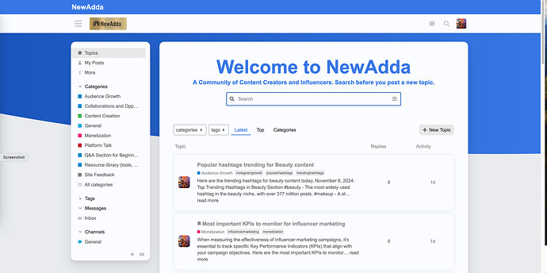](../../../assets/images/197703/7859a5f4ebbc7bbc2d80ed90c297b0a8c246bc70.jpeg "Screenshot 2024-11-09 at 7.55.20 PM")

can somebody help me in getting these?

---

### Post #549 by [chenxiangcheng](../../users/chenxiangcheng.md)
*Posted: 2025-01-16 06:45*

That’s great. Thank you.

---

### Post #550 by [Film_Fugitives](../../users/Film_Fugitives.md)
*Posted: 2025-01-17 16:17*

I am trying to change the background of the forum i created using the platform and I am unable to do that with the CSS codes shared in the thread so far. I am quite new to the platform so would be grateful for the help. I am trying to aim for a single color background for the forum, a greyish color. (<https://forums.fugitives.com/>)

[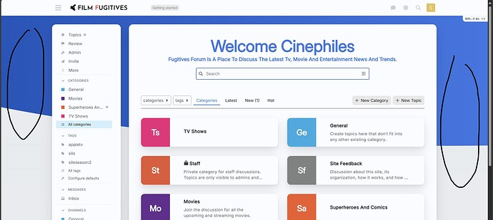](../../../assets/images/197703/14e38ce57ea9f796b071befb8d46a810762ef018.jpeg "image")

---

### Post #551 by [Canapin](../../users/Canapin.md)
*Posted: 2025-01-17 16:28*

Welcome. The blue part is set in `.background-container` 🙂
    
    
    html .background-container {
        position: fixed;
        top: 0;
        left: 0;
        height: 100vh;
        width: 100vw;
        background: linear-gradient(90deg, var(--tertiary-hover) 0%, var(--tertiary) 100%);
        clip-path: ellipse(148% 70% at 91% -14%);
    }

---

### Post #552 by [Film_Fugitives](../../users/Film_Fugitives.md)
*Posted: 2025-01-17 16:41*

thank you. any way to change the weight and color of the font specifically? Also, is is to possible to achieve chat design like the one in the added screenshot.

Warm Regards and thank you for the help.  

[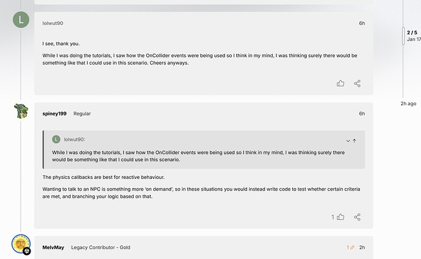](../../../assets/images/197703/1c73bcb020cf5aca510db740ad52485b14c9af5e.jpeg "WhatsApp Image 2025-01-17 at 4.45.24 PM")

---

### Post #553 by [Canapin](../../users/Canapin.md)
*Posted: 2025-01-17 16:55*

You can change fonts from `/wizard/steps/styling`.  
You can change the text color by modifying the color palette from `/admin/customize/colors`.

I don’t know about the overall style from your screenshot, but for the vertical line, this could help: [Line under avatar? - #2 by Canapin](../../../assets/images/197703/20567e38ce155ab3836b7c012912ec6954f05d70_2_272x200.jpeg)

---

### Post #554 by [thaidb](../../users/thaidb.md)
*Posted: 2025-02-11 06:43*

Error The theme is not responsive

And show empty space in each topic

[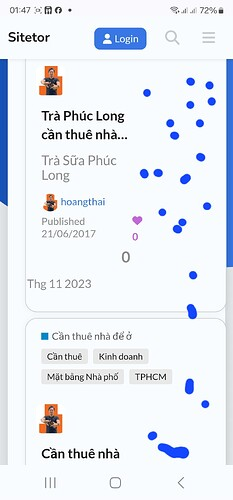](../../../assets/images/197703/9edfdbc8760e484718d979dddbd6a6cda9cccbed.jpeg "The image shows a social media post by Trả Sửa Phúc Long with a message fragment "Long cán thuê nhá..." and hashtags discussing technical services like "Tĩnh doanh" and "Mắt bẹng Nhà phố," posted on Thg 11 2023. \(Captioned by AI\)")

---

### Post #555 by [Heliosurge](../../users/Heliosurge.md)
*Posted: 2025-02-11 13:40*

Yeah it also seems to do sideways overflow on Meta here as you showed with the horizontal shifting. I find at times here the texts overflows outside of the boxes in topic lists. Typically iirc in suggested topics but also at times other areas.

---

### Post #556 by [cloudunicorn](../../users/cloudunicorn.md)
*Posted: 2025-02-20 22:16*

Any idea why I’d get a 502 error installing Air?

[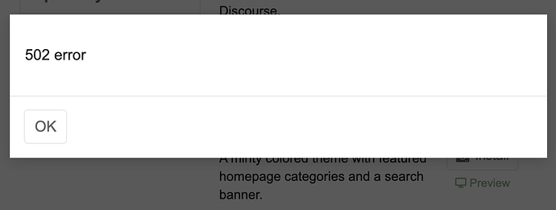](../../../assets/images/197703/515788cd0386a7d2c0590a45c847e99025a6fb39.png "Screenshot 2025-02-20 at 3.08.02 PM")

Graceful theme installed right away. This is a fresh install of Discourse.

---

### Post #557 by [Arkshine](../../users/Arkshine.md)
*Posted: 2025-02-20 22:23*

Do you get the same error every time you try to install this theme?

---

### Post #558 by [cloudunicorn](../../users/cloudunicorn.md)
*Posted: 2025-02-20 22:23*

I do! I tried on multiple machines (edit: laptop and desktop, not different servers) as well.

---

[← Previous](197703-page-6.md) | **Page 7 of 8** | [Next →](197703-page-8.md)
