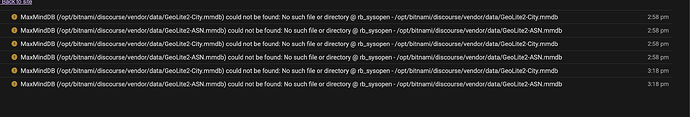
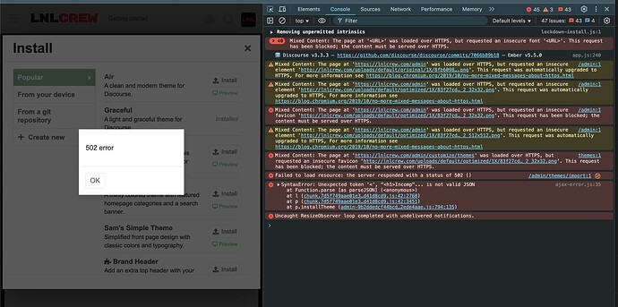
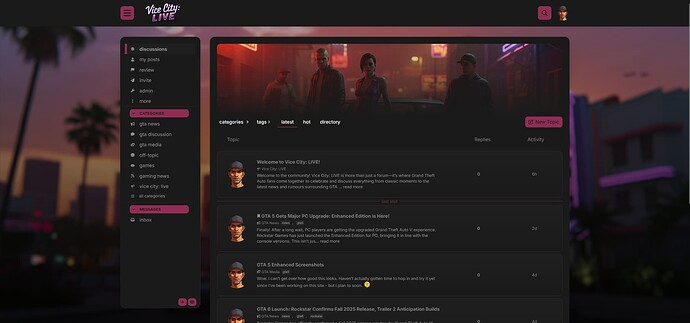
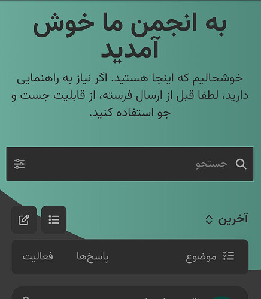
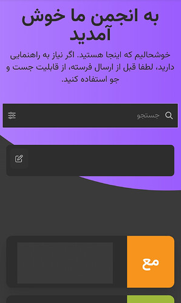
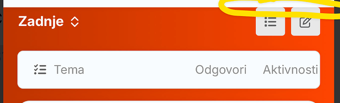
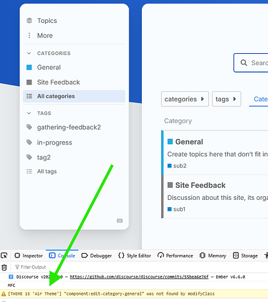
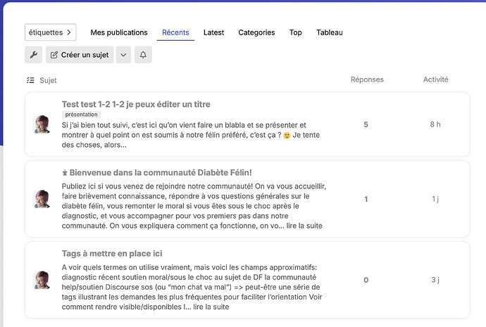

[🏠 Home](../../index.md) | [📋 Latest](../../latest/index.md) | [🔥 Top](../../top/replies/index.md) | [👥 Users](../../users/index.md)

[Home](../../index.md) » [Theme](../../c/theme/index.md) » Air Theme

---

# Air Theme (Page 8 of 8)

> **Category:** Theme
> **Author:** Arkshine
> **Created:** 2021-07-20 20:24

[← Previous](197703-page-7.md) | **Page 8 of 8** | Next →

---

### Post #559 by [Arkshine](../../users/Arkshine.md)
*Posted: 2025-02-20 22:25*

Do you see any error in the browser’s console and also in _yoursite_ /logs ?

---

### Post #560 by [cloudunicorn](../../users/cloudunicorn.md)
*Posted: 2025-02-20 22:34*

Logs…

Console - I’ve noticed the HTTP thing, fonts/favicon are borked and haven’t troubleshot that yet. [edit: turned on force https]

---

### Post #561 by [Arkshine](../../users/Arkshine.md)
*Posted: 2025-02-21 00:47*

Interesting. I have no idea at the moment. I can’t reproduce it on the latest or even your version.

For reference, you’re using Discourse 3.3.3.

By the way, is there a specific reason? The latest “[stable](https://meta.discourse.org/t/understanding-discourse-release-channels/264400)” version is 3.4.0, and you installed Discourse two days ago. 

---

### Post #562 by [cloudunicorn](../../users/cloudunicorn.md)
*Posted: 2025-02-21 01:39*

Good question 🙂 I am using PikaPods and they handle updates - I emailed them earlier. I was going to blame them on this too but the other theme installed no problem.

---

### Post #563 by [Mako-Poisoned](../../users/Mako-Poisoned.md)
*Posted: 2025-03-03 19:28*

Just wanted to share that I think this is a wonderful theme. Thanks, OP!

---

### Post #564 by [Northern](../../users/Northern.md)
*Posted: 2025-03-10 08:59*

I’ve been able to make something amazing using this theme as a base. It’s much appreciated, OP. Love how versatile Discourse is.

")

  

")

---

### Post #565 by [qingfeng1024](../../users/qingfeng1024.md)
*Posted: 2025-03-10 10:38*

If you could provide some tutorials on how you achieve such exquisite themes, it would be wonderful.

---

### Post #566 by [Northern](../../users/Northern.md)
*Posted: 2025-03-12 17:56*

I just spent quite a bit of time playing and tweaking CSS and testing it with different screen sizes to make sure it was all responsive. You can learn a lot from the inspection menu in your browser (F12) and using the element picker tool (Ctrl + Shift + C on firefox, top left button on inspection panel), and see exactly what classes elements use, and from there you can make modifications to those classes as needed.

[Outlets](https://meta.discourse.org/t/using-plugin-outlet-connectors-from-a-theme-or-plugin/32727) are also powerful to use, but they can be a bit confusing to navigate.

---

### Post #567 by [Nick_Torres](../../users/Nick_Torres.md)
*Posted: 2025-05-01 22:13*

hi there - just installed the theme - 2 questions

  1. how do I change the ‘welcome to our community…’ headline and subheadline?
  2. Can I auto-sort by top replies?

---

### Post #568 by [Heliosurge](../../users/Heliosurge.md)
*Posted: 2025-05-01 23:05*

Goto your [Theme component](/c/theme-component/120) in admin. It is this component outline in the Op.

 Discourse:

> Discourse Search Banner

---

### Post #569 by [NateDhaliwal](../../users/NateDhaliwal.md)
*Posted: 2025-05-01 23:08*

Wasn’t that merged into core recently?

---

### Post #570 by [Heliosurge](../../users/Heliosurge.md)
*Posted: 2025-05-01 23:09*

There is a basic form of it. It looks like the component was renamed to Advanced Search Banner.

Not sure if the Air theme is using the component or core. The same with the light/dark toggle option was merged in core

Detail here for the component & core update

 [Advanced Search Banner](https://meta.discourse.org/t/advanced-search-banner/122939/171) [Theme component](/c/theme-component/120)

> FYI all, we are imminently merging a simplified version of this into core [FEATURE: Add welcome banner to core by martin-brennan · Pull Request #31516 · discourse/discourse · GitHub](https://github.com/discourse/discourse/pull/31516) . This component is still supported, but it has been renamed to Advanced Search Banner from this PR onward [DEV: Update theme name to Advanced Search Banner by martin-brennan · Pull Request #84 · discourse/discourse-search-banner · GitHub](https://github.com/discourse/discourse-search-banner/pull/84) . If this component is installed, the core welcome banner will not be displayed. … 

I imagine the Air theme is still using the component as it would if not mistaken require some updates to the Air theme for the banner mods and instructions to enable the banner in site settings

---

### Post #571 by [Nick_Torres](../../users/Nick_Torres.md)
*Posted: 2025-05-02 11:50*

that worked - thank you much - I removed the sub-header and the H1 is font-size 64px. How do I reduce that?

---

### Post #572 by [Heliosurge](../../users/Heliosurge.md)
*Posted: 2025-05-02 19:11*

I was looking at the common CSS in the GitHub link. Having a bit of trouble identifying element.

But if you can identify the element you should be able to create a custom component and use something like

font-size: 44px !important;

To override the H1 size in the banner.

If you have better CSS knowledge then myself you might have an easier time identifying the element. Try inspect element as I am using a mobile with the insoect element in a browser but it is not as good as using a desktop browser’s insoect element. You can test modifying size there.

Posting In the advance Search Banner topic asking how to change the H1 size you might also get some guidance on how to achieve it as well.

---

### Post #573 by [Heliosurge](../../users/Heliosurge.md)
*Posted: 2025-05-03 22:18*

Okay I haven’t tested this but give this a try create a new [Theme component](/c/theme-component/120)

Edit CSS Common and add this code. I was looking at the Air Theme source in GitHub
    
    
    // custom search banner customizations
    .custom-search-banner-wrap {
       h1 {
        Font-size: 44px !important; 
        }
    }
    

The first section in the Air theme Common CSS has mods for the customer banner. So I was able to use that as a guide for the code above.

---

### Post #574 by [tomtjes](../../users/tomtjes.md)
*Posted: 2025-05-07 13:07*

I can’t figure out how to display subcategories anywhere but the subcategory dropdown menu. Is there a way to have them show up on overview pages?

---

### Post #575 by [gilles](../../users/gilles.md)
*Posted: 2025-05-13 19:01*

Hello,  
I am looking to reduce the number of characters in the topic summaries  
I can’t see the parameter  
Thank you

---

### Post #576 by [serkhelesheyi](../../users/serkhelesheyi.md)
*Posted: 2025-05-14 06:23*

")

  

")

  

")

**Subject** : Issues with Air Theme on Categories Homepage (Admin vs Non-Admin View)

Hi

I am using the Air theme on my Discourse forum. My forum’s default homepage is set to display Categories. I’ve encountered a few display issues related to this theme in **mobile view** , specifically differences in layout and functionality depending on whether the user is an administrator or a regular user.

Here are the specific problems:

  1. **Missing View Switcher for Admins:** When logged in as an administrator, there is no visible button or control to switch between the “Categories”, “Latest”, or “hot” views on the homepage. The Categories view is displayed, but I cannot easily navigate to the others from this page.
  2. **Invisible/Blank View Switcher for Non-Admins (Categories View):** When logged in as a non-admin user, a button does appear below the search bar, seemingly intended for switching views. However, when the forum is in the default “Categories” view, this button appears as a large, empty rectangle with no text label indicating its function (e.g., “Latest”, “hot”). This makes it confusing for users. This issue does not occur when the homepage is already set to “Latest” or “hot” for non-admins; the button correctly shows the text for switching back to “Categories”.
  3. **Different Category Box Width (Admin vs Non-Admin):** The display box for category names and descriptions appears narrower when viewed as an administrator compared to how it looks for a non-admin user. This affects the layout and presentation of the category list.

I have attached screenshots illustrating these issues (Irrelevant parts of the images have been blurred or removed)

Has anyone else experienced similar problems with the Air theme, particularly when the default homepage is set to Categories? Any insights or potential CSS fixes would be greatly appreciated.

Thanks!

---

### Post #578 by [Heliosurge](../../users/Heliosurge.md)
*Posted: 2025-05-27 21:46*

I can confirm the empty box on Air Theme. Though I have it even on admin.

I can confirm it seems to be in the Air Theme itself and not Modern category groups component.

This though you should create a topic in [Bug](/c/bug/1) category with tag [air-theme](/tag/air-theme) with maybe the additional tag [ux](/tag/ux)

I have a theme that is a copy of air theme and will see if I can spot maybe the code change but I am still a novice.

---

### Post #579 by [Heliosurge](../../users/Heliosurge.md)
*Posted: 2025-05-27 21:57*

This line in mobile CSS might be related. On GitHub this line reads
    
    
    .navigation-categories .navigation-container,
    .categories-list .navigation-container {
      border-bottom: 0 !important;
    }
    

As mentioned I copied the air theme CSS to make a custom theme. This is the original code for that line note the missing “px”
    
    
    .navigation-categories .navigation-container,
    .categories-list .navigation-container {
      border-bottom: 0px !important;
    }
    

~~Haven’t tested. But create a custom component and paste the above code in Mobile CSS. Save and enable component on air theme.~~

**Unfortunately just tested and it did not fix issue. The px must be default if not specified.**

---

### Post #581 by [MAR](../../users/MAR.md)
*Posted: 2025-06-13 19:57*

[@Northern](/u/northern) , I got to say I agree with [@qingfeng1024](/u/qingfeng1024) . A tutorial on how to customize it so nicely would be really valuable

---

### Post #582 by [AquaL1te](../../users/AquaL1te.md)
*Posted: 2025-06-15 12:29*

On mobile the topics are not wide enough. Is there an easy CSS fix to remove that padding on the sides? The Horizon theme does that padding better on mobile.

---

### Post #583 by [MAR](../../users/MAR.md)
*Posted: 2025-06-30 22:48*

How do you get the part that has a dropdown with:

Tools  
About  
Resources?

---

### Post #584 by [NateDhaliwal](../../users/NateDhaliwal.md)
*Posted: 2025-06-30 22:51*

Probably using

[Custom Header Links](https://meta.discourse.org/t/custom-header-links/90588/106) [Theme component](/c/theme-component/120)

> Is it possible to add some basic dropdown menu to an any item? I couldn’t create a dropdown menu with “Custom header links”. It seems [Zoom](https://devforum.zoom.us/) did that. I reviewed their dropdown menu via console, but I couldn’t figure out how they interfere with the html of this component for adding dropdown to any item. [[image]](../../../assets/images/197703/656b022dc6ddb150c1c72d63ee88b70f78fc7980.png "image") Is there a way to add this dropdown to item? [@Johani](/u/johani) 
 <a title="Zoom Developer Documentation" href="https://marketplace.zoom.us/docs" target="_blank">Developer</a> … 

, but you can also take a look at

[ Dropdown Header](https://meta.discourse.org/t/dropdown-header/226170) [Theme component](/c/theme-component/120)

> 🔍 Overview This theme component allows you to add links with text, icons, and dropdowns to the native header of your Discourse site. [[image]](../../../assets/images/197703/70173d2b3eec325ce82671dfa168c3e6d0b0d255.jpeg "image") Bug reports, feature requests, and PRs are most welcome; sponsorship enables work on this component to be prioritised by the Pavilion team. 💻 Code [View the GitHub Repo](https://github.com/paviliondev/discourse-dropdown-header) ⚙️ Settings There are a variety of settings you can configure to customize the component, including link customizations, icon sourcing, adding link security, positioning…

---

### Post #585 by [immalex](../../users/immalex.md)
*Posted: 2025-08-25 23:14*

I have no custom components or CSS, but for some reason the width when i’m on admin screen (wider) vs home screen(narrower) is different.

is there a way to make it identical? i prefer the wider width.

---

### Post #586 by [REALITY](../../users/REALITY.md)
*Posted: 2025-12-04 22:54*

> An error occurred: The theme screenshots must be in one of the following formats: .jpg,.jpeg,.gif,.png. The screenshot light.webp has an invalid format.

Error when trying to update to latest.

---

### Post #587 by [yuriy](../../users/yuriy.md)
*Posted: 2025-12-05 04:43*

[@REALITY](/u/reality), it looks like you haven’t updated your site to the latest version, which has the updated list:

[github.com/discourse/discourse](https://github.com/discourse/discourse/blob/main/lib/theme_screenshots_handler.rb#L7)

#### [lib/theme_screenshots_handler.rb](https://github.com/discourse/discourse/blob/main/lib/theme_screenshots_handler.rb#L7)

[`main`](https://github.com/discourse/discourse/blob/main/lib/theme_screenshots_handler.rb#L7)
    
    
          
    
    
              
        1. # frozen_string_literal: true
    
              
        2. 
              
        3. class ThemeScreenshotsHandler
    
              
        4.   MAX_THEME_SCREENSHOT_FILE_SIZE = 1.megabyte
    
              
        5.   MAX_THEME_SCREENSHOT_DIMENSIONS = [3840, 2160] # 4K resolution
    
              
        6.   MAX_THEME_SCREENSHOT_COUNT = 2
    
              
        7.   THEME_SCREENSHOT_ALLOWED_FILE_TYPES = %w[.jpeg .jpg .png .webp].freeze
    
              
        8. 
              
        9.   class ThemeScreenshotError < StandardError
    
              
        10.   end
    
              
        11. 
              
        12.   def initialize(theme)
    
              
        13.     @theme = theme
    
              
        14.   end
    
              
        15. 
              
        16.   # Screenshots here come from RemoteTheme.extract_theme_info, which
    
              
        17.   # in turn parses the theme about.json file, which is where screenshots
    
          
    
        

 REALITY:

> Error when trying to update to latest.

just to be sure - are you trying to update Air Theme to latest?

---

### Post #588 by [smth1](../../users/smth1.md)
*Posted: 2025-12-15 23:43*

It looks terrible on iOS 26 Safari, any help to fix this?

Edit: on Chrome mobile too.

---

### Post #589 by [jordan.vidrine](../../users/jordan.vidrine.md)
*Posted: 2025-12-16 15:56*

Are you referring to this lack of space?

If not, is there anything else you feel looks terrible? Specific call outs would help us fix the issue you are having. Thanks!

---

### Post #590 by [smth1](../../users/smth1.md)
*Posted: 2025-12-16 16:19*

Yup that space, and the text “Aktivnosti” is not good aligned.

Maybe the buttons could be with full text eg “New topic”

The forum theme is very nice, but this little things needs to be fixed.

---

### Post #592 by [RGJ](../../users/RGJ.md)
*Posted: 2026-01-30 12:24*

Since `EditCategoryGeneral` has been moved to admin/ , the theme throws this error when you view it as a non-admin.

`[THEME 2 'Air Theme'] "component:edit-category-general" was not found by modifyClass`

---

### Post #593 by [jordan.vidrine](../../users/jordan.vidrine.md)
*Posted: 2026-02-03 19:12*

Good catch! I will work on a fix for this.

---

### Post #594 by [jordan.vidrine](../../users/jordan.vidrine.md)
*Posted: 2026-02-05 15:43*

What are you visiting to see this error appear? I am visiting my local instance as a non admin and not encountering this issue.

---

### Post #595 by [RGJ](../../users/RGJ.md)
*Posted: 2026-02-05 16:09*

I see it on every forum that has the Air theme, both 2026.1 and tests-passed as of today.  
Example <https://playground.staging.communiteq.com/>

---

### Post #596 by [jordan.vidrine](../../users/jordan.vidrine.md)
*Posted: 2026-02-05 16:47*

Ahh ok, thanks for the clarification. I will address this but it is good to know the theme is not broken because of it.

---

### Post #597 by [RGJ](../../users/RGJ.md)
*Posted: 2026-02-05 16:50*

 RGJ:

> the theme throws this error

I should have worded that more carefully, sorry!

---

### Post #598 by [stephtara](../../users/stephtara.md)
*Posted: 2026-02-14 22:09*

I just tried Air again and really like it, actually. I just have one (big) issue, and I don’t know if it’s a theme issue or a setting issue. The avatar on the left is the one of the latest comment, not the person having created the topic. Is there a way to change that?

---

[← Previous](197703-page-7.md) | **Page 8 of 8** | Next →
