[🏠 Home](../../index.md) | [📋 Latest](../../latest/index.md) | [🔥 Top](../../top/replies/index.md) | [👥 Users](../../users/index.md)

[Home](../../index.md) » [Theme](../../c/theme/index.md) » Air Theme

---

# Air Theme (Page 1 of 8)

> **Category:** Theme
> **Author:** Discourse
> **Created:** 2021-07-20 20:24

← Previous | **Page 1 of 8** | [Next →](197703-page-2.md)

---

### Post #1 by [Discourse](../../users/Discourse.md)
*Posted: 2021-07-20 20:24*

|  |   
---|---|---  
 | **Summary** |  **Air Theme** is a clean & modern theme with a handful of theme components included to enhance your forum!  
👓 | **Preview** | [Preview on Discourse Theme Creator](https://discourse.theme-creator.io/theme/Discourse/air-theme)  
🛠️ | **Repository Link** | <https://github.com/discourse/discourse-air>  
📖 | **New to Discourse Themes?** | [Beginner’s guide to using Discourse Themes](https://meta.discourse.org/t/beginners-guide-to-using-discourse-themes/91966)  
  
Install this theme

###  Features

**Light Mode**  

[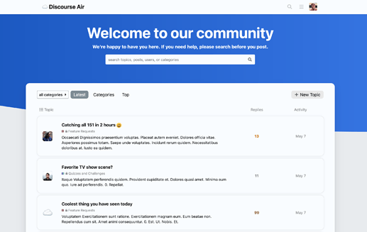](../../../assets/images/197703/52297fe2ab838db1902f6acbbbdee53d1271a840.png "Light Mode")

**Dark Mode**  

[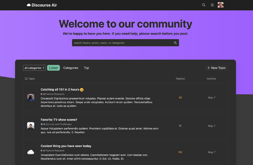](../../../assets/images/197703/7b592c6f1f901dce0ca9e9cbd01c8f2734847fe9.png "Dark Mode")

**Categories Page**  

[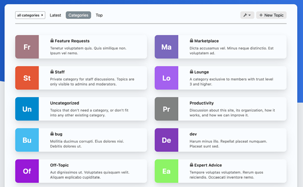](../../../assets/images/197703/bdb109def295c9954125124b9fc33be49d12e4f2.png "Categories Page")

This theme includes a couple of components to enhance your forum as well.

  * Clickable Topics
  * Modern Category + Group Boxes

> ❗ Please read through these tips upon installation, as there are a couple of settings that **NEED TO BE ENABLED** for this to theme to render properly.

* * *

#  Tips

###  Dark Light Scheme Toggle

[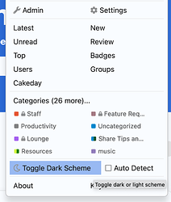](../../../assets/images/197703/1e498e5d1f26f6e46d09d48eabf7c7b6d291cd26.png "Dark Light Scheme Toggle")

For this to work properly, at least 2 color scheme choices need to be enabled in your `https://discourse.jordanvidrine.com/admin/customize/colors` area. At least two colors need to have `color scheme can be selected by users` enabled.

[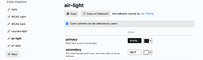](../../../assets/images/197703/b70d149b335128a5f71914db3f703def1f48376b.png "image")

Once this is done, users should be able to choose between two color schemes as their `light` and `dark` preferences in their user preferences interface menu.

[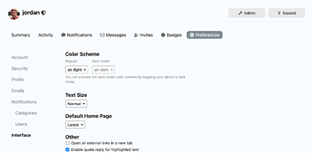](../../../assets/images/197703/184e79ce3851b9feb965117b68a97e5e7de00b93.png "color schemes")

* * *

##  Welcome Banner

Go to **Admin > Welcome banner** (`/admin/config/welcome-banner`) page.

  * in **Enabled on themes…** dropdown select `Air Theme`
  * in **Location** dropdown select `Below site header`

* * *

##  Modern Category + Group Boxes

This theme component requires your categories to use the **CATEGORY BOXES WITH SUBCATEGORIES** setting in your `/admin/site_settings/category/all_results?filter=categories` area.

[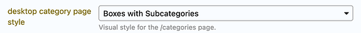](../../../assets/images/197703/c2798276e772741144c88c2ea47660b60bc3d4b5.png "modern category + group boxes")

This theme component also allows the forum admin to organize their category page with header titles, and choose which categories appear under each header. To keep things simple, I have only allowed up to 5 headings to be used. **If no categories + heading settings are chosen, all categories will render as they do above, this is the default rendering option.**

>  **Hosted by us?** Themes are available to use on our Standard, Business, and Enterprise plans.

> Last edited by [@jordan.vidrine](/u/jordan.vidrine) 2026-02-05T16:03:08Z
> 
> Check documentPerform check on document:

---

### Post #2 by [Don](../../users/Don.md)
*Posted: 2021-07-20 20:48*

That is just amazing Jordan! 😍 I love it!

---

### Post #5 by [th21](../../users/th21.md)
*Posted: 2021-07-20 23:01*

It will be helpful if the welcome message can be hide when left locale field empty 👍

---

### Post #6 by [oshyan](../../users/oshyan.md)
*Posted: 2021-07-21 00:36*

Oh wow, this looks really nice! Thank you for the share. 🙂

---

### Post #7 by [itsbhanusharma](../../users/itsbhanusharma.md)
*Posted: 2021-07-21 02:40*

This theme gives discourse the modern look it deserves. Very well done [@jordan.vidrine](/u/jordan.vidrine)

---

### Post #8 by [Ahmed_Gagan](../../users/Ahmed_Gagan.md)
*Posted: 2021-07-21 04:19*

Theme looks amazing. Awesome work 😍

---

### Post #9 by [thegurjyot](../../users/thegurjyot.md)
*Posted: 2021-07-21 05:09*

This theme looks so amazing. Hope we can get this category page design as a separate component as well. It is looking way better this way. ❤️

---

### Post #11 by [frold](../../users/frold.md)
*Posted: 2021-07-21 13:53*

Thanks it is nice…

First time I install a new theme. I really like this one!!

 [Studmed.dk](https://forum.studmed.dk/)

### [Studmed.dk](https://forum.studmed.dk/)

Studie, studieordninger, lægeliv, fagpolitik, boganmeldelser - ordet er dit ordet er frit hvad end du læser ved KU, SDU, AU, AAU eller er speciallæge

---

### Post #79 by [Jeremie_Leroy](../../users/Jeremie_Leroy.md)
*Posted: 2021-08-03 15:24*

Hi [@jordan-vidrine](/u/jordan-vidrine) regarding the # of views column, what kind of code shall i add in the component to override that column being hidden ?

---

### Post #80 by [jordan.vidrine](../../users/jordan.vidrine.md)
*Posted: 2021-08-03 15:54*

I believe this should work:
    
    
    .full-width .contents .topic-list thead th.posts {
    width: 10%;
    }
    
    .full-width .contents .topic-list thead th.activity {
    width: 10%;
    order: 4;
    }
    
    th.num.views {
    width: 10%;
    order: 3;
    display: block;
    }
    
    .full-width .contents .topic-list tbody tr:not(.topic-list-item-separator) td.posts {
    width: 10%;
    order: 2;
    }
    
    .topic-list .views {
    width: 10%;
    order: 3;
    }
    
    .full-width .contents .topic-list tbody tr:not(.topic-list-item-separator) td.age {
    width: 10%;
    order: 4;
    }

---

### Post #106 by [ggurbet](../../users/ggurbet.md)
*Posted: 2021-08-25 14:12*

Refreshingly beautiful. Great work [@jordan.vidrine](/u/jordan.vidrine)!

---

### Post #182 by [ShubhayanS](../../users/ShubhayanS.md)
*Posted: 2022-01-17 00:39*

Is there any possibility to change the header text “Welcome to the forum”

---

### Post #183 by [jordan.vidrine](../../users/jordan.vidrine.md)
*Posted: 2022-01-17 15:04*

Yes, this can be edited in the `Discourse Search Banner` component 👍

---

### Post #184 by [Jerdeman](../../users/Jerdeman.md)
*Posted: 2022-01-17 15:34*

A while back I posted an issue with not seeing the categories on a mobile view ([☁️ Discourse Air Theme - #172 by Jerdeman](https://meta.discourse.org/t/discourse-air-theme/197703/172)). I messaged a bit with [@jordan.vidrine](/u/jordan.vidrine), but we were unable to get to the root of the issue. Hopefully someone else has some ideas.

_For the details_  
Using a clean install of Discourse 2.7.11 on kubernetes with the help of a helm chart from Bitnami, and the latest version of the theme installed and configured as mentioned in the opening post, we do not see any categories on a mobile view and styling is off on the latest page.

_What we tried_  
Besides using a clean install, we attempted to use some older versions of the theme as well. The problem however remained, but we did not exhaustively tried all versions.  
We also compared the html on our instance with that of [discourse.jordanvidrine.com ](http://discourse.jordanvidrine.com/), and noticed that it is significantly different.

_Gut feeling_  
As we cannot use a ‘beta’ version, my gut feeling tells me this is a compatibility issue between the theme or one of its plugins and Discourse 2.7. I’d love to know if someone has this theme working on 2.7, and if so with which versions of the theme and relevant plugins.

_Question_  
Has somebody got this theme working with 2.7 and/or are there any clues on what we could do to get this working?

---

### Post #185 by [Hyeonji_Kim](../../users/Hyeonji_Kim.md)
*Posted: 2022-01-23 08:15*

Hi. first, Thank you for this great theme 😄

I want to change font-family, How can I do that.

I try this 👇

  * download this Theme [Google Fonts theme component](https://meta.discourse.org/t/google-fonts-theme-component/143720) , and change Font setting on SITE SETTING → Not work

  * add `@import{web font link ~~~ }` code in Desktop.css, mobile.css → Not work

Which file should I modify to modify the font??? 😭

---

### Post #186 by [jordan.vidrine](../../users/jordan.vidrine.md)
*Posted: 2022-01-24 15:35*

I believe you should be able to set a customized font without a component here: `admin/site_settings/category/all_results?filter=font`

If you want more customization, I believe the google fonts theme component you linked would work. Though, the theme uses `theme-settings` and not a site setting I believe.

Have you brought this issue up in the topic for that font component?

---

### Post #187 by [hequaye](../../users/hequaye.md)
*Posted: 2022-01-26 05:24*

Hello everyone, can anyone help me change the sizing and “fixed nature” of the background color on mobile?

The css for mobile is transparent on my end. And I just need a little guidance on changing the fixed background for the background colors.

If I’m not mistaken there’s a header background and a page background correct?  

<https://d11a6trkgmumsb.cloudfront.net/original/3X/a/3/a333d7f17e3ec42d23cf782cdfb0f1788c71dc49.MP4>

---

### Post #188 by [jordan.vidrine](../../users/jordan.vidrine.md)
*Posted: 2022-01-26 16:04*

This is because the theme and its included components are fairly picky about how the site is set up.

In the OP I shared that:

 jordan-vidrine:

> ## Modern Category + Group Boxes
> 
> This theme component requires your categories to use the **CATEGORY BOXES WITH SUBCATEGORIES** setting in your `/admin/site_settings/category/all_results?filter=categories` area.
> 
> 
> 
> This theme component also allows the forum admin to organize their category page with header titles, and choose which categories appear under each header. To keep things simple, I have only allowed up to 5 headings to be used. **If no categories + heading settings are chosen, all categories will render as they do above, this is the default rendering option.**

---

### Post #189 by [Nerd_Alert](../../users/Nerd_Alert.md)
*Posted: 2022-01-31 14:31*

is there any way to make the background an image? i’d rather have an image than colors. using
    
    
    body {
        background-image: url("image url here");
        background-color: #cccccc;
    }
    

makes the top of the color thing the image, but not the bottom.

---

### Post #190 by [jordan.vidrine](../../users/jordan.vidrine.md)
*Posted: 2022-01-31 15:02*

What you did is fine to add the image, but you will also want to remove the clipping path that is created to give that overlay affect.
    
    
    html .background-container {
    clip-path: unset;
    }

---

### Post #191 by [Nerd_Alert](../../users/Nerd_Alert.md)
*Posted: 2022-01-31 15:29*

thank you! i knew i was missing something simple.

---

### Post #192 by [GVG](../../users/GVG.md)
*Posted: 2022-02-01 09:58*

Great theme! Please, explain how your theme works in terms of speed and weight - does all your theme works by replacing (instead of) default html/style/CSS Discourse theme or when users load Discourse pages at their browsers your them include all default Discourse html/style/CSS and work over it as higher CSS etc?

---

### Post #193 by [jordan.vidrine](../../users/jordan.vidrine.md)
*Posted: 2022-02-01 16:52*

 GVG:

> how your theme works in terms of speed and weight

We try to get our themes working pretty seamlessly with Discourse. I do not believe I override any core components or HTML in this theme and its included components. Most of these visual changes are achieved with SCSS as per usual in our themes.

Feel free to browse through the git repos of the theme and it’s included components to see how they were implemented 👍

---

### Post #194 by [f1r4s](../../users/f1r4s.md)
*Posted: 2022-02-01 19:34*

[@jordan.vidrine](/u/jordan.vidrine)

There is a bug with Air theme and the [Chat plugin](https://meta.discourse.org/t/introducing-discourse-chat-pre-alpha/210734/) when enable chat it’s look like this:

[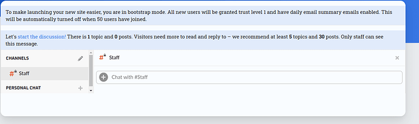](../../../assets/images/197703/c7b266d1e4b9ca8ba6aa389c8dcc93042c0868dc.png "chat-bug-air-theme")

Here is how it’s look when i make zoom-out

[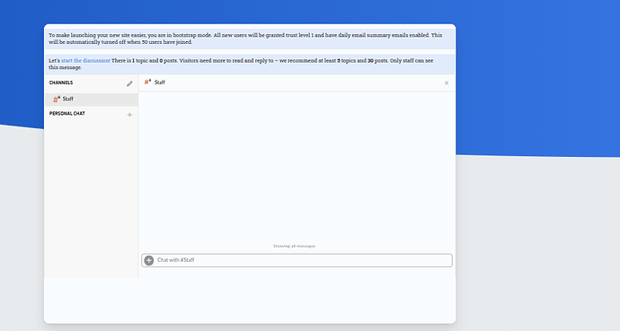](../../../assets/images/197703/1b70116491e02eeed34afe36fcbfcc10ec00f4ff.png "Screenshot at 2022-02-01 23-23-25")

any suggestion how to fix this ?

---

### Post #195 by [jordan.vidrine](../../users/jordan.vidrine.md)
*Posted: 2022-02-01 20:13*

Thanks for bringing this to my attention. This theme wasn’t written to support chat, _but_ I can definitely make the necessary adjustments to let it work properly with it.

---

### Post #196 by [f1r4s](../../users/f1r4s.md)
*Posted: 2022-02-01 20:19*

I’m sure you can, and it will be 100% compatible with your Lovely Theme)

---

### Post #197 by [f1r4s](../../users/f1r4s.md)
*Posted: 2022-02-01 20:20*

I want also to ask a question regard how could we enable the categories (boxed) down and latest up like this [demo](https://community.festingervault.com/).

It would be great idea to change the Meta layout with Air Theme.

---

### Post #204 by [f1r4s](../../users/f1r4s.md)
*Posted: 2022-02-04 22:18*

another bug founded in the feature tabs; when we using the tables of context layout

[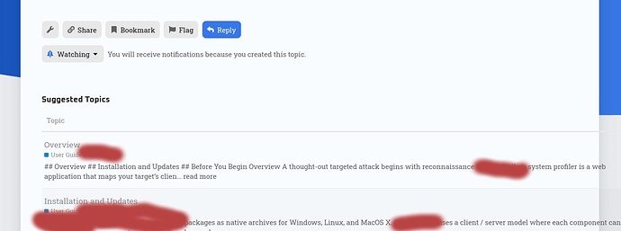](../../../assets/images/197703/822b8804b01d84d8d8f67e53ffde2cd3b9304a0a.png "Screenshot at 2022-02-05 02-16-27")

Should i note everything here [@jordan.vidrine](/u/jordan.vidrine) ?

---

### Post #205 by [jordan.vidrine](../../users/jordan.vidrine.md)
*Posted: 2022-02-07 01:27*

Yep! Any bugs you find in this theme are good to post here.

Thanks!

---

### Post #206 by [f1r4s](../../users/f1r4s.md)
*Posted: 2022-02-07 07:07*

Thanks, i will… but unfortunately i decide to stop using it until the next update since… could we know when the next update is coming ?

---

### Post #207 by [f1r4s](../../users/f1r4s.md)
*Posted: 2022-02-08 11:27*

Hi Jordan,

I notice that discotoc component wouldn’t work correctly in the sub-font ( bold ) as

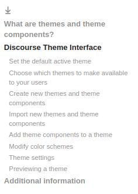

It would be good idea to add this code in the CSS;
    
    
    .d-toc-heading > li > a {
      font-weight: bold;
    }
    

and mention this code to work for sub-sub-sub-context inside the table to be “BOLD”.

Thanks.

---

### Post #208 by [jordan.vidrine](../../users/jordan.vidrine.md)
*Posted: 2022-02-08 13:48*

I don’t believe that this component normally sets the smaller sub headings as bold. Although I may be misunderstanding you.

Have you seen something that works normally in discotoc, _not_ work properly in this theme?

---

### Post #209 by [f1r4s](../../users/f1r4s.md)
*Posted: 2022-02-08 13:50*

Well actually it was easy to add a component in the theme for this and it’s works fine after that.

---

### Post #210 by [f1r4s](../../users/f1r4s.md)
*Posted: 2022-02-09 08:17*

Jordan can you find out how we can add [Restricted Category](../../../assets/images/197703/3296e5435c4919f2814f0b546cfec404971b2a41_2_1035x532.jpeg) to the boxes style ?

---

### Post #211 by [daming](../../users/daming.md)
*Posted: 2022-02-10 03:34*

I have a suggestion: maybe can add a data display of views to the main interface of the post. This gives users direct access to the most popular posts in the community.

### now

[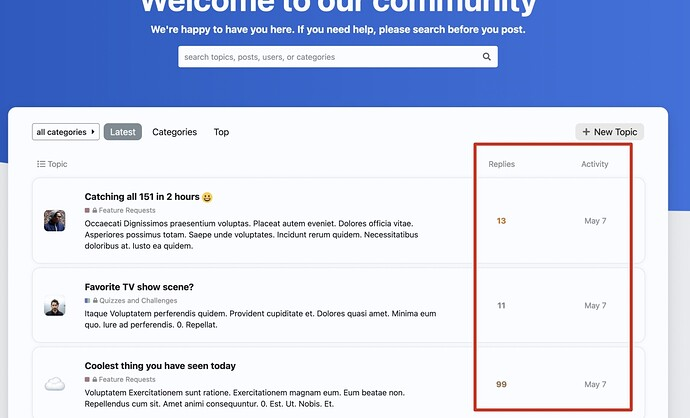](../../../assets/images/197703/758bc7050d13dba2c387d95f5b8b17718eda0198.jpeg "air")

### like this

[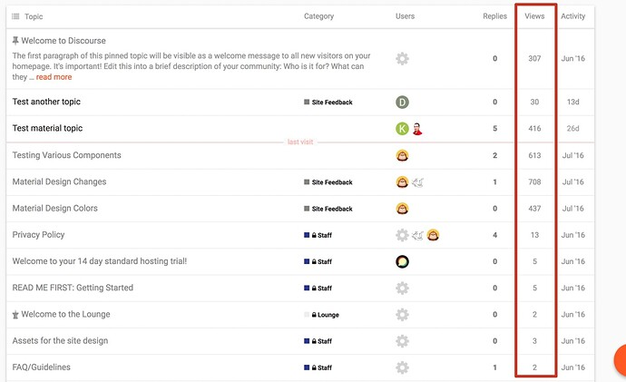](../../../assets/images/197703/ad01d6bd51d8601e7b6413c524f81a80355fe866.jpeg "views")

  
[@jordan.vidrine](/u/jordan.vidrine)

---

### Post #212 by [f1r4s](../../users/f1r4s.md)
*Posted: 2022-02-10 07:38*

somehow with no reason as i remmber i get this error from the [search component](https://github.com/discourse/discourse-search-banner), it was working fine with airtheme… but now i get this error

[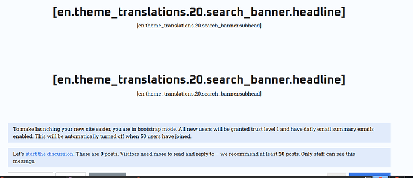](../../../assets/images/197703/72aa24a07d891619205fd21f640a7a808c307339.png "Screenshot at 2022-02-10 11-35-41")

any suggestion ?

---

### Post #213 by [hequaye](../../users/hequaye.md)
*Posted: 2022-02-10 16:35*

Is there a way to change the background image of this theme from the gradient 2 tone colors to an image I have?  

---

### Post #214 by [jordan.vidrine](../../users/jordan.vidrine.md)
*Posted: 2022-02-10 16:48*

Is this on the air theme? Or are you using this component separate from the theme?

---

### Post #215 by [jordan.vidrine](../../users/jordan.vidrine.md)
*Posted: 2022-02-10 16:52*

Sure!

You would just want to target this element like so:
    
    
    html .background-container {
        position: fixed;
        top: 0;
        left: 0;
        height: 100vh;
        width: 100vw;
        background: url(https://d11a6trkgmumsb.cloudfront.net/original/3X/8/3/8352b68….jpeg);
        background-size: cover;
        /* background: linear-gradient(90deg, var(--tertiary-hover) 0%, var(--tertiary) 100%); */
        clip-path: ellipse(148% 70% at 91% -14%);
    

Here is how that looked locally when editing through Chrome’s inspector.

[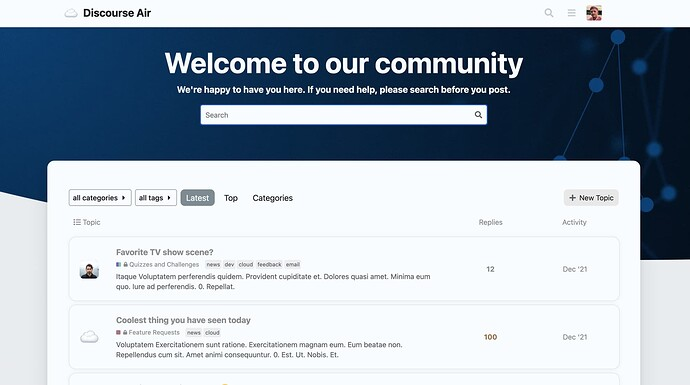](../../../assets/images/197703/4989bd4903fa488e30f8daeb6c2f96cd19d070f5.jpeg "image")

---

### Post #216 by [hequaye](../../users/hequaye.md)
*Posted: 2022-02-10 16:53*

Yes but what if I want that to be the background without the 2 elements? [@jordan.vidrine](/u/jordan.vidrine)

---

### Post #217 by [hequaye](../../users/hequaye.md)
*Posted: 2022-02-10 16:57*

I want to use this with the air theme because I like the boxes and category setup

---

### Post #218 by [jordan.vidrine](../../users/jordan.vidrine.md)
*Posted: 2022-02-10 16:59*

So you want no grey area cutting into the background image?

If so, you would use the same code above, but `unset` the clip-path property.
    
    
    html .background-container {
        position: fixed;
        top: 0;
        left: 0;
        height: 100vh;
        width: 100vw;
        background: url(https://d11a6trkgmumsb.cloudfront.net/original/3X/8/3/8352b68….jpeg);
        background-size: cover;
        clip-path: unset;
    

This actually looks really nice with your image!

[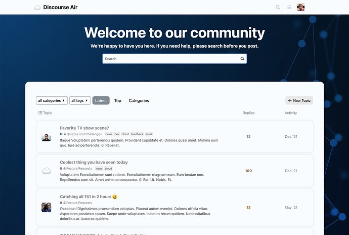](../../../assets/images/197703/b131e30297d138edc221be5339e617969db110c1.jpeg "image")

---

### Post #219 by [hequaye](../../users/hequaye.md)
*Posted: 2022-02-10 16:59*

Ahh gotcha thank you!

---

### Post #220 by [jordan.vidrine](../../users/jordan.vidrine.md)
*Posted: 2022-02-10 19:14*

5 posts were merged into an existing topic: [Search banner theme component](/t/search-banner-theme-component/122939/53)

---

### Post #222 by [f1r4s](../../users/f1r4s.md)
*Posted: 2022-02-10 18:14*

how to apply this code ? where to put it exactly please

---

### Post #223 by [jordan.vidrine](../../users/jordan.vidrine.md)
*Posted: 2022-02-10 18:36*

Feel free to read through the following topics to get a better sense of how to customize the look and feel of your site 👍

[Beginner's guide to using Discourse Themes](https://meta.discourse.org/t/beginners-guide-to-using-discourse-themes/91966) [Site Management](/c/documentation/site-management/53)

> This is a crash course in Discourse theme basics. The target audience is everyone who is not familiar with Discourse themes. If you’ve already used Discourse theme / theme components, this guide is probably not something you need to read. What are themes and theme components? A theme or theme component is a set of files packaged together designed to either modify Discourse visually or to add new features. Let’s start with themes. Themes In general, themes are not supposed to be compatible … 

As well as these:

[Designer’s Guide to Discourse Themes](https://meta.discourse.org/t/designers-guide-to-discourse-themes/152002)

[Developer’s guide to Discourse Themes](https://meta.discourse.org/t/developer-s-guide-to-discourse-themes/93648)

---

### Post #224 by [hequaye](../../users/hequaye.md)
*Posted: 2022-02-10 19:15*

Thank you so much [@jordan.vidrine](/u/jordan.vidrine) so I have implemented the changes and this may not be on the theme necessarily but my versatile banner, but the background is duplicated across my versatile banner as well and this is the only change I made on discourse air
    
    
        left: 0;
        height: 100vh;
        width: 100vw;
        background: #003366; 
        clip-path: ellipse(148% 70% at 91% -14%);
        background: url(https://i.ibb.co/GCcS8Zw/Abstract-futuristic-Molecules-technology-with-polygonal-shapes-on-dark-blue-background-Illustration.jpg); 
        clip-path: unset;
      }
    }
    

This is how my page looks now: is this something I need to change in versatile banner or something on the air theme?

[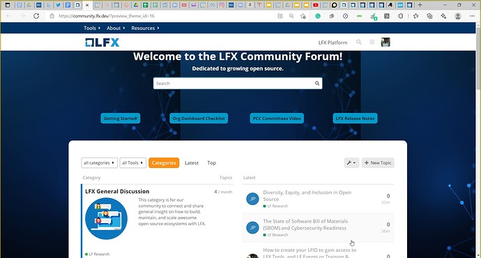](../../../assets/images/197703/8fa3a9f19b59297c5f2ff8a8cfa36f0a05276578.jpeg "msedge_roZowUqwkf")

I do not have a background image or color set for versatile banner.

[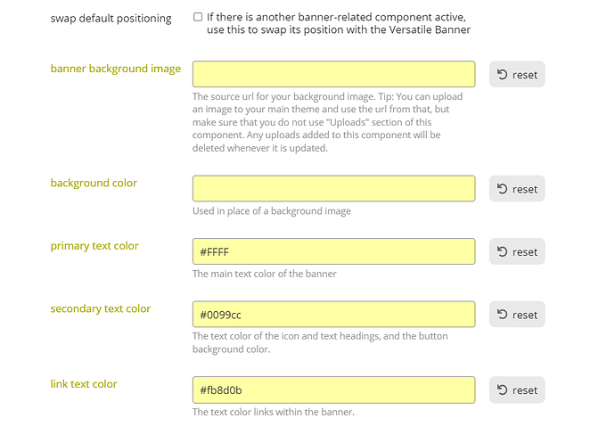](../../../assets/images/197703/72e0504da85a9e7c3139a44b459af7972b85344c.png "msedge_d2stDXTOPa")

Any suggestions?

---

### Post #225 by [jordan.vidrine](../../users/jordan.vidrine.md)
*Posted: 2022-02-10 19:17*

You can try `background-size: cover;` or play around with variations on that.

More info here could also be helpful [background-size | CSS-Tricks - CSS-Tricks](https://css-tricks.com/almanac/properties/b/background-size/)

---

### Post #226 by [hequaye](../../users/hequaye.md)
*Posted: 2022-02-10 19:19*

Ahh gotcha, will do. It is the sizing when I zoom out the image just repeats:  

[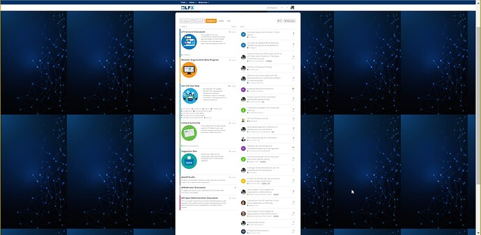](../../../assets/images/197703/5b23fc8e768f1eb707e80e2cc23110c5ee80a267.jpeg "msedge_JWlBATqHXR")

You think I should remove the height and width padding too?

I’ll play around with the background-size: thank you!

---

### Post #227 by [hequaye](../../users/hequaye.md)
*Posted: 2022-02-10 19:21*

.background-container {
        position: fixed;
        top: 0;
        left: 0;
        height: 100vh;
        width: 100vw;
        background: url(https://i.ibb.co/GCcS8Zw/Abstract-futuristic-Molecules-technology-with-polygonal-shapes-on-dark-blue-background-Illustration.jpg); 
        background-size: cover;
        clip-path: unset;
    

Works perfectly thank you!

---

← Previous | **Page 1 of 8** | [Next →](197703-page-2.md)
