[🏠 Home](../../index.md) | [📋 Latest](../../latest/index.md) | [🔥 Top](../../top/replies/index.md) | [👥 Users](../../users/index.md)

[Home](../../index.md) » [Theme](../../c/theme/index.md) » Alien Night Theme - A free Dark Theme for Discourse

---

# Alien Night Theme - A free Dark Theme for Discourse (Page 2 of 2)

> **Category:** Theme
> **Author:** B-iggy
> **Created:** 2016-12-13 10:36

[← Previous](54175.md) | **Page 2 of 2** | Next →

---

### Post #51 by [B-iggy](../../users/B-iggy.md)
*Posted: 2019-12-25 09:18*

 ondrej:

> it does not like versatile banners

I feared the theme might have issues with other components. I will check the versatile banners out. What exactly does not work?

 ondrej:

> Also I have a random checkbox.

That is new to me. Is this because of the versatile banners?

 ondrej:

> It also seems to not like this

On what page is this? What are those icons all for?
  *[PR]: Pull Request

---

### Post #52 by [ondrej](../../users/ondrej.md)
*Posted: 2019-12-25 09:28*

Hello B-iggy!  
Thanks for getting back to me. Just give me a while as I am pretty busy.  
Thanks again.
  *[PR]: Pull Request

---

### Post #53 by [ondrej](../../users/ondrej.md)
*Posted: 2019-12-25 14:17*

 B-iggy:

> What exactly does not work

Basically, it makes the orange image orange background dissapear and replaces it with white.

Orange background

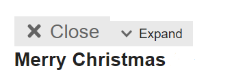

* * *

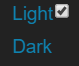  
**The tickbox seems to be for switching between light and dark theme. Not the slider as it shows in the theme.**

* * *

 B-iggy:

> Is this because of the versatile banners?

It could be. I’m not sure, still looking at that

* * *

 B-iggy:

> What are those icons all for?

This would be the _post badges_ theme component
  *[PR]: Pull Request

---

### Post #54 by [Tariq_Inam](../../users/Tariq_Inam.md)
*Posted: 2019-12-25 14:39*

great stuff. all modes looks great.
  *[PR]: Pull Request

---

### Post #55 by [B-iggy](../../users/B-iggy.md)
*Posted: 2019-12-25 20:49*

Hello [@ondrej](/u/ondrej)

thanks for the details.  
I am afraid I couldn’t reproduce _any_ of your reports 😦

I tried all of your mentioned things and everything looks good for me.  
Be it the post badges theme component  
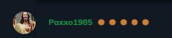  
Be it the versatile banner  

[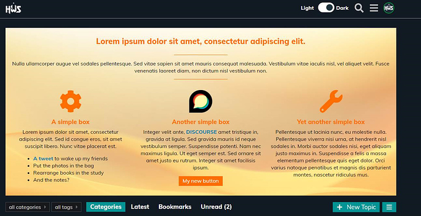](../../../assets/images/54175/5f9640e98511bf6549b974fbef0aa35e55a976bb.jpeg "image")

Or the Light <> Dark switch  

[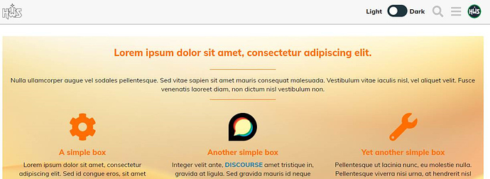](../../../assets/images/54175/6847cc12fb91dc88e28df844cf9d08d2cd8bab7e.jpeg "image")

Especially your checkbox for Light and Dark gives me the one and only conclusion:  
you are using an outdated Browser (e.g. Internet Explorer 10), which I (won’t) don’t support. Is this right? 😉
  *[PR]: Pull Request

---

### Post #56 by [Mark_Walkom](../../users/Mark_Walkom.md)
*Posted: 2020-01-08 01:52*

I’ve been toying with this for <https://discuss.elastic.co> but I can’t figure out how to get our default header icon, with black text, to swap to one with white text so it’s still readible.

I can see in the OP you’ve got that happening, and any advice you could give would be appreciated 😃
  *[PR]: Pull Request

---

### Post #57 by [martinkerr](../../users/martinkerr.md)
*Posted: 2020-01-09 12:33*

Loving the theme, thank you! Is there a way to make the ‘light’ version as the default? Then users can choose the dark version if they want to?

The light version is exactly what i am looking for in colours etc so would prefer that as the default.
  *[PR]: Pull Request

---

### Post #58 by [B-iggy](../../users/B-iggy.md)
*Posted: 2020-01-09 12:56*

Thanks for your feedback guys. This week was very stressful but will work on your points on the weekend!
  *[PR]: Pull Request

---

### Post #59 by [B-iggy](../../users/B-iggy.md)
*Posted: 2020-03-31 06:55*

Hello [@martinkerr](/u/martinkerr)  
finally   
I’ve released a new version where you can set what you want:  
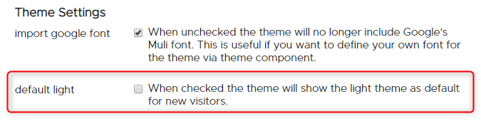
  *[PR]: Pull Request

---

### Post #60 by [bubblecatcher](../../users/bubblecatcher.md)
*Posted: 2020-05-26 12:12*

Hi, i am new to Discourse so not sure if this is a user error, but i am having issues editing the colours.

I copied the theme default dark colours and edited them to my own choices, thing is some colours changed and some did not?

See image for new colours and the actual change of colours in admin section, what colours worked can be seen at main site is [talk.carptalk.com](https://talk.carptalk.com)  
Is it a user error or a bug?

[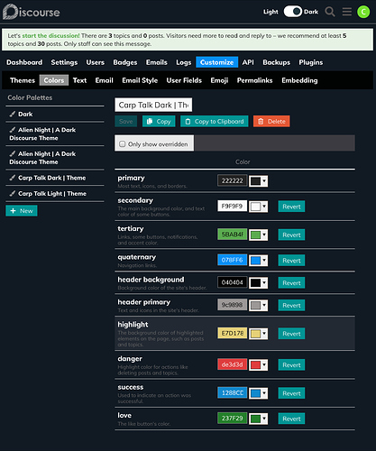](../../../assets/images/54175/430743a99a653c51b7bb9f35ac45c7b7ed69e896.jpeg "image")
  *[PR]: Pull Request

---

### Post #62 by [ryanerwin](../../users/ryanerwin.md)
*Posted: 2020-06-06 03:53*

When using the Alient Night theme and upgrading to a more recent Discourse release, I noticed the colors on the hamburger menu items was no longer visible.

Before upgrading, it was:  

[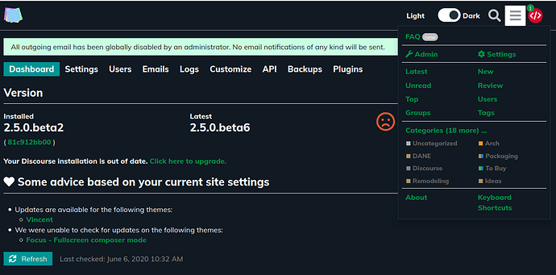](../../../assets/images/54175/c8fb6417372107398c06c246be2bcc440a419ef3.png "image")

After upgrading, it was difficult to see use the menu:  

[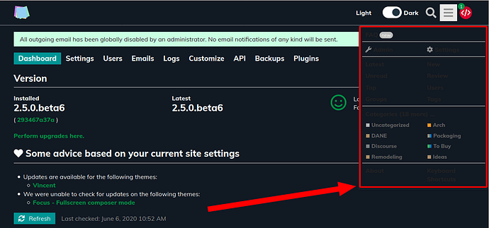](../../../assets/images/54175/e558ec8b9494ea2d04c54341f21c2411986f6743.png "image")
  *[PR]: Pull Request

---

### Post #63 by [B-iggy](../../users/B-iggy.md)
*Posted: 2020-06-06 08:01*

Thanks for the info [@ryanerwin](/u/ryanerwin)

I released a patch. Can you update and let me know if it worked please?  
If you check the preview, it is looking good for me.

 [Discourse Theme Creator](https://theme-creator.discourse.org/theme/B-iggy/alien-night-theme) 

### ['Alien Night | A Dark Discourse Theme' by @B-iggy](https://theme-creator.discourse.org/theme/B-iggy/alien-night-theme)

A theme for Discourse shared on theme-creator.discourse.org

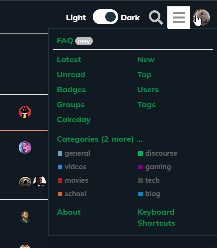
  *[PR]: Pull Request

---

### Post #64 by [B-iggy](../../users/B-iggy.md)
*Posted: 2020-06-06 08:05*

Hello [@bubblecatcher](/u/bubblecatcher)

yes, sorry for that. I hard coded some colors in my theme, since I didn’t know better 2 years ago.  
I will rework that part for sure to make it more user friendly. See below.
  *[PR]: Pull Request

---

### Post #65 by [B-iggy](../../users/B-iggy.md)
*Posted: 2020-06-06 08:06*

A note to everyone who is using my theme:

Hard times are going on for me right now. If all works out, I have much more time in about one month again.  
Over the time Discourse implemented fundamental changes to themes and how you can make one.  
I classify my theme for now as “legacy”, so I really want to rework this one completely or release a brand new one - to be announced.
  *[PR]: Pull Request

---

### Post #66 by [ryanerwin](../../users/ryanerwin.md)
*Posted: 2020-06-06 08:26*

 B-iggy:

> I released a patch. Can you update and let me know if it worked please?

Yes. That fixed it for me. Looks great!  
Amazingly fast turnaround! Thanks!!!

BTW, I noticed that text boxes don’t seem to change color whether in dark mode or light mode… The text boxes seem really bright in Dark mode…

[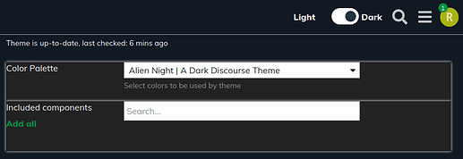](../../../assets/images/54175/25b102e0fc8e1d3b28c44a3a00ef01fe1d99f086.png "image")

  

[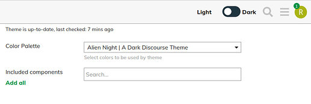](../../../assets/images/54175/d4d5f0f4339049ecab3c7f7d694c6b4965be162f.png "image")
  *[PR]: Pull Request

---

### Post #67 by [Dannii](../../users/Dannii.md)
*Posted: 2021-07-04 23:06*

When the /unread page is empty, it displays an explanation in the `education` class. I think that it is not being switched properly, so it shows as the `primary` colour even in dark mode.

Maybe this is one of those changes that came more recently?
  *[PR]: Pull Request

---

### Post #68 by [B-iggy](../../users/B-iggy.md)
*Posted: 2022-11-30 08:43*

Hi there 👋

Please don’t ask me where the last 2 years went. Can’t believe it took me so long, sorry!

But here it is, **[release 4.0.0](https://github.com/B-iggy/alien-night-discourse-dark-theme/commit/d79baf40325bb53adcde40d8f77995a02889cc78)**.

**Note** : with the release 4.0.0 I redesigned/refactored the theme from ground up. It’s more contrast friendly, it uses CSS variables and is overall more slick.

Again, with a Dark/Light toggle implemented. This time, for now, with help of an external component ( [Dark/Light Mode Toggle](https://meta.discourse.org/t/dark-light-mode-toggle/215585) )

See it in action:

More impressions:  

[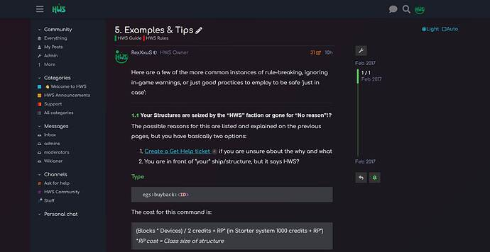](../../../assets/images/54175/a8a36c2e22bf527d3d9985224614f288f386f221.jpeg "dark1")

[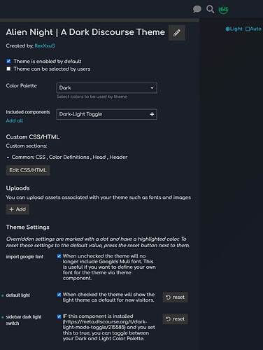](../../../assets/images/54175/403195222031e42e520f27c372e8527c204437aa.jpeg "dark2")

[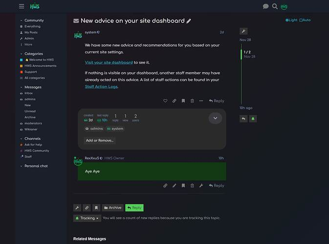](../../../assets/images/54175/fbe62f7585fa3082d1b5baf6b0b8d4f4eddc9a5c.jpeg "dark3")

[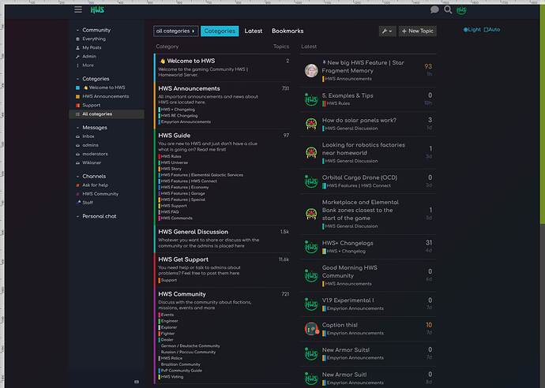](../../../assets/images/54175/9e82bd63c01a2f5e5ef682a72e2b517de1b08f8b.jpeg "dark4")

[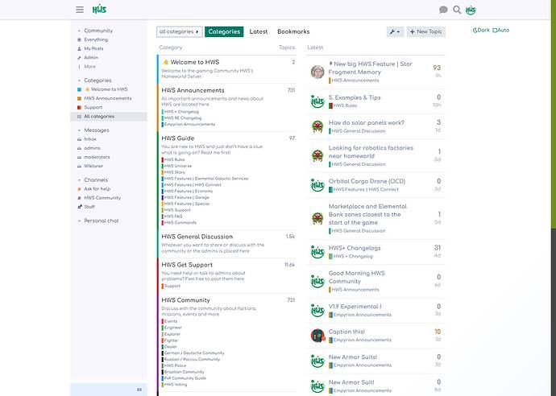](../../../assets/images/54175/b6920d96b50d2a19c9df6fa74528dd9e36e6c1de.jpeg "light1")

[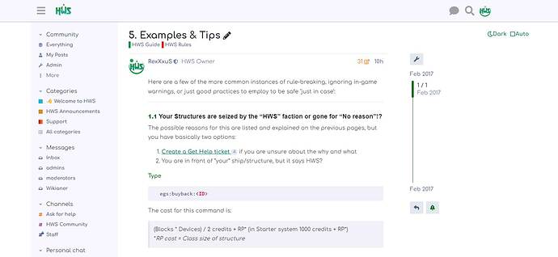](../../../assets/images/54175/3650858704b6508c85073221d941ba8f9a3133d4.jpeg "light2")

[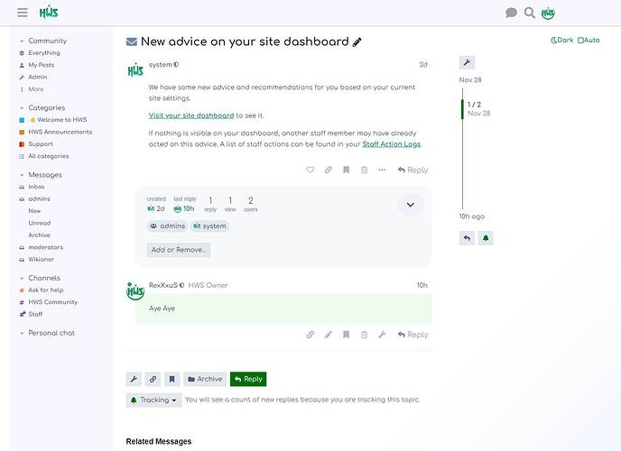](../../../assets/images/54175/d5afee1383ae4f21e0bf00706e39dfe9cd502b58.jpeg "light3")

P.S.: [@awesomerobot](/u/awesomerobot) your Google Import setting is still there and hopefully nothing broken 🙂
  *[PR]: Pull Request

---

### Post #69 by [jo-andre](../../users/jo-andre.md)
*Posted: 2022-11-30 10:19*

I can’t add components to this theme anymore.  
Works fine with any other, but not this one. I couldn’t before this update either for that matter.

Thanks for any help 😊
  *[PR]: Pull Request

---

### Post #70 by [B-iggy](../../users/B-iggy.md)
*Posted: 2022-11-30 10:31*

ho? Why that? Can you show a screenshot maybe?

It does not look like this for you?  
[ 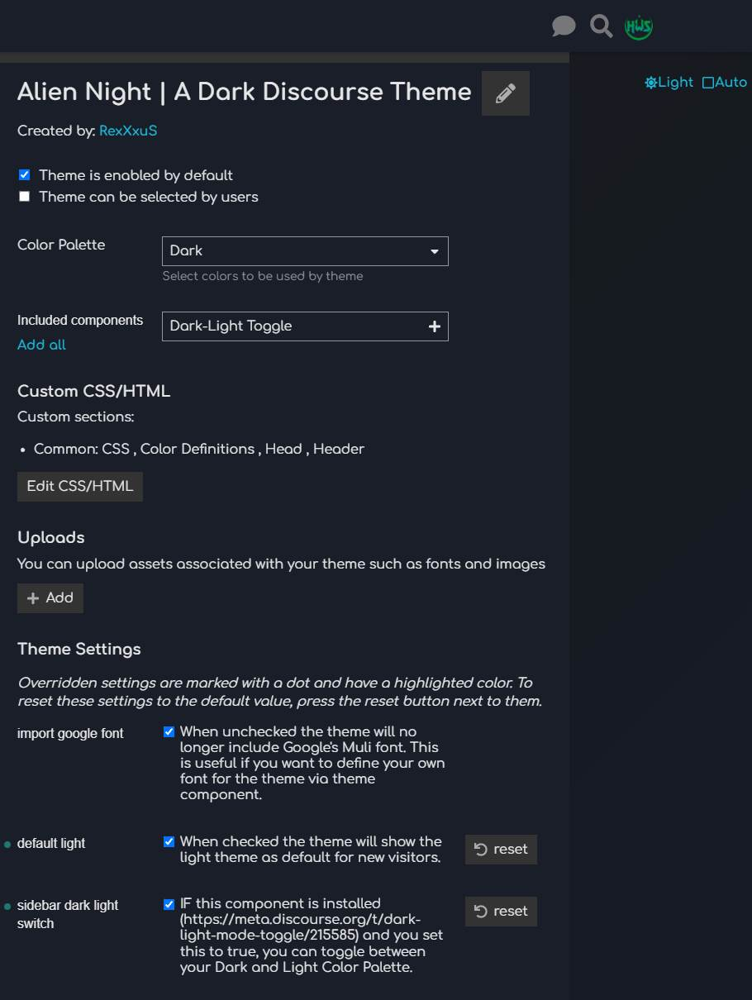 ](../../../assets/images/54175/403195222031e42e520f27c372e8527c204437aa.jpeg)
  *[PR]: Pull Request

---

### Post #71 by [jo-andre](../../users/jo-andre.md)
*Posted: 2022-11-30 12:30*

I manage to add the theme components after disable the theme and activated it again.  
This is how it looked after I enabled the component  

[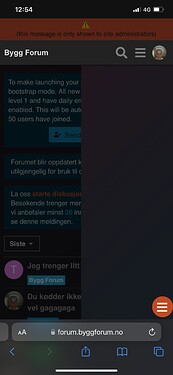](../../../assets/images/54175/d1f237a818b66d3bea2c22d29e5501360c6c4f18.jpeg "bilde")

And now after only refreshing the page the hamburger menu disappeared.

[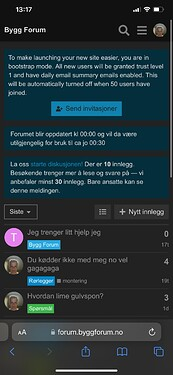](../../../assets/images/54175/34c751e464afa810b4f3dd182a3c383cc94d2985.jpeg "bilde")

I’ve tried to disable and re-enable the component but now I can’t add it to the theme. Am clicking the green button but nothing happens.  

[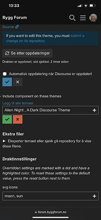](../../../assets/images/54175/2ffda725689b6655890e7401e4af62735d6c8ab9.jpeg "bilde")
  *[PR]: Pull Request

---

### Post #72 by [B-iggy](../../users/B-iggy.md)
*Posted: 2022-11-30 12:48*

Thanks for the screenshots!  
Hmm, the first one is saying there is a javascript error I guess. Tried few combinations myself and couldn’t reproduce it for now.  
Best to wait until the Dark-Light Toggle component is updated I think.
  *[PR]: Pull Request

---

### Post #73 by [jo-andre](../../users/jo-andre.md)
*Posted: 2022-12-07 19:18*

 B Iggy:

> Best to wait until the Dark-Light Toggle component is updated I think.

They have now updated the component. But I don’t think that solved the issue for me at least.
  *[PR]: Pull Request

---

### Post #74 by [B-iggy](../../users/B-iggy.md)
*Posted: 2022-12-07 19:39*

Thanks for the notice. Great it got updated 👍

I updated my theme by removing my artificial sidebar to inject the component myself that way.  
Please update your theme and install the component yourself to have a dark/light toggle  
(couldn’t figure out yet how to pack theme components inside themes).

I don’t know if this will fix your issue. If not, there is something bigger wrong for you I think.
  *[PR]: Pull Request

---

### Post #75 by [GregStein](../../users/GregStein.md)
*Posted: 2023-07-11 19:53*

Discourse should be defaulted to this dark beautiful theme 
  *[PR]: Pull Request

---

### Post #76 by [lekhanhky](../../users/lekhanhky.md)
*Posted: 2023-07-31 04:12*

How do I change the default font for this theme? I’m a newbie, please help me (for example, I want the default font to be Roboto - size 14)  
Thanks !
  *[PR]: Pull Request

---

### Post #77 by [twofoursixeight](../../users/twofoursixeight.md)
*Posted: 2023-07-31 04:20*

You should follow this guide to change the font theme: [https://meta.discourse.org/t/include-assets-e-g-images-fonts-in-themes-and-components/62459?u=twofoursixeight](https://meta.discourse.org/t/include-assets-e-g-images-fonts-in-themes-and-components/62459)
  *[PR]: Pull Request

---

### Post #78 by [LaptechInfo](../../users/LaptechInfo.md)
*Posted: 2025-02-03 15:58*

this theme is very nice. when i added a component " Gated Topic Category"  
in Gated Topic Category, i tired to add this theme Alien Night Theme, but i get an error  

[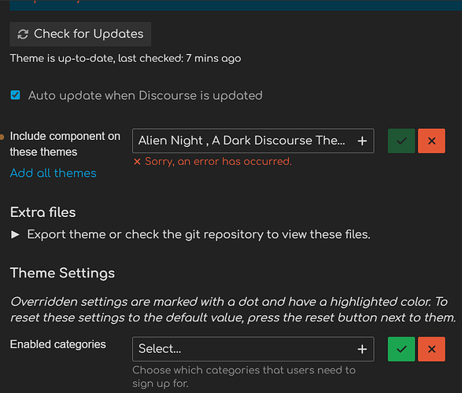](../../../assets/images/54175/ed7c188fe673f9eed08bc52559e1d0776913f4b8.png "This image shows a theme settings menu with an error message stating "Alien Night, A Dark Discourse The..." and multiple options to add or remove components, along with options to enable/disable categories, and export or reset them. \(Captioned by AI\)")

  
Can you help me please.

Thanks
  *[PR]: Pull Request

---

### Post #79 by [Jagster](../../users/Jagster.md)
*Posted: 2025-02-03 18:19*

It has pipe | in its name. Change it to hyphen - for example. I don’t know if comma , works either
  *[PR]: Pull Request

---

### Post #80 by [LaptechInfo](../../users/LaptechInfo.md)
*Posted: 2025-02-04 03:49*

Yes. that worked. i just changed to simple Alien Night  
now works good  

")

  
Thank you  
😍
  *[PR]: Pull Request

---

[← Previous](54175.md) | **Page 2 of 2** | Next →
