[🏠 Home](../../index.md) | [📋 Latest](../../latest/index.md) | [🔥 Top](../../top/replies/index.md) | [👥 Users](../../users/index.md)

[Home](../../index.md) » [Theme](../../c/theme/index.md) » Alien Night Theme - A free Dark Theme for Discourse

---

# Alien Night Theme - A free Dark Theme for Discourse (Page 1 of 2)

> **Category:** Theme
> **Author:** B-iggy
> **Created:** 2016-12-13 10:36

← Previous | **Page 1 of 2** | [Next →](54175-page-2.md)

---

### Post #1 by [B-iggy](../../users/B-iggy.md)
*Posted: 2016-12-13 10:36*

 | Summary | Discourse Alien Night is a dark focused clean theme with the Dark/Light toggle component in mind to enhance your forum!  
---|---|---  
👓 | **Preview** | [Preview on theme-creator.discourse.org](https://theme-creator.discourse.org/theme/B-iggy/alien-night-theme)  
🛠️ | Repository Link | [GitHub - B-iggy/alien-night-discourse-dark-theme: A night friendly dark Discourse theme - dark/light switcher inclusive](https://github.com/B-iggy/alien-night-discourse-dark-theme)  
📖 | New to Discourse Themes? | [Beginner’s guide to using Discourse Themes](https://meta.discourse.org/t/beginners-guide-to-using-discourse-themes/91966)  
  
[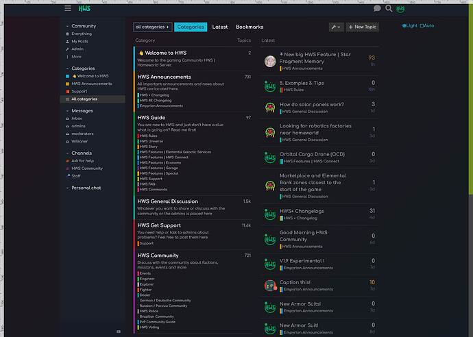](../../../assets/images/54175/c4946692e769ea1a20a52367a264b151f6f35f9b.jpeg "dark")

> **Note** : with the release 4.0.0 I redesigned/refactored the theme from ground up. It’s more contrast friendly, it uses CSS variables and is overall more slick.

Hi there 👋  
I want to share a free dark theme for discourse called “**Alien Night** ”.  
I made it for my server game community.

Since I have people from all over the world playing on my servers and reading the forum at any time I wanted to have a dark and a bright theme people can choose from. Especially the night one should be eye friendly in the night.

# Implemented [Dark/Light Mode Toggle](https://meta.discourse.org/t/dark-light-mode-toggle/215585)

Even though the component is labeled as broken, it works in my theme, if you follow some guidelines:

  1. Make the Light theme selectable for your users

[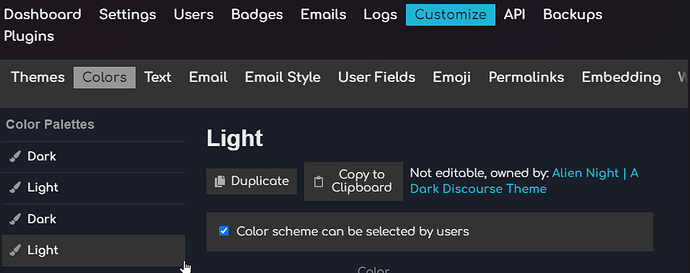](../../../assets/images/54175/628bc3d0f50ad7518f5d3c3206d6805d884666b9.png "image")

  2. Select the Dark color here ( /admin/site_settings/category/all_results?filter=dark%20m )

[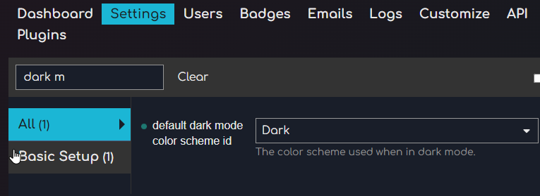](../../../assets/images/54175/9246014e889bb19a8805024d514053ebe64d01fb.png "image")

  3. Include the Dark-Light-Toggle component for this theme and check the box at the bottom:  

[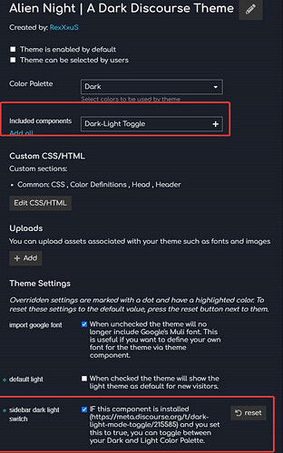](../../../assets/images/54175/375fe7b4fa9a2e4e1d62b1ee3a7d288b2fd83c5e.jpeg "image")

If everything set correctly, you have on a right sidebar the Dark/Light Toggle:  

Enjoy and let me know if you have any feedback or questions. 🙂

Iggy
  *[PR]: Pull Request

---

### Post #2 by [DanteZii](../../users/DanteZii.md)
*Posted: 2016-12-13 19:27*

wow so cool!!!👍
  *[PR]: Pull Request

---

### Post #3 by [dax](../../users/dax.md)
*Posted: 2016-12-13 21:24*

 B-iggy:

> So I also implemented a theme switcher via JQuery, CSS and local storage.(if you need more information about it I will happily share)

Very interested, share it please 
  *[PR]: Pull Request

---

### Post #4 by [B-iggy](../../users/B-iggy.md)
*Posted: 2016-12-14 08:28*

Alright 

Sorry in advance for not doing it the 100% professional way ( using custom js templates from discourse? ) but for now it works very good for me this way:

The main idea is basically to append a modifier class to the html DOM and nest the dark styles in proper way in the CSS and store the user choice in the local storage.

**So my HTML looks like this:**
    
    
    Switch Theme:
      <a class="theme-switcher-attr theme-switcher-light" href="#">Light</a>
      <a class="theme-switcher-attr theme-switcher-dark" href="#">Dark</a>  
    

**The theme switcher CSS and a snippet example with the modifier class**
    
    
    .theme-switcher-attr {
        color: #fff !important;
        font-weight: bold;
        padding: 5px;
        margin: 2px;
        display: inline-block;
    }
    
    .theme-switcher-light {
        background-color: #fff;
        color: #222 !important;
        border: 1px solid #333;
    }
    
    .theme-switcher-dark {
        background-color: #10161d;
        border: 1px solid #fff;
    }
    
    /*
    CSS of the Dark Theme in combination with the modifier class from the theme switcher
     */
    html.dark,
    html.dark body {
        background-color: #10161d;
    }
    
    html.dark,
    html.dark .top-navbar-links-title,
    html.dark .nav-pills>li>a,
    html.dark .topic-list a.title,
    html.dark .topic-body .regular,
    html.dark #topic-title h1 a,
    html.dark #topic-title .topic-statuses,
    html.dark .category-list tbody .category h3 a[href],
    html.dark .timeline-container .topic-timeline .timeline-replies,
    html.dark .discourse-no-touch .topic-body .actions .fade-out,
    html.dark #suggested-topics,
    html.dark .topic-list-bottom,
    html.dark .user-main .nav-stacked li>a.active,
    html.dark .theme-switcher,
    html.dark div.poll li[data-poll-option-id],
    html.dark aside.onebox header a[href],
    html.dark .contents,
    html.dark nav.post-controls button.create,
    html.dark .directory .period-chooser,
    html.dark .directory table,
    html.dark .dashboard-stats table .title i.fa,
    html.dark #topic-closing-info,
    html.dark .content-list ul li a,
    html.dark .topic-map .map .number, .topic-map .map i,
    html.dark .topic-map h3,
    html.dark .topic-map .buttons .btn:hover {
        color: #fff;
    }
    

**And the JS via async placed in the`</head>` customize field**
    
    
    
    

I appreciate any feedback and for the complete package I updated the theme switcher also in Github and created an easy Release you can just download everything:

 [GitHub](https://github.com/B-iggy/alien-night-discourse-dark-theme/releases)

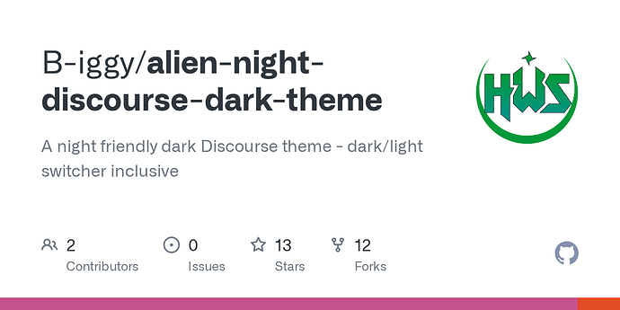

### [Releases · B-iggy/alien-night-discourse-dark-theme](https://github.com/B-iggy/alien-night-discourse-dark-theme/releases)

A night friendly dark Discourse theme - dark/light switcher inclusive - B-iggy/alien-night-discourse-dark-theme
  *[PR]: Pull Request

---

### Post #5 by [dax](../../users/dax.md)
*Posted: 2016-12-14 10:38*

It works perfectly, thanks [@B-iggy](/u/b-iggy)!
  *[PR]: Pull Request

---

### Post #6 by [dax](../../users/dax.md)
*Posted: 2017-01-09 14:52*

[@B-iggy](/u/b-iggy) I find a little bug  
When you enter a topic (sometimes, not always) the link in navigation bar change in  
`https://forum.empyrion-homeworld.net/#`  
instead to e.g.  
`https://forum.empyrion-homeworld.net/t/griefing-and-cheating-report/3520`

So, when you try to go in another page, or return to the home page (clicking the logo), the site is not responding.

Or the link does not match the title of the topic, e.g.

[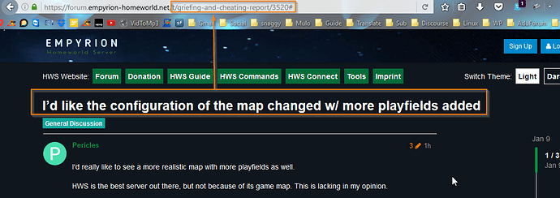](../../../assets/images/54175/848ec1889be975dcee25fc94a83ee71ce72d6eae.png)

  
I need to press `Ctrl` and `F5` to refresh all.

It also happens on my forum from yesterday, since I enabled the switcher themes.

Removing the strings `href="#"` in Html code seems to resolve the problems.  
Can you try and confirm please?
  *[PR]: Pull Request

---

### Post #7 by [dax](../../users/dax.md)
*Posted: 2017-01-14 17:10*

After few days I can confirm that[ this bug](../../../assets/images/54175/63fa40de2f230c1cdbaae7febd11831965a30e91_2_428x500.jpeg) is fixed by deleting `href="#"` from the Html code, e.g.
    
    
      <a class="theme-switcher-attr theme-switcher-light">Light</a>
      <a class="theme-switcher-attr theme-switcher-dark">Dark</a>
    

If anyone is interested I changed the position and shape of the buttons making them “fixed” on the page, so users can change from dark to light (or viceversa) without going back to top.

On **CSS** I add:
    
    
    #top-navbar {
        position: fixed;
        top: 90px;
        left: 0;
        z-index: 90000;
        width: 70px;
        overflow: hidden;
        margin: 0;
        text-align: center;
        box-shadow: 0px 0px 4px #070708;
        border-radius: 0px 10px 10px 0px;
    }
    

according to my Html code.

and this line (both here `.theme-switcher-light` and here `.theme-switcher-dark`) to make the round buttons  
`border-radius: 100%;`

In **Html/Top** :
    
    
    

      Tema:
      <a class="theme-switcher-attr theme-switcher-light"><i class="fa fa-sun-o fa-lg"></i></a>
      <a class="theme-switcher-attr theme-switcher-dark"><i class="fa fa-moon-o fa-lg"></i></a> 
    

    

I preferred to use the FontAwesome’s icons instead of a text for buttons.

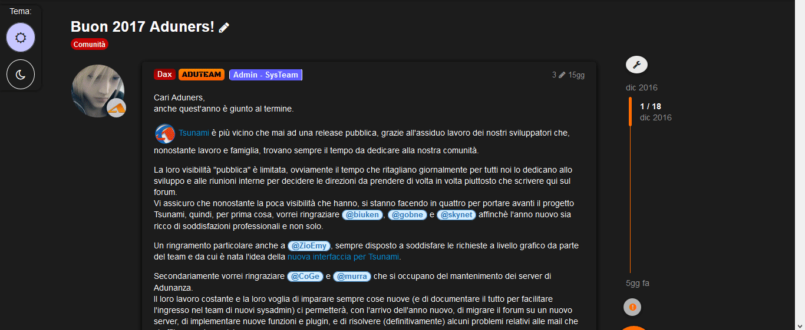
  *[PR]: Pull Request

---

### Post #8 by [B-iggy](../../users/B-iggy.md)
*Posted: 2017-01-14 17:28*

Hey @Trash,

just today I got feedback from the community regarding this too so I wanted to tackle it. Thank you for your fix. Will try it out. Nice to see it in action by someone else 🙂
  *[PR]: Pull Request

---

### Post #9 by [alehman](../../users/alehman.md)
*Posted: 2017-03-03 04:37*

Thanks for the terrific theme and switcher. This is perfect for my astronomy club.

Question - the background of the header bar (I’m using the default bar for now) does not change color when the dark theme is selected. It stays at the default white. Can the script be modified to include changing the header?

Thanks,  
Alan
  *[PR]: Pull Request

---

### Post #10 by [dax](../../users/dax.md)
*Posted: 2017-03-03 19:43*

 alehman:

> Question - the background of the header bar (I’m using the default bar for now) does not change color when the dark theme is selected. It stays at the default white. Can the script be modified to include changing the header?

You don’t need to modify the script, but add some lines on your css:
    
    
    html.dark .d-header {
        background: #1c1c1c;  /*change it with the hex color you want*/
    }
    

to change the background color

Instead, to change the color of the title (if you need) add somenthing like this:
    
    
    html.dark .extra-info-wrapper .topic-link {
        color: #ffffff;  /*change it with the hex color you want*/
    }
    
  *[PR]: Pull Request

---

### Post #11 by [alehman](../../users/alehman.md)
*Posted: 2017-03-05 05:45*

The lines for the header work perfectly. Thanks!
  *[PR]: Pull Request

---

### Post #12 by [Pawel_Kosiorek](../../users/Pawel_Kosiorek.md)
*Posted: 2017-07-10 18:42*

Hi there @Trash and [@B-iggy](/u/b-iggy) !

I’m trying to apply your brilliant dark theme with switch bar, but I’m afraid that I messed up something…  
Dark theme is working, also I can se the switch buttons, but they are just not working… Also colour is fixed to white.  
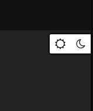  
I’m not really sure where should I paste the HTML code (sorry about that, I’m greenhorn in that matter).  
Should I put it in Head or Body? Or in all of it?  

[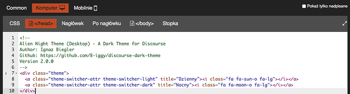](../../../assets/images/54175/9ff0335b5910ef06a1494f3bfddb548d9930c58f.png "image.png")

  
Thanks!
  *[PR]: Pull Request

---

### Post #13 by [B-iggy](../../users/B-iggy.md)
*Posted: 2017-07-10 18:58*

Hey [@Pawel_Kosiorek](/u/pawel_kosiorek),

glad you like my theme! 🙂

You only showed the html code and I guess the CSS is right. But did you apply the JS also in the head?

This code here:

<https://github.com/B-iggy/discourse-dark-theme/blob/master/alien-night-theme--theme-switcher.js>

Needs to be put in the section (Common).  
The HTML goes to the “After Header” for Desktop and Mobile independently since they are a bit different.
  *[PR]: Pull Request

---

### Post #14 by [Pawel_Kosiorek](../../users/Pawel_Kosiorek.md)
*Posted: 2017-07-10 19:23*

Hi! Thanks for reply!  
Now I can switch between Dark And Darker 😃  
This is happening when I’m clicking to the moon:  
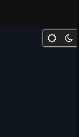  
And this is after click to the sun:  
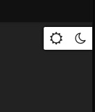  
I think it’s related to naming of dark and light theme?
  *[PR]: Pull Request

---

### Post #15 by [sam](../../users/sam.md)
*Posted: 2017-07-10 20:04*

[@B-iggy](/u/b-iggy) I would like to move this to the #plugin:theme , was wondering if you can orgnaise the the theme per:

 [Structure of themes and theme components](https://meta.discourse.org/t/how-to-develop-custom-themes/60848) [Developer Guides](/c/documentation/developer-guides/56)

> Discourse supports [native themes](../../../assets/images/54175/266bc1475c5f30578149e5c4c804d9b5a0750fae_2_463x500.jpeg) that can be sourced from a .tar.gz archive or from a remote git repository including [private repositories](https://meta.discourse.org/t/how-to-source-a-theme-from-a-private-git-repository/82584). [[56]](../../../assets/images/54175/5d81758f2f3090bee941c034a5d5a8165df50ce4.png "56") An example theme is at: [GitHub - discourse/discourse-simple-theme: Sam's simple discourse theme](https://github.com/SamSaffron/discourse-simple-theme) [[32]](../../../assets/images/54175/66944b3e613c84ac19333461a11ffb39988b5f32.png "32") The git repository will be checked for updates ([once a day](https://github.com/discourse/discourse/blob/master/app/jobs/scheduled/check_out_of_date_themes.rb)), or by using the Check for Updates button. When changes are detected the Check for Updates button will change to the Update to Latest. [image] To create a theme you need to follow a spe… 
  *[PR]: Pull Request

---

### Post #16 by [B-iggy](../../users/B-iggy.md)
*Posted: 2017-07-11 09:29*

Hello [@sam](/u/sam)

thank you very much for this opportunity - I feel honored 🙂

I have reorganized all files and made it ready to use over native themes.  
I updated / cleaned up everything and should be ready to go 🙂

<https://github.com/B-iggy/alien-night-discourse-dark-theme>

Thanks again!

Iggy
  *[PR]: Pull Request

---

### Post #17 by [sam](../../users/sam.md)
*Posted: 2017-07-11 11:58*

Cool, moving this to the theme category please update the first post 
  *[PR]: Pull Request

---

### Post #18 by [Pawel_Kosiorek](../../users/Pawel_Kosiorek.md)
*Posted: 2017-07-11 14:15*

Hi!  
After your update everything works just fine! Congrats!  
I found just one minor bug, from time to time switcher just stops working. There’s no effect when you’re trying to change from one to another theme. Site refresh helps.

One more thing, is it possible to change colour of top of the page and the switcher to night mode, when it’s switched to night mode 😉 Now it’s white on night mode.

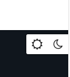
  *[PR]: Pull Request

---

### Post #19 by [B-iggy](../../users/B-iggy.md)
*Posted: 2017-07-12 11:36*

Hey [@Pawel_Kosiorek](/u/pawel_kosiorek),

glad it worked with the native theme installation 🙂  
I will check why it is sometimes not working. Guess some internal JS call conflicts.

Yes, since I am using a background image for the header I left it accidentally white - will fix it.  
Will adjust the color for the theme switcher too.
  *[PR]: Pull Request

---

### Post #20 by [grahamtrump](../../users/grahamtrump.md)
*Posted: 2018-06-28 04:39*

Love it!!!😘
  *[PR]: Pull Request

---

### Post #21 by [B-iggy](../../users/B-iggy.md)
*Posted: 2019-04-04 13:46*

@here Keep in mind that the [#4](../../../assets/images/54175/430743a99a653c51b7bb9f35ac45c7b7ed69e896_2_417x500.jpeg) post is not up to date anymore.

I’m using now a complete new method for the Theme Switcher. It’s nicely put in the Discourse Header now 🙂

(_hopefully it has no issues with other Discourse Header components_)
  *[PR]: Pull Request

---

### Post #22 by [Anatolia](../../users/Anatolia.md)
*Posted: 2019-04-04 16:05*

Could you share that switch as a seperate theme component? I’m looking for this feature for months.
  *[PR]: Pull Request

---

### Post #23 by [B-iggy](../../users/B-iggy.md)
*Posted: 2019-04-04 16:54*

Hey [@Anatolia](/u/anatolia)

I tried my best to make it happen 😃

Go here:

[Theme Switcher Component](https://meta.discourse.org/t/theme-switcher-component/113460) [Theme component](/c/theme-component/120)

> [[deprecated](../../../assets/images/54175/403195222031e42e520f27c372e8527c204437aa_2_376x500.jpeg)] Hey Discourse Community, after a lot of requests I share a Theme Switcher component, encapsulated from my [Alien Night Theme](https://meta.discourse.org/t/alien-night-theme-a-free-dark-theme-for-discourse/54175). For now, once pressed the button it will switch your theme into a dark mode theme. Later on I can maybe implement a setting page, where you can define your own global CSS class your theme should switch into. Or just toggle between the first two themes you allowed for users to choose from… Installation & Download Preview [[example]](../../../assets/images/54175/4433cc97b1f43518e4d9479e4b267f75159a347f.png "example") [[example2]](../../../assets/images/54175/31a68f3f701144f4ea3c1f5d1c9e37ded33e8bc7.png "example2") [[i…](../../../assets/images/54175/f3cda34843e4f774f3fb0b70e4fcca60b564b8da.jpeg "image")
  *[PR]: Pull Request

---

### Post #24 by [Anatolia](../../users/Anatolia.md)
*Posted: 2019-04-04 17:28*

I added to our forum. Thank you so much 
  *[PR]: Pull Request

---

### Post #25 by [dax](../../users/dax.md)
*Posted: 2019-04-24 09:31*

There is something wrong in the header when you open the hamburger menu:

[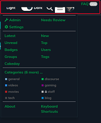](../../../assets/images/54175/0efa6c3d80c42099da6b1b50fc0cd367dfe10168.png "image.png")

A part of the menu moves to the top right and partially covers the buttons on the header

However great rework!
  *[PR]: Pull Request

---

### Post #26 by [B-iggy](../../users/B-iggy.md)
*Posted: 2019-05-04 15:25*

Back from vacation. Sorry for the delay!  
[I fixed it now](https://github.com/B-iggy/alien-night-discourse-dark-theme/commit/fb4a324896d7fe0f658eee7f4965bc03fbf08c14) 🙂 _(legacy from my own sub theme header component)_  
Thanks for the report!
  *[PR]: Pull Request

---

### Post #27 by [ahmadabdolsaheb](../../users/ahmadabdolsaheb.md)
*Posted: 2019-11-16 13:35*

Thanks for the theme. I like how you have both dark and light colors in the same stylesheet. I don’t know any other theme that does that.

There are lot of hard coded colors, I was wondering if you have any plans for making those customizable using color variables and functions?

There are some colors that do not change between dark and light mode resulting in low contrast such as the tags. it would be great if we could overwrite all colors in the UI so they are customizable as well.

Also if some users decide on different color palette, it would be easier to adjust the unwanted color variations.

I am working on a fork of Alien Night and replaced all hard coded colors with variables so they could be organized and possibly derived from the color_schemes.

If you find it beneficial I could post the color list here or as an issue or pr to your repo.

Thank you.
  *[PR]: Pull Request

---

### Post #28 by [ahmadabdolsaheb](../../users/ahmadabdolsaheb.md)
*Posted: 2019-11-16 14:22*

Out of curiosity, I see a large list of items whose colors are changed with the dark class, did you find the elements that needed a color change one by one or you used another strategy?
  *[PR]: Pull Request

---

### Post #29 by [B-iggy](../../users/B-iggy.md)
*Posted: 2019-11-17 08:51*

Hey [@ahmadabdolsaheb](/u/ahmadabdolsaheb)

thanks for your feedback - appreciated!

Right, for now they are hardcoded “by eye and taste” 😉  
Currently quite busy so can’t work on a customizable setup. I would like a Pull Request or whatever way you like to integrate it, so everyone can benefit from it.
  *[PR]: Pull Request

---

### Post #30 by [AtakanYildirim1](../../users/AtakanYildirim1.md)
*Posted: 2019-12-16 22:01*

Great theme!!!

[@B-iggy](/u/b-iggy)

How can I get answers into container separately?

example

[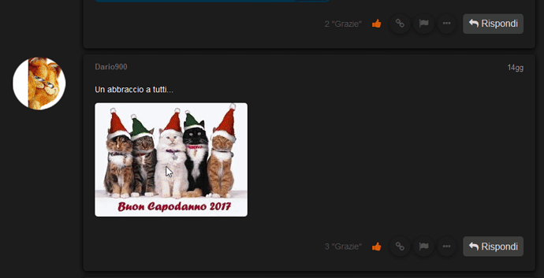](../../../assets/images/54175/12d1cba4eee4357f0ca4a442dcd1cc680c4b988a.png "orn")
  *[PR]: Pull Request

---

### Post #31 by [B-iggy](../../users/B-iggy.md)
*Posted: 2019-12-17 10:30*

Welcome to the Forum and thanks for your feedback [@AtakanYildirim1](/u/atakanyildirim1)

I don’t know exactly what your request is though. Answers in a separate container?
  *[PR]: Pull Request

---

### Post #32 by [AtakanYildirim1](../../users/AtakanYildirim1.md)
*Posted: 2019-12-17 10:56*

[@B-iggy](/u/b-iggy)

This is my website answer style  

[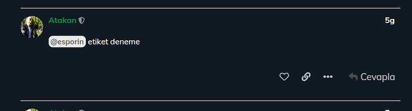](../../../assets/images/54175/56cffc4a9f9c2bdf25d6b6591df985a4b221f15f.png "orn2")

Desired look style  

  *[PR]: Pull Request

---

### Post #33 by [B-iggy](../../users/B-iggy.md)
*Posted: 2019-12-18 15:33*

Ah I see. You want to have kind of “Google Material Design” boxed style.  
I will play around with it and let you know, once I’m done with it. Currently busy with christmas work.  
Thanks for the suggestion!
  *[PR]: Pull Request

---

### Post #34 by [Rika](../../users/Rika.md)
*Posted: 2019-12-19 17:44*

Oooh, this is a nice theme!
  *[PR]: Pull Request

---

### Post #35 by [AtakanYildirim1](../../users/AtakanYildirim1.md)
*Posted: 2019-12-19 22:09*

I’d appreciate it if you did. allowing this topic [@B-iggy](/u/b-iggy)
  *[PR]: Pull Request

---

### Post #36 by [somjaina_ichitaina](../../users/somjaina_ichitaina.md)
*Posted: 2019-12-20 08:12*

Awesome!!! Really like this
  *[PR]: Pull Request

---

### Post #37 by [AtakanYildirim1](../../users/AtakanYildirim1.md)
*Posted: 2019-12-20 22:25*

What should I do to start light mode by default [@B-iggy](/u/b-iggy)
  *[PR]: Pull Request

---

### Post #38 by [Rika](../../users/Rika.md)
*Posted: 2019-12-21 00:25*

I was gonna ask this too.
  *[PR]: Pull Request

---

### Post #39 by [B-iggy](../../users/B-iggy.md)
*Posted: 2019-12-21 10:18*

 AtakanYildirim1:

> What should I do to start light mode by default [@B-iggy](/u/b-iggy)

Well, since the purpose of this theme is to make it Dark, I didn’t think of an option to have it light as default 😉  
Maybe I can implement a theme setting for that, even if it’s strange to me.
  *[PR]: Pull Request

---

### Post #40 by [B-iggy](../../users/B-iggy.md)
*Posted: 2019-12-21 10:25*

 AtakanYildirim1:

> I’d appreciate it if you did. allowing this topic [@B-iggy](/u/b-iggy)

Alright, I have implemented your request. I like it myself that way, even though in the dark mode it’s not that visible that much due contrast.  
Let me know your thoughts. In the light version it’s more noticeable.

**Note** : I went with the logic, that the topic owner does not have a material themed box, to highlight him within a conversation and make his topics like a “fundament”, if you know what I mean.  
Let me know what you think about that as well please.

[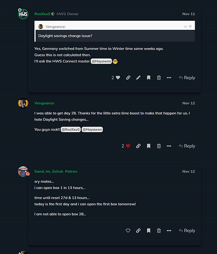](../../../assets/images/54175/63fa40de2f230c1cdbaae7febd11831965a30e91.jpeg "image")

[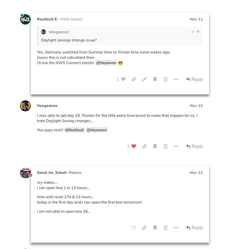](../../../assets/images/54175/266bc1475c5f30578149e5c4c804d9b5a0750fae.jpeg "image")
  *[PR]: Pull Request

---

### Post #41 by [AtakanYildirim1](../../users/AtakanYildirim1.md)
*Posted: 2019-12-21 13:44*

SO GREAT ! How do I apply this to my theme ? [@B-iggy](/u/b-iggy)
  *[PR]: Pull Request

---

### Post #42 by [B-iggy](../../users/B-iggy.md)
*Posted: 2019-12-21 13:48*

If you are using the Alien Night Theme, you should have got informed by now, that there is an update available.  
So just click on Check for Updates and upgrade to the latest version.  
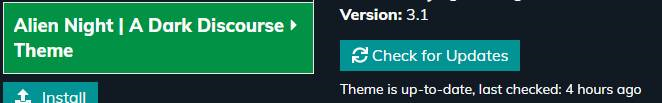
  *[PR]: Pull Request

---

### Post #43 by [AtakanYildirim1](../../users/AtakanYildirim1.md)
*Posted: 2019-12-21 17:20*

[@B-iggy](/u/b-iggy)  
I know I’m asking a lot of questions 😦

How do I change the background of these pop-up answers. ?  

[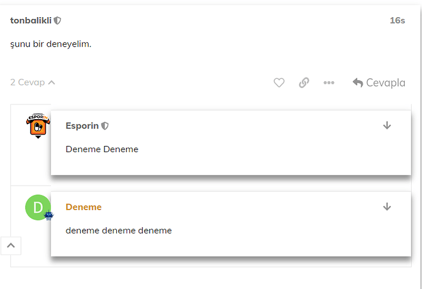](../../../assets/images/54175/707080904159891d8e63eb418fbb42ff1279e088.png "2ı")

Bir de varsayılan olarak light başlaması için bir yöntem var mı?
  *[PR]: Pull Request

---

### Post #44 by [B-iggy](../../users/B-iggy.md)
*Posted: 2019-12-22 12:43*

 AtakanYildirim1:

> How do I change the background of these pop-up answers. ?

What background do you mean exactly?
  *[PR]: Pull Request

---

### Post #45 by [AtakanYildirim1](../../users/AtakanYildirim1.md)
*Posted: 2019-12-22 13:41*

[@B-iggy](/u/b-iggy)  
As you can see in the picture, clicking on 2 answers opens the answers. Can I change the background color of these pop-up responses?

[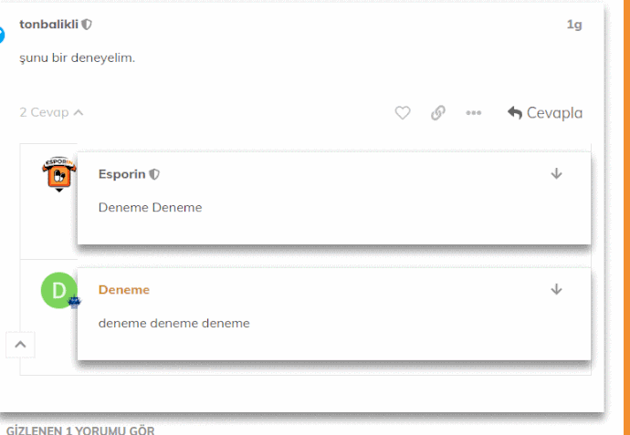](../../../assets/images/54175/5d4b4d5b751b2373da58df42e825d7036b26ff34.gif "replyp")

Dropdown field Can I adjust the background?
  *[PR]: Pull Request

---

### Post #46 by [B-iggy](../../users/B-iggy.md)
*Posted: 2019-12-23 16:28*

Good point.  
Highlight the Reply button was always on my list…

A new version is out. Please upgrade.

I considered your suggestion as following:  

[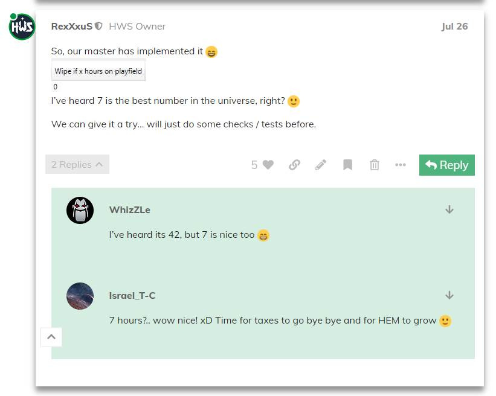](../../../assets/images/54175/9aacc0f4441b9dc748389b95b561ff539b025ce3.jpeg "image")

[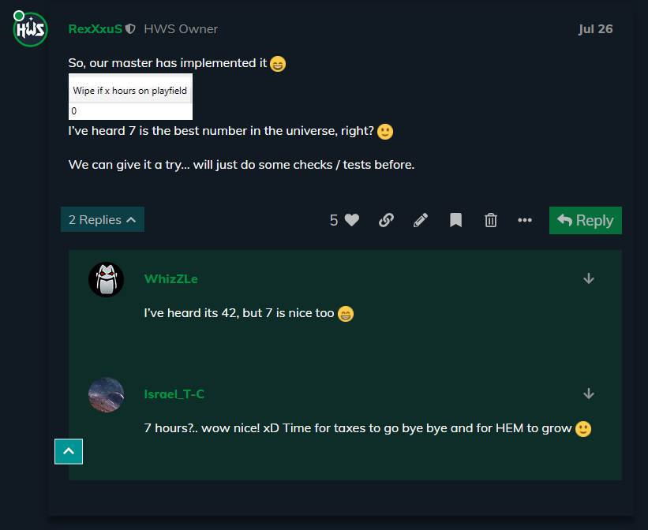](../../../assets/images/54175/aa4bec99c3d1462764a758d57659abed2b9ea5cf.jpeg "image")
  *[PR]: Pull Request

---

### Post #47 by [AtakanYildirim1](../../users/AtakanYildirim1.md)
*Posted: 2019-12-23 18:47*

[@B-iggy](/u/b-iggy)  
I’m grateful <3 Can I change the colors?
  *[PR]: Pull Request

---

### Post #48 by [B-iggy](../../users/B-iggy.md)
*Posted: 2019-12-23 19:00*

Currently not. I’ll add options for that
  *[PR]: Pull Request

---

### Post #49 by [ondrej](../../users/ondrej.md)
*Posted: 2019-12-23 19:08*

Hello [@B-iggy](/u/b-iggy) I’m liking the theme. However, it does not like versatile banners. Also I have a random checkbox.  
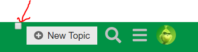

* * *

It also seems to not like this

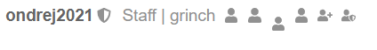

Thanks for help when you can.
  *[PR]: Pull Request

---

### Post #50 by [Rika](../../users/Rika.md)
*Posted: 2019-12-23 22:33*

This is what I wanted, thanks!
  *[PR]: Pull Request

---

← Previous | **Page 1 of 2** | [Next →](54175-page-2.md)
