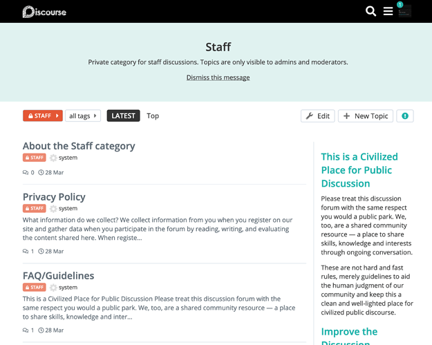
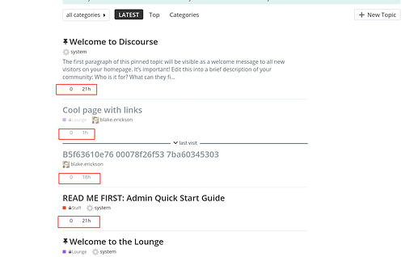
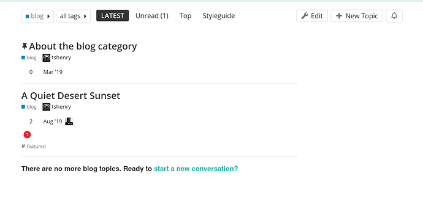
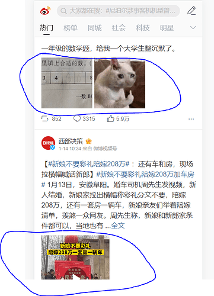

[🏠 Home](../../index.md) | [📋 Latest](../../latest/index.md) | [🔥 Top](../../top/replies/index.md) | [👥 Users](../../users/index.md)

[Home](../../index.md) » [Theme](../../c/theme/index.md) » Atlas, a simple blog-styled theme with an optional sidebar

---

# Atlas, a simple blog-styled theme with an optional sidebar

> **Category:** Theme
> **Author:** awesomerobot
> **Created:** 2019-09-07 02:38

---

### Post #1 by [awesomerobot](../../users/awesomerobot.md)
*Posted: 2019-09-07 02:38*

Atlas features an alternate topic list layout intended to highlight topic excerpts, and also includes space for an (optional) sidebar. Categories feature user-dismissable headers populated by the “About” topic.

🔭 [Preview on theme creator](https://theme-creator.discourse.org/theme/awesomerobot/atlas) (note that excerpts aren’t turned on, so the preview is a bit limited)

🐙 [Github repo](https://github.com/awesomerobot/atlas): `https://github.com/awesomerobot/atlas`

❓ [Installing a theme or theme component](https://meta.discourse.org/t/how-do-i-install-a-theme-or-theme-component/63682)

ℹ️ Important notes:

  * The sidebars are added using the [Custom Sidebar component](https://github.com/awesomerobot/discourse-custom-sidebar) , which can be setup to feature a post as the sidebar content for specified categories. Configuration details are in the repo’s readme.

  * The theme works best with the box category style (admin > settings)

  * Excerpts can be enabled using a hidden site setting called `always_include_topic_excerpts`. To enable this setting you need console access to your server.

To enable excerpts via the command line
        
        ./launcher enter app
        rails c
        

and then in the rails console
        
        SiteSetting.always_include_topic_excerpts = true
        

🛠️ Future improvements

  * There are some hard-coded colors in this theme, I need to update those to be editable by color schemes

  * Settings to turn certain features (like category headers) on and off

---

### Post #3 by [Earlie](../../users/Earlie.md)
*Posted: 2019-09-07 06:32*

Thank you for the good work, is there a way to change header color from black to probably a light one i.e. white?  
I am novice here, so advance many thanks for answering a basic question.

---

### Post #4 by [Sachin_Tajane](../../users/Sachin_Tajane.md)
*Posted: 2019-10-26 14:20*

error

when members create new topic “tag field is missing” please solve this

---

### Post #5 by [awesomerobot](../../users/awesomerobot.md)
*Posted: 2019-10-30 18:29*

Oh yes you’re right, I forgot about that. It’s fixed now. Thanks for reporting it.

---

### Post #6 by [blake](../../users/blake.md)
*Posted: 2020-08-18 17:00*

Looks like these icons are missing now

EDIT: Oh I think it is related to this migration:

[github.com/discourse/discourse](https://github.com/discourse/discourse/blob/b1c726be0d33040d2aba0c39e8ea92ae2d86c024/db/migrate/20200517140915_fa4_renames.json)

#### [db/migrate/20200517140915_fa4_renames.json](https://github.com/discourse/discourse/blob/b1c726be0d33040d2aba0c39e8ea92ae2d86c024/db/migrate/20200517140915_fa4_renames.json)

[`b1c726be0`](https://github.com/discourse/discourse/blob/b1c726be0d33040d2aba0c39e8ea92ae2d86c024/db/migrate/20200517140915_fa4_renames.json)
    
    
    {
      "500px": "fab-500px",
      "address-book-o": "far-address-book",
      "address-card-o": "far-address-card",
      "adn": "fab-adn",
      "amazon": "fab-amazon",
      "android": "fab-android",
      "angellist": "fab-angellist",
      "apple": "fab-apple",
      "area-chart": "chart-area",
      "arrow-circle-o-down": "far-arrow-alt-circle-down",
      "arrow-circle-o-left": "far-arrow-alt-circle-left",
      "arrow-circle-o-right": "far-arrow-alt-circle-right",
      "arrow-circle-o-up": "far-arrow-alt-circle-up",
      "arrows": "arrows-alt",
      "arrows-alt": "expand-arrows-alt",
      "arrows-h": "arrows-alt-h",
      "arrows-v": "arrows-alt-v",
      "asl-interpreting": "american-sign-language-interpreting",
      "automobile": "car",
    

This file has been truncated. [show original](https://github.com/discourse/discourse/blob/b1c726be0d33040d2aba0c39e8ea92ae2d86c024/db/migrate/20200517140915_fa4_renames.json)

EDIT 2: And here is a PR 

[github.com/awesomerobot/atlas](https://github.com/awesomerobot/atlas/pull/1)

####  [FIX: Broken icons because of rename](https://github.com/awesomerobot/atlas/pull/1)

`master` ← `oblakeerickson:fix-icon-rename`

merged 08:10PM - 18 Aug 20 UTC

[  oblakeerickson ](https://github.com/oblakeerickson)

[ +3 -3 ](https://github.com/awesomerobot/atlas/pull/1/files)

Looks like a bunch of icons were renamed in discourse core: https://github.co[…](https://github.com/awesomerobot/atlas/pull/1)m/discourse/discourse/blob/master/db/migrate/20200517140915_fa4_renames.json

---

### Post #7 by [tpetrov](../../users/tpetrov.md)
*Posted: 2020-09-23 12:35*

For some reason when I try to open it in theme creator  

 [Discourse Theme Creator](https://theme-creator.discourse.org/theme/awesomerobot/atlas-theme) 

### ['Atlas' by @awesomerobot](https://theme-creator.discourse.org/theme/awesomerobot/atlas-theme)

A theme for Discourse shared on theme-creator.discourse.org

  
I end up on the blog styling component.

---

### Post #8 by [camkego](../../users/camkego.md)
*Posted: 2020-09-23 23:28*

I also am unable to successfully open the the theme in theme creator.  
I use the “review on theme creator” link in the main post, and it takes me to the " View Shared Theme" modal on the https://theme-creator.discourse.org/latest url, but after clicking the “View Theme” button, I am left at this url: without visiting the theme: https://theme-creator.discourse.org/c/blog/18

---

### Post #9 by [awesomerobot](../../users/awesomerobot.md)
*Posted: 2020-09-23 23:42*

Hmm, I’m not sure what was happening there… but I recreated the link (<https://theme-creator.discourse.org/theme/awesomerobot/atlas>) and it seems to be ok now. I’ve updated the original post.

---

### Post #10 by [blake](../../users/blake.md)
*Posted: 2020-12-17 23:40*

I haven’t looked into this yet, but looks like there are some issues with this theme now on Discourse 2.7.0 beta1. If you look at it in the [theme creator](https://theme-creator.discourse.org/theme/awesomerobot/atlas) it is missing the topic previews and some other icons

---

### Post #12 by [awesomerobot](../../users/awesomerobot.md)
*Posted: 2021-03-18 03:54*

I’ve made some general updates to the theme to fix what was broken, and plan on some more!

---

### Post #13 by [hoangviet](../../users/hoangviet.md)
*Posted: 2023-01-16 01:47*

i want to show some thumbnails (on mobile, desktop), can you guide me?  

Thank you very much!

---

### Post #14 by [hoangviet](../../users/hoangviet.md)
*Posted: 2023-01-16 02:11*

How to display Name (Username) on mobile? (currently I only see it on Desktop).

Thank you very much

---
