[🏠 Home](../../index.md) | [📋 Latest](../../latest/index.md) | [🔥 Top](../../top/replies/index.md) | [👥 Users](../../users/index.md)

[Home](../../index.md) » [Theme](../../c/theme/index.md) » Avid Reader Theme

---

# Avid Reader Theme

> **Category:** Theme
> **Author:** Discourse
> **Created:** 2021-08-30 18:54

---

### Post #1 by [Discourse](../../users/Discourse.md)
*Posted: 2021-08-30 18:54*

> ⚠️ If you installed the theme **before June 7, 2023** , you will need to **reinstall** it using the new repository link on GitHub.

|  |   
---|---|---  
 | **Summary** |  **Avid Reader** is a theme focused on readability, inspired by the look of [Pocket](https://getpocket.com/).  
🛠️ | **Repository Link** | <https://github.com/discourse/avid-reader>  
📖 | **New to Discourse Themes?** | [Beginner’s guide to using Discourse Themes](https://meta.discourse.org/t/beginners-guide-to-using-discourse-themes/91966)  
  
Install this theme

>  As this is an [official](/tag/official) theme maintained by the Discourse team, [Support](/c/support/6) issues, [Bug](/c/bug/1) reports, [UX](/c/ux/9) suggestions, and requests for [Dev](/c/dev/7) advice can be made in the respective categories here on Meta, and tagged with the appropriate theme tag. Click on a link below to get one started. 👍
> 
> ` [❓ **Support**](https://meta.discourse.org/new-topic?category_id=6&tags=avid-reader-theme "Ask for support on configuring and using the Avid Reader Theme") ` ` [🐛 **Bug**](https://meta.discourse.org/new-topic?category_id=1&tags=avid-reader-theme "A bug report means something is broken, preventing normal/typical use of the theme") ` ` [👀 **UX**](https://meta.discourse.org/new-topic?category_id=9&tags=avid-reader-theme "Discussion about the user interface of the Avid Reader Theme, and how features are presented \(including language and UI elements\)") ` ` [ **Dev**](https://meta.discourse.org/new-topic?category_id=7&tags=avid-reader-theme "Advice on how to customise this theme for your site")`

###  Features

We implemented bigger font sizes, more contrast in size between different headings, more space in between lines and a neutral background color for a better reading experience. And there are a few custom icons as well.

#  Screenshots

[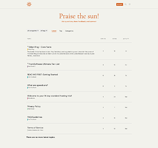](../../../assets/images/202156/ea90479d886d26759bdb2404669a952653bf9294.png "Home")

[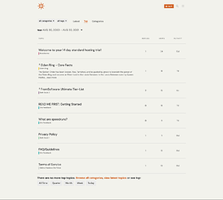](../../../assets/images/202156/25315c369c5fc41539944e4bc424b739fb747f81.png "Top")

[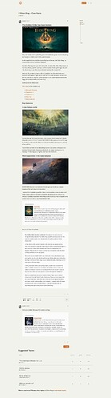](../../../assets/images/202156/9ca011e769947a087c5970129378f81c65e88c80.jpeg "Topic-Sample")

#  Theme Components

The theme includes the following theme-components:

  * [Discourse Clickable Topic Component](https://github.com/discourse/discourse-clickable-topic)
  * [Versatile Banner](https://github.com/tshenry/discourse-versatile-banner.git) by [@tshenry](/u/tshenry)

For Versatile Banner, we are using only a few features to have a simple welcome message with a description only at the homepage. You can check the screenshot below to replicate our settings for it:

See complete settings for Versatile Banner

[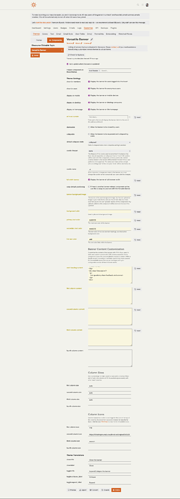](../../../assets/images/202156/a0a0f65bb0b096ffb6b7cf965247e529e50f05f1.png "versatile banner settings")

And here is the code we used for our welcome message + description:
    
    
    <h2 class="x-title">
      Your Welcome Message
    </h2>
    

      

        A brief description of what your Discourse is all about
      

    

    

#  Our Recommendations

If you want to have your Discourse to look just like the live preview, besides implementing the setting for Versatile Banner above, these were our choices for some of the Admin settings.

##  Category style

We prefer the category style to be **bar** instead of the default bullet. This can be changed in:

> Admin > Settings > Basic Setup > category style > bar

##  Desktop category page style

We opted to use the ‘boxes’ option for the Categories page. This can be changes in:

> Admin > Settings > Basic Setup > desktop category page style > boxes with subcategories

##  Category colors

We made a color palette for category colors that we feel works nicely with the rest of the theme.

[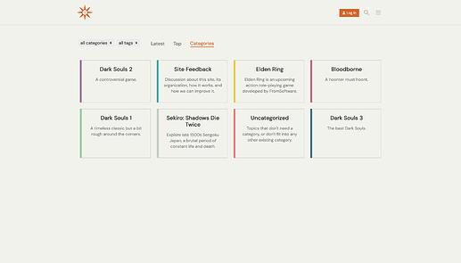](../../../assets/images/202156/750320e61c2cd60f06139221ed0f28e1b3ce417e.png "Categories")

See HEX Color Values
    
    
    #8ECEA0
    #20A9AB
    #946F96
    #CF9D2B
    #366B80
    #F69A9B
    #9FD8DF
    #00917C
    #F27072
    #C1CEBF
    #6B7AA1
    #F4D6A2
    #F0C928
    #C6B4CE
    #65516B
    #C56183
    

You can add these HEX values in:

> Admin > Settings > Basic Setup > category colors

#  Remove user card background setting

The theme does have one setting which might be a bit controversial. It is called ‘hide user card background’ and what it does is make it so that user card backgrounds are just white. We feel like even with the strong overlay Discourse uses by default, user cards backgrounds sometimes are a bit noisy.  

[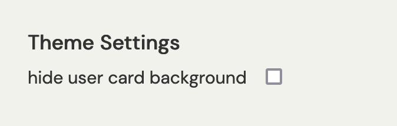](../../../assets/images/202156/e5467e58406239453513939639eb254fb6247519.png "hide user card background setting")

But this does limit an aspect of user self expression. We opted to leave it as a setting, up to the Admin to decide.  

[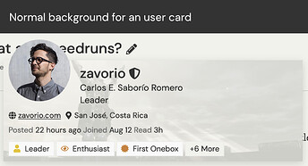](../../../assets/images/202156/d68b9fab2e829b650a0281385fc03b8d968d9982.jpeg "without hide bg")

[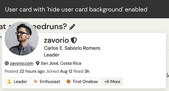](../../../assets/images/202156/cba57cae3d83517ada6bcfad4ddfce13e393fe48.png "with hide bg")

* * *

This is our very first theme and really the first real thing we do coding wise. We hope you enjoy it and we are more than happy to hear any feedback the community has. Thanks to Discourse for supporting this work!

  

>  **Hosted by us?** Themes are available to use on our Standard, Business, and Enterprise plans.

> Last edited by [@JammyDodger](/u/jammydodger) 2024-06-17T11:27:41Z
> 
> Check documentPerform check on document:

---

### Post #2 by [P2W](../../users/P2W.md)
*Posted: 2021-09-02 16:28*

nice theme, easy on the eyes.

---

### Post #3 by [Jagster](../../users/Jagster.md)
*Posted: 2021-09-02 16:58*

Topics don’t change color to something else, like grayish, when opened. When everything is same black it is difficult to find right away unread topics. Matter of CSS?

[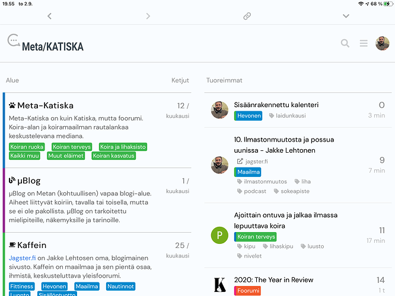](../../../assets/images/202156/030b1345a85dffc783369798d28c3ca097184a72.png "kuva")

---

### Post #4 by [zavorio](../../users/zavorio.md)
*Posted: 2021-09-02 17:19*

[@Jagster](/u/jagster) thanks for pointing this out. We had tested this in Safari and Chrome while logged out and it worked fine.  

[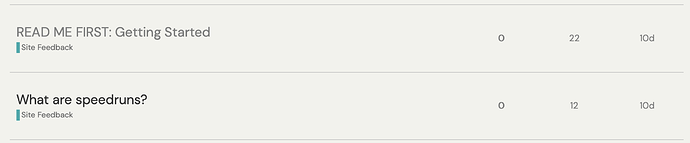](../../../assets/images/202156/402a5d52615488de6934ccf9356456bcfa22ebe6.png "CleanShot 2021-09-02 at 11.09.20")

  
But I just cleaned the browsers history to test it and it doesnt work, topics don’t change colors after visiting them. Will look into this later today or early tomorrow, thanks!

---

### Post #5 by [zavorio](../../users/zavorio.md)
*Posted: 2021-09-03 21:16*

We just updated the CSS, should work now. It was an old CSS rule that we wrote at the beginning and forgot about, ha.

---

### Post #6 by [elopio](../../users/elopio.md)
*Posted: 2021-09-07 01:23*

Wow, I like it!

We’ll try it as the default theme in <https://bunqueer.jaquerespeis.org/>

The logo doesn’t look good now, we’ll change it later.

Thanks [@zavorio](/u/zavorio) and [@senioritapolyester](/u/senioritapolyester) <3

---

### Post #7 by [CamilleRoux](../../users/CamilleRoux.md)
*Posted: 2021-09-08 14:04*

Is there a dark mode?

---

### Post #8 by [zavorio](../../users/zavorio.md)
*Posted: 2021-09-08 15:19*

[@CamilleRoux](/u/camilleroux) we _might_ make one later one but first we’d like to do a variation on the current color scheme for a slightly darker version of the theme. But its not something you would call Dark mode. Something more along the lines of the Titanium theme for Standard Notes:

[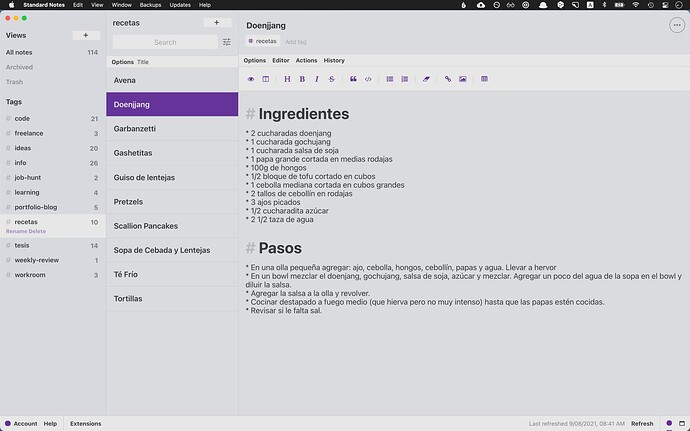](../../../assets/images/202156/638c7a16949e1d59adffb18aeb52322408d87333.jpeg "CleanShot 2021-09-08 at 08.41.25")

I find most common Light/Dark UIs to be too hard contrast for my eyes. As [@P2W](/u/p2w) expressed above, our goal was to make something easy on the eyes. A traditional dark mode might be too much. But hey, we might change our minds 

---

### Post #9 by [Zup](../../users/Zup.md)
*Posted: 2021-10-20 19:54*

 zavorio:

> Something more along the lines of the Titanium theme for Standard Notes:
> 
> 

Has there been any progress on this color scheme? It’s really quite perfect!

---

### Post #10 by [zavorio](../../users/zavorio.md)
*Posted: 2021-10-21 00:13*

Hey! Not really, but will be out before the end of the year. We’ve been a bit busy 😅

---

### Post #11 by [stuwest](../../users/stuwest.md)
*Posted: 2022-10-18 17:45*

I’m loving this theme, but my instance just added the new sidebar feature and the notifications menu broke. Has anyone else had that issue or is it just me?

---

### Post #12 by [Canapin](../../users/Canapin.md)
*Posted: 2023-04-29 13:59*

It’s because of this CSS:
    
    
    .widget-component-connector {
        display: none;
    }
    

I don’t know what is the original purpose of this rule in this theme.

---

### Post #13 by [Jagster](../../users/Jagster.md)
*Posted: 2023-04-29 15:04*

And chat icon missing. I used this theme earlier, but I dumped it because there was other issues too — sorry, can’t remember anymore what. But I see this theme broken one.

---

### Post #14 by [Canapin](../../users/Canapin.md)
*Posted: 2023-04-29 18:52*

 Jakke Flemming:

> And chat icon missing.

From what I saw from Discourse’s code, I believe the cause is the same as my message above.

---

### Post #15 by [dax](../../users/dax.md)
*Posted: 2023-05-02 11:11*

[@zavorio](/u/zavorio) there are a couple of PR on Github for you. Please approve them to fix the theme.

Would you consider continuing to update this theme in the future, or would you prefer to move on from it?

---

### Post #21 by [dax](../../users/dax.md)
*Posted: 2023-06-07 15:54*

The theme has been moved to our organization on GitHub and has been fixed.

If you installed the theme **before June 7, 2023** , you will need to **reinstall** it using the new repository link on GitHub.

(OP updated)

---
