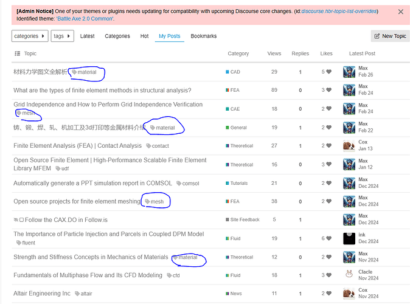
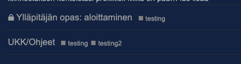
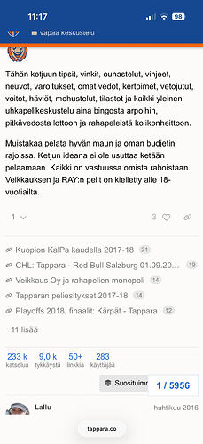

[🏠 Home](../../index.md) | [📋 Latest](../../latest/index.md) | [🔥 Top](../../top/replies/index.md) | [👥 Users](../../users/index.md)

[Home](../../index.md) » [Theme](../../c/theme/index.md) » Battle Axe - A free theme by the Tappara.co hockey community

---

# Battle Axe - A free theme by the Tappara.co hockey community (Page 2 of 2)

> **Category:** Theme
> **Author:** ljpp
> **Created:** 2016-01-11 18:53

[← Previous](37766.md) | **Page 2 of 2** | Next →

---

### Post #57 by [ljpp](../../users/ljpp.md)
*Posted: 2025-03-06 19:16*

According to [@ozzi](/u/ozzi) this was actually a huge/complete re-writing effort, but should now be up to date with the changes in the mainline.
  *[PR]: Pull Request

---

### Post #58 by [CAX.DO](../../users/CAX.DO.md)
*Posted: 2025-03-07 04:12*

I noticed, thank you all.

However, compared to the old version, after the update, tags are no longer displayed after article titles.

Do you think it’s necessary to reintroduce the feature of displaying tags?
  *[PR]: Pull Request

---

### Post #59 by [ozzi](../../users/ozzi.md)
*Posted: 2025-03-10 11:57*

Could you send a screenshot of the tags where those used to be? We don’t use tags with Discourse, but I can have look?

Btw, I am rewriting this theme to contains both dark and light themes in the same theme with the new toggle. Looks like there are still some bugs with the toggle so that is a bit postponed.

 [Dark/light mode toggle now available in core](https://meta.discourse.org/t/dark-light-mode-toggle-now-available-in-core/350991) [Announcements](/c/announcements/67)

> The [Dark/Light Mode Toggle](https://meta.discourse.org/t/dark-light-mode-toggle/215585) theme component, which adds a toggle to allow users to easily switch between light and dark modes, has been merged into Discourse core and it can be enabled via the interface color selector site setting. In addition to various bug fixes and improvements, the core version differs slightly from the original theme component in that it has a third “Auto” option which makes the site’s color mode match the system preference of the user’s device. The color selector can be c… 
  *[PR]: Pull Request

---

### Post #60 by [CAX.DO](../../users/CAX.DO.md)
*Posted: 2025-03-10 12:28*

Hi ozzi . Yes, I noticed from your [site](https://tappara.co/) that you are not using tags. I am currently still using an older version of the component.  
As you can see from the screenshot below, tags are displayed after the title.

If you have time, it would be great if you could add the functionality to display tags 😆.

The column for likes is part of another component and can be ignored.  

")
  *[PR]: Pull Request

---

### Post #61 by [ozzi](../../users/ozzi.md)
*Posted: 2025-03-10 12:48*

[@CAX.DO](/u/cax.do) Latest version should now show tags 🙂  

  *[PR]: Pull Request

---

### Post #62 by [CAX.DO](../../users/CAX.DO.md)
*Posted: 2025-03-10 13:03*

I’ve finished updating it. It looks great. Thank you!
  *[PR]: Pull Request

---

### Post #64 by [Salocin](../../users/Salocin.md)
*Posted: 2025-12-21 10:19*

Hello,

Something weird with the header when scrolling (iOS 26.2 iPhone 17 Pro):

  *[PR]: Pull Request

---

[← Previous](37766.md) | **Page 2 of 2** | Next →
