[🏠 Home](../../index.md) | [📋 Latest](../../latest/index.md) | [🔥 Top](../../top/replies/index.md) | [👥 Users](../../users/index.md)

[Home](../../index.md) » [Theme](../../c/theme/index.md) » Battle Axe - A free theme by the Tappara.co hockey community

---

# Battle Axe - A free theme by the Tappara.co hockey community (Page 1 of 2)

> **Category:** Theme
> **Author:** ljpp
> **Created:** 2016-01-11 18:53

← Previous | **Page 1 of 2** | [Next →](37766-page-2.md)

---

### Post #1 by [ljpp](../../users/ljpp.md)
*Posted: 2016-01-11 18:53*

Continuing from [Modify Users column to contain only one avatar (latest poster)](../../../assets/images/37766/16e0e8cc36a1652addbfc576234603e442eebc4d.png):

Time to give something back to the community. At [Tappara.co](http://tappara.co) we finally got our home screen, the Latest view, the way we wanted. This is partially based on [@sam](/u/sam)’s Minimal Theme and also borrows some from [@probus](/u/probus)’s excellent work at [Keskuskenttä](https://palsta.keskuskentta.fi/). It was mostly put together by our community member [Ozzi](http://tappara.co/users/ozzi/activity). So kudos to them!

**Main features:**

  * Users and Activity merged to Latest, combining the avatar and username of the last poster and a time stamp.
  * Columns logically re-ordered to | Topic | Category | Views | Replies | Latest |
  * Slightly squeezed vertical padding to allow more threads per screen.

See it in action on our site [Tappara.co](http://Tappara.co). Preview (Google Translated to English):  

[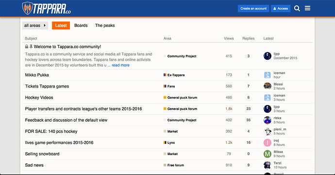](../../../assets/images/37766/c4e205533a37e80e6546ead4c8774c5bd14010e8.png "tappara-co.png")

Note that we also have other minor visual CSS patches that I have [published earlier](https://meta.discourse.org/t/a-few-simple-customization-examples-for-newbies/37022). These code snippets below are only responsible for the topic listing.

Any thoughts, ideas, suggestions are appreciated.

### Update:

The original version is outdated, and not compatible with current Discourse versions. Use the version 2 from our Github repo.

 [GitHub](https://github.com/TapparaCo) 

### [Tappara.co](https://github.com/TapparaCo)

Tappara.co - A hockey community. Tappara.co has 9 repositories available. Follow their code on GitHub.
  *[PR]: Pull Request

---

### Post #2 by [Law](../../users/Law.md)
*Posted: 2016-05-27 12:22*

Thank you! I’m liking this. 😄
  *[PR]: Pull Request

---

### Post #3 by [ljpp](../../users/ljpp.md)
*Posted: 2017-01-16 20:14*

Our complete theming and customization work has now been released at GitHub. It has also evolved slightly since I opened this thread, so have a look first: <https://tappara.co>

<https://github.com/TapparaCo/discourse-theme-Battle-Axe>

Edit: Repo name updated. Bug reports and improvement suggestions most welcome.  
Edit: Up to date screenshot:

[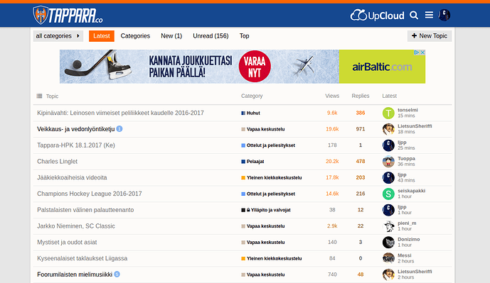](../../../assets/images/37766/ab3909c68f50971a084bafeea55fe4d626341c24.png "Screenshot_2017-01-18_00-26-13.png")
  *[PR]: Pull Request

---

### Post #4 by [ljpp](../../users/ljpp.md)
*Posted: 2017-01-17 22:32*

One thing we have not been able to get sorted out is the Category badge colors. We started with a blue-orange idea for Categories as well, but then we needed to add some more and ran out of colors. It is a bit of a mess really.

It is actually pretty hard to figure out the colors when you have more than a handful of Categories and you’d like to have them somewhat aligned with the overall brand and styling. There should also be headroom for adding more categories in the future, so that adding one more does not break your color system or scheme.

As this is a hockey forum, many of the basic colors associate strongly with certain opponent teams, which is also undesirable.

Very interested in any ideas or suggestions regarding Category colors.
  *[PR]: Pull Request

---

### Post #5 by [Mittineague](../../users/Mittineague.md)
*Posted: 2017-01-18 00:20*

If you enter hex you can have 256 different values for each of the 3 color channels.

Granted, an 9A isn’t very distinguishable from 9B etc. but with 256x256x256 how many more do you need?
  *[PR]: Pull Request

---

### Post #6 by [Remah](../../users/Remah.md)
*Posted: 2017-01-18 00:25*

Thanks for giving something back and not just in this topic. 😍

I don’t have any suggestions regarding specific Category colors for you particularly because of your need to avoid team color associations and I don’t have the same [cultural color associations](https://en.wikipedia.org/wiki/Color_psychology#Culture) as your users.

I just want to point out that it is worthwhile to integrate Category color theming with the Site color theming because they always interact.

For example, even if you want to have Category colors “somewhat aligned with the overall brand and styling”, you don’t usually want Category colors to repeat the site colors. The appearance of vitality in a site declines when the colors appear too uniform because they are repeated, as your Category colors do - but the blue and orange are a good combination. The same with a lack of contrast between colors. We don’t want them too lively (as discussed in [The end of Clown Vomit, or, simplified category styles ](https://meta.discourse.org/t/the-end-of-clown-vomit-or-simplified-category-styles/24249)) but we also don’t want to hinder engagement by making them appear too bland (e.g.if color seeding isn’t handled well [ Create a complete color scheme based on one seed color feature](https://meta.discourse.org/t/create-a-complete-color-scheme-based-on-one-seed-color/15673)).

So it would be good to have more Site and Category color automation which would reduce the need for many of the site customizations that appear in this forum. Maybe it’s time to look at extending [What about an easier styling/theming system?](https://meta.discourse.org/t/what-about-an-easier-styling-theming-system/12346) /[ Programmatically adjusting color variables with SASS](https://meta.discourse.org/t/programmatically-adjusting-color-variables-with-sass/18332) to Category colors?
  *[PR]: Pull Request

---

### Post #7 by [ljpp](../../users/ljpp.md)
*Posted: 2017-01-18 10:01*

[@Mittineague](/u/mittineague) Did you just play me with a classic engineering/developer joke? 🙂

Sure, you don’t run out of colors in technical perspective. But it is can be difficult to develop scheme of colors that play well with the overall theming and each other. If you have five categories, it is super simple - just use <https://coolors.co/> . But when you have 10-15-20 categories, it gets increasingly difficult. And the scheme should even be future proof, in case one wishes to add more categories…

[@mark](/u/mark) In addition to categories there are sub-categories. I have been tinking of a color scheme, that would “scale” vertically and horizontally. The root level categories would have different color, and the subcategories would be lighter shades of their root?
    
    
    Root category        sub-category
    Red                  light red
    Green                light green
    Blue                 light blue

And if you have more than one sub-category, the idea would be to use different levels of white shading 25/50/75 would give you 3 sub-category colors. Haven’t tried this in real life though.

And yes the cultural color associations make it even more complex. Our local rival team goes with a green & yellow jersey, which limits the usage of these colors. The Finnish Elite League has black & white branding, so categories related to the League as a whole should prolly leverage that, and so forth.
  *[PR]: Pull Request

---

### Post #11 by [ljpp](../../users/ljpp.md)
*Posted: 2017-01-22 10:42*

Theme & GitHub repo updated for 1.7 Stable. There was plenty of breakage. NOTE: We will follow the stable branch.
  *[PR]: Pull Request

---

### Post #13 by [ljpp](../../users/ljpp.md)
*Posted: 2017-01-22 22:21*

Well, iti definitely looks like an error but most likely in your implementation, as naturally the theme works Ok on our live site.
  *[PR]: Pull Request

---

### Post #15 by [ljpp](../../users/ljpp.md)
*Posted: 2017-01-23 10:09*

Since you asked so politely, we digged in deeper and actually found knick in the code. This was not 100% reproducible.

[github.com/TapparaCo/discourse-theme-Battle-Axe](../../../assets/images/37766/26d4648fe9d7e7195aea0c415ae2de22f2bf2834_2_1035x580.png)

####  [[fi.admin.dashboard.latest_version] shown on index page](../../../assets/images/37766/26d4648fe9d7e7195aea0c415ae2de22f2bf2834_2_1035x580.png)

opened 10:01AM - 23 Jan 17 UTC

closed 10:08AM - 23 Jan 17 UTC

[  ljpp ](https://github.com/ljpp)

The index page / latest view occasionally shows [fi.admin.dashboard.latest_versi[…]()on] in the Last Reply column.
  *[PR]: Pull Request

---

### Post #16 by [sam](../../users/sam.md)
*Posted: 2017-05-31 19:46*

Can you publish this as a theme so I can move it to #plugin:theme ?
  *[PR]: Pull Request

---

### Post #17 by [ljpp](../../users/ljpp.md)
*Posted: 2017-06-01 03:51*

At some point, yes. We are running 1.7.

A PR is welcome. _Yes, finally I get to say this!_ 😉
  *[PR]: Pull Request

---

### Post #18 by [ljpp](../../users/ljpp.md)
*Posted: 2017-06-04 16:56*

I am just starting to look at 1.8 and it seems that the whole Customization has been dramatically changed.

Is there any documentation on how are the 1.7 customizations managed by the upgrade process and what should be taken into account prior to the upgrade?

Our overall customization is made of multiple several code snippets, impacting different parts of the UI.
  *[PR]: Pull Request

---

### Post #19 by [neil](../../users/neil.md)
*Posted: 2017-06-04 17:44*

Here’s a doc about the new theme support:

 [Structure of themes and theme components](https://meta.discourse.org/t/how-to-develop-custom-themes/60848?source_topic_id=60925) [Developer Guides](/c/documentation/developer-guides/56)

> Discourse supports [native themes](../../../assets/images/37766/26d4648fe9d7e7195aea0c415ae2de22f2bf2834_2_1035x580.png) that can be sourced from a .tar.gz archive or from a remote git repository including [private repositories](https://meta.discourse.org/t/how-to-source-a-theme-from-a-private-git-repository/82584). [[56]](../../../assets/images/54175/5d81758f2f3090bee941c034a5d5a8165df50ce4.png "56") An example theme is at: [GitHub - discourse/discourse-simple-theme: Sam's simple discourse theme](https://github.com/SamSaffron/discourse-simple-theme) [[32]](../../../assets/images/54175/66944b3e613c84ac19333461a11ffb39988b5f32.png "32") The git repository will be checked for updates ([once a day](https://github.com/discourse/discourse/blob/master/app/jobs/scheduled/check_out_of_date_themes.rb)), or by using the Check for Updates button. When changes are detected the Check for Updates button will change to the Update to Latest. [image] To create a theme you need to follow a spe… 
  *[PR]: Pull Request

---

### Post #20 by [ljpp](../../users/ljpp.md)
*Posted: 2017-06-04 19:07*

Yeah, spotted that. I sure hope that the migration scripts are well tested. My two small side projects ugraded flawlessly though, but they have somewhat less customization.
  *[PR]: Pull Request

---

### Post #21 by [ljpp](../../users/ljpp.md)
*Posted: 2018-01-14 16:14*

Battle Axe theme is now available straight from our GitHub repository. We have just updated it to match Discourse 1.9, which introduced some changes to the UI elements.

We are also offering our customization of inserting local ads to the header and footer areas, mobile and desktop views. The code now serves our partner [UpClould.com](http://UpClould.com) graphic elements, so you need to modify accordingly.

 [GitHub](https://github.com/TapparaCo) 

### [Tappara.co](https://github.com/TapparaCo)

Tappara.co - A hockey community. Tappara.co has 9 repositories available. Follow their code on GitHub.

Edit: An up-to-date screenshot with FI locale and resposive AdSense ads enabled.

[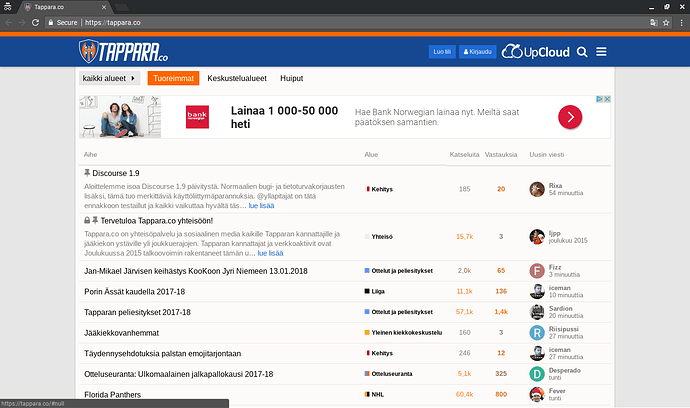](../../../assets/images/37766/31bca1cd55e7d6267fd96bd0609712fbd047e6a5.png "29")

### Mobile view (Chrome emulated)

[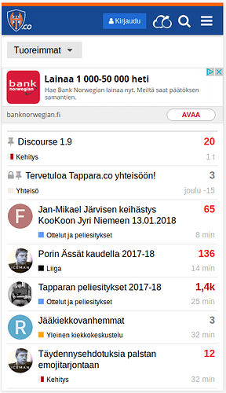](../../../assets/images/37766/fdd8f1a734e539d01fd09483a897e45cd65f6d68.png "01")
  *[PR]: Pull Request

---

### Post #22 by [8BIT](../../users/8BIT.md)
*Posted: 2018-01-14 16:20*

i like how you built your own theme with ads baked in. do you update those settings via a plugin or manually?
  *[PR]: Pull Request

---

### Post #23 by [ljpp](../../users/ljpp.md)
*Posted: 2018-01-14 16:29*

We have two kinds of ads:

  * We use the official endorsed ad plugin to serve responsive AdSense ads.
  * As mentioned elsewhere, we struck a deal with [UpCloud.com](http://UpCloud.com) premium hosting (highly recommended for Discourse, if I may say so), exchanging hosting credits for brand visibility. These we baked in to the theme. This provides UpCloud good visibility near the menu button and at the end of every page. This has the added benefit that local images are not blocked by AdBlockers, so they get their goods for every page view served. This customization is also published at our GitHub repo.

  *[PR]: Pull Request

---

### Post #24 by [rizka](../../users/rizka.md)
*Posted: 2019-02-03 21:20*

Exciting news! The Battle Axe theme was updated today. The new version also includes an awesome dark version with orange header, dark blue background and a white bar separating them. You can **right now** see the dark theme live at **<https://tappara.co>**. The light-colored version will be set to be the default theme again some time tomorrow so here is a screenshot:

[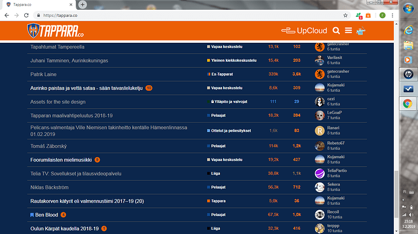](../../../assets/images/37766/26d4648fe9d7e7195aea0c415ae2de22f2bf2834.png "image.png")

The currently available version in Github is compatible with Discourse 2.1 which our site still uses, but we have a 2.2-compatible version prepared. We will publish it on Github rather soon. Most notably, we will stick with traditional categories column in the desktop Latest view. Our front-end guru [@ozzi](/u/ozzi) has put together some slick implementation making use of handlebars. I suppose we will share that customization as a separate theme component.
  *[PR]: Pull Request

---

### Post #25 by [Ahmed26](../../users/Ahmed26.md)
*Posted: 2024-03-02 07:53*

Very intuitive and beautiful design, thank you
  *[PR]: Pull Request

---

### Post #26 by [ljpp](../../users/ljpp.md)
*Posted: 2024-03-02 08:22*

Credits go to @ozzi, who has done most of the development and maintained it over the years.

Battle Axe is a good fit for sports club communities. Just change the team colors and logo. The stripes mimic the design seen in many ice hockey jerseys. Customize to black/yellow/white and you have Boston Bruins and so forth.
  *[PR]: Pull Request

---

### Post #27 by [Ahmed26](../../users/Ahmed26.md)
*Posted: 2024-03-06 09:23*

I downloaded it from github repository, but the component is broken, can you share the updated one?
  *[PR]: Pull Request

---

### Post #28 by [ljpp](../../users/ljpp.md)
*Posted: 2024-03-06 10:29*

No it is not. We run it from the GitHub to production.
  *[PR]: Pull Request

---

### Post #29 by [Lilly](../../users/Lilly.md)
*Posted: 2024-03-06 12:52*

ember error in admin  

[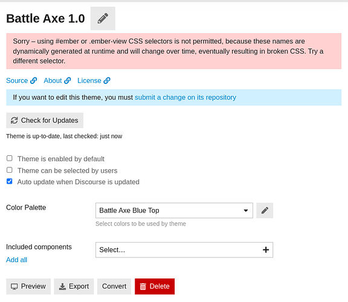](../../../assets/images/37766/45b55d033329333be3f2ab84d392558a4a4ba149.png "image")

Sort of works, but right sidebar seems incorrect and no header color.

[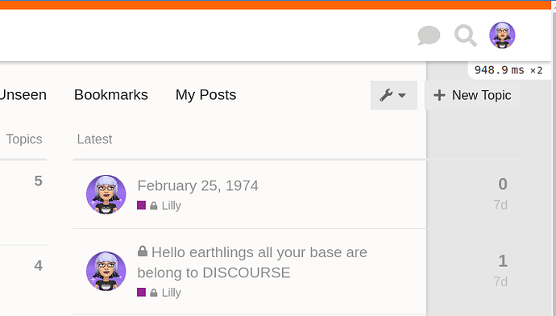](../../../assets/images/37766/eee36e8b8ecb3830d7e72b454639506443747588.png "image")

Also, looks like an old decorateWidget with hamburger-menu code is broken somwhere.

[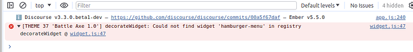](../../../assets/images/37766/b4d54fe6685cf5f91bc013bce8ba85b000275f44.png "image")
  *[PR]: Pull Request

---

### Post #30 by [ljpp](../../users/ljpp.md)
*Posted: 2024-03-06 17:21*

Interesting. I don’t see that on our instance. Are you using the version 2?

 [GitHub](https://github.com/TapparaCo) 

### [Tappara.co](https://github.com/TapparaCo)

Tappara.co - A hockey community. Tappara.co has 9 repositories available. Follow their code on GitHub.
  *[PR]: Pull Request

---

### Post #31 by [Lilly](../../users/Lilly.md)
*Posted: 2024-03-06 17:22*

I am using the link posted here [Battle Axe - A free theme by the Tappara.co hockey community - #3 by ljpp](../../../assets/images/37766/31bca1cd55e7d6267fd96bd0609712fbd047e6a5_2_1035x612.png)
  *[PR]: Pull Request

---

### Post #32 by [ljpp](../../users/ljpp.md)
*Posted: 2024-03-06 21:19*

Then you need to roll back about 7 years of Discourse development as well.

Use the v2, which is up to date and running in our production.
  *[PR]: Pull Request

---

### Post #33 by [Moin](../../users/Moin.md)
*Posted: 2024-03-06 21:28*

Maybe you could add the link to the repository in the first post, similar to the template which is added to all new [theme](/c/theme/61) topics today.  
Then it is less likely people will use the wrong repository because it is the first link they stumble across.
  *[PR]: Pull Request

---

### Post #34 by [Lilly](../../users/Lilly.md)
*Posted: 2024-03-06 21:44*

 ljpp:

> Interesting. I don’t see that on our instance. Are you using the version 2?
> 
> [Tappara.co · GitHub](https://github.com/TapparaCo)

That is a link to the parent repo - so which v2 is it?

[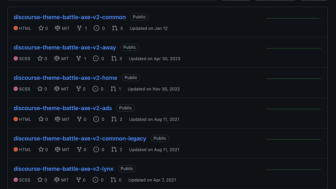](../../../assets/images/37766/dc72231145d3778fafeb6dc6c855e6597f8987ea.png "Screenshot 2024-03-06 at 1.41.43 PM")

Also, it would be helpful to update the OP with the latest link.
  *[PR]: Pull Request

---

### Post #35 by [Ahmed26](../../users/Ahmed26.md)
*Posted: 2024-03-07 07:39*

[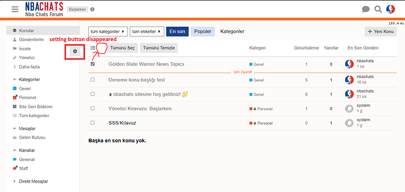](../../../assets/images/37766/461d114143be0fc487f98a86ad7f1a42901e3c45.png "c1")

[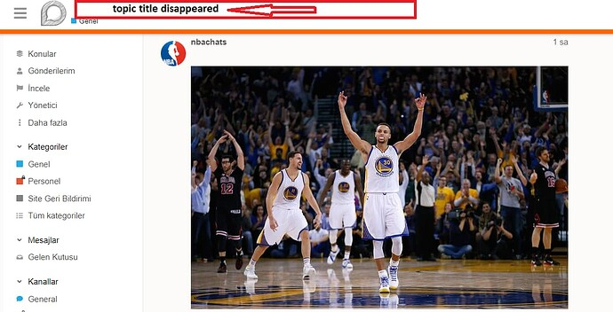](../../../assets/images/37766/425f7976074bcf7bfc4a9dadfecf69d5dec1fe8e.jpeg "c2.PNG")

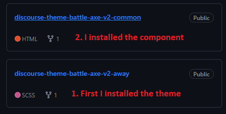

[@ljpp](/u/ljpp) [@Lilly](/u/lilly)
  *[PR]: Pull Request

---

### Post #36 by [ozzi](../../users/ozzi.md)
*Posted: 2024-03-07 17:36*

The theme is divided into multiple repositories:

discourse-theme-battle-axe-v2-common – this is the common parts for both color themes, it’s a **component**  
discourse-theme-battle-axe-v2-away – this is the light **theme** , naming comes from hockey jerseys  
discourse-theme-battle-axe-v2-home – this is the dark **theme**

Rest of the repositories are ads and legacy stuff.

So to install the theme:

  1. Install the common component and make sure it’s a **component** in the customize menu
  2. Install away and home themes and make sure they are **themes** in the customize menu
  3. Open home/away theme and pick the correct color palette
  4. Open home/away theme and include the common component to theme from the dropdown
  5. Make sure you are using the correct theme **and** the color palette and have these enabled for the users

[@Ahmed26](/u/ahmed26) and [@Lilly](/u/lilly), let me know if it still doesn’t work with these steps.
  *[PR]: Pull Request

---

### Post #37 by [Ahmed26](../../users/Ahmed26.md)
*Posted: 2024-03-07 17:50*

How can I change the colors of the theme? It is not allowed in the color settings.
  *[PR]: Pull Request

---

### Post #38 by [ozzi](../../users/ozzi.md)
*Posted: 2024-03-07 18:27*

In the theme settings, the Color Palette dropdown.  

[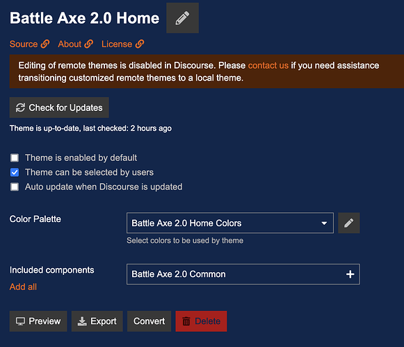](../../../assets/images/37766/a3ec535f9c582072cdfbe78af7e56a690c18f84c.png "image")
  *[PR]: Pull Request

---

### Post #39 by [Ahmed26](../../users/Ahmed26.md)
*Posted: 2024-03-07 19:53*

The colors in this section do not change, how can I change it?

[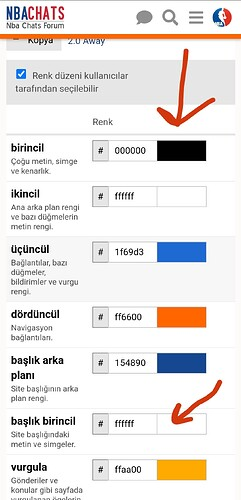](../../../assets/images/37766/ec47aecb11768421bbbf9ac31a243717a3674916.jpeg "Screenshot_2024-03-07-22-52-10-155-edit_com.android.chrome")
  *[PR]: Pull Request

---

### Post #40 by [ozzi](../../users/ozzi.md)
*Posted: 2024-03-07 20:03*

The palettes come hard coded from the repository. You can press the duplicate button (Kopya?) and create a new color palette with your own colors. Then instead of picking the Battle Axe color palette in the theme settings pick your new palette.
  *[PR]: Pull Request

---

### Post #41 by [Ahmed26](../../users/Ahmed26.md)
*Posted: 2024-03-07 20:24*

I couldn’t change the color of the topic name, it remains white, how can I change it to black?

[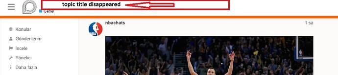](../../../assets/images/37766/ccf1ffe3bb82feb5f12af4264e9f015c01731692.jpeg "IMG_20240307_232141")
  *[PR]: Pull Request

---

### Post #42 by [ozzi](../../users/ozzi.md)
*Posted: 2024-03-07 20:34*

Ah, that’s hard coded white since we use the blue top banner in the light theme. Might be some old hack that’s not even required anymore.

[github.com/TapparaCo/discourse-theme-battle-axe-v2-common](https://github.com/TapparaCo/discourse-theme-battle-axe-v2-common/blob/eafbde4651ce8ab70a75a3c6423e7451d858c31b/common/common.scss#L28)

#### [common/common.scss](https://github.com/TapparaCo/discourse-theme-battle-axe-v2-common/blob/eafbde4651ce8ab70a75a3c6423e7451d858c31b/common/common.scss#L28)

[`eafbde465`](https://github.com/TapparaCo/discourse-theme-battle-axe-v2-common/blob/eafbde4651ce8ab70a75a3c6423e7451d858c31b/common/common.scss#L28)
    
    
          
    
    
              
        18. #list-area {
    
              
        19.   margin-bottom: 20px;
    
              
        20. }
    
              
        21. 
              
        22. // Hide the dangerous Mailing list mode -setting
    
              
        23. .user-preferences .pref-mailing-list-mode {
    
              
        24.   display: none;
    
              
        25. }
    
              
        26. 
              
        27. // Header text/lock from gray to white
    
              
        28. .extra-info-wrapper span {
    
              
        29.   color: #fff;
    
              
        30. }
    
              
        31. 
              
        32. .extra-info-wrapper svg {
    
              
        33.   fill: #fff;
    
              
        34. }
    
          
    
        

You can change it by creating a new component with custom CSS and adding it to the theme. But I would anyways suggest forking the repository to make changes easier. The theme has some ugly hacks and hasn’t really been made customizable. 😕
  *[PR]: Pull Request

---

### Post #43 by [Ahmed26](../../users/Ahmed26.md)
*Posted: 2024-03-07 20:46*

Thank you for your help
  *[PR]: Pull Request

---

### Post #44 by [Ahmed26](../../users/Ahmed26.md)
*Posted: 2024-03-22 19:20*

setting button not visible

what is the problem ?

There is no plugin or css code on my site

[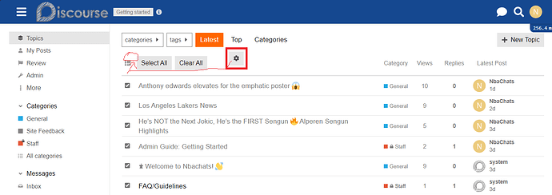](../../../assets/images/37766/0c080b3d5ac91facfee89c548e55026449acf4db.png "bttt")
  *[PR]: Pull Request

---

### Post #45 by [ozzi](../../users/ozzi.md)
*Posted: 2024-03-25 06:49*

Which version of Discourse are you using? Not sure what that button is since it’s not visible in our setup. We only have a wrench-icon for settings next to the “New Topic” button.
  *[PR]: Pull Request

---

### Post #46 by [Moin](../../users/Moin.md)
*Posted: 2024-03-25 07:22*

Are you looking at a topic list like /latest? There should be an option to select topic and as soon as you select one you can choose what you want to do with those topics. See also [Bulk Actions Available to Moderators](https://meta.discourse.org/t/bulk-actions-available-to-moderators/272832)
  *[PR]: Pull Request

---

### Post #47 by [Ahmed26](../../users/Ahmed26.md)
*Posted: 2024-03-25 07:31*

yes that’s what i’m talking about  
The settings button for bulk operations does not appear in the theme
  *[PR]: Pull Request

---

### Post #48 by [ozzi](../../users/ozzi.md)
*Posted: 2024-03-25 07:51*

Ah, got it. Works on mobile so it must be related to our modified desktop topic list. I actually have a hunch about it but need to look into later. Stay tuned.
  *[PR]: Pull Request

---

### Post #49 by [ozzi](../../users/ozzi.md)
*Posted: 2024-03-25 09:56*

Bulk select is now fixed in the latest version of the [discourse-theme-battle-axe-v2-common ](https://github.com/TapparaCo/discourse-theme-battle-axe-v2-common) component.

Ping [@Ahmed26](/u/ahmed26)
  *[PR]: Pull Request

---

### Post #50 by [Ahmed26](../../users/Ahmed26.md)
*Posted: 2024-03-25 13:12*

[@ozzi](/u/ozzi) works well thank you

Where can I change the color of the orange stripe?

  *[PR]: Pull Request

---

### Post #51 by [ozzi](../../users/ozzi.md)
*Posted: 2024-03-25 13:27*

Thats theme specific and mimics a hockey jersey. You can change it in the theme’s common.scss.

[github.com/TapparaCo/discourse-theme-battle-axe-v2-away](https://github.com/TapparaCo/discourse-theme-battle-axe-v2-away/blob/09e59ec6f8207730a0a33b274bbd3db5a8fa90b8/common/common.scss#L2)

#### [common/common.scss](https://github.com/TapparaCo/discourse-theme-battle-axe-v2-away/blob/09e59ec6f8207730a0a33b274bbd3db5a8fa90b8/common/common.scss#L2)

[`09e59ec6f`](https://github.com/TapparaCo/discourse-theme-battle-axe-v2-away/blob/09e59ec6f8207730a0a33b274bbd3db5a8fa90b8/common/common.scss#L2)
    
    
          
    
    
              
        1. .d-header {
    
              
        2.   border-bottom: 8px solid #ff6600;
    
              
        3.   box-shadow: 0 2px 4px 0 rgba(0, 0, 0, 0.25);
    
              
        4. }
    
              
        5. 
              
        6. // Natural white background
    
              
        7. body {
    
              
        8.   background-color: #fdfbf9;
    
              
        9. }
    
              
        10. 
              
        11. // Also set for "now typing" users notification
    
              
        12. .presence-users {
    
          
    
        
  *[PR]: Pull Request

---

### Post #53 by [Ahmed26](../../users/Ahmed26.md)
*Posted: 2024-03-25 14:27*

[@ozzi](/u/ozzi) thanks for everything

I would be happy if you share the developments about the theme here.
  *[PR]: Pull Request

---

### Post #54 by [CAX.DO](../../users/CAX.DO.md)
*Posted: 2025-02-18 09:40*

Hi [@ljpp](/u/ljpp) , I really like your theme.  
By the way, do you have any plans to update it to match the new version of Discourse? thank your effort
  *[PR]: Pull Request

---

### Post #55 by [ljpp](../../users/ljpp.md)
*Posted: 2025-02-18 10:36*

We are running it in production, thus it is up to date ([tappara.co](http://tappara.co)). [@ozzi](/u/ozzi) is the primary designer and repo-man – can you comment on the status?
  *[PR]: Pull Request

---

### Post #56 by [CAX.DO](../../users/CAX.DO.md)
*Posted: 2025-02-28 09:58*

Thank your reply. I encountered this notice while using this component, so I wanted to ask if it’s necessary to update the component, as I don’t know how to program. 😅

> **[Admin Notice]** One of your themes or plugins needs updating for compatibility with upcoming Discourse core changes. (id:[_discourse.hbr-topic-list-overrides_](https://meta.discourse.org/t/343404)) Identified theme: [‘Battle Axe 2.0 Common’](https://www.cax.do/admin/customize/themes/29?safe_mode=no_themes).

I’m using this one: [discourse-theme-battle-axe-v2-common](https://github.com/TapparaCo/discourse-theme-battle-axe-v2-common)
  *[PR]: Pull Request

---

← Previous | **Page 1 of 2** | [Next →](37766-page-2.md)
