[🏠 Home](../../index.md) | [📋 Latest](../../latest/index.md) | [🔥 Top](../../top/replies/index.md) | [👥 Users](../../users/index.md)

[Home](../../index.md) » [Theme](../../c/theme/index.md) » Blackout - A Theme For OLED Displays

---

# Blackout - A Theme For OLED Displays

> **Category:** Theme
> **Author:** darkpixlz
> **Created:** 2022-08-03 19:42

---

### Post #1 by [darkpixlz](../../users/darkpixlz.md)
*Posted: 2022-08-03 19:42*

Blackout is a theme that’s completely black.  
It looks the best on OLED Monitors which have True Black.

I recommend using a dark color pallet. It will work with light ones, but there will be some bugs.  
WARNING: This theme completely overrides all color pallets.

This theme is mostly made for OLED devices and phones and may not look right on display technologies which use backlights.

[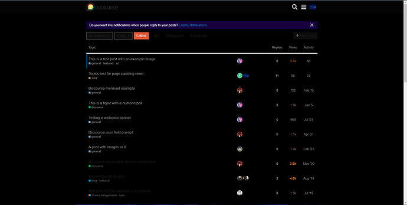](../../../assets/images/235047/6d927a360e76e52b3ebb1fb6b47959ea522c7284.png "image")

  

[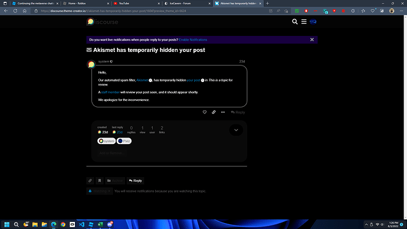](../../../assets/images/235047/a926ea6fb97e6da3f57cd25f9a2951c9dcd2f281.png "image")

  

[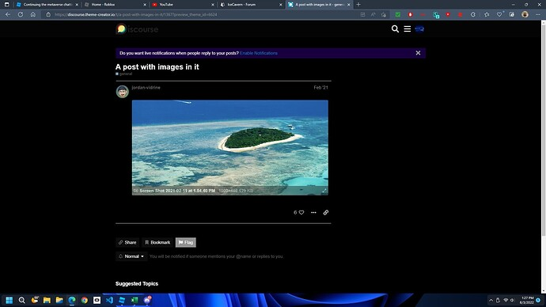](../../../assets/images/235047/792cde1894f871991561f4583b2fd7d766656aa3.jpeg "image")

  

[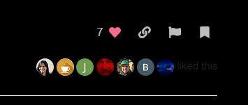](../../../assets/images/235047/17cd159884f6cb2ef6848fdcaf49f581eaed66ea.png "image")

  

[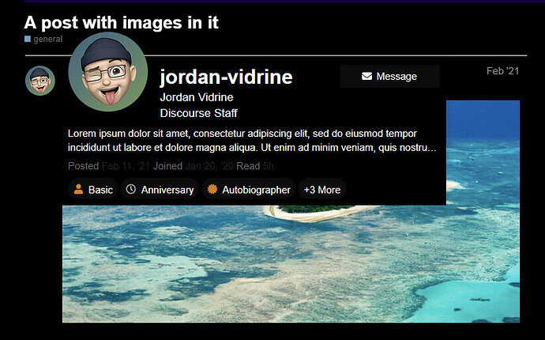](../../../assets/images/235047/9fdc5b0ea7b3ace6eadb0a60eb12dce149721f97.jpeg "image")

  

[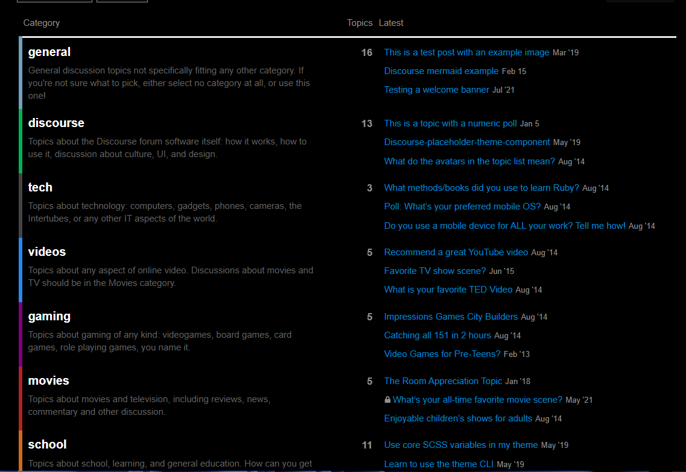](../../../assets/images/235047/bc3bb29ce34bb41480b6eac550bb7c8a36fac3ec.png "image")

  

[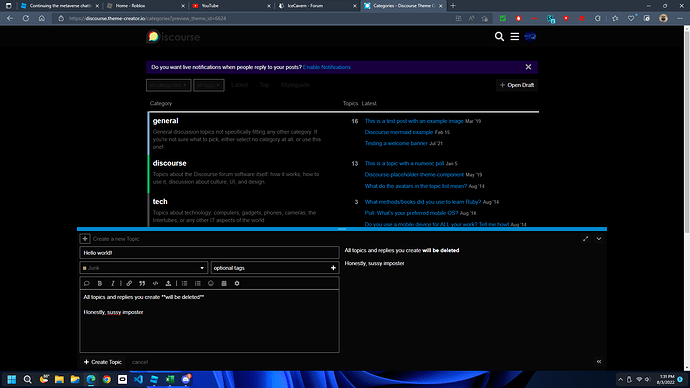](../../../assets/images/235047/7d1ddaf84da53fd6a4126fa07124f7fcf6aee2ac.png "image")

  

[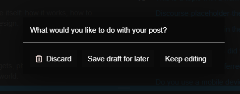](../../../assets/images/235047/e687c29220e3fc4636a6d3167b57b1ad96e50268.png "image")

  

[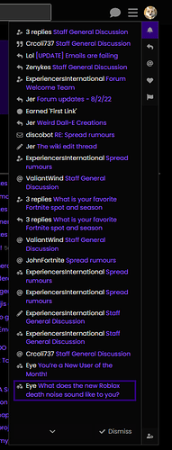](../../../assets/images/235047/f766e8e96b30fcc9451667fae2cc50c5d1ee1b13.png "image")

  

[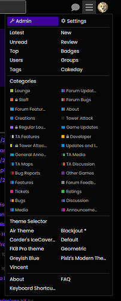](../../../assets/images/235047/381db02491c0c1e97ce035c376ca95943d2e39df.png "image")

  

[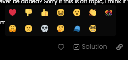](../../../assets/images/235047/ef20734eda94f61cba2405d9d97c087e07ffba4e.png "image")

  

[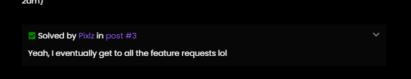](../../../assets/images/235047/ce72344783654e35269e3842dc2bab037ef86e98.png "image")

  

[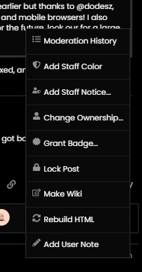](../../../assets/images/235047/08fbd618f38bb04d07dab560cf90e8a61f4fc807.png "image")

  

[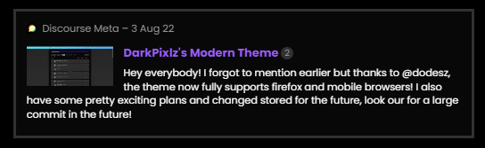](../../../assets/images/235047/19fbde51f96e24f6d3b5f9f35321b17aaad2b5c1.png "image")

|  |   
---|---|---  
👓 | **Preview** | <https://discourse.theme-creator.io/theme/darkpixlz/Blackout>  
🛠️ | **Repository** | [GitHub - pyxfluff/Blackout](https://github.com/pyxfluff/Blackout)  
❓ | **Install Guide** | [How to install a theme or theme component](https://meta.discourse.org/t/how-do-i-install-a-theme-or-theme-component/63682)  
📖 | **New to Discourse Themes?** | [Beginner’s guide to using Discourse Themes](https://meta.discourse.org/t/beginners-guide-to-using-discourse-themes/91966)

---

### Post #2 by [darkpixlz](../../users/darkpixlz.md)
*Posted: 2022-10-17 19:56*

Added Sidebar support after a little bit.  
  
[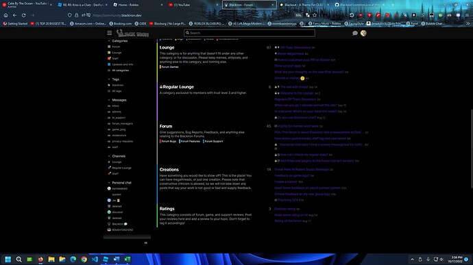](../../../assets/images/235047/277de9905cd55e80b4bca634e550a4b2fc947e06.jpeg "image")

---

### Post #3 by [Ventrilo](../../users/Ventrilo.md)
*Posted: 2024-01-08 14:16*

[@darkpixlz](/u/darkpixlz) how to make the user settings like this:

---

### Post #4 by [darkpixlz](../../users/darkpixlz.md)
*Posted: 2024-01-08 14:18*

That’s an old screenshot. It’s what the sidebar user menu looked like, and I don’t think it looks like that anymore.

---

### Post #5 by [Ventrilo](../../users/Ventrilo.md)
*Posted: 2024-01-08 14:20*

Is there no way to have that type of user menu/side bar back? I notice another discourse community does:

<https://community.wemod.com> \- it looks like they are using a modified version of your theme

[@darkpixlz](/u/darkpixlz)

---

### Post #6 by [darkpixlz](../../users/darkpixlz.md)
*Posted: 2024-01-08 14:21*

That isn’t my theme - this one was quite lazy, that one has nicer colors and acrylic blur.

---

### Post #7 by [Ventrilo](../../users/Ventrilo.md)
*Posted: 2024-01-08 14:22*

Could you make something like that for paid work? [@darkpixlz](/u/darkpixlz)

---

### Post #8 by [darkpixlz](../../users/darkpixlz.md)
*Posted: 2024-01-08 14:22*

I have an incredibly similar theme which would look the same if you tweaked the colors around.

[DarkPixlz's Modern Theme](https://meta.discourse.org/t/darkpixlzs-modern-theme/232543) [Theme](/c/theme/61)

> This is an old theme! If you are using this theme or are interested in it please use [Pyx's Modern Theme](https://meta.discourse.org/t/pyxs-modern-theme-preview/357665) instead. No updates are being made to this theme. darkpixlz’s Modern Theme This is a theme with rounded corners, a lot of blur, a consistent look, and it’s very custom to fit with your forum. !!WARNING: Some screenshots may be out of date, if they are, then this post is a wiki, feel free to edit! This theme is made for dark schemes. It supports light ones, but some things may be broken. …

---

### Post #9 by [Ventrilo](../../users/Ventrilo.md)
*Posted: 2024-01-08 14:23*

When I try importing this one, and use the default options the theme appears broken

---

### Post #10 by [darkpixlz](../../users/darkpixlz.md)
*Posted: 2024-01-08 14:24*

Share a screenshot on that thread and I may be able to investigate

---
