[🏠 Home](../../index.md) | [📋 Latest](../../latest/index.md) | [🔥 Top](../../top/replies/index.md) | [👥 Users](../../users/index.md)

[Home](../../index.md) » [Theme](../../c/theme/index.md) » Canvas Theme Template

---

# Canvas Theme Template

> **Category:** Theme
> **Author:** manuel
> **Created:** 2025-02-17 16:13

---

### Post #1 by [manuel](../../users/manuel.md)
*Posted: 2025-02-17 16:13*

[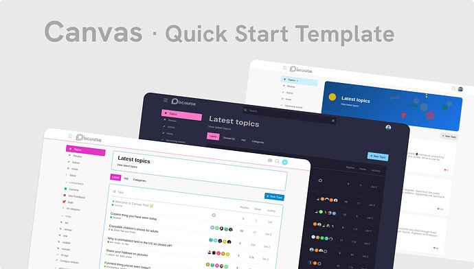](../../../assets/images/352730/45b08ea29f653c6ce281ff679f13252b6283206b.jpeg "Cover image showing screenshots of three themes built with the Canvas theme template")

|  |   
---|---|---  
ℹ️ | **Summary** | Quick start your theme design with a prepared theme template.  
👥 | **Audience** | New developers that want to get started building themes for Discourse. Experienced developers that want to use a ready-made template.  
🛠️ | **Repository** | [Manuel Kostka / Discourse / Canvas / Canvas Theme Template · GitLab](https://gitlab.com/manuelkostka/discourse/canvas/theme)  
👀 | **Preview** | [Canvas Themes](https://canvas.kostka.studio)  
  
Canvas provides a flexible template that allows you to create custom themes with less coding. Easily adjust properties and configuration values to tailor a theme to your needs.

## Example views

* * *

The base template retains default values and remains neutral in design.

[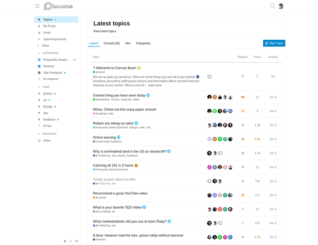](../../../assets/images/352730/26027cf293679e15da6ec661cf124c7dd6896d35.png "Canvas Theme Template - Light scheme")

  

[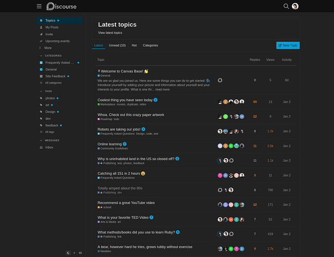](../../../assets/images/352730/5a6a05457d110b529b019877f8f964726a446f4c.png "Canvas Theme Template - Dark scheme")

Minimal adjustments that modify a few custom properties and define a highlight color:

[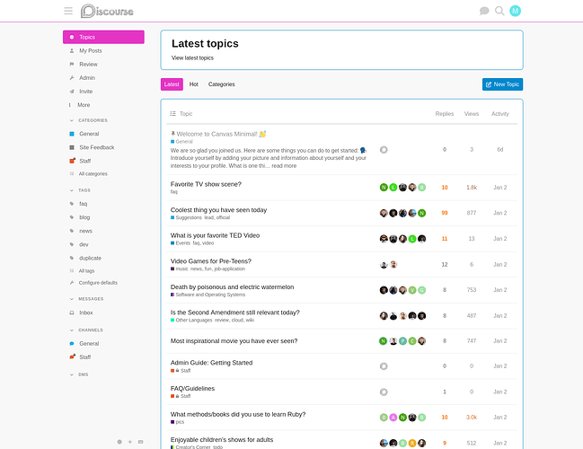](../../../assets/images/352730/c3b676d3eb4f9f1f3c6b5c2018c9159549c3d63e.png "Canvas Minimal theme - Light scheme")

  

[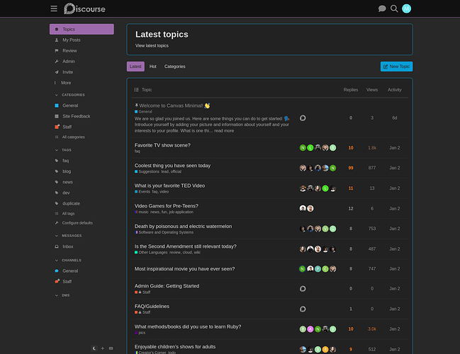](../../../assets/images/352730/a651a4c0f11a67391cb49275d952544a2ffd5927.png "Canvas Minimal theme - Dark scheme")

A design that integrates the Topic Cards component and custom styles for banners:

[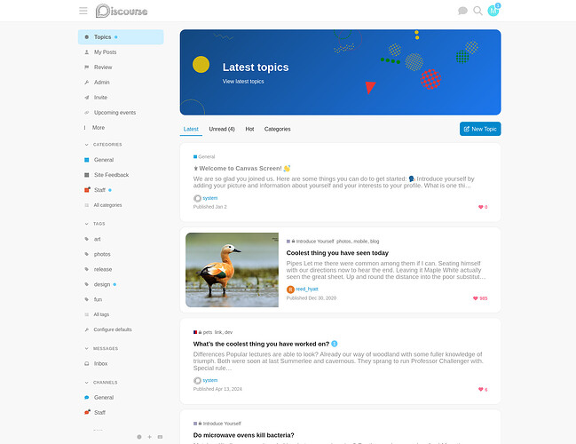](../../../assets/images/352730/61cc16196057e02c053fcf8a2897aaee166587be.jpeg "Canvas Screen theme - Light scheme")

  

[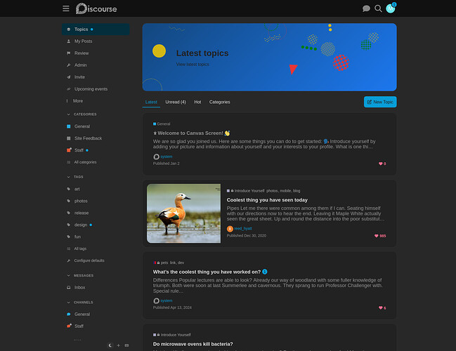](../../../assets/images/352730/6b9e3e36a1bd97e98446ed20b6a4d0fb317dacc7.jpeg "Canvas Screen theme - Dark scheme")

An elaborate theme that includes a custom font and unique color schemes:

[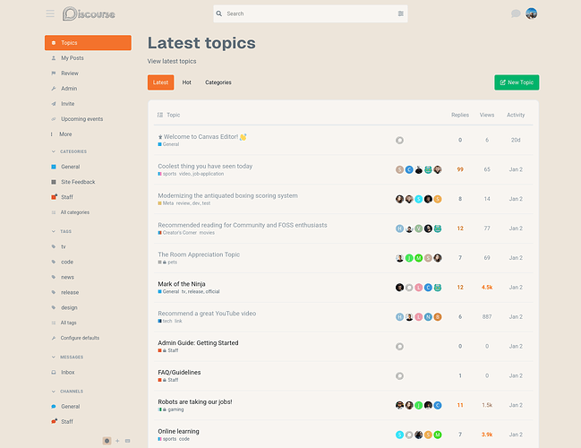](../../../assets/images/352730/19d355d9ed4831c351db4c4b48ccfab0a7950683.png "Canvas Editor theme - Light scheme")

  

[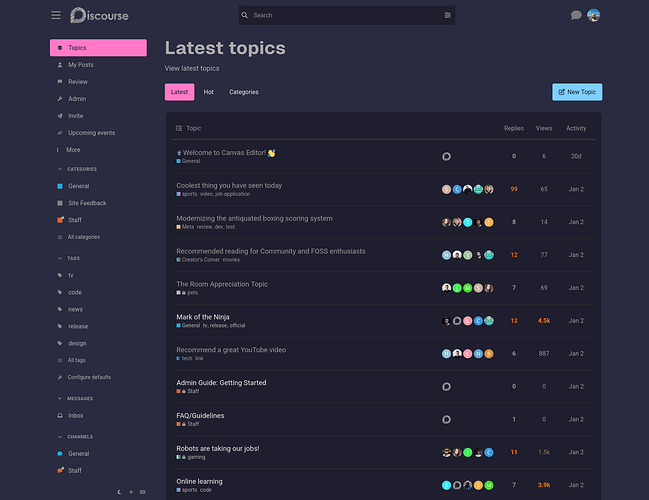](../../../assets/images/352730/ec36d01c88f52eafbd3d1a861e847413f6ac758d.png "Canvas Editor theme - Dark scheme")

A play on the former Central theme:

[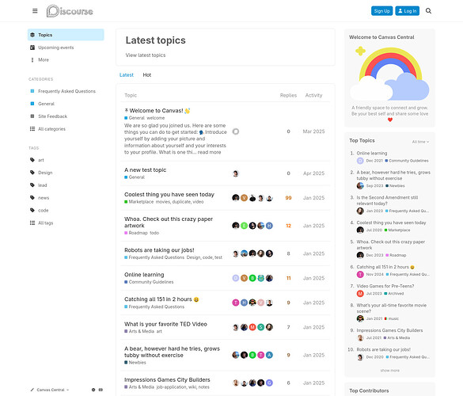](../../../assets/images/352730/a979ba2864b7daa46a8a937aa7494c86ca6fcd43.jpeg "image")

  

[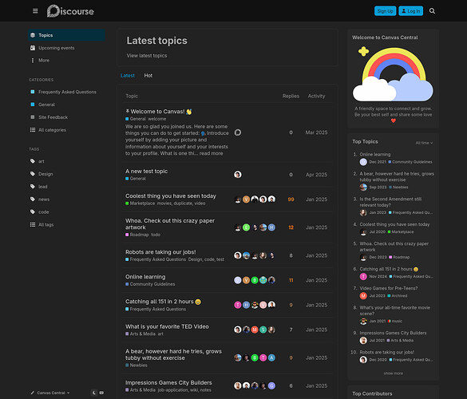](../../../assets/images/352730/d7ffa446bb66c6f7155381ad9bfb7b4c18805929.jpeg "image")

## Usage

* * *

  1. [Clone the Theme Template](https://gitlab.com/manuelkostka/discourse/canvas/theme).

  2. Synchronize the theme with your Discourse instance using the [discourse_theme gem](https://meta.discourse.org/t/install-the-discourse-theme-cli-console-app-to-help-you-build-themes/82950).

  3. Go to the admin backend and manually adjust these theme component settings:  
**Category Banners**  
Plugin outlet → _above-main-container_  
**Tag Banners**  
Show below site header → _uncheck_  
Show above main container → _check_

  4. Edit `scss/properties.scss` to define values for custom properties

[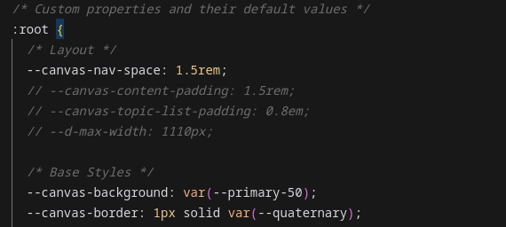](../../../assets/images/352730/2b221658fb13d6293de4915c7c5bd993e332bbbc.png "Screenshot From 2025-02-11 12-27-15")

  5. Edit `about.json` to add assets, color schemes and more theme components

## A closer look at the setup

* * *

The _Canvas Theme_ template only extends the default theme skeleton with bundling a few theme components and adding some ready-made style files. The actual features are handled by a separate theme component _Canvas Settings_. This component serves two functions:

  * It assigns custom properties that can be used with the template. A table listing all properties can be found in the template’s [Readme file](https://gitlab.com/manuelkostka/discourse/canvas/theme/-/blob/main/README.md).

[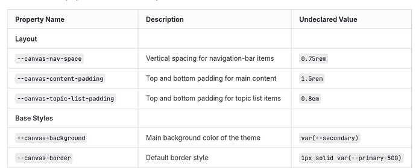](../../../assets/images/352730/2a3fba8c99201303c353ff3639ff7970d9c5f722.png "The image contains a table with CSS properties and their corresponding descriptions and undeclared values for a theme component. \(Captioned by AI\)")

  * It declares default styles, along with a few optional styles that can be adjusted in the theme component settings.

[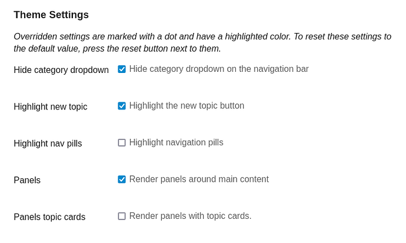](../../../assets/images/352730/1071819eb09bb532ba18c044f205b94e0b1468ae.png "The image shows a theme settings menu for highlighting various elements in an interface, including hiding the category dropdown, highlighting the new topic button, and rendering panels around main content. \(Captioned by AI\)")

This split setup allows you to create a theme using the Canvas template, while still benefiting from ongoing fixes and updates provided through the component.

## Example themes

* * *

You can preview shared example themes at <https://canvas.kostka.studio>. There’s a theme toggle at the bottom of the sidebar to change theme.

Review code of the shared example views or install them as your starter theme from these repositories:

  * [Minimal theme example](https://gitlab.com/manuelkostka/discourse/canvas/theme-minimal)
  * [Screen theme example](https://gitlab.com/manuelkostka/discourse/canvas/theme-screen)
  * [Editor theme example](https://gitlab.com/manuelkostka/discourse/canvas/theme-editor)
  * [Central theme example](https://gitlab.com/manuelkostka/discourse/canvas/theme-central)

* * *

>  A huge thank you to Discourse for sponsoring the development of this project!

---

### Post #2 by [jrgong](../../users/jrgong.md)
*Posted: 2025-02-18 13:13*

 Manuel Kostka:

> It declares default styles, along with a few optional styles that can be adjusted in the theme component settings.

Those theme settings don’t show up when I tried to install the example themes. Is that expected behavior?

---

### Post #3 by [manuel](../../users/manuel.md)
*Posted: 2025-02-18 13:23*

The settings are on the theme component installed as _Canvas Settings_. It’s maybe a bit misleading that settings are always named **Theme Settings** on the ui, also on theme components.

---

### Post #4 by [jrgong](../../users/jrgong.md)
*Posted: 2025-02-18 13:25*

Found them in **Canvas Settings** component, thx!

---

### Post #5 by [pmusaraj](../../users/pmusaraj.md)
*Posted: 2025-02-20 19:54*

Thanks so much for working on this [@manuel](/u/manuel).

I took the Editor version for a spin locally, it mostly works very well, but I noticed some small issues.

* * *

On a default install, without changing any settings, the tag label in the Extra Banners component shows up in the wrong place:

[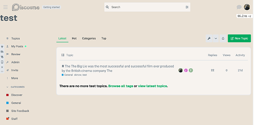](../../../assets/images/352730/346e19a5b4ba46ec4d7db3c82ff933fbe7b175d6.png "CleanShot 2025-02-20 at 14.43.36@2x")

The category banner is also shown in the same place, above the sidebar. Latest topics, Hot topics are correctly shown in the main column.

* * *

I’m guessing it’s not a goal of the theme to fully cover the admin UI, however, the light and dark Editor color palettes have the admin sidebar looking quite different. I am curious if it is possible to harmonize with the non-admin sidebar.

[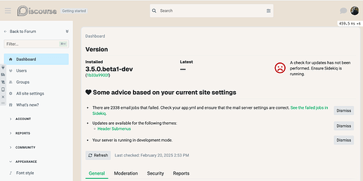](../../../assets/images/352730/cf6851268f382d0f319419b975a2bc8dc6931706.png "CleanShot 2025-02-20 at 14.54.04@2x")

---

### Post #6 by [manuel](../../users/manuel.md)
*Posted: 2025-02-20 22:24*

The theme is meant to show banners next to the sidebar, using the `above-main-container` outlet. The Extra-Banners component uses that outlet by default, but the two components for Category and Tag banners are by default rendered below the header. I wouldn’t want to fork these components, just to set a different default outlet… That’s why I put these instructions:

 Manuel Kostka:

>   3. Go to the admin backend and manually adjust these theme component settings:  
>  **Category Banners**  
>  Plugin outlet → _above-main-container_  
>  **Tag Banners**  
>  Show below site header → _uncheck_  
>  Show above main container → _check_
> 

But if that’s easy to miss, maybe there’s a better way to put it? 

 Penar Musaraj:

> I am curious if it is possible to harmonize with the non-admin sidebar.

Yeah, that’s easy enough and seems a good approach for this theme. I just added a commit!

---

### Post #7 by [pmusaraj](../../users/pmusaraj.md)
*Posted: 2025-02-20 22:29*

Ah yes, I see how we got here. We don’t necessarily want to change the defaults in the category/tag banners components, don’t want to fork them either. Tricky to fix, let’s leave it as is for now and see if others run into the same issue.

Admin sidebar change looks good already, thanks!

---

### Post #8 by [mk0r](../../users/mk0r.md)
*Posted: 2025-02-23 17:36*

Could these instructions be elaborated a bit? Is it not possible to just install from the admin UI? Thx 

 Manuel Kostka:

>   * [Clone the Theme Template](https://gitlab.com/manuelkostka/discourse/canvas/theme).
>   * Synchronize the theme with your Discourse instance using the [discourse_theme gem](https://meta.discourse.org/t/install-the-discourse-theme-cli-console-app-to-help-you-build-themes/82950)
> 

EDIT: I installed via the admin UI and it seems to be working except there doesn’t seem to be anywhere to edit scss now

EDIT: nevermind, I see that is probably expected and you’re showing to edit the theme files directly. I wonder if it could be on the roadmap for this to happen via the admin ui? Like, have a variables editor same as you have a settings editor

---

### Post #9 by [manuel](../../users/manuel.md)
*Posted: 2025-02-23 21:10*

I don’t know what’s on the core roadmap, but one thing you could do right now is create a new theme component right on the admin UI:

[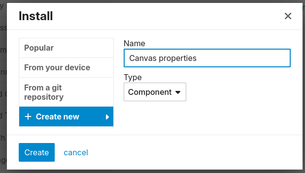](../../../assets/images/352730/5e1d4855462ec590e5e7e7e982c076e59192e6cb.png "Screenshot From 2025-02-23 21-08-41")

And then declare custom properties on it’s CSS file. You could either look up properties on the [Readme file](https://gitlab.com/manuelkostka/discourse/canvas/theme/-/blob/main/README.md). Or copy the contents of [properties.scss](https://gitlab.com/manuelkostka/discourse/canvas/theme/-/blob/main/scss/properties.scss) from the theme repo.

---

### Post #10 by [Heliosurge](../../users/Heliosurge.md)
*Posted: 2025-03-04 03:33*

How do I clone this to Gihub? Still a bit on the green side 😉

---

### Post #11 by [manuel](../../users/manuel.md)
*Posted: 2025-03-04 09:35*

You could import it through the UI:

[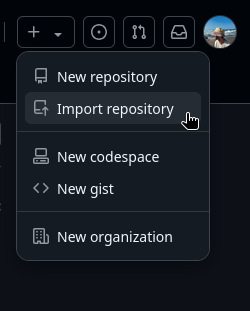](../../../assets/images/352730/de67b06879965171322e4b0c4070a500dfd55fcb.png "image")

However, if you want to be able to sync changes, I believe you’d need to pull to a local clone and then push from it. Something like this:

  1. Clone from GitLab

    
    
    git clone "https://gitlab.com/manuelkostka/discourse/canvas/theme.git"
    

  2. Set push URL to your GitHub repo

    
    
    git remote set-url --push origin "git@github.com:Username/Reponame.git"
    

  3. Then you can periodically fetch from GitLab and push to GitHub

    
    
    git fetch -p origin
    git push origin

---

### Post #12 by [Heliosurge](../../users/Heliosurge.md)
*Posted: 2025-03-04 10:00*

I don’t see a plus on mobile on GitHub. May need to try the command lines when Home.

All I see in GitHub on dashboard is option to create a new repo but no claim ne option. I am on free account so not sure if that might have something to do with it.

---

### Post #13 by [manuel](../../users/manuel.md)
*Posted: 2025-03-10 19:57*

 mk0r:

> I wonder if it could be on the roadmap for this to happen via the admin ui? Like, have a variables editor same as you have a settings editor

I added a component that lets you define a few style variables and layout options right on the component ui:

[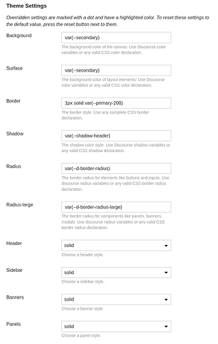](../../../assets/images/352730/090e8db9c9a2d206d0ab82d178718ba887fb9c05.png "Screenshot From 2025-03-10 19-55-02")

It’s limited compared to declaring custom variables on the stylesheet. But it lets you tinker with a few different looks. Curious to hear if that works! 👀

 [GitLab](https://gitlab.com/manuelkostka/discourse/canvas/canvas-styles) 

### [Manuel Kostka / Discourse / Canvas / Canvas Styles Component · GitLab](https://gitlab.com/manuelkostka/discourse/canvas/canvas-styles)

GitLab.com

---

### Post #14 by [Aurora](../../users/Aurora.md)
*Posted: 2025-04-14 13:08*

 Manuel Kostka:

> Screen theme example

I’m playing with it right now and I think it’s nice! Is there a way to reduce the line spacing of the menu - to make it more compact?

Also, I can’t scroll the solid sidebar, is this by mistake?

[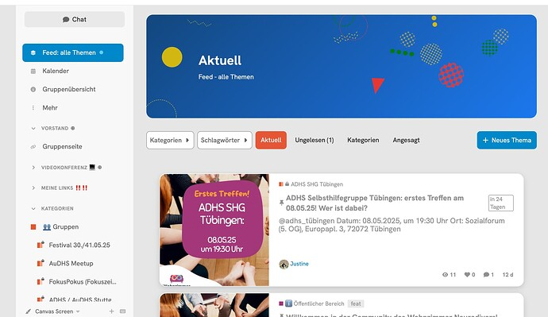](../../../assets/images/352730/cffe9b5f38875905fed4ab21596e4c5c5bc7dda1.jpeg "This image displays a Mac interface for a group chat discussing upcoming meetings, with "Erstes Treffen am 08.05.25" highlighted and a calendar on the left side. \(Beschriftet durch KI\)")

---

### Post #16 by [manuel](../../users/manuel.md)
*Posted: 2025-04-14 14:24*

 Aurora:

> Also, I can’t scroll the solid sidebar, is this by mistake?

I just adjusted the CSS styles for the solid sidebar, scrolling should work again!

However, the solid sidebar is just one of the options on the Styles component I mentioned on the post above. If you want to adjust more styles (like spacing the sidebar menu), you’d need to follow the approach explained above in [Usage](https://meta.discourse.org/t/canvas-theme-template/352730#p-1712673-usage-2) and [ A closer look at the Setup](https://meta.discourse.org/t/canvas-theme-template/352730#p-1712673-a-closer-look-at-the-setup-3): Use your own stylesheet with CSS custom properties – in this case that would be `-d-sidebar-row-height`.

---

### Post #17 by [manuel](../../users/manuel.md)
*Posted: 2025-05-27 17:16*

 [GitLab](https://gitlab.com/manuelkostka/discourse/canvas/theme-central) 

### [Manuel Kostka / Discourse / Canvas / Central Theme · GitLab](https://gitlab.com/manuelkostka/discourse/canvas/theme-central)

GitLab.com

I’ve put together a new example theme based on this template. As the name suggests, this one’s a tribute to the original Central theme!  

I loved the layout and visual style of Central and I’ve been packaging some of its features into standalone components, like the [Custom User Menu](https://meta.discourse.org/t/custom-user-menu/367398) and several sidebar blocks.

I realized that with the sidebar and some styles, this template actually gets you a good way towards the original theme’s look and feel.

[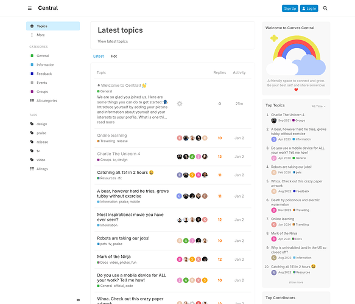](../../../assets/images/352730/22f1e7bd37c0bbebd3c2ea3f23cd14324c250172.png "Screenshot 2025-05-27 at 17-54-17 Central")

  

[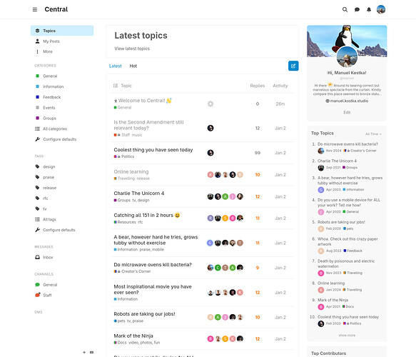](../../../assets/images/352730/0f73bb5a5379432e1591e223b0bfa576f33dd3a8.jpeg "Screenshot 2025-05-27 at 17-55-03 Central")

In any case, I’m not planning to fully re-build the Central theme.. but I might still experiment with a dedicated topic list style down the road. If you’re curious and want to take a look, the theme is also live here, select it using the sidebar theme toggle: <https://canvas.kostka.studio>

---

### Post #18 by [Heliosurge](../../users/Heliosurge.md)
*Posted: 2025-05-27 21:36*

Very nice. Thanks for sharing.

---

### Post #19 by [kevin001](../../users/kevin001.md)
*Posted: 2025-05-29 14:32*

Thanks for sharing this template! The flexibility with components and the clean design make it really easy to customize. Looking forward to trying it out on my own instance.

---

### Post #20 by [Heliosurge](../../users/Heliosurge.md)
*Posted: 2025-05-30 03:04*

Welcome to Discourse  !

---

### Post #21 by [Canapin](../../users/Canapin.md)
*Posted: 2026-02-23 23:04*

With the Foundation update being the new default in the near future, will Canvas theme template be updated to use the same “foundations” (eh), or will it keep the same style it has now, very close to the current (soon old) Foundation theme?

---

### Post #22 by [manuel](../../users/manuel.md)
*Posted: 2026-02-25 11:13*

I’ll need to go through the declarations once Foundation updates are the default. Some will be obsolete then, like _New Topic_ as primary button. But in general, it’s not a very opinionated theme regarding base styles, it rather follows the default look of Foundation.

---
