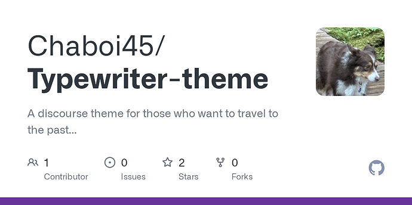
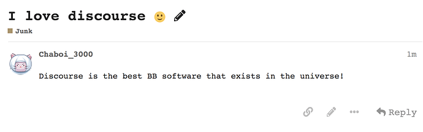
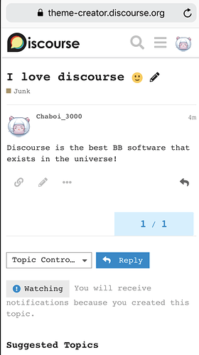

[🏠 Home](../../index.md) | [📋 Latest](../../latest/index.md) | [🔥 Top](../../top/replies/index.md) | [👥 Users](../../users/index.md)

[Home](../../index.md) » [Theme](../../c/theme/index.md) » Chaboi_3000's Typewriter Theme

---

# Chaboi_3000's Typewriter Theme

> **Category:** Theme
> **Author:** Chaboi_3000
> **Created:** 2019-05-06 10:25

---

### Post #1 by [Chaboi_3000](../../users/Chaboi_3000.md)
*Posted: 2019-05-06 10:25*

I’ve always wanted a nice simple theme and wanted it **fast**. This is why I made this “theme”. First, it was going to be named “Chaboi_3000’s simple theme”, but I renamed it “Typewriter”. It just reminds me of it.  
Theme creator preview:

 [Theme Creator](https://discourse.theme-creator.io/theme/Chaboi_3000/typewriter) 

### ['Typewriter Theme' by @Chaboi_3000](https://discourse.theme-creator.io/theme/Chaboi_3000/typewriter)

A customization for Discourse shared on Discourse Theme Creator

Github:

[github.com](https://github.com/Chaboi45/Typewriter-theme)

### [GitHub - Chaboi45/Typewriter-theme: A discourse theme for those who want to travel to...](https://github.com/Chaboi45/Typewriter-theme)

A discourse theme for those who want to travel to the past...

Desktop View:  

  
Mobile View:  

  
If you are interested in downloading my theme, go to:  
`Admin`>`Customize`>`Themes`, then select web, and paste the following URL: `https://github.com/Chaboi45/Typewriter-theme`, and click `Import`.

* * *

Note: This is a **theme** , not a theme component!

---

### Post #2 by [codinghorror](../../users/codinghorror.md)
*Posted: 2019-05-06 12:20*

So it just… changes the font? 

---

### Post #3 by [Chaboi_3000](../../users/Chaboi_3000.md)
*Posted: 2019-05-06 21:41*

I’ll probably add more soon… It was meant to be a “make-a-theme-within-a-few-minutes” theme.

---

### Post #4 by [Stephen](../../users/Stephen.md)
*Posted: 2019-05-06 22:27*

There’s no harm in holding off on sharing things until you’ve implemented whatever changes you had planned.

---
