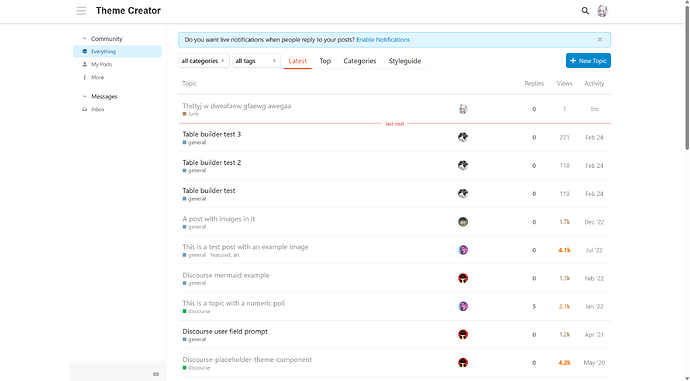
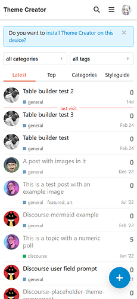
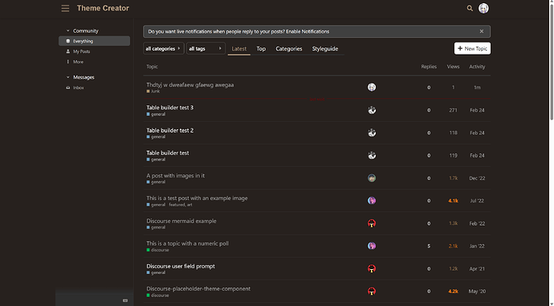

[🏠 Home](../../index.md) | [📋 Latest](../../latest/index.md) | [🔥 Top](../../top/replies/index.md) | [👥 Users](../../users/index.md)

[Home](../../index.md) » [Theme](../../c/theme/index.md) » Clean, A clean style discourse theme

---

# Clean, A clean style discourse theme

> **Category:** Theme
> **Author:** Lhc_fl
> **Created:** 2023-04-26 11:31

---

### Post #1 by [Lhc_fl](../../users/Lhc_fl.md)
*Posted: 2023-04-26 11:31*

|  |   
---|---|---  
ℹ️ | **Summary** | Clean, A clean style discourse theme  
👓 | **Preview** | [Theme Creator](https://discourse.theme-creator.io/theme/Lhc_fl/theme-clean)  
🛠️ | **Repository** | [Lhcfl/discourse-theme-clean: A clean theme for discourse (github.com)](https://github.com/Lhcfl/discourse-theme-clean)  
❓ | **Install Guide** | [How to install a theme or theme component](https://meta.discourse.org/t/how-do-i-install-a-theme-or-theme-component/63682)  
📖 | **New to Discourse Themes?** | [Beginner’s guide to using Discourse Themes](https://meta.discourse.org/t/beginners-guide-to-using-discourse-themes/91966)  
  
Clean is a clean style discourse theme. It doesn’t make massive changes to discourse’s default theme, so it should be compatible with most widgets.

The design concept of Clean comes from [Ant-Design](https://ant.design/). When designing the theme, I almost deleted all the parts with gray, so that the whole theme looks bright and clean.

  

---

### Post #7 by [Canapin](../../users/Canapin.md)
*Posted: 2023-04-26 13:45*

Great theme, very… Clean, as it should be 😄 👍

I especially like the non-grey sidebar. It’s the same as in the Minima theme from Kris: [Theme Creator](https://theme-creator.discourse.org/theme/awesomerobot/minima)

---

### Post #8 by [Lilly](../../users/Lilly.md)
*Posted: 2023-05-12 16:21*

very nice. love the minimalist look 👍

---

### Post #10 by [Noah](../../users/Noah.md)
*Posted: 2024-02-03 22:44*

Improve strange rounding on notifications:

[Remove strange rounding by Noah-Haf · Pull Request #1 · Lhcfl/discourse-theme-clean (github.com)](../../../assets/images/262946/1bda79e3003f66559b7c3003c510bdd3f335702d_2_230x500.png)

---

### Post #11 by [Lhc_fl](../../users/Lhc_fl.md)
*Posted: 2024-08-02 17:42*

Played a little trick on the mobile user page - now I am a little curious whether I should turn this design into a theme component. 

---

### Post #12 by [14569](../../users/14569.md)
*Posted: 2024-10-22 16:09*

I like this kind of rounded corner design.

---
