[🏠 Home](../../index.md) | [📋 Latest](../../latest/index.md) | [🔥 Top](../../top/replies/index.md) | [👥 Users](../../users/index.md)

[Home](../../index.md) » [Theme](../../c/theme/index.md) » Daemonite Material Theme

---

# Daemonite Material Theme (Page 2 of 2)

> **Category:** Theme
> **Author:** Johani
> **Created:** 2017-06-15 03:30

[← Previous](64521.md) | **Page 2 of 2** | Next →

---

### Post #59 by [Johani](../../users/Johani.md)
*Posted: 2019-01-13 13:33*

3 posts were merged into an existing topic: [Daemonite Material Theme: Ample layout adjustments](/t/daemonite-material-theme-ample-layout-adjustments/106379/8)
  *[PR]: Pull Request

---

### Post #60 by [LittleLebowsky](../../users/LittleLebowsky.md)
*Posted: 2019-01-13 14:00*

Hello.

I’ve registered at your forums to see if the padding of hamburger menu items stays intact (it does not at my own installation, most propably because the strings being in polish language, which are usualy longer than the english ones… This results in having a scrollbar with just a few items in my H menu, so it looks ugly. Same situation for user dropdown menu)  

[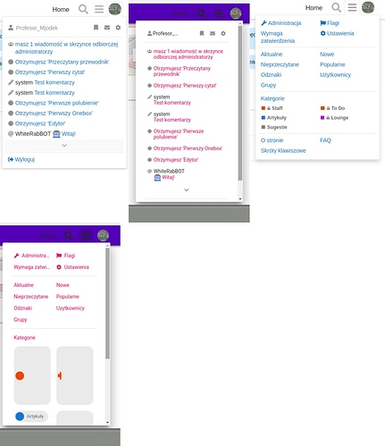](../../../assets/images/64521/fc42736151beba4cf599753fb3e7ccad3f67199d.jpeg "materialcollage")

Anyway, I went to <https://meta.ip-tools.org> and registered, and you seem to have some bugs on the account activation page (the one you land at after clicking activation link from an email)

I’m using Chromium 71.0.3578.98 and your site autodetected and autoset the language to polish. This is an actual screenshot:

[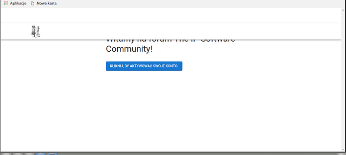](../../../assets/images/64521/4596d52f8bbf41b6ceb4859f9191408aeb3b62a1.png "ip%20tools%20register%20bug")

As you can see there is some white space above the navigation bar, which results in the overlapping. It still works, but I bet you don’t want it to act like this. Must be the yellow menu component missing. 🙂
  *[PR]: Pull Request

---

### Post #61 by [amotl](../../users/amotl.md)
*Posted: 2019-01-13 14:05*

 LittleLebowsky:

> and you seem to have some bugs on the account activation page

 LittleLebowsky:

> Must be the yellow menu component missing.

Haven’t tried that workflow yet, thanks a bunch!

* * *

The other things regarding scrollbars would then be addressed to [@sesemaya](/u/sesemaya), right? The scrollbar issue reminds me of [@codinghorror](/u/codinghorror)’s comment above:

 codinghorror:

> 
  *[PR]: Pull Request

---

### Post #62 by [chrisonline](../../users/chrisonline.md)
*Posted: 2019-02-05 22:08*

Can anyone help how I can change this header icons to black?  
After using this theme the icons are not good to see.

  *[PR]: Pull Request

---

### Post #63 by [Chaboi_3000](../../users/Chaboi_3000.md)
*Posted: 2019-02-05 22:16*

  
Have you tried adding a color scheme and then changing the CSS code? This code will revert back if you update, but for now I think it’s a good fix. I think you can also fork the repository and change it in GitHub. I’m not really sure.
  *[PR]: Pull Request

---

### Post #64 by [chrisonline](../../users/chrisonline.md)
*Posted: 2019-02-05 22:19*

Thanks but I am completly new to Discourse. Just set up my first site with it.  
And tried this theme. So there is no official way to change this icons to black? The user icon is black. Only the search and menu icon is grey.
  *[PR]: Pull Request

---

### Post #65 by [Chaboi_3000](../../users/Chaboi_3000.md)
*Posted: 2019-02-05 22:27*

Hmm. I actually don’t know about this. I haven’t used this theme. Maybe try asking someone who have used this theme? Also, do you have other themes installed with this theme?
  *[PR]: Pull Request

---

### Post #66 by [Steven](../../users/Steven.md)
*Posted: 2019-02-05 22:51*

Use this in Common > CSS
    
    
    .d-header-icons .d-icon {
        color: #000;
    }
    
  *[PR]: Pull Request

---

### Post #67 by [chrisonline](../../users/chrisonline.md)
*Posted: 2019-02-06 06:33*

Thanks.

But I have seen that this theme has huge problem on mobile.  
I don’t see the button reply. I can’t upload an image because I don’t see the selection and so on 😥

Very sad because this theme looks really nice on the desktop PC.
  *[PR]: Pull Request

---

### Post #68 by [chrisonline](../../users/chrisonline.md)
*Posted: 2019-02-06 09:03*

Thanks works!

Do you have the CSS for the icon of the “Reply” button:  

  *[PR]: Pull Request

---

### Post #69 by [Steven](../../users/Steven.md)
*Posted: 2019-02-06 20:42*

I don’t use the theme, but my guess is:
    
    
    button.create .d-icon {
        color: #000;
    }
    

If it mess with other buttons, use this line instead
    
    
    #topic-footer-buttons button.create .d-icon {
        color: #000;
    }
    
  *[PR]: Pull Request

---

### Post #70 by [chrisonline](../../users/chrisonline.md)
*Posted: 2019-02-08 09:07*

 Steven:

> #topic-footer-buttons button.create .d-icon { color: #000; }

Thank you very much. The first one has sovled one button problem.  
Inside the thread I see now a black icon.

[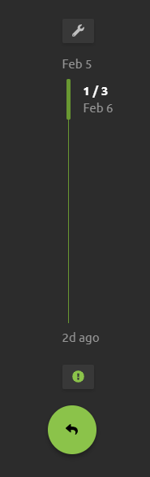](../../../assets/images/64521/9e8fa820c6aaa71f2da47ba4300ffa52cf9f750a.png "image")

But on the main page “Categories” view I see still the grey “+” on the button:  

[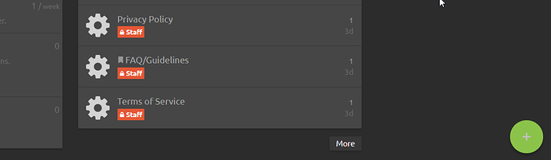](../../../assets/images/64521/aceb42ebed17c0cc57e2a1a7d2b259c6cab6dd69.png "image")
  *[PR]: Pull Request

---

### Post #71 by [thegurjyot](../../users/thegurjyot.md)
*Posted: 2019-02-08 14:52*

This theme looks very nice and one of the best among all themes available for Discourse.  
I saw it running on labs.daemon.com.au but the mobile experience is not that refined yet. Is that website using the theme with the latest updates?
  *[PR]: Pull Request

---

### Post #72 by [jimmymckinney](../../users/jimmymckinney.md)
*Posted: 2019-03-08 22:12*

Your theme is absolutely beautiful and I’m currently using it. I also have the branded header theme component installed and I noticed that when I use your theme, my branded font awesome icons no longer appear. Whereas with my old theme, it will show those icons. It’s not displaying anything (not even the box) but is still clickable. Would you happen to know of some conflicting code that could be causing this to happen?
  *[PR]: Pull Request

---

### Post #73 by [jimmymckinney](../../users/jimmymckinney.md)
*Posted: 2019-03-08 23:11*

I just ran into another issue and I don’t know if it’s my specific customization, but I cannot delete images. I can upload them, but once I do, the buttons lose all functionality and I cannot delete or add a new photo. What am I doing wrong? Thanks! 

[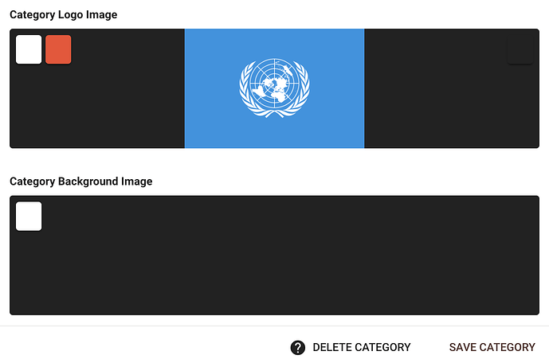](../../../assets/images/64521/b79d40ecf0645080b00d1340e79cc586608d2b0c.png "Screen Shot 2019-03-09 at 12.09.21 AM.png")
  *[PR]: Pull Request

---

### Post #74 by [amotl](../../users/amotl.md)
*Posted: 2019-04-03 15:12*

Hi there,

we just wanted to let you know that we are currently experiencing rendering woes like

on our installation at <https://meta.ip-tools.org/>. As far as we know, we did not make any changes to the system, so the problem appears out of the blue for us.

Most probably it is due to “The connection used to fetch this resources was not secure” errors when trying to load the glyphs from Google Fonts:

[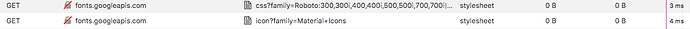](../../../assets/images/64521/4ddeff80b254fe09e5f5c8912827b7b6e0e6a61f.png "image.png")

We just wanted to leave a note about the issue and will follow up with an attempt to mitigate it by upgrading to the most recent software releases of all components.

With kind regards,  
Andreas.
  *[PR]: Pull Request

---

### Post #75 by [amotl](../../users/amotl.md)
*Posted: 2019-04-04 00:38*

 amotl:

> we just wanted to let you know that we are currently experiencing rendering woes

Apologies, reporting the last one was totally our fault. After bootstrapping a new workstation, we activated a bogus firewall setting which denied access to `googleapis.com` \- no wonder these requests would fail. Sorry for the noise!

Nevertheless, it was a good chance to update the theme and receive the numerous updates [@sesemaya](/u/sesemaya) pushed since end of January ([Comparing 83a7de732a13ac9f8bde60aaefbee39269c601fd...89f9f1347fb5755fdbab83f8350ebabe9d532857 · Daemonite/discourse-material-theme · GitHub](https://github.com/Daemonite/discourse-material-theme/compare/83a7de732a13ac9f8bde60aaefbee39269c601fd...89f9f1347fb5755fdbab83f8350ebabe9d532857)). As far as we can see everything works fine, so thanks again for the awesome work you are putting into this, Maya!
  *[PR]: Pull Request

---

### Post #76 by [Not-The-Foggiest](../../users/Not-The-Foggiest.md)
*Posted: 2019-05-06 08:37*

I have this strange situation where the edit option is not shown in the interface. It’s there, if you hover over it the name appears and you are able to use it if you hit the right spot.  
I have this user that keeps accidentally removing posts this way, which is quite unfortunate.

This is viewing a post in Material Design for Discourse and below the same in graceful:

[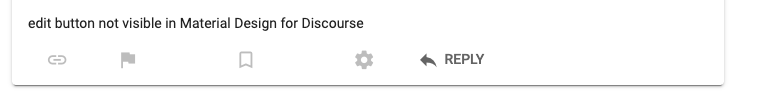](../../../assets/images/64521/308cc8a6056b24096a9bdc61ed007740f0b83f20.png "Screenshot 2019-05-05 at 17.25.20.png")

  *[PR]: Pull Request

---

### Post #77 by [amotl](../../users/amotl.md)
*Posted: 2019-05-08 23:52*

Dear [@Not-The-Foggiest](/u/not-the-foggiest),

we have been able to work around this issue as outlined at [Some icons are not translated properly · Issue #17 · Daemonite/discourse-material-theme · GitHub](https://github.com/Daemonite/discourse-material-theme/issues/17#issuecomment-481572889) the other day by adding this snippet at the appropriate place, effectively disabling the “alt-” variants of the icons to get them visible again:
    
    
    // Fix MBT#17: Translate "-alt" icons to non-"-alt" ones to
    // counter disappearing "edit"- and "delete"-post icons.
    // https://github.com/Daemonite/discourse-material-theme/issues/17#issuecomment-479716834
    classNames = classNames.replace('-alt', '');
    

It’s really just a quick workaround but might well help you along.

With kind regards,  
Andreas.
  *[PR]: Pull Request

---

### Post #78 by [Jennifer_Abrams](../../users/Jennifer_Abrams.md)
*Posted: 2019-10-16 13:10*

desktop user cards

and

mobile user pages

have messed up CSS. 0px spacing between fields etc…

Also it would be cool to see avatars larger on mobile on user pages.
  *[PR]: Pull Request

---

### Post #79 by [Jennifer_Abrams](../../users/Jennifer_Abrams.md)
*Posted: 2019-10-16 13:15*

also are avatars supposed to be so small on desktop user cards??

Really want to fix these issues as this is now my default theme and it looks by far the best out of all themes, including ones I’ve made myself.
  *[PR]: Pull Request

---

### Post #80 by [orchardstreet](../../users/orchardstreet.md)
*Posted: 2019-11-12 01:06*

Most avatars are not rendering in the reply section of posts. Any ideas? I really like this theme. It also happens on your site too. See how Abdulmalik_Hamid’s avatar doesn’t render in the “2 replies” section of athmangud’s OP?  
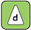 [Daemon Labs – 20 Mar 15](https://labs.daemon.com.au/t/material-with-meteor-apps/55 "08:18AM - 20 March 2015")

### [Material with Meteor Apps](https://labs.daemon.com.au/t/material-with-meteor-apps/55)

In my opinion, this is one of the best material design implementations fourth only to Polymer, Material-UI and Angular material. The simplicity and straight-forwardness required to add to a project would however raise it one or two places higher....
  *[PR]: Pull Request

---

### Post #82 by [orchardstreet](../../users/orchardstreet.md)
*Posted: 2019-11-12 15:23*

nah, last commit was in May. Avatars are broken on their site even and mobile is a mess. Otherwise a great theme.
  *[PR]: Pull Request

---

### Post #83 by [modius](../../users/modius.md)
*Posted: 2019-11-13 00:38*

 orchardstreet:

> Avatars are broken on their site even and mobile is a mess. Otherwise a great theme.

[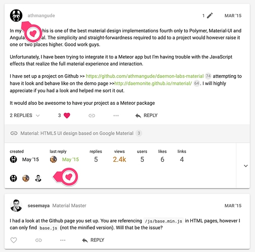](../../../assets/images/64521/7ecc2737cbd37f5d53470ed69c47a584d472e058.jpeg "avatars")

I can’t see any broken avatars on the page you link to or other pages on the site. Can you send through a screenshot of the problem you are seeing?

PS. We’ve been a bit busy of late but we know the Theme is due for an update.
  *[PR]: Pull Request

---

### Post #84 by [orchardstreet](../../users/orchardstreet.md)
*Posted: 2019-11-13 02:48*

 modius:

> Can you send through a screenshot of the problem you are seeing?

Missing avatars after you click an “x Replies” dropdown, like here on one of your pages.

[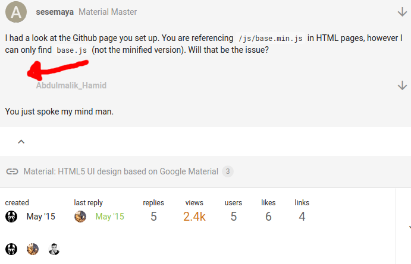](../../../assets/images/64521/9e2b3492a73e5622b3b7cc70fa5d5ba88b9b2097.png "123455")

Desktop version, latest chrome.  
See red arrow. It’s much more noticeable on more active forums using your theme. But it’s present on the page below where that screenshot was taken from.

 [Daemon Labs – 20 Mar 15](https://labs.daemon.com.au/t/material-with-meteor-apps/55 "08:18AM - 20 March 2015")

### [Material with Meteor Apps](https://labs.daemon.com.au/t/material-with-meteor-apps/55)

design material

In my opinion, this is one of the best material design implementations fourth only to Polymer, Material-UI and Angular material. The simplicity and straight-forwardness required to add to a project would however raise it one or two places higher....

Reading time: 1 mins 🕑 Likes: 6 ❤
  *[PR]: Pull Request

---

### Post #85 by [orchardstreet](../../users/orchardstreet.md)
*Posted: 2019-11-13 02:51*

also user-cards have 0px spacing issues on names of certain lengths (see screenshot below where message box clumps onto the name)  
, here is an example on desktop, but it’s much more pronounced on mobile, like almost all fields on usercards on mobile have spacing issues. User pages have a lot of 0px spacing issues on mobile too.

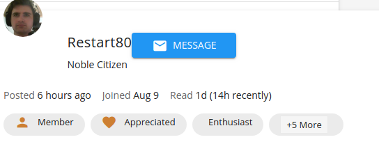

I really don’t have a method to screenshot mobile right now, but I assume you’d be able to see it on your end as well.
  *[PR]: Pull Request

---

### Post #86 by [modius](../../users/modius.md)
*Posted: 2019-11-13 11:51*

 orchardstreet:

> Missing avatars after you click an “x Replies” dropdown, like here on one of your pages.

Right! Missed the expanding **Replies X**.

Duly noted. We’ve scheduled some work to revamp the theme in the next few weeks. Hopefully in time for Christmas 🙂
  *[PR]: Pull Request

---

### Post #87 by [orchardstreet](../../users/orchardstreet.md)
*Posted: 2019-12-09 03:09*

any updates? just that one avatar fix would be amazing. My forum feels broke with that broken.
  *[PR]: Pull Request

---

### Post #88 by [orchardstreet](../../users/orchardstreet.md)
*Posted: 2019-12-19 17:22*

I’ll pay you $5 paypal to fix the avatars under the Replies dropdown if you weren’t planning on doing it anymore. It’s the only thing my forum needs fixing on. Revamped the theme myself for my forum but couldn’t figure that bit out.

Thanks 🙂
  *[PR]: Pull Request

---

### Post #90 by [orchardstreet](../../users/orchardstreet.md)
*Posted: 2019-12-23 21:09*

another thing is that users can’t change user card images or user card backgrounds after their first upload

**this is the other thing very broken on this theme**

but only with this theme

we have a very active forum and I don’t know how to fix it

image uploads in the Profile section also generally take a long time, it pauses a while at 100%, whereas it doesn’t do that so much on other themes

thx
  *[PR]: Pull Request

---

### Post #91 by [Emilie](../../users/Emilie.md)
*Posted: 2020-05-11 10:16*

Hello, first thanks for this nice theme. However, using it, it seems that some icons won’t show anymore :  
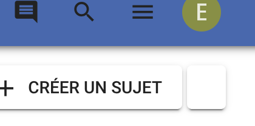

And there is also an issue with the calendar :  

[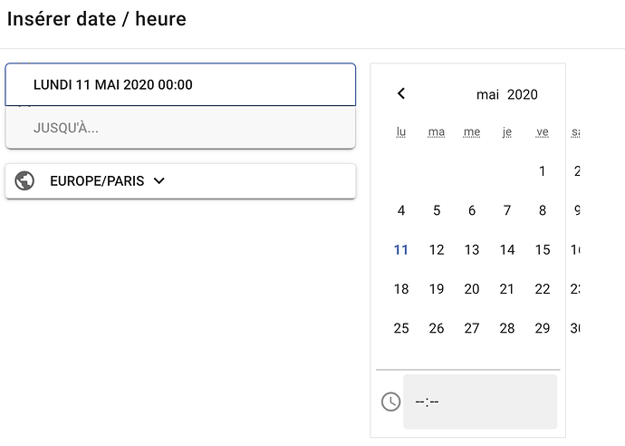](../../../assets/images/64521/d55d79ec4dc49b8995d9793f2e91d8fa3c7675fb.png "Capture d’écran 2020-05-11 à 12.08.47")

  
Thanks in advance for fixing 😉
  *[PR]: Pull Request

---

### Post #92 by [sesemaya](../../users/sesemaya.md)
*Posted: 2020-05-11 23:15*

Hi [@Emilie](/u/emilie),

Because we are converting default Font Awesome icons into Material Icons, sometimes we might have missed a few. Please feel free to report missing icons and we will look into them. Other times, the missing icon might have been resolved in the latest version, please feel free to upgrade the theme to the latest and see if the issue has been resolved.

Regarding calendar issue, we will look into that.
  *[PR]: Pull Request

---

### Post #93 by [sesemaya](../../users/sesemaya.md)
*Posted: 2020-05-12 03:44*

Hi [@Emilie](/u/emilie),

The theme has been updated.

  * A few missing icons have now been converted to Material Icons,
  * Datetime picker modal has also been fixed.

[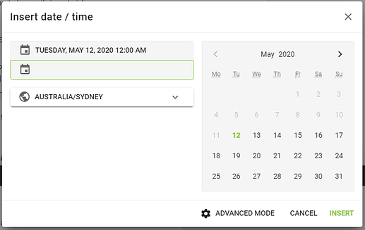](../../../assets/images/64521/dc6cc482c74dfdccafa17190ff037d2ea6d60190.png "discourse-datetime-picker")

Please feel free to post here if there are other issues.
  *[PR]: Pull Request

---

### Post #94 by [Emilie](../../users/Emilie.md)
*Posted: 2020-05-12 06:30*

Hi [@sesemaya](/u/sesemaya) ,  
Thanks for the fast update, it’s perfect ! 👌  
Just one icon I saw is still missing : the ‘angle-double-down’  
Thanks !
  *[PR]: Pull Request

---

### Post #95 by [sesemaya](../../users/sesemaya.md)
*Posted: 2020-05-12 23:35*

Hi [@Emilie](/u/emilie),

I have updated a few `angle` related icons.

Because Material Icons do not have double arrow for all four directions, I have to use the `double_arrow` [Icons - Material Design](https://material.io/resources/icons/?search=double%20arrow&icon=double_arrow&style=baseline) for all the `angle-double-*` icons, then rotate them for `-down`, `-left`, and `-up`.

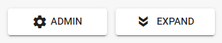

Hope this helps.
  *[PR]: Pull Request

---

### Post #96 by [Emilie](../../users/Emilie.md)
*Posted: 2020-05-13 06:21*

Hi [@sesemaya](/u/sesemaya),  
Yes, it works fine, thanks !
  *[PR]: Pull Request

---

### Post #97 by [discoverearth](../../users/discoverearth.md)
*Posted: 2020-06-29 02:22*

Hey [@sesemaya](/u/sesemaya), I’ve found a few more missing icons on my site. It would be fantastic if these could be added to material theme as well. Big thanks in advance.

  * [fab-patreon](https://fontawesome.com/icons/patreon?style=brands)
  * [th-large](https://fontawesome.com/icons/th-large?style=solid)
  * [comments](https://fontawesome.com/icons/comments?style=solid)
  * [comment-dots](https://fontawesome.com/icons/comment-dots?style=regular)
  * [globe-africa](https://fontawesome.com/icons/globe-africa?style=solid)

  *[PR]: Pull Request

---

### Post #98 by [MichelleBarnett](../../users/MichelleBarnett.md)
*Posted: 2020-07-21 15:58*

Hi there! I just applied this theme to my site and love it, but I am running into one issue.

When I try to change a category logo, it won’t let me. I go to category settings -> images -> category logo image, but when I click either delete or change, it only expands the image instead of allowing me to change it.

I left a comment about this on the Discourse page, and after they looked into it, they traced it back to this theme. Here is a screenshot of the reply.

[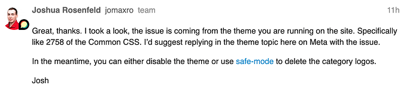](../../../assets/images/64521/dbc56607db94d77aaf24fd61398de67739b4335e.png "Screen Shot 2020-07-21 at 8.57.49 AM")

Thank you!
  *[PR]: Pull Request

---

### Post #99 by [Don](../../users/Don.md)
*Posted: 2020-07-21 16:09*

Hi [@MichelleBarnett](/u/michellebarnett),

I don’t know what causing the issue but alternatively you can change the theme to other and put your category images in then change it back to this. That should be working. I guess you won’t change the category images too often.
  *[PR]: Pull Request

---

### Post #100 by [MichelleBarnett](../../users/MichelleBarnett.md)
*Posted: 2020-07-21 16:16*

That’s what I ended up doing. Thank you!
  *[PR]: Pull Request

---

### Post #101 by [sesemaya](../../users/sesemaya.md)
*Posted: 2020-07-31 02:28*

Hi [@discoverearth](/u/discoverearth),

The following icons have been converted to similar Material Icons with the most recent updates:

  * `th-large`
  * `comments`
  * `comment-dots`

Regarding `globe-africa` as well as `globe-americas`, `globe-asia` and `globe-europe`, these icons have all been converted to the same `public` from Material Icons. This might not be ideal, but there is little we can do as our choices are limited to Material Icons have to offer.

Regarding `fab-patreon`, in a previous [commit](https://github.com/Daemonite/discourse-material-theme/commit/89d8289842aab303c8457a44e75989ae5dc3a44e#diff-205b3664fad9eeffe9cbaf774705b106), I have made sure that all the `fab` (i.e. brand icons) will not be converted as Material Icons do not support brand icons, so `fab-patreon` should display as is.
  *[PR]: Pull Request

---

### Post #102 by [sesemaya](../../users/sesemaya.md)
*Posted: 2020-07-31 02:35*

Hi [@MichelleBarnett](/u/michellebarnett) and [@Don](/u/Don),

The issue stops users from changing the image should be fixed by the latest changes now.
  *[PR]: Pull Request

---

### Post #104 by [anon82467725](../../users/anon82467725.md)
*Posted: 2020-11-27 20:07*

 sesemaya:

> The issue stops users from changing the image should be fixed by the latest changes now.

I’m experiencing the issue myself. I don’t know if it has reappeared or something like that.
  *[PR]: Pull Request

---

### Post #105 by [anon82467725](../../users/anon82467725.md)
*Posted: 2020-12-08 19:34*

If you click and hold your mouse on the reply button, then drag the cursor of the button, it turns gray until you stop holding your mouse. Is that intentional?  

<https://d11a6trkgmumsb.cloudfront.net/original/3X/f/8/f84ec3082134013890c4f3373bc6b35d8fba1c44.mp4>

  
Oh, and I ran into a very similar issue.  

<https://d11a6trkgmumsb.cloudfront.net/original/3X/4/4/44f6ac08dfd7d3a9d041e63ea9cb181228beb86e.mp4>

  
The end result is this.  
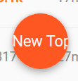
  *[PR]: Pull Request

---

### Post #106 by [Gonerdot](../../users/Gonerdot.md)
*Posted: 2024-02-01 09:12*

Beautiful theme. But alas, it is no longer possible to use

[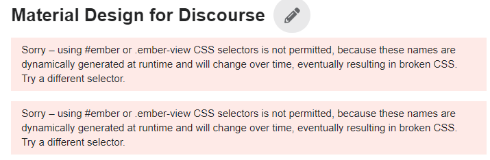](../../../assets/images/64521/3e057c9fccdbad5a6f9f1e106f4982fc03d55091.png "image")

  

[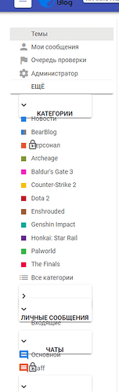](../../../assets/images/64521/ad4707bf75520b664a0c6b552b7406a346551a74.png "image")
  *[PR]: Pull Request

---

[← Previous](64521.md) | **Page 2 of 2** | Next →
