[🏠 Home](../../index.md) | [📋 Latest](../../latest/index.md) | [🔥 Top](../../top/replies/index.md) | [👥 Users](../../users/index.md)

[Home](../../index.md) » [Theme](../../c/theme/index.md) » Daemonite Material Theme

---

# Daemonite Material Theme (Page 1 of 2)

> **Category:** Theme
> **Author:** modius
> **Created:** 2017-06-15 03:30

← Previous | **Page 1 of 2** | [Next →](64521-page-2.md)

---

### Post #1 by [modius](../../users/modius.md)
*Posted: 2017-06-15 03:30*

The Daemonites have released a brand new, native theme for the Discourse forum based on the Google Material design guidelines.

[github.com](https://github.com/Daemonite/discourse-material-theme)

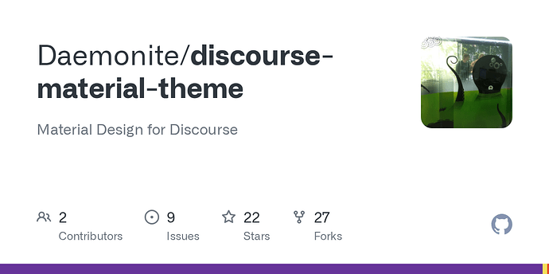

### [GitHub - Daemonite/discourse-material-theme: Material Design for Discourse](https://github.com/Daemonite/discourse-material-theme)

Material Design for Discourse

## As Flash as a Rat with a Gold Tooth

There’s a lot of effort in Materializing a design that didn’t start out that way. We’re happy with the result.

**Topic Preview Plugin Support**

[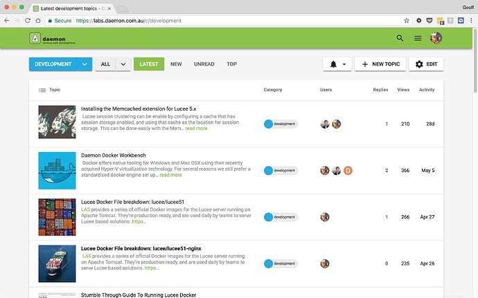](../../../assets/images/64521/82955f9847c9468a3f77d9181e7d9fe74fde1a5c.jpeg "topicpreview")

**Colourful Sub-Categories**

[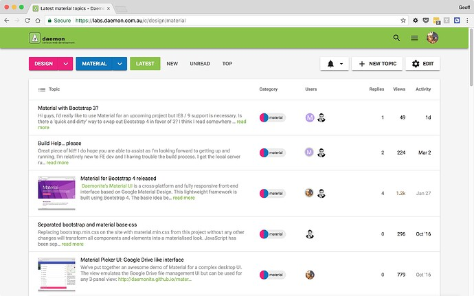](../../../assets/images/64521/5d9864949c6d08d1e66e0a29c0a5c925179236dd.jpeg "subcategories")

**New Topic; with Inbox inspiration**

[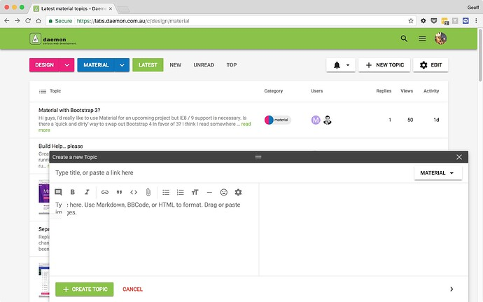](../../../assets/images/64521/c93458048de892368e70de5b0c2d258b55846c7c.jpeg "inboxinspired")

**Menus, Buttons and Material Icons**

[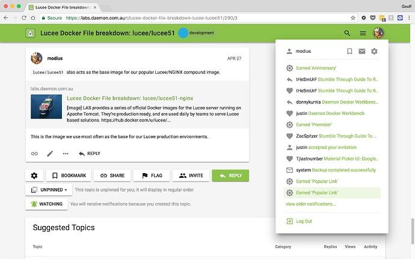](../../../assets/images/64521/5448e11c0490493044d050e938ca5fc620e9600f.jpeg "materialdesign")

## Why build “another” Material based theme?

Yep. There’s already a really cool Material Stock theme for Discourse available. It’s a bit different in places, and even includes a DARK mode.

[Material Design Theme](https://meta.discourse.org/t/material-design-stock-theme/47142) [Theme](/c/theme/61)

>  Summary Material Design has been created to be easily customizable. 👓 Preview [Preview on Discourse Theme Creator](https://discourse.theme-creator.io/theme/Discourse/material-design-theme) 🛠️ Repository Link <https://github.com/discourse/material-design-stock-theme> 📖 New to Discourse Themes? [Beginner’s guide to using Discourse Themes](https://meta.discourse.org/t/beginners-guide-to-using-discourse-themes/91966) Install this theme Features [[topic list example]](../../../assets/images/64521/4e79478d8bfa0001990734cb2248f6e92f2113e9.png "topic list example") [[posts example]](../../../assets/images/64521/898b0b1eb665ec00b3a64f8de7d5f322e8764941.jpeg "posts example") [[categories example]](../../../assets/images/47142/0c56d903ddbf42bd85bf463c4c9991aa80add94f.png "categories example") [[search example]](../../../assets/images/64521/e0a61eb1c179fa777135a6ebc5135966257718b4.png "search example") Color Options [[indigo/orange]](../../../assets/images/47142/ae64e5fc734d3bbe8e81cbd9ea0a689997c66967.png "indigo/orange") [[red/blue]](../../../assets/images/64521/9d9790dedee8678442de58adddba3bde2441ee22.png "red/blue") [[teal/…](../../../assets/images/47142/e947b7c8e080715edc48d476d14ce68aa97a362b.png "teal/amber")

Our forum has been running it’s own Material theme for some time. We’ve finally wrapped this up into the new Discourse Theme format for distribution. Plus as we use the theme as the foundation for some other Discourse related projects we need something within our immediate control.

Overall i think the only way we can describe the visual differences is that ours is **more Material** ; covers more elements in the style guide, more accurately. That said, whether you like one or the other will probably boil down to personal preference – we make a few _opinionated choices_ with respect to certain elements.

For reference, the theme is similar in approach to the Daemonite Material for Bootstrap 4 project:

[github.com](https://github.com/Daemonite/material)

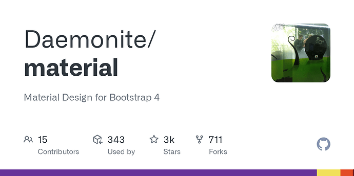

### [GitHub - Daemonite/material: Material Design for Bootstrap 4](https://github.com/Daemonite/material)

Material Design for Bootstrap 4

While Discourse is not Bootstrap-based, we do adhere to the same Material principals advocated in that design project.

You can see the theme running live at our Labs forum:

 [Daemon Labs](https://labs.daemon.com.au/)

### [Daemon Labs](https://labs.daemon.com.au/)

Experiments of the daemonites and their friends

Enjoy!
  *[PR]: Pull Request

---

### Post #2 by [sesemaya](../../users/sesemaya.md)
*Posted: 2017-06-15 03:41*

The new Material theme also works well with another theme we released earlier: the [`discourse-clipboard`](https://github.com/Daemonite/discourse-clipboard) theme which adds a COPY TO CLIPBOARD feature for code blocks.

[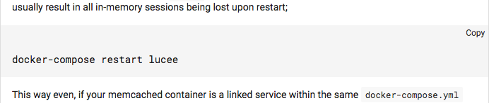](../../../assets/images/64521/0c9364d61ab4606c085cf669e4579ea12e78549b.png "15-6-17 1.41 pm.png")
  *[PR]: Pull Request

---

### Post #3 by [Falco](../../users/Falco.md)
*Posted: 2017-06-15 18:38*

Awesome work!

Two things:

  * You can now [include assets like fonts](https://meta.discourse.org/t/include-images-and-fonts-in-themes/62459), so no need to use Google Fonts.

  * The horizontal scroll bar on code blocks is too prominent, maybe some `::-webkit-scrollbar` CSS can help.

  *[PR]: Pull Request

---

### Post #4 by [dax](../../users/dax.md)
*Posted: 2017-06-15 20:22*

I’ve tried this theme with Firefox 54.0.  
This is how it looks:

[ 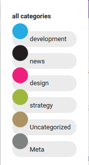 ](../../../assets/images/64521/AYa9YB8.png)   
[ 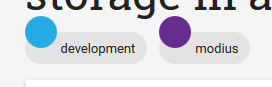 ](../../../assets/images/64521/ZhZ6XHT.png)

I think the problem is the `height: 32px` you set for `.badge-wrapper.box span.badge-category-bg, .badge-wrapper.bullet span.badge-category-bg`.  
Removing the height should fix the problem.

Great theme anyway [@modius](/u/modius)! 👍
  *[PR]: Pull Request

---

### Post #5 by [cpradio](../../users/cpradio.md)
*Posted: 2017-06-15 20:29*

If I had to guess, you may need to try a different tag style.
  *[PR]: Pull Request

---

### Post #6 by [sam](../../users/sam.md)
*Posted: 2017-06-15 23:47*

If you can fix, submit a pr to the theme repo
  *[PR]: Pull Request

---

### Post #7 by [sesemaya](../../users/sesemaya.md)
*Posted: 2017-06-16 00:17*

 Falco:

> You can now include assets like fonts, so no need to use Google Fonts.

Thanks for pointing out the including assets feature, I’m just a bit afraid that we will need to manually track when new icons have been added to Material Icons or Roboto has been updated and then update the theme accordingly if we go for this option. Although neither are updated frequently, using Google Fonts just seems to have one fewer thing to worry about.

 Falco:

> The horizontal scroll bar on code blocks is too prominent, maybe some ::-webkit-scrollbar CSS can help.

We will have a crack at this. 
  *[PR]: Pull Request

---

### Post #8 by [sesemaya](../../users/sesemaya.md)
*Posted: 2017-06-16 00:28*

Thanks for the feedback.

I had a look of this in Firefox. In fact, if you make any changes that has something to do with the box model (height, margin, width, etc.) in the Inspector, it seems to fix the problem.

Since badges are now `display: inline-flex;`, maybe we don’t need to `absolute` position `badge-category-bg` or `badge-category-parent-bg` anymore.
  *[PR]: Pull Request

---

### Post #9 by [Alankrit_Choudh](../../users/Alankrit_Choudh.md)
*Posted: 2017-06-17 10:00*

getting this bug when i have discourse formatting toolbar installed

[ 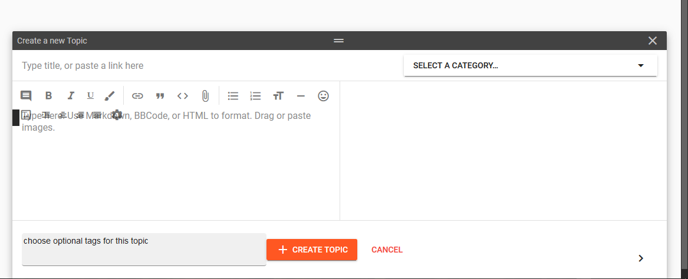 ](../../../assets/images/64521/3iaS2xe.png)
  *[PR]: Pull Request

---

### Post #10 by [Nick_Research](../../users/Nick_Research.md)
*Posted: 2017-10-13 03:23*

Apologies if this is a ridiculous question, but I really cannot figure out how to get the images showing on the front page when using this theme. As in, on the first screenshot shown, every topic has an image associated with it. I’m trying to make this happen on my install of Discourse and testing by creating posts with images - but no image comes through to the front page.

Is there some setting that makes that work?

Many thanks.
  *[PR]: Pull Request

---

### Post #11 by [schungx](../../users/schungx.md)
*Posted: 2017-10-13 03:28*

I think you’re looking at the `topic preview` plugin…
  *[PR]: Pull Request

---

### Post #12 by [Nick_Research](../../users/Nick_Research.md)
*Posted: 2017-10-13 06:21*

Thanks so much! That’s exactly what I was after. And in case anybody is following this thread later the link to installing a plugin is here: [Install plugins on a self-hosted site](https://meta.discourse.org/t/install-a-plugin/19157/) and the github url for topic preview to show thumbnails of images to go with a topic is here: [GitHub - merefield/discourse-topic-previews-sidecar: A Discourse plugin that complements the Topic Previews Theme Component to add features](https://github.com/angusmcleod/discourse-topic-previews)
  *[PR]: Pull Request

---

### Post #13 by [kuyashi](../../users/kuyashi.md)
*Posted: 2017-10-22 11:15*

Hi, I am seeing issues on mobile where some buttons and text not reaponivw. See the “Unpinned” button and adjacent text causing horizontal scrolling and messing with the responsiveness.

[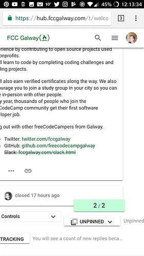](../../../assets/images/64521/4dd830385590f517672306242f6fba2f44ee9592.jpg "Screenshot_20171022-121335.jpg")

  *[PR]: Pull Request

---

### Post #14 by [modius](../../users/modius.md)
*Posted: 2018-03-07 06:24*

**Incredible news!** The Daemonite Material Discourse theme has been overhauled for use with Discourse v2 BETA!

[github.com](https://github.com/Daemonite/discourse-material-theme)

### [GitHub - Daemonite/discourse-material-theme: Material Design for Discourse](https://github.com/Daemonite/discourse-material-theme)

Material Design for Discourse

You can see it in action here:

 [Daemon Labs](https://labs.daemon.com.au/)

### [Daemon Labs](https://labs.daemon.com.au/)

Experiments of the daemonites and their friends

Enjoy!
  *[PR]: Pull Request

---

### Post #15 by [Pad_Pors](../../users/Pad_Pors.md)
*Posted: 2018-03-07 08:40*

thanks for the update, the theme doesn’t work properly for rtl direction. is it easy to adopt it for rtl?
  *[PR]: Pull Request

---

### Post #16 by [notriddle](../../users/notriddle.md)
*Posted: 2018-03-07 17:29*

The log in and sign up buttons are messed up in Firefox

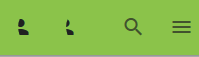

Other than that, it looks really good!
  *[PR]: Pull Request

---

### Post #17 by [sesemaya](../../users/sesemaya.md)
*Posted: 2018-03-08 00:07*

Hi [@notriddle](/u/notriddle), thanks for the bug report, this should have been fixed by the latest update.
  *[PR]: Pull Request

---

### Post #18 by [Timothy_Vail](../../users/Timothy_Vail.md)
*Posted: 2018-03-08 02:02*

[@modius](/u/modius) , [@sesemaya](/u/sesemaya) I am running the Material Design Stock Theme, I like the layout of that theme, but like elements of your theme as well, especially the log in and sign up buttons, and category “pill” buttons. Is there a way to add those in to my current theme?

I tried via css with variations on &.sign-up-button {  
@include material-icons(‘person_add’);

but that didn’t work. Any ideas?

So, the category buttons, and making login and signup buttons font awesome…

The biggest thing I want to keep is the + button for new topics on the bottom right.
  *[PR]: Pull Request

---

### Post #19 by [modius](../../users/modius.md)
*Posted: 2018-03-08 05:39*

 Timothy_Vail:

> The biggest thing I want to keep is the + button for new topics on the bottom right.

Funnily enough we removed the `+` on account of it being awkward to get it “right” in all the places it would sit. And while it works in a mobile view it looks a little odd in the desktop view; or at least it takes a bit of getting used to.

[@sesemaya](/u/sesemaya) what’s the chances of getting a `+` back as an optional child theme? Is this something we could support?
  *[PR]: Pull Request

---

### Post #20 by [Timothy_Vail](../../users/Timothy_Vail.md)
*Posted: 2018-03-08 16:31*

Anyhow, how would I import some of the features of your theme into the material design theme?
  *[PR]: Pull Request

---

### Post #21 by [sesemaya](../../users/sesemaya.md)
*Posted: 2018-03-08 22:31*

 Timothy_Vail:

> Anyhow, how would I import some of the features of your theme into the material design theme?

Unfortunately there is not an easy way to import bits and pieces of a theme. You will have to cherry pick the styles for the components/features you like from the compiled CSS or Sass and apply theme on top of the theme you are currently using.
  *[PR]: Pull Request

---

### Post #22 by [trangchongcheng](../../users/trangchongcheng.md)
*Posted: 2018-03-09 09:27*

i dont know input title layout error  

[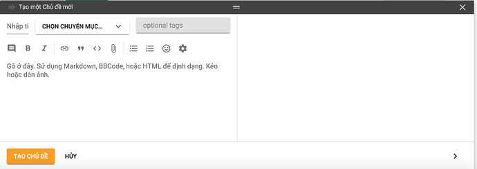](../../../assets/images/64521/a3fcb24e9ad71c96e240c68ef512f3468aaab072.png "Screen Shot 2018-03-09 at 16.25.47.png")
  *[PR]: Pull Request

---

### Post #23 by [sesemaya](../../users/sesemaya.md)
*Posted: 2018-03-19 01:09*

Hi [@trangchongcheng](/u/trangchongcheng), thanks for the feedback, this has been fixed by the latest update.
  *[PR]: Pull Request

---

### Post #24 by [trangchongcheng](../../users/trangchongcheng.md)
*Posted: 2018-03-19 07:07*

Thank…i working…  
But when i set google adsense (ads auto responsive) then forum cant responsive on mobile.  

[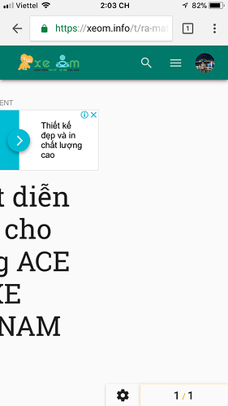](../../../assets/images/64521/bcfb3e7b6a7e276a34ea8b932ac3ecace3512e08.PNG "IMG_2527.PNG")
  *[PR]: Pull Request

---

### Post #25 by [djcyry](../../users/djcyry.md)
*Posted: 2018-03-21 11:52*

Thank you very much for this theme !
  *[PR]: Pull Request

---

### Post #26 by [notriddle](../../users/notriddle.md)
*Posted: 2018-04-09 15:56*

[The badges display on the User Summary page looks broken](https://labs.daemon.com.au/u/modius/summary)

[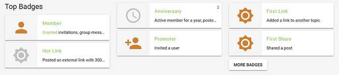](../../../assets/images/64521/d3b9e40fe3d9467566020e90b4cb77a247577a6f.png "image.png")
  *[PR]: Pull Request

---

### Post #30 by [PatrickH](../../users/PatrickH.md)
*Posted: 2018-05-08 05:37*

I have some problem with the first button:

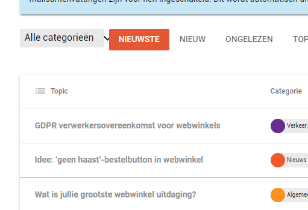

Also the tekst below the title is not displayed ?

I have also an exclamation mark next ot the name

[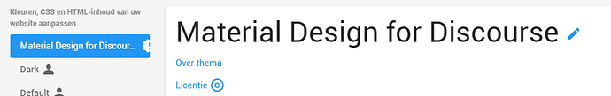](../../../assets/images/64521/cf2abd68e88cc90716a6c933c32ceaee78b1292f.png "image.png")

is this theme still being updated ? I already figured out the exclamation mark 😊

ok, almost there…  
The categorie button is not in Material Design, how can i fix this ?

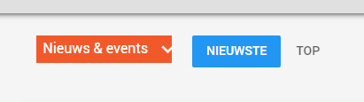
  *[PR]: Pull Request

---

### Post #31 by [sesemaya](../../users/sesemaya.md)
*Posted: 2018-05-11 00:08*

Hi [@notriddle](/u/notriddle), the badges section is now cleaned up in the latest version.
  *[PR]: Pull Request

---

### Post #32 by [sesemaya](../../users/sesemaya.md)
*Posted: 2018-05-11 00:14*

Hi [@PatrickH](/u/patrickh),

Regarding category dropdown, it works both for us at <https://labs.daemon.com.au/> and on [Discourse Theme Creator](https://theme-creator.discourse.org/theme/sesemaya/material).

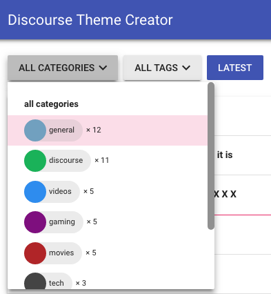

The reason I can think of at this stage is maybe you have an older version of Discourse and the markup for the category button is somehow different.
  *[PR]: Pull Request

---

### Post #33 by [PatrickH](../../users/PatrickH.md)
*Posted: 2018-05-11 11:48*

I have version: Discourse 1.9.5
  *[PR]: Pull Request

---

### Post #37 by [Eduardo_Braga](../../users/Eduardo_Braga.md)
*Posted: 2018-09-26 14:54*

How do I add this menu?

[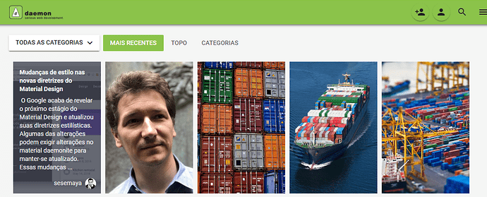](../../../assets/images/64521/d086b3ce8f88712363376ec57d5090c4bb47c715.png "help.png")
  *[PR]: Pull Request

---

### Post #38 by [modius](../../users/modius.md)
*Posted: 2018-10-11 03:05*

 Eduardo_Braga:

> How do I add this menu?

That’s the topic preview plugin…

<https://meta.discourse.org/t/topic-list-previews/41630>
  *[PR]: Pull Request

---

### Post #41 by [angus](../../users/angus.md)
*Posted: 2018-11-25 23:57*

[@modius](/u/modius) I just submitted three PRs for minor fixes to this theme. Let me know if the descriptions of what is being fixed are not clear:

[github.com/Daemonite/discourse-material-theme](../../../assets/images/64521/622c610de7133fce24072ff28b8fa78b91c86106.png)

####  [Fix editor toggle toolbar in mobile view](../../../assets/images/64521/622c610de7133fce24072ff28b8fa78b91c86106.png)

`master` ← `angusmcleod:editor-toggle-toolbar-fix`

merged 12:57AM - 26 Nov 18 UTC

[  angusmcleod ](https://github.com/angusmcleod)

[ +7 -0 ](https://github.com/Daemonite/discourse-material-theme/pull/6/files)

Alignment of toggle toolbar button was off in mobile view 

[github.com/Daemonite/discourse-material-theme](../../../assets/images/64521/5448e11c0490493044d050e938ca5fc620e9600f_2_1035x646.jpeg)

####  [Restore responsive editor behaviour](../../../assets/images/64521/5448e11c0490493044d050e938ca5fc620e9600f_2_1035x646.jpeg)

`master` ← `angusmcleod:editor-fix`

merged 02:30AM - 26 Nov 18 UTC

[  angusmcleod ](https://github.com/angusmcleod)

[ +0 -5 ](https://github.com/Daemonite/discourse-material-theme/pull/5/files)

This restores the default Discourse editor sizing, which is responsive to whethe[…](../../../assets/images/64521/5448e11c0490493044d050e938ca5fc620e9600f_2_1035x646.jpeg)r the preview is open or not. 

[github.com/Daemonite/discourse-material-theme](../../../assets/images/64521/4596d52f8bbf41b6ceb4859f9191408aeb3b62a1_2_1035x463.png)

####  [Fix topic tools display](../../../assets/images/64521/4596d52f8bbf41b6ceb4859f9191408aeb3b62a1_2_1035x463.png)

`master` ← `angusmcleod:various_fixes`

merged 06:06AM - 26 Nov 18 UTC

[  angusmcleod ](https://github.com/angusmcleod)

[ +9 -22 ](https://github.com/Daemonite/discourse-material-theme/pull/4/files)

This PR fixes two issues with the topic tools button: \- On desktop, the topic[…](../../../assets/images/64521/4596d52f8bbf41b6ceb4859f9191408aeb3b62a1_2_1035x463.png) tools button was cut off  \- On mobile, the topic tools menu was partially hidden 
  *[PR]: Pull Request

---

### Post #42 by [Merlls_Rizzini](../../users/Merlls_Rizzini.md)
*Posted: 2018-11-26 02:56*

[@sesemaya](/u/sesemaya) see post above. 😁
  *[PR]: Pull Request

---

### Post #43 by [angus](../../users/angus.md)
*Posted: 2018-11-26 23:36*

[@sesemaya](/u/sesemaya) Thanks for merging! In the course of the modifications and other updates we seem to have ended up with two toggles in the mobile compose. I think it might be because you’ve added both `.toggle-toolbar` and `fa-bars` to the material icon `:before` overrides.

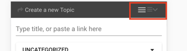
  *[PR]: Pull Request

---

### Post #44 by [pmusaraj](../../users/pmusaraj.md)
*Posted: 2018-11-27 00:10*

This is likely because I just merged FontAwesome 5 into master and now the core icons are no longer in `:before`s (more [here](https://meta.discourse.org/t/introducing-font-awesome-5-and-svg-icons/101643)). I tried removing the `:before` on the browser console, and it seems to do the trick.
  *[PR]: Pull Request

---

### Post #45 by [modius](../../users/modius.md)
*Posted: 2018-11-29 06:43*

 pmusaraj:

> This is likely because I just merged FontAwesome 5 into master and now the core icons are no longer in `:before` s (more [here ](https://meta.discourse.org/t/introducing-font-awesome-5-and-svg-icons/101643)). I tried removing the `:before` on the browser console, and it seems to do the trick.

[@sesemaya](/u/sesemaya) is taking a look at what we can do to preserve Material icons in light of the FontAwesome changes tomorrow.
  *[PR]: Pull Request

---

### Post #46 by [tshenry](../../users/tshenry.md)
*Posted: 2018-11-29 11:50*

[@modius](/u/modius), at the moment it looks like using the old icon render works. Here’s the code if you want to try it out in the ``</head>`` section of a theme component:
    
    
    
    

It looks like there still might be a few icons that aren’t rendering correctly (`.fa-thumbtack` is the notable one), but in any case, I think this might be one angle to look at.
  *[PR]: Pull Request

---

### Post #47 by [Merlls_Rizzini](../../users/Merlls_Rizzini.md)
*Posted: 2018-11-29 15:32*

 Timothy_Vail:

> The biggest thing I want to keep is the + button for new topics on the bottom right.

For those who still wants this modification and bring back + icon, [@angus](/u/angus) made this one for me.

[github.com](https://github.com/angusmcleod/bcharts-theme)

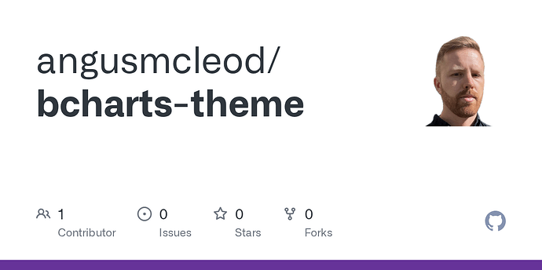

### [GitHub - angusmcleod/bcharts-theme](https://github.com/angusmcleod/bcharts-theme)

Contribute to angusmcleod/bcharts-theme development by creating an account on GitHub.

Thank you [@modius](/u/modius) and [@sesemaya](/u/sesemaya) for such incredible theme. 😉

[@tshenry](/u/tshenry) you’re an angel. 
  *[PR]: Pull Request

---

### Post #48 by [sesemaya](../../users/sesemaya.md)
*Posted: 2018-11-30 00:46*

Thanks [@tshenry](/u/tshenry), that did the trick.

Although there are still a few icons that are not rendering correctly, they are because of naming changes in FontAwesome 5. For example, `.fa-thumbtack` in 5 was `.fa-thumb-tack` in 4. I will go through the changes and update theme CSS accordingly.

Thanks again for the workaround.
  *[PR]: Pull Request

---

### Post #49 by [Merlls_Rizzini](../../users/Merlls_Rizzini.md)
*Posted: 2018-12-01 20:21*

Still missing those icons. Collapse and Reorder categories.

 sesemaya:

> few icons that are not rendering correctly

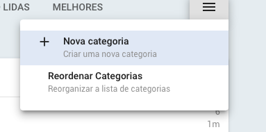

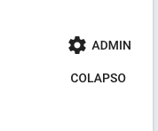
  *[PR]: Pull Request

---

### Post #50 by [Eduardo_Braga](../../users/Eduardo_Braga.md)
*Posted: 2018-12-07 02:21*

what happened?  

[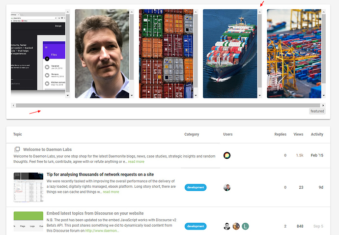](../../../assets/images/64521/c24806ce2fb41283110686214c591fabf18ecae5.jpeg "erroo.jpg")
  *[PR]: Pull Request

---

### Post #51 by [codinghorror](../../users/codinghorror.md)
*Posted: 2018-12-07 03:31*

[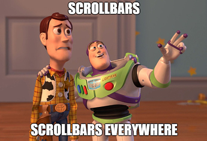](../../../assets/images/64521/c1626fce3bd886769b6585d0f41c99cb88d72b96.jpeg "image.jpg")
  *[PR]: Pull Request

---

### Post #52 by [amotl](../../users/amotl.md)
*Posted: 2019-01-04 20:07*

Dear [@sesemaya](/u/sesemaya),

first things first: Thank you so much for conceiving and maintaining this fantastic theme.

We would like to give it a ride in favor of the [Material Design Theme](https://meta.discourse.org/t/material-design-stock-theme/47142) and in order to do so, tried to install a fresh instance of Discourse (2.2.0.beta7) just yesterday. We imported your theme directly from its GitHub URL <https://github.com/Daemonite/discourse-material-theme>, thus using the current development head.

However, we found some layout/rendering glitches we would like to share with you:

### 1\. Icons in category list slightly off

[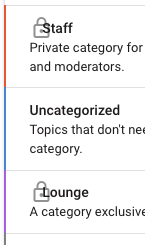](../../../assets/images/64521/7fb8065b2e611dfd8a1db2d82fcff6f884bcf9ba.png "image")

### 2\. Icons inside chips slightly off

#### Topic list

[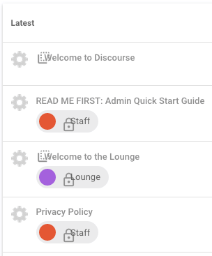](../../../assets/images/64521/4bb0d3814784ec547ab41d1b488045b184b38922.png "image")

#### Topic list hamburger menu

[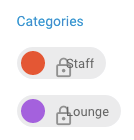](../../../assets/images/64521/676a5ec5d894200b40de5f2f50d9b4c7abdd44e4.png "image")

### 3\. Checker marks for color selection slightly off inside “New Category” dialog

[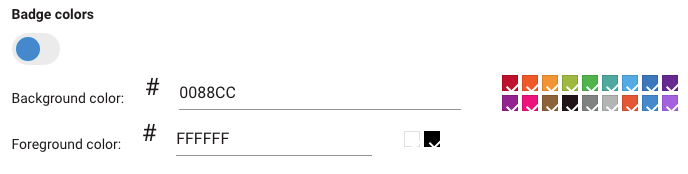](../../../assets/images/64521/76a00f6aabce431c6b1ab092cee87ca5e8b4a889.png "image")

### 4\. Padding between avatar icon and username too narrow on personal badge page

e.g. `/badges/1/basic?username=andreas.motl`  
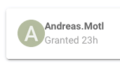

* * *

Do you have an idea what we might have done wrong or about any possible reasons why these things might happen? Maybe this also relates to [Subcategories are slightly broken · Issue #3 · Daemonite/discourse-material-theme · GitHub](../../../assets/images/64521/33a4d205c19c50144ed327b6df8352a58ac12637_2_690x344.png) in any way?

Thanks in advance for your help!

With kind regards,  
Andreas.
  *[PR]: Pull Request

---

### Post #53 by [amotl](../../users/amotl.md)
*Posted: 2019-01-05 06:15*

Regarding the first two issues

 amotl:

> ### 1\. Icons in category list slightly off
> 
> ### 2\. Icons in topic list slightly off

#### Solution, kind of

Both things can be mitigated by touching the `.d-icon` class at runtime. While `.d-icon` elements originally get sized at about 0.76em, increasing this by 1.0em like

[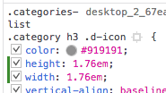](../../../assets/images/64521/30587da93d26ec53a68b86e7a7c5f72ffdb98982.png "image")

#### Result

Will make things look more smooth again:  

[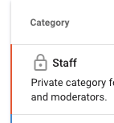](../../../assets/images/64521/b8c2678cdfb105f708b7bc361234470f8a5cabfc.png "image")

[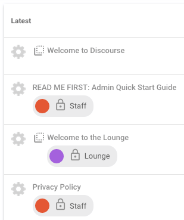](../../../assets/images/64521/622c610de7133fce24072ff28b8fa78b91c86106.png "image")

* * *

However, I wouldn’t know how to add this at “compile time”, i.e. to make it persistent. I just manipulated the CSS using Browser developer tools at runtime.

Nevertheless I wanted to share this insight with you, you might know way better which things to adjust appropriately.
  *[PR]: Pull Request

---

### Post #54 by [merefield](../../users/merefield.md)
*Posted: 2019-01-05 15:37*

 amotl:

> i.e. to make it persistent.

You can usually override plugins and themes with your own CSS installed as a Theme Component. I do this all the time. Create a Theme Component, add the delta CSS and add the Component to the Theme.
  *[PR]: Pull Request

---

### Post #55 by [sesemaya](../../users/sesemaya.md)
*Posted: 2019-01-11 01:52*

Hi [@Eduardo_Braga](/u/eduardo_braga), this has been fixed in the latest version.
  *[PR]: Pull Request

---

### Post #56 by [sesemaya](../../users/sesemaya.md)
*Posted: 2019-01-11 01:55*

Hi [@amotl](/u/amotl), all the above issues have been fixed in the latest version. Theme still has some other issues with beta7 and I’ll try to get them fixed. In the meantime, if you see any bugs, please feel free to post them here or in GitHub.
  *[PR]: Pull Request

---

### Post #57 by [amotl](../../users/amotl.md)
*Posted: 2019-01-12 17:29*

 sesemaya:

> all the above issues have been fixed in the latest version.

Hi [@sesemaya](/u/sesemaya), this works like a charm. Thank you so much!

 sesemaya:

> if you see any bugs, please feel free to post them here or in GitHub.

Thanks, we’ve spotted one or two other minor things and will be happy to share them along with some adjustments we additionally made to tweak the theme further.

* * *

Thanks again for your quick response and keep up the spirit!
  *[PR]: Pull Request

---

### Post #58 by [amotl](../../users/amotl.md)
*Posted: 2019-01-13 02:13*

Hi [@sesemaya](/u/sesemaya),

 amotl:

> > if you see any bugs, please feel free to post them here or in GitHub.
> 
> Thanks, we’ve spotted one or two other minor things and will be happy to share them along with some adjustments we additionally made to tweak the theme further.

We’ve put some of the issues we encountered on GitHub and hope you will appreciate our bug hunt:

  * [Subcategories are slightly broken · Issue #3 · Daemonite/discourse-material-theme · GitHub](../../../assets/images/64521/33a4d205c19c50144ed327b6df8352a58ac12637_2_690x344.png)
  * [Size limit on topic status icon · Issue #7 · Daemonite/discourse-material-theme · GitHub](../../../assets/images/64521/7ecc2737cbd37f5d53470ed69c47a584d472e058_2_1010x1000.jpeg)
  * ["Reorder Categories" dialog slightly offscreen · Issue #8 · Daemonite/discourse-material-theme · GitHub](../../../assets/images/64521/82955f9847c9468a3f77d9181e7d9fe74fde1a5c_2_1035x646.jpeg)
  * [Clipped "Save Edit" / "Cancel" buttons when editing longer posts in untall editor · Issue #9 · Daemonite/discourse-material-theme · GitHub](../../../assets/images/64521/99c0b06e9021cbfc7354c5c5b9e726023ce36f11.png)
  * [Category chooser text color and spacing · Issue #10 · Daemonite/discourse-material-theme · GitHub](https://github.com/Daemonite/discourse-material-theme/issues/10)
  * [Rendering of card borders slightly off · Issue #11 · Daemonite/discourse-material-theme · GitHub](https://github.com/Daemonite/discourse-material-theme/issues/11)
  * [Settings dialog of brand header theme component gets messed up slightly · Issue #12 · Daemonite/discourse-material-theme · GitHub](https://github.com/Daemonite/discourse-material-theme/issues/12)
  * [Markdown rendering of bullet lists · Issue #13 · Daemonite/discourse-material-theme · GitHub](https://github.com/Daemonite/discourse-material-theme/issues/13)
  * [Uploaded images appear stretched in editor preview · Issue #14 · Daemonite/discourse-material-theme · GitHub](https://github.com/Daemonite/discourse-material-theme/issues/14)
  * [Rendered checkboxes in post content slightly off · Issue #15 · Daemonite/discourse-material-theme · GitHub](https://github.com/Daemonite/discourse-material-theme/issues/15)
  * [User card has odd margin attribute · Issue #16 · Daemonite/discourse-material-theme · GitHub](https://github.com/Daemonite/discourse-material-theme/issues/16)
  * [Some icons are not translated properly · Issue #17 · Daemonite/discourse-material-theme · GitHub](https://github.com/Daemonite/discourse-material-theme/issues/17)

Besides that, we added two theme components to apply further adjustments to some parts of the vanilla [Daemonite Material Theme](https://meta.discourse.org/t/daemonite-material-theme/64521).

  * [Daemonite Material Theme: Ample layout adjustments](https://meta.discourse.org/t/daemonite-material-theme-ample-layout-adjustments/106379)
  * [Category badge adjustment component](https://meta.discourse.org/t/category-badge-adjustment-component/106366)

After putting everything together, the preliminary results can be viewed here:

 [IP Software Community](https://meta.ip-tools.org/) 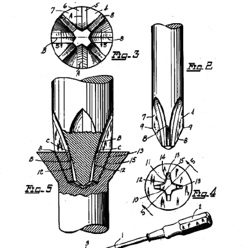

### [IP Software Community](https://meta.ip-tools.org/)

We are developing efficient software for processing intellectual property information based on modern components and technologies. Open source, open development and a friendly community.

#### Quote blueprint ;]

> Discourse and its Daemonite Material theme are truly gems in their fields. Thank you so much for bringing them together as such an amazing tandem of carefully crafted software components.

We hope that our humble feedback can contribute to further maturing.

With kind regards,  
Andreas.
  *[PR]: Pull Request

---

← Previous | **Page 1 of 2** | [Next →](64521-page-2.md)
