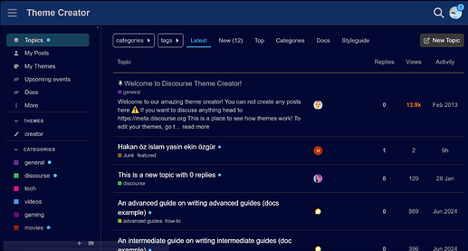

[🏠 Home](../../index.md) | [📋 Latest](../../latest/index.md) | [🔥 Top](../../top/replies/index.md) | [👥 Users](../../users/index.md)

[Home](../../index.md) » [Theme](../../c/theme/index.md) » Dark Blue theme

---

# Dark Blue theme

> **Category:** Theme
> **Author:** ondrej
> **Created:** 2020-10-31 14:02

---

### Post #1 by [ondrej](../../users/ondrej.md)
*Posted: 2020-10-31 14:02*

Hello everyone! 👋

I created this theme because most communities have a light and dark theme installed by default. But what I to do was to just add a bit of colour in addition to other peoples themes.

* * *

👀 [Preview on Discourse theme creator](https://discourse.theme-creator.io/theme/ondrej/blue-theme)

🔗 [GitHub repository link](https://github.com/ondrej2004/blue)

 [How do I install a theme or theme component?](https://meta.discourse.org/t/how-do-i-install-a-theme-or-theme-component/63682)

* * *

Preview:

---

### Post #3 by [ApplesjacksGamer](../../users/ApplesjacksGamer.md)
*Posted: 2022-03-10 06:33*

I like the dark theme choice. I have dark mode active on my Discord community gaming servers too. Very interested.

---
