[🏠 Home](../../index.md) | [📋 Latest](../../latest/index.md) | [🔥 Top](../../top/replies/index.md) | [👥 Users](../../users/index.md)

[Home](../../index.md) » [Theme](../../c/theme/index.md) » Discourse Classic Theme

---

# Discourse Classic Theme

> **Category:** Theme
> **Author:** Discourse
> **Created:** 2017-10-24 18:32

---

### Post #1 by [Discourse](../../users/Discourse.md)
*Posted: 2017-10-24 18:32*

|  |   
---|---|---  
 | **Summary** |  **Discourse Classic Theme** allows you to relive the past.  
👓 | **Preview** | [Preview on Discourse Theme Creator](https://discourse.theme-creator.io/theme/Discourse/classic-theme)  
🛠️ | **Repository Link** | <https://github.com/discourse/discourse-classic>  
📖 | **New to Discourse Themes?** | [Beginner’s guide to using Discourse Themes](https://meta.discourse.org/t/beginners-guide-to-using-discourse-themes/91966)  
  
Install this theme

>  As this is an [official](/tag/official) theme maintained by the Discourse team, [Support](/c/support/6) issues, [Bug](/c/bug/1) reports, [UX](/c/ux/9) suggestions, and requests for [Dev](/c/dev/7) advice can be made in the respective categories here on Meta, and tagged with the appropriate theme tag. Click on a link below to get one started. 👍
> 
> ` [❓ **Support**](https://meta.discourse.org/new-topic?category_id=6&tags=discourse-classic-theme "Ask for support on configuring and using the Discourse Classic Theme") ` ` [🐛 **Bug**](https://meta.discourse.org/new-topic?category_id=1&tags=discourse-classic-theme "A bug report means something is broken, preventing normal/typical use of the theme") ` ` [👀 **UX**](https://meta.discourse.org/new-topic?category_id=9&tags=discourse-classic-theme "Discussion about the user interface of the Discourse Classic Theme, and how features are presented \(including language and UI elements\)") ` ` [ **Dev**](https://meta.discourse.org/new-topic?category_id=7&tags=discourse-classic-theme "Advice on how to customise this theme for your site")`

###  Features

Remember 2013? The year of [Frozen](http://www.imdb.com/title/tt2294629/), [Yeezus](https://en.wikipedia.org/wiki/Yeezus), [Google Glass](https://en.wikipedia.org/wiki/Google_Glass), and when Discourse looked like this:

[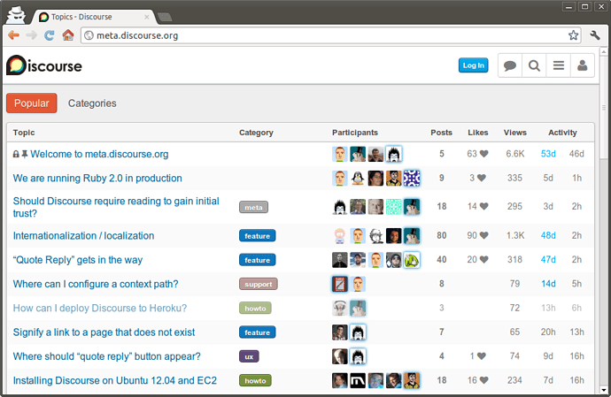](../../../assets/images/72708/20012b74829282f999e968a746ac96c612a19ce9.png "discourse")

Now you can relive the past with the Discourse Classic Theme 

Unlike Discourse in 2013, The Discourse Classic theme supports desktop and mobile devices, multiple badge styles, and light/dark color schemes.

Feel free to import it to your own Discourse install, or try it out here on Meta by selecting it from the hamburger menu (also in your personal preferences under “interface”).

Please report any bugs you may find, and let me know what you think!

  

>  **Hosted by us?** Themes are available to use on our Standard, Business, and Enterprise plans.

> Last edited by [@JammyDodger](/u/jammydodger) 2024-06-17T11:43:57Z
> 
> Check documentPerform check on document: 
  *[PR]: Pull Request

---

### Post #2 by [dax](../../users/dax.md)
*Posted: 2017-10-24 18:43*

OMG I did not remember that, I only remember square avatars… too many years have passed, 😱

Did you forget to add the [Hamburger Theme Selector](https://meta.discourse.org/t/hamburger-theme-selector/61210) as a component of this theme here on Meta?  
After switching to the Classic Theme I need to go on my profile to change theme again. 😋
  *[PR]: Pull Request

---

### Post #3 by [awesomerobot](../../users/awesomerobot.md)
*Posted: 2017-10-24 18:45*

Yes, I did. It should be there now.
  *[PR]: Pull Request

---

### Post #4 by [8BIT](../../users/8BIT.md)
*Posted: 2017-10-24 23:15*

OMG, this theme is sexy af! i really like it! what a throwback.
  *[PR]: Pull Request

---

### Post #8 by [erlend_sh](../../users/erlend_sh.md)
*Posted: 2017-10-31 14:35*

A few more quirks.

Multi-select toggle in Messages is unstyled.  

[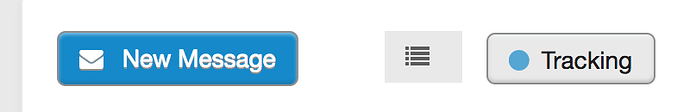](../../../assets/images/72708/d060e0dfedefe39320c05f115b4f76d35c9205c9.png "Screen Shot 2017-10-31 at 15.27.44.png")

I think tracking settings is unstyled? It looks fine, but I believe the “right” style should have rounded corners.  

[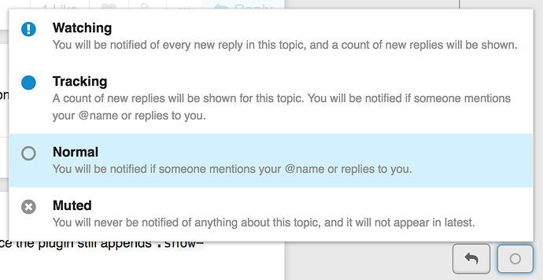](../../../assets/images/72708/fe36b0cbc468a1a8d428e9ddde28d1e6bb0b3971.png "Screen Shot 2017-10-31 at 15.28.40.png")

Bad overlap with page-position widget. I believe this problem [goes beyond theming though](https://meta.discourse.org/t/topic-progress-positioning-is-a-very-inconsistent/68483).  

[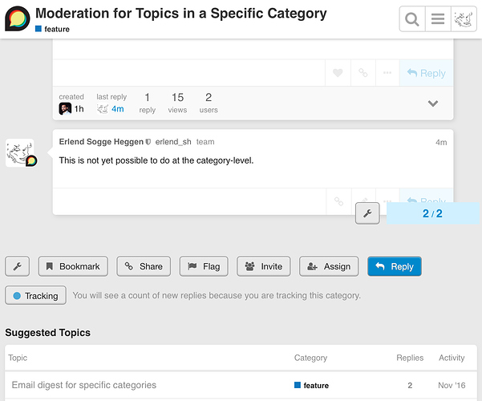](../../../assets/images/72708/451968f091d7fe3ca6377d39b27081dfebeb7a40.jpeg "discourse-classic.jpeg")

Lastly, do we need to keep the tiger stripes? Imo that style choice should instead be made available as a theme component for _any_ theme.
  *[PR]: Pull Request

---

### Post #10 by [8BIT](../../users/8BIT.md)
*Posted: 2017-12-28 03:26*

small issue. it’s fine when you scroll down:

[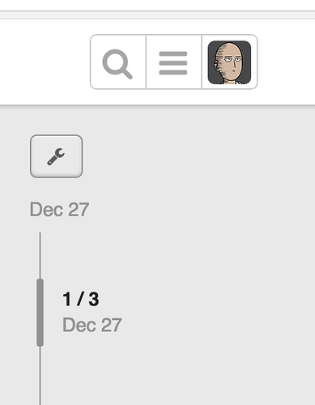](../../../assets/images/72708/20bda4b8cac19298bb2b0311a4b54cae4e0f9dad.png "Screen Shot 2017-12-27 at 7.10.28 PM.png")

slightly off:

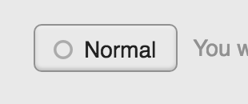

and a few things on mobile:

[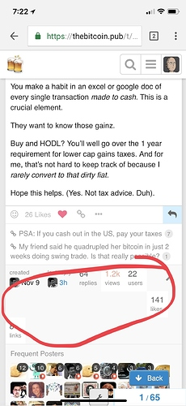](../../../assets/images/72708/54e801fd4334f18fd02f4669621146e7607294d9.jpg "IMG_1027.jpg")

styling lots of elements.

[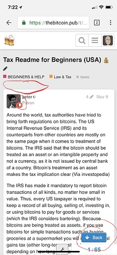](../../../assets/images/72708/ed86944ca3619af31c2e2598160a7d1bff6a7eb4.jpg "IMG_1028.jpg")

  
some extra spacing here… and the flair is pretty close to the title of user.

[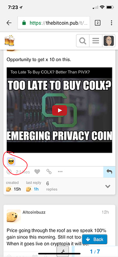](../../../assets/images/72708/c0cd6bd1d5fc26cdc4e97c9f542bb4bb83f05e15.jpg "IMG_1029.jpg")

this is related to the retort plugin. needs more spacing.

i hope this theme is still being worked on…!
  *[PR]: Pull Request

---

### Post #11 by [8BIT](../../users/8BIT.md)
*Posted: 2017-12-29 20:13*

a few more things…

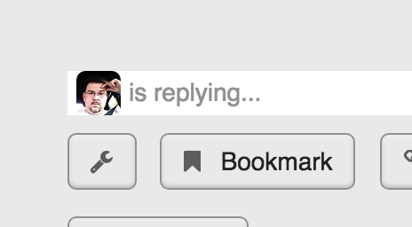

need more spacing:

[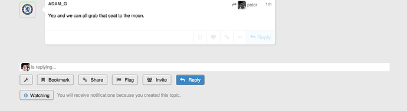](../../../assets/images/72708/b5d7fb81166f2db97b205ee7a08797d05f559414.jpg "Screen Shot 2017-12-29 at 12.11.06 PM.jpg")
  *[PR]: Pull Request

---

### Post #12 by [tophee](../../users/tophee.md)
*Posted: 2017-12-29 22:45*

 awesomerobot:

> Remember 2013? The year of Frozen, Yeezus, Google Glass, and when Discourse looked like this:

OMG! This looks so retro. Remember when “retro” implied at least a decade (more likely three) of time difference? These days retro is available within just a few years. 
  *[PR]: Pull Request

---

### Post #13 by [8BIT](../../users/8BIT.md)
*Posted: 2017-12-29 22:58*

this is my favorite theme out of all of them… i just love the throwbacks!
  *[PR]: Pull Request

---

### Post #14 by [terraboss](../../users/terraboss.md)
*Posted: 2017-12-30 00:42*

Not mine 😛 Since I came back to meta and need to re-login; I’ve got a little eye-cancer in the meantime.

It’s like reenabling the old iOS design on a Ferrari of modern high-quality forum software. 😃 I prefer the slim light-weight default theme. I guess, the Vincent theme could become my No. 2 favourite.
  *[PR]: Pull Request

---

### Post #15 by [awesomerobot](../../users/awesomerobot.md)
*Posted: 2018-01-02 15:51*

Thanks for reporting these! I pushed some fixes to the theme this morning.
  *[PR]: Pull Request

---

### Post #16 by [8BIT](../../users/8BIT.md)
*Posted: 2018-02-01 02:00*

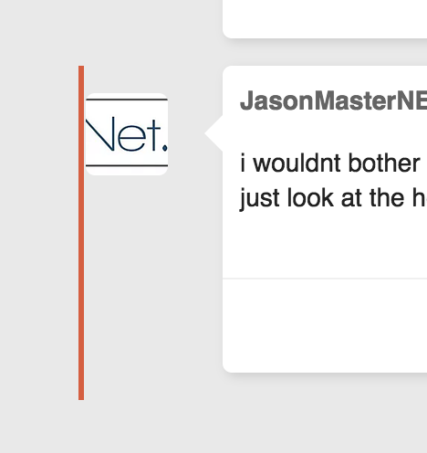

[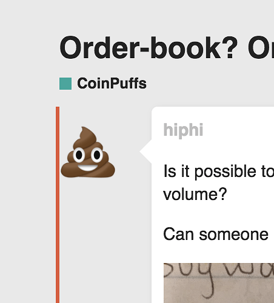](../../../assets/images/72708/ecb47a903dd88b1141d0e07143bccb1f0de71cb1.png "Screen Shot 2018-01-31 at 6.00.11 PM.png")

the focus on each post just looks a bit off.

this is by far my most favorite theme…
  *[PR]: Pull Request

---

### Post #17 by [8BIT](../../users/8BIT.md)
*Posted: 2018-02-03 02:14*

[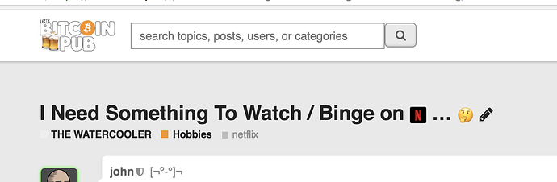](../../../assets/images/72708/b772154a85dd772e84aae80cb71b237cccab7e5c.png "Screen Shot 2018-02-02 at 6.13.21 PM.png")

recent update made this all wonky:

[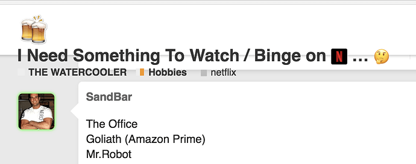](../../../assets/images/72708/457ed906c8351258c065b094829fee2b0ffb41c1.png "Screen Shot 2018-02-02 at 6.13.15 PM.png")

when you scroll down.

isn’t an issue on Default and Dark.
  *[PR]: Pull Request

---

### Post #18 by [jomaxro](../../users/jomaxro.md)
*Posted: 2018-02-08 03:55*

[@awesomerobot](/u/awesomerobot), can you take a look at this?
  *[PR]: Pull Request

---

### Post #20 by [awesomerobot](../../users/awesomerobot.md)
*Posted: 2018-02-08 05:07*

I just made some updates to get the theme up-to-date.
  *[PR]: Pull Request

---

### Post #21 by [HAWK](../../users/HAWK.md)
*Posted: 2018-04-10 04:01*

It looks a bit bung now with the `like` changes [@awesomerobot](/u/awesomerobot)

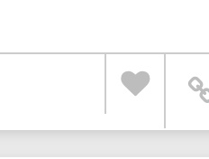

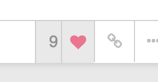
  *[PR]: Pull Request

---

### Post #22 by [awesomerobot](../../users/awesomerobot.md)
*Posted: 2018-06-11 16:22*

Just pushed a few updates, fixed the like button and added some styling for the new groups pages

[github.com/discourse/discourse-classic](https://github.com/discourse/discourse-classic/commit/600124788273f52f0a1012e27d0ddc8c0b47ef84)

####  [like and groups fix, prettier formatting](https://github.com/discourse/discourse-classic/commit/600124788273f52f0a1012e27d0ddc8c0b47ef84)

committed 04:18PM - 11 Jun 18 UTC

[  awesomerobot ](https://github.com/awesomerobot)

[ +169 -82 ](https://github.com/discourse/discourse-classic/commit/600124788273f52f0a1012e27d0ddc8c0b47ef84)
  *[PR]: Pull Request

---

### Post #23 by [Eduardo_Braga](../../users/Eduardo_Braga.md)
*Posted: 2019-05-10 03:13*

Icon  

[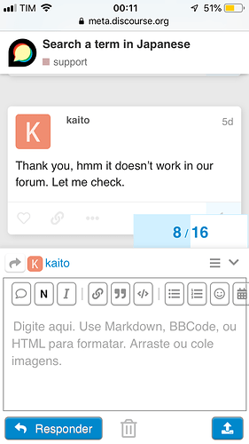](../../../assets/images/72708/a5523f7d5be3dbc98aae6b3cfbbd285a1f271868.png "995B970A-2703-498B-9333-AB84743ADF85.png")

Image 

[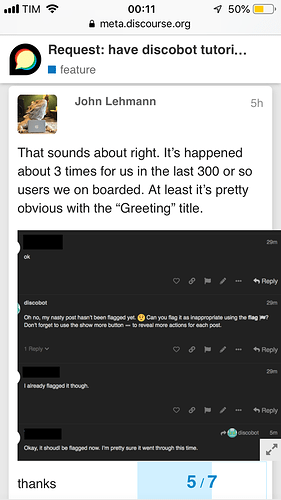](../../../assets/images/72708/131e7b4601f20d78eda33a0955074c2b1e52d27a.png "CA08B295-F2FD-4DA2-9931-B78EB67E9A29.png")
  *[PR]: Pull Request

---

### Post #24 by [rabsmith](../../users/rabsmith.md)
*Posted: 2019-09-29 01:33*

Hello,

I see this issue for discourse classic theme on my site, and on [discourse.org](http://discourse.org) itself. It happens when window with is in a specific range. The timeline appears over the post. Here is a sample.  

[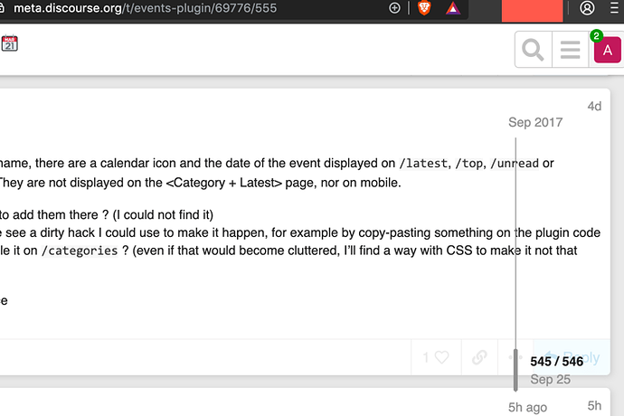](../../../assets/images/72708/07c60ddf0c5d3b46af2f9a1bc373996bb3ff07d3.png "image.png")
  *[PR]: Pull Request

---

### Post #25 by [awesomerobot](../../users/awesomerobot.md)
*Posted: 2019-10-02 00:12*

Thanks for reporting these issues, I’ve just made an update to fix:

  * composer icon size on small screens
  * prevent image overflowing on small screens
  * prevent timeline from overlapping at some widths

  *[PR]: Pull Request

---

### Post #26 by [downey](../../users/downey.md)
*Posted: 2020-02-06 00:06*

As someone who was using Discourse in 2013, can I just give my heartfelt thanks for those who built and maintain this. I use it on Meta to bring back memories. 

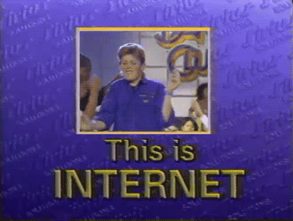
  *[PR]: Pull Request

---

### Post #27 by [hello-smile6](../../users/hello-smile6.md)
*Posted: 2023-08-17 23:07*

Is this theme component currently visually broken?  

[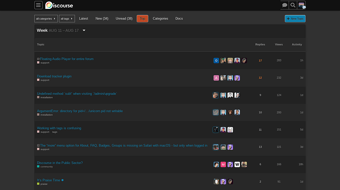](../../../assets/images/72708/9eede49ca7684acef5a6016bec1db1da06881362.png "image")
  *[PR]: Pull Request

---

### Post #28 by [darkpixlz](../../users/darkpixlz.md)
*Posted: 2023-08-18 02:55*

You have to use a light color scheme. Works for me
  *[PR]: Pull Request

---

### Post #29 by [hello-smile6](../../users/hello-smile6.md)
*Posted: 2023-08-18 03:00*

It’s still broken with a light color scheme.
  *[PR]: Pull Request

---

### Post #30 by [darkpixlz](../../users/darkpixlz.md)
*Posted: 2023-08-18 03:00*

I am not on my computer right now but it is still working.  

[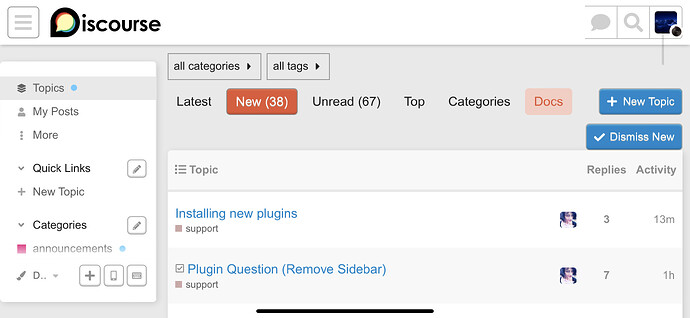](../../../assets/images/72708/87eae4ff38c2063aa503b95b5262e400339c7b64.jpeg "IMG_8540")
  *[PR]: Pull Request

---

### Post #31 by [hello-smile6](../../users/hello-smile6.md)
*Posted: 2023-08-18 03:16*

Are the outlines supposed to look strange?
  *[PR]: Pull Request

---

### Post #32 by [Canapin](../../users/Canapin.md)
*Posted: 2023-08-21 12:55*

I don’t think so. The original version used a border using the same color as the button, but darker. Now, it uses a grey border : `var(--primary-medium)`

 

Something like this for this button…

To achieve this, each of these buttons should have a border the same color as the button’s background, darkened by 10 to 15%.
  *[PR]: Pull Request

---

### Post #34 by [awesomerobot](../../users/awesomerobot.md)
*Posted: 2023-09-26 18:57*

Thanks [@hello-smile6](/u/hello-smile6) & [@Canapin](/u/canapin), I’ve merged an update to fix this:

[github.com/discourse/discourse-classic](../../../assets/images/72708/87eae4ff38c2063aa503b95b5262e400339c7b64_2_1035x477.jpeg)

####  [UX: adjust and fix button styles](../../../assets/images/72708/87eae4ff38c2063aa503b95b5262e400339c7b64_2_1035x477.jpeg)

`main` ← `button-fixes`

merged 06:56PM - 26 Sep 23 UTC

[  awesomerobot ](https://github.com/awesomerobot)

[ +64 -11 ](https://github.com/discourse/discourse-classic/pull/8/files)

Adjusts some button readability issues mentioned here: https://meta.discourse.or[…](../../../assets/images/72708/87eae4ff38c2063aa503b95b5262e400339c7b64_2_1035x477.jpeg)g/t/discourse-classic-theme/72708/32?u=awesomerobot Also: * Fixes bookmark button state (icon wasn't visible previously) * Fixes new user nav styles
  *[PR]: Pull Request

---

### Post #36 by [Milenski](../../users/Milenski.md)
*Posted: 2025-08-05 20:45*

To this day, more than ten years later, this remains the best design… I just fell in love with it. 😍
  *[PR]: Pull Request

---
