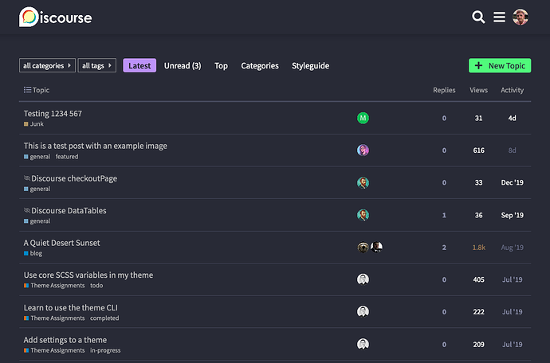
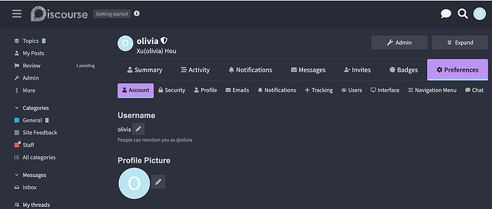
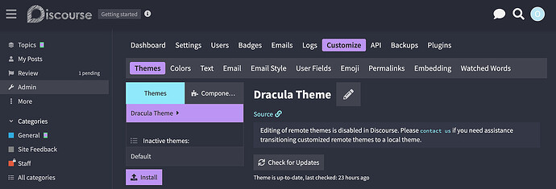
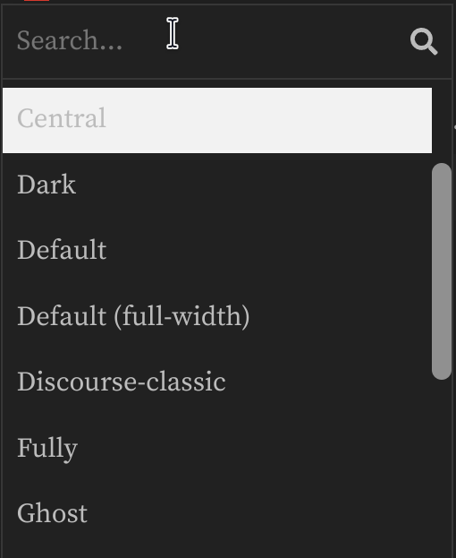
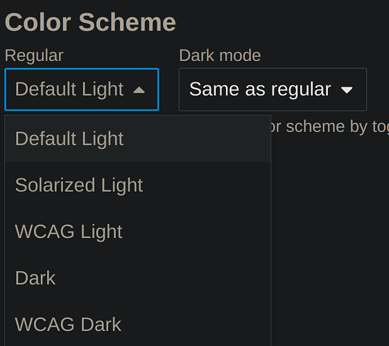

[🏠 Home](../../index.md) | [📋 Latest](../../latest/index.md) | [🔥 Top](../../top/replies/index.md) | [👥 Users](../../users/index.md)

[Home](../../index.md) » [Theme](../../c/theme/index.md) » Dracula a Dark Theme for Discourse

---

# Dracula a Dark Theme for Discourse

> **Category:** Theme
> **Author:** jordan.vidrine
> **Created:** 2020-03-31 22:13

---

### Post #1 by [jordan.vidrine](../../users/jordan.vidrine.md)
*Posted: 2020-03-31 22:13*

A theme built on the [Dracula color palette](https://draculatheme.com/contribute#color-palette). This color scheme has been one of my favorite go to themes in the text editors and other software I use.

I felt like Discourse could use it as well 😄

 : Github Repo `https://github.com/dracula/discourse`

 [Preview on Theme Creator](https://theme-creator.discourse.org/theme/jordan.vidrine/dracula)

 [How do I install a theme or theme component?](https://meta.discourse.org/t/how-do-i-install-a-theme-or-theme-component/63682)

If you see anything off, let me know here and I’ll get that updated! Hope you enjoy 

---

### Post #2 by [itsbhanusharma](../../users/itsbhanusharma.md)
*Posted: 2020-04-01 03:56*

This actually looks very neat.

---

### Post #4 by [ondrej](../../users/ondrej.md)
*Posted: 2020-04-01 07:35*

Looking great, I can definitely feel Dracula vibes.

---

### Post #7 by [bubblecatcher](../../users/bubblecatcher.md)
*Posted: 2020-08-22 12:28*

are colours fixed or can they be changed?

---

### Post #8 by [jordan.vidrine](../../users/jordan.vidrine.md)
*Posted: 2020-08-25 22:06*

Theme colors are fixed per theme/color scheme once defined. If you would like to customize this for your own use though, feel free to fork the repo and change the colors in the `about.json` file. 

---

### Post #21 by [LMD](../../users/LMD.md)
*Posted: 2021-06-23 01:22*

Hello,

In the mobile view, how do I hide the “Replies” column and show the Views column? Thank you.

Update: found the solution for the Replies column, but cannot figure out how to add “Views”

---

### Post #22 by [jordan.vidrine](../../users/jordan.vidrine.md)
*Posted: 2021-06-23 14:00*

We do not show the `views` count on mobile, only `activity` and `replies`. To create your own mobile topic list view, you would need to create a theme-component that edits the mobile `topic-list-item` template found here:

[github.com/discourse/discourse](https://github.com/discourse/discourse/blob/515fd8a4c32a356a005510fe4a11ce0f976dda27/app/assets/javascripts/discourse/app/templates/mobile/list/topic-list-item.hbr)

#### [app/assets/javascripts/discourse/app/templates/mobile/list/topic-list-item.hbr](https://github.com/discourse/discourse/blob/515fd8a4c32a356a005510fe4a11ce0f976dda27/app/assets/javascripts/discourse/app/templates/mobile/list/topic-list-item.hbr)

[`515fd8a4c`](https://github.com/discourse/discourse/blob/515fd8a4c32a356a005510fe4a11ce0f976dda27/app/assets/javascripts/discourse/app/templates/mobile/list/topic-list-item.hbr)
    
    
    <td>
      {{~raw-plugin-outlet name="topic-list-before-columns"}}
      {{~#if showMobileAvatar}}
      

        <a href="{{topic.lastPostUrl}}" data-user-card="{{topic.last_poster_username}}">{{avatar topic.lastPosterUser imageSize="large"}}</a>
      

      

        {{else}}
          

            {{/if~}}
            {{!--
              The `~` syntax strip spaces between the elements, making it produce
              `<a class=topic-post-badges>Some text</a>`,
              with no space between them.
              This causes the topic-post-badge to be considered the same word as "text"
              at the end of the link, preventing it from line wrapping onto its own line.
            --}}
            {{~raw-plugin-outlet name="topic-list-before-link"}}
            

              {{~raw-plugin-outlet name="topic-list-before-status"}}
    

This file has been truncated. [show original](https://github.com/discourse/discourse/blob/515fd8a4c32a356a005510fe4a11ce0f976dda27/app/assets/javascripts/discourse/app/templates/mobile/list/topic-list-item.hbr)

An example of someone on this forum who has done something similar can b found in this topic [MD Topic List Mobile component](https://meta.discourse.org/t/md-topic-list-mobile-component/146341).

* * *

If you haven’t created a theme or theme-component before, I would suggest reading through this topic that does a great job of explaining the process.

[Beginner's guide to using Discourse Themes](https://meta.discourse.org/t/beginners-guide-to-using-discourse-themes/91966) [Site Management](/c/documentation/site-management/53)

> This is a crash course in Discourse theme basics. The target audience is everyone who is not familiar with Discourse themes. If you’ve already used Discourse theme / theme components, this guide is probably not something you need to read. What are themes and theme components? A theme or theme component is a set of files packaged together designed to either modify Discourse visually or to add new features. Let’s start with themes. Themes In general, themes are not supposed to be compatible wi…

---

### Post #30 by [olivia](../../users/olivia.md)
*Posted: 2024-01-17 08:10*

**Dracula Theme - Color Issue**

**Description:** Encountered an issue with the Dracula theme on our Discourse site. The theme’s appearance differs from its expected look, particularly in color schemes and tab appearances. Initially, the theme displayed differently on my test site compared to other sites using Dracula. After reinstalling from the GitHub repository, the appearance aligned, suggesting a potential issue with outdated code or variable usage.  
**Reproduction Steps:**

  1. Installed the Dracula theme via Admin → Customize → Themes.
  2. Set it as the default theme.
  3. Disabled other themes and color scheme options for users under Admin → Customize.
  4. Confirmed in my profile (Preferences → Interface) that Dracula was the only selectable theme, ensuring I viewed it in its default setup.
  5. Noted differences in the appearance, especially the tabs, which didn’t look as expected (indicating a potential issue with the theme).

**Screenshots:**

**Platform:**

  * Mac (Desktop)

**Browser:**

  * Chrome

**Additional Comments:** The issue appears to stem from the use of outdated CSS variables in the theme. The current syntax in the Dracula theme ($primary, $tertiary, $secondary) is obsolete compared to the newer variable format (var(–tertiary), var(–secondary)) used in recent Discourse themes, [as seen in this GitHub example](https://github.com/dracula/discourse/blob/eac56a3e304bad3444aed6f40a5eaad270ac3932/common/common.scss#L186). This old variable usage likely causes the unusual rendering, especially when no alternative theme or color scheme is selectable. The problem remained even after a theme reinstallation, indicating a deeper issue within the theme’s code structure.

---

### Post #31 by [jordan.vidrine](../../users/jordan.vidrine.md)
*Posted: 2024-01-17 21:11*

Thanks for sharing! I have a fix in the works.

---

### Post #32 by [Ahmed26](../../users/Ahmed26.md)
*Posted: 2024-03-21 06:31*

Is it possible to set this as a theme?

I need to show this in the Sidebar Theme Switch list

---

### Post #33 by [jordan.vidrine](../../users/jordan.vidrine.md)
*Posted: 2024-03-21 16:15*

Are you asking for this to be installed on meta and in the sidebar?

The color scheme is actually one you can select in Discourse now as well.

---

### Post #34 by [Matthias_Schuster](../../users/Matthias_Schuster.md)
*Posted: 2024-06-01 17:50*

Yes, is it possible to choose this on meta?

For now, it does not seem to be available.

---

### Post #35 by [jordan.vidrine](../../users/jordan.vidrine.md)
*Posted: 2024-07-09 16:05*

Dracula is available as a color scheme choice here on meta.

You can get to it by visiting your interface preferences in your personal user preferences area.

---

### Post #38 by [Matthias_Schuster](../../users/Matthias_Schuster.md)
*Posted: 2024-09-01 10:34*

No, not for me:

---

### Post #40 by [jordan.vidrine](../../users/jordan.vidrine.md)
*Posted: 2024-09-03 11:49*

You should now be able to select the Dracula color scheme in the color selector in your preferences here on meta.

---

### Post #41 by [JammyDodger](../../users/JammyDodger.md)
*Posted: 2024-09-03 20:48*

4 posts were split to a new topic: [Adding colour schemes](/t/adding-colour-schemes/324770)

---
