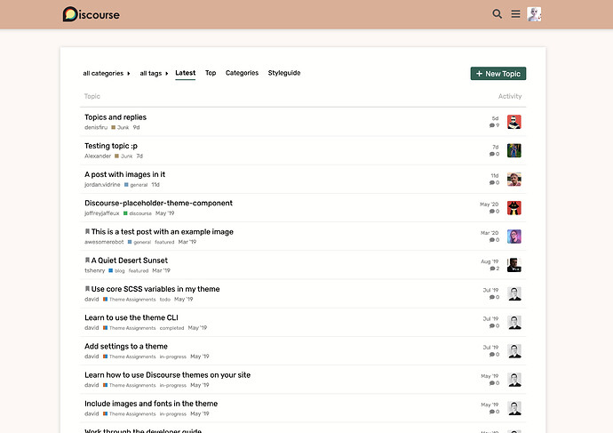
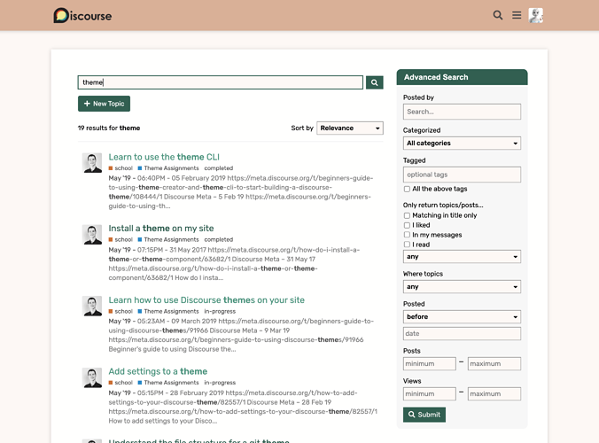
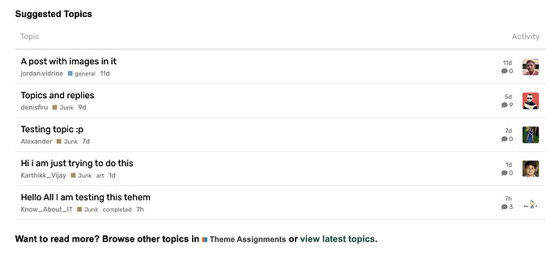
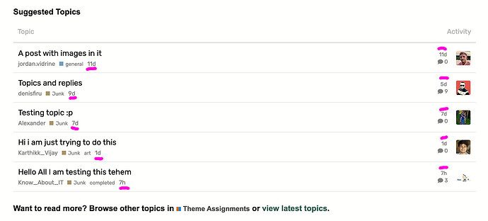

[🏠 Home](../../index.md) | [📋 Latest](../../latest/index.md) | [🔥 Top](../../top/replies/index.md) | [👥 Users](../../users/index.md)

[Home](../../index.md) » [Theme](../../c/theme/index.md) » Essential, a simple theme for Discourse :art:

---

# Essential, a simple theme for Discourse :art:

> **Category:** Theme
> **Author:** meghna
> **Created:** 2021-02-22 14:46

---

### Post #1 by [meghna](../../users/meghna.md)
*Posted: 2021-02-22 14:46*

This theme is a variation of [Elementary theme](https://meta.discourse.org/t/elementary-a-simple-theme-for-discourse/177159). The homepage layout (topic list) is changed to show just the essential information in two columns.

🎨  💬

Homepage:

Full page search:

Suggested Topics under topic details:

Let me know how this theme can be further improved. Enjoy! 🙂

|  |   
---|---|---  
😎 | **Preview** | [Preview on theme creator](https://theme-creator.discourse.org/theme/meghna/essential)  
🔗 | **Github Repo** | [discourse-essential-theme](https://github.com/meghnaAJ/discourse-essential-theme)  
🛠️ | **Install Guide** | [How to install a theme or theme component](https://meta.discourse.org/t/how-do-i-install-a-theme-or-theme-component/63682)

---

### Post #2 by [codinghorror](../../users/codinghorror.md)
*Posted: 2021-02-23 03:41*

One thing that is a bit confusing is the two dates… I suggest for a simple theme, one date is preferable?  
  

Also, did you decide to remove any elements from the topic page itself? There are no screenshots of a topic.

---

### Post #3 by [meghna](../../users/meghna.md)
*Posted: 2021-02-23 03:56*

This theme is a minor variation of the [Elementary theme](https://meta.discourse.org/t/elementary-a-simple-theme-for-discourse/177159) which was originally inspired from [Sam’s simple theme](https://meta.discourse.org/t/sams-personal-minimal-topic-list-design/23552). There are no changes in topic page layout.

Just to clarify: the date under topic title is topic created date, and the date in activity column is last posted date.

I am currently working on a new theme which will be very minimal and will remove elements from topic page that may be confusing for beginners.

Thank you for the feedback!

---
