[🏠 Home](../../index.md) | [📋 Latest](../../latest/index.md) | [🔥 Top](../../top/replies/index.md) | [👥 Users](../../users/index.md)

[Home](../../index.md) » [Theme](../../c/theme/index.md) » Fakebook Theme

---

# Fakebook Theme (Page 2 of 3)

> **Category:** Theme
> **Author:** Joshua_Kogan
> **Created:** 2019-02-13 20:18

[← Previous](109079.md) | **Page 2 of 3** | [Next →](109079-page-3.md)

---

### Post #60 by [Joshua_Kogan](../../users/Joshua_Kogan.md)
*Posted: 2020-07-29 15:01*

Hi [@awesomerobot](/u/awesomerobot), comparing this theme to dev.to, is there a way to show all categories listed, rather than within a drop-down menu, on the left-hand side? Furthermore, I remember meta testing out a theme that let users follow categories to fine-tune/specify their activity stream – is this functionality available, and can it be combined with Fakebook?

---

### Post #61 by [jordan.vidrine](../../users/jordan.vidrine.md)
*Posted: 2020-08-18 21:36*

Following in the footsteps of this theme’s inspiration, Fakebook now has a modern update!

This new theme is available under the name ‘Fakebook Modern’.

Don’t worry though! Fakebook Classic will still be available for you to enjoy 😄

[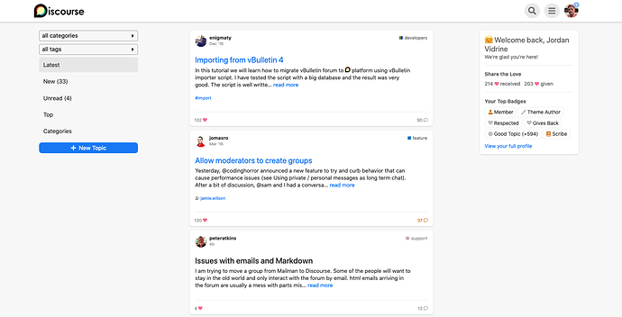](../../../assets/images/109079/bcccf6cd985e4776541d18738c47ddca15568a23.png "image")

As always, if you see something that looks off, just let us know!

---

### Post #63 by [Don](../../users/Don.md)
*Posted: 2020-08-27 16:44*

Hello,

Have a problem with fakebook and modern fakebook theme. On the right sidebar. This script should not load to logged out visitors. Is there any idea to load this script only the logged in users? Thank you 🙂
    
    
    <!-- Custom sidebar widget -->
    
    
    

The error code is:  

[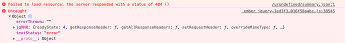](../../../assets/images/109079/72bbbf6c751805e1f94de65558039ecb96380330.png "Screen Shot 2020-08-27 at 3.19.36 PM")

---

### Post #64 by [Don](../../users/Don.md)
*Posted: 2020-08-27 18:45*

Hello again,

I just made it. It works with no errors but can anyone check my code is correct? Thanks 🙂
    
    
    <!-- Custom sidebar widget -->
    
    

---

### Post #65 by [Eduardo_Braga](../../users/Eduardo_Braga.md)
*Posted: 2020-08-27 22:57*

need to adjust the position of the title, text and some parts

iPhone 6s  

[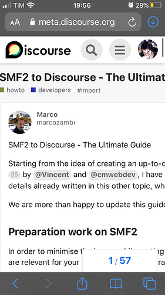](../../../assets/images/109079/c2796722c558fedf7db49e4181c74e361a50f66f.png "imagem")

---

### Post #66 by [Eduardo_Braga](../../users/Eduardo_Braga.md)
*Posted: 2020-08-27 23:00*

Desktop  

[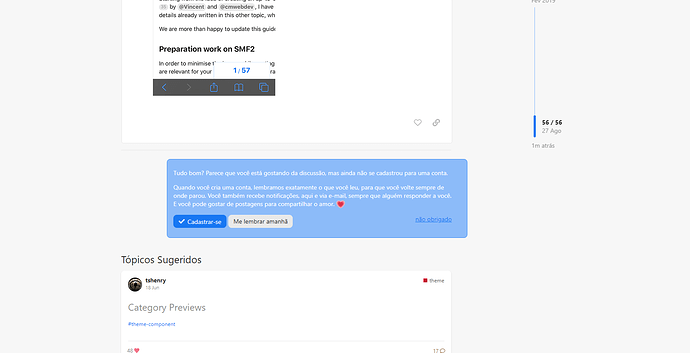](../../../assets/images/109079/22d28c56d9556eeb36b4bc0a0957016fc21f4a46.png "desktop")

---

### Post #67 by [Don](../../users/Don.md)
*Posted: 2020-08-28 07:24*

Hello,  
Create a theme component and add this code to the mobile css.
    
    
    .regular .container.posts{
        width: 100%;
    }
    

The other is the cta sign up on desktop css:
    
    
    .signup-cta{
        margin: 0;
    }

---

### Post #68 by [Eduardo_Braga](../../users/Eduardo_Braga.md)
*Posted: 2020-08-28 08:26*

 Don:

> Hello,  
>  Create a theme component and add this code to the mobile css.

better to wait for the theme creator to update

---

### Post #69 by [Don](../../users/Don.md)
*Posted: 2020-08-28 08:33*

That’s why I said create a theme component because you can simple delete it when the theme updated and it’s good until they not update the theme. But if you don’t want to use it in production then wait.

---

### Post #70 by [jordan.vidrine](../../users/jordan.vidrine.md)
*Posted: 2020-08-28 14:43*

The above issues have been fixed.

[@Don](/u/Don) thanks for bringing the issue of running this script even though a user wasnt logged in. This has also been fixed.

---

### Post #71 by [Don](../../users/Don.md)
*Posted: 2020-08-28 20:20*

Hello Jordan,

Has got errors when a new user register. The right sidebar not shown any information except welcome text and subhead but without name. So i know it shows the likes if there are some and badges too. Is that possible to make this sidebar to show likes and badges fix? I mean **0** ❤️ **recieved** , **0** ❤️ **given** and **no badges**. _You don’t have any badges yet… Check out how you get some…_ or something like this. So text or link if no badges yet.

Thank you! 🙂

The error code is for badges:

[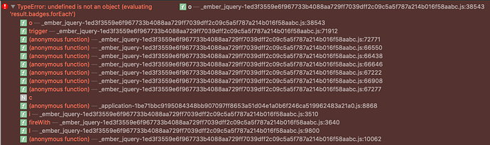](../../../assets/images/109079/6600eb3c7a33c1f08896046d926aa8d465abe2f2.png "Screen Shot 2020-08-28 at 9.57.53 PM")

---

### Post #72 by [haffax7](../../users/haffax7.md)
*Posted: 2020-09-10 23:42*

I would like to modify it as below.  
However, it does not work on the mobile screen.  
Can someone please help me on what to do.

I would like to make the link work for the topic excerpt and image.
    
    
    {{~raw-plugin-outlet name="topic-list-after-title"}}
    {{#unless topic.image_url}}
      {{#if topic.hasExcerpt}}
        <a href="{{topic.lastUnreadUrl}}" class="topic-excerpt-link">
          

            {{raw "list/topic-excerpt" topic=topic}}
          

        </a>
      {{/if}}
    {{/unless}}
    {{#if topic.image_url}}
    <a href="{{topic.lastUnreadUrl}}" class="topic-excerpt-link">
    

      
    

    </a>
    {{/if}}
    

This is the site I am testing.  

 [투데이16닷컴](https://today16.com/) 

### [투데이16닷컴](https://today16.com/)

한글 Discourse 테스트

---

### Post #73 by [Don](../../users/Don.md)
*Posted: 2020-09-11 09:32*

Use this in mobile header 👇  
``

---

### Post #74 by [Eduardo_Braga](../../users/Eduardo_Braga.md)
*Posted: 2020-09-12 04:41*

iPhone 6S

---

### Post #75 by [jordan.vidrine](../../users/jordan.vidrine.md)
*Posted: 2020-09-14 15:53*

I am testing this on Xcode simulator with iphone 6S and am not encountering this issue.

I have a couple questions:

Is this screenshot of you using [meta.discourse.org](http://meta.discourse.org) ?  
Which version of iOS are you using?  
Which web browser?

Thanks

---

### Post #76 by [chratec](../../users/chratec.md)
*Posted: 2020-09-23 14:14*

Does anyone try to play short video upload direct to discourse with Facebook theme on iOS phone?

Should I have missed something on config, but I can not play any uploaded video on phone. It’s working well on computer.

Any embedded video from Youtube working.

That why I do not know what happened, no errors, no warning.  
So please advice

---

### Post #77 by [Don](../../users/Don.md)
*Posted: 2020-09-23 14:36*

Yes, it is work perfect for me on any device. I think a theme is hard to cause this issue.  
Did you try to play in safe mode?  
Can you post the topic where the video so can check it.

---

### Post #78 by [chratec](../../users/chratec.md)
*Posted: 2020-09-23 14:40*

Hi [@Don](/u/Don)  
Yes, you should try at below link:  
[[Sưu tầm] Chuyên mục cười À ra Thế ! của Dr. VL - À ra Thế](https://arathe.com/pub/suu-tam-chuyen-muc-cuoi-arathe-cua-dr-vl)

Just tested and make sure that can not run on my iOS 11,

---

### Post #79 by [Don](../../users/Don.md)
*Posted: 2020-09-23 14:45*

iOS 11 is pretty outdated that cause the problem. I can play the video without any problem on iOS 14 and it works great.

---

### Post #80 by [chratec](../../users/chratec.md)
*Posted: 2020-09-23 14:46*

[@Don](/u/Don) Noted,

Thank you

---

### Post #81 by [SrhKnpp](../../users/SrhKnpp.md)
*Posted: 2020-11-05 21:35*

This is fantastic!

Also… is it possible to add a link to the sidebar intro area?

---

### Post #82 by [Eduardo_Braga](../../users/Eduardo_Braga.md)
*Posted: 2020-11-07 14:25*

where’s the link to add the theme?

---

### Post #83 by [JacobDK](../../users/JacobDK.md)
*Posted: 2020-11-11 02:11*

[github.com](https://github.com/discourse/fakebook-modern)

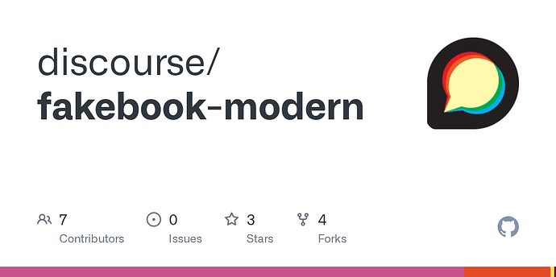

### [GitHub - discourse/fakebook-modern](https://github.com/discourse/fakebook-modern)

Contribute to discourse/fakebook-modern development by creating an account on GitHub.

---

### Post #85 by [hyd504](../../users/hyd504.md)
*Posted: 2020-11-23 05:07*

Hey I am learning discourse theme / plugin development. I really like Fakebook theme and I am using it to develop my understanding but I have a few questions.

The “javascripts/discourse/templates/mobile/list/topic-list-item.hbr” has 100% subset duplicate code from the “common/header.html”

My questions:

  1. Isn’t there a way to include a bhr file into html file so that we can just include topic-list-item.hbr into the common/header.html file instead of duplicating the code in two places?
  2. Why do we need topic-list-item.hbr in the first place? Shouldn’t the files in common folder apply to both: desktop and mobile?

---

### Post #86 by [awesomerobot](../../users/awesomerobot.md)
*Posted: 2020-11-24 22:13*

 hyd504:

> Isn’t there a way to include a hbr file into html file so that we can just include topic-list-item.hbr into the common/header.html file instead of duplicating the code in two places?

I don’t believe so… normally I could make a component that uses one template, and then I could include for the component in both overrides… but our topic list items are a special type of template built for performance (hbr = handlebars raw template), and raw templates can’t use components. (Some previous discussion in [Mounting widget in raw template? - #7 by angus](../../../assets/images/109079/72bbbf6c751805e1f94de65558039ecb96380330_2_690x86.png))

 hyd504:

> Why do we need topic-list-item.hbr in the first place? Shouldn’t the files in common folder apply to both: desktop and mobile?

That’s how Discourse’s CSS is structured (and some special HTML files for themes like header/footer/etc), but within the `javascripts/discourse/templates` directory those templates are direct overrides of Discourse defaults (when there’s not an override, the default templates are used).

In Discourse there are two templates: `/templates/list/topic-list-item.hbr` and `/templates/mobile/list/topic-list-item.hbr`. So since there are two templates, we need two overrides.

_Maybe_ there’s an easy way to point mobile to the non-mobile template in the JS… but if there is I’m not aware of it!

---

### Post #87 by [awesomerobot](../../users/awesomerobot.md)
*Posted: 2020-11-24 22:46*

Spoke too soon! I took a look and actually figured this out soon after I posted the above response. Sometimes writing things out can do that.

I’ve made an update so it’s just one template… by default in `topic-list-item.js` we have some code that looks like:
    
    
      renderTopicListItem() {
        const template = findRawTemplate("list/topic-list-item");
        if (template) {
          this.set("topicListItemContents", template(this).htmlSafe());
        }
      },
    

so if I override `const template` in the theme…
    
    
      renderTopicListItem() {
        const template = findRawTemplate("list/custom-topic-list-item");
        if (template) {
          this.set("topicListItemContents", template(this).htmlSafe());
        }
      },
    

This now points to a separate template, and since there’s no mobile counterpart by the same name… it also gets used for mobile. Thanks for inspiring the change with your question [@hyd504](/u/hyd504)!

---

### Post #88 by [Don](../../users/Don.md)
*Posted: 2020-11-25 00:19*

That’s really nice! 😊 I just changed on my site with Fakebook Modern theme  Thank you so much! ❤️

---

### Post #89 by [Mohit_Jindal](../../users/Mohit_Jindal.md)
*Posted: 2020-12-01 07:41*

[@awesomerobot](/u/awesomerobot) [@Don](/u/Don)

can you guys share links to some sample forums where I can see this theme in action?

---

### Post #90 by [Don](../../users/Don.md)
*Posted: 2020-12-01 07:48*

Hello,

Sure, you can see the Fakebook theme in theme creator:

 awesomerobot:

>  [Preview it on the theme creator ](https://theme-creator.discourse.org/theme/awesomerobot/fakebook)

Mine contains relatively much modification but you can see it here:

 [Vaperina](https://vaperina.cc)

### [Vaperina](https://vaperina.cc)

Vaperina segít a Vapereknek kapcsolatban maradni és egymást támogatva közösséggé kovácsolódni!

---

### Post #91 by [Mohit_Jindal](../../users/Mohit_Jindal.md)
*Posted: 2020-12-01 07:49*

Thanks [@Don](/u/don) .

Just to double check the Preview points to [GitHub - discourse/fakebook-modern](https://github.com/discourse/fakebook-modern) theme?

---

### Post #92 by [Don](../../users/Don.md)
*Posted: 2020-12-01 07:51*

Yes that is correct.  The first what I quote is Fakebook theme and the second one what I use is Fakebook Modern theme.

---

### Post #93 by [Mohit_Jindal](../../users/Mohit_Jindal.md)
*Posted: 2020-12-01 07:59*

Hey, [@Don](/u/Don) <https://theme-creator.discourse.org/> shows the latest topics directly, how do I configure this? I currently see categories as well which I don’t want to show in the center column to give the feel like a Facebook feed.

---

### Post #94 by [Don](../../users/Don.md)
*Posted: 2020-12-01 08:29*

You can configure it in admin settings. Or as a User in user settings.

**As a User:**

You can select in the interface area. [Click here!](https://meta.discourse.org/my/preferences/interface) and change the **Default Home Page** section.

* * *

**As an Admin:**

Go to this page: `/admin/site_settings/category/all_results?filter=Top%20menu`

And change this section:

[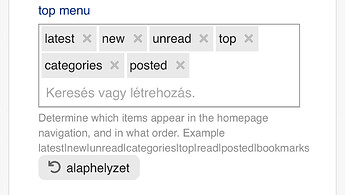](../../../assets/images/109079/6b499ec778a1b26f951e0fad105dcf9705d5f803.jpeg "image")

---

### Post #95 by [Mohit_Jindal](../../users/Mohit_Jindal.md)
*Posted: 2020-12-01 13:06*

Thanks [@Don](/u/Don)

This is exciting stuff. I wonder if there is a plugin that I can add which will allow me to have an entire suite of emojis on the “posts”? Well, I am essentially trying to explore if I can migrate my community from FB to Discourse to get more control over the data and have some on platform SEO advantages.

---

### Post #96 by [thegurjyot](../../users/thegurjyot.md)
*Posted: 2020-12-07 10:34*

This theme is actually quite good, but doesn’t it provide a way to have Custom CSS/HTML like the light and dark theme provide? I would have wanted the In House Ads to show in this theme but there’s no way to writer custom CSS in this theme…

Moreover, if we have category style to BOX then, the height of box is quite big.

---

### Post #97 by [Johani](../../users/Johani.md)
*Posted: 2020-12-07 10:50*

 thegurjyot:

> doesn’t it provide a way to have Custom CSS/HTML like the light and dark theme provide?

Have a look here

[Restrict editing of remote themes](https://meta.discourse.org/t/restrict-editing-of-remote-themes/170051) [Announcements](/c/announcements/67)

> For quite a while, best practice has been to avoid editing themes installed from a remote Git repository locally on Discourse. Any changes to theme code or uploads get wiped out when updating the theme from the remote repo. In this commit, we’ve removed the ability to locally edit a remote theme and are now enforcing this best practice in Discourse. What happens if I have a remote theme with local changes? Nothing at this point. Your theme stays as is until you remove it or update it from re… 

 thegurjyot:

> I would have wanted the In House Ads to show in this theme but there’s no way to writer custom CSS in this theme

You never needed to edit the theme’s CSS for house ads. You should create a new theme component with your CSS and add it to the theme.

[House Ad Templates](https://meta.discourse.org/t/house-ad-templates/122004) [Site Management](/c/documentation/site-management/53)

> House Ad Templates This guide provides templates for creating house ads using the [Official Discourse Ad Plugin](https://meta.discourse.org/t/advertising-plugin-for-discourse-serve-ads-on-your-discourse-forum/33734). ⚠️ Important: Disable ad blockers (including those built in to browsers, e.g. Brave) before working with these ad customizations. Before You Start Create a “House Ads” [theme component](https://meta.discourse.org/t/beginners-guide-to-using-discourse-themes/91966) to store: CSS for your house ads [Uploaded images](https://meta.discourse.org/t/include-images-and-fonts-in-themes-and-components/62459) used in ads Add the component to all active themes where ads will appear Optimize images using [TinyPNG](https://tinypng.com) to reduce file size while maintain… 

 thegurjyot:

> Moreover, if we have category style to BOX then, the height of box is quite big.

This is a potential improvement 👍

Can you please let me know where you see this issue?

---

### Post #98 by [thegurjyot](../../users/thegurjyot.md)
*Posted: 2020-12-07 11:02*

 Johani:

> You never needed to edit the theme’s CSS for house ads. You should create a new theme component with your CSS and add it to the theme.

That’s a valid point for sure and I’ll make sure to make the change as soon as possible on my website.

 Johani:

> This is a potential improvement 👍
> 
> Can you please let me know where you see this issue?

Here’s an image to show the issue. You can also see that the “#” in front of categories is also miss-aligned somehow.  

[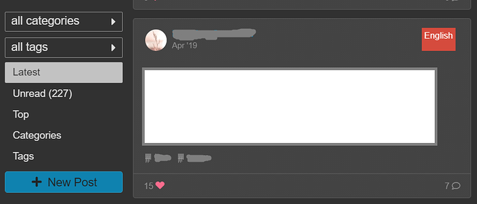](../../../assets/images/109079/4cabf3cd151c4ae64143970b1a59a346e05e9578.png "fakebook demo")

---

### Post #99 by [hyd504](../../users/hyd504.md)
*Posted: 2021-01-14 10:59*

**The profile section of Fakebook theme needs some padding.**

[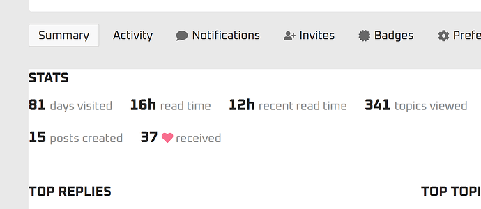](../../../assets/images/109079/e1a115e76a421fc75d94a592e856fe8579392cbc.png "image")

---

### Post #100 by [Cédric_DANIEL](../../users/Cédric_DANIEL.md)
*Posted: 2021-01-18 15:50*

Hello,  
Is it possible to see your website please ? It helps me to understand this theme.  
Thx a lot 🙂  
Cédric

---

### Post #101 by [Don](../../users/Don.md)
*Posted: 2021-01-18 16:13*

Hello,  
Sure!  You can see it here: 

 [Vaperina](https://vaperina.cc)

### [Vaperina](https://vaperina.cc)

A Vaperina segít a Vapereknek kapcsolatban maradni és egymást támogatva közösséggé kovácsolódni!

---

### Post #102 by [Jack_Ukleja](../../users/Jack_Ukleja.md)
*Posted: 2021-02-10 18:15*

Love this theme. Great work [@awesomerobot](/u/awesomerobot) and [@jordan.vidrine](/u/jordan.vidrine) 👍

Not sure where to lodge bug reports & suggestions for Facebook-modern so am just dropping them here for now:

  * Global pinned topics i.e. banners, push the left-hand navigation bar over to the right
  * Banners are slightly illegible due to light blue background and dark blue hyperlinks
  * Links for topic on the topic list appear to be links to most recent comment, not to OP. This is confusing for users as they often end up seeing nothing but the ‘footer’ after clicking a topic.
  * Suggested topics are left-aligned, whereas the current topic is centred. I guess it would look better all centred?
  * Be awesome if the onebox previews for topics generated from hyperlinks, were actually hyperlinked. i.e. if you click the image it will take you to the external site. Currently the image is not hyperlinked at all. Also be great if these opened in a new tab.
  * Be great if the end of the excerpt read **See more** instead of `Read more...` (also made bold to match FB)
  * Clicking the little speech bubble at the bottom of a topic, bring up a strange up/down spinner with timestamps that appears to take you the prev/next post (?). This is confusing. I assume this might be a bug?
  * Onebox images are not displaying in the Topic list previews. Although they seemed to be intially, I’m wondering if this was only in the ‘leftover’ posts from when I was testing TLP?

I may make some PRs for this once I figure out my way around Discourse a bit more! Cheers

---

### Post #104 by [png](../../users/png.md)
*Posted: 2021-02-10 18:47*

Great! Now you gotta do Twitter or Insta 😆

Ok, but all jokes aside, this is a greatly created theme, and it looks similar to FaceBook. must have taken a long time to create it.

---

### Post #105 by [Jack_Ukleja](../../users/Jack_Ukleja.md)
*Posted: 2021-02-11 10:59*

Does anyone know how you get the onebox previews to work for plain websites? They only seem to work for me if I use a YouTube link.

I’m talking about in the topic list. Once you click into the topic the oneboxes seem to work universally.

---

### Post #106 by [gmm.su](../../users/gmm.su.md)
*Posted: 2021-02-23 11:26*

how do I fix this?

[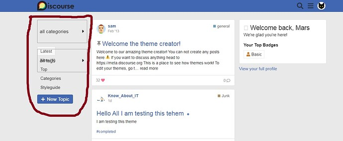](../../../assets/images/109079/875f4f3d8739a07a6caeb2ced1e6e2281cc05a69.jpeg "Безымянный")

There is also a problem when you go to the category page

[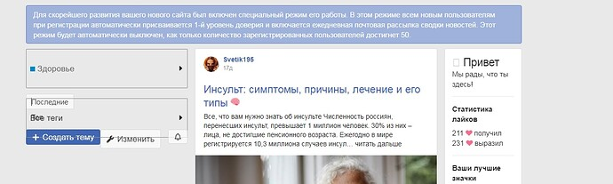](../../../assets/images/109079/de4bf6f916278ca84e1f27f8a3576c68530b94ff.jpeg "2")

---

### Post #107 by [awesomerobot](../../users/awesomerobot.md)
*Posted: 2021-02-26 22:03*

Thanks for letting me know! I’ve updated the theme with some fixes.

---

### Post #108 by [Pandabear](../../users/Pandabear.md)
*Posted: 2021-03-16 20:04*

Can somebody help me? I have the theme installed on my website  
My forum is [www.holaforo.com](http://www.holaforo.com)  
I would like it to have these functions:  

[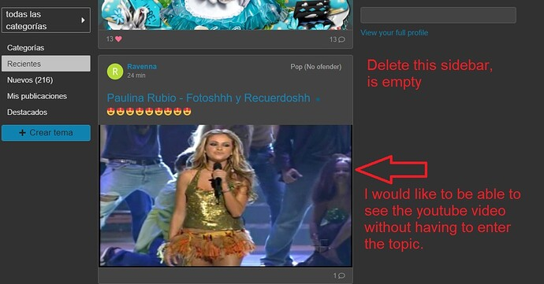](../../../assets/images/109079/e9d0746b5f38a4c1b72d9ab0b12ba55bd50eb2ca.jpeg "themefakebook")

  
Does anyone know the way that the initial post looks whole in the latest news?

---

### Post #109 by [anon82467725](../../users/anon82467725.md)
*Posted: 2021-03-17 00:57*

Does Fakebook work with [Retort](https://meta.discourse.org/t/retort-a-reaction-style-plugin-for-discourse/35903) and [Discourse Reactions](https://meta.discourse.org/t/discourse-reactions-beyond-likes/183261)?

---

### Post #110 by [Zup](../../users/Zup.md)
*Posted: 2021-03-19 03:49*

i want the theme to be applied only for ‘Latest’ and ‘Top’ and certain categories. possible?

---

### Post #111 by [pmusaraj](../../users/pmusaraj.md)
*Posted: 2021-03-19 03:58*

No, that’s not possible.

---

### Post #112 by [anon82467725](../../users/anon82467725.md)
*Posted: 2021-03-19 11:23*

Personally, I would like to see a Google+ theme. Just throwing it out there. I definitely dont miss Google+ or anything like that… 😅  

[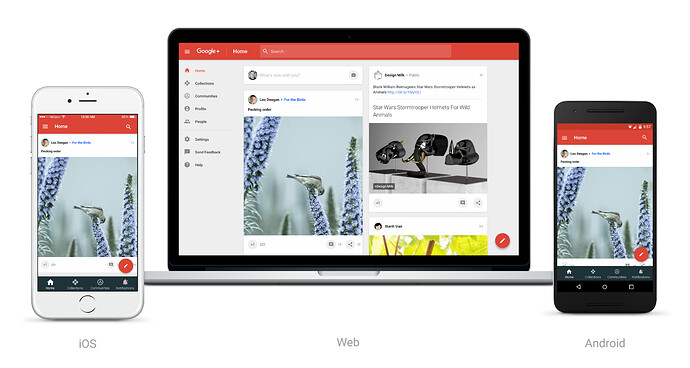](../../../assets/images/109079/21dcac09d6aaa17145bbd5bfd3613b5c5875fec4.jpeg "image")

  
Regardless, Fakebook is one of my favorite themes for Discourse.

---

[← Previous](109079.md) | **Page 2 of 3** | [Next →](109079-page-3.md)
