[🏠 Home](../../index.md) | [📋 Latest](../../latest/index.md) | [🔥 Top](../../top/replies/index.md) | [👥 Users](../../users/index.md)

[Home](../../index.md) » [Theme](../../c/theme/index.md) » Fakebook Theme

---

# Fakebook Theme (Page 3 of 3)

> **Category:** Theme
> **Author:** merefield
> **Created:** 2019-02-13 20:18

[← Previous](109079-page-2.md) | **Page 3 of 3** | Next →

---

### Post #113 by [merefield](../../users/merefield.md)
*Posted: 2021-03-19 11:31*

You could achieve most of that pretty quickly with the Layouts Plugin + a sidebar of choice + TLP (TC) or TLThumb

---

### Post #114 by [anon82467725](../../users/anon82467725.md)
*Posted: 2021-03-19 11:33*

Yes, that’s true. I guess I would just like to see it have its own theme. I will do what you said though, thank you.

---

### Post #115 by [Don](../../users/Don.md)
*Posted: 2021-03-19 12:26*

I think that’s not possible because that is the generated thumbnail or the first image of the topics.

---

### Post #116 by [Zup](../../users/Zup.md)
*Posted: 2021-03-19 21:36*

would be better if thumbnails weren’t created for videos then - instead, embed from YouTube/Vimeo.

---

### Post #117 by [Zup](../../users/Zup.md)
*Posted: 2021-03-19 21:43*

 merefield:

> Layouts Plugin + a sidebar of choice + TLP (TC)

would this option include User Wall, or is the TLP plugin required for that? and correct me if i’m wrong, but TLP plugin means the sidebars would goof up displaying of topics, right?

seems like TLP (TC) would be the best option for a new growing site with not much content, yes?

---

### Post #118 by [merefield](../../users/merefield.md)
*Posted: 2021-03-19 22:00*

The TC flavour is responsive to sidebars and has the portfolio/user wall. Best to discuss that in the ‘plugins’ topic.

---

### Post #119 by [lhkjacky](../../users/lhkjacky.md)
*Posted: 2021-03-19 23:27*

It is a tough choice.   
Fakebook Theme can only work with TLP (TC) but not TLP (Plugin).

However, in Fakebook Theme, Topic list is arrange in single column.  
Since, Chrome (Desktop) have limitation of 1000 row, in my case, post will overlapping each other after showing 30 posts.  
(2 column → around 60 posts, 3 column → around 90 posts)

That is why I prefer using Layout Plugin for sidebar + TLP (Plugin). 

---

### Post #120 by [Zup](../../users/Zup.md)
*Posted: 2021-03-19 23:32*

 lhkjacky:

> That is why I prefer using Layout Plugin for sidebar + TLP (Plugin)

TLP plugin because of that Chrome bug and no other reason, right? otherwise you’d use TLP TC?

---

### Post #121 by [lhkjacky](../../users/lhkjacky.md)
*Posted: 2021-03-20 00:13*

 Zup:

> TLP plugin because of that Chrome bug and no other reason, right?

That is the major reason.   
The design of Fakebook Theme is unique, fun and interesting.   
But if you want a much feature rich sidebar, you may prefer the Layout Plugin.

---

### Post #122 by [hyd504](../../users/hyd504.md)
*Posted: 2021-03-24 16:15*

On iPhone Safari, the homepage doesn’t maintain its position when the user navigates back using the back button when using Fakebook theme. On pressing back, the page scrolls to a random position in the timeline making it unusable. I understand Safari is not meant to be used in the first place but unfortunately Home Screen websites are opened using Safari’s rendering engine. I wasn’t able to reproduce this issue for the standard theme used here on meta. And this only happens on Safari not chrome.

It is important because it impacts users using the Home Screen button to access the website.

[@awesomerobot](/u/awesomerobot)

---

### Post #124 by [Joshua_Kogan](../../users/Joshua_Kogan.md)
*Posted: 2021-04-08 14:02*

hi [@Don](/u/Don), I really like your site. how did you add those link buttons (i guess banner) to the top of the page?

---

### Post #125 by [Joshua_Kogan](../../users/Joshua_Kogan.md)
*Posted: 2021-04-08 14:48*

I’m running fakebook modern and I have deleted all plugins on my site, and this is happening in the left sidebar:

[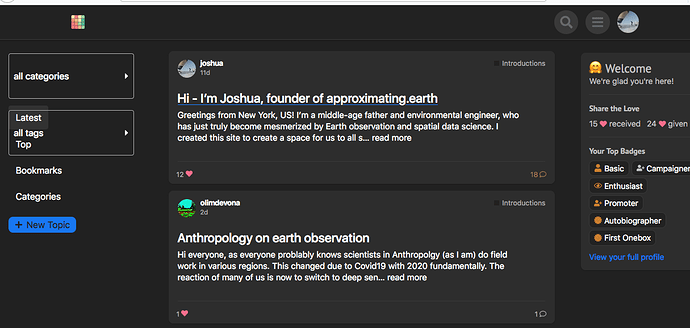](../../../assets/images/109079/bb0c1b8e820ac87b7c482c3796ac5148239c7f4e.png "Screen Shot 2021-04-08 at 10.44.18 AM")

Also, this is happening at the bottom of my topics – buttons and controls forced left:  

[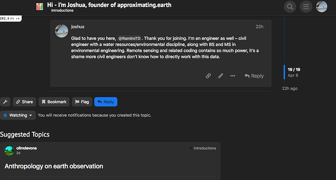](../../../assets/images/109079/0fb3189250375391762e37ed02efad8e0a7000c8.png "Screen Shot 2021-04-08 at 10.46.51 AM")

How to fix these issues?

---

### Post #126 by [sok777](../../users/sok777.md)
*Posted: 2021-04-22 16:51*

[@awesomerobot](/u/awesomerobot) once again thanks so much for this great theme.

One bug that I have - if I want display sub categories at the top of a category page, then the list below of the topics becomes **extremely** narrow. Not sure why.

Is there a workaround?

---

### Post #127 by [daniyal](../../users/daniyal.md)
*Posted: 2021-05-02 14:36*

[@awesomerobot](/u/awesomerobot) I am having a slight issue with the theme. Selected tab’s text is unreadable in the invitation panel when using Fakebook  

[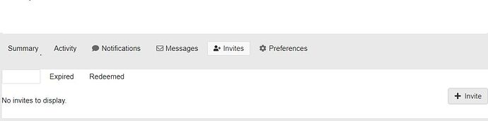](../../../assets/images/109079/17cc3f6db9ab66dea076b68872d3982c82f4aac9.jpeg "Capture")

I have also made a pull request for this

[github.com/discourse/Fakebook](../../../assets/images/109079/21dcac09d6aaa17145bbd5bfd3613b5c5875fec4_2_1035x552.jpeg)

####  [Update admin controls active option background color](../../../assets/images/109079/21dcac09d6aaa17145bbd5bfd3613b5c5875fec4_2_1035x552.jpeg)

`main` ← `danymajeed:main`

merged 09:12PM - 07 May 21 UTC

[  danymajeed ](https://github.com/danymajeed)

[ +1 -0 ](https://github.com/discourse/Fakebook/pull/2/files)

Hi, The background color and text color of selected option is same in invited […](../../../assets/images/109079/21dcac09d6aaa17145bbd5bfd3613b5c5875fec4_2_1035x552.jpeg)panel of discourse 

Can you please check? thanks

---

### Post #128 by [png](../../users/png.md)
*Posted: 2021-05-05 14:14*

Google be wanting to make the users love Google+, and then later throw it off a cliff.  
But on-topic, this is an amazing idea, the UI of Google+ is pretty good.

---

### Post #129 by [jordan.vidrine](../../users/jordan.vidrine.md)
*Posted: 2021-05-10 19:03*

These issues should now be fixed with my latest update to the theme (Fakebook Modern)

---

### Post #130 by [thegurjyot](../../users/thegurjyot.md)
*Posted: 2021-05-25 09:43*

 thegurjyot:

>  Johani:
>
>> You never needed to edit the theme’s CSS for house ads. You should create a new theme component with your CSS and add it to the theme.
> 
> That’s a valid point for sure and I’ll make sure to make the change as soon as possible on my website.
> 
>  Johani:
>
>> This is a potential improvement 👍
>>
>>> Can you please let me know where you see this issue?
> 
> Here’s an image to show the issue. You can also see that the “#” in front of categories is also miss-aligned somehow.

These issues are still standing. Can someone please fix these so that this theme becomes way more usable?

---

### Post #131 by [haffax7](../../users/haffax7.md)
*Posted: 2021-06-26 21:59*

I want to use [Discourse Reactions](https://meta.discourse.org/t/discourse-reactions-beyond-likes/183261) for this theme.  
Can someone please update the list page to show Discourse Reactions?

---

### Post #132 by [rsmithlal](../../users/rsmithlal.md)
*Posted: 2021-07-19 14:36*

I noticed this issue too. The formatting breaks when the category subcategories are turned on. I’ve been able to correct some of the formatting issue so it displays sensibly by using the following SCSS in a custom theme component:
    
    
    body.categories-list.category {
        .category-heading {
            p {
                font-size: var(--font-up-1);
            }
        }
    
        table.topic-list tr.topic-list-item > div.main-link {
            display: table-cell;
            width: 100%;
            
            .link-middle-line > .topic-image {
                margin: 10px 0;
                > img {
                    width: 100%;
                }
            }
        }
    }
    

Still a bit of work to go to make it behave as normal, though. I think it is a bug in the theme. I will take a look when I get a chance and see if I can identify the issue and fix it. I’d like to display subcategories, and it’s not possible in the current code version.

[@awesomerobot](/u/awesomerobot) let me know how I can help =) If you have any pointers or ideas, I’m all ears.

---

### Post #133 by [楚人西](../../users/楚人西.md)
*Posted: 2021-08-06 12:01*

The space layout is unreasonable, and the classification selection actually accounts for one-third of the width! Perhaps it would be better to re-adjust the proportions of the various components in the interface.  
In addition, can the topic style be made into a component separately? I like this way of displaying part of the content and pictures directly.

---

### Post #134 by [neo](../../users/neo.md)
*Posted: 2021-08-13 06:01*

Hello,

It’s really a very nice customization ❤️ ❤️ ❤️. Is it possiable to have your “Fakebook Modern Plus” theme?

---

### Post #135 by [anon73664359](../../users/anon73664359.md)
*Posted: 2021-08-17 02:54*

I am actually interested in knowing the same thing. I’ve been thinking about it for a while. I’m glad I came across your post.

If there is a way to replicate (at least) most of the looks and functionality of Google+ VIA themes and plugins, I would be all for it!

Here are some images I could find online. The entirety of Google+ was not archived well in its final days.  
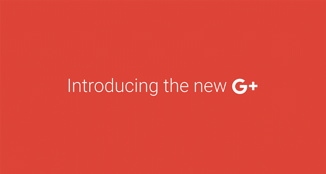  
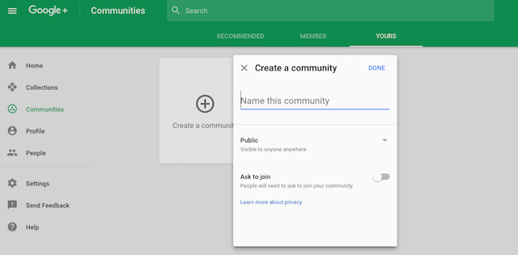  

[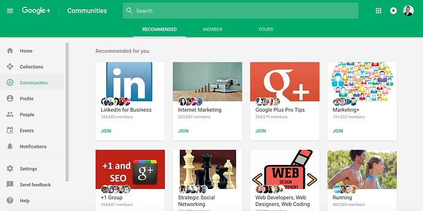](../../../assets/images/109079/25fe8634dd7e79f7f1bf6473dc5d3c2a1de795ea.jpeg)

  
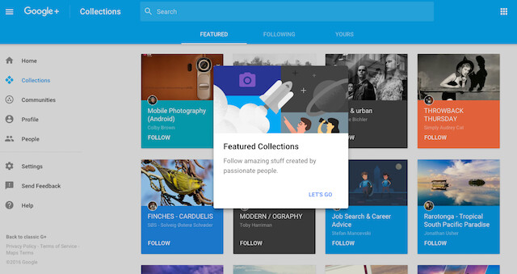

---

### Post #136 by [cmdntd](../../users/cmdntd.md)
*Posted: 2022-01-04 01:33*

Could you have more option to be the same as facebook?

  1. **Hide title**
  2. **Image first**
  3. Multi image layout
  4. Icon font

---

### Post #137 by [Olivier_Lambert](../../users/Olivier_Lambert.md)
*Posted: 2022-06-09 15:01*

Hey guys, would it be possible to tell the theme to only customize the feed section and leave the inbox alone? It’s not a very clean UI for messaging lol.

---

### Post #138 by [Pandiyan](../../users/Pandiyan.md)
*Posted: 2022-06-28 04:45*

Hi [@awesomerobot](/u/awesomerobot) and Team,  
I would like to know how to customize this Fakebook theme, because I have implemented this theme in my application, I need to changes some css styles but I couldn’t find any editor to override the existing css. Please let me know how to achieve that.

Can someone please tell whether it is possible or not. Thank You !

---

### Post #139 by [awesomerobot](../../users/awesomerobot.md)
*Posted: 2022-06-28 14:27*

There are a couple different ways you can go to customize an existing theme:

  * You can add a new theme component, and override the Fakebook theme’s CSS in that theme component. This is the recommended way for minor edits, as you’d still be able to get updates to the underlying theme. There are some guides here on Meta that should help:

    * [Beginner's guide to using Discourse Themes](https://meta.discourse.org/t/beginners-guide-to-using-discourse-themes/91966)
    * [Developer’s guide to Discourse Themes](https://meta.discourse.org/t/developer-s-guide-to-discourse-themes/93648)
  * Alternatively, you can fork the Fakebook theme on Github and make edits to your own copy, and then install that.

    * Github has some onboarding if you haven’t used it before: [Getting started with your GitHub account - GitHub Docs](https://docs.github.com/en/get-started/onboarding/getting-started-with-your-github-account)
    * Github’s fork documentation: [Fork a repo - GitHub Docs](https://docs.github.com/en/get-started/quickstart/fork-a-repo)

---

### Post #140 by [tmn](../../users/tmn.md)
*Posted: 2022-08-03 14:06*

please fix it. Or just put simple 1 color

[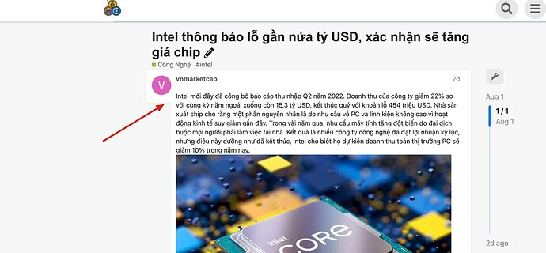](../../../assets/images/109079/0ce079a421831f848c72b1b2b0d9f0e4ee270a1f.jpeg "image")

Or bellow:  

[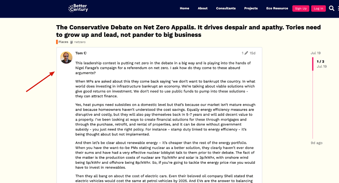](../../../assets/images/109079/9748f9bfaebaad50e286a580db34ddca9291505d.png "image")

---

### Post #141 by [tmn](../../users/tmn.md)
*Posted: 2022-08-14 04:34*

I think Fakebook theme very closed to Gettr’s layout below

[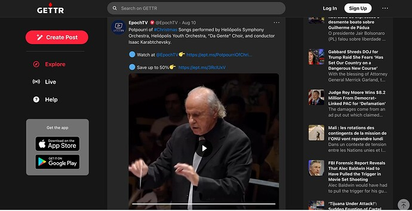](../../../assets/images/109079/e18e36889b75ebda631e7fca4a7776a32b972743.jpeg "image")

 [GETTR - The Marketplace of Ideas](https://gettr.com/trending)

### [GETTR - The Marketplace of Ideas](https://gettr.com/trending)

GETTR is a brand new social media platform founded on the principles of free speech, independent thought and rejecting political censorship and “cancel culture”. With best in class technology, our goal is to create a marketplace of ideas in order to...

Hope we will have a nice and usefull theme like that. 😀

---

### Post #142 by [merefield](../../users/merefield.md)
*Posted: 2022-08-14 07:47*

Just use [Topic List Previews](https://meta.discourse.org/t/topic-list-previews-theme-component/209973) (tiles) or [Topic List Thumbnails](https://meta.discourse.org/t/topic-list-thumbnails/150602) with [Layouts Plugin](https://meta.discourse.org/t/custom-layouts-plugin/55208) and a right and left sidebar.

---

### Post #143 by [tmn](../../users/tmn.md)
*Posted: 2022-08-15 03:42*

Thanks. I am currently use Topic List Preview. Working perfectly!

I just tested Layout Plugin, a little more complicated.

I hope sidebar will be officially in Discourse. 

---

### Post #144 by [merefield](../../users/merefield.md)
*Posted: 2022-08-17 06:37*

Feel free to ask for support on the Layouts Topic. It’s pretty straightforward. Just add widgets by installing them as theme components and then select them in the plugin settings.

---

### Post #145 by [keegan](../../users/keegan.md)
*Posted: 2022-09-01 15:16*

This has now been resolved with the following PR:

[github.com/discourse/Fakebook](https://github.com/discourse/Fakebook/pull/11)

####  [UX: Fix post cards not full height under avatar](https://github.com/discourse/Fakebook/pull/11)

`main` ← `ux-fix-post-cards`

merged 03:15PM - 01 Sep 22 UTC

[  keegangeorge ](https://github.com/keegangeorge)

[ +8 -0 ](https://github.com/discourse/Fakebook/pull/11/files)

This PR fixes a UI bug with posts (as mentioned [here](https://meta.discourse.or[…](https://github.com/discourse/Fakebook/pull/11)g/t/fakebook-a-theme-for-social-media-lovers/109079/140?u=keegan)): **Before:**  **After:** 
  *[PR]: Pull Request

---

### Post #147 by [juanjosepablos](../../users/juanjosepablos.md)
*Posted: 2022-11-06 20:04*

How can I add image preview on the suggested topics?
  *[PR]: Pull Request

---

### Post #148 by [Don](../../users/Don.md)
*Posted: 2022-11-06 20:38*

Hello,

Create a new theme component or add this to an existing one.

Add to Common / CSS

This will display the topic image on suggested topics.
    
    
    #suggested-topics {
      .topic-list .main-link {
        .link-middle-line {
          .topic-image,
          img {
            display: block;
          }
        }
      }
    }
    

* * *

If you want to add the topic excerpt too then use this code snippet instead of the previous.

This will display the topic image and topic excerpt on suggested topics.
    
    
    #suggested-topics {
      .topic-list .main-link {
        .link-middle-line {
          .topic-image,
          img {
            display: block;
          }
        }
        .topic-excerpt {
          display: block;
        }
      }
    }
    
  *[PR]: Pull Request

---

### Post #149 by [juanjosepablos](../../users/juanjosepablos.md)
*Posted: 2022-11-08 19:45*

I have just created a theme component (fakebook-preview-suggested-topics).  
I am happy to share if anyone is interested (Just click Like).
  *[PR]: Pull Request

---

### Post #150 by [rokejulianlockhart](../../users/rokejulianlockhart.md)
*Posted: 2023-05-04 20:07*

~~But this is the old Facebook theme.~~

  2019. 

  *[PR]: Pull Request

---

### Post #151 by [darkpixlz](../../users/darkpixlz.md)
*Posted: 2023-05-04 21:17*

If you’re looking for a newer one, the [FKB Pro](https://meta.discourse.org/t/fkb-pro-social-theme/234323) theme is a good pick.
  *[PR]: Pull Request

---

### Post #152 by [Moin](../../users/Moin.md)
*Posted: 2025-08-11 14:29*

I have the impression the theme needs an update.  

[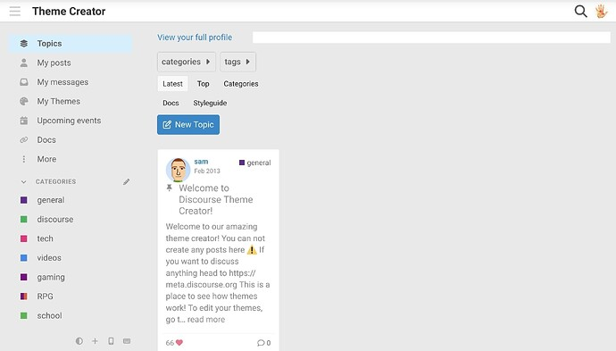](../../../assets/images/109079/80e69ba69806afaa5ac9ccfc9426852b9724253c.jpeg "Screenshot_20250811_082624_Firefox")

Similar result in Chrome  

[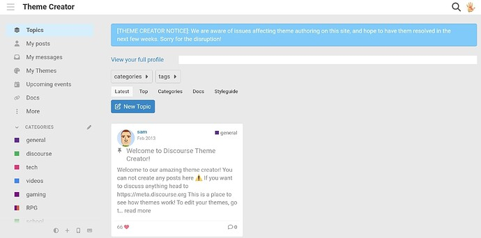](../../../assets/images/109079/b5d9fced2ac8f5b3959754c1229f62e50af28789.jpeg "Screenshot_20250811_163731_Chrome")

But it looks better when you are logged out  

[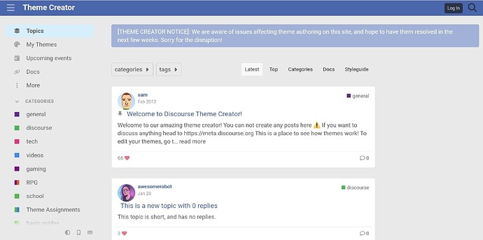](../../../assets/images/109079/3b3deefad11784157c241fdc1451978a84d8b7b4.jpeg "Screenshot_20250811_163445_Chrome")
  *[PR]: Pull Request

---

### Post #153 by [awesomerobot](../../users/awesomerobot.md)
*Posted: 2026-02-03 18:41*

Thanks for mentioning it, I’ve done some maintenance here

[github.com/discourse/Fakebook](https://github.com/discourse/Fakebook/pull/53)

####  [UX: general layout fixes for core changes (#53)](https://github.com/discourse/Fakebook/pull/53)

`main` ← `general-fixes`

merged 06:40PM - 03 Feb 26 UTC

[  awesomerobot ](https://github.com/awesomerobot)

[ +55 -14 ](https://github.com/discourse/Fakebook/pull/53/files)

This layout was generally broken due to core changes, this fixes it and some oth[…](https://github.com/discourse/Fakebook/pull/53)er minor regressions I noticed Before  After 

Since this theme predates the Discourse sidebar, it also seems worth mentioning that this is best used with the site setting `Navigation menu` set to dropdown
  *[PR]: Pull Request

---

[← Previous](109079-page-2.md) | **Page 3 of 3** | Next →
