[🏠 Home](../../index.md) | [📋 Latest](../../latest/index.md) | [🔥 Top](../../top/replies/index.md) | [👥 Users](../../users/index.md)

[Home](../../index.md) » [Theme](../../c/theme/index.md) » Fakebook Theme

---

# Fakebook Theme (Page 1 of 3)

> **Category:** Theme
> **Author:** Discourse
> **Created:** 2019-02-13 20:18

← Previous | **Page 1 of 3** | [Next →](109079-page-2.md)

---

### Post #1 by [Discourse](../../users/Discourse.md)
*Posted: 2019-02-13 20:18*

|  |   
---|---|---  
 | **Summary** |  **Fakebook** \- I had a little fun with this one to showcase the flexibility of our theming system. This layout might look a bit familiar 😉   
👓 | **Preview** | [Preview on Discourse Theme Creator](https://discourse.theme-creator.io/theme/Discourse/fakebook-theme)  
🛠️ | **Repository Link** | <https://github.com/discourse/Fakebook>  
📖 | **New to Discourse Themes?** | [Beginner’s guide to using Discourse Themes](https://meta.discourse.org/t/beginners-guide-to-using-discourse-themes/91966)  
  
Install this theme

>  As this is an [official](/tag/official) theme maintained by the Discourse team, [Support](/c/support/6) issues, [Bug](/c/bug/1) reports, [UX](/c/ux/9) suggestions, and requests for [Dev](/c/dev/7) advice can be made in the respective categories here on Meta, and tagged with the appropriate theme tag. Click on a link below to get one started. 👍
> 
> ` [❓ **Support**](https://meta.discourse.org/new-topic?category_id=6&tags=fakebook-theme "Ask for support on configuring and using the Fakebook Theme") ` ` [🐛 **Bug**](https://meta.discourse.org/new-topic?category_id=1&tags=fakebook-theme "A bug report means something is broken, preventing normal/typical use of the theme") ` ` [👀 **UX**](https://meta.discourse.org/new-topic?category_id=9&tags=fakebook-theme "Discussion about the user interface of the Fakebook Theme, and how features are presented \(including language and UI elements\)") ` ` [ **Dev**](https://meta.discourse.org/new-topic?category_id=7&tags=fakebook-theme "Advice on how to customise this theme for your site")`

###  Features

The theme features a navigation sidebar, as well as a sidebar that showcases some of your user profile information. If a topic has an image, the topic list shows a preview. Topic excerpts will be displayed on all topics.

[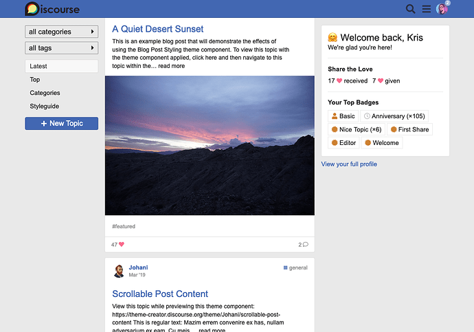](../../../assets/images/109079/1d48f1560be09ddbc91475f514a1c84ca6001846.png "Screen Shot 2021-05-07 at 7.00.10 PM")

Preview with topic excerpt:

[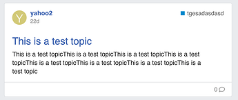](../../../assets/images/109079/9a1efb88f156825fc069c2da6061ef34ab46d267.png "28%20PM")

In the theme settings you’ll find a few options for hiding sidebar content, or switching the sidebar sides.

I recommend using the “Categories Only” category page layout with this theme, as space in the main column very limited.

###  Settings

Name | Description  
---|---  
sidebar alignment |   
sidebar show intro |   
sidebar show likes |   
sidebar show badges |   
  
Translation | Default  
---|---  
sidebar.welcome |   Welcome  
sidebar.back | back,  
sidebar.welcome_subhead | We’re glad you’re here!  
sidebar.likes_header | Share the Love  
sidebar.badges_header | Your Top Badges  
sidebar.full_profile | View your full profile  
  
  

>  **Hosted by us?** Themes are available to use on our Standard, Business, and Enterprise plans.

> Last edited by [@JammyDodger](/u/jammydodger) 2024-06-17T11:52:39Z
> 
> Check documentPerform check on document:

---

### Post #2 by [awesomerobot](../../users/awesomerobot.md)
*Posted: 2019-02-13 20:21*

I still have a few open todos on this one:

Better handling of images in topic list (They indiscriminately pull images from oneboxes if there’s one in the OP, and these don’t work well as previews)

Include sidebars on tag pages (I don’t have a class to differentiate filtered tag pages from the tag directory)

---

### Post #3 by [TheBestPessimist](../../users/TheBestPessimist.md)
*Posted: 2019-02-14 05:25*

The name is pretty good though :))

---

### Post #4 by [Pad_Pors](../../users/Pad_Pors.md)
*Posted: 2019-02-14 06:36*

nice work 👏 thanks.

for rtl languages, it seems it needs some slight css tweaks for the user avatar as well as comments:

[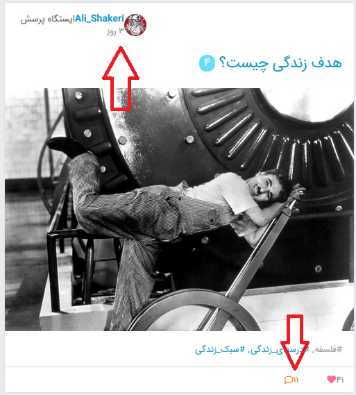](../../../assets/images/109079/ad7b1a7cea4b3dfc997883e9555add6c0b219d38.jpeg "image.jpg")

the category drop-down menu, unlike tag drop-down menu, comes into the topic list:

[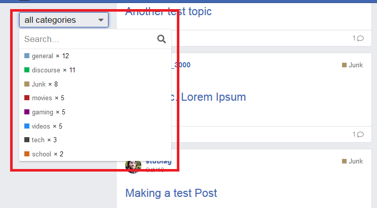](../../../assets/images/109079/9b9ffc784c1f81472f9179a4147e2df7edc1a7b1.png "image.png")

in the topic pages, margins and paddings for post are not tuned for rtl:

[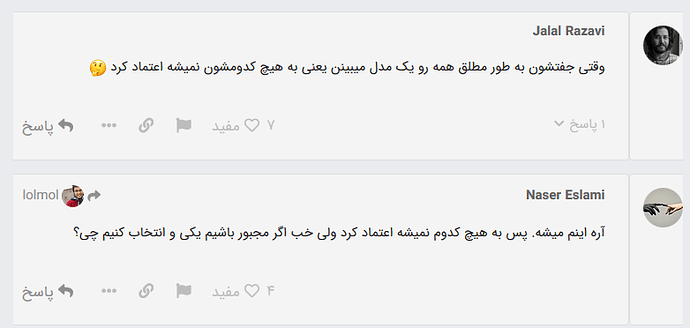](../../../assets/images/109079/68f5b6e45ac308ee9c935c4d19186443c4e2949d.png "image.png")

---

### Post #7 by [Eduardo_Braga](../../users/Eduardo_Braga.md)
*Posted: 2019-02-18 20:29*

Can you change colors?

I want to keep the original color discourae but with this facebook layout

---

### Post #9 by [mymario](../../users/mymario.md)
*Posted: 2019-02-24 11:46*

I loooove it!!

Fantastic work [@awesomerobot](/u/awesomerobot)

---

### Post #10 by [markersocial](../../users/markersocial.md)
*Posted: 2019-03-25 15:36*

Fantastic theme! Great work and thanks for sharing 🙂

Really want to implement your theme but I’m getting a bit of an issue with the topic lists. Do you know what could be causing this? Have been combing through admin settings.

[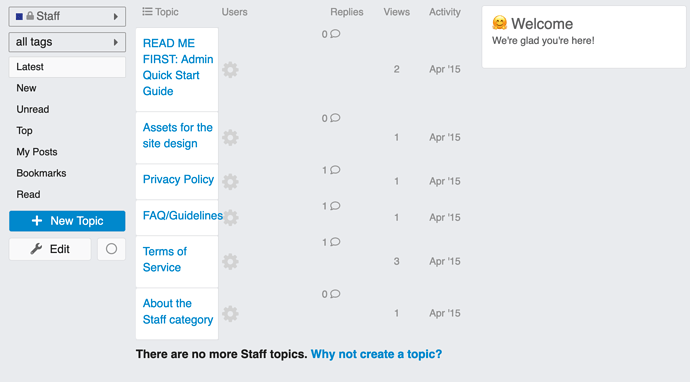](../../../assets/images/109079/dceca7c8411465886330d44be14169d8da854493.png "36%20PM")

---

### Post #11 by [thaidb](../../users/thaidb.md)
*Posted: 2019-05-02 12:44*

Hello!  
What is my error theme?

[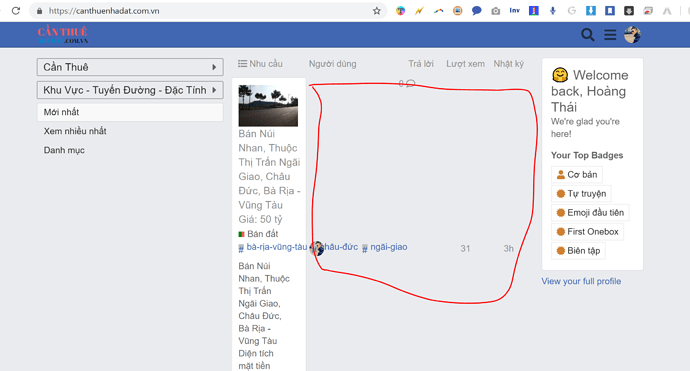](../../../assets/images/109079/32477309ad8ad37375c147e310e3f6e472e7640f.png "image.png")

---

### Post #12 by [zogstrip](../../users/zogstrip.md)
*Posted: 2019-05-02 22:41*

I don’t think that theme supports RTL right now.

---

### Post #13 by [thaidb](../../users/thaidb.md)
*Posted: 2019-05-03 07:06*

Sorry, what is RTL  
Thank you!

---

### Post #14 by [thaidb](../../users/thaidb.md)
*Posted: 2019-05-03 15:31*

Your error theme same me, don’t same demo

---

### Post #15 by [Marishaan](../../users/Marishaan.md)
*Posted: 2019-05-03 19:48*

Does this theme enable all users to easily upload videos? How would they do this?

---

### Post #16 by [danekhollas](../../users/danekhollas.md)
*Posted: 2019-05-03 23:18*

Right-to-left language

---

### Post #17 by [Johani](../../users/Johani.md)
*Posted: 2019-05-06 04:48*

From your previous posts, I know you use the topic list previews plugin. The topic list previews plugin is **not compatible** with this theme. So you have to decide whether you want to use this theme or the topic list previews plugin. You can’t use both.

---

### Post #18 by [thaidb](../../users/thaidb.md)
*Posted: 2019-05-06 05:11*

Thank joe so much!  
I will decide

---

### Post #19 by [markersocial](../../users/markersocial.md)
*Posted: 2019-05-13 05:04*

Thanks! I suspected this also, but disabling the topic list previews plugin doesn’t fix the format errors. Might require a full uninstall of the plugin.

Edit: Adding confirmation, **removing the topics list previews plugin does indeed fix the format issues** [@thaidb](/u/thaidb) and I were experiencing. **Simply disabling the plugin did not fix it** , at least for me. To uninstall plugins, can just use these instructions: [How to completely uninstall / remove a plugin](../../../assets/images/109079/6395e8546946e40f1cdbaef6385042fdfe3d42a0_2_1035x549.png)

---

### Post #20 by [Stephen](../../users/Stephen.md)
*Posted: 2019-05-13 05:46*

Correct, disabling a plugin will remove certain UI elements to use and configure it, it doesn’t block all of the code from the plugin which is picked up during a rebuild.

---

### Post #21 by [markersocial](../../users/markersocial.md)
*Posted: 2019-05-13 06:02*

Would be amazing if this theme supported topic preview images for mobile! 😃

---

### Post #22 by [Stephen](../../users/Stephen.md)
*Posted: 2019-05-13 06:19*

Topic previews isn’t an official plugin. Have you considered asking in the plugin topic?

---

### Post #23 by [markersocial](../../users/markersocial.md)
*Posted: 2019-05-13 06:23*

Right yeah, to clarify, I meant that this theme (without plugins) has topic previews for web, but not for mobile. Mobile support would be great.

---

### Post #24 by [BobbyZopfan](../../users/BobbyZopfan.md)
*Posted: 2019-07-01 00:18*

Wonderful.  
Discourse and its people never stop to keep amazing its users.

---

### Post #25 by [Phạm_Quốc_Thiện](../../users/Phạm_Quốc_Thiện.md)
*Posted: 2019-07-30 04:15*

Great theme. I used it as the default for my forum.

Thank you very much!

---

### Post #26 by [RoldanLT](../../users/RoldanLT.md)
*Posted: 2019-08-14 16:15*

Broken on category view.

---

### Post #27 by [awesomerobot](../../users/awesomerobot.md)
*Posted: 2019-08-14 16:56*

 awesomerobot:

> I recommend using the “Categories Only” category page layout with this theme, as space in the main column very limited.

This was only tested with the categories only layout (this is the `desktop category page style` site setting)

---

### Post #28 by [flyingdojo](../../users/flyingdojo.md)
*Posted: 2019-10-17 12:05*

[@awesomerobot](/u/awesomerobot) could you add the independent sidebars here (or make them compatible, so we don’t need the full Fakebook theme for it): [Custom Layouts Plugin](https://meta.discourse.org/t/custom-layouts-plugin/55208)?

Kind regards,  
Cees

---

### Post #29 by [ondrej](../../users/ondrej.md)
*Posted: 2019-10-28 18:53*

[@awesomerobot](/u/awesomerobot) just started using this! It’s amazing - shame that other media platforms don’t exist. Really happy and impressed

---

### Post #30 by [Dessi](../../users/Dessi.md)
*Posted: 2019-12-18 09:21*

Can you link me to your community? I would like to see how it worked for you if possible. Thanks!

---

### Post #31 by [ondrej](../../users/ondrej.md)
*Posted: 2019-12-18 16:11*

 [Discourse Theme Creator](https://theme-creator.discourse.org/theme/awesomerobot/fakebook) 

### ['Fakebook' by @awesomerobot](https://theme-creator.discourse.org/theme/awesomerobot/fakebook)

A theme for Discourse shared on theme-creator.discourse.org

See here. Mobile and desktop obviously look different.

---

### Post #33 by [sethellsworth](../../users/sethellsworth.md)
*Posted: 2020-01-09 05:08*

Wow, this is incredible work. So very well done. Bless you.

---

### Post #34 by [Tom_Beckett](../../users/Tom_Beckett.md)
*Posted: 2020-02-14 15:36*

I absolutely love this and am testing it out on Better Century, with a few users. One of the things I’m interested in is how and if the look can be transferred to the mobile view?

I’ve installed this now and it works beautifully on the desktop and is really nice on the mobile, but on the mobile the images don’t break up the topics. Have you done anything to fix this recently?

Thanks ever so much for this 

---

### Post #35 by [awesomerobot](../../users/awesomerobot.md)
*Posted: 2020-02-26 20:16*

I’ve just made an update that should make the mobile topic list better match desktop

[github.com/discourse/Fakebook](https://github.com/discourse/Fakebook/commit/3c025a825f1590087333371c142d607bb63a4059)

####  [UX: Update mobile topic list to match desktop](https://github.com/discourse/Fakebook/commit/3c025a825f1590087333371c142d607bb63a4059)

committed 08:15PM - 26 Feb 20 UTC

[  awesomerobot ](https://github.com/awesomerobot)

[ +545 -393 ](https://github.com/discourse/Fakebook/commit/3c025a825f1590087333371c142d607bb63a4059)

---

### Post #36 by [Tom_Beckett](../../users/Tom_Beckett.md)
*Posted: 2020-02-27 12:14*

I am in awe if you’re theme work, thank you.

For some reason the theme isn’t work that well for mobile, images not appearing and no boxes around the posts.

Thought you should know. Will let you know if we find a fix our end.

Thank you for everything you’re doing.

[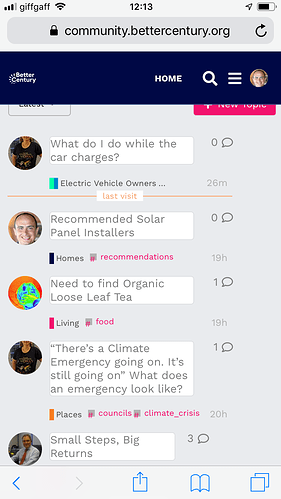](../../../assets/images/109079/f2d57dd291731b4b0c4b455598072a20b47ae698.png "image")

---

### Post #37 by [awesomerobot](../../users/awesomerobot.md)
*Posted: 2020-02-27 14:31*

I think you might need to upgrade Discourse (via `/admin/upgrade`)? There were some changes within the past couple of weeks that change the format of some of our templates (which are used in the theme).

---

### Post #38 by [Tom_Beckett](../../users/Tom_Beckett.md)
*Posted: 2020-02-27 14:35*

Thanks Kris. Will do!

---

### Post #39 by [Tom_Beckett](../../users/Tom_Beckett.md)
*Posted: 2020-02-28 12:11*

Thanks Kris. We upgraded last night and it works really nicely!

We’ve installed the theme as default now. See it at <https://community.bettercentury.org/>

Thanks!

---

### Post #40 by [tohaitrieu](../../users/tohaitrieu.md)
*Posted: 2020-03-10 15:01*

I have same problem with Tom Beckett. I upgrade but it not working.

My Forum: <https://babyforex.net>

---

### Post #41 by [awesomerobot](../../users/awesomerobot.md)
*Posted: 2020-03-10 15:13*

Looks like there’s a conflict with a third-party plugin… if I visit `https://babyforex.net?safe_mode=no_plugins%2Conly_official&mobile_view=1` the theme works as expected.

You can try disabling each plugin and seeing which one is causing the problem… my guess would be topic previews?

---

### Post #42 by [tohaitrieu](../../users/tohaitrieu.md)
*Posted: 2020-03-10 15:45*

Hi Kris

I remove Topic Preview Plugin. But cannot fix.

When I try to access: `https://babyforex.net/?mobile_view=1`

---

### Post #43 by [awesomerobot](../../users/awesomerobot.md)
*Posted: 2020-03-10 16:44*

Not sure if you disabled other plugins in the meantime, but the mobile layout looks ok to me now?

---

### Post #44 by [tohaitrieu](../../users/tohaitrieu.md)
*Posted: 2020-03-11 13:15*

I must remove all Plugin 😦

---

### Post #45 by [tohaitrieu](../../users/tohaitrieu.md)
*Posted: 2020-03-11 13:21*

Message have problem with this theme.

---

### Post #46 by [tohaitrieu](../../users/tohaitrieu.md)
*Posted: 2020-03-12 09:58*

Hi [@awesomerobot](/u/awesomerobot)  
How can I add topic view after comment number?

Thank you!

[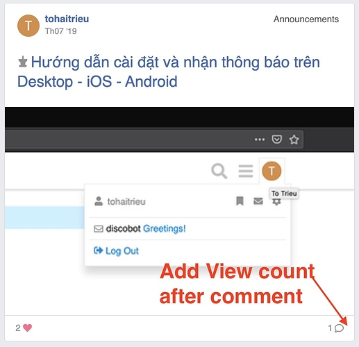](../../../assets/images/109079/fd7319464489701f2f74ab9cac7031560774ffcd.jpeg "Screen Shot 2020-03-12 at 4.56.37 PM")

I dont know why my forum is lose header menu.

[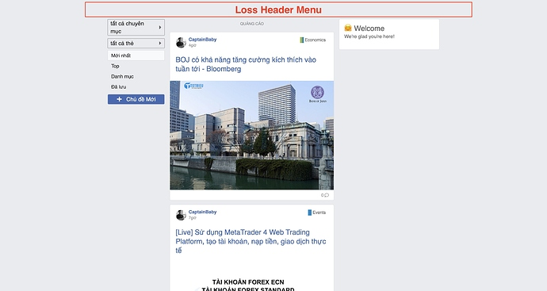](../../../assets/images/109079/01e141e3ce701a76545e8b66dee8e88b732c2c0d.jpeg "Screen Shot 2020-03-12 at 9.40.31 PM")

---

### Post #47 by [awesomerobot](../../users/awesomerobot.md)
*Posted: 2020-03-12 15:57*

 tohaitrieu:

> I dont know why my forum is lose header menu.

If you open your browser’s web inspector do you see any errors in the console? do you have any other themes/plugins installed? This theme changes a lot, so it’s not going to be compatible with many plugins or other themes/components.

---

### Post #48 by [ninjapenguin](../../users/ninjapenguin.md)
*Posted: 2020-03-23 18:35*

Played around with it for a while and had a blast. Great work. The “categories only” setting is the issue for me as my forum is set up using boxes. Is there a way to make it so the fakebook theme switches a forum to categories only when turned on, as i’m going to let users choose their theme. Or a way we can set different layout options for different themes?

I also noticed the sidebars don’t play nice with most plugins. Kanban, Events, etc. I wonder if moving forward they could become dynamic and so if another plugin wants to use that space they move out the way. Or a low-tech solution could be that they have a little ‘hide’ icon in the corners.

---

### Post #51 by [Michael_SC](../../users/Michael_SC.md)
*Posted: 2020-04-20 20:58*

This is great!

Would it be safe to use this theme for a live site and have it work without any errors (the only theme component I am using is the Brand Header component)?

And will it be updated for the foreseeable future? I think this is fantastic.

---

### Post #52 by [gingerman](../../users/gingerman.md)
*Posted: 2020-04-21 04:23*

This is awesome work. Kudos for that.

It seems to be not activated in the following places

  * Tag view - For eg. [Topics tagged theme-full](https://meta.discourse.org/tag/theme-full)
  * For categories which have children categories - For eg. [support - Discourse Meta](../../../assets/images/109079/6395e8546946e40f1cdbaef6385042fdfe3d42a0_2_1035x549.png)

---

### Post #54 by [Michael_SC](../../users/Michael_SC.md)
*Posted: 2020-04-21 06:57*

For example, I noticed the category descriptions looks scrunched and unappealing with this theme as seen on your demo:

[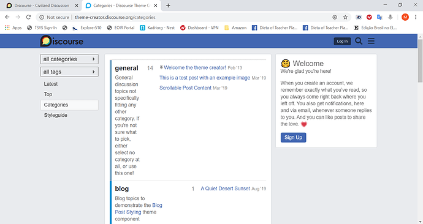](../../../assets/images/109079/6395e8546946e40f1cdbaef6385042fdfe3d42a0.png "Categories - Discourse Theme Creator - Google Chrome 4_20_2020 11_53_12 PM")

---

### Post #55 by [awesomerobot](../../users/awesomerobot.md)
*Posted: 2020-04-21 12:17*

There are a couple live sites already using the theme, if you notice any issues you can report them here and I can get to them when I have the chance. The theme is open source, so any improvements from other developers are also welcome!

 Michael_SC:

> For example, I noticed the category descriptions looks scrunched and unappealing with this theme as seen on your demo:

Right as mentioned in the original post, this theme only works with the “categories only” category page style (unfortunately the theme previews on our theme creator site can’t set a different category page style).

I’ve had a to-do to add support for other category styles, i’ll try to get to that this week.

---

### Post #56 by [awesomerobot](../../users/awesomerobot.md)
*Posted: 2020-04-25 02:22*

Made an update here that adds support for all category page styles

<https://github.com/discourse/Fakebook/commit/3e900d0673e3d36041c96e528cb94c1b10b92502>

[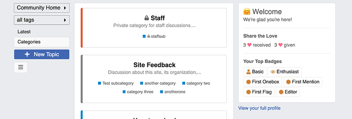](../../../assets/images/109079/964add7cd43d2a3855fd8f1df10a957146ad497b.png "Screen Shot 2020-04-24 at 9.33.44 PM")

Also working on support for tag pages, should have that ready sometime next week.

---

### Post #57 by [awesomerobot](../../users/awesomerobot.md)
*Posted: 2020-04-29 21:24*

I’ve added support for tag topic lists. I had to fix a couple inconsistencies in Discourse itself to support these correctly, so if you’ll also need to update to Discourse today or later to get this update working.

[github.com/discourse/Fakebook](https://github.com/discourse/Fakebook/commit/7bf47cf4c58515b1bf33f71421f385f425e75f62)

####  [UX: Better support for tag pages](https://github.com/discourse/Fakebook/commit/7bf47cf4c58515b1bf33f71421f385f425e75f62)

committed 03:42AM - 28 Apr 20 UTC

[  awesomerobot ](https://github.com/awesomerobot)

[ +14 -1 ](https://github.com/discourse/Fakebook/commit/7bf47cf4c58515b1bf33f71421f385f425e75f62)

---

← Previous | **Page 1 of 3** | [Next →](109079-page-2.md)
