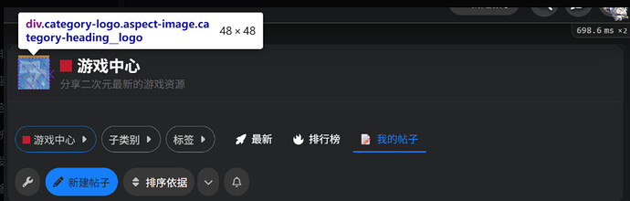
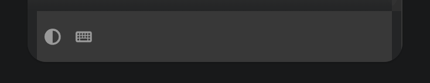

[🏠 Home](../../index.md) | [📋 Latest](../../latest/index.md) | [🔥 Top](../../top/replies/index.md) | [👥 Users](../../users/index.md)

[Home](../../index.md) » [Theme](../../c/theme/index.md) » FKB Pro - Social theme

---

# FKB Pro - Social theme (Page 10 of 10)

> **Category:** Theme
> **Author:** ozkn
> **Created:** 2022-07-28 20:58

[← Previous](234323-page-9.md) | **Page 10 of 10** | Next →

---

### Post #470 by [ozkn](../../users/ozkn.md)
*Posted: 2025-09-03 14:23*

Hello, after updating discourse, I am getting the following error:  
`deprecated.js:62 [THEME 506 'FKB Pro theme v2'] Deprecation notice: Accessing `site.mobileView` or `site.desktopView` during the site initialization phase is deprecated. In future updates, the mobile mode will be determined by the viewport size and as consequence using these values during initialization can lead to errors and inconsistencies when the browser window is resized. Please move these checks to a component, transformer, or API callback that executes during page rendering. [deprecated since Discourse 3.5.0.beta9-dev] [deprecation id: discourse.static-viewport-initialization] [info:`

---

### Post #472 by [Monikas](../../users/Monikas.md)
*Posted: 2025-10-24 13:26*

Every Discourse update is a new challenge to the **FKB Pro – Social Theme** and Don’s code.

---

### Post #473 by [Monikas](../../users/Monikas.md)
*Posted: 2025-10-31 09:42*

# NO!

# yes！

# Restore your category title images to their previous appearance.
    
    
    /* =========================================================
       分类标题图片显示优化（Category Heading Logo Fix）
       解除 Discourse 默认 aspect-ratio 限制，显示原图比例
       Fixes Discourse category heading logo aspect ratio limits
       ========================================================= */
    
    /* 
       解除分类标题图片比例限制，让图片以原尺寸显示
       Remove aspect ratio restriction so the image displays in its true size
    */
    .category-heading__logo.aspect-image {
      aspect-ratio: auto !important;     /* 移除固定宽高比 / Remove fixed aspect ratio */
      width: auto !important;            /* 自动宽度 / Auto width */
      height: auto !important;           /* 自动高度 / Auto height */
      display: inline-block !important;  /* 内联块显示 / Inline-block display */
      overflow: visible !important;      /* 避免被裁剪 / Prevent cropping */
    }
    
    /* 
       让图片保持原始比例显示
       Ensure the image keeps its original aspect ratio
    */
    .category-heading__logo img {
      width: 250px !important;           /* 原图宽度（可修改） / Original image width (adjustable) */
      height: 120px !important;          /* 原图高度（可修改） / Original image height (adjustable) */
      object-fit: contain !important;    /* 保持完整比例不裁剪 / Maintain full ratio without cropping */
      border-radius: 6px;                /* 可选圆角效果 / Optional rounded corners */
      box-shadow: 0 0 4px rgba(0,0,0,0.4); /* 可选阴影效果 / Optional shadow for better visual depth */
    }

---

### Post #474 by [jahan_gagan](../../users/jahan_gagan.md)
*Posted: 2025-12-01 11:18*

[@don](/u/don), on the latest Discourse version, I’m getting the following notice:

**[Admin Notice]** Theme [‘FKB Pro theme’] contains code which needs updating.  
(id: discourse.widgets-decommissioned) ([_learn more_ ](../../../assets/images/234323/1074240da76dab801c40642d6f4e846544d03d5b_2_1035x672.png))

---

### Post #475 by [RGJ](../../users/RGJ.md)
*Posted: 2025-12-23 23:35*

I was investigating why the numbers in the right sidebar panel were stale and sessionStorage does not expire. When I did `sessionStorage.removeItem("userDetails")` the like numbers updated.

Seems this is the culprit:

 Don:

> We now add these fetched datas to sessionStorage, hopefully that will help: [DEV: Save fetched userDetails and userCardDetails into sessionStorage · VaperinaDEV/fkb-pro-theme@f880e5c · GitHub](https://github.com/VaperinaDEV/fkb-pro-theme/commit/f880e5cb026dd7f5b49cbe05bbd55c316e01624d)

Might be a good idea to add some expire timestamp to that data.

---

### Post #476 by [xu2](../../users/xu2.md)
*Posted: 2026-01-11 14:26*

How to change the font size of the button, and the padding of the button?

---

### Post #477 by [NateDhaliwal](../../users/NateDhaliwal.md)
*Posted: 2026-01-11 14:29*

You can edit this with some CSS:
    
    
    .btn {
      padding: 1em; // Or whatever value
      font-size: 2em; // Or whatever value
    }

---

### Post #478 by [Don](../../users/Don.md)
*Posted: 2026-01-14 10:55*

Hello 

New update here 

[github.com/VaperinaDEV/fkb-pro-theme](../../../assets/images/234323/7149da27c41ea5bd36caf5da246058ef1235ae2d_2_230x500.jpeg)

####  [FEATURE: Discourse compatibility, adjustable cache TTL, and auto-refresh logic](../../../assets/images/234323/7149da27c41ea5bd36caf5da246058ef1235ae2d_2_230x500.jpeg)

`main` ← `new-discourse-compatibility`

merged 10:47AM - 14 Jan 26 UTC

[  VaperinaDEV ](https://github.com/VaperinaDEV)

[ +217 -144 ](https://github.com/VaperinaDEV/fkb-pro-theme/pull/71/files)

**Main Changes:** \- **Modern Discourse Compatibility:** Updated the component[…](../../../assets/images/234323/7149da27c41ea5bd36caf5da246058ef1235ae2d_2_230x500.jpeg) to be fully compatible with the latest Glimmer patterns and Post Stream changes. \- **Adjustable Cache TTL:** Added a new setting fkb_panel_cache_ttl allowing admins to define the cache duration in minutes. \- **Live Background Refresh:** Implemented a timer-based background refresh logic. The panel now updates user statistics (likes, solutions, etc.) automatically without requiring page navigation or a manual refresh. \- **Cross-tab Synchronization:** Migrated storage to localStorage to ensure data consistency across all open browser tabs. \- **Optimized Performance:** Refined the fetching logic to prevent redundant AJAX calls and unnecessary loading spinners during navigation.

This update covers the followings:

  * **Live Auto-Refresh:** Stats now update automatically in the background without navigation.
  * **Cross-tab Sync:** Consistent data across all open browser tabs using localStorage.
  * **New Setting:** Added `fkb_panel_cache_ttl` to customize refresh intervals. 
    * [FKB Pro - Social theme - #475 by RGJ](https://meta.discourse.org/t/fkb-pro-social-theme/234323/475)
  * **Compatibility:** Compatibility with the latest Discourse Glimmer Post Stream updates. 
    * [FKB Pro - Social theme - #470 by ozkn](https://meta.discourse.org/t/fkb-pro-social-theme/234323/470)
    * [FKB Pro - Social theme - #474 by jahan_gagan](https://meta.discourse.org/t/fkb-pro-social-theme/234323/474)

---

### Post #479 by [xu2](../../users/xu2.md)
*Posted: 2026-01-14 14:01*

How to change the size of the new topic button?

Also, how to add custom content below the left sidebar?

---

### Post #480 by [Andrew_Rowe](../../users/Andrew_Rowe.md)
*Posted: 2026-01-14 14:07*

maybe this will help you

[Making custom CSS changes on your site](https://meta.discourse.org/t/making-custom-css-changes-on-your-site/168101#p-836623-finding-the-right-css-selectors-4) [Site Management](/c/documentation/site-management/53)

> 🔖 This guide explains how to make CSS changes on your Discourse site, including an introduction to CSS, where to add CSS in Discourse, and how to find the right selectors using browser inspection tools.  Required user level: Administrator Summary This guide covers: A brief introduction to CSS and key concepts How to add CSS to your Discourse site using theme components Using browser inspection tools to find the right CSS selectors Understanding CSS basics CSS… 

look for ‘Finding the right CSS selectors’ section

---

### Post #481 by [xu2](../../users/xu2.md)
*Posted: 2026-01-14 14:20*

I tried! But it doesn’t work! So I post this question.

---

### Post #482 by [denvergeeks](../../users/denvergeeks.md)
*Posted: 2026-01-14 14:28*

Also you can ask for help at:

<https://ask.discourse.com>

---

### Post #483 by [xu2](../../users/xu2.md)
*Posted: 2026-01-15 06:08*

How to make the right sidebar displaying everywhere? Not only the homepage and categories.

---

### Post #484 by [xu2](../../users/xu2.md)
*Posted: 2026-01-15 12:25*

It doesn’t work for the "add topic“ button

---

### Post #485 by [NateDhaliwal](../../users/NateDhaliwal.md)
*Posted: 2026-01-15 13:32*

Hmm… works fine for me when previewing on Theme Creator.

If you want to specifically target the New Topic button, try:
    
    
    button#create-topic {
      // add stuff here...
    }

---

### Post #486 by [Monikas](../../users/Monikas.md)
*Posted: 2026-02-02 11:13*

After this update, there seems to be an issue with this part of the CSS.

---

[← Previous](234323-page-9.md) | **Page 10 of 10** | Next →
