[🏠 Home](../../index.md) | [📋 Latest](../../latest/index.md) | [🔥 Top](../../top/replies/index.md) | [👥 Users](../../users/index.md)

[Home](../../index.md) » [Theme](../../c/theme/index.md) » FKB Pro - Social theme

---

# FKB Pro - Social theme (Page 2 of 10)

> **Category:** Theme
> **Author:** Don
> **Created:** 2022-07-28 20:58

[← Previous](234323.md) | **Page 2 of 10** | [Next →](234323-page-3.md)

---

### Post #54 by [Don](../../users/Don.md)
*Posted: 2022-12-25 14:16*

Hello,

Oh, yeah sorry. I’ve merged an update, to don’t hide sidebar if enabled. Note: This theme is not sidebar ready yet. I have to fix, rethink and refactor lots of thing.

---

### Post #55 by [ozkn](../../users/ozkn.md)
*Posted: 2022-12-25 14:25*

[@Don](/u/Don) Thanks for the update

---

### Post #56 by [Don](../../users/Don.md)
*Posted: 2023-01-01 15:10*

Hello,

I’ve create a bigger update on this theme. I will merge this soon. 

[github.com/VaperinaDEV/fkb-pro-theme](../../../assets/images/234323/1386e838b0b63056c270a630d88d6128051a6922_2_1034x472.png)

####  [Fixes, improvements, sidebar compatibility etc...](../../../assets/images/234323/1386e838b0b63056c270a630d88d6128051a6922_2_1034x472.png)

`main` ← `VaperinaDEV-patch-1`

merged 07:33PM - 02 Jan 23 UTC

[  VaperinaDEV ](https://github.com/VaperinaDEV)

[ +1938 -1850 ](https://github.com/VaperinaDEV/fkb-pro-theme/pull/13/files)

Changes * change layout from flexbox to grid * sidebar compatibility * new […](../../../assets/images/234323/1386e838b0b63056c270a630d88d6128051a6922_2_1034x472.png)revamped user menu (redesign) * clean up the code * redesign chat * floating navigation controls (notification, create topic button) on mobile * desktop version navigation bar on mobile * redesign oneboxes and quotes * removed avatar and stats from topic list on mobile * removed full width (paddingless) mobile version * improve responsive layout * added sticky new topic banner

Changes

  * change layout from flexbox to grid
  * sidebar compatibility
  * new revamped user menu (redesign)
  * clean up the code
  * redesign chat
  * floating navigation controls (notification, create topic button) on mobile
  * desktop version navigation bar on mobile
  * redesign oneboxes and quotes
  * removed avatar and stats (fkb panel) from topic list on mobile
  * removed full width (paddingless) mobile version

* * *

Desktop view

[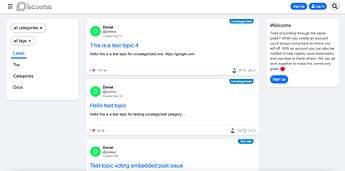](../../../assets/images/234323/f9b7d340f95c659b5f8c1933eea516d42bfc11cf.png "Screenshot 2023-01-01 at 14.45.33")

[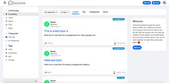](../../../assets/images/234323/895b510573aacd738a747180596eb103269bf1db.png "Screenshot 2023-01-01 at 14.45.57")

[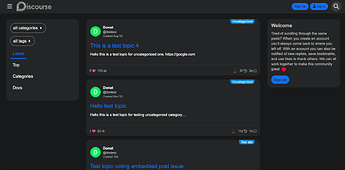](../../../assets/images/234323/e116e78ce0f8383f04f416f17de9bf376f4479c7.png "Screenshot 2023-01-01 at 15.13.11")

[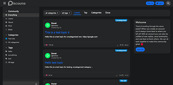](../../../assets/images/234323/8ca15bd6e6199334ea7278bc505371704a8f533e.png "Screenshot 2023-01-01 at 15.14.08")

Mobile view

[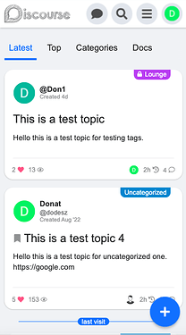](../../../assets/images/234323/1de21c42a31184cdd9d2353c2d5e77b49677ed18.png "Screenshot 2023-01-01 at 14.49.50")

[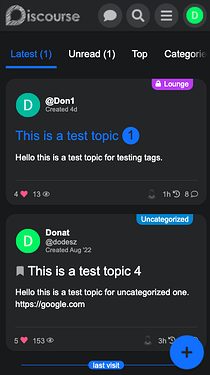](../../../assets/images/234323/ff8d87b07e7ccb43dd0c138536f63323ed61e88f.png "Screenshot 2023-01-01 at 16.09.07")

* * *

Revamped user menu (paddingless redesign)

Desktop  

[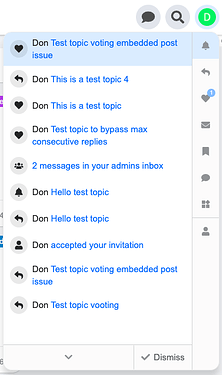](../../../assets/images/234323/b06dfe721636a4fffadfd77a5f69ac89f5d70c36.png "Screenshot 2023-01-01 at 14.47.24")

Mobile  

[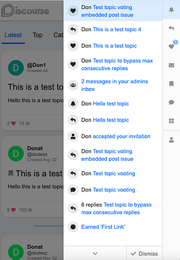](../../../assets/images/234323/a350dad44bd1d2b017d032cd84bea9f60e4e6293.png "Screenshot 2023-01-01 at 14.48.28")

* * *

Docs

[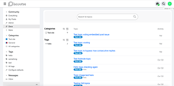](../../../assets/images/234323/f489952f2803c7ab257cc01600bd441b5f2544f1.png "Screenshot 2023-01-01 at 15.10.15")

[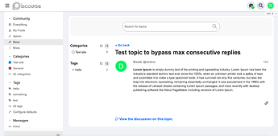](../../../assets/images/234323/3b21ee1d1961a3bc73c7210f917ceb02f983d418.png "Screenshot 2023-01-01 at 15.10.45")

* * *

Chat

[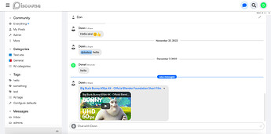](../../../assets/images/234323/15e1b5013d2977805c35b225b98fb29ce4d6f533.jpeg "Screenshot 2023-01-01 at 16.04.47")

[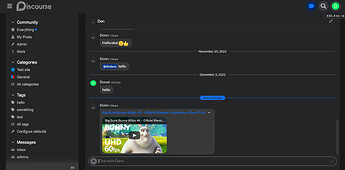](../../../assets/images/234323/58cad7e79a13e08a47383ef36c618a6ecdd85db8.jpeg "Screenshot 2023-01-01 at 16.03.50")

---

### Post #57 by [Don](../../users/Don.md)
*Posted: 2023-01-02 09:30*

Hello,

I’ve added more updates, fixes etc:

  * improve responsive layout
  * added Discourse Reactions support
  * added sticky new topic banner (floating from top)

I testing it a little bit more and after I can merge these changes. 

* * *

Responsive  

<https://d11a6trkgmumsb.cloudfront.net/original/4X/8/4/3/8433f59e73d1046c5816546cad8a602bd3098e11.mov>

Sticky new topic banner

Desktop  

<https://d11a6trkgmumsb.cloudfront.net/original/4X/1/b/0/1b045f32a961d946edf723b436d4113f05e48950.mov>

Mobile  

<https://d11a6trkgmumsb.cloudfront.net/original/4X/5/8/0/580485ad5f16cc92c80675ae8c53ccc51a144204.mp4>

---

### Post #58 by [ozkn](../../users/ozkn.md)
*Posted: 2023-01-02 17:46*

[@Don](/u/Don) Thanks for the update

---

### Post #59 by [Don](../../users/Don.md)
*Posted: 2023-01-02 19:59*

Hello,

I’ve merged this [Fixes, improvements, sidebar compatibility etc... by VaperinaDEV · Pull Request #13 · VaperinaDEV/fkb-pro-theme · GitHub](../../../assets/images/234323/1386e838b0b63056c270a630d88d6128051a6922_2_1034x472.png) update and also updated the OP. 

---

### Post #60 by [Jagster](../../users/Jagster.md)
*Posted: 2023-01-02 21:09*

Is the reactions fix still valid and needed?

---

### Post #61 by [Don](../../users/Don.md)
*Posted: 2023-01-02 21:15*

Nope, that is not needed anymore. You can remove. 

---

### Post #62 by [jo-andre](../../users/jo-andre.md)
*Posted: 2023-01-03 17:08*

Hey, awsome theme! 

ive got some minor padding issues when using web browser i would like to solve, but dont really know how.

[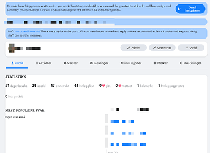](../../../assets/images/234323/6b93258320f37520eba07ee21f6acb63fdf493f1.png "padding222")

Not on mobile tho! 🙂

---

### Post #63 by [Don](../../users/Don.md)
*Posted: 2023-01-03 20:48*

Thanks! I glad you like it  I see this is happens on the experimental `new user profile nav`. I think this will change a lot in the future, so I will not change the theme for now.

But you can add this to a component.

Desktop / CSS
    
    
    .new-user-wrapper {
      .new-user-content-wrapper {
        .user-content {
          padding: 1em;
        }
      }
    }

---

### Post #64 by [ozkn](../../users/ozkn.md)
*Posted: 2023-01-31 19:42*

hello [@Don](/u/Don), the desktop layout is broken with the last update. Could you please check this at your available time.

---

### Post #65 by [Don](../../users/Don.md)
*Posted: 2023-01-31 21:29*

Hello, Thanks for the report! I’ve merged a fix 

---

### Post #66 by [ozkn](../../users/ozkn.md)
*Posted: 2023-01-31 21:38*

[@Don](/u/Don) thank you for the quick fix

---

### Post #67 by [jo-andre](../../users/jo-andre.md)
*Posted: 2023-02-02 15:52*

Heey man 😃

I’ve got an issue when updating to latest,

Am still on 3.0.0-beta16 this is probably the reason  

<https://d11a6trkgmumsb.cloudfront.net/original/4X/a/d/1/ad1a7cff192a02258625606fe39125e069fdf8c3.MOV>

But if not, good too know 😊

---

### Post #68 by [Don](../../users/Don.md)
*Posted: 2023-02-02 16:09*

Hello 👋 I can’t repro it on the latest version Discourse.

But I can check this on your site if I can register.  Oh I see it’s required an invite code. If you can send me one in PM or create an account then I can check this.

---

### Post #71 by [jo-andre](../../users/jo-andre.md)
*Posted: 2023-02-02 17:09*

Seems to work on the default theme.

KenBen settings is at default. Haven’t done anything with it yet.

---

### Post #72 by [Don](../../users/Don.md)
*Posted: 2023-02-02 17:17*

It works on my test site with latest. Yesterday I updated the templates to fit to the core changes so probably you have to update Discourse to the latest.   
Oh, yes I updated the `navigation-bar` template too which I think cause this.

---

### Post #73 by [ozkn](../../users/ozkn.md)
*Posted: 2023-02-08 16:10*

hi [@Don](/u/Don) after the latest updates adsense auto ads not working. Default theme also works when I try. Can you take a look at it in your free time?

---

### Post #74 by [Don](../../users/Don.md)
*Posted: 2023-02-08 16:17*

Hello, I just checked your site and the ads works fine for me. 

---

### Post #75 by [ozkn](../../users/ozkn.md)
*Posted: 2023-02-08 16:33*

Fixed ads no longer appear in mobile view. It used to work. There is no problem with desktop view.

---

### Post #76 by [Don](../../users/Don.md)
*Posted: 2023-02-08 16:44*

Works for me on mobile too.  Could you clarify which ads you mean? Some screenshot would be helpful. Thanks 

---

### Post #77 by [hoangphuctran93](../../users/hoangphuctran93.md)
*Posted: 2023-02-12 10:58*

Can you guide me how to get the data in topic-list card the same way you are doing? - User name - Full male - Creative time - Peréonal action & Slide image ^^

---

### Post #78 by [hoangphuctran93](../../users/hoangphuctran93.md)
*Posted: 2023-02-12 11:18*

Sorry for replying so many times. currently I am using the theme-component “Alternative Voting Category Style” but when selecting your theme it doesn’t work as expected, hope you can help me with this. and it would be great if you could help activate this theme-component on mobile

---

### Post #79 by [Don](../../users/Don.md)
*Posted: 2023-02-12 13:21*

Hello,

 Hoàng Phúc Trần:

> Can you guide me how to get the data in topic-list card the same way you are doing?

For this you need to override the template. Here is a guide how you can do it: [Developing Discourse Themes & Theme Components](https://meta.discourse.org/t/beginners-guide-to-developing-discourse-themes/93648#overriding-discourse-templates-23)

The FKB Pro theme templates you can find here: <https://github.com/VaperinaDEV/fkb-pro-theme/tree/main/javascripts/discourse/templates>

* * *

 Hoàng Phúc Trần:

> “Alternative Voting Category Style” but when selecting your theme it doesn’t work as expected

I have merged an update for adding compatibility with [Alternative Voting Category Style](https://meta.discourse.org/t/alternative-voting-category-style/101532) theme component. 

[github.com/VaperinaDEV/fkb-pro-theme](../../../assets/images/234323/178568db0a96a1c50c7d778a462ce6375fd7cd2f_2_1035x598.jpeg)

####  [Alternative topic list voting theme component compatibility](../../../assets/images/234323/178568db0a96a1c50c7d778a462ce6375fd7cd2f_2_1035x598.jpeg)

`main` ← `alternative-topic-list-voting-compatibility`

merged 01:07PM - 12 Feb 23 UTC

[  VaperinaDEV ](https://github.com/VaperinaDEV)

[ +52 -0 ](https://github.com/VaperinaDEV/fkb-pro-theme/pull/17/files)

This update is make the theme compatible with [Alternative Voting Category Style[…](../../../assets/images/234323/178568db0a96a1c50c7d778a462ce6375fd7cd2f_2_1035x598.jpeg) theme component](https://meta.discourse.org/t/alternative-voting-category-style/101532?u=dodesz)

Yeah I know, I misspelled the component name 😕

* * *

[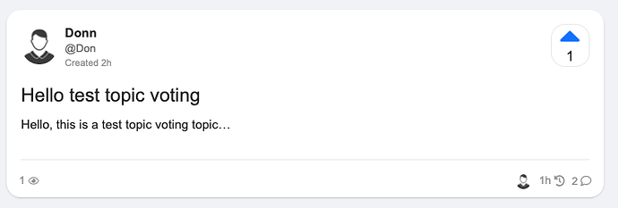](../../../assets/images/234323/16f8b3f794f3260c901b25136ccd5fed27fdec7d.png "Screenshot 2023-02-12 at 14.19.44")

---

### Post #80 by [hoangphuctran93](../../users/hoangphuctran93.md)
*Posted: 2023-02-12 13:39*

 hoangphuctran93:

> Alternative Voting Category Style

awesome i just updated the theme and saw your customizations, however the mobile version doesn’t currently support the alternative Voting Category Style component theme, if possible i really hope to add this customization.

---

### Post #81 by [Don](../../users/Don.md)
*Posted: 2023-02-12 13:48*

 Hoàng Phúc Trần:

> the mobile version doesn’t currently support the alternative Voting Category Style component theme, if possible i really hope to add this customization.

Yeah, the [Alternative Voting Category Style](https://meta.discourse.org/t/alternative-voting-category-style/101532) is only for desktop. To change it you need to fork the theme component and modify some files.

---

### Post #82 by [hoangphuctran93](../../users/hoangphuctran93.md)
*Posted: 2023-02-12 14:08*

 Don:

> Yeah, the [Alternative Voting Category Style](https://meta.discourse.org/t/alternative-voting-category-style/101532) is only for desktop. To change it you need to fork the theme component and modify some files.

This modification seems too much for my current ability, hope you can give me some suggestions? or I will try to contact the author and ask for their support, although I have replied to the post but still have not received a reply ^^

---

### Post #83 by [Don](../../users/Don.md)
*Posted: 2023-02-12 15:44*

Hey [@hoangphuctran93](/u/hoangphuctran93),  
I forked the theme component and modify to work with FKB Pro theme and on mobile too. I reverted the previous theme update.

Here is the theme component 🔽

[github.com](https://github.com/VaperinaDEV/fkb-pro-alternative-voting-category-style)

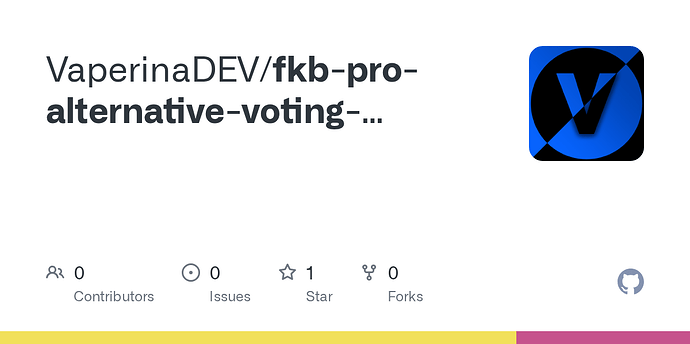

### [GitHub - VaperinaDEV/fkb-pro-alternative-voting-category-style](https://github.com/VaperinaDEV/fkb-pro-alternative-voting-category-style)

Contribute to VaperinaDEV/fkb-pro-alternative-voting-category-style development by creating an account on GitHub.

---

### Post #84 by [hoangphuctran93](../../users/hoangphuctran93.md)
*Posted: 2023-02-12 21:51*

Awesome, i’m super excited to test this upgraded version of yours ^^ once again thank you very much. Please visit my website <https://businesslab.vn>. I will have a detailed tutorial in the next few days to share with the community, everything I have learned and supported to implement the project.

I installed it and it’s amazing it worked, I’d like to take a closer look at the code you made  

and especially Don’s customization can run on all other themes ^^

---

### Post #85 by [codergautam](../../users/codergautam.md)
*Posted: 2023-02-15 01:20*

Any way to hide the image preview / make it smaller? I _love_ this theme but the image seems to make each topic really tall on my site.

---

### Post #86 by [hoangphuctran93](../../users/hoangphuctran93.md)
*Posted: 2023-02-15 01:22*

You can use css with Aspect ratio  
Example code: <https://www.w3schools.com/howto/howto_css_aspect_ratio.asp>  
You can check my site <https://businesslab.vn> with ratio 16:10

---

### Post #87 by [codergautam](../../users/codergautam.md)
*Posted: 2023-02-15 13:50*

How I can set this in the Discourse? Like where and which css do I set?

* * *

Also, there is this minor issue when setting Google Ads:  

[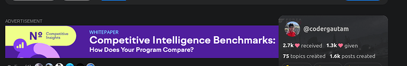](../../../assets/images/234323/b8074cdf226f6d9e5fe6d24090f85e54365c9b84.png "image")

I assume the sidebar profile card should be below the ad, not right on top of it.

Thanks!

---

### Post #88 by [Don](../../users/Don.md)
*Posted: 2023-02-15 18:19*

Hello [@codergautam](/u/codergautam),

I have merged a fix for Discourse Ad plugin - Google Adsense. Please update the theme. 

 gautam:

> Any way to hide the image preview / make it smaller?

You can change the image height 🔽

You need to create a new component for this. 

  1. Go to `/admin/customize/themes/`  
Customize → Themes

  2. Click the **Components** tab and then the `Install` button

  3. On the popup window click `Create new` button and type the new component name.  

[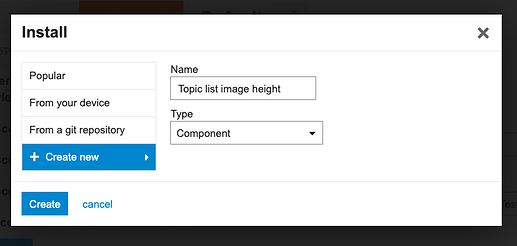](../../../assets/images/234323/15e5b554e2dee0d995549b7ab45624c314c94803.png "Screenshot 2023-02-15 at 19.03.01")

  4. Click `Create` button.

  5. The component created. Now select FKB Pro theme to activate it.  

  6. Click the `Edit CSS/HTML` button.  

  7. Click the **Common** tab and paste the below code to the **CSS** section.  

[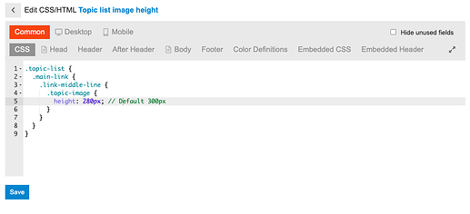](../../../assets/images/234323/1386e838b0b63056c270a630d88d6128051a6922.png "Screenshot 2023-02-15 at 19.09.37")

If you want to set the image height separately on desktop and mobile, use those tabs instead of Common. Common means this code will be active on desktop and mobile too.
    
    
    .topic-list {
      .main-link {
        .link-middle-line {
          .topic-image {
            height: 280px; // Default 300px
          }
        }
      }
    }
    

If you want to hide the image, use this 🔽
    
    
    .topic-list {
      .main-link {
        .link-middle-line {
          .topic-image {
            display: none;
          }
        }
      }
    }

---

### Post #90 by [xiaokong23357](../../users/xiaokong23357.md)
*Posted: 2023-03-17 23:51*

Hope to fix incompatibilities with other theme components

---

### Post #91 by [danielabc](../../users/danielabc.md)
*Posted: 2023-03-19 16:58*

How do you just round the buttons and stuff? I just wanted to do this in my current theme

---

### Post #92 by [Don](../../users/Don.md)
*Posted: 2023-03-19 21:19*

Hi [@danielabc](/u/danielabc),

There are some [theme-component](/c/theme-component/120) for rounding stuffs. 

 [Discourse Button Styles](https://meta.discourse.org/t/discourse-button-styles/88154) [theme-component](/c/theme-component/120)

> This theme component includes basic settings for changing button colors without writing CSS. [Github repo](https://github.com/awesomerobot/discourse-button-styles): https://github.com/awesomerobot/discourse-button-styles Installation: [How do I install a Theme or Theme Component?](https://meta.discourse.org/t/how-do-i-install-a-theme-or-theme-component/63682) Preview: [Example of what you can style with the settings in this theme](https://theme-creator.discourse.org/theme/awesomerobot/button-styles) [[25%20AM]](../../../assets/images/234323/0506bbb7635a79f76a24cd4d249f4e4d3fb8562e.png "25%20AM") What the settings look like: [[37%20AM]](../../../assets/images/234323/25955501d91ca84d2c9f925e640b49eb1b7d8641.png "37%20AM") There are 6 button sets that can be styled in this component, along with a global style for adding rounded corners to all buttons (border-radius): b… 

 [Rounded Borders for images, oneboxes, blockquotes & more](https://meta.discourse.org/t/rounded-borders-for-images-oneboxes-blockquotes-more/232044) [theme-component](/c/theme-component/120)

> Created a very simple component to change the borders of images, oneboxes, blockquotes and staff notices shown in topics. Allows change of the following settings set image rounding intensity set image border width set image border color set onebox rounding intensity change onebox border width change onebox border color change onebox background color set rounding blockquotes intensity remove left border from blockquotes set ‘staff color’ rounding intensity [topic thumbnail](https://meta.discourse.org/t/topic-list-thumbnails-theme-component/150602) support for: list ro… 

* * *

Hello [@xiaokong23357](/u/xiaokong23357), can you clarify which [theme-component](/c/theme-component/120) do you mean?

---

### Post #93 by [xiaokong23357](../../users/xiaokong23357.md)
*Posted: 2023-03-20 02:37*

 [Right Sidebar Blocks](../../../assets/images/234323/543b344600b8fb6ae6dccc92c77cecc46646b004_2_1034x516.jpeg) [theme-component](/c/theme-component/120)

> Can’t it be displayed on the category list, I installed it here and feel like I haven’t installed it

---

### Post #94 by [xiaokong23357](../../users/xiaokong23357.md)
*Posted: 2023-03-26 01:25*

[@Don](/u/Don) How do I introduce the binding HTML meta tag into an FBK theme?

Hope it will be solved

---

### Post #95 by [xiaokong23357](../../users/xiaokong23357.md)
*Posted: 2023-03-26 05:34*

[@Don](/u/Don) I mean, I don’t know if the theme can load these things  

  

  
Format layout recommendation: Optimized, simple, compact, and wide

---

### Post #96 by [Don](../../users/Don.md)
*Posted: 2023-03-26 06:23*

Hello, sorry for the delay… Yeah I think it’s possible to replace the default right panel with [Right Sidebar Blocks](https://meta.discourse.org/t/right-sidebar-blocks/231067). I will check this. 

---

### Post #97 by [xiaokong23357](../../users/xiaokong23357.md)
*Posted: 2023-03-26 08:39*

One more thing ， [@Don](/u/Don)  
My forum uses your theme, now my forum is going to be ready to be added to the Microsoft Bing search engine, but now it needs to do HTML meta tag detection for the forum, how do I do to incorporate this HTML meta tag into the theme  
It is very needed now, and I am very grateful for being able to solve it

[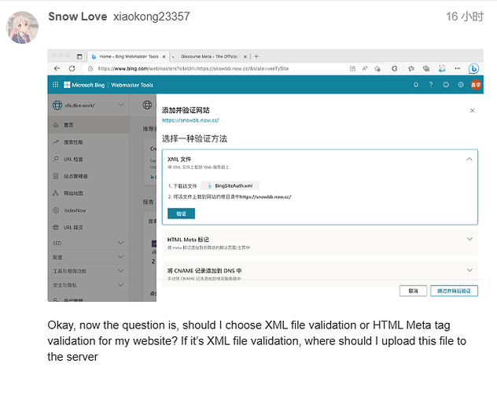](../../../assets/images/234323/51d71b022c4deb9c8ae06f2cda2902e923836771.png "image")

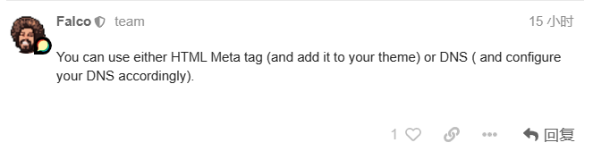

---

### Post #98 by [Don](../../users/Don.md)
*Posted: 2023-03-26 09:21*

Create a new theme component in admin like this I introduced above. [FKB Pro - Social theme - #88 by dodesz](../../../assets/images/234323/882e14e7263f7e474da7b08e2a0abe35da3c0151.png) you can change the component name whatever but don’t paste the css I pasted to `CSS` tab. Copy and Paste the Bing `HTML Meta tag` into the `HEAD` tab to the component you created and save it. 

---

### Post #99 by [xiaokong23357](../../users/xiaokong23357.md)
*Posted: 2023-03-26 11:05*

 Don:

> Create a new theme component in admin like this I introduced above. [FKB Pro - Social theme - #88 by dodesz](../../../assets/images/234323/882e14e7263f7e474da7b08e2a0abe35da3c0151.png) you can change the component name whatever but don’t paste the css I pasted to tab. Copy and Paste the Bing into the tab to the component you created and save it. `CSS` `HTML Meta tag` `HEAD` 

Like this?  

[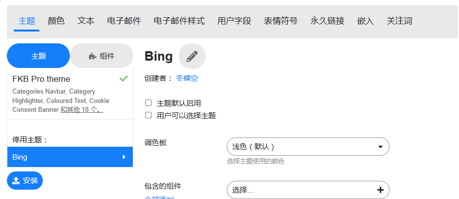](../../../assets/images/234323/2fbbb1e8ff1b88333a72353435d957932102b045.png "image")

  
Then I configure the custom html and then I need to enable the theme before captcha？

---

### Post #100 by [Don](../../users/Don.md)
*Posted: 2023-03-26 11:22*

Nope, as I see this is a theme. You need to create a component. Which is the other tab or you can convert this to a component with the convert button which is on the bottom of the page. Just follow the instructions I show above. 

---

### Post #101 by [xiaokong23357](../../users/xiaokong23357.md)
*Posted: 2023-03-26 11:53*

Thank you very much, problem solved!  
[@Don](/u/Don)

---

### Post #102 by [Don](../../users/Don.md)
*Posted: 2023-03-26 14:09*

I’ve merged an update to add: [Compatibility with Right Sidebar Blocks theme component by VaperinaDEV · Pull Request #18 · VaperinaDEV/fkb-pro-theme · GitHub](https://github.com/VaperinaDEV/fkb-pro-theme/pull/18)

It contains a setting: `right sidebar blocks enabled`. It will adds some support for the Right Sidebar Blocks theme component and will replaces the default right sidebar (fkb panel) with it.

---

### Post #103 by [xiaokong23357](../../users/xiaokong23357.md)
*Posted: 2023-03-31 02:21*

I have an idea that the sidebar can be made by you in this style and merged into a theme file, and people who need it can turn on the corresponding feature in the theme settings [@Don](/u/Don)  
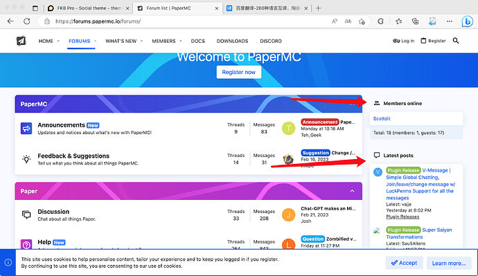  
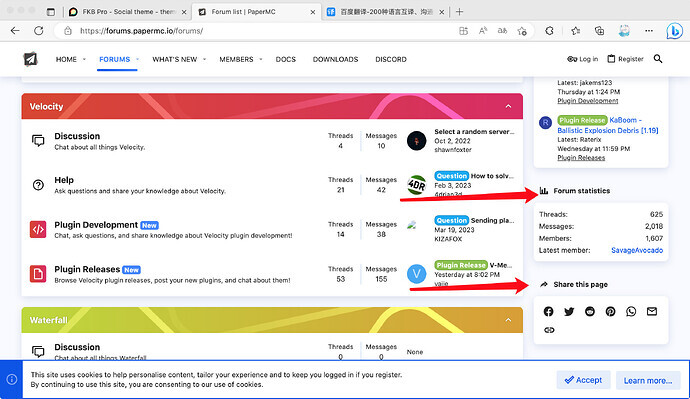

---

### Post #104 by [Don](../../users/Don.md)
*Posted: 2023-04-02 09:28*

Hello,

Yes I think this is possible with modify the style if you mean the title is separate from content and it seems this sidebar is not sticky.

Try something like this. 

Create a new theme component like this [FKB Pro - Social theme - #88 by dodesz](../../../assets/images/234323/882e14e7263f7e474da7b08e2a0abe35da3c0151.png) or add it to an existing one.

Desktop / CSS
    
    
    .full-width .tc-right-sidebar {
      position: relative;
      top: unset;
      padding: 0;
      background: none;
      box-shadow: none;
      overflow-y: unset;
      .rs-component {
        h3 {
          border-bottom: none;
          padding-bottom: 0;
        }
        > div {
          background: var(--secondary);
          padding: 1em;
          border-radius: var(--d-default-border-radius);
          box-shadow: 0 1px 2px rgba(0, 0, 0, 0.2);
        }
      }
    }

---

### Post #105 by [Jagster](../../users/Jagster.md)
*Posted: 2023-04-14 15:37*

FYI: both `/login` and `/signup` as links gives spinning circle, not opening the modal. iPad on latest everything.

---

### Post #106 by [Don](../../users/Don.md)
*Posted: 2023-04-14 15:49*

Hey Jakke  I just checked this on your site with and the modals shows up correctly for me on `/login` and `/signup`.

---

[← Previous](234323.md) | **Page 2 of 10** | [Next →](234323-page-3.md)
