[🏠 Home](../../index.md) | [📋 Latest](../../latest/index.md) | [🔥 Top](../../top/replies/index.md) | [👥 Users](../../users/index.md)

[Home](../../index.md) » [Theme](../../c/theme/index.md) » FKB Pro - Social theme

---

# FKB Pro - Social theme (Page 3 of 10)

> **Category:** Theme
> **Author:** Jagster
> **Created:** 2022-07-28 20:58

[← Previous](234323-page-2.md) | **Page 3 of 10** | [Next →](234323-page-4.md)

---

### Post #107 by [Jagster](../../users/Jagster.md)
*Posted: 2023-04-14 15:56*

With FKB Pro and using a link, not buttons by Discourse?

I should tell everything right away… I know, I’m a bad person 

  * Category lockdown plugin is in use random visitors
  * locked topics are using icon… damn, how can I use those here… well, `user-secret (or something, that trenchcoat icon`
  * clicking such topic will redirect to `/login`
  * FKB Pro gives just spinning icon (but it isn’t default right now for obvious reason; after 15 secs it is 😉 )

---

### Post #108 by [Don](../../users/Don.md)
*Posted: 2023-04-14 16:37*

 Jakke Flemming:

> With FKB Pro and using a link, not buttons by Discourse?

Yep, it works for me with clicking secret topic and using link too.  This theme isn’t do anything with these modals only some css modification. Maybe there was just a network lag or something like that? 

---

### Post #109 by [Jagster](../../users/Jagster.md)
*Posted: 2023-04-14 16:45*

I have decently fast connection, so I don’t believe on lag. But you were using bigger screen. I tried older iPhone and it worked as expected. That means the issue is my iPad.

Strange. Well, hate to say this 😉 but tablets are so rarely used up here, and those closed topics have even lower click rates so I would say… let it be  It works mostly and that is enough.

Thanks!

---

### Post #110 by [EchoBilisim](../../users/EchoBilisim.md)
*Posted: 2023-04-14 21:14*

Hello, the theme is very successful. If it is made to use the theme as social media, I think you need to overhaul it a little more. There is no need for categories on the social media site, I think it will be better if you make them invisible, thank you for sharing and development.

---

### Post #111 by [EchoBilisim](../../users/EchoBilisim.md)
*Posted: 2023-04-14 21:44*

Hello, when I close the side menu, the page is broken, why?

[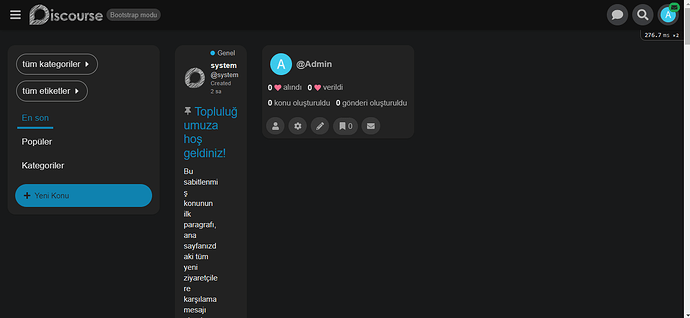](../../../assets/images/234323/76d24bde7f47944f224f78a678c3a32c74f7179e.png "Ekran görüntüsü 2023-04-15 004417")

---

### Post #112 by [EchoBilisim](../../users/EchoBilisim.md)
*Posted: 2023-04-15 19:26*

 EchoBilisim:

> Merhaba, yan menüyü kapattığımda sayfa bozuluyor, neden?
> 
> 

I think it’s doing it from the browser, I deleted the history, there is no problem, it works very well.

I have another question, there is an icon in the login button, but there is no icon in the register button, how to add an icon to the register button?

---

### Post #113 by [Jagster](../../users/Jagster.md)
*Posted: 2023-04-15 20:40*

I would like to hide view counts at topic cards, and I bet asking here is the fastest and the most reliable way to get a right answer 😉

Another solution would be hiding totally that box containing likes and views.

---

### Post #114 by [Don](../../users/Don.md)
*Posted: 2023-04-16 07:54*

 EchoBilisim:

> I think it’s doing it from the browser, I deleted the history, there is no problem, it works very well.
> 
> I have another question, there is an icon in the login button, but there is no icon in the register button, how to add an icon to the register button?

That is great if it’s work   
I think you got the answer here: [Add icon to register button - #2 by Lilly](../../../assets/images/234323/2075508e1fc874b289921f8f870f8fa450fb4387_2_1034x516.jpeg)

 Jakke Flemming:

> I would like to hide view counts at topic cards

You can do it with some CSS.

Hide views.
    
    
    .topic-list {
      .main-link {
        .link-bottom-line {
          .views {
            display: none;
          }
        }
      }
    }
    

 Jakke Flemming:

> Another solution would be hiding totally that box containing likes and views.

Hide likes and views.
    
    
    .topic-list {
      .main-link {
        .link-bottom-line {
          .likes,
          .views {
            display: none;
          }
        }
      }
    }

---

### Post #115 by [EchoBilisim](../../users/EchoBilisim.md)
*Posted: 2023-04-16 19:21*

(post deleted by author)

---

### Post #116 by [Don](../../users/Don.md)
*Posted: 2023-04-16 19:35*

You have to create a new theme component where you can add the modifications you want like this 🔽

 [FKB Pro - Social theme](../../../assets/images/234323/882e14e7263f7e474da7b08e2a0abe35da3c0151.png) [Theme](/c/theme/61)

> Hello [@codergautam](/u/codergautam), I have merged a fix for Discourse Ad plugin - Google Adsense. Please update the theme.  You can change the image height 🔽 You need to create a new component for this.  Go to /admin/customize/themes/ Customize → Themes Click the Components tab and then the Install button On the popup window click Create new button and type the new component name. [[Screenshot 2023-02-15 at 19.03.01]](../../../assets/images/234323/15e5b554e2dee0d995549b7ab45624c314c94803.png "Screenshot 2023-02-15 at 19.03.01") Click Create b…

---

### Post #117 by [EchoBilisim](../../users/EchoBilisim.md)
*Posted: 2023-04-16 22:50*

 Don:

> That is great if it’s work   
>  I think you got the answer here: [Add icon to register button - #2 by Lillinator](../../../assets/images/234323/2075508e1fc874b289921f8f870f8fa450fb4387_2_1034x516.jpeg)

Ok, I got the code shown, but when we enter the default theme, we can reach the css code part from there, there is no that option in your theme, where can I get it?

---

### Post #118 by [JammyDodger](../../users/JammyDodger.md)
*Posted: 2023-04-17 02:10*

I believe Don already answered this question when you asked it previously in the post you deleted. To make changes in addition to the theme, you would need to create a theme component and attach it to your theme(s). There are more detailed instructions in the post Don linked above.

This doesn’t appear to be a question regarding this specific theme though. For more general questions you should use the other topic you created. 👍

---

### Post #119 by [EchoBilisim](../../users/EchoBilisim.md)
*Posted: 2023-04-17 05:03*

Hello, but I want to find the header part of the theme, not to install components.

How do I get to the header of this theme?

---

### Post #120 by [Don](../../users/Don.md)
*Posted: 2023-04-17 07:05*

Hello,

You can’t edit directly a remote theme since [Restrict editing of remote themes](https://meta.discourse.org/t/restrict-editing-of-remote-themes/170051).

Instead of editing it directly you can create a new component what you can attach to the theme.

I assume you want to [add an icon to the header signup button](../../../assets/images/234323/2075508e1fc874b289921f8f870f8fa450fb4387_2_1034x516.jpeg).

Follow these steps to achieve it:

  1. Go to `/admin/customize/themes/`  
Customize → Themes

  2. Click the **Components** tab and then the `Install` button

  3. On the popup window click `Create new` button and type the new component name.  
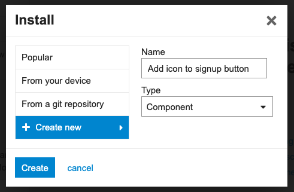

  4. Click `Create` button.

  5. The component created. Now select FKB Pro theme to activate it.  
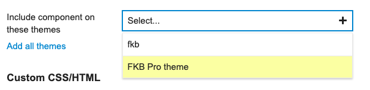

  6. Click the `Edit CSS/HTML` button.  
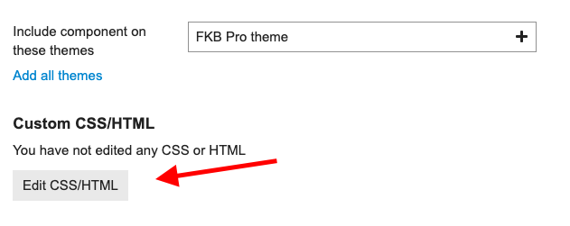

  7. Click the **Header** tab and paste the below code to that section.  

[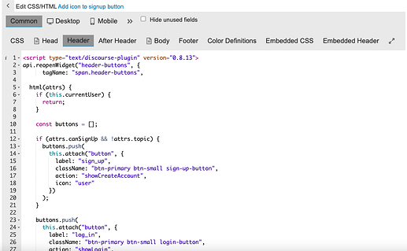](../../../assets/images/234323/6af9f810655582d01d63204dc7e201bffd57ce8d.png "Screenshot 2023-04-17 at 8.58.26")

    
    
    
    

  8. Click `Save`

---

### Post #121 by [EchoBilisim](../../users/EchoBilisim.md)
*Posted: 2023-04-17 08:52*

Ok, now I understand, it’s very detailed, thank you very much.

---

### Post #122 by [Diyorki](../../users/Diyorki.md)
*Posted: 2023-04-17 10:30*

Hi friends,  
is the default theme better than the TKP Pro theme, which do you think is more convenient in terms of seo? I am currently using the default theme.??

---

### Post #123 by [Jagster](../../users/Jagster.md)
*Posted: 2023-04-17 10:57*

Matter of taste.

On my forum FKB Pro is default for users, but I’m using more simplifier theme, because I don’t need that much look.

For SEO there is no matter at all.

---

### Post #124 by [Don](../../users/Don.md)
*Posted: 2023-04-17 11:02*

Hey [@Diyorki](/u/diyorki),

Definitely, the default theme is better. Just think about default theme like a skeleton. You can customize it. So these themes mostly just add a skin to the default theme. If you want to your site looks like different or have other functions too you need a [theme](/c/theme/61) or [theme-component](/c/theme-component/120). These themes mostly not changes any core feature which can cause seo damage. Hovewer it is possible to cause this kind of issue with simple css styling too but if you notice this kind of issue we can fix it. 

When you activate a theme and something wrong with it you can always switch back to the default theme. You can use themes as separate optional theme next to the default theme. So users can select from different themes but the site default theme is still be the default (light). 

---

### Post #125 by [Diyorki](../../users/Diyorki.md)
*Posted: 2023-04-17 11:06*

I didn’t think you would reply so fast 😁 that’s why I love you

 [Diyorki](https://diyorki.net/) 

### [Diyorki](https://diyorki.net/)

Biliyorsan paylaş bilmiyorsan sor öğren

This is my website please let me know if you see any mistakes or errors 

---

### Post #126 by [Canapin](../../users/Canapin.md)
*Posted: 2023-04-17 11:42*

 Diyor ki:

> This is my website please let me know if you see any mistakes or errors 

Hello, Diyor ki 🙂  
You’re not using the FKB Pro theme, so your request might be quite off-topic here. 🙂

---

### Post #127 by [Diyorki](../../users/Diyorki.md)
*Posted: 2023-04-17 12:45*

Sorry  It won’t happen again…

---

### Post #129 by [EchoBilisim](../../users/EchoBilisim.md)
*Posted: 2023-04-17 18:56*

Hello, I think this code is for the input in the header section.

My site is only for members, when the guest enters, it redirects to the login section, I need the code for that, how should we add it, thank you.

[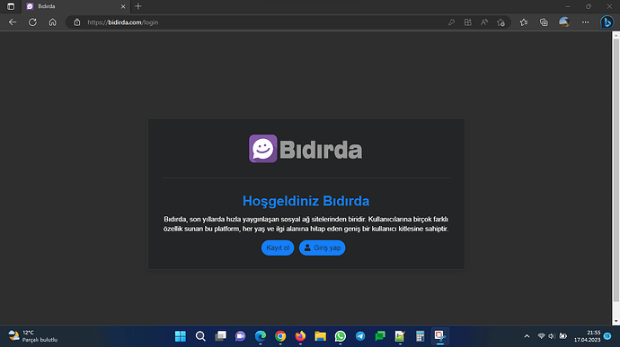](../../../assets/images/234323/3863dbb6b35e00d09b135ca255250d1b0edc2956.png "Ekran görüntüsü 2023-04-17 215543")

---

### Post #130 by [Don](../../users/Don.md)
*Posted: 2023-04-18 09:57*

Hello,

Yeah the previous one is for the header signup button.  I think in this case the easiest way is to override the core template to add icon. We can do it with plugin outlet too but I think on this page it doesn’t really matter because if we use plugin outlet then we have to create new buttons and hide the default buttons section.

You can delete the previous version component what you created because that is not relevant and won’t solve your problem.

* * *

I made a simple theme component what you can install. I added some settings where you can change these buttons icons (Sign Up and Log In).

[github.com](https://github.com/VaperinaDEV/login-required-page-buttons-icons)

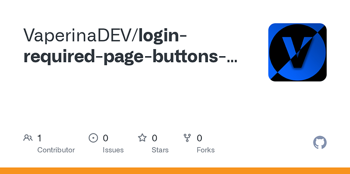

### [GitHub - VaperinaDEV/login-required-page-buttons-icons](https://github.com/VaperinaDEV/login-required-page-buttons-icons)

Contribute to VaperinaDEV/login-required-page-buttons-icons development by creating an account on GitHub.

---

### Post #131 by [EchoBilisim](../../users/EchoBilisim.md)
*Posted: 2023-04-18 17:32*

Thank you very much, good work, I congratulate you, I wish you success 👍

---

### Post #132 by [EchoBilisim](../../users/EchoBilisim.md)
*Posted: 2023-04-18 20:15*

Hey dom, thank you very much, it’s working smoothly, good luck to you.

I have one more question, users want to turn off the theme option, how can I turn it off, choosing a theme in the settings is turned off, but the user chooses themes in her profile, how can I turn this option off.

[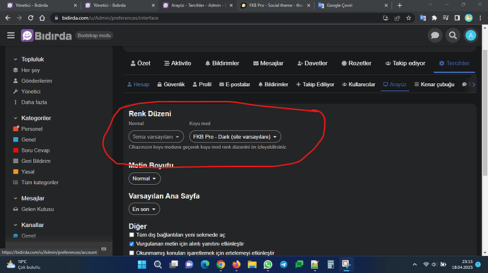](../../../assets/images/234323/0e5d42cf0cc6b0a878c67ecf51dd2a22b58c12c0.png "Ekran görüntüsü 2023-04-18 231603")

---

### Post #133 by [EchoBilisim](../../users/EchoBilisim.md)
*Posted: 2023-04-18 21:56*

 EchoBilisim:

> I have one more question, users want to turn off the theme option, how can I turn it off, choosing a theme in the settings is turned off, but the user chooses themes in her profile, how can I turn this option off.

Ok, I found it, sorry for bothering you, thank you very much for everything.

There is a shift in the usernames for your information, the username is a little above

[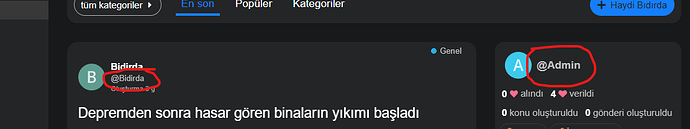](../../../assets/images/234323/32ace00217b711b995a99eb3ea3a7c4a6fab255f.png "Ekran görüntüsü 2023-04-19 010901")

---

### Post #135 by [falcon9](../../users/falcon9.md)
*Posted: 2023-04-23 17:00*

[@Don](/u/Don) How do I pull in different logos for the theme? For example… a mobile logo?

EDIT: I forgot to add… this is an awesome theme… thank you!

---

### Post #136 by [Heliosurge](../../users/Heliosurge.md)
*Posted: 2023-04-23 18:14*

 EchoBilisim:

> Hello, but I want to find the header part of the theme, not to install components.
> 
> How do I get to the header of this theme?

You would have to export theme & download or download it from github.

Your better to use a component to augment the theme vs forking the theme. As with forking you would need to keep it upto date yourself if any changes cause breakage.

Just make a component called something like Fakebook extension snd put your mod/overrides.

---

### Post #137 by [Don](../../users/Don.md)
*Posted: 2023-04-24 06:11*

Hello, you can add logos under branding in site setting: [Customize Your Site Branding](https://meta.discourse.org/t/customize-your-site-branding/258307#site-branding-5)

---

### Post #138 by [falcon9](../../users/falcon9.md)
*Posted: 2023-04-29 23:39*

Ok… I think I figured out my real problem. I will try to explain. I use the light color theme… but I change the header to black. The desktop header background is controlled by the “header background” color… but if I open it on a mobile phone… the header background is actually controlled by the “secondary” color.

EDIT: I think I figured it out. I created a component and added this to the mobile css…
    
    
    .d-header {
      background-color: var(--header_background) !important;
    }

---

### Post #139 by [Don](../../users/Don.md)
*Posted: 2023-04-30 05:48*

Hey [@falcon9](/u/falcon9), Thanks for pointing out, I see now. I’ve removed the unnecessary background color from mobile header. Please update the theme. 

---

### Post #140 by [falcon9](../../users/falcon9.md)
*Posted: 2023-04-30 15:30*

Awesome… thank you very much!

Is there anyway to add a “featured image” similar to Wordpress… or… is it possible to make the theme search the entire topic (beyond the first post) until it finds an image to use?

---

### Post #141 by [Jagster](../../users/Jagster.md)
*Posted: 2023-04-30 15:43*

Sure, with other component. For example, you can try this:

 [Topic List Previews Theme Component](https://meta.discourse.org/t/topic-list-previews-theme-component/209973) [theme-component](/c/theme-component/120)

> This is now a Theme Component but has the option to add a complementary plugin. [GitHub-Mark-32px] [Repository: get the code here](https://github.com/paviliondev/discourse-tc-topic-list-previews): https://github.com/paviliondev/discourse-tc-topic-list-previews Install guide: [Install a theme or theme component](https://meta.discourse.org/t/install-a-theme-or-theme-component/63682) Install this theme component This can be complemented with [the ‘sidecar plugin’](https://github.com/paviliondev/discourse-topic-previews-sidecar): https://github.com/paviliondev/discourse-topic-previews-sidecar to add the following features: ‘actions’ (bookmarking, linking and liking from Topic List) Thumbnail P…

---

### Post #142 by [falcon9](../../users/falcon9.md)
*Posted: 2023-04-30 17:03*

The theme already does this by itself. I’m just looking for a way to control it more. I am looking for it to go beyond the first post to search for images / media or have a place to upload a “featured image” that it would default to.

---

### Post #143 by [Jagster](../../users/Jagster.md)
*Posted: 2023-04-30 17:05*

Really? Then I stand corrected. I thought it came from TLP because it is active at my forum.

Edit:

I’m totally hopeless  I had to check do I use TLP or not with FKB Pro. And I’m not.

So, let’s forget I’m even visited here ever…

(And now I understand what you are after — but could TLP fix that need, or would there be somekind conflict then because of overlapping functionality?)

---

### Post #144 by [merefield](../../users/merefield.md)
*Posted: 2023-04-30 17:20*

No [@Jagster](/u/jagster) you were correct. 👍

TLP does provide a control to choose which image.

[Topic List Previews Theme Component](../../../assets/images/234323/1074240da76dab801c40642d6f4e846544d03d5b_2_1035x672.png)

> Thumbnail Picker in the Topic Meta Editor. (Pick any thumbnail from the entire Topic using a simple UI)

I’ve never installed the sidecar plugin with another Theme, but it might work …

---

### Post #145 by [Don](../../users/Don.md)
*Posted: 2023-04-30 17:40*

Yeah, you right this theme is use the first image as thumbnail from the OP. So you can’t choose it manually. However, it is good to know it works with TLP 

---

### Post #146 by [falcon9](../../users/falcon9.md)
*Posted: 2023-04-30 22:41*

Ok… so there are two different components like this… I was using this one…

 [Topic List Thumbnails](https://meta.discourse.org/t/topic-list-thumbnails/150602) [theme-component](/c/theme-component/120)

>  Summary Topic List Thumbnails allows you to show topic thumbnails in topic list views. 👓 Preview [Theme category - Discourse Meta](https://meta.discourse.org/c/theme/61) 🛠️ Repository Link <https://github.com/discourse/discourse-topic-thumbnails> 📖 New to Discourse Themes? [Beginner’s guide to using Discourse Themes](https://meta.discourse.org/t/beginners-guide-to-using-discourse-themes/91966) Install this theme component Optimized images are generated for the lists, and different resolutions are made available for high-dpi displays. Images ar… 

I’ll have to test yours out and see.

---

### Post #147 by [renato](../../users/renato.md)
*Posted: 2023-05-01 02:04*

 falcon9:

> I’m just looking for a way to control it more. I am looking for it to go beyond the first post to search for images / media or have a place to upload a “featured image” that it would default to.

With the Topic List Thumbnails there’s this:

[Topic List Thumbnails](../../../assets/images/234323/1074240da76dab801c40642d6f4e846544d03d5b_2_1035x672.png)

> By default Discourse will use the first image in the OP of the topic. If you would like to select a different image from the OP, add `|thumbnail` to the markdown. For example
>     
>     
>     
>      << this one will be the thumbnail
>     

This only works for the OP AFAIK. ~~I think the same applies to the TLP sidecar, but I may be wrong…~~ Yeah, sorry, it’s in the description some posts above: you can pick one image from the entire topic with the TLP sidecar.

---

### Post #148 by [Don](../../users/Don.md)
*Posted: 2023-05-04 17:50*

Hello,

I’ve merged an update to the theme. 

[github.com/VaperinaDEV/fkb-pro-theme](../../../assets/images/234323/1995c08ba14320f61760adb91b9b39fe5df0d9e7.png)

####  [DEV: Split up SCSS into multiple files and some UX etc...](../../../assets/images/234323/1995c08ba14320f61760adb91b9b39fe5df0d9e7.png)

`main` ← `VaperinaDEV-slice-up`

merged 05:47PM - 04 May 23 UTC

[  VaperinaDEV ](https://github.com/VaperinaDEV)

[ +3992 -4366 ](https://github.com/VaperinaDEV/fkb-pro-theme/pull/19/files)

This update contains: \- split up SCSS into multiple files \- slightly new sideb[…](../../../assets/images/234323/1995c08ba14320f61760adb91b9b39fe5df0d9e7.png)ar style \- fix some UX issue on user pages (new user navigation style) \- move avatar size from `head_tag` `<script type="text/discourse-plugin"` block to javascript initializer \- change narrow desktop width to 1000px (on desktop menu panels change to mobile menu panels) \- remove most of the chat style (it needs some love as lots of thing changed in core) Sidebar  User page 

This update contains:

  * split up SCSS into multiple files
  * slightly new sidebar style
  * fix some UX issue on user pages (new user navigation style)
  * move avatar size from `head_tag` `<script type="text/discourse-plugin"` block to javascript initializer
  * change narrow desktop width to 1000px (on desktop menu panels change to mobile menu panels)
  * remove most of the chat style (it needs some love as lots of thing changed in core)

Topic List  

[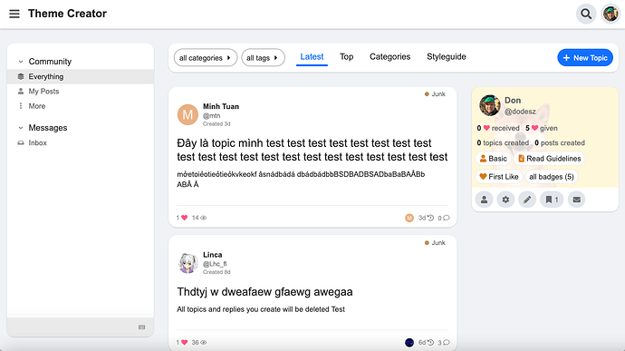](../../../assets/images/234323/67d0e6c0b4349dcd56bcf83c9787fefcb009a547.png "236285758-60d89e58-40bc-46fa-919a-a08f70e27183")

User page  

[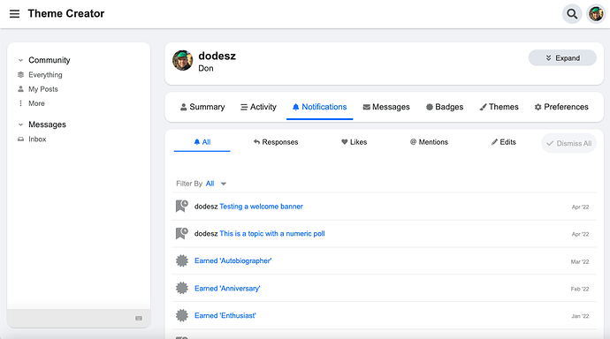](../../../assets/images/234323/acdbb7bf91a10358fa5065db089563f72651ddef.png "236286153-bb047a34-13f3-4a3b-b9e2-0d9c651c6382")

---

### Post #149 by [falcon9](../../users/falcon9.md)
*Posted: 2023-05-09 15:05*

[@Don](/u/Don) For some reason I cannot get the “between topic” ads to center when using the official ad plugin. No matter what I do it seems to force it to the left. The “between posts” ads work great.

---

### Post #150 by [EchoBilisim](../../users/EchoBilisim.md)
*Posted: 2023-05-19 10:43*

Hello, I want to close the part in the screenshot or I want to remove it, how do I turn it off?

[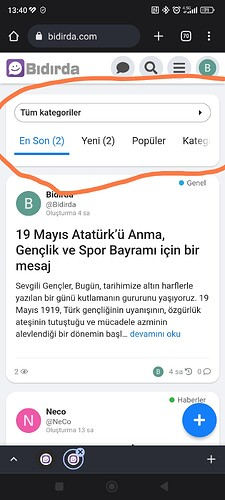](../../../assets/images/234323/0df8966d729bcdc043456645c1b8729a76bbebb9.jpeg "Screenshot_2023-05-19-13-40-19-670-edit_com.android.chrome")

---

### Post #151 by [Jagster](../../users/Jagster.md)
*Posted: 2023-05-19 11:09*

I don’t know but how would your users navigate then?

---

### Post #152 by [EchoBilisim](../../users/EchoBilisim.md)
*Posted: 2023-05-19 15:36*

I will only use it as a social network, so it doesn’t make sense to have it there, it would be better if there is no such option in any of the social networks, I think it would be better without it

---

### Post #153 by [Lilly](../../users/Lilly.md)
*Posted: 2023-05-19 16:01*

those are the navigator bar filter links (nav pills) and you can hide them with CSS. but i’m not sure i would do that with this theme (i don’t use it) because it’s heavily modified and showing those links in mobile view. my forum’s mobile view (and Meta’s) doesn’t have them by default so it looks like those are there on purpose for this theme. [@dodesz](/u/dodesz) should be able to tell you if it is possible without affecting the theme in unintended ways.

---

### Post #154 by [Don](../../users/Don.md)
*Posted: 2023-05-20 14:01*

Hello,

Yeah, you can try something like this.

Mobile/CSS
    
    
    .navigation-topics,
    .categories-list,
    body[class*="tag-"]:not(.archetype-regular):not(.archetype-banner),
    body[class*="category-"]:not(.archetype-regular):not(.archetype-banner) {
      .list-controls {
        .container {
          background: none;
          box-shadow: none;
          padding: 0;
          margin-bottom: 0;
          .navigation-container {
            &:before,
            &:after {
              display: none;
            }
            .category-breadcrumb {
              display: none !important;
            }
            #navigation-bar {
              display: none;
            }
          }
        }
      }
    }

---

### Post #155 by [EchoBilisim](../../users/EchoBilisim.md)
*Posted: 2023-05-20 14:34*

Thank you very much, it’s exactly what I wanted now

---

### Post #156 by [Yella_Pavan_Kumar1](../../users/Yella_Pavan_Kumar1.md)
*Posted: 2023-05-23 07:31*

Hi, I am facing this issue when I hide my sidebar.

Sidebar is not hidden(It is showing perfectly)  

[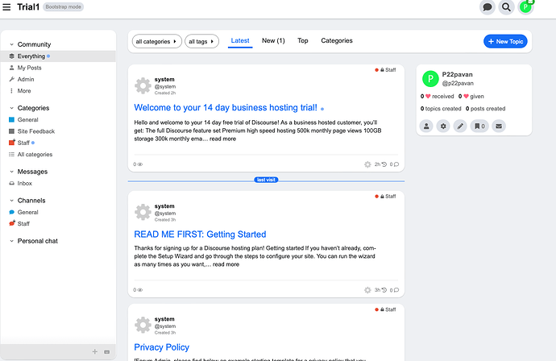](../../../assets/images/234323/1074240da76dab801c40642d6f4e846544d03d5b.png "Screenshot 2023-05-23 at 12.58.47")

Sidebar when hidden  

[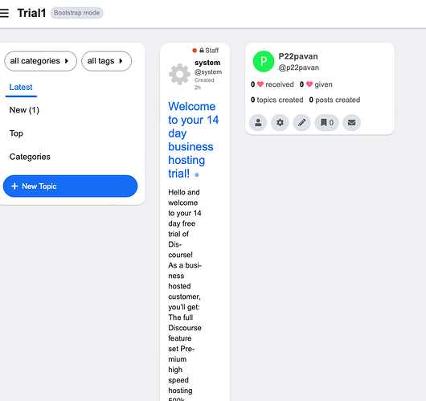](../../../assets/images/234323/a086f3905a34c3531944beccc1856e501bca8107.png "Screenshot 2023-05-23 at 12.58.22")

This only happens when I am on the latest tab with the sidebar hidden and with other tabs it works perfectly fine.

Please help me with this.

---

### Post #157 by [Jagster](../../users/Jagster.md)
*Posted: 2023-06-01 08:46*

When iPad is horizontally the sidebar (default one by Discourse) isn’t scrollable.

---

### Post #158 by [Jagster](../../users/Jagster.md)
*Posted: 2023-06-02 07:20*

Thanks! Works now.

---

[← Previous](234323-page-2.md) | **Page 3 of 10** | [Next →](234323-page-4.md)
