[🏠 Home](../../index.md) | [📋 Latest](../../latest/index.md) | [🔥 Top](../../top/replies/index.md) | [👥 Users](../../users/index.md)

[Home](../../index.md) » [Theme](../../c/theme/index.md) » FKB Pro - Social theme

---

# FKB Pro - Social theme (Page 4 of 10)

> **Category:** Theme
> **Author:** Nihat_Demir
> **Created:** 2022-07-28 20:58

[← Previous](234323-page-3.md) | **Page 4 of 10** | [Next →](234323-page-5.md)

---

### Post #159 by [Nihat_Demir](../../users/Nihat_Demir.md)
*Posted: 2023-06-04 23:12*

Hello [@Don](/u/Don), Excellent theme and thank you so much. Is there theme settings to use FKB Pro theme on ONLY selected categories? When you click All categories, I can see List View (default discourse view). For example, Category A shows a list view (default discourse view), Category B shows FKB Pro theme view.

---

### Post #160 by [Nihat_Demir](../../users/Nihat_Demir.md)
*Posted: 2023-06-04 23:21*

2. I use Discourse offical, Calendar Event plugin. I can create post with events and after created, plugin adds below screen into the post. Could you show event screen in the list page, so users can interact and click on Going, interested, not going buttons?  

[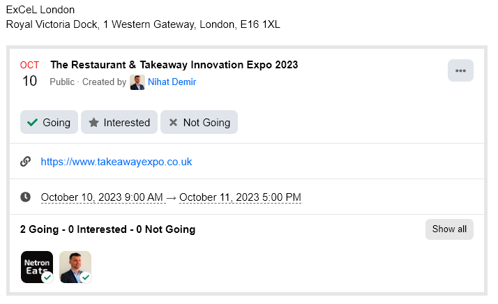](../../../assets/images/234323/ada14cb7bab8354a23bba5c4f38487d6fb5164aa.png "image")

---

### Post #161 by [Don](../../users/Don.md)
*Posted: 2023-06-08 06:09*

Hello [@Nihat_Demir](/u/nihat_demir) 👋

Thank for the kind words ❤️

 Nihat Demir:

> Is there theme settings to use FKB Pro theme on ONLY selected categories?

Sorry for the late reply. Unfortunately this is not possible with this theme.  
I think you can use this [Topic List Previews Theme Component](https://meta.discourse.org/t/topic-list-previews-theme-component/209973) instead of this theme to change the view per category.

 Nihat Demir:

> Could you show event screen in the list page, so users can interact and click on Going, interested, not going buttons?

I think this one possible with a plugin but not this theme. 😕

---

### Post #162 by [danielabc](../../users/danielabc.md)
*Posted: 2023-06-08 22:29*

How did you make embeds appear in posts in home topics?

---

### Post #163 by [sok777](../../users/sok777.md)
*Posted: 2023-06-09 17:06*

Thanks for creating! Been playing around - looks really cool.  
It seems there are a few accessibility issues though. Not big ones, mostly around the tags, photo and the contrast colors for var(–primary-med-or-secondary-med).

Any thoughts on this?

---

### Post #164 by [Nihat_Demir](../../users/Nihat_Demir.md)
*Posted: 2023-06-11 11:31*

Thank you [@Don](/u/Don)

---

### Post #165 by [hoangviet](../../users/hoangviet.md)
*Posted: 2023-06-13 17:22*

hello [@Don](/u/Don)  
Thank you very much for your beautiful theme

How to keep and scroll comment form?  
After opening the topic, How to setup this comment form Keep and Scroll on discourse, even when user is not logged in? Thanks everyone

[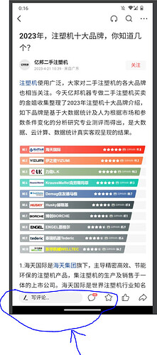](../../../assets/images/234323/79fb149b6d0519d12ed7f44412444faef54c41ad.jpeg "image")

---

### Post #166 by [outofthebox](../../users/outofthebox.md)
*Posted: 2023-06-15 18:06*

Great theme!

Is there a way to only use one part of this theme, in particular, how posts are displayed in the “Latest” view? E.g.

[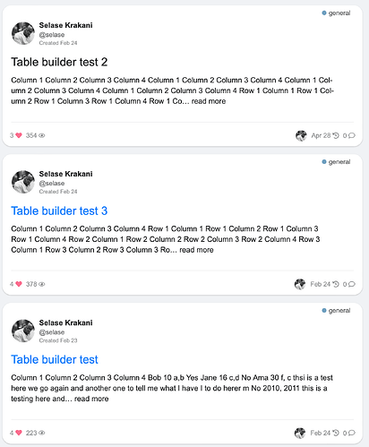](../../../assets/images/234323/7fad60be41eccd6ebb63483bdaa5c7eaa27fae88.png "Screenshot 2023-06-15 at 2.06.00 PM")

---

### Post #167 by [Lhc_fl](../../users/Lhc_fl.md)
*Posted: 2023-07-08 11:07*

[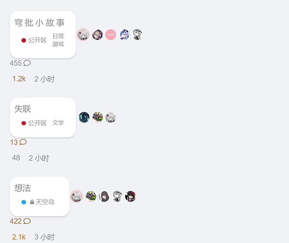](../../../assets/images/234323/a1e036093dee869275096d6ff4711752f34139d5.png "image")

  
Not sure if it’s my problem - but the FKB theme seems to be broken after a recent update to discourse

---

### Post #168 by [EchoBilisim](../../users/EchoBilisim.md)
*Posted: 2023-07-11 21:51*

Hello, I have one more request from you. I want to hide the places I marked in the picture, how can I hide them on both mobile and desktop computers.

[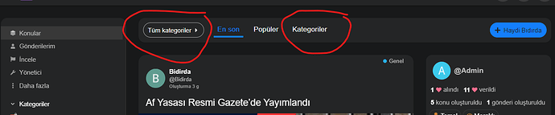](../../../assets/images/234323/40ebf5c73883512a354e2d49720ff6d263167261.png "Ekran görüntüsü 2023-07-12 004750")

I struggled a bit, I couldn’t do it, I would be very grateful if you could help me, thank you very much in advance.

---

### Post #169 by [Lilly](../../users/Lilly.md)
*Posted: 2023-07-12 00:05*

using english translation, i think those are the category breadcrumb dropdown and category nav filter.

try this in common css of a component.
    
    
    .category-breadcrumb {
        display: none;
    }    
    
    #navigation-bar {
       li.nav-item_categories {
         display: none;
       }
    }

---

### Post #170 by [EchoBilisim](../../users/EchoBilisim.md)
*Posted: 2023-07-12 12:08*

It’s ok, now it’s as I wanted, thank you very much, I’m glad you’re here

---

### Post #171 by [EchoBilisim](../../users/EchoBilisim.md)
*Posted: 2023-07-16 07:29*

I want to hide the categories from the side navigation menu, how can I hide it?

I have hidden all of them from the administration panel, but still the categories are visible. I want to hide the categories from the side navigation menu. I would appreciate your help, thanks in advance.

---

### Post #173 by [Airw0lf](../../users/Airw0lf.md)
*Posted: 2023-08-10 21:12*

See also attached image:  
This is the result from the up-scaling as seen [on the dashboard](https://forum.cyberbrein.nl/).  
The original one looks [like this](../../../assets/images/234323/70434c0678d7aa915a84836c319ef7fec4a47646_2_225x500.jpeg).

Is there a way to prevent this ugly up-scaling?

Thanks

=====

[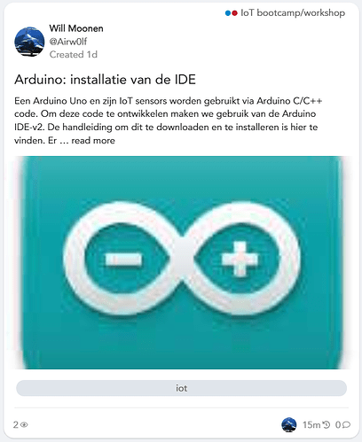](../../../assets/images/234323/464469a03224147433558563b6eb0d19c5afb31d.png "arduino-dashboard")

---

### Post #174 by [Canapin](../../users/Canapin.md)
*Posted: 2023-08-11 07:24*

Welcome, Will! 

The issue lays here:
    
    
    

    

Remove `background-size: cover;`, or add:
    
    
    .topic-image {
        background-size: auto !important;
    }
    

in your theme or a new component if you can’t edit the component that creates these thumbnails.

[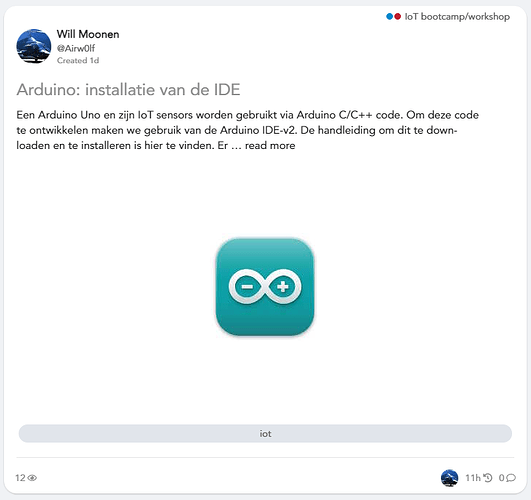](../../../assets/images/234323/96160a5f7b754dc14c16e0f630c1ebf0b125006b.png "image")

* * *

edit: it seems your use this theme: [FKB Pro - Social theme](https://meta.discourse.org/t/fkb-pro-social-theme/234323)  
I’ll move your topic in the dedicated topic. 🙂

---

### Post #175 by [Airw0lf](../../users/Airw0lf.md)
*Posted: 2023-08-11 14:56*

Thank you for the welcome and suggestion [@Canapin](/u/canapin).  
And yes - this is the right theme.

As I’m a real newbie here:  
I have no idea where to make this change.  
Could you point me in the right direction?

Thank you - Will

---

### Post #176 by [Canapin](../../users/Canapin.md)
*Posted: 2023-08-11 15:19*

Unless the author (Hi Don!) thinks it’s a welcome addition to change this, here’s what you can do:

  1. In your admin panel, go to Customize → Themes → Components.  
Click the `Install` button at the bottom of the list.

  2. Click `+ Create new`, choose a name (like “Custom CSS”, “Theme tweaks”, anything that you’d like and is descriptive enough), and click `Create`.  

[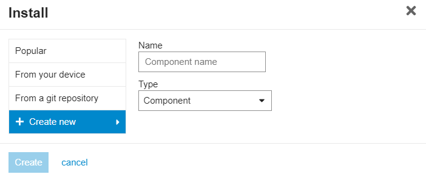](../../../assets/images/234323/cfb154027f6fcb5cf1bec6b2677dcfa6c8223584.png "image")

  3. Include the theme component in the FKB Pro theme:  
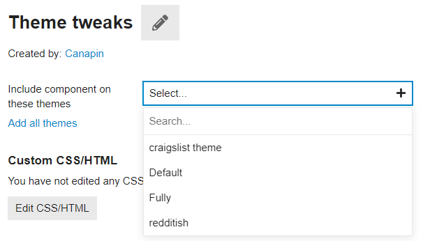

  4. Click `Edit CSS/HTML`, go to the CSS tab. Write:
         
         .topic-image {
             background-size: auto !important;
         }
         

Click `Save`.

That should fix your issue. 🙂

---

### Post #177 by [Airw0lf](../../users/Airw0lf.md)
*Posted: 2023-08-11 15:39*

Thank you - working as expected.

This is based on an override.  
How about removing this background-size?  
How would I do that?

I tried setting it to none.  
But that just brings back the thing I was trying to remove.  
If setting it to auto still increases the image - just in a different way.

---

### Post #178 by [Canapin](../../users/Canapin.md)
*Posted: 2023-08-11 15:47*

The `auto` value is the [default value](https://www.w3schools.com/cssref/css3_pr_background-size.php), which is equivalent to having no specific `background-size` rule. 🙂

---

### Post #179 by [Airw0lf](../../users/Airw0lf.md)
*Posted: 2023-08-11 16:03*

Ah - ok - thank you for this jumpstart in customizing themes. 😀

---

### Post #180 by [Don](../../users/Don.md)
*Posted: 2023-08-12 08:37*

Hello 

Thanks for bringing this up! I’ve made an update on topic image (thumbnail) section. 

[github.com/VaperinaDEV/fkb-pro-theme](../../../assets/images/234323/220023d0c425c2ccb5c3a0632961f2812fee4b2b_2_271x375.png)

####  [DEV: Makes the topic-image section more customizable](../../../assets/images/234323/220023d0c425c2ccb5c3a0632961f2812fee4b2b_2_271x375.png)

`main` ← `topic-image-modification`

merged 08:37AM - 12 Aug 23 UTC

[  VaperinaDEV ](https://github.com/VaperinaDEV)

[ +54 -24 ](https://github.com/VaperinaDEV/fkb-pro-theme/pull/22/files)

With this update I replace `background` with `` and optionally a backdrop image can be added to this. The backdrop can handle the small image _(which not cover this section)_ empty area. It works like a _hacky_ dominant color background with the default settings.

I have added some new settings. With this setting you can choose the:

[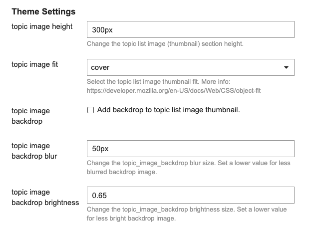](../../../assets/images/234323/6f00e1115e78b216455909d86835ce7061d9559d.png "Screenshot 2023-08-12 at 10.12.16")

  1. Topic image section height (default: 300px)

  2. Image fit

  * cover (default)
  * contain
  * scale-down
  * none

  3. Backdrop image (default: disable)

  4. Backdrop image blur

  5. Backdrop image brightness

* * *

This is how it looks:

**Default (image fit cover, no backdrop)**

**Image fit contain**

[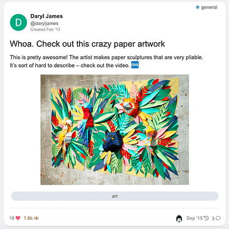](../../../assets/images/234323/6fcecefb0a941b0700f8b038de63b2c758e2b08e.png "Screenshot 2023-08-12 at 10.15.25")

**Image fit contain with backdrop**

[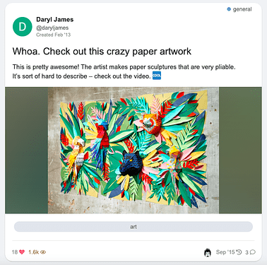](../../../assets/images/234323/5de754a61af4cd9074cbcba400b1c523183fdd7d.png "Screenshot 2023-08-12 at 10.16.24")

**Difference between image fit (cover, contain, scale-down and none)**

small image

[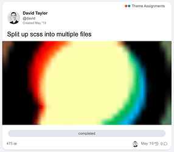](../../../assets/images/234323/8f4cec96c9d57b4d908c223102badde5f2f8c08e.png "Screenshot 2023-08-12 at 10.21.23")

  

[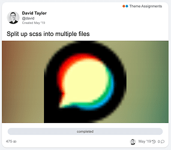](../../../assets/images/234323/1295c96ba77edd543462247bd707562b99a6fc5d.png "Screenshot 2023-08-12 at 10.17.58")

  

[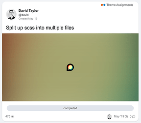](../../../assets/images/234323/de6f98ea69dfb5680b8362b64807c4ed0f11e0b7.png "Screenshot 2023-08-12 at 10.20.16")

  

[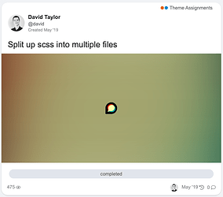](../../../assets/images/234323/7eefd58fc71646cd481ae6a902413da83ce42adc.png "Screenshot 2023-08-12 at 12.04.39")

larger image

[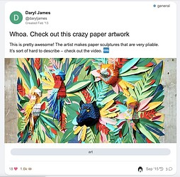](../../../assets/images/234323/e145ea4149ea21426ee6e2ed93192c836119deef.jpeg "Screenshot 2023-08-12 at 10.14.33")

  

[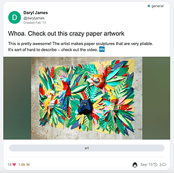](../../../assets/images/234323/5de754a61af4cd9074cbcba400b1c523183fdd7d.png "Screenshot 2023-08-12 at 10.16.24")

  

  

[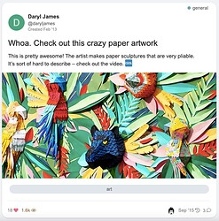](../../../assets/images/234323/2fcb10ec8ca3cebd77b7eeb39fb3199e5d51a6e2.jpeg "Screenshot 2023-08-12 at 12.05.55")

* * *

**Difference between blur and brightness values**  
blur  
50px, 25px, 10px

  

[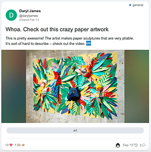](../../../assets/images/234323/0175ebdc28aaf222202a7f1fc697feaf3cb2b15f.png "Screenshot 2023-08-12 at 10.24.35")

  

[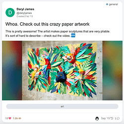](../../../assets/images/234323/7955f9c371d7d09bc5c5b89fefecb599ebf5ee7f.png "Screenshot 2023-08-12 at 10.25.28")

brightness  
0.65, 0.55, 0.45

  

[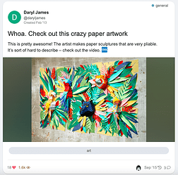](../../../assets/images/234323/51c347c2ae2fe35b38e1e77df979b31224b3f018.png "Screenshot 2023-08-12 at 10.27.40")

  

[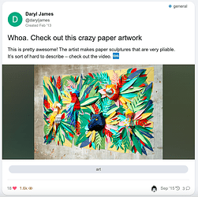](../../../assets/images/234323/26f62b80e76081b9bc269a009f5f9422bc928e8a.png "Screenshot 2023-08-12 at 10.28.17")

* * *

Edit: Forget to add the image fit `none` option.

[github.com/VaperinaDEV/fkb-pro-theme](../../../assets/images/234323/23998dcd6d1ef352ebcadc506c447ea52bcfa680_2_1035x492.jpeg)

####  [FIX: Add image fit none option](../../../assets/images/234323/23998dcd6d1ef352ebcadc506c447ea52bcfa680_2_1035x492.jpeg)

`main` ← `add-object-fit-none`

merged 09:51AM - 12 Aug 23 UTC

[  VaperinaDEV ](https://github.com/VaperinaDEV)

[ +4 -0 ](https://github.com/VaperinaDEV/fkb-pro-theme/pull/23/files)

---

### Post #181 by [vifyirusti](../../users/vifyirusti.md)
*Posted: 2023-08-28 03:58*

Hello, I would like to point out some errors.

The following sensitivity issue appears on the users, groups and topics page (with a few posts).

desktop view only

Users  

[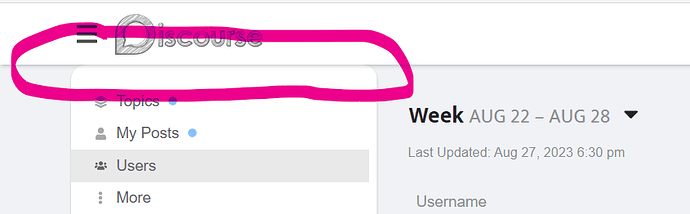](../../../assets/images/234323/f4ef4af9033588787eb4058023cf327c61715084.png "image")

Groups  

[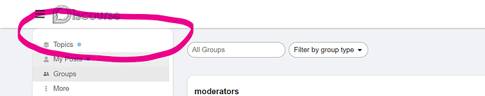](../../../assets/images/234323/a1354658a1dafaf22773b9eae260c40d4c187624.png "image")

It works perfectly on other pages as in the image below.  

[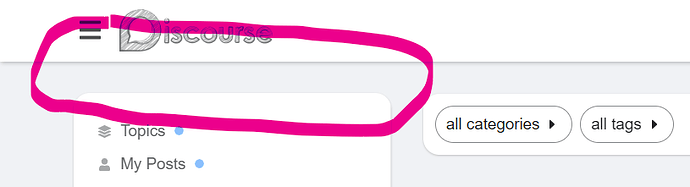](../../../assets/images/234323/cba28886cf6b84f06afcf807195be2b9facf1812.png "image")

As I understand it, the cause of the problem is the category, title, content, etc. It happens on pages with little content.

---

### Post #182 by [Don](../../users/Don.md)
*Posted: 2023-08-28 05:04*

Thanks for the report [@vifyirusti](/u/vifyirusti) 👍 I’ve fixed it, please update the theme 

---

### Post #183 by [vifyirusti](../../users/vifyirusti.md)
*Posted: 2023-08-28 06:24*

We thank you. You are so fast.

I want to report one more bug.

The “Category” name of the posts under Latest, New and Top is not in the right place. (with Topic Ratings Plugin)

[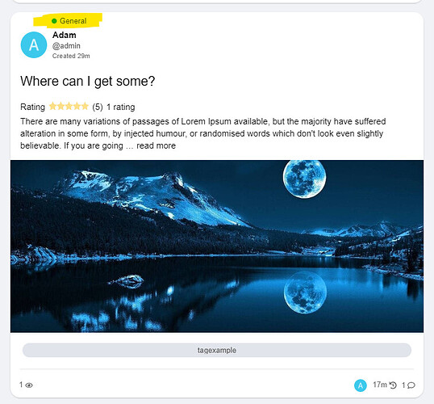](../../../assets/images/234323/41b49d5e2cec2137a0504532524cac55fafb2dd5.jpeg "image")

Kind regards [@Don](/u/don)

---

### Post #184 by [Don](../../users/Don.md)
*Posted: 2023-08-28 08:41*

Yeah I see, unfortunately I can’t test it now with the Topic Ratings Plugin but I think I know what is happening here. 

The Topic Ratings Plugin use this code for the `link-top-line` element.

[github.com/paviliondev/discourse-ratings](https://github.com/paviliondev/discourse-ratings/blob/14cec366c19f4e67e5266ce42c9b49e72800e9b5/assets/stylesheets/desktop/ratings.scss#L1C1-L3)

#### [assets/stylesheets/desktop/ratings.scss](https://github.com/paviliondev/discourse-ratings/blob/14cec366c19f4e67e5266ce42c9b49e72800e9b5/assets/stylesheets/desktop/ratings.scss#L1C1-L3)

[`14cec366c`](https://github.com/paviliondev/discourse-ratings/blob/14cec366c19f4e67e5266ce42c9b49e72800e9b5/assets/stylesheets/desktop/ratings.scss#L1C1-L3)
    
    
          
    
    
              
        1. .topic-list-item.has-ratings .link-top-line {
    
              
        2.   display: flex;
    
              
        3.   flex-flow: wrap;
    
          
    
        

It is shrinking the `link-top-line` in FKB Pro theme and this is why the category badge placed above the user datas because that is the width of the element `byline` which contains the category badge and user datas so this is depends on how width is this element.

---

### Post #186 by [Don](../../users/Don.md)
*Posted: 2023-08-28 13:51*

Thank you, I’ve merged a fix. 👍 Please update the theme.

---

### Post #187 by [vifyirusti](../../users/vifyirusti.md)
*Posted: 2023-08-28 13:56*

joke? 😍 You are really fast. Thank you very much.

---

### Post #188 by [carltheobesecat](../../users/carltheobesecat.md)
*Posted: 2023-08-30 08:20*

Hey just letting you know this is broken. Its at the bottom of any message.  

[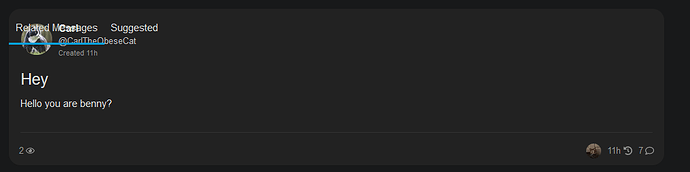](../../../assets/images/234323/02b322a4e77bc617a39001d126b169654d6b52e9.png "image")

---

### Post #189 by [Don](../../users/Don.md)
*Posted: 2023-08-30 09:27*

Hey [@carltheobesecat](/u/carltheobesecat), thanks for the report  I’ve fixed it. 👍

---

### Post #190 by [Drew-ART](../../users/Drew-ART.md)
*Posted: 2023-09-11 16:10*

Lovely theme. Seems to have issues with the Kanban plugin forcing the right box out of the page borders

[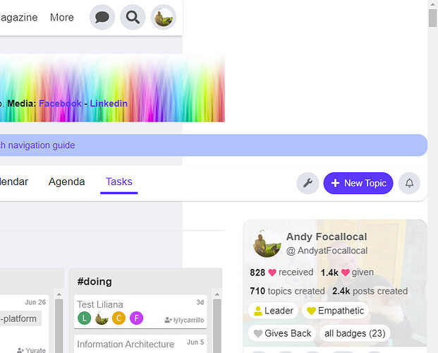](../../../assets/images/234323/2d720edae473450652b9408ea4406ccc9dbca7d1.jpeg "image")

---

### Post #191 by [Drew-ART](../../users/Drew-ART.md)
*Posted: 2023-09-11 17:05*

Seeing a similar sizing issue with this component:

[github.com](https://github.com/naidihr/discourse-category-headers)

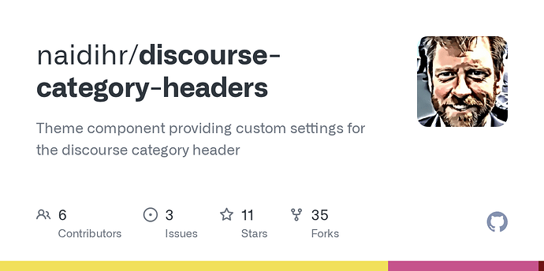

### [GitHub - naidihr/discourse-category-headers: Theme component providing custom settings for the...](https://github.com/naidihr/discourse-category-headers)

Theme component providing custom settings for the discourse category header

[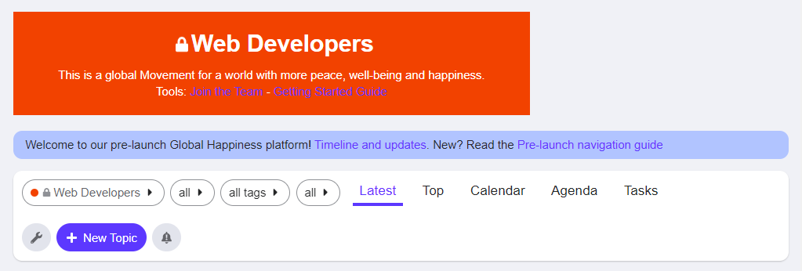](../../../assets/images/234323/d3972e12f6b99c023992a3ba45a4cb95d7ff216b.png "image")

---

### Post #192 by [Don](../../users/Don.md)
*Posted: 2023-10-02 16:27*

Hello [@Drew-ART](/u/drew-art) 👋

Thanks for the report… I’ve merged a fix and made some styling change in [Kanban Board](https://meta.discourse.org/t/kanban-board/118164) to suits more to the theme. 👍

---

### Post #193 by [Drew-ART](../../users/Drew-ART.md)
*Posted: 2023-10-04 13:03*

Working great, thank you [@Don](/u/don)

Another suggestion i have, if you are seeking feedback, is that the viewport for project management tools like Kanban and Calendar can get quite squeezed.

[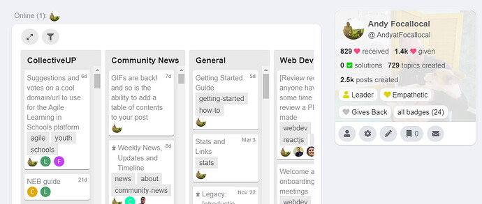](../../../assets/images/234323/930726504b6f2113b80be2c79c81cbfafbf0170e.jpeg "image")

That could be solved if the user profile module on the right had a minimize button, so users could hide it when they want more space.

---

### Post #194 by [LoveMCJ](../../users/LoveMCJ.md)
*Posted: 2023-10-09 10:09*

Hi,

[@Don](/u/don)

It seems that the Slick Image Gallery and Masonry Image Gallery (theme-component) is not working. Can you help me?

---

### Post #195 by [LoveMCJ](../../users/LoveMCJ.md)
*Posted: 2023-10-11 10:17*

[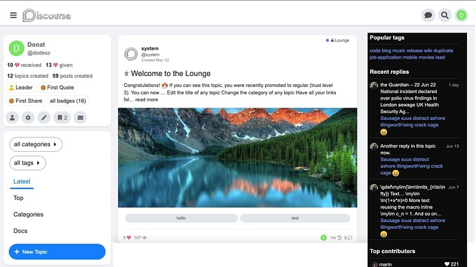](../../../assets/images/234323/64fff8939c130da66014ea2c1a8d32c27b21a44f.jpeg "Screenshot 2023-10-11 at 7.11.17 PM")

[@Don](/u/don)  
Hi,

Is it not possible to position the “original fkb right panel” in the upper left corner of the page when using “Right Sidebar Blocks”? I think it would be a great feature, especially if it could be limited to desktop only. This would allow for a more rich left side on desktop.

---

### Post #196 by [LoveMCJ](../../users/LoveMCJ.md)
*Posted: 2023-10-11 19:18*

[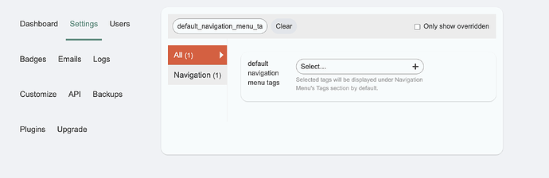](../../../assets/images/234323/d9e3ca09c5249a72630b1d51042b8e42b63d8d3f.png "Screenshot 2023-10-12 at 4.15.33 AM")

Setting “Right Sidebar Blocks” will cause the Admin page to crash.

---

### Post #197 by [Don](../../users/Don.md)
*Posted: 2023-10-12 10:00*

Thanks for the report 👍 I’ve fixed it via: [FIX: Target Right Sidebar Blocks more specific · VaperinaDEV/fkb-pro-theme@42a7df4 · GitHub](https://github.com/VaperinaDEV/fkb-pro-theme/commit/42a7df4f4cff8512e6fc3d36880e3dc4c5eaf1f7)

---

### Post #198 by [LoveMCJ](../../users/LoveMCJ.md)
*Posted: 2023-10-12 10:06*

It works perfectly! Thank you!

---

### Post #199 by [Don](../../users/Don.md)
*Posted: 2023-10-12 10:32*

I checked the [Slick Image Gallery](https://meta.discourse.org/t/slick-image-gallery/81952) and [Masonry Image Gallery](https://meta.discourse.org/t/masonry-image-gallery/188315) theme components. Works fine for me.

Note that there should be an empty line below `
` line.

Like this it should work. I placed two images in `
`.

Slick Image Gallery  
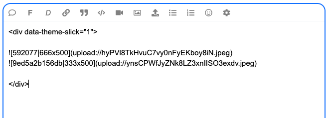

Masonry Image Gallery  

---

### Post #200 by [LoveMCJ](../../users/LoveMCJ.md)
*Posted: 2023-10-12 11:53*

**I have confirmed that it is working. Thank you!**

---

### Post #201 by [LoveMCJ](../../users/LoveMCJ.md)
*Posted: 2023-10-13 18:14*

Is there a compatibility issue with the **Discourse Docs (Documentation Management)** plugin?

At the [Docs](https://meta.discourse.org/docs)

Only Topic List : The title, category name, and tags should be displayed as expected.

However, the body of the document is also displayed, and the tags are displayed in three lines, which causes the layout to collapse.

---

### Post #202 by [Don](../../users/Don.md)
*Posted: 2023-10-13 18:53*

Thanks for the report 🙂 I’ve merged a fix: [UX: Fixes some docs compatibility issue by VaperinaDEV · Pull Request #30 · VaperinaDEV/fkb-pro-theme · GitHub](../../../assets/images/234323/3001378bdca66eeb1440d265104daabb853aefa1_2_1035x492.jpeg)

---

### Post #203 by [LoveMCJ](../../users/LoveMCJ.md)
*Posted: 2023-10-13 20:35*

[@Don](/u/don)

I sincerely thank you for your quick support. It works perfectly! Have a nice day! 

---

### Post #204 by [Don](../../users/Don.md)
*Posted: 2023-10-14 14:11*

**Hello** 👋

Update 

  1. Set up custom FKB Panel footer links
  2. Added a button to hide the right side FKB Panel

[github.com/VaperinaDEV/fkb-pro-theme](https://github.com/VaperinaDEV/fkb-pro-theme/pull/31)

####  [DEV: Adds the ability to set up custom FKB Panel footer links and added a button to hide the FKB Panel ](https://github.com/VaperinaDEV/fkb-pro-theme/pull/31)

`main` ← `fkb-panel-dev`

merged 02:06PM - 14 Oct 23 UTC

[  VaperinaDEV ](https://github.com/VaperinaDEV)

[ +91 -5 ](https://github.com/VaperinaDEV/fkb-pro-theme/pull/31/files)

1\. Custom FKB Panel footer links

By default it was hardcoded 🔽

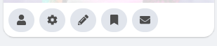

Now, this section can be easily change with a setting 🔽  
The items used before are preloads in this settings by default.  
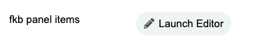  

[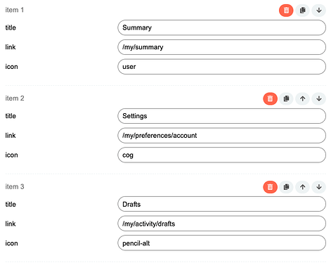](../../../assets/images/234323/06fb5e3ead249acc93dff136a74b254d1e39ad54.png "Screenshot 2023-10-14 at 15.59.37")

* * *

2\. Button to hide the right side FKB Panel

 Drew:

> That could be solved if the user profile module on the right had a minimize button, so users could hide it when they want more space.

Great idea, thanks 🙂  
I’ve added a button to the page bottom to hide the FKB Panel. It saves the state in localStorage and keeps the actual state after reload the page too on the device.

---

### Post #205 by [LoveMCJ](../../users/LoveMCJ.md)
*Posted: 2023-10-14 19:56*

💯 That’s so cool! Great job! 😃

---

### Post #207 by [Jonathan_Poyer](../../users/Jonathan_Poyer.md)
*Posted: 2023-10-16 16:43*

This theme looks like the start of what my users scream at me to have. They asked me to have a theme where you could scroll through and in a glance see what has happened since they visited the page.

However, I am wondering how this works for the latests posts on a topic. Would they still have to click on each topic to see what happened or can they see all the posts they have not checked yet since last time they visited?

---

### Post #209 by [Don](../../users/Don.md)
*Posted: 2023-10-17 17:13*

 Jonathan:

> However, I am wondering how this works for the latests posts on a topic. Would they still have to click on each topic to see what happened or can they see all the posts they have not checked yet since last time they visited?

Hello [@Jonathan_Poyer](/u/jonathan_poyer), Yeah you need to click the topic to see the replies. But you can use the[Right Sidebar Blocks](https://meta.discourse.org/t/right-sidebar-blocks/231067) theme component where you can set latest posts section. This theme is compatible with it since [FKB Pro - Social theme - #102 by Don](https://meta.discourse.org/t/fkb-pro-social-theme/234323/102).

~~Or you can check the[A reddit-ish theme for Discourse](https://meta.discourse.org/t/a-reddit-ish-theme-for-discourse/269466). This theme contains a latest posts block by default.~~ 🙂 Sorry, it is not contains the latest post but recent (latest) topics you see…

* * *

[@LoveMCJ](/u/lovemcj) you can check easily where are the connectors with [Plugin outlet locations theme component](https://meta.discourse.org/t/plugin-outlet-locations-theme-component/100673) 🙂

---

### Post #210 by [Drew-ART](../../users/Drew-ART.md)
*Posted: 2023-10-17 19:59*

A see a small conflict with the Blog Post Styling component.

[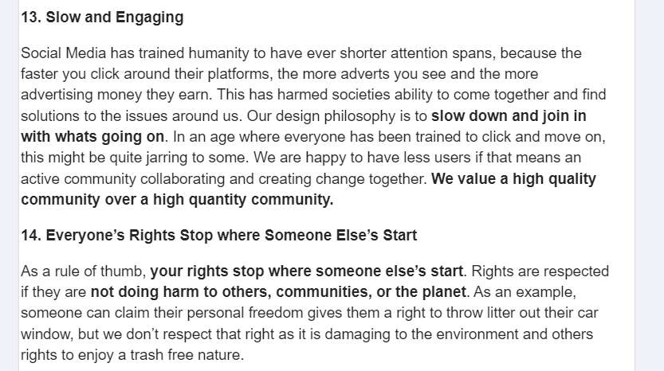](../../../assets/images/234323/c3e5a36625ccbf5e7ce94f23278433e744165afc.png "image")

The text begins a little too close to the left edge. I’ll turn that component off with the FKP Pro theme for now, just thought you’d like to know.

---

### Post #212 by [Skeleton](../../users/Skeleton.md)
*Posted: 2023-10-25 15:13*

I’ve set that by default when you go to All Categories, it displays just subcategories and on Desktop works great. On mobile instead, it displays the parent category in a different way too. I’m using FKB Pro theme. How can i display just subcategories on mobile?

---

### Post #213 by [Don](../../users/Don.md)
*Posted: 2023-10-26 10:50*

Hey [@Skeleton](/u/skeleton) 👋 Thanks for the report, I’ve fixed it via [UX: Hide parent-category on category page · VaperinaDEV/fkb-pro-theme@e627d53 · GitHub](https://github.com/VaperinaDEV/fkb-pro-theme/commit/e627d53cc5f7eb69b8cc282c2157c8d02bcd88a0) and [UX: Fix subcategory border on category page · VaperinaDEV/fkb-pro-theme@c64784b · GitHub](https://github.com/VaperinaDEV/fkb-pro-theme/commit/c64784bd7675a5c3ed0e88365bfc3312b2ea181d).  
Please update the [FKB Pro - Social theme](https://meta.discourse.org/t/fkb-pro-social-theme/234323). 🙂

---

[← Previous](234323-page-3.md) | **Page 4 of 10** | [Next →](234323-page-5.md)
