[🏠 Home](../../index.md) | [📋 Latest](../../latest/index.md) | [🔥 Top](../../top/replies/index.md) | [👥 Users](../../users/index.md)

[Home](../../index.md) » [Theme](../../c/theme/index.md) » FKB Pro - Social theme

---

# FKB Pro - Social theme (Page 5 of 10)

> **Category:** Theme
> **Author:** LoveMCJ
> **Created:** 2022-07-28 20:58

[← Previous](234323-page-4.md) | **Page 5 of 10** | [Next →](234323-page-6.md)

---

### Post #214 by [LoveMCJ](../../users/LoveMCJ.md)
*Posted: 2023-10-26 15:08*

Hi, [@Don](/u/don)

**Report:**

**Discourse Insert Video**  
**(theme-component)**

Even if an image is added to the Poster image (optional) setting in ‘Discourse Insert Video’, it is not displayed in the feed on the site’s main page. As usual, only the first image of the video is displayed.

---

### Post #215 by [the220hq](../../users/the220hq.md)
*Posted: 2023-10-31 10:57*

Is there any option to show “The right sidebar” for both visitors and members? Thank you!

---

### Post #216 by [Don](../../users/Don.md)
*Posted: 2023-10-31 17:51*

Hello [@the220hq](/u/the220hq) 👋 The right sidebar contains information for members so for visitors appear a different customizable version. You can see it [here](https://meta.discourse.org/t/fkb-pro-social-theme/234323#fkb-panel-5). 🙂

---

### Post #217 by [Jishnu_44](../../users/Jishnu_44.md)
*Posted: 2023-10-31 22:59*

How about adding a footer tab similar to Instagram’s? Could you please consider integrating such a footer tab into this theme? 😉

---

### Post #218 by [Jagster](../../users/Jagster.md)
*Posted: 2023-10-31 23:27*

Maybe with this:

[Discourse Tab Bar for Mobile](https://meta.discourse.org/t/discourse-tab-bar-for-mobile/75696) [Theme component](/c/theme-component/120)

> GitHub repository: Screenshots [[thumbnail]](../../../assets/images/234323/b35f6131ef30f699e5bad0a9f31bfef53a83e89f.png "thumbnail") [[image]](../../../assets/images/234323/c4dddd024c0f548fc24f5e7f4ac0076e08b83472.png) Installation Follow the instructions in this [howto](/tag/howto) topic: Customization See the [readme](https://github.com/OsamaSayegh/discourse-tab-bar-theme/blob/master/README.md) file in the theme’s GitHub repository. Ideas to improve this theme are very welcome  Update 24/12/2018: You no longer need to overwrite any code in order to customize this theme. It’s now shipped with theme settings that allow customization for each of the 6 tabs with ability to disable any tab. See the [readme](https://github.com/OsamaSayegh/discourse-tab-bar-theme/blob/master/README.md) file for detai… 

Or…

[Topic Footer Buttons](https://meta.discourse.org/t/topic-footer-buttons/116968) [Theme component](/c/theme-component/120)

>  Summary Custom Topic Button defines a button visible at the bottom of your topic to open a URL of your choice. Custom Group Topic Button defines a button visible at the bottom of your topic to open a URL of your choice, with added group visibility options. 👓 Preview [Preview on Discourse Theme Creator](https://discourse.theme-creator.io/theme/Discourse/custom-topic-button) (Custom Topic Button) 🛠️ Repository Link(s) <https://github.com/discourse/discourse-custom-topic-button-component> [https://github.com/disco…](https://github.com/discourse/discourse-topic-group-button-component)

---

### Post #219 by [Ashwani_Kumar](../../users/Ashwani_Kumar.md)
*Posted: 2023-11-01 11:33*

[@Don](/u/don) I don’t find the moving Topics from one category to other from UI though we have option in default theme  

[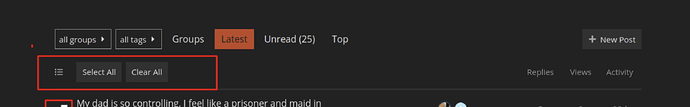](../../../assets/images/234323/4eeda002c149b26233c1d3d9c30c3d62326e3557.png "image")

---

### Post #220 by [Don](../../users/Don.md)
*Posted: 2023-11-01 11:48*

Hello 👋 Yeah the bulk select not yet available in this theme.

---

### Post #221 by [LoveMCJ](../../users/LoveMCJ.md)
*Posted: 2023-11-06 14:19*

[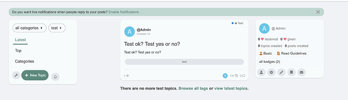](../../../assets/images/234323/c6781a628a791f9bc5886e88ea8279dab7eb3bb7.png "Screenshot 2023-11-06 at 11.13.55 PM")

[@Don](/u/don)  
Hi,

When the text of a title is short, the middle layout of the three columns is not centered in the wide width, but is shifted to the right.

Can the layout be fixed to a 3-column layout with good balance, even in the case of short titles, as in the case of long titles?

---

### Post #222 by [Igor_Rezende](../../users/Igor_Rezende.md)
*Posted: 2023-11-09 12:14*

[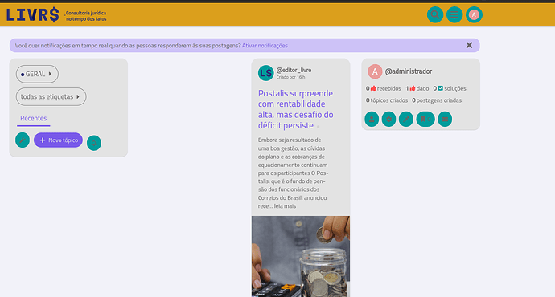](../../../assets/images/234323/ab3ea497ec1d626dc6363db83c91aedaf3af598e.png "image")

  
I have a problem with my layout, now shows this format, how a mobile format, is it a configuration or bug?

---

### Post #223 by [Don](../../users/Don.md)
*Posted: 2023-11-09 16:35*

Hey [@LoveMCJ](/u/lovemcj) 👋 Thanks I will check this. 

 Igor Rezende:

> I have a problem with my layout, now shows this format, how a mobile format, is it a configuration or bug?

Hello 👋 it looks like this is not the latest version please update the theme. If the issue still exist it is maybe the same kind of like [FKB Pro - Social theme - #221 by LoveMCJ](https://meta.discourse.org/t/fkb-pro-social-theme/234323/221).

---

### Post #224 by [Drew-ART](../../users/Drew-ART.md)
*Posted: 2023-11-10 00:46*

Found a small conflict with another plugin.

[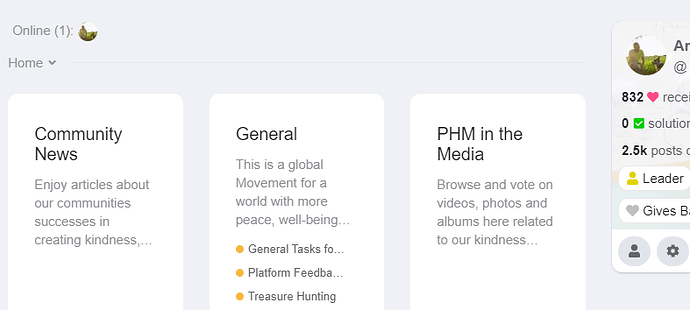](../../../assets/images/234323/b23e04f229e6412aea41ff7d1277ebc1c106ae8d.png "image")

The Collapsible Category Groups gets too squeezed on smallish screens )anything under 13.5’) by the right side module. Making that side module collapsible or forcing a minimum width on the categories in that plugin would solve it if you wanted to do so.

---

### Post #225 by [Don](../../users/Don.md)
*Posted: 2023-11-10 04:53*

Since this update you can hide the right sidebar.

 [FKB Pro - Social theme](https://meta.discourse.org/t/fkb-pro-social-theme/234323/204) [Theme](/c/theme/61)

> Hello 👋 Update  Set up custom FKB Panel footer links Added a button to hide the right side FKB Panel 1\. Custom FKB Panel footer links By default it was hardcoded 🔽 [Screenshot 2023-10-14 at 15.57.53] Now, this section can be easily change with a setting 🔽 The items used before are preloads in this settings by default. [Screenshot 2023-10-14 at 15.58.43] [[Screenshot 2023-10-14 at 15.59.37]](../../../assets/images/234323/06fb5e3ead249acc93dff136a74b254d1e39ad54.png "Screenshot 2023-10-14 at 15.59.37") 2\. Button to hide the right side FKB Pa…

---

### Post #226 by [Igor_Rezende](../../users/Igor_Rezende.md)
*Posted: 2023-11-10 09:14*

How do I check the version of the theme I’m using?

How do I update of the theme?

---

### Post #227 by [Don](../../users/Don.md)
*Posted: 2023-11-10 15:03*

 [Install a theme or theme component](https://meta.discourse.org/t/install-a-theme-or-theme-component/63682) [Site Management](/c/documentation/site-management/53)

> Importing new themes and theme components head to Admin → Customize → Themes and press the Install button. [[image]](../../../assets/images/234323/8f5e0ecf18903f11c89cd264ef73052dcca8fb5f.png "image") [[image]](../../../assets/images/234323/42dded361073c99604882c392306611322ebd724.png "image") From the Install dialog, you can … choose popular Discourse themes and theme components install from a Git repository URL link install from your local device (rare) If you are installing a complete theme, you’re done! If you install a theme component , you will need to add that theme component to your active themes. Keep reading. Add theme components to a …

---

### Post #228 by [LoveMCJ](../../users/LoveMCJ.md)
*Posted: 2023-11-14 11:57*

[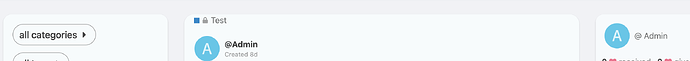](../../../assets/images/234323/e402c52e6853ffe583ed9ca2486dccf4842fd3d0.png "Screenshot 2023-11-14 at 8.40.31 PM")

[@Don](/u/don)  
Hi,

After the Discourse update, the “Category badge” has been moved to the left.

---

### Post #229 by [LoveMCJ](../../users/LoveMCJ.md)
*Posted: 2023-11-14 12:01*

 [FKB Pro - Social theme](https://meta.discourse.org/t/fkb-pro-social-theme/234323/221) [theme](/c/theme/61)

> [[Screenshot 2023-11-06 at 11.13.55 PM]](../../../assets/images/234323/c6781a628a791f9bc5886e88ea8279dab7eb3bb7.png "Screenshot 2023-11-06 at 11.13.55 PM") [@Don](/u/don) Hi, When the text of a title is short, the middle layout of the three columns is not centered in the wide width, but is shifted to the right. Can the layout be fixed to a 3-column layout with good balance, even in the case of short titles, as in the case of long titles? 

Also, is there any update on this issue?

This issue can be found on wide monitors and laptops…

If this issue can be temporarily resolved by applying CSS, I would appreciate it if you could provide the optimized CSS code.

---

### Post #230 by [Don](../../users/Don.md)
*Posted: 2023-11-14 13:39*

Hello [@LoveMCJ](/u/lovemcj) 👋 I’ve merged an update which should fix these issues. Thanks 🙂

---

### Post #231 by [LoveMCJ](../../users/LoveMCJ.md)
*Posted: 2023-11-14 16:46*

[@Don](/u/don)

Hi, ✋

The original fkb panel looks balanced with it, but enabling the “Enabling this will add Right Sidebar Blocks theme component” does not look as balanced as the original fkb panel. Can you adjust the 3 columns to look balanced like the original fkb panel when using the “Right Sidebar Blocks theme component”? Thank you very much for your support. 🙏

---

### Post #232 by [Don](../../users/Don.md)
*Posted: 2023-11-14 17:05*

Thanks, I’ve merged a fix for Right Sidebar Blocks layout. 🙂

---

### Post #233 by [LoveMCJ](../../users/LoveMCJ.md)
*Posted: 2023-11-14 17:24*

[@Don](/u/don)  
Your work is so fasttrack! I’m impressed. 😍

Have a nice day~ 👍

---

### Post #234 by [the220hq](../../users/the220hq.md)
*Posted: 2023-11-18 02:16*

I’ve checked my update latest, but the category is still at left side.

---

### Post #235 by [LoveMCJ](../../users/LoveMCJ.md)
*Posted: 2023-11-18 20:28*

[@Don](/u/don)  
Hi,  
I’ve applied the ‘Custom embedded replies (theme-component)’ to the ‘FKB Pro - Social themed’. It’s not bad on the desktop, but on mobile, the right comment column layout is quite narrow, and the ‘Jump to post’ icon is also attached to the bottom. As a result, the space on the left appears quite wide. Do you have any plans to arrange the thread and user icon on the left column part as far to the left as possible, and adjust the layout to balance it so that the comments can be seen a bit wider?

---

### Post #236 by [Drew-ART](../../users/Drew-ART.md)
*Posted: 2023-11-28 15:50*

[@Don](/u/don) I’ve stumbled into another minor conflict between FKB Pro and Discourse Custom Wizard

 [Coöperative – 27 Nov 23](../../../assets/images/234323/51c347c2ae2fe35b38e1e77df979b31224b3f018_2_252x249.png "11:56AM - 27 November 2023") 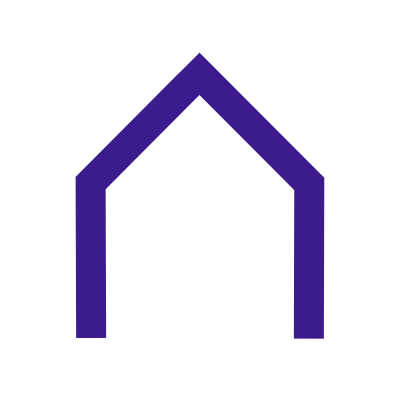

### [Bug: No notification for users of which form elements are required](../../../assets/images/234323/51c347c2ae2fe35b38e1e77df979b31224b3f018_2_252x249.png)

Support Discourse Custom Wizard

custom-wizard

It’ll be down for a few mins as i’m trying discourse doctor and a rebuild

---

### Post #237 by [Don](../../users/Don.md)
*Posted: 2023-11-28 17:06*

Thanks [@Drew-ART](/u/drew-art), I removed the outline overrides. 👍 After update theme it should work.

---

### Post #238 by [Drew-ART](../../users/Drew-ART.md)
*Posted: 2023-12-01 13:56*

If i wanted to add custom CSS to the theme, would i be right in thinking that the ‘settings editor’ is replacing the edit html/css button?

So where [@Don](/u/don)’s CSS finishes:
    
    
    {
    	"setting": "dark_btn_hover",
    	"value": "rgba(var(--primary-rgb),.1)"
    }
    ]
    

I’d just carry on below like with something like this
    
    
    data-category-id='offers' [
      .discourse-kanban-list {
    	 width: 50%;
         }
    ]
    

(one category only has two columns in its Kanban board and i want those to be wider, 50% of the space each)

---

### Post #239 by [Fma965](../../users/Fma965.md)
*Posted: 2023-12-11 10:10*

Is it possible to use the Right Sidebar component with the “stock” FKB panel? so that the top section is FKB panel but below it is the rest of the Right Sidebar component?

---

### Post #240 by [Fma965](../../users/Fma965.md)
*Posted: 2023-12-11 16:15*

Also, there is an issue when the sidebar is closed there is a gap to the right  

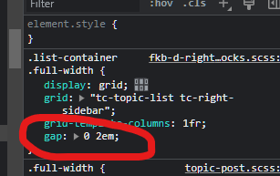

Obviously this gap is needed when the sidebar is visible but not when it’s hidden.

Presumably the fix is this
    
    
    .fkb-panel-hidden .list-container .full-width { 
    	gap: 0;
    }

---

### Post #241 by [thisisjoshjones](../../users/thisisjoshjones.md)
*Posted: 2023-12-21 14:36*

On the create account modal, I’m seeing the third-party login buttons improperly aligned. Only happening on mobile (and scaling text size to 75% snaps them back into alignment). I’m wondering if this is a FKB PRO error or not?

[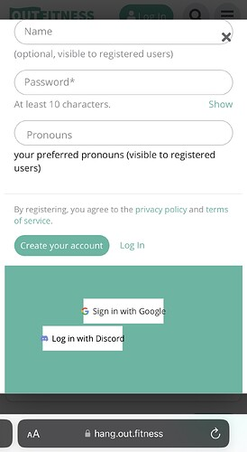](../../../assets/images/234323/6fd7cccb9e579743f9b07546f58600b415b944ea.jpeg "IMG_3326")

They look correct on my sign in modal, only the account creation one is messed up. Otherwise this theme has been BEAUTIFUL, thank you!

---

### Post #242 by [Don](../../users/Don.md)
*Posted: 2023-12-22 05:08*

Hello [@Drew-ART](/u/drew-art), Sorry for the delay.

 Drew:

> the ‘settings editor’ is replacing the edit html/css button?

With settings editor you can do the same when you change a theme setting. So in this case you can change the colors. These settings are restricted. If you want to make bigger changes on buttons etc. You have to create a new component -and activate it to the theme- where you can place your code.

 Drew:

> I’d just carry on below like with something like this
>     
>     
>     data-category-id='offers' [
>       .discourse-kanban-list {
>     	 width: 50%;
>          }
>     ]
>     
> 
> (one category only has two columns in its Kanban board and i want those to be wider, 50% of the space each)

I am not too familiar with kanban CSS but I think the data-category-id is should be a number.

Looks something like this.
    
    
    [data-category-id="your-category-id"] {
      .discourse-kanban-list {
        width: 50%;
      }
    }
    

And you have to place this in a new component. Something like I show here: [FKB Pro - Social theme - #88 by Don](../../../assets/images/234323/882e14e7263f7e474da7b08e2a0abe35da3c0151.png)

* * *

 Fma965:

> Is it possible to use the Right Sidebar component with the “stock” FKB panel?

Hello [@Fma965](/u/fma965), Yes, technically it’s possible. Now it works like when you use the right sidebar component then the default section is hidden but it possible to use the both together with some CSS I think.

* * *

 Joshua Jones:

> I’m seeing the third-party login buttons improperly aligned.

Hello [@thisisjoshjones](/u/thisisjoshjones), Thanks  Yeah I think, I have to update the theme CSS to suits the new core modal changes. I’ll fix this.

---

### Post #243 by [Fma965](../../users/Fma965.md)
*Posted: 2023-12-22 10:48*

 Don:

> Hello [@Fma965](/u/fma965), Yes, technically it’s possible. Now it works like when you use the right sidebar component then the default section is hidden but it possible to use the both together with some CSS I think.

I did try experimenting with CSS but this didn’t seem possible, the div was empty from my testing.

---

### Post #244 by [Don](../../users/Don.md)
*Posted: 2023-12-22 13:19*

[@Fma965](/u/fma965), I’ve added a new setting to show [Right Sidebar Blocks](https://meta.discourse.org/t/right-sidebar-blocks/231067) below the FKB Panel.

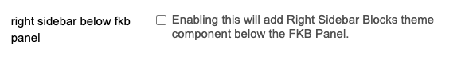

[github.com/VaperinaDEV/fkb-pro-theme](https://github.com/VaperinaDEV/fkb-pro-theme/pull/35)

####  [DEV: Added a setting to show Right Sidebar Blocks component below FKB Panel and updated Modal classes](https://github.com/VaperinaDEV/fkb-pro-theme/pull/35)

`main` ← `right-sidebar-below-fkb-panel`

merged 01:02PM - 22 Dec 23 UTC

[  VaperinaDEV ](https://github.com/VaperinaDEV)

[ +51 -9 ](https://github.com/VaperinaDEV/fkb-pro-theme/pull/35/files)

* * *

I’ve also updated the modal classes to suits to the new core changes.

 Joshua Jones:

> I’m seeing the third-party login buttons improperly aligned. Only happening on mobile (and scaling text size to 75% snaps them back into alignment). I’m wondering if this is a FKB PRO error or not?
> 
> 

[@thisisjoshjones](/u/thisisjoshjones) I think this issue will be fixes if you update your Discourse to the latest version. Since your Discourse last update was a [month ago (Nov 18)](https://github.com/discourse/discourse/commit/04a58a6e64b39c567b1fda6618f20e7b72a546ec) and this modal issue was [fixed since then (Nov 20)](https://github.com/discourse/discourse/pull/24457).

---

### Post #245 by [Fma965](../../users/Fma965.md)
*Posted: 2023-12-22 13:33*

 Don:

> [@Fma965](/u/fma965), I’ve added a new setting to show [Right Sidebar Blocks](https://meta.discourse.org/t/right-sidebar-blocks/231067) below the FKB Panel.

Nice work, thanks

Something else i noticed is “After Header” html does not work  

[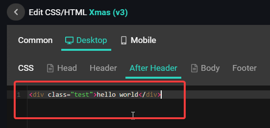](../../../assets/images/234323/942bcd91c8176afce604193fd54f1f55aecb9100.png "image")

Dev Tools  
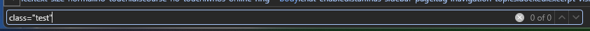

The HTML is never added, it does show in the profiler but not the actual webpage source

Moving it to Header instead of After Header and it shows up, is this an issue with the theme or something else?

---

### Post #246 by [Don](../../users/Don.md)
*Posted: 2023-12-22 13:39*

I’ve checked this now and works for me in After Header.

---

### Post #247 by [Fma965](../../users/Fma965.md)
*Posted: 2023-12-22 13:48*

Hmm, something else must be interfering with it on my instance then, not a big deal. thanks

EDIT: when the discourse-right-side-blocks theme component is enabled it doesn’t work.

---

### Post #248 by [Don](../../users/Don.md)
*Posted: 2023-12-22 14:12*

 Fma965:

> when the discourse-right-side-blocks theme component is enabled it doesn’t work.

Yeah, I see. I can repro it with Default theme too. It’s probably an issue with Right Sidebar Blocks theme component.

---

### Post #249 by [thisisjoshjones](../../users/thisisjoshjones.md)
*Posted: 2023-12-28 00:13*

You were right thank you!

---

### Post #250 by [pzguillaume](../../users/pzguillaume.md)
*Posted: 2023-12-30 17:26*

Hello,

I have an issue: on the last version of Discourse `3.2.0.beta4-dev` there is no link to edit the CSS/HTML in the theme panel…

Just wonder to know if this issue is only with my version of Discourse or if somebody that made a fresh install or update to this last Discourse version has the same problem?..

---

### Post #251 by [ondrej](../../users/ondrej.md)
*Posted: 2023-12-30 18:00*

Hello [@pzguillaume](/u/pzguillaume),

You can’t edit remote themes. This was introduced a while back.

[Restrict editing of remote themes](https://meta.discourse.org/t/restrict-editing-of-remote-themes/170051) [Announcements](/c/announcements/67)

> For quite a while, best practice has been to avoid editing themes installed from a remote Git repository locally on Discourse. Any changes to theme code or uploads get wiped out when updating the theme from the remote repo. In this commit, we’ve removed the ability to locally edit a remote theme and are now enforcing this best practice in Discourse. What happens if I have a remote theme with local changes? Nothing at this point. Your theme stays as is until you remove it or update it from re…

---

### Post #252 by [Arkshine](../../users/Arkshine.md)
*Posted: 2023-12-30 18:44*

To complete Ondrej’s answer, you can create a new theme component, attach it to your theme, and apply all your customizations here. 👍

---

### Post #253 by [pzguillaume](../../users/pzguillaume.md)
*Posted: 2023-12-30 19:10*

[@ondrej](/u/ondrej) : thank you. I’m new on Discourse and I didn’t know…

[@Arkshine](/u/arkshine) : thank you too! You help me very much! 👏 😊

---

### Post #254 by [ondrej](../../users/ondrej.md)
*Posted: 2023-12-30 19:20*

You’re welcome. If you’re new to Discourse of course you wouldn’t know. No need to apologise we were all new to it once. 😉

---

### Post #255 by [digitaldominica](../../users/digitaldominica.md)
*Posted: 2023-12-31 15:21*

Hi [@Don](/u/don) I’ve tried out the theme and noticed that the bulk select doesn’t work and the topic-list-header has been removed. Was this intentional? And is there any resolution for this?

---

### Post #256 by [Don](../../users/Don.md)
*Posted: 2023-12-31 15:54*

 Digital Dominica:

> Was this intentional?

Hello [@digitaldominica](/u/digitaldominica) 

Yeah, that was because the layout and the template changed and the bulk select etc need to removed. But I am working on implement the bulk select to this theme. 

---

### Post #257 by [Harrison_Jhonson](../../users/Harrison_Jhonson.md)
*Posted: 2024-01-01 02:12*

Greetings. The theme is simply great, the only thing that bothers me is that if I update the material or someone leaves a comment, the theme rises to the very top. How can I output all output material strictly sorted by date added and so that nothing affects it? I will be very glad to see your answers, in two days I have not been able to move forward in this direction…

---

### Post #258 by [Don](../../users/Don.md)
*Posted: 2024-01-01 09:59*

Hello [@Harrison_Jhonson](/u/harrison_jhonson) 

I am not sure what you mean exactly but if your question is about the bumping than you can have a few options to handle it.

When you edit the latest post or add a new post in a topic then the topic will ordering to the top of the topic list. You can reply without bump or after the post is published and the topic bumped you can reset the bump date.

Here is a topic about it:

[Reply without bumping topic](https://meta.discourse.org/t/reply-without-bumping-topic/94406) [Announcements](/c/announcements/67)

> As a staff member you sometimes have the need to post a reply without bumping the topic to the top of the list. And now you can do exactly that. There’s a new “Toggle topic bump” in the composer’s reply selector. [image] An anchor will appear at the top of the composer when bumping is disabled. [image] Another new feature is the “Reset Bump Date” action in topic wrench menu. It changes the topic’s bump date to the date of the last visible post in the topic. That’s quite useful when the l… 

And there is a plugin too to disable bump.

[Discourse No Bump](https://meta.discourse.org/t/discourse-no-bump/78186) [Plugin](/c/plugin/22)

>  Summary Discourse No Bump prevents users from bumping topics. 🛠️ Repository Link <https://github.com/discourse/discourse-no-bump> 📖 Install Guide [How to install plugins in Discourse](https://meta.discourse.org/t/install-plugins-in-discourse/19157) Features This plugin prevents users from bumping their own topics. On some higher traffic forums, if a user doesn’t receive replies to their topic they will reply to themselves (bumping) repeatedly to gain visibility. When enabled, a user will need to wait…

---

### Post #259 by [Harrison_Jhonson](../../users/Harrison_Jhonson.md)
*Posted: 2024-01-01 10:38*

That’s right, I’ve seen it… So there’s no way to turn off the topic bump altogether? I’m just trying to do something like a social site and the bumps aren’t needed at all)  
sorry for my english, this is a translator…

---

### Post #260 by [Moin](../../users/Moin.md)
*Posted: 2024-01-01 11:03*

 Harrison Jhonson:

> So there’s no way to turn off the topic bump altogether

The /latest view will always show you topics with the newest change of the last post. It is designed to keep track of everything new.

You could use `?order=created` to create a topic list, where topic appear in the order they were created. Here is an example for this forum:  
<https://meta.discourse.org/?order=created>

You can also add that link to the top menu with the help of [Custom Top Navigation Links](https://meta.discourse.org/t/custom-top-navigation-links/87225)  
And [Custom Homepage for Groups](https://meta.discourse.org/t/custom-homepage-for-groups/199623) should work to set this as the homepage for everyone.

---

### Post #261 by [Harrison_Jhonson](../../users/Harrison_Jhonson.md)
*Posted: 2024-01-01 11:43*

I’ll try this when I get to the computer, thanks a lot )

---

### Post #262 by [Jagster](../../users/Jagster.md)
*Posted: 2024-01-01 12:38*

 Harrison Jhonson:

> I’m just trying to do something like a social site

By desing Discourse is not a social media, even there is some aspects and mostly by tuning up with some plugins and components.

What if would take totally different direction? If you are looking for strongly social media then you could install a mastodon instance. And still you have option to use Discourse side by side with mastodon for more forumtype use.

---

### Post #263 by [Harrison_Jhonson](../../users/Harrison_Jhonson.md)
*Posted: 2024-01-01 12:55*

I’ve been doing a <https://dtf.ru> type site for a year but have run into the fact that I need to structure my posts. Almost 3 years ago I installed Discourse, but back then it looked like a regular forum and as far as I remember I didn’t see your theme. But here after a long time I happened to see your theme and it is just delightful.

People and I can write posts, guides, etc and yet you can structure everything perfectly and I liked the core of Discourse itself back then (but not the visual).

Now it’s a great tool that both looks and works great. It is better to use crutches in implementation, but with a powerful tool and a huge user base, than to use something less popular in my country in terms of visuals and practical application.

---

[← Previous](234323-page-4.md) | **Page 5 of 10** | [Next →](234323-page-6.md)
