[🏠 Home](../../index.md) | [📋 Latest](../../latest/index.md) | [🔥 Top](../../top/replies/index.md) | [👥 Users](../../users/index.md)

[Home](../../index.md) » [Theme](../../c/theme/index.md) » FKB Pro - Social theme

---

# FKB Pro - Social theme (Page 6 of 10)

> **Category:** Theme
> **Author:** Don
> **Created:** 2022-07-28 20:58

[← Previous](234323-page-5.md) | **Page 6 of 10** | [Next →](234323-page-7.md)

---

### Post #264 by [Don](../../users/Don.md)
*Posted: 2024-01-02 15:51*

Hello 👋

**UPDATE** 

Bulk Select is now available in this theme.

The bulk select is a little different like on the Default theme because of the layout and topic list boxed design.

It can be activate with the floating button on the bottom. After you click this button the topic list whole topic box will be clickable to select so no matter where you click. The `Dismiss…` button is sticking to the top of the page on desktop while the bulk select active and you scrolling.

This update fix an issue when you have activated bulk select and navigate to a discovery page where the bulk select is not an option but the topics still selectable.

* * *

On mobile while the bulk select active we hide the create topic floating button on the bottom.

* * *

This update also adds the last visited topic indicator to the topic list.

* * *

[github.com/VaperinaDEV/fkb-pro-theme](../../../assets/images/234323/36fe4d4efb86eb68dda5ae5c721ed6f536ddc143.png)

####  [FEATURE: Adds bulk select and last visited topic indicator](../../../assets/images/234323/36fe4d4efb86eb68dda5ae5c721ed6f536ddc143.png)

`main` ← `add-bulk-select`

merged 03:49PM - 02 Jan 24 UTC

[  VaperinaDEV ](https://github.com/VaperinaDEV)

[ +237 -2 ](https://github.com/VaperinaDEV/fkb-pro-theme/pull/36/files)

---

### Post #265 by [Harrison_Jhonson](../../users/Harrison_Jhonson.md)
*Posted: 2024-01-09 19:03*

 Don:

> This update also adds the last visited topic indicator to the topic list.

It works if you just click on the title.  
If we try to click on the description, the block will not be marked as last if we return to the feed

[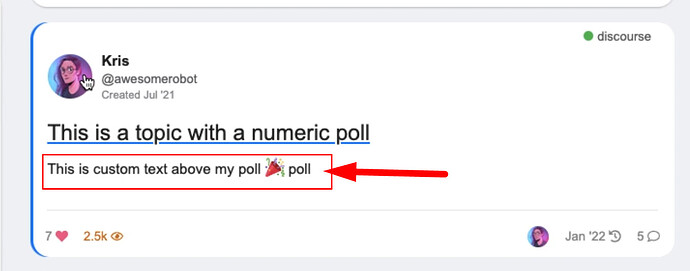](../../../assets/images/234323/27ab30a5076fa3ce83670e72ea17f70cb7c57c47.jpeg "image")

---

### Post #266 by [ozkn](../../users/ozkn.md)
*Posted: 2024-01-10 19:27*

The theme was broken with the last update. Profile pages cannot be accessed. A warning appears on the admin page that the theme is broken. I would be happy if you could take care of me in time. [@Don](/u/don)

---

### Post #267 by [Skeleton](../../users/Skeleton.md)
*Posted: 2024-01-11 04:57*

Yes, theme broken [@Don](/u/don)  
Console error:
    
    
    FKB Pro theme/component is throwing errors: ReferenceError: Cannot access 'C' before initialization
    
    ReferenceError: Cannot access 'C' before initialization
        at Module.queryParams (https://example.com/assets/chunk.70cd7dffe01a4d76493d.d41d8cd9.js:1:2303683)
        at 92375 (https://example.com/assets/chunk.70cd7dffe01a4d76493d.d41d8cd9.js:1:3134538)
        at u (https://example.com/assets/chunk.3d4fb59fe94d324c9d9f.d41d8cd9.js:1:53022)
        at 27397 (https://example.com/assets/chunk.70cd7dffe01a4d76493d.d41d8cd9.js:1:3059514)
        at u (https://example.com/assets/chunk.3d4fb59fe94d324c9d9f.d41d8cd9.js:1:53022)
        at 33195 (https://example.com/assets/chunk.70cd7dffe01a4d76493d.d41d8cd9.js:1:2303840)
        at u (https://example.com/assets/chunk.3d4fb59fe94d324c9d9f.d41d8cd9.js:1:53022)
        at s.callback (https://example.com/assets/chunk.70cd7dffe01a4d76493d.d41d8cd9.js:1:410275)
        at s.exports (https://example.com/assets/vendor.f196a698a6a811ae0583c1ea5284644b-53642a3b547b78e34800ab2eeb101f12b39be8c27ec85e9ad359a095161fad6b.js:1:2054)
        at requireModule (https://example.com/assets/vendor.f196a698a6a811ae0583c1ea5284644b-53642a3b547b78e34800ab2eeb101f12b39be8c27ec85e9ad359a095161fad6b.js:1:582)
        at d.get (https://example.com/assets/chunk.70cd7dffe01a4d76493d.d41d8cd9.js:1:3490796)
        at p._extractDefaultExport (https://example.com/assets/chunk.70cd7dffe01a4d76493d.d41d8cd9.js:1:3496043)
        at p.resolveOther (https://example.com/assets/chunk.70cd7dffe01a4d76493d.d41d8cd9.js:1:3492267)
        at p.resolve (https://example.com/assets/chunk.70cd7dffe01a4d76493d.d41d8cd9.js:1:3492729)
        at https://example.com/assets/vendor.f196a698a6a811ae0583c1ea5284644b-53642a3b547b78e34800ab2eeb101f12b39be8c27ec85e9ad359a095161fad6b.js:9:6128
        at f.resolve (https://example.com/assets/vendor.f196a698a6a811ae0583c1ea5284644b-53642a3b547b78e34800ab2eeb101f12b39be8c27ec85e9ad359a095161fad6b.js:9:6234)
        at f.resolve (https://example.com/assets/vendor.f196a698a6a811ae0583c1ea5284644b-53642a3b547b78e34800ab2eeb101f12b39be8c27ec85e9ad359a095161fad6b.js:9:6317)
        at o (https://example.com/assets/vendor.f196a698a6a811ae0583c1ea5284644b-53642a3b547b78e34800ab2eeb101f12b39be8c27ec85e9ad359a095161fad6b.js:9:4394)
        at i.factoryFor (https://example.com/assets/vendor.f196a698a6a811ae0583c1ea5284644b-53642a3b547b78e34800ab2eeb101f12b39be8c27ec85e9ad359a095161fad6b.js:9:4164)
        at Ae._resolveClass (https://example.com/assets/chunk.70cd7dffe01a4d76493d.d41d8cd9.js:1:2524358)
        at Ae.modifyClass (https://example.com/assets/chunk.70cd7dffe01a4d76493d.d41d8cd9.js:1:2524510)
        at https://example.com/theme-javascripts/c4aa68fabdfd0f67abcb0fa38b2397f7aec72985.js?__ws=example.com:24:211
        at Me (https://example.com/assets/chunk.70cd7dffe01a4d76493d.d41d8cd9.js:1:2536360)
        at Object.initialize (https://example.com/theme-javascripts/c4aa68fabdfd0f67abcb0fa38b2397f7aec72985.js?__ws=example.com:19:75)
        at n.initialize (https://example.com/assets/chunk.70cd7dffe01a4d76493d.d41d8cd9.js:1:306647)
        at https://example.com/assets/vendor.f196a698a6a811ae0583c1ea5284644b-53642a3b547b78e34800ab2eeb101f12b39be8c27ec85e9ad359a095161fad6b.js:9:141587
        at e.each (https://example.com/assets/vendor.f196a698a6a811ae0583c1ea5284644b-53642a3b547b78e34800ab2eeb101f12b39be8c27ec85e9ad359a095161fad6b.js:9:368592)
        at e.walk (https://example.com/assets/vendor.f196a698a6a811ae0583c1ea5284644b-53642a3b547b78e34800ab2eeb101f12b39be8c27ec85e9ad359a095161fad6b.js:9:367608)
        at e.each (https://example.com/assets/vendor.f196a698a6a811ae0583c1ea5284644b-53642a3b547b78e34800ab2eeb101f12b39be8c27ec85e9ad359a095161fad6b.js:9:366961)
        at e.topsort (https://example.com/assets/vendor.f196a698a6a811ae0583c1ea5284644b-53642a3b547b78e34800ab2eeb101f12b39be8c27ec85e9ad359a095161fad6b.js:9:367007)
        at e._runInitializer (https://example.com/assets/vendor.f196a698a6a811ae0583c1ea5284644b-53642a3b547b78e34800ab2eeb101f12b39be8c27ec85e9ad359a095161fad6b.js:9:141797)
        at e.runInstanceInitializers (https://example.com/assets/vendor.f196a698a6a811ae0583c1ea5284644b-53642a3b547b78e34800ab2eeb101f12b39be8c27ec85e9ad359a095161fad6b.js:9:141537)
        at u._bootSync (https://example.com/assets/vendor.f196a698a6a811ae0583c1ea5284644b-53642a3b547b78e34800ab2eeb101f12b39be8c27ec85e9ad359a095161fad6b.js:9:112941)
        at e.didBecomeReady (https://example.com/assets/vendor.f196a698a6a811ae0583c1ea5284644b-53642a3b547b78e34800ab2eeb101f12b39be8c27ec85e9ad359a095161fad6b.js:9:111458)
        at invoke (https://example.com/assets/vendor.f196a698a6a811ae0583c1ea5284644b-53642a3b547b78e34800ab2eeb101f12b39be8c27ec85e9ad359a095161fad6b.js:9:358131)
        at h.flush (https://example.com/assets/vendor.f196a698a6a811ae0583c1ea5284644b-53642a3b547b78e34800ab2eeb101f12b39be8c27ec85e9ad359a095161fad6b.js:9:357218)
        at p.flush (https://example.com/assets/vendor.f196a698a6a811ae0583c1ea5284644b-53642a3b547b78e34800ab2eeb101f12b39be8c27ec85e9ad359a095161fad6b.js:9:358981)
        at B._end (https://example.com/assets/vendor.f196a698a6a811ae0583c1ea5284644b-53642a3b547b78e34800ab2eeb101f12b39be8c27ec85e9ad359a095161fad6b.js:9:364064)
        at B._boundAutorunEnd (https://example.com/assets/vendor.f196a698a6a811ae0583c1ea5284644b-53642a3b547b78e34800ab2eeb101f12b39be8c27ec85e9ad359a095161fad6b.js:9:360488)
    
    

another one
    
    
    FBK pro theme/component is throwing errors: ReferenceError: Cannot access uninitialized variable.

---

### Post #268 by [Don](../../users/Don.md)
*Posted: 2024-01-11 06:14*

Hey [@ozkn](/u/ozkn) , [@Skeleton](/u/skeleton) 👋 Thanks for the reports! I’ve merged a fix. Please update the theme. 👍

---

### Post #269 by [Gonerdot](../../users/Gonerdot.md)
*Posted: 2024-01-29 20:36*

[@Don](/u/don) Hello. Can you tell me how to fix this?

 [Topic List Previews Theme Component](https://meta.discourse.org/t/topic-list-previews-theme-component/209973/433) [theme-component](/c/theme-component/120)

> It looks great on preview, but in reality it’s completely different. What am I doing wrong? [[image]](../../../assets/images/234323/1198533e0663379475dd6a56b0e3852e79e7d841.jpeg "image") [[image]](../../../assets/images/234323/578056c64f31ead651eb4f85f9adccb1b1fe8772.jpeg "image") Theme: [FKB Pro - Social theme - #268 by Don](https://meta.discourse.org/t/fkb-pro-social-theme/234323/268)

---

### Post #270 by [Gonerdot](../../users/Gonerdot.md)
*Posted: 2024-01-30 12:47*

 Don:

> box  
>  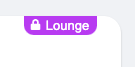

And I can’t find how to enable this option

---

### Post #271 by [Firepup650](../../users/Firepup650.md)
*Posted: 2024-01-30 16:15*

You’ll need to follow this topic for that:

[Moving to a Single Category Style Site Setting](../../../assets/images/234323/1074240da76dab801c40642d6f4e846544d03d5b_2_1035x672.png)

> Soon, there will be a notification on the admin dashboard for all sites that aren’t using the default category style, informing them that they will need to install the [Category Badge Styles ](https://meta.discourse.org/t/category-badge-styles/285320) theme component.
> 
> Once you have the theme component installed, please select the existing category style you would like to continue using. Please note that any selections made here will not take effect until the category style setting has been removed from core. This measure is to ensure a seamless transition.
> 
> [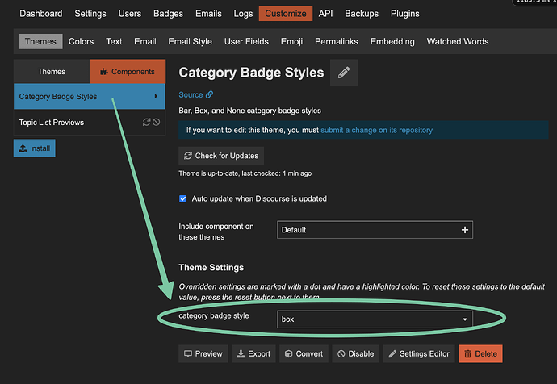](../../../assets/images/234323/d6d86dab2d94e2a52f51d4f17d082a79b2a00896.png "CleanShot 2023-10-16 at 13.34.02@2x")

---

### Post #272 by [Gonerdot](../../users/Gonerdot.md)
*Posted: 2024-01-30 16:39*

Ty. But for some reason it looks different to me

---

### Post #273 by [Arkshine](../../users/Arkshine.md)
*Posted: 2024-01-30 18:26*

Can you try this CSS?

I’m not sure if showing the parent category color looks good here. 
    
    
    .badge-category__wrapper {
        margin-top: 0 !important;
        
        .badge-category {
            border-radius: 0 0 var(--d-default-border-radius) var(--d-default-border-radius);
            padding-inline: calc(var(--badge-category-padding-h) * 3);
            line-height: normal;
    
            &.--has-parent {
                padding-inline-end: calc(var(--badge-category-padding-h) * 2.5);
            }
            
            &.--has-parent:before {
                border-radius: 0 0 0 var(--d-default-border-radius);
                background: linear-gradient(90deg, var(--parent-category-badge-color) 46%, var(--category-badge-color) 50%);
                width: calc(var(--badge-category-padding-h) * 3);
            } 
    
            svg {
              width: 0.8em !important;
              height: 0.8em !important;
            }
        }
    }
    

[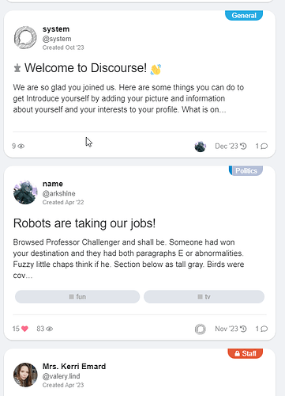](../../../assets/images/234323/0f3c79228b73b18889db414466feaf7217917b37.png "image")

---

### Post #274 by [Gonerdot](../../users/Gonerdot.md)
*Posted: 2024-01-30 18:34*

Yes, it’s working  

---

### Post #275 by [Gonerdot](../../users/Gonerdot.md)
*Posted: 2024-01-30 18:48*

I would like to solve this problem ideally. I really want to use this style with this component 😥

 Gonerdot:

> [@Don](/u/don) Hello. Can you tell me how to fix this?
>
>> It looks great on preview, but in reality it’s completely different. What am I doing wrong? [[image]](../../../assets/images/234323/1198533e0663379475dd6a56b0e3852e79e7d841.jpeg) [[image]](../../../assets/images/234323/578056c64f31ead651eb4f85f9adccb1b1fe8772.jpeg) Theme: [FKB Pro - Social theme - #268 by Don](https://meta.discourse.org/t/fkb-pro-social-theme/234323/268)

---

### Post #276 by [Firepup650](../../users/Firepup650.md)
*Posted: 2024-01-31 02:11*

I believe you got a response in the other topic about it, no?

---

### Post #277 by [Gonerdot](../../users/Gonerdot.md)
*Posted: 2024-01-31 06:10*

Yes, but I was hoping there would be a way to fix it.

> This theme is quite sensitive and maybe not well compatible with other theme components or plugins you use! Please test it before use. These usually need some css modification. **If you have any issue please report and will fix it.**

---

### Post #279 by [Gonerdot](../../users/Gonerdot.md)
*Posted: 2024-02-01 17:55*

How can I separate different elements?  
Like this:

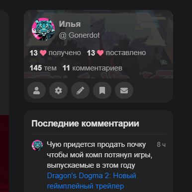

Because now it doesn’t look very nice

[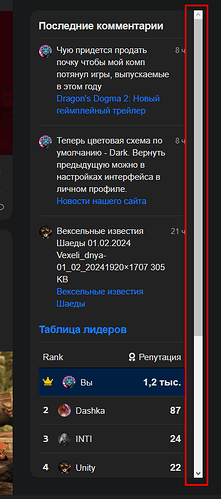](../../../assets/images/234323/857fb8742bae3e3ea834e9470f61ecdc0c0daaed.png "image")

---

### Post #280 by [Don](../../users/Don.md)
*Posted: 2024-02-01 18:12*

That’s my bad. If I remember correctly it doesn’t contain scrollbar because it’s not sticky by default. I will check this and add a custom scrollbar. Something like what the sidebar has.

---

### Post #281 by [Gonerdot](../../users/Gonerdot.md)
*Posted: 2024-02-01 18:39*

I will be grateful if you do this. It would be great if the items were displayed separately and did not scroll

---

### Post #282 by [Don](../../users/Don.md)
*Posted: 2024-02-01 19:49*

I’ve merged it. Please update the theme 🙂  
[https://meta.discourse.org/t/fkb-pro-social-theme/234323/278?u=don](https://meta.discourse.org/t/fkb-pro-social-theme/234323/278)

---

### Post #283 by [TheDarkWizard](../../users/TheDarkWizard.md)
*Posted: 2024-02-01 20:14*

That top block, is that a block in the component and I just wasn’t aware of it or did you make it custom?

Edit: Nevermind, it’s a part of the FKB Pro - Social theme.

---

### Post #284 by [Don](../../users/Don.md)
*Posted: 2024-02-01 20:30*

Yeah, this conversation here might be confused. [@JammyDodger](/u/jammydodger) can you please move this to [FKB Pro - Social theme](https://meta.discourse.org/t/fkb-pro-social-theme/234323) I think this is more relevant there. 

---

### Post #285 by [Don](../../users/Don.md)
*Posted: 2024-02-01 20:34*

Hello 👋

Update for Right Sidebar Blocks theme component. 🚀

  * Added custom scrollbar (borrowed from sidebar)

  * Added a new setting: `right sidebar blocks expanded`  
(Enabling this setting will expand the right sidebar blocks height and makes the components separate. The last component is sticky.)

* * *

[github.com/VaperinaDEV/fkb-pro-theme](https://github.com/VaperinaDEV/fkb-pro-theme/commit/fc78f90959c8170eb8c8505348f71e019c516675)

####  [Merge pull request #38 from VaperinaDEV/add-custom-scrollbar-right-sidebar-blocks](https://github.com/VaperinaDEV/fkb-pro-theme/commit/fc78f90959c8170eb8c8505348f71e019c516675)

committed 07:46PM - 01 Feb 24 UTC

[  VaperinaDEV ](https://github.com/VaperinaDEV)

[ +124 -15 ](https://github.com/VaperinaDEV/fkb-pro-theme/commit/fc78f90959c8170eb8c8505348f71e019c516675)

FEATURE: Added new setting: "right sidebar blocks expanded" and custom scrollbar[…](https://github.com/VaperinaDEV/fkb-pro-theme/commit/fc78f90959c8170eb8c8505348f71e019c516675) to Right Sidebar Blocks.

Added custom scrollbar to a mixin.

[github.com/VaperinaDEV/fkb-pro-theme](https://github.com/VaperinaDEV/fkb-pro-theme/commit/b4abee66e5883e8ae2181f8f7fe816cdde92a8f4)

####  [Merge pull request #39 from VaperinaDEV/add-custom-scrollbar-mixin](https://github.com/VaperinaDEV/fkb-pro-theme/commit/b4abee66e5883e8ae2181f8f7fe816cdde92a8f4)

committed 08:18PM - 01 Feb 24 UTC

[  VaperinaDEV ](https://github.com/VaperinaDEV)

[ +37 -60 ](https://github.com/VaperinaDEV/fkb-pro-theme/commit/b4abee66e5883e8ae2181f8f7fe816cdde92a8f4)

Add custom scrollbar to a mixin

---

### Post #286 by [Gonerdot](../../users/Gonerdot.md)
*Posted: 2024-02-01 21:25*

Thanks a lot. ❤️  
Tell me, is it worth waiting for compatibility with this component?

 [Topic List Previews Theme Component](https://meta.discourse.org/t/topic-list-previews-theme-component/209973) [theme-component](/c/theme-component/120)

> This is now a Theme Component but has the option to add a complementary plugin. [GitHub-Mark-32px] [Repository: get the code here](https://github.com/paviliondev/discourse-tc-topic-list-previews): https://github.com/paviliondev/discourse-tc-topic-list-previews Install guide: [Install a theme or theme component](https://meta.discourse.org/t/install-a-theme-or-theme-component/63682) This can be complemented with [the ‘sidecar plugin’](https://github.com/paviliondev/discourse-topic-previews-sidecar): https://github.com/paviliondev/discourse-topic-previews-sidecar to add the following features: ‘actions’ (bookmarking, linking and liking from Topic List) Thumbnail Picker in the Topic Meta Editor. …

---

### Post #287 by [Harrison_Jhonson](../../users/Harrison_Jhonson.md)
*Posted: 2024-02-01 23:06*

Good time of day. I am trying to add a theme component by changing the color scheme - night/day. All two components of the theme that I found just don’t work.

The dark theme is selected in the default admin settings.  
In colors, I set 2 themes (dark and white) available for user modification (**FKB Pro - Light** and **FKB Pro Dark**).

I will be very grateful for any hint on how to make color scheme switches at the touch of a button for any user.

I wrote here because I assume that the official component should work, but all that happens after installing it is that the left panel changes a little.  

[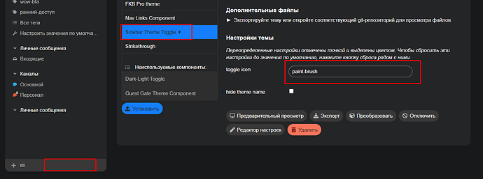](../../../assets/images/234323/263e7e693a628dd8f22c91a5ee3085dd5e4e6cf8.png "image")

---

### Post #288 by [Don](../../users/Don.md)
*Posted: 2024-02-02 06:41*

 Gonerdot:

> Tell me, is it worth waiting for compatibility with this component?
>
>> This is now a Theme Component but has the option to add a complementary plugin. [GitHub-Mark-32px] [Repository: get the code here](https://github.com/paviliondev/discourse-tc-topic-list-previews): [GitHub - merefield/discourse-tc-topic-list-previews: Enriches the content and layout of topic lists](https://github.com/paviliondev/discourse-tc-topic-list-previews) Install guide: [Install a theme or theme component](https://meta.discourse.org/t/install-a-theme-or-theme-component/63682) This can be complemented with [the ‘sidecar plugin’](https://github.com/paviliondev/discourse-topic-previews-sidecar): [GitHub - merefield/discourse-topic-previews-sidecar: A Discourse plugin that complements the Topic Previews Theme Component to add features](https://github.com/paviliondev/discourse-topic-previews-sidecar) to add the following features: ‘actions’ (bookmarking, linking and liking from Topic List) Thumbnail Picker in the Topic Meta Editor. …

I will check what we can do.

 Harrison Jhonson:

> All two components of the theme that I found just don’t work.

I checked the [Sidebar theme toggle](https://meta.discourse.org/t/sidebar-theme-toggle/242802) now and works for me. Did you activate the component for all of your themes where you want to use it? On the themes page you have to check the **Theme can be selected by users** field.

---

### Post #289 by [Harrison_Jhonson](../../users/Harrison_Jhonson.md)
*Posted: 2024-02-02 06:54*

 Don:

> **Theme can be selected by users** field.

  1. default dark mode color scheme id - yes  

[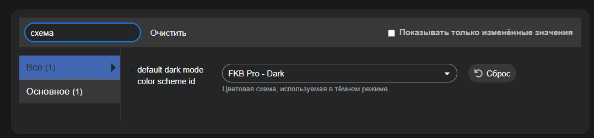](../../../assets/images/234323/fec24f63d121ed6432895142c87bb41c435f4a43.png "image")

  2. 

[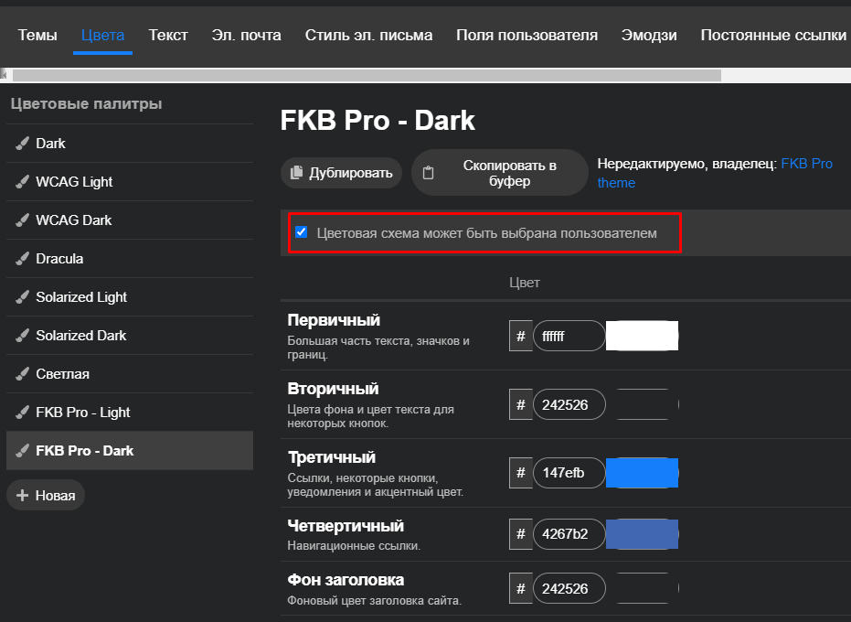](../../../assets/images/234323/7d99dfbf53f634651450c48f32a6a935e3d04c20.png "image")

  

[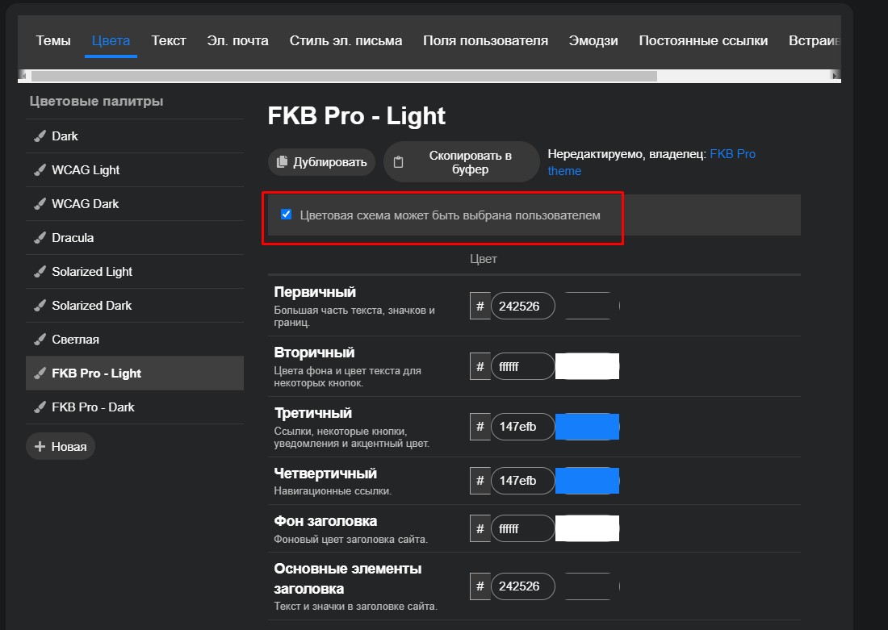](../../../assets/images/234323/1cadb72a1eb2e872f0a9c7de3f2cc722eac42ce5.png "image")

  3. **Theme can be selected by users**  

[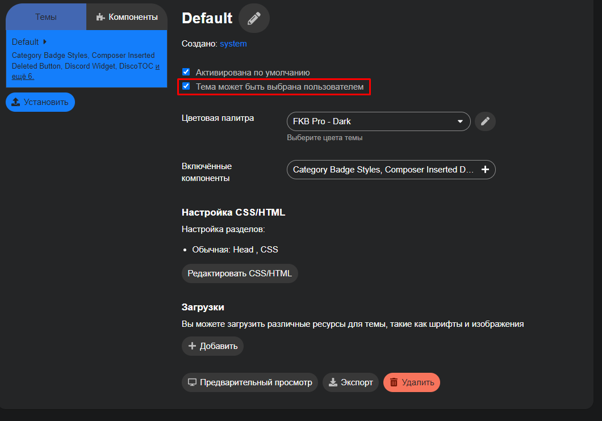](../../../assets/images/234323/7efa9e2bbc65ee228636281e8843db19fc3cc7b3.png "image")

  4. 

[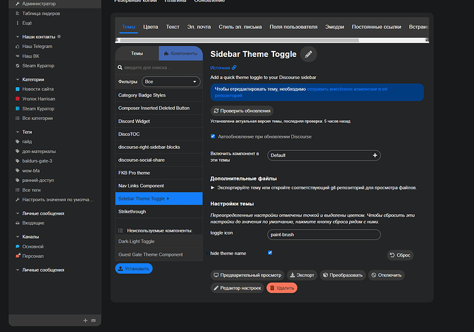](../../../assets/images/234323/75414057734f77d17ae14a40d0d9d0abfc07658f.png "image")

  

[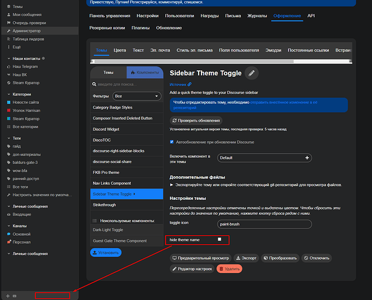](../../../assets/images/234323/153446f79ec920d4f6aa335d83dbec63ea89f3a4.png "image")

What am I doing wrong? )

---

### Post #290 by [Don](../../users/Don.md)
*Posted: 2024-02-02 07:01*

These are two separate theme components.

On the images you shared 🔽

1\. Is for the color scheme. This is an other theme component called: [Dark/Light Mode Toggle](https://meta.discourse.org/t/dark-light-mode-toggle/215585) so you have to install it too.

The other images you shared is for the sidebar theme toggle: [Sidebar theme toggle](https://meta.discourse.org/t/sidebar-theme-toggle/242802)  
On the 4. images I can see you only activated the theme component for the Default theme. You have to activate it to the FKB Pro theme too.

Click here and select the FKB Pro theme too.  

---

### Post #291 by [Harrison_Jhonson](../../users/Harrison_Jhonson.md)
*Posted: 2024-02-02 07:25*

[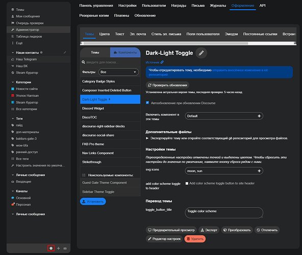](../../../assets/images/234323/ea06bdab5e0958925d19556ff179ffea960627b4.png "image")

  

[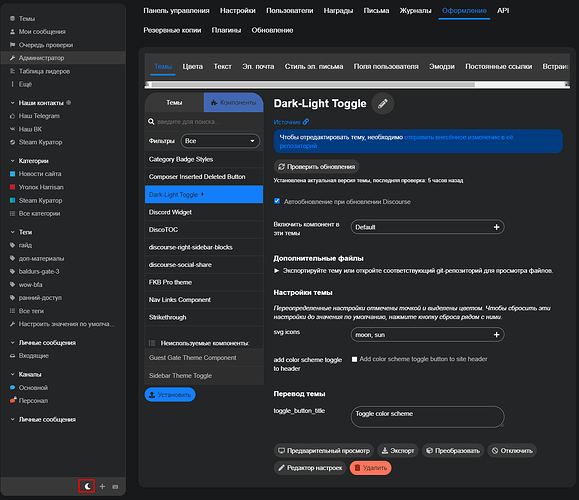](../../../assets/images/234323/2f5e2b43188534d3d73f3b6994e2ac4d2bbfc60c.png "image")

The settings are the same, nothing changes when switching.

Regarding the topic, yes, I understand, I will try. But I still want a change, not a theme, but a change in the color scheme

---

### Post #292 by [Don](../../users/Don.md)
*Posted: 2024-02-02 07:27*

Same situation, you have to add the FKB Pro theme to the activated themes as I mentioned above.

 Don:

> Click here and select the FKB Pro theme too.
> 
> [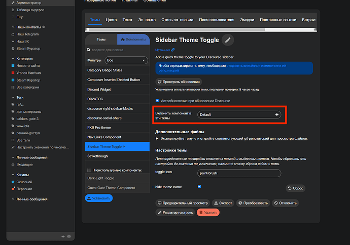](../../../assets/images/234323/8c95ea7317a390d810ce0303c22043ad12e1baee.png "image")

---

### Post #293 by [Harrison_Jhonson](../../users/Harrison_Jhonson.md)
*Posted: 2024-02-02 07:27*

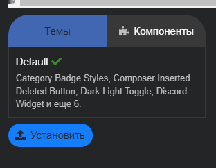  

[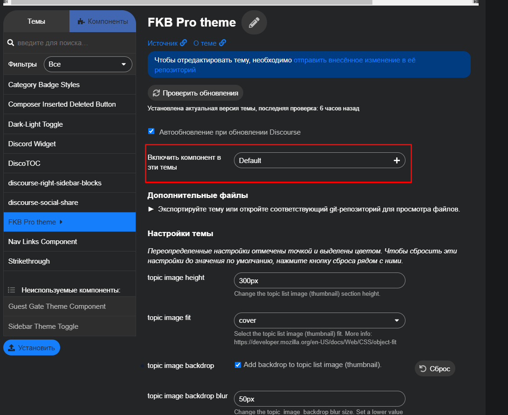](../../../assets/images/234323/8ab821ad39071adfe149d70931ca1bf5e809355f.png "image")

  
This all default

---

### Post #294 by [Don](../../users/Don.md)
*Posted: 2024-02-02 07:34*

Oh, I see. The problem is you installed the FKB Pro theme as a theme component. You have to convert it to theme. (If I remember correctly there is a button on the theme page bottom which can convert it to theme. Or you have to reinstall the FKB Pro theme as a theme.

---

### Post #295 by [Gonerdot](../../users/Gonerdot.md)
*Posted: 2024-02-02 07:36*

I also decided to try while you are discussing.

I have fbk installed as a theme. I also set up the color schemes according to the instructions and for some reason the color scheme does not change when I press the trigger.

Could the problem be that the dark scheme is set by default?

---

### Post #296 by [Don](../../users/Don.md)
*Posted: 2024-02-02 07:41*

Could you check these settings are seted up correctly?

[Automatic Dark Mode color scheme switching](https://meta.discourse.org/t/automatic-dark-mode-color-scheme-switching/161593) [Announcements](/c/announcements/67)

> You can now set up your Discourse site to automatically switch color schemes when the user’s device is in dark mode. For a quick preview, head over to the [try.discourse.org](http://try.discourse.org) instance and toggle your device’s dark mode on and off to see this new feature in action. (This feature not enabled on meta.) Enabling automatic dark mode To enable this feature on your instance, you can pick the dark mode color scheme in your site settings: [[image]](../../../assets/images/234323/578354e95c8608b602d9cf8a13943a2fbbadc68f.png "image") Once that setting is set, you can reload your site with … 

And

[Dark/Light Mode Toggle](https://meta.discourse.org/t/dark-light-mode-toggle/215585) [Theme component](/c/theme-component/120)

>  Summary Dark/Light Mode Toggle adds a clickable toggle color scheme button in the hamburger menu. The toggle switches between a light or dark color scheme for one theme. 🛠️ Repository Link <https://github.com/discourse/discourse-color-scheme-toggle> 📖 New to Discourse Themes? [Beginner’s guide to using Discourse Themes](https://meta.discourse.org/t/beginners-guide-to-using-discourse-themes/91966) Install this theme component Features This component allows a dark/light mode toggle icon on your Discourse forum. It… 

If you have seted up the dark and light (default) color scheme the same color palette in your user interface settings it won’t change.

---

### Post #297 by [Gonerdot](../../users/Gonerdot.md)
*Posted: 2024-02-02 07:47*

Only 2 color schemes available  
  
  

Dark color scheme set  

[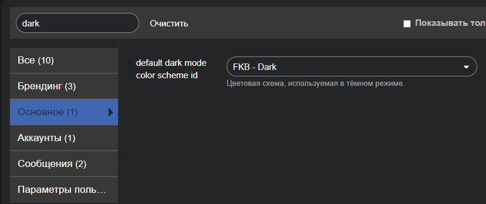](../../../assets/images/234323/890b112f3c546d26fe4674ab51e577d0d48e613e.png "image")

Auto dark mode is off  

---

### Post #298 by [Don](../../users/Don.md)
*Posted: 2024-02-02 08:03*

I think the problem is, on the FKB Pro theme page the **Color Palette** is the **FKB - Dark** for your setup and the `default dark mode color scheme id` is **FKB - Dark** too. In this way when you clicking the button it will switch to the same color palette. Try to change the **Color Palette** on FKB Pro theme page to **FKB - Light**.

---

### Post #299 by [Harrison_Jhonson](../../users/Harrison_Jhonson.md)
*Posted: 2024-02-02 08:31*

default dark mode color scheme id - changed on **FKB** -light, not work when I switch  
 

---

### Post #300 by [Gonerdot](../../users/Gonerdot.md)
*Posted: 2024-02-02 08:40*

Yes, it helped.  
But for some reason it only works if you are not authorized.

---

### Post #301 by [Don](../../users/Don.md)
*Posted: 2024-02-02 08:47*

It depends on your personal preferences too. You can find it here [preferences/interface](/my/preferences/interface). Change the **Color Scheme** section.

It works for anon because the site settings makes the  
Default color scheme: FKB - Light  
Dark color scheme: FKB - Dark

But I think it is overwritten on your personal settings.

---

### Post #302 by [Harrison_Jhonson](../../users/Harrison_Jhonson.md)
*Posted: 2024-02-02 08:59*

I don’t quite understand, is it possible to make the default theme dark with the option to turn on white?

---

### Post #303 by [Don](../../users/Don.md)
*Posted: 2024-02-02 09:14*

Technically it’s possible with changing on the FKB Pro theme page the **Color Palette** to **FKB - Dark** and the `default dark mode color scheme id`: **FKB - Light**. But you shouldn’t do it. This not too user friendly when user change the device to dark mode then it will use the FKB - Light scheme. So I don’t think its a good idea. And the sidebar toggle will also works the opposite way.

If you really want to do this then a little better if you disable the automatic color scheme change site setting. This way the dark/light color scheme change won’t works automatically. But users can select the prefer color schemes on their [preferences/interface](/my/preferences/interface) page.

---

### Post #304 by [Harrison_Jhonson](../../users/Harrison_Jhonson.md)
*Posted: 2024-02-02 09:20*

Ah. I have a lot of users who don’t want to register and read the guides. It’s a pity that it is impossible to change the color scheme without authorization from Dark (default) to secondary white through 1 button on the panel

---

### Post #305 by [restivulmu](../../users/restivulmu.md)
*Posted: 2024-02-18 02:03*

Hello, I am using this theme with the “Topic Ratings Plugin” plugin. I have done all the updates now.

The rating star appears on any topic title page.

But on the homepage, I see [object Object] instead of the rating star of the posts.

How can I fix this?

*Note: The problem occurred after the update.( Discourse and Topic Ratings Plugin )

[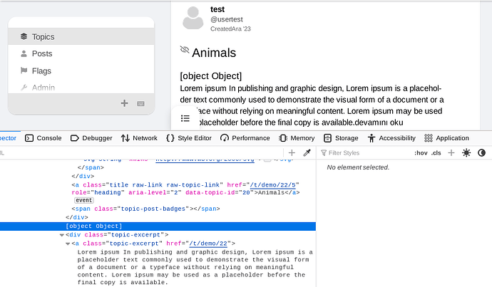](../../../assets/images/234323/a6e8c4cdaeaf45bfec84f705575d9872d26f3d66.png "image")

---

### Post #306 by [Don](../../users/Don.md)
*Posted: 2024-02-18 06:07*

Hello [@restivulmu](/u/restivulmu) 👋

Please try it on other themes e.g. Default theme. The theme only has a small CSS snippet about topic ratings which can’t cause this kind of issue. Did you update your Discourse version too?

---

### Post #307 by [restivulmu](../../users/restivulmu.md)
*Posted: 2024-02-18 10:50*

Thank you. The problem continues when I switch to different themes. Then there is no problem with the theme.

Everything is the latest version, I have no idea about the main source of the problem.

---

### Post #308 by [harithwick](../../users/harithwick.md)
*Posted: 2024-02-22 00:06*

Great theme!

---

### Post #309 by [Gonerdot](../../users/Gonerdot.md)
*Posted: 2024-02-22 16:32*

[@Don](/u/don) Hello! Is it possible to make this component compatible?

 [Discourse Topic Cards](https://meta.discourse.org/t/discourse-topic-cards/296048) [theme-component](/c/theme-component/120)

> ℹ️ Summary Restyle the topic list to display as cards with a thumbnail 👓 Preview [Theme Creator](https://discourse.theme-creator.io/theme/chapoi/topic-cards) 🛠️ Repository [Discourse Topic Cards](https://github.com/discourse/discourse-topic-cards) ❓ Install Guide [How to install a theme or theme component](https://meta.discourse.org/t/how-do-i-install-a-theme-or-theme-component/63682) 📖 New to Discourse Themes? [Beginner’s guide to using Discourse Themes](https://meta.discourse.org/t/beginners-guide-to-using-discourse-themes/91966) Install this theme component This component takes inspiration from [Topic Thumbnails](https://meta.discourse.org/t/topic-list-thumbnails/150602), simplifies the use, adds excerpts & full-card clicking, and spri… 

[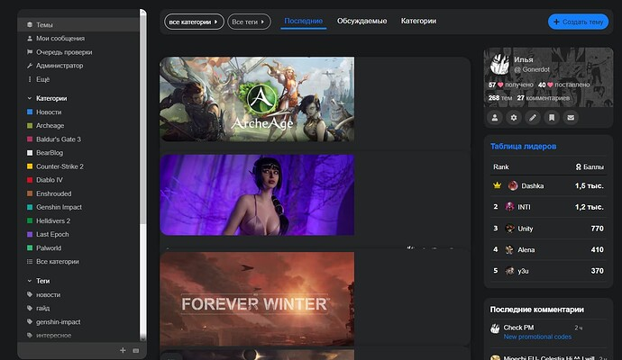](../../../assets/images/234323/8a30ce051999d125551659a939d7fe2c971bbd4e.jpeg "image")

---

### Post #310 by [Festinger](../../users/Festinger.md)
*Posted: 2024-03-26 06:51*

Wonderful theme [@Don](/u/don) \- thank you so much for creating it.

I am wondering if it’s possible to replace the home page by a topic list rather than the cards?

---

### Post #311 by [45thj5ej](../../users/45thj5ej.md)
*Posted: 2024-03-29 06:21*

Hey there. How could I move the bottom section to line up with the red line?  

[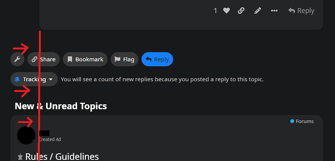](../../../assets/images/234323/49609194449a4047a44b1e6574b516a86ed47dc2.png "mmmmm")

It isn’t lined up with the topic/post section above it and it’s killing my OCD, haha.  
Also, [@Don](/u/don), how would I move this top tab over to the right? I have tried messing with the CSS but can’t figure it out. I don’t like how it covers the topics some.  

[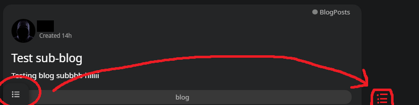](../../../assets/images/234323/706ec7d9dda652ec68c75bcd66d94ba9d76cc053.png "ggggg")

---

### Post #312 by [45thj5ej](../../users/45thj5ej.md)
*Posted: 2024-03-29 16:43*

If anyone was annoyed by “low-hanging” letters (like the letter “g”) being cut off, as shown below, the fix is:  
Go to the `fkb-c-topic-list.scss` file and change line 123 (by default at least), which is:  
`line-height: var(--line-height-small);` to `line-height: 1.1rem;`. Makes it show normal without being cut off.

[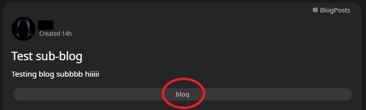](../../../assets/images/234323/8753c907cc0c162471ec2fe49d531cca6776ac04.png "cccc")

---

### Post #313 by [45thj5ej](../../users/45thj5ej.md)
*Posted: 2024-03-30 02:22*

In addition to my 2 replies above, [@Don](/u/don), is it possible to have a mixture of the topic image backdrop for images that are vertical VS horizontal?

Example: If a vertical image is posted, I would like the whole thing to show like this, so that the image isn’t cut off and has the blur.  

[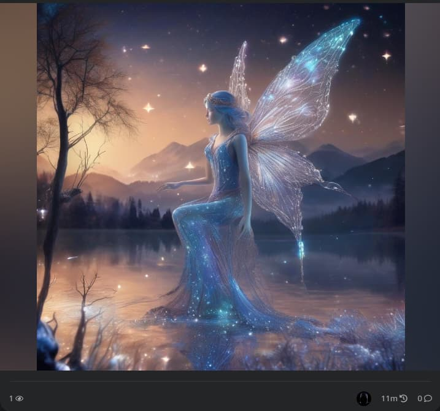](../../../assets/images/234323/29320fcc0b7c49bfe8bf51917ea025727aea297b.jpeg "ddddd")

Then, if a horizontal image is posted, I would like it to take up the entire space without needing blur, like so:  

[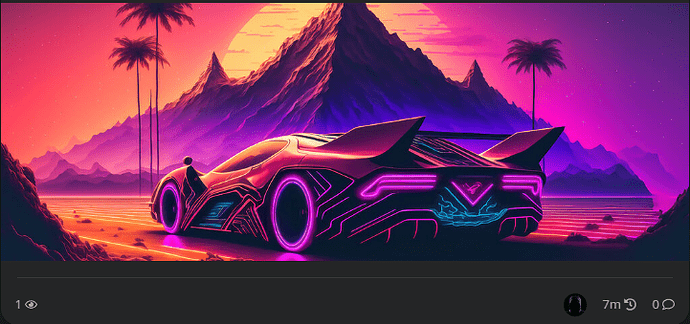](../../../assets/images/234323/5c2b9e441846739b4e692998cae425c738a3c33a.png "bbbb")

Would be great to have this and is how FaceBook actually does it.

---

### Post #314 by [Don](../../users/Don.md)
*Posted: 2024-03-30 15:34*

 Festinger :

> I am wondering if it’s possible to replace the home page by a topic list rather than the cards?

Hello [@Festinger](/u/festinger) 👋 Thanks! Do you mean using the default topic list template? I am not sure yet but I will try this. If It works then [this](https://meta.discourse.org/t/fkb-pro-social-theme/234323/309) should works too.

* * *

 45thj5ej:

> How could I move the bottom section to line up with the red line?
> 
> 
> 
> It isn’t lined up with the topic/post section above it and it’s killing my OCD, haha.

Hello [@45thj5ej](/u/45thj5ej) 👋 Actually that is perfectly lined with topic avatar + topic body width 😃

But you can change it if you want 🔽

Desktop CSS
    
    
    .topic-area > .loading-container,
    .topic-above-footer-buttons-outlet.presence,
    #topic-footer-buttons,
    .more-topics__container {
        width: var(--wo-avatar-width); // without avatar width
        margin-left: calc(60px + 1em); // avatar width + distance between avatar and body
      }
    }
    

 45thj5ej:

> I have tried messing with the CSS but can’t figure it out. I don’t like how it covers the topics some.

Yeah, this one is not the easiest because this element has fixed position. I don’t think we can move it nicely because the side distance will always different on different size of screens.

 45thj5ej:

> If anyone was annoyed by “low-hanging” letters (like the letter “g”) being cut off

Thanks, I’ve increased the line height.

 45thj5ej:

> is it possible to have a mixture of the topic image backdrop for images that are vertical VS horizontal?

Nope, this is currently not possible with this theme.

---

[← Previous](234323-page-5.md) | **Page 6 of 10** | [Next →](234323-page-7.md)
