[🏠 Home](../../index.md) | [📋 Latest](../../latest/index.md) | [🔥 Top](../../top/replies/index.md) | [👥 Users](../../users/index.md)

[Home](../../index.md) » [Theme](../../c/theme/index.md) » FKB Pro - Social theme

---

# FKB Pro - Social theme (Page 7 of 10)

> **Category:** Theme
> **Author:** 45thj5ej
> **Created:** 2022-07-28 20:58

[← Previous](234323-page-6.md) | **Page 7 of 10** | [Next →](234323-page-8.md)

---

### Post #315 by [45thj5ej](../../users/45thj5ej.md)
*Posted: 2024-03-30 15:42*

 Don:

> Nope, this is currently not possible with this theme.

But could it be done with CSS/whatever? 😄

**EDIT:** Ignore **all** of the below. The issue was the Discourse Topic List Author component.  
Also, any idea what happened to this bar? I refreshed my page last night and it randomly turned into this and I can’t figure out how to fix it. It still looks fine on mobile, though. The bar is really wide now and when you click on it, the text color is the same color (in light and dark modes) and things aren’t fully in the box now.

[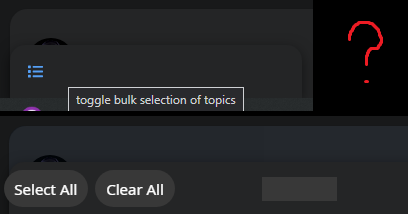](../../../assets/images/234323/f22e7099492acb7df042f42c286af2697c018a04.png "ffff")

  
I’ve compared my theme’s CSS with [yours here](https://github.com/search?q=repo%3AVaperinaDEV%2Ffkb-pro-theme%20topic-list-header&type=code) for the `topic-list-header` and they’re the same, so I have no idea what’s causing this.

---

### Post #316 by [45thj5ej](../../users/45thj5ej.md)
*Posted: 2024-03-30 17:41*

[@Don](/u/don) Hey, real quick, is there any good way to adjust these buttons so that they aren’t so crowded on mobile?  

[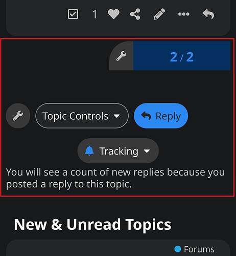](../../../assets/images/234323/b65af71c0a212536b1338d2fb149e78d46d8dd9d.png "rrrr")

Kind of messy how it is currently. Maybe “Reply” could be moved next to the “2/2” area/wrench icon and Tracking could be moved next to Topic Controls. Something more clean.

Also, the Discourse Topic List Author component makes the little box at the bottom become really wide for some reason. Any way around this? Took forever for me to figure out it was this component causing the issue, haha.  

---

### Post #317 by [Don](../../users/Don.md)
*Posted: 2024-03-30 18:33*

I’ve made some adjustment here:

 45thj5ej:

> 

[github.com/VaperinaDEV/fkb-pro-theme](../../../assets/images/234323/40ebf5c73883512a354e2d49720ff6d263167261_2_1035x214.png)

####  [UX: Correct topic-progress-wrapper rounding, topic footer notification dropdown alignment and remove border-radius from nav pills on mobile](../../../assets/images/234323/40ebf5c73883512a354e2d49720ff6d263167261_2_1035x214.png)

`main` ← `some-ux-fixes`

merged 06:22PM - 30 Mar 24 UTC

[  VaperinaDEV ](https://github.com/VaperinaDEV)

[ +25 -28 ](https://github.com/VaperinaDEV/fkb-pro-theme/pull/40/files)

 45thj5ej:

> Kind of messy how it is currently. Maybe “Reply” could be moved next to the “2/2” area/wrench icon and Tracking could be moved next to Topic Controls. Something more clean.

I think the default theme has same alignment.  I don’t think we should change this. Anyway users don’t have wrench button.

 45thj5ej:

> Also, the Discourse Topic List Author component makes the little box at the bottom become really wide for some reason. Any way around this? Took forever for me to figure out it was this component causing the issue, haha.

I don’t think the [Topic List Author](https://meta.discourse.org/t/topic-list-author/269910) theme component is compatible with this theme. As both the FKB theme and the Topic List Author are override the topic list item template.

---

### Post #318 by [45thj5ej](../../users/45thj5ej.md)
*Posted: 2024-03-30 18:41*

Thanks a ton! Will check these out in a minute. Quick question, though:  
What’s the proper way to update this theme if I’ve forked it on GitHub?

Basically, I forked it, I make my own changes locally & push the updates to my GitHub and then update the theme in my site’s Admin themes panel. But how do I update it by keeping what I’ve changed locally while also including the changes _you_ make to it? When I go to sync my fork of the theme with the changes you make, I get this:  

[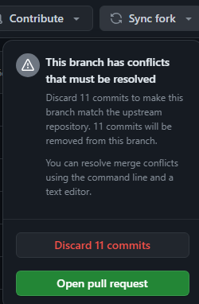](../../../assets/images/234323/f57a12cef9ea31d401dc531e15f61865f5247613.png "ffff")

So if I discard my own changes, won’t that make all of my changes disappear? I want to keep the edits I’ve made while also receiving the changes you make to the core of the theme.

EDIT: I updated theme with your latest edits. Looks like Tracking area/icon are adjusted to the left of the screen now and the “2/2” page area is now rounded. Is this correct? It does look a little better on mobile now, but even on a regular user account, there’s still that awkward empty space on mobile next to the page number.

 Don:

> I’ve made some adjustment here:
> 
>  45thj5ej:
>
>> 

EDIT 7hrs later: So, does this theme not have options for “selected” and “hover” on the color schemes? I see all of the color options except the last 2: selected & hover.

---

### Post #319 by [45thj5ej](../../users/45thj5ej.md)
*Posted: 2024-04-01 03:15*

Hey, [@Don](/u/don), in addition to my above reply, is it possible to make something so that instead of longer posts having “Read more…” on them and once clicked, it making you enter the topic, it will instead show all of the topic’s content dropped down instead of entering the actual topic? Like how actual FaceBook works/worked?

EDIT 17hrs later: Also, is there a way to have the comment button on the main forums page take you directly to the comments instead of picking the original or most recent post?  

---

### Post #320 by [Don](../../users/Don.md)
*Posted: 2024-04-02 06:04*

 45thj5ej:

> Looks like Tracking area/icon are adjusted to the left of the screen now and the “2/2” page area is now rounded. Is this correct?

Yeah that’s by design.

 45thj5ej:

> does this theme not have options for “selected” and “hover” on the color schemes?

I’ve merged this. 👍

[github.com/VaperinaDEV/fkb-pro-theme](../../../assets/images/234323/411a90e7261e11303a7a3dd2376f78ae2b8a6807_2_613x500.png)

####  [UX: Adds 'hover' and 'selected' to color palettes and update modals](../../../assets/images/234323/411a90e7261e11303a7a3dd2376f78ae2b8a6807_2_613x500.png)

`main` ← `several-ux-changes`

merged 06:01AM - 02 Apr 24 UTC

[  VaperinaDEV ](https://github.com/VaperinaDEV)

[ +17 -31 ](https://github.com/VaperinaDEV/fkb-pro-theme/pull/41/files)

---

### Post #321 by [Clo](../../users/Clo.md)
*Posted: 2024-04-04 05:00*

Hi [@Don](/u/don)

Thanks for the awesome theme!  
I was wondering how I could change the settings to have the third badge style below, as my site currently shows the first badge style

 Don:

> Badges style
> 
>   1. bullet  
>  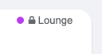
>   2. bar  
>  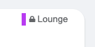
>   3. box  
>  
>

---

### Post #322 by [Don](../../users/Don.md)
*Posted: 2024-04-04 05:33*

Hello 👋

Thanks ❤️ Yeah, there was some changes in core with category badges. I will add a setting to change the style of these. 

---

### Post #323 by [Clo](../../users/Clo.md)
*Posted: 2024-04-04 12:29*

Thank you.

And then it’s not major, but I’ve also noticed 3 CSS issues:

**1) The search banner doesn’t show the search bar properly on desktop/tablet, only on mobile view…**

Desktop:  

[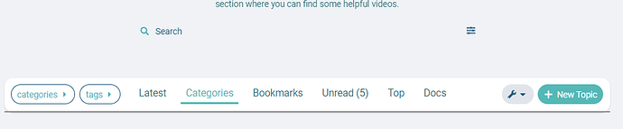](../../../assets/images/234323/c36d39c3d9e10adce6ceef7b87e0032a234c8c85.png "image")

Mobile (which looks good):  

[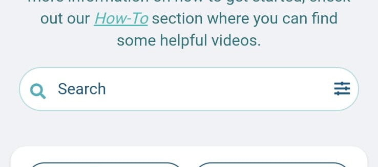](../../../assets/images/234323/5420f34aff6c32c4513ec362396dc4c2135b8605.jpeg "image")

**2) The Docs view on mobile extends beyond the screen on the right:**

[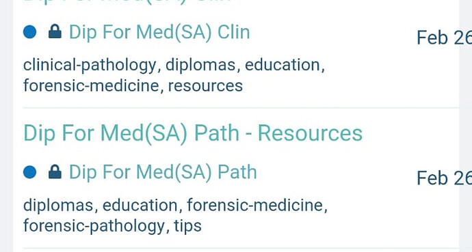](../../../assets/images/234323/dab27375d71825f17716d4eb2786b7fe0ffaebb1.jpeg "image")

**3) The category boxes (for subcategories) are cutting the words off once it becomes 3 columns responsively:**

Is there any way to perhaps fix these as well?

---

### Post #324 by [Don](../../users/Don.md)
*Posted: 2024-04-04 17:40*

Hello [@Clo](/u/clo) 👋

Thanks for the report.  This update cover pretty much everything you mentioned.

[github.com/VaperinaDEV/fkb-pro-theme](../../../assets/images/234323/42dded361073c99604882c392306611322ebd724.png)

####  [DEV: Adds settings to select category badge style (bullet, box)...adds Search Banner theme component support](../../../assets/images/234323/42dded361073c99604882c392306611322ebd724.png)

`main` ← `VaperinaDEV-patch-1`

merged 05:29PM - 04 Apr 24 UTC

[  VaperinaDEV ](https://github.com/VaperinaDEV)

[ +80 -12 ](https://github.com/VaperinaDEV/fkb-pro-theme/pull/42/files)

It contains a new setting where you can choose from category badge styles.  
It isn’t contain the bar style yet.

`category badge style`

  * bullet (default)
  * box

* * *

Also added some support for Search Bar theme component and fixed the Docs topic list view on mobile.

* * *

 Clo:

> **3) The category boxes (for subcategories) are cutting the words off once it becomes 3 columns responsively:**
> 
> [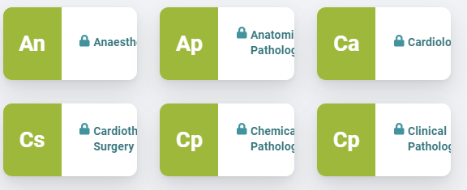](../../../assets/images/234323/36fe4d4efb86eb68dda5ae5c721ed6f536ddc143.png "image")

I assume this is the [GitHub - discourse/discourse-minimal-category-boxes](https://github.com/discourse/discourse-minimal-category-boxes) theme component. But I can’t repro it.  Could you clarify more? Is this happens on other themes e.g. default theme too?

---

### Post #325 by [Clo](../../users/Clo.md)
*Posted: 2024-04-04 18:28*

Hi [@Don](/u/don)

Thanks so much, the search bar and categories are now looking great!

The Docs on mobile view unfortunately still needs some padding, I think. See the image below:

[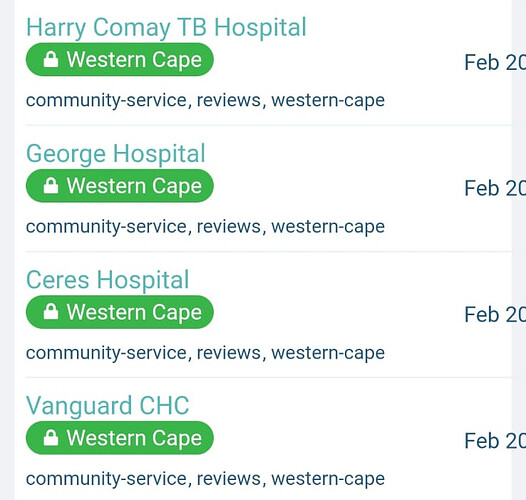](../../../assets/images/234323/bc90b5b202d4339bd7687cb28d7c6e0551801b79.jpeg "image")

The text still extends beyond the screen on the right.

And regarding the category boxes, they haven’t done this with any of the other themes I previously used or the default theme. It might be because this theme has a sidebar on the right, which the other ones don’t have, so now the three columns have to squeeze into the middle?

These are the components I’m using:

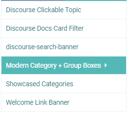

The same issue happens with the main categories page:  

It looks like the line break for the screen size is too late, causing the boxes to become too small for the text, then it cuts off the text.

---

### Post #326 by [Don](../../users/Don.md)
*Posted: 2024-04-04 18:43*

Can you please share you forum url or send me in PM? I can check then these thing more easier. 

---

### Post #327 by [45thj5ej](../../users/45thj5ej.md)
*Posted: 2024-04-04 22:41*

Hi, [@Don](/u/don), had a question. How do I change the sidebar colors for dark _and_ light modes?  

[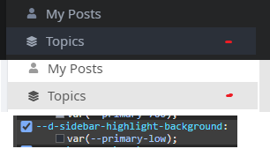](../../../assets/images/234323/ea17b6f1462daa7303c941b77b086c228fcc2b6e.png "bbbb")

The background highlight color I want to change is listed at:
    
    
    --d-sidebar-highlight-background:
    var(--primary-low);
    

but I don’t see “highlight-background” in the GitHub repo. I know how to change it locally, but if I change it from `var(--primary-low);` to `#000000;`, for example, it effects both modes. How do I have a different color for each mode? Note: this also effects the bottom area here, which I also need different for each mode:  

[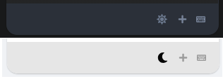](../../../assets/images/234323/c8e655be99fbbaeb25c581ae247407f7f5e6be9c.png "hhhh")

Also, is there a way to have the comment button on the main forums page take you directly to the comments instead of picking the original or most recent post?  

[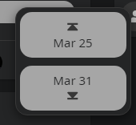](../../../assets/images/234323/a39d8d7a8953eb83b0fc7892c830c5309b84be97.png "1f87295dcc8a3a649ba57bd292e1b362acf54b48")

 Don:

> box  
>  

Mine shows like this, not attached to the box border. How do I get mine like this?  

Thank you!

---

### Post #328 by [45thj5ej](../../users/45thj5ej.md)
*Posted: 2024-04-05 21:08*

Hey, [@Don](/u/don), did one of your recent updates to the theme break installing it? My export that I happened to have from yesterday uploads fine, but when I fork the most recent version and try to install a .zip of it or from the GH repository, I get a 500 Error.

In my Logs, I get:

> Failed to process hijacked response correctly : ActiveRecord::RecordNotUnique : PG::UniqueViolation: ERROR: duplicate key value violates unique constraint “theme_field_unique_index”  
>  DETAIL: Key (theme_id, target_id, type_id, name)=(50, 5, 1, common/fkb-c-alternative-voting-category) already exists.

Everytime I try to import the theme, the theme_id is going up by one, so it isn’t a theme_id issue at least…

---

### Post #329 by [Don](../../users/Don.md)
*Posted: 2024-04-05 21:35*

Hello 👋

Is this your fork? <https://github.com/GitHubQueenn/fkb-pro-theme2>

It seems you created a `stylesheets` folder which duplicates the `scss` folder files. This cause the problem because the files duplicated and it tried to import from both folders. If you want to make changes on the style then please create a new theme component or change it in the `scss` folder or you can use `stylesheets` name too for folder, but not both. But it is better to keep `scss` as used by the main repo.

---

### Post #330 by [45thj5ej](../../users/45thj5ej.md)
*Posted: 2024-04-05 21:48*

Hi, I’m unsure how this is happening. I have a “stylesheets” folder in every backup from when I backup the theme; I never created it myself. It looks like this and I’ve done a lot of changes to files in it.  

[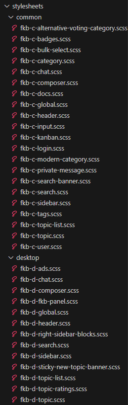](../../../assets/images/234323/2954cdbd96e4e1bb33c5df34322d167683bd61a3.png "yyyy")

You’re saying to delete it?

---

### Post #331 by [Don](../../users/Don.md)
*Posted: 2024-04-05 21:58*

Yeah, this is because you export it from admin? I assume this folder contains your modification. I am not sure which version is this I made some changes in these days. But you can upload these files into the `scss` folder.

---

### Post #332 by [45thj5ej](../../users/45thj5ej.md)
*Posted: 2024-04-05 22:21*

Thanks! Would it be possible to move this around and remove the category name completely?  

[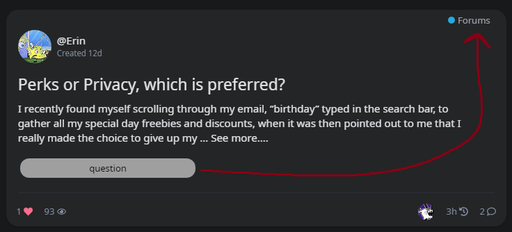](../../../assets/images/234323/ebec05573ba20f8f60206226c6e05489fea17823.png "6742131376eca2f6a4f62b44f9848f8d7e5c193a")

EDIT 6hrs later: Also, would your theme work properly if I combined all of the .scss files into one big file? I am trying to optimize my site as much as possible and some performance test sites say it has to load a lot of css & js files, mainly from the theme. It recommended cutting down on files and put stuff into one.

---

### Post #333 by [puppet680](../../users/puppet680.md)
*Posted: 2024-04-16 15:13*

Conflicts with discourse-tab-bar-theme, it is recommended to add a custom button height

[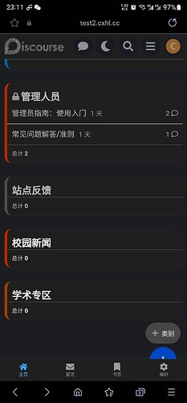](../../../assets/images/234323/22ab32429f7a5f52f2e6e43c0aafaa0a63f8ab3e.jpeg "32839c60e3dbafffbc27f5ba5a47124")

---

### Post #334 by [Earnie_Baird](../../users/Earnie_Baird.md)
*Posted: 2024-05-07 12:45*

This plugin looks amazing.

Is there any plugin out there that has a “friend” concept such that you would have to accept a friend request in order for someone to see be able to see your posts in their feed?

---

### Post #335 by [Moin](../../users/Moin.md)
*Posted: 2024-05-07 12:46*

There is the [Official Discourse Follow Plugin](https://meta.discourse.org/t/official-discourse-follow-plugin/110579)

---

### Post #336 by [Earnie_Baird](../../users/Earnie_Baird.md)
*Posted: 2024-05-07 12:52*

Thanks [@Moin](/u/moin). As far as I can tell with that plugin anyone can follow anyone (like Twitter public users) but there is no concept of approving a follow or a friend request for access.

Do I have that wrong?

---

### Post #337 by [Moin](../../users/Moin.md)
*Posted: 2024-05-07 12:58*

No. I got you wrong.

---

### Post #338 by [thisisjoshjones](../../users/thisisjoshjones.md)
*Posted: 2024-06-08 13:49*

For iOS web app view, the select and +topic buttons are halfway hidden by the system’s navigation bar. This wasn’t a problem before, was this caused by a FKB update?  

[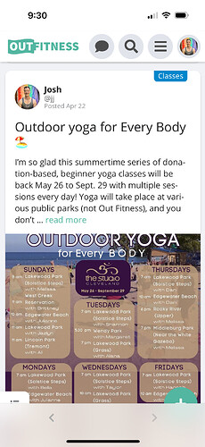](../../../assets/images/234323/7149da27c41ea5bd36caf5da246058ef1235ae2d.jpeg "IMG_0628")

---

### Post #339 by [Don](../../users/Don.md)
*Posted: 2024-06-08 17:05*

Hey [@thisisjoshjones](/u/thisisjoshjones) 👋 Thanks, I’ve merged a fix. 👍

---

### Post #340 by [thisisjoshjones](../../users/thisisjoshjones.md)
*Posted: 2024-06-08 22:23*

Thank YOU!

---

### Post #341 by [Jagster](../../users/Jagster.md)
*Posted: 2024-06-10 14:20*

Very minor one style glitch:

, "Sivustot" \(likely "Sites"\), a search icon, and categories like "Ihminen, luonto & maailma" \(possibly "Humans, Nature & World"\). \(Captioned by AI\)")

Bot icon comes from Discourse AI, and I don’t know witch one sets white background, the theme or AI-plugin.

(This topic needs some cleaning  Close to 400 posts is way too much to start find if this is already answered)

---

### Post #342 by [fine](../../users/fine.md)
*Posted: 2024-08-15 06:33*

My website language is Chinese, when I close the left navigation menu it becomes weird.  

[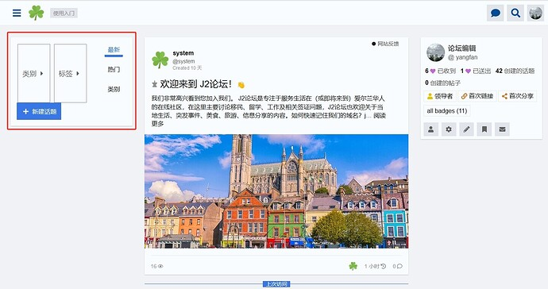](../../../assets/images/234323/92566ec89ac18ffbfe03521b20a53cd443b5d820.jpeg "20240815143125")

---

### Post #343 by [Don](../../users/Don.md)
*Posted: 2024-08-15 07:12*

Thanks, I’ve [fixed it](https://github.com/VaperinaDEV/fkb-pro-theme/commit/8fc3b7693ed9d297bbf16a888e17aea48d6aa33d). Please update the theme 🙂

---

### Post #344 by [fine](../../users/fine.md)
*Posted: 2024-08-15 08:43*

Thank you very much!  
One other questions:  
Does this theme support the full width plugin? After I enabled the full width plugin, I found that the left navigation bar was not displayed on the left. And when I closed the left navigation bar, the style became strange.  

[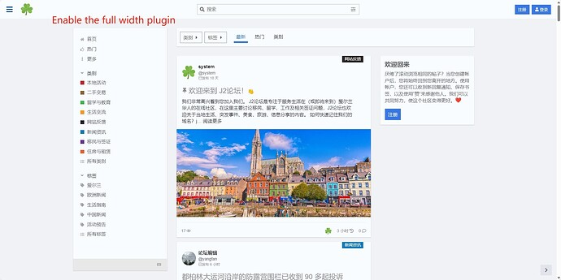](../../../assets/images/234323/7cdf894e12c84b818fd5e76c825849a3b21f7638.jpeg "20240815164027")

  

[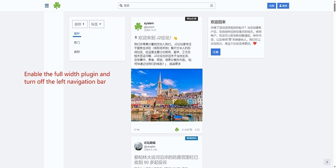](../../../assets/images/234323/98cbe8d9276c9d8d2ce59fae5e00a0bf972b5226.jpeg "20240815164103")

---

### Post #345 by [Monikas](../../users/Monikas.md)
*Posted: 2024-08-15 10:41*

[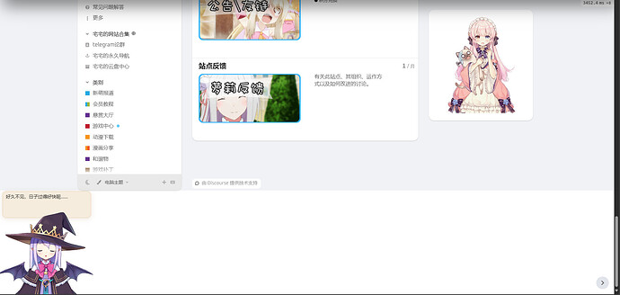](../../../assets/images/234323/23998dcd6d1ef352ebcadc506c447ea52bcfa680.jpeg "image")

  

[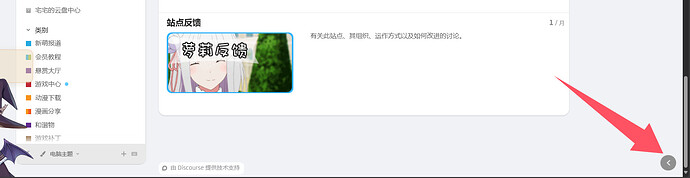](../../../assets/images/234323/a9cba5d3e9509de89d6e0d3539b8b21a615847b6.jpeg "image")

 [Easy Responsive Footer](https://meta.discourse.org/t/easy-responsive-footer/95818/235) [theme-component](/c/theme-component/120)

> Hi, thanks for this component, it’s great! Is there any way to replace the very first column with our company logo so that it aligns with the other columns? [[image]](../../../assets/images/234323/f2eac4c1f2227606745fdf6814558e717d26d340.png "image")

The sidebar is causing an extra white section below. I previously installed the “Easy Responsive Footer - theme-component - Discourse,” but I uninstalled it and don’t know how to fix it. When I click the button below, it disappears. This is my forum address: <https://www.justnainai.com/>

---

### Post #346 by [Don](../../users/Don.md)
*Posted: 2024-08-15 13:40*

 fine:

> Does this theme support the full width plugin?

Nope, I’m afraid not really.

* * *

 JustMonika:

> The sidebar is causing an extra white section below.

Is that not because of this on the left corner?  

[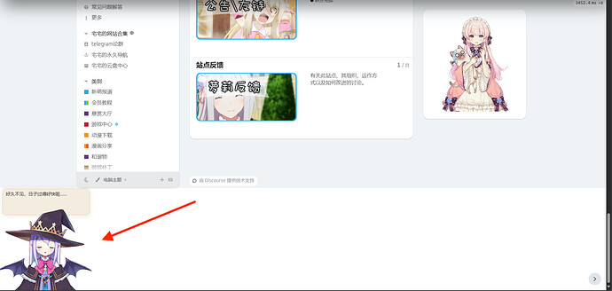](../../../assets/images/234323/a265f2601b11ad9e06d9296f5c7fd5a6472c02a0.jpeg "This image appears to be a screenshot of a video game platform interface, showing a menu with game and character information, including a witch-like character in the center and a sidebar with character details.  \(Captioned by AI\)")

---

### Post #347 by [Don](../../users/Don.md)
*Posted: 2024-08-19 16:17*

Hello 👋

I’ve made several update on the theme 🔽

  1. nav pills design (removed to suit the new core)
  2. adds support for new bulk actions.
  3. fixes usercard metadata section
  4. removes desktop navigation and adds support for new mobile navigation
  5. fixes new topic button order

[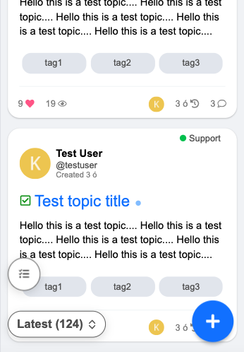](../../../assets/images/234323/d2dfdee047d33736cfe46a0a82e0d0666e0d200c.png "Screenshot 2024-08-19 at 17.48.58")

[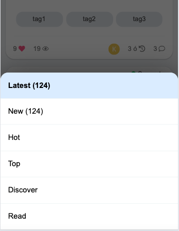](../../../assets/images/234323/e3a778103dd3c35a8a00f7f7e7337ff4218ece05.png "Screenshot 2024-08-19 at 17.50.51")

[github.com/VaperinaDEV/fkb-pro-theme](../../../assets/images/234323/459de190d2d8e7a6fa697dd6e9619bb679c16cdc_2_225x500.jpeg)

####  [DEV: fixes compatibility to the latest core version](../../../assets/images/234323/459de190d2d8e7a6fa697dd6e9619bb679c16cdc_2_225x500.jpeg)

`main` ← `navigation-update`

merged 04:17PM - 19 Aug 24 UTC

[  VaperinaDEV ](https://github.com/VaperinaDEV)

[ +111 -143 ](https://github.com/VaperinaDEV/fkb-pro-theme/pull/45/files)

1\. nav pills design (removed to suit the new core) 2\. adds support for new bulk[…](../../../assets/images/234323/459de190d2d8e7a6fa697dd6e9619bb679c16cdc_2_225x500.jpeg) actions. 3\. fixes usercard metadata section 4\. removes desktop navigation and adds support for new mobile navigation 5\. fixes new topic button order

---

### Post #348 by [Monikas](../../users/Monikas.md)
*Posted: 2024-08-21 07:00*

I deleted the component in the lower left corner still have the white box underneath what should I do?

[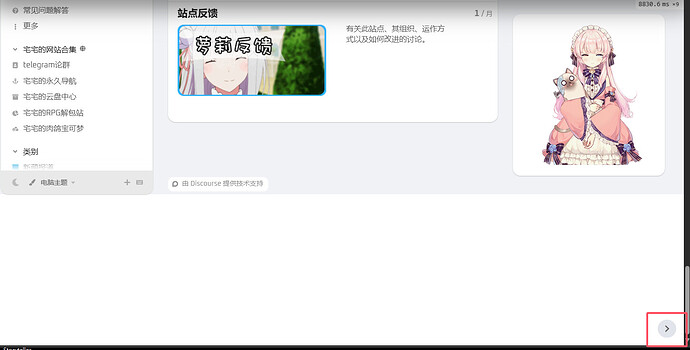](../../../assets/images/234323/e34fcdd01e27c4be04e9733948873c9df1113999.jpeg "5dafeb33634aee3261323de759c4c92f")

[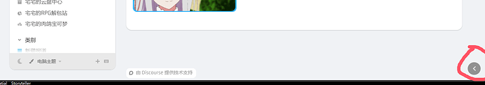](../../../assets/images/234323/9689ae4db011482ba79ca611ccf23129fb519298.png "image")

---

### Post #349 by [Don](../../users/Don.md)
*Posted: 2024-08-21 07:51*

Thanks and sorry the issue was with the theme right sidebar. I’ve merged a fix. 

---

### Post #350 by [ozkn](../../users/ozkn.md)
*Posted: 2024-08-23 14:10*

Hello [@don](/u/don) ,

How do I move the fixed buttons I showed in the photo below to the first section?

[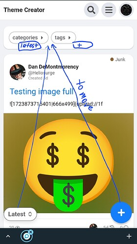](../../../assets/images/234323/46bfd8b830e0c893b6acba39b3666d3be79ba5ac.jpeg "Screenshot_20240823_170502_Chrome")

---

### Post #351 by [Aurora](../../users/Aurora.md)
*Posted: 2024-08-29 16:24*

[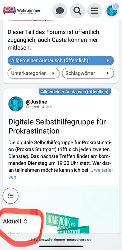](../../../assets/images/234323/21ccf245cbb4723cceabb03cfe4ea354f1f0384c.jpeg "IMG_3627")

This menu „latest“ „unread“ doesn’t work on mobile.

What can I do?

---

### Post #352 by [Don](../../users/Don.md)
*Posted: 2024-08-29 16:31*

Please update Discourse to the latest version…

---

### Post #353 by [Jagster](../../users/Jagster.md)
*Posted: 2024-10-06 09:13*

Do you know the Full Row Bulk Select component 😏

It breaks FKB Pro like this:

[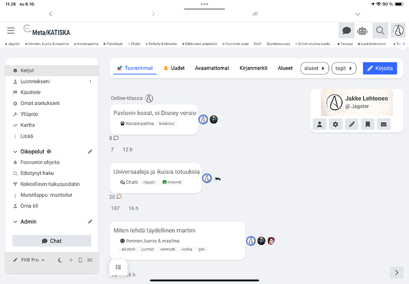](../../../assets/images/234323/37c885854dee16fe541fc4a4ff57f2446d508e48.png "This is a screenshot of a chat window, possibly from a messaging app, with a conversation in the Czech language.  \(Captioned by AI\)")

And on mobile, iPhone I reckon:

[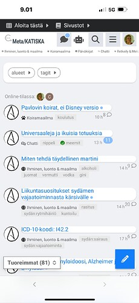](../../../assets/images/234323/b0f3401cefec881d963edb473fd6ea59478a0d06.jpeg "The image shows a screenshot of a mobile phone with a web browser open, displaying a website with Finnish content.  \(Captioned by AI\)")

And what is expected:

[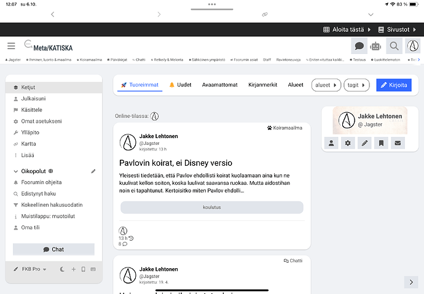](../../../assets/images/234323/09e69e986f149b263a8801e40b06bf2ef5e41fa9.png "A screenshot of a website with text in Finnish, showing a personal profile page with the name "Jakke Lehtonen" and a picture of a cat.  \(Captioned by AI\)")

Not a biggie, for me anyway. FKB isn’t an admin-friendly theme if there is a need for any bulk actions, so I just disabled that component. But because FKB is the only theme that is affected, I’m here.

---

### Post #354 by [Don](../../users/Don.md)
*Posted: 2024-10-06 12:21*

 Jakke Flemming:

> Full Row Bulk Select component 😏

That is _integrated_ to this theme so don’t need to use the component. 

---

### Post #355 by [Jagster](../../users/Jagster.md)
*Posted: 2024-10-06 12:23*

Of course it is, stupid me  Well, my excuse is it’s Sunday 😂 🍺

---

### Post #356 by [Aurora](../../users/Aurora.md)
*Posted: 2024-10-08 17:48*

[quote=“Mathx, Beitrag:350, Thema:234323, Benutzername:ozkn”]  
How do I move the fixed buttons I showed in the photo below in the first section?  
[/Zitat]

Is that possible?

---

### Post #357 by [Monikas](../../users/Monikas.md)
*Posted: 2024-10-09 06:42*

[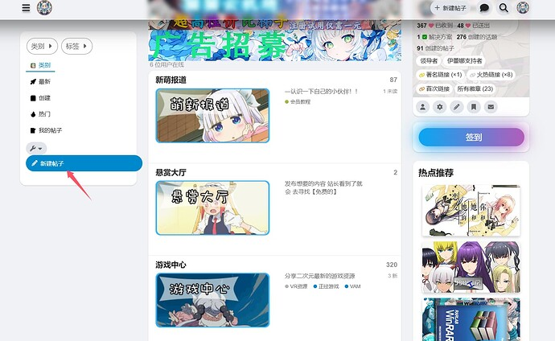](../../../assets/images/234323/54e3ea61f5fdb2055233a975dd93682727911953.jpeg "A screenshot of a social media platform, showcasing a user's profile with a variety of anime-related content.  \(Captioned by AI\)")

  

[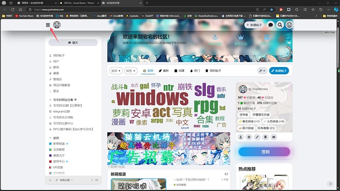](../../../assets/images/234323/56ab9bf1c3cb2e0b0d17a4e08e284db509a7e13f.jpeg "The image shows a computer screen displaying a web browser with a blurry background, possibly to protect sensitive information.  \(Captioned by AI\)")

This one I’m not sure if it’s a bug or not because I have too many components Well I’d better give feedback on it

---

### Post #358 by [Don](../../users/Don.md)
*Posted: 2024-10-13 17:48*

 JustMonika:

> ")

I’ve pushed a fix for this.

* * *

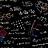 Mathx:

> How do I move the fixed buttons I showed in the photo below to the first section?

 Aurora:

> Is that possible?

It’s possible with a custom component or fork the theme and modify the CSS.

---

### Post #359 by [kOS](../../users/kOS.md)
*Posted: 2024-10-28 10:51*

Hey guys, first of all thank you for this theme. Until “Central” is publicly and steadily released, this is my most favourite Theme.

For some reasons, (it might be my own fault 😉 ) the FKB Panel doesnt show up anymore in my forum. What may be some exotic reasons for that? Ive already tried by trial and error by clicking/unlicking all theme options, without success.

Is there a way to hide both the FKB Panel to the right and this other Panel to the left, in certain categories? Unfortunately it is overlaying the KanBan Components, when not in Expanded view

---

### Post #360 by [We_the_Makers](../../users/We_the_Makers.md)
*Posted: 2024-11-03 16:20*

Hi Don, your theme rocks! Thansk for all your hard work. I am loving it!  
I noticed a bug with the [Topic List Thumbnails](https://meta.discourse.org/t/topic-list-thumbnails/150602) component. Attaching screenshots of the bug below. (tested with grid and masonry option).  
It would be amazing if you could fix that.  
I am trying to achieve a grid view as in here: [Resources | Framer](https://www.framer.community/c/resources/)  
PS: I’m open to use another component alternative too that would achieve a similar grid.

Thanks,  
Filip

[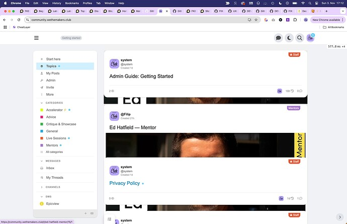](../../../assets/images/234323/f91c312fe3d91914056e2bf505cd73a4b17630a9.jpeg "Screenshot 2024-11-03 at 17.12.50")

---

### Post #362 by [David_Ghost](../../users/David_Ghost.md)
*Posted: 2024-11-13 16:37*

There’s a small dot on mobile for users who are not staff. Is this normal?

[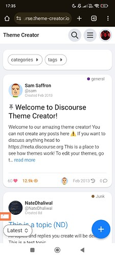](../../../assets/images/234323/459de190d2d8e7a6fa697dd6e9619bb679c16cdc.jpeg "The image depicts a screenshot of a mobile app displaying a discourse theme creator, with a user profile and discussion threads visible. \(Captioned by AI\)")

---

### Post #363 by [Don](../../users/Don.md)
*Posted: 2024-11-13 17:12*

Thanks David, I fixed it 👍

That was a `box-shadow` on the bulk select what I mistakenly added to the topic list header and when the bulk select wasn’t available the topic list header `box-shadow` appeared as seen on you screenshot. Now I’ve added the `box-shadow` to the bulk select button which fixed this visual glitch.

---

### Post #364 by [Don](../../users/Don.md)
*Posted: 2024-11-15 11:54*

Hello 👋

I’ve added a new setting with you can disable the FKB topic list modifications. So after that possible to simple add other theme components like: [Topic List Thumbnails](https://meta.discourse.org/t/topic-list-thumbnails/150602)  
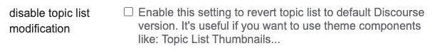  

[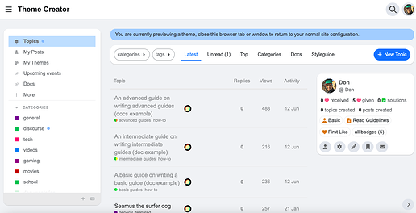](../../../assets/images/234323/1f111b932086ad467bcbe4ddac3f1a4c0ae520cf.png "Screenshot 2024-11-15 at 12.52.56")

  

[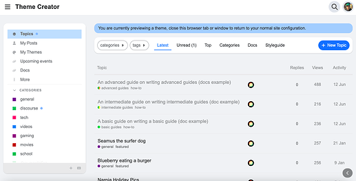](../../../assets/images/234323/85c1f6fd71b2053655f690611e72841ba908a376.png "Screenshot 2024-11-15 at 12.53.15")

[github.com/VaperinaDEV/fkb-pro-theme](../../../assets/images/234323/49609194449a4047a44b1e6574b516a86ed47dc2_2_690x333.png)

####  [DEV: Add setting to disable the FKB topic list modifications](../../../assets/images/234323/49609194449a4047a44b1e6574b516a86ed47dc2_2_690x333.png)

`main` ← `topic-list-mod`

merged 11:51AM - 15 Nov 24 UTC

[  VaperinaDEV ](https://github.com/VaperinaDEV)

[ +495 -431 ](https://github.com/VaperinaDEV/fkb-pro-theme/pull/49/files)

---

### Post #365 by [denvergeeks](../../users/denvergeeks.md)
*Posted: 2024-11-15 14:24*

Have you tried

[Topic Cards](https://meta.discourse.org/t/topic-cards/296048) [Theme component](/c/theme-component/120)

>  Summary Topic Cards restyle the topic list to display as cards with a thumbnail 👓 Preview [Preview on Discourse Theme Creator](https://discourse.theme-creator.io/theme/Discourse/topic-cards) 🛠️ Repository <https://github.com/discourse/discourse-topic-cards> 📖 New to Discourse Themes? [Beginner’s guide to using Discourse Themes](https://meta.discourse.org/t/beginners-guide-to-using-discourse-themes/91966) Install this theme component ℹ️ This theme component may cause conflicts with other customisations to the topic list Features This component …

---

[← Previous](234323-page-6.md) | **Page 7 of 10** | [Next →](234323-page-8.md)
