[🏠 Home](../../index.md) | [📋 Latest](../../latest/index.md) | [🔥 Top](../../top/replies/index.md) | [👥 Users](../../users/index.md)

[Home](../../index.md) » [Theme](../../c/theme/index.md) » FKB Pro - Social theme

---

# FKB Pro - Social theme (Page 8 of 10)

> **Category:** Theme
> **Author:** Jun
> **Created:** 2022-07-28 20:58

[← Previous](234323-page-7.md) | **Page 8 of 10** | [Next →](234323-page-9.md)

---

### Post #366 by [Jun](../../users/Jun.md)
*Posted: 2024-11-16 15:27*

I use FKB Pro theme.

The sytle below is from component [Topic List Preview](https://meta.discourse.org/t/topic-list-previews-theme-component/209973) .How to make topic list of specific category like this, and other categories use FKB Pro.  

[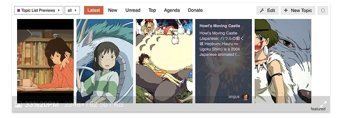](../../../assets/images/234323/5e15a696d480f25f0f8e6e7091cd4f772fb6f14e.jpeg "This image appears to be a screenshot of an online platform, possibly a social media or forum site, featuring a selection of images from the animated film "Howl's Moving Castle". \(Captioned by AI\)")

Thanks.

---

### Post #367 by [Don](../../users/Don.md)
*Posted: 2024-11-16 15:42*

 [FKB Pro - Social theme](https://meta.discourse.org/t/fkb-pro-social-theme/234323/364) [Theme](/c/theme/61)

> Hello 👋 I’ve added a new setting with you can disable the FKB topic list modifications. So after that possible to simple add other theme components like: [Topic List Thumbnails](https://meta.discourse.org/t/topic-list-thumbnails/150602) [Screenshot 2024-11-15 at 12.51.51] [[Screenshot 2024-11-15 at 12.52.56]](../../../assets/images/234323/1f111b932086ad467bcbe4ddac3f1a4c0ae520cf.png "Screenshot 2024-11-15 at 12.52.56") [[Screenshot 2024-11-15 at 12.53.15]](../../../assets/images/234323/85c1f6fd71b2053655f690611e72841ba908a376.png "Screenshot 2024-11-15 at 12.53.15")

---

### Post #368 by [Jun](../../users/Jun.md)
*Posted: 2024-11-17 10:45*

[@Don](/u/don) Can this new setting only disable specific category, and other categories still use FKB Pro theme?

---

### Post #369 by [joo](../../users/joo.md)
*Posted: 2024-11-18 05:52*

I was wondering if it would be possible to move the tags above the content? They seem to be taking up quite a bit of space below.

---

### Post #370 by [We_the_Makers](../../users/We_the_Makers.md)
*Posted: 2024-11-18 12:35*

+1 on that this would be extremly helpful 💕

---

### Post #371 by [We_the_Makers](../../users/We_the_Makers.md)
*Posted: 2024-11-18 12:37*

On another note does anyone know how to show topics in full length in the category page? Same as Framer does it? [Announcements | Framer](https://www.framer.community/c/announcements/) \- I tried with Javascript /CSS and no luck 

---

### Post #372 by [Clo](../../users/Clo.md)
*Posted: 2024-11-18 15:43*

Hi 👋

I was trying to see if this was previously discussed on this topic but maybe I missed it…  
Is there any way to include the latest reply to a topic in the topic lists display? I would like users to see if there was a reply or question posted under a specific topic already on the home page (list of latest topics).

---

### Post #374 by [Clo](../../users/Clo.md)
*Posted: 2024-12-13 08:28*

Yes. Is there a way to include them in the topic excerpt on the topic list page?

---

### Post #375 by [MihirR](../../users/MihirR.md)
*Posted: 2024-12-13 08:51*

Yes you would have to create a simple plugin to fetch latest 2 replies and then display it. Also, you would have to adjust the css to accommodate the replies.

---

### Post #376 by [Fma965](../../users/Fma965.md)
*Posted: 2024-12-24 19:34*

Nice theme, great work.

I’m running a highly modified version and it works well, one thing i would like to prevent from happening is the layout readjustment when the sidebar is hidden.

(Pictured cropped off the right side, content is centered)  
With Sidebar open  

[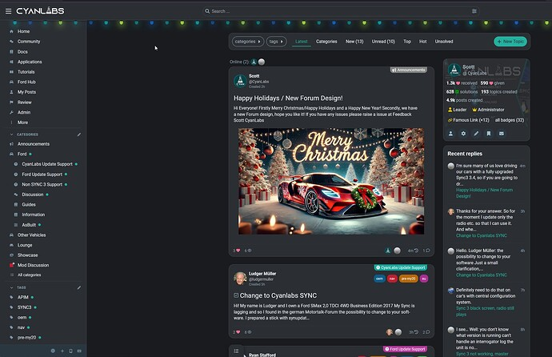](../../../assets/images/234323/59813d7cbd5657bfe0201106e6155bd619ccd959.jpeg "image")

With Sidebar closed  

[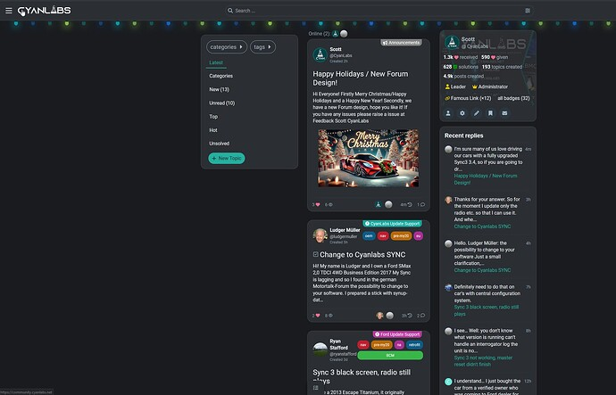](../../../assets/images/234323/14c8bf38f900b052135effc2bcf91333f8572203.jpeg "image")

Is there any chance of adding an option to disable this functionality?

Desired outcome (this but centered, this is a simply delete of the sidebar to provide a screenshot example of what i mean)  

[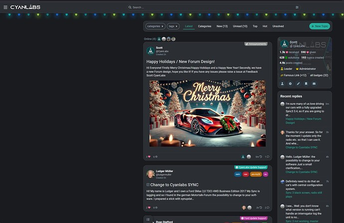](../../../assets/images/234323/f840fcc9ceda31f1aaf898890cb9865ebd3158e3.jpeg "image")

---

### Post #377 by [Don](../../users/Don.md)
*Posted: 2024-12-26 14:19*

Hello 👋

 Fma965:

> Is there any chance of adding an option to disable this functionality?

Yeah, that’s possible relatively easily with modifying some CSS.

However it depends on what the following meaning exactly:

 Fma965:

> I’m running a highly modified version and it works well,

* * *

I assume you forked the theme and as I remember everything what you need to do this in the  
`scss/desktop/fkb-d-topic-list.scss` file. There you will see the `.has-sidebar-page` class which is the breakpoint in the two separate style. Actually, you have to compare the `.list-controls`. I’ll can make a PR if you have a forked version…

* * *

 Clo:

> Is there any way to include the latest reply to a topic in the topic lists display?

Hello 👋 Sorry for the late reply. Yeah, that’s possible. But the [Highest-Post Excerpts in Topic List](https://meta.discourse.org/t/highest-post-excerpts-in-topic-list/306734) plugin is required. I think I’ll built this setting…

* * *

> ⚠️ **Note** : I’ll have to modernize the template to be compatible with the new Glimmer topic list. This process may change things compare the current theme. So if you modify the theme, the new version may will break your changes…

---

### Post #378 by [Prospleforum](../../users/Prospleforum.md)
*Posted: 2024-12-27 05:17*

Hi! Love the theme!

I’ve noticed that clicking the “Comment” icon opens up this menu:

Is there a way to have it so clicking the comment icon opens up the topic instead?

---

### Post #379 by [Don](../../users/Don.md)
*Posted: 2024-12-27 07:36*

Hello 👋

That’s not possible for now. Is this something what more users want? Because I can modify the theme to works like that if it would be a common thing. I am not sure about this… 

---

### Post #380 by [Moin](../../users/Moin.md)
*Posted: 2024-12-27 09:11*

I think that feature was removed in the glimmer topic list implementation anyway.  
<https://github.com/discourse/discourse/commit/3eada7b572a4b6c015e98d96e6b7815221ab9bd3>  
Here at Meta, the replies count already takes you to the first post instead of asking whether you want to go to the top or bottom. (I still haven’t gotten used to the fact that clicking “replies” takes me to the opposite)

---

### Post #381 by [Don](../../users/Don.md)
*Posted: 2024-12-27 09:27*

Oh great, I didn’t notice this yet. Thanks [@Moin](/u/moin) 

---

### Post #382 by [Fma965](../../users/Fma965.md)
*Posted: 2024-12-27 13:52*

 Don:

> I assume you forked the theme and as I remember everything what you need to do this in the  
>  `scss/desktop/fkb-d-topic-list.scss` file. There you will see the `.has-sidebar-page` class which is the breakpoint in the two separate style. Actually, you have to compare the `.list-controls`. I’ll can make a PR if you have a forked version…

Thanks for the reply, no i actually prefer to keep the base theme and override any CSS and/or templates if desired (usually minimal template changes) so instead it’s a theme component on top of your branch. This is why i was hoping for a chance to just have a toggle in the settings 😉

---

### Post #383 by [MihirR](../../users/MihirR.md)
*Posted: 2024-12-29 04:04*

Would it be possible to hide the description for topics with images, but still show it for those without one?

---

### Post #384 by [toanvoc](../../users/toanvoc.md)
*Posted: 2025-01-24 01:28*

Dear,

I got this message in this theme as shown in the picture

[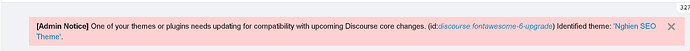](../../../assets/images/234323/7247fe8ec35d7f9db7c4ba0b65c79713f8a37346.png "The image shows a notification about a code update affecting themes and plugins in Discourse, including an "Nghiep SEO 6-upgrade" theme. \(Captioned by AI\)")

---

### Post #385 by [hoangphuctran93](../../users/hoangphuctran93.md)
*Posted: 2025-01-25 23:15*

I still don’t see any errors just need to turn off notifications, but hope [@Don](/u/don) can give suggestions and fix

---

### Post #386 by [Obi_Sam_Kenobi](../../users/Obi_Sam_Kenobi.md)
*Posted: 2025-01-26 00:03*

It has to do with the fact Discourse moved to FontAwesome6 from FontAwesome5 and the FKB Social theme hasn`t updated the icon names/tags in its code. I will be working with our IT guy to create a fork fixing this should the update not come before the end of the grace period set by Discourse (which I believe is Q2 2025).

---

### Post #387 by [Don](../../users/Don.md)
*Posted: 2025-01-26 07:57*

Hello 👋

Thanks for the report 

I’m working on a big update to be compatible with new Discourse changes. But I need more time to update everything…  
The fontawesome issue is mostly coming from the `fkb_panel_items` setting. Which still use FA5 icons. Until then you can change it manually in that setting. Change: cog → gear, pencil-alt → pencil and if you added custom ones than you can check the FA6 icons on fontawesome website.

---

### Post #388 by [Don](../../users/Don.md)
*Posted: 2025-01-30 08:57*

Hello 👋

I’ve merged the update for the glimmer topic list compatibility.   
Finally the console is clean ✅ 😅

[github.com/VaperinaDEV/fkb-pro-theme](../../../assets/images/234323/5224d08797429587998bb5d55b67a3ccb38a70ac_2_344x500.jpeg)

####  [COMPATIBILITY: Update theme to work with Glimmer Topic List](../../../assets/images/234323/5224d08797429587998bb5d55b67a3ccb38a70ac_2_344x500.jpeg)

`main` ← `VaperinaDEV-patch-1`

merged 08:56AM - 30 Jan 25 UTC

[  VaperinaDEV ](https://github.com/VaperinaDEV)

[ +546 -275 ](https://github.com/VaperinaDEV/fkb-pro-theme/pull/52/files)

\- fixes console warnings \- change json schema setting to object \- fixes bulk s[…](../../../assets/images/234323/5224d08797429587998bb5d55b67a3ccb38a70ac_2_344x500.jpeg)elect \- update style

---

### Post #389 by [Monikas](../../users/Monikas.md)
*Posted: 2025-02-03 01:57*

")

## This update seems to have screwed up the theme’s thumbnails, hopefully it can be fixed Thanks a lot!

---

### Post #390 by [Don](../../users/Don.md)
*Posted: 2025-02-03 09:48*

Hello 👋

Thanks for the report, this seems happening when glimmer topic list is failed on mobile. 😕

I’ve merged a _fix_ , if glimmer topic list failed on mobile it adds a class to the body with a new style for it. Now it should be better.

[github.com/VaperinaDEV/fkb-pro-theme](https://github.com/VaperinaDEV/fkb-pro-theme/pull/55/files)

####  [FIX: handle glimmer topic list fail on mobile](https://github.com/VaperinaDEV/fkb-pro-theme/pull/55/files)

`main` ← `no-glimmer-topic-list`

merged 09:42AM - 03 Feb 25 UTC

[  VaperinaDEV ](https://github.com/VaperinaDEV)

[ +347 -0 ](https://github.com/VaperinaDEV/fkb-pro-theme/pull/55/files)

---

### Post #391 by [Don](../../users/Don.md)
*Posted: 2025-02-03 13:10*

I’ve made some more tweaks because there could be other issues e.g. with bulk select. So with this update, it will use the old (template, css) if the glimmer topic list is failed. If the glimmer topic list active it will drop the old theme (template, css) and use the new one. Hopefully this will works well. 

[github.com/VaperinaDEV/fkb-pro-theme](../../../assets/images/234323/563927b03fe1da3c50c017dfdd7d22c217352b4b_2_1035x582.jpeg)

####  [DEV: Theme compatibility with old and glimmer topic list](../../../assets/images/234323/563927b03fe1da3c50c017dfdd7d22c217352b4b_2_1035x582.jpeg)

`main` ← `glimmer-topic-list-compatibility`

merged 01:10PM - 03 Feb 25 UTC

[  VaperinaDEV ](https://github.com/VaperinaDEV)

[ +785 -643 ](https://github.com/VaperinaDEV/fkb-pro-theme/pull/56/files)

---

### Post #392 by [Kevin7](../../users/Kevin7.md)
*Posted: 2025-02-03 18:51*

Hello,

I notice that my category descriptions are duplicated only when a topic is pinned in the category. This issue only occurs with the FKB Pro theme and persists even after a complete reinstallation.

[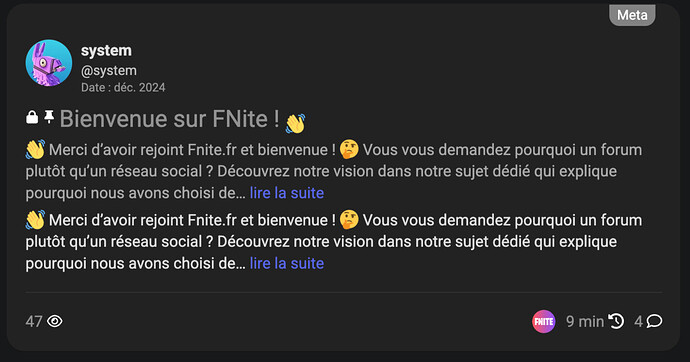](../../../assets/images/234323/ecd277c1cd0e6614ab8a301b0d530f76c2a8068a.jpeg "Brave Browser 2025-02-03 19.16.20")

The duplication disappears if I unpin the topic or use another theme. Could you please let me know if there’s a solution to fix this behavior?

[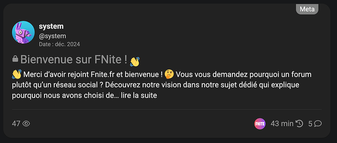](../../../assets/images/234323/c5b20ed27716125861d247f4e4728a1998490056.png "Google Chrome 2025-02-03 19.50.47")

Thank you for your help.

---

### Post #393 by [Don](../../users/Don.md)
*Posted: 2025-02-03 19:48*

Hey [@Kevin7](/u/kevin7) 👋 Nice catch. Thanks for the report.  I’ve merged an update to hide the pinned topic default excerpt: [UX: hide pinned topic excerpt to prevent duplicated topic excerpt  
](https://github.com/VaperinaDEV/fkb-pro-theme/commit/dd6ffa8a86bd5644560d09cb7c29cf192400f6f6)

---

### Post #394 by [Monikas](../../users/Monikas.md)
*Posted: 2025-02-04 10:26*

[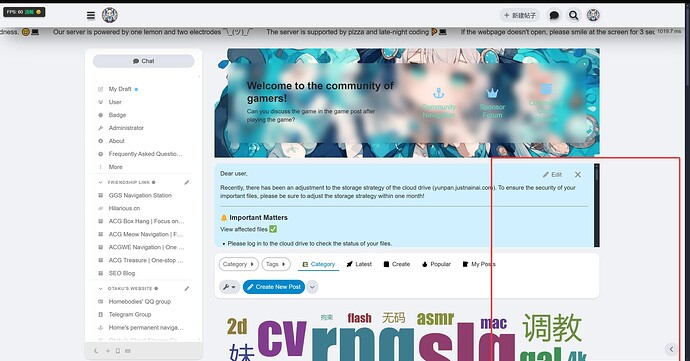](../../../assets/images/234323/6e179f700d2563a9e2d479e53c708d6de7b1596d.jpeg "The image displays a screenshot of a gaming community chat with a notice about an adjustment to storage strategy for cloud drives, along with various website elements and categories at the bottom. \(由 AI 生成标题\)")

  

[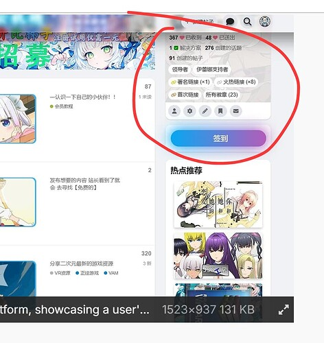](../../../assets/images/234323/ab16cc378158985393e7860e7fc1488c09a1c432.jpeg "The image shows a user interface with a profile section featuring various posts and statistics, including an illustration of a character with a username beneath it and a "登录" \(sign in\) button highlighted in red. \(由 AI 生成标题\)")

  

[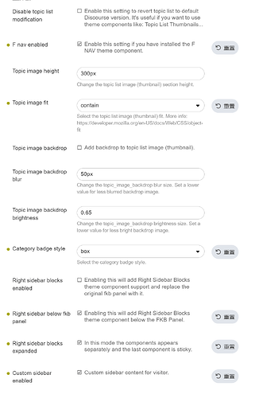](../../../assets/images/234323/15ce1b0a703c4d275c35132358e9e9ecdcec74f6.png "The image shows a settings interface for configuring a website theme, including options for enabling setting revisions and various customization features like topic image height, background blur, and sidebar display styles. \(由 AI 生成标题\)")

Wuuu wuuu wuuu… Save meee! It’s goneee! 😭😭😭 I looked everywhere, but nope, nowhere to be found! Could it have just… vanished into thin air? Someone call the digital rescue squad! 🆘💻

---

### Post #395 by [Don](../../users/Don.md)
*Posted: 2025-02-04 10:50*

Did you try to click the button in the right bottom corner?

[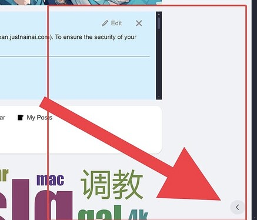](../../../assets/images/234323/839e7de4d389c7e246e8ec9905fe0aa9935ddb57.jpeg "The image depicts a webpage with a red arrow indicating an error in "macOS" being cut off while showing a part of a Chinese character. \(Captioned by AI\)")

---

### Post #396 by [Monikas](../../users/Monikas.md)
*Posted: 2025-02-04 11:25*

")

  

[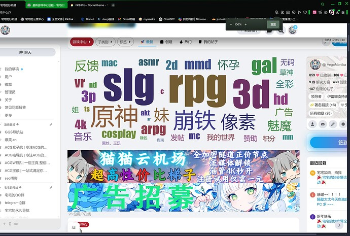](../../../assets/images/234323/7635b495bf1da427c2af8ad950590e09e1c379e3.jpeg "The image is a screenshot of a forum discussing various technology acronyms and digital terms, with a prominent anime-style advertisement at the bottom. \(由 AI 生成标题\)")

  

 featuring a gaming area with text in Chinese, indicating various game titles and content such as RPG, SLG, and 3D games. It also includes a promotional section with colorful graphics and a user profile of "@VegaMonika." \(由 AI 生成标题\)")

The page ratio seems to be a little off after I clicked on it.

---

### Post #397 by [Don](../../users/Don.md)
*Posted: 2025-02-04 11:29*

Did you update theme to the latest?

---

### Post #398 by [Monikas](../../users/Monikas.md)
*Posted: 2025-02-04 11:30*

Yes it’s the update that’s causing these problems  
This bug is the same as the previous feedback on the phone bug a  

")

  
It seems that there is no limit to the size of the preview image anymore It’s fine to display small images but when the image size is large it starts to stretch the whole UI

---

### Post #399 by [Don](../../users/Don.md)
*Posted: 2025-02-04 11:37*

Ah, ok I see. Thanks for the report. I fixed it, please update the theme. 

---

### Post #400 by [LaptechInfo](../../users/LaptechInfo.md)
*Posted: 2025-02-08 10:06*

Hi, in the Category in homepage, the badge style box is not complete. see the picture below.  

[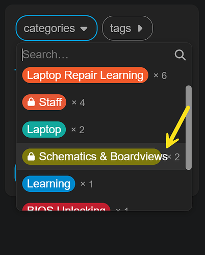](../../../assets/images/234323/f3c2fa6353445d3ad8c68eb3d946a33d709aff4b.png "The image shows a computer screen displaying a list of tags and categories, including "Laptop Repair Learning" and "Staff" with associated counts. \(Captioned by AI\)")

**But in new topics its okay.**  

[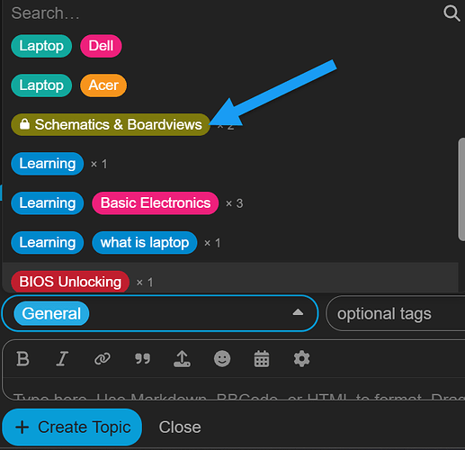](../../../assets/images/234323/54fe84c20103a549c82b638bac7b6cf29435acba.png "The image shows a Slack interface with colored labels for categories like Laptop Dell, Laptop Acer, and Basic Electronics, among others, indicating different topics and topics within a channel. \(Captioned by AI\)")

---

### Post #401 by [Don](../../users/Don.md)
*Posted: 2025-02-08 11:15*

Hello 👋 Thanks for the report! I fixed it [here](https://github.com/VaperinaDEV/fkb-pro-theme/commit/568f970371b8755e641ff2b652e4b9fc692153d2). Please update the theme. 

---

### Post #402 by [LaptechInfo](../../users/LaptechInfo.md)
*Posted: 2025-02-08 15:00*

updated and its done. Thank you for your quick response.  
😍

---

### Post #403 by [LaptechInfo](../../users/LaptechInfo.md)
*Posted: 2025-02-08 15:16*

hi, can you share this themes customization, it looks nice

---

### Post #405 by [LaptechInfo](../../users/LaptechInfo.md)
*Posted: 2025-02-11 04:00*

I tested this theme FKB Pro with Topic List Preview components and Topic List Thumbnails Components but not rendering well. but in reality, we don’t need such components for FKB Pro Theme. because it already has preview feature. so, in finally chose this theme. 👍 👍 👍

---

### Post #406 by [LaptechInfo](../../users/LaptechInfo.md)
*Posted: 2025-02-11 15:22*

Hi, is there a way to reduce the gap between the topic header and logo? when there is menu sidebar present. see the picture below  
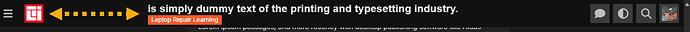

[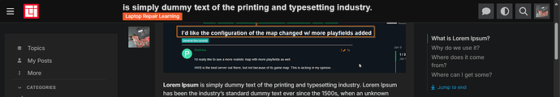](../../../assets/images/234323/0b4d456cfb66eab885ef7871aef3f0f501b8c81e.png "The image shows a screenshot of a text and conversation interface from the Crudify platform, discussing map modification suggestions, with a sidebar on the left and a user definition section on the right. \(Captioned by AI\)")

[@Don](/u/don)  
Thanks

---

### Post #407 by [Jun](../../users/Jun.md)
*Posted: 2025-02-17 03:10*

How to make FKB Pro compatible with [Quote Callouts](https://meta.discourse.org/t/quote-callouts/350962)? That is, use another style for quoting.

Thanks for this great theme.

---

### Post #408 by [Arkshine](../../users/Arkshine.md)
*Posted: 2025-02-17 03:36*

Do you mean you want the callouts style the same as the quote?  
For example,  

[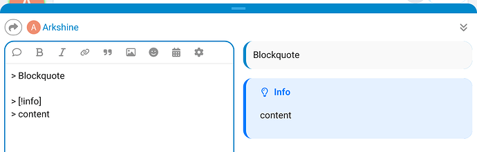](../../../assets/images/234323/8724d30ffc5d97273ee574f66fc7501b063b691f.png "Screenshot 2024-05-23 at 22.05.18.jpeg 2")

---

### Post #409 by [LaptechInfo](../../users/LaptechInfo.md)
*Posted: 2025-02-17 03:38*

hi, its solved automatically after discourse updates.

---

### Post #410 by [Jun](../../users/Jun.md)
*Posted: 2025-02-17 04:30*

Yeah. It works.

---

### Post #411 by [Arkshine](../../users/Arkshine.md)
*Posted: 2025-02-17 14:50*

[@Jun](/u/jun) You can achieve that with the TC settings.

Here is what you can do.  
First, define the global style: width, style and radius:  

[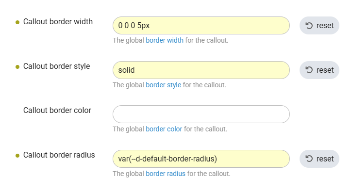](../../../assets/images/234323/0215566e2a91abfcf58b10e3dddb02c0f991bb9e.png "The image shows various control elements for customizing a callout's border style and dimensions, including width, radius, and color, with options for resetting each setting. \(Captioned by AI\)")

Callout border width: `0 0 0 5px`  
Callout border style: `solid`  
Callout border radius: `var(--d-default-border-radius)`

You can also set _Callout border color_ if you want the same border color for all the callouts.

Otherwise, you can define the color per callout.  

")

  
Here in the screenshot, I use the same _Color_ for the border.

[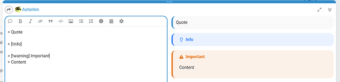](../../../assets/images/234323/9c1698475b20e998980a6e4bebdcaa8dbd86949b.png "The image shows a Usenet article interface featuring quotation and content sections with options to quote and view additional information, highlighted against a light background. \(Captioned by AI\)")

---

### Post #412 by [Obi_Sam_Kenobi](../../users/Obi_Sam_Kenobi.md)
*Posted: 2025-02-18 19:50*

Hey! I just updated our Discourse to the newest updates and it seems like something in it broke the topics layout as they are not contained to the “bubbles” as before. So far the option to disable the FKB Pro topic layout fixed the issue. I am attaching screenshots of the issue below together with the admin console which now shows an error. I had to blur some personal data of our users so I hope that is not too disturbing.

[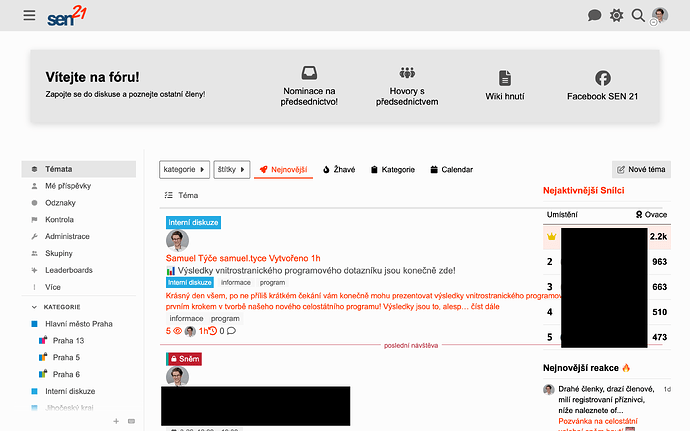](../../../assets/images/234323/010629332ba18d2dec1feec0b958467fb650bb56.png "Snímek obrazovky 2025-02-18 v 20.46.43")

  

[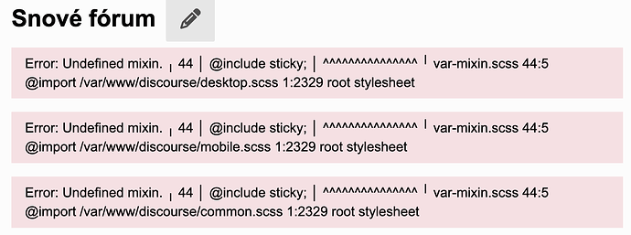](../../../assets/images/234323/e63f1f249197bf2588269aa15f060b5cdec89b44.png "Snímek obrazovky 2025-02-18 v 20.46.20")

---

### Post #413 by [Arkshine](../../users/Arkshine.md)
*Posted: 2025-02-18 20:03*

The SCSS mixin `sticky` has been removed from core recently ([DEV: Remove unnecessary scss mixins (#31355) · discourse/discourse@46c568a · GitHub](https://github.com/discourse/discourse/commit/46c568a85d86fc754d129090a27f47126d1d2109)).

[@Don](/u/don)

---

### Post #414 by [Don](../../users/Don.md)
*Posted: 2025-02-18 20:16*

Thanks for the report [@Obi_Sam_Kenobi](/u/obi_sam_kenobi) and thanks [@Arkshine](/u/arkshine) for the heads up. 🙂

I merged a fix please update the theme.

[github.com/VaperinaDEV/fkb-pro-theme](../../../assets/images/234323/58cad7e79a13e08a47383ef36c618a6ecdd85db8_2_345x170.jpeg)

####  [FIX: Removes @include sticky as the mixin has been removed from core](../../../assets/images/234323/58cad7e79a13e08a47383ef36c618a6ecdd85db8_2_345x170.jpeg)

`main` ← `remove-include-sticky`

merged 08:15PM - 18 Feb 25 UTC

[  VaperinaDEV ](https://github.com/VaperinaDEV)

[ +6 -6 ](https://github.com/VaperinaDEV/fkb-pro-theme/pull/58/files)

---

### Post #415 by [sok777](../../users/sok777.md)
*Posted: 2025-04-07 10:32*

[@Don](/u/don) I can see this message:

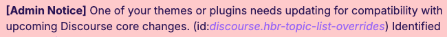

---

### Post #416 by [sok777](../../users/sok777.md)
*Posted: 2025-04-07 23:20*

Also noticed this since uploading to latest build

[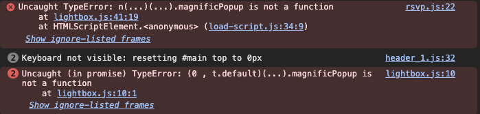](../../../assets/images/234323/df4cd1a121af20d58ffe544bae0cc4c8e7968486.png "Screenshot 2025-04-08 at 00.16.47")

  
lightbox stopped working… is there anything I’m missing? it does work on other themes like Material design.

---

### Post #417 by [Don](../../users/Don.md)
*Posted: 2025-04-08 06:41*

Hey [@sok777](/u/sok777) 👋

Sorry I can’t repro it. I’ve installed the theme on the latest Discourse and didn’t notice this kind of errors you see. Is there any other theme component may cause this? Can you share your site url?

---

[← Previous](234323-page-7.md) | **Page 8 of 10** | [Next →](234323-page-9.md)
