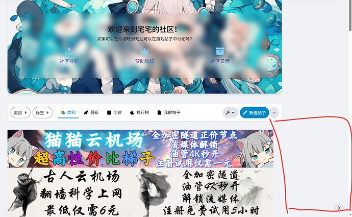
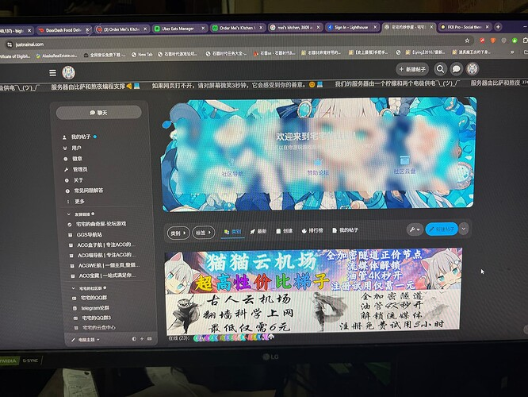
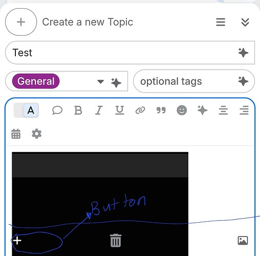
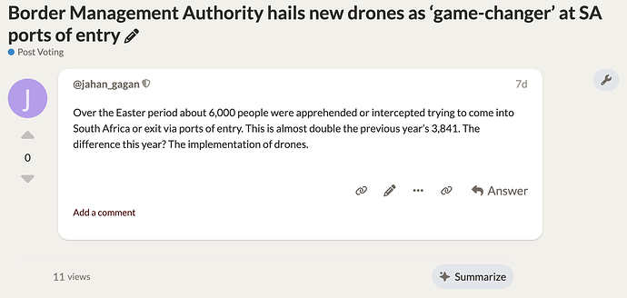
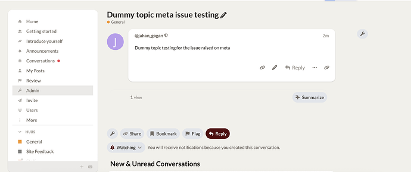
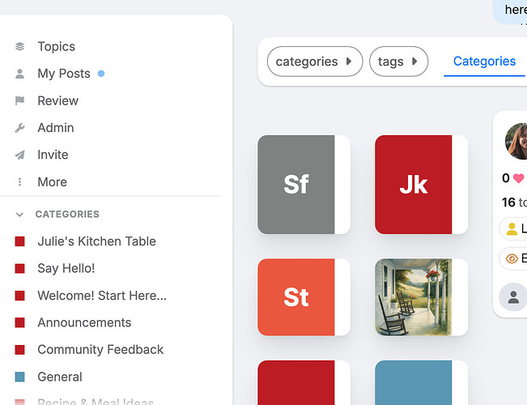
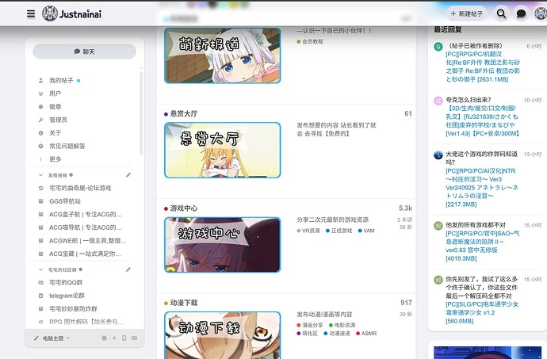
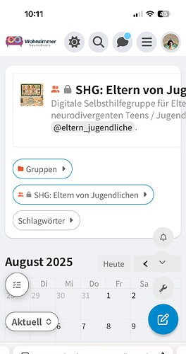
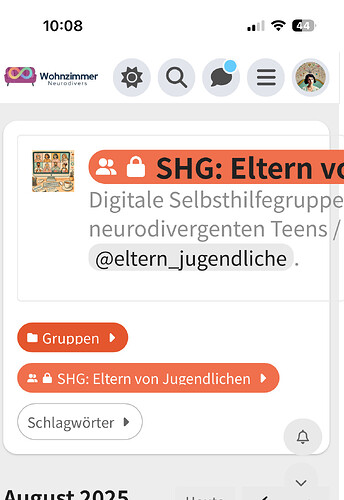
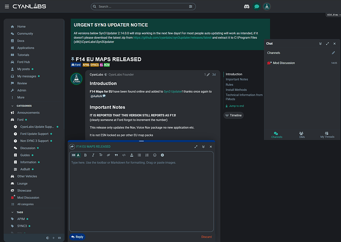

[🏠 Home](../../index.md) | [📋 Latest](../../latest/index.md) | [🔥 Top](../../top/replies/index.md) | [👥 Users](../../users/index.md)

[Home](../../index.md) » [Theme](../../c/theme/index.md) » FKB Pro - Social theme

---

# FKB Pro - Social theme (Page 9 of 10)

> **Category:** Theme
> **Author:** sok777
> **Created:** 2022-07-28 20:58

[← Previous](234323-page-8.md) | **Page 9 of 10** | [Next →](234323-page-10.md)

---

### Post #418 by [sok777](../../users/sok777.md)
*Posted: 2025-04-08 07:52*

Thanks so much [@Don](/u/don), this actually made me realize I had a few components, particularly running jQuery plus custom code that was blocking it! All good now. 👌

---

### Post #419 by [Clo](../../users/Clo.md)
*Posted: 2025-04-14 15:27*

Good day

I just updated my site and now it’s giving me this error at the top of the page:

It also looks like the topic list has changed completely, now only showing the topic title and nothing else.

The category page has also gone blank.

Was there perhaps an error with the last update?

Any advice would be appreciated, thank you!

---

### Post #420 by [pfaffman](../../users/pfaffman.md)
*Posted: 2025-04-14 15:35*

Looks like you need an update. `.hbr` files are no longer recognized.

[![The image depicts a compilation of multiple browser errors, including four with "\[Error\]" labels, a "Compile error," one with "Missing `{addThisBackInYourPromise}" prompt, and one with "Uncaptioned TypeError," all along with specific lines and files pointed out in a red-bordered white screen displaying the FKB Pro theme issue resolutions. \(Captioned by AI\)](../../../assets/images/234323/1adffefd3d9d4dc7e38f2096ce5ac4d85281ebc1.png)](../../../assets/images/234323/1adffefd3d9d4dc7e38f2096ce5ac4d85281ebc1.png "The image depicts a compilation of multiple browser errors, including four with "\[Error\]" labels, a "Compile error," one with "Missing `{addThisBackInYourPromise}" prompt, and one with "Uncaptioned TypeError," all along with specific lines and files pointed out in a red-bordered white screen displaying the FKB Pro theme issue resolutions. \(Captioned by AI\)")

 [Upcoming topic-list changes - how to prepare themes and plugins](https://meta.discourse.org/t/upcoming-topic-list-changes-how-to-prepare-themes-and-plugins/343404) [Dev](/c/dev/7)

> As part of our ongoing quest to standardise the rendering systems across Discourse’s codebase, we’re replacing the implementation of the topic-list. Previously, this used a ‘raw handlebars’ (.hbr) approach, and could be customized via template overrides and raw-plugin-outlets. The new implementation of the topic-list uses modern Glimmer components, and has been built from the ground-up to to be customizable in sustainable ways. The new implementation is now available behind the glimmer_topic_l…

---

### Post #421 by [David_Ghost](../../users/David_Ghost.md)
*Posted: 2025-04-14 15:35*

i got the same problem. I have just updated today

---

### Post #422 by [Don](../../users/Don.md)
*Posted: 2025-04-14 15:58*

Hello 👋 Sorry guys here is the fix: [FIX: Remove legacy topic list and raw handlebars by VaperinaDEV · Pull Request #60 · VaperinaDEV/fkb-pro-theme · GitHub](https://github.com/VaperinaDEV/fkb-pro-theme/pull/60)

---

### Post #423 by [Clo](../../users/Clo.md)
*Posted: 2025-04-14 16:01*

How do I implement this? (bearing in mind that I’m not a developer, is there an update that I need to do or something straightforward?)

---

### Post #424 by [Don](../../users/Don.md)
*Posted: 2025-04-14 16:01*

Just update the FKB theme in admin.

---

### Post #425 by [Clo](../../users/Clo.md)
*Posted: 2025-04-14 16:02*

Ah amazing it worked! Thank you so much!!

---

### Post #426 by [pfaffman](../../users/pfaffman.md)
*Posted: 2025-04-14 16:07*

WOW! That was fast! Nice work! 

---

### Post #427 by [ozkn](../../users/ozkn.md)
*Posted: 2025-04-28 13:02*

When creating a new topic on mobile in the new rich editor, if an image is added to the topic, the publish topic button does not work.

---

### Post #428 by [Monikas](../../users/Monikas.md)
*Posted: 2025-05-03 02:02*

This latest version of the Discourse theme sidebar does not show the following content, I also clicked on the button, no response And I found that it seems that the thumbnails of the posts do not support the linking of images do not know whether it is also due to the Discourse update I hope that the authors of the Lord can take the time to look at it Thank you very much!

")

---

### Post #429 by [Fma965](../../users/Fma965.md)
*Posted: 2025-05-05 21:04*

Same here

as a janky fix i did this
    
    
    .fkb-panel-sidebar, .fkb-panel-sidebar .fkb-panel { 
        display: block !important;
    }
    
    .list-container {
        grid-area: unset !important;
    }

---

### Post #430 by [Don](../../users/Don.md)
*Posted: 2025-05-06 03:10*

Hey [@Monikas](/u/monikas) , [@Fma965](/u/fma965) 👋 Thanks for the report. Fixed it: [FIX: FKB Panel not shown correctly by VaperinaDEV · Pull Request #61 · VaperinaDEV/fkb-pro-theme · GitHub](https://github.com/VaperinaDEV/fkb-pro-theme/pull/61/files)

---

### Post #431 by [Monikas](../../users/Monikas.md)
*Posted: 2025-05-06 04:06*

")

  
Doesn’t seem to be fixed yet, maybe the discourse has been updated again The sidebar can be displayed using the Fma965 css, but there is a bug that makes the discourse tag cloud as small as the sidebar 😭  

")

---

### Post #432 by [Don](../../users/Don.md)
*Posted: 2025-05-06 04:54*

Thanks, I’ve merged another update to fix the compatibility issue with older Discourse versions and [Right Sidebar Blocks](https://meta.discourse.org/t/right-sidebar-blocks/231067). Please update the theme. 🙂

---

### Post #433 by [ozkn](../../users/ozkn.md)
*Posted: 2025-05-06 07:14*

 ozkn:

> When creating a new topic on mobile in the new rich editor, if an image is added to the topic, the publish topic button does not work.

Hello [@don](/u/don) can you fix this error too?

---

### Post #434 by [Don](../../users/Don.md)
*Posted: 2025-05-06 08:30*

Hello 👋 I am not sure about this. Can you share a screenshot/record about the issue?

---

### Post #435 by [ozkn](../../users/ozkn.md)
*Posted: 2025-05-06 08:52*

")

---

### Post #436 by [Fma965](../../users/Fma965.md)
*Posted: 2025-05-06 08:54*

Looks good, thanks!

---

### Post #437 by [jahan_gagan](../../users/jahan_gagan.md)
*Posted: 2025-05-06 13:11*

[@don](/u/don), the topic views and summarize button are not aligned correctly with the post content card. Check out the attached screenshot.

---

### Post #438 by [Don](../../users/Don.md)
*Posted: 2025-05-09 18:49*

Hello [@ozkn](/u/ozkn) 👋 Sorry for the delay, I’ve merged a fix for this: [FIX: `flex-direction: column` breaks the rich text editor · VaperinaDEV/fkb-pro-theme@33355e7 · GitHub](https://github.com/VaperinaDEV/fkb-pro-theme/commit/33355e7a7521f10105aff7990c31b2ff7bff60fb)

---

### Post #439 by [Don](../../users/Don.md)
*Posted: 2025-05-09 19:12*

Thank you [@jahan_gagan](/u/jahan_gagan) 🙂 Here is the fix: [UX: changes `topic-avatar-width` variable to the correct value on desktop by VaperinaDEV · Pull Request #64 · VaperinaDEV/fkb-pro-theme · GitHub](https://github.com/VaperinaDEV/fkb-pro-theme/pull/64/files)

---

### Post #440 by [jahan_gagan](../../users/jahan_gagan.md)
*Posted: 2025-05-09 20:04*

The issue still persists, [@don](/u/don). Check out the screenshot for reference.  

---

### Post #441 by [Don](../../users/Don.md)
*Posted: 2025-05-09 20:43*

Yeah, thanks merged an update to align it correctly: [UX: Align topic-map correctly by VaperinaDEV · Pull Request #65 · VaperinaDEV/fkb-pro-theme · GitHub](https://github.com/VaperinaDEV/fkb-pro-theme/pull/65/files)

---

### Post #442 by [brendahughes](../../users/brendahughes.md)
*Posted: 2025-05-10 19:23*

Is it possible, within this theme, to have the topic preview display the name, photo and username for the most recent responder and not the original poster? Thanks!

---

### Post #443 by [sok777](../../users/sok777.md)
*Posted: 2025-05-16 10:32*

[@Don](/u/don) any ideas how we can preview photos on /latest that were NOT uploaded directly the topic but are embedded?

so for example <https://upload.wikimedia.org/wikipedia/commons/thumb/2/2f/Google_2015_logo.svg/2560px-Google_2015_logo.svg.png>
    
    
    https://upload.wikimedia.org/wikipedia/commons/thumb/2/2f/Google_2015_logo.svg/2560px-Google_2015_logo.svg.png

---

### Post #444 by [tallgirl123](../../users/tallgirl123.md)
*Posted: 2025-05-20 23:30*

  
Does anyone know why these category boxes are so small and skinny?  
It’s also like that on the Latest page.

---

### Post #445 by [Monikas](../../users/Monikas.md)
*Posted: 2025-05-22 01:55*

Should not be compatible with your homepage component  

")

---

### Post #446 by [tallgirl123](../../users/tallgirl123.md)
*Posted: 2025-05-23 15:48*

Where do I change that?

---

### Post #447 by [MihirR](../../users/MihirR.md)
*Posted: 2025-06-09 14:48*

Is there a way to manage the excerpt in the topics shown, like decreasing or increasing for both the body and topic title shown on the homepage?

")

---

### Post #449 by [HAWK](../../users/HAWK.md)
*Posted: 2025-07-17 21:07*

A post was split to a new topic: [CSS help required for theme](/t/css-help-required-for-theme/374707)

---

### Post #450 by [David_Ghost](../../users/David_Ghost.md)
*Posted: 2025-07-26 10:55*

Hey don, it’s looks like it’s needs a update:

> [THEME 186 ‘fj 4.0’] Deprecation notice: The `post-avatar` widget has been deprecated and `api.changeWidgetSetting` is no longer a supported override. [deprecated since Discourse v3.5.0.beta1-dev] [deprecation id: discourse.post-stream-widget-overrides] [info: [Upcoming post stream changes - How to prepare themes and plugins](../../../assets/images/234323/1074240da76dab801c40642d6f4e846544d03d5b_2_1035x672.png)]

Also, is it possible to take a look at [this](../../../assets/images/234323/2075508e1fc874b289921f8f870f8fa450fb4387_2_1034x516.jpeg) please?

Thank you

---

### Post #451 by [jahan_gagan](../../users/jahan_gagan.md)
*Posted: 2025-07-29 09:23*

[@don](/u/don), the Right Sidebar Block is no longer visible after updating to the latest version of Discourse.

Edit: The issue occurs only when the option to add the Right Sidebar Blocks theme component below the FKB Panel is enabled.

---

### Post #452 by [David_Ghost](../../users/David_Ghost.md)
*Posted: 2025-07-29 10:19*

Yes i confirm that

---

### Post #453 by [David_Ghost](../../users/David_Ghost.md)
*Posted: 2025-08-01 17:36*

 jahan_gagan:

> Edit: The issue occurs only when the option to add the Right Sidebar Blocks theme component below the FKB Panel is enabled.

In that case, its can shows the right sidebar block if you disable that option? I will try it for now

---

### Post #454 by [Don](../../users/Don.md)
*Posted: 2025-08-01 20:25*

Hey [@David_Ghost](/u/david_ghost) and [@jahan_gagan](/u/jahan_gagan) 👋

Here is the update to fix these issues.

[github.com/VaperinaDEV/fkb-pro-theme](https://github.com/VaperinaDEV/fkb-pro-theme/pull/66/files)

####  [DEV: Modernize fkb panel usage and glimmer post stream fixes and more...](https://github.com/VaperinaDEV/fkb-pro-theme/pull/66/files)

`main` ← `VaperinaDEV-patch-3`

merged 08:24PM - 01 Aug 25 UTC

[  VaperinaDEV ](https://github.com/VaperinaDEV)

[ +199 -162 ](https://github.com/VaperinaDEV/fkb-pro-theme/pull/66/files)

---

### Post #455 by [David_Ghost](../../users/David_Ghost.md)
*Posted: 2025-08-01 20:34*

Thank you very much Don

EDIT: it’s looks like its shows in mobile now. I hidden it with css

---

### Post #457 by [RoldanLT](../../users/RoldanLT.md)
*Posted: 2025-08-02 06:30*

Some of the sidebar links seem to be broken?

Specifically, the likes given, topics created, and posts created point to:

`/u/%3Cdiscourse@model:user::ember48%3E/activity/likes-given`
    
    
    /u/%3Cdiscourse@model:user::ember143%3E/activity/topics
    
    
    
    /u/%3Cdiscourse@model:user::ember143%3E/activity/replies
    

Thanks for the recent update; it works great. 🙂

---

### Post #458 by [Don](../../users/Don.md)
*Posted: 2025-08-03 16:51*

Hey [@David_Ghost](/u/david_ghost) and [@RoldanLT](/u/roldanlt), thanks for the report! I’ve fixed these issues here: [FIX: Hide fkb-panel on mobile and fix broken links by VaperinaDEV · Pull Request #67 · VaperinaDEV/fkb-pro-theme · GitHub](https://github.com/VaperinaDEV/fkb-pro-theme/pull/67/files)

---

### Post #459 by [jahan_gagan](../../users/jahan_gagan.md)
*Posted: 2025-08-03 17:44*

I think the design is now not displaying properly on mobile devices [@don](/u/don).  

---

### Post #460 by [Don](../../users/Don.md)
*Posted: 2025-08-03 18:04*

Hello 👋 Unfortunately I can’t repro it. I’ve also tried it on your site and looks ok for me.

---

### Post #461 by [David_Ghost](../../users/David_Ghost.md)
*Posted: 2025-08-04 20:16*

 David_Ghost:

> Also, is it possible to take a look at [this](../../../assets/images/234323/2075508e1fc874b289921f8f870f8fa450fb4387_2_1034x516.jpeg) please?
> 
> Thank you

I just ran a few more tests and noticed this: the 429 issue only happens when I’m logged in. When I’m logged out, the problem doesn’t occur at all. So I believe the issue is indeed with the FKB Panel, with the user infos, usercard, etc.

---

### Post #462 by [RoldanLT](../../users/RoldanLT.md)
*Posted: 2025-08-04 22:11*

 David_Ghost:

> Also, is it possible to take a look at [this](../../../assets/images/234323/2075508e1fc874b289921f8f870f8fa450fb4387_2_1034x516.jpeg) please?

I can reproduce this “429 (Too Many Requests)” issue too using this theme.

---

### Post #463 by [Don](../../users/Don.md)
*Posted: 2025-08-05 13:37*

Hello 👋

We now add these fetched datas to sessionStorage, hopefully that will help: [DEV: Save fetched userDetails and userCardDetails into sessionStorage · VaperinaDEV/fkb-pro-theme@f880e5c · GitHub](https://github.com/VaperinaDEV/fkb-pro-theme/commit/f880e5cb026dd7f5b49cbe05bbd55c316e01624d)

---

### Post #464 by [Monikas](../../users/Monikas.md)
*Posted: 2025-08-14 04:44*

This theme update seems to have caused the cover images for the categories to be smaller 

---

### Post #465 by [Aurora](../../users/Aurora.md)
*Posted: 2025-08-14 08:13*

After the update, the description doesn’t fit here anymore:

---

### Post #466 by [Fma965](../../users/Fma965.md)
*Posted: 2025-08-31 13:08*

Seems like the chat goes up in the air when the composer is open in recent discourse updates

i thought it was my custom tweaks but i disabled the component that overrides the default styling but it was the same.

---

### Post #467 by [Noah](../../users/Noah.md)
*Posted: 2025-08-31 17:25*

Hi guys - I’m not sure if this is the appropriate place to post as I haven’t been on the meta for a while - There use to be a really hyped up theme that wasn’t released and I remember it being a demo theme on the discourse forum. I can’t seem to find it any more and I’m curious if this was the theme that it was?

Many thanks,  
Noah

---

### Post #468 by [Moin](../../users/Moin.md)
*Posted: 2025-08-31 17:49*

I don’t think FKB Pro is the theme you have in mind. It was shared in 2022.  
My guess would be that you are looking for the Central theme

The repository is still available on Github, but I am not sure how actively it’s maintained as it was never released and is still experimental.

---

### Post #469 by [Noah](../../users/Noah.md)
*Posted: 2025-08-31 18:05*

Bingo!! Looks like it’s [unlisted](https://meta.discourse.org/t/discourse-central-theme-meta-pre-release-out-now/287495). 

---

[← Previous](234323-page-8.md) | **Page 9 of 10** | [Next →](234323-page-10.md)
