[🏠 Home](../../index.md) | [📋 Latest](../../latest/index.md) | [🔥 Top](../../top/replies/index.md) | [👥 Users](../../users/index.md)

[Home](../../index.md) » [Theme](../../c/theme/index.md) » FKB Pro - Social theme

---

# FKB Pro - Social theme (Page 1 of 10)

> **Category:** Theme
> **Author:** Don
> **Created:** 2022-07-28 20:58

← Previous | **Page 1 of 10** | [Next →](234323-page-2.md)

---

### Post #1 by [Don](../../users/Don.md)
*Posted: 2022-07-28 20:58*

**FKB Pro** is a highly modified, detailed, professional social theme, but still user-friendly. 🚀

> ⚠️ **This theme is quite sensitive and maybe not well compatible with other theme components or plugins you use!** Please test it before use. These usually need some css modification. If you have any issue please report and will fix it.

* * *

## Layout

**On desktop:** Three column layout.

[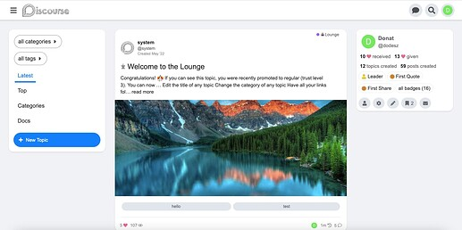](../../../assets/images/357665/543b344600b8fb6ae6dccc92c77cecc46646b004.jpeg "Screenshot 2023-01-02 at 19.53.05")

Sidebar ready

[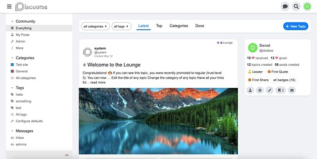](../../../assets/images/357665/ae96c37c29d4d946ff2168e63b4b2383fee42ad3.jpeg "Screenshot 2023-01-02 at 19.51.55")

* * *

**On mobile:**

[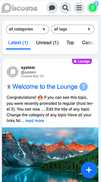](../../../assets/images/357665/cb101211f3558a64d8b19ff040c956930e5ac52f.png "Screenshot 2023-01-02 at 19.56.45")

[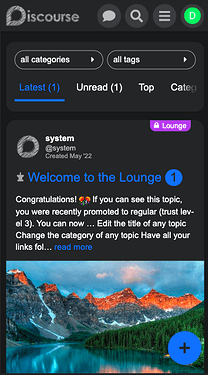](../../../assets/images/234323/761917687f96e0e3abed63d770270c0f604ecace.png "Screenshot 2023-01-02 at 20.20.41")

* * *

### Rounded corners

FKB Pro has highly rounded corners everywhere by default, but I know not everyone likes it so I added some Theme Settings to make it easier to customize it.

[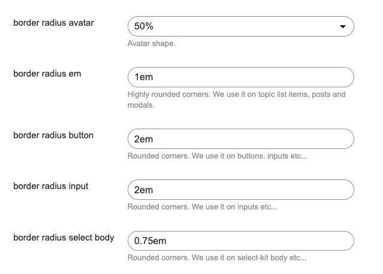](../../../assets/images/234323/1fccacf5171aea5548d48c50a43b7e7a1702fdac.png "Screenshot 2023-01-02 at 19.58.51")

If you don’t like rounded corners… set these value to `0`.

[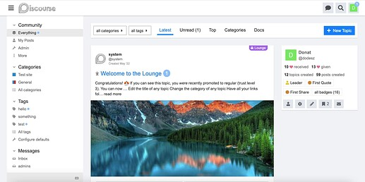](../../../assets/images/234323/2075508e1fc874b289921f8f870f8fa450fb4387.jpeg "Screenshot 2023-01-02 at 20.00.25")

* * *

### Topic Card

[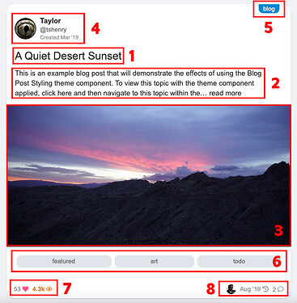](../../../assets/images/234323/6f46b983b5ac24004bd0c7c59c0613d6e2409957.jpeg "topic-list-card")

Main sections

  1. **Title** _(click goes to the last post)_
  2. **Excerpt** _(click goes to the OP)_
  3. **Image** _(click goes to the last post)_

Other sections

  4. **Left top** : Author datas (avatar, name, username) and the date when the topic created.  
_(click open user card)_
  5. **Right top** : Category badge
  6. **Center bottom** : Tags
  7. **Left bottom** : Topic likes and views  
_(click goes to OP and summarize topic if available)_
  8. **Right bottom** : Last poster avatar, date and replies count.  
_(click avatar open user card, date go to last post and replies count open reply selection)_

Badges style

  1. bullet  

  2. bar  

  3. box  

* * *

### Category Page

Because of the limited size on center please use, one column category page styles. I made some customization on these to fit more to this theme.

**Categories Only, Categories and Latest Topics, Categories and Top Topics**

[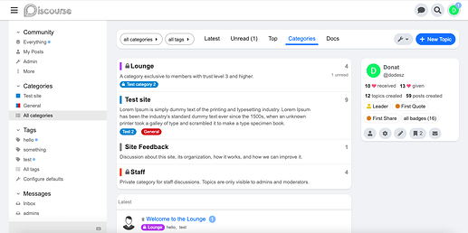](../../../assets/images/234323/3d6c37cb89e561cbfde519599f0c2631b3f0dcab.png "Screenshot 2023-01-02 at 20.02.30")

**Categories Boxes**

[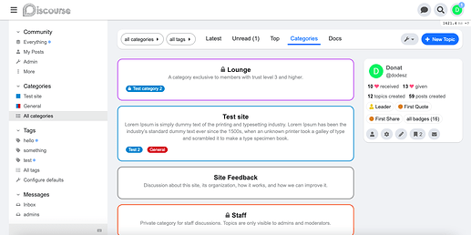](../../../assets/images/234323/0a23eb3924f520031dbe110c2c8cb9e74f1b6429.png "Screenshot 2023-01-02 at 20.07.37")

**OR**

You can use the [Modern Category + Group Boxes](https://github.com/jordanvidrine/discourse-category-group-boxes.git) theme component created by [@jordan.vidrine](/u/jordan.vidrine)

* * *

## FKB Panel

**On desktop:** The right sidebar.

**For anon visitors** it is show a Welcome message. This message is same as` js.signup_cta.value_prop`. The header `Welcome` text you can change in Theme Translation.

[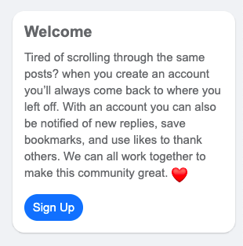](../../../assets/images/234323/e89499d24c72dc1631bdb711bf842e210b0e9bf1.png "Screenshot 2022-07-28 at 12.10.27")

**OR**

**For anon visitors** there is an option to enable a custom sidebar. You can add custom content to the sidebar like image and description.

[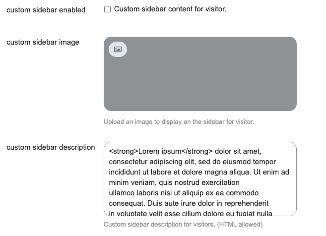](../../../assets/images/234323/ca621fe3ac598fe90abc69c3308401595ab925fa.png "Screenshot 2022-07-31 at 14.47.37")

[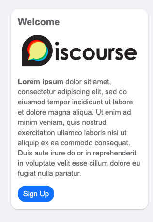](../../../assets/images/234323/a42331de7028c5f81318ec4a660b3d916ca40d78.png "Screenshot 2022-07-31 at 14.44.05")

* * *

**For logged in users** it is contains the user informations such as profile picture, statistics, badges and also use the user card image to background. Also contains some quick buttons on bottom.

[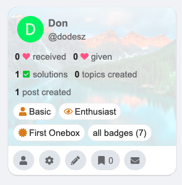](../../../assets/images/234323/1995c08ba14320f61760adb91b9b39fe5df0d9e7.png "Screenshot 2022-07-28 at 12.58.34")

* * *

## Color Schemes

[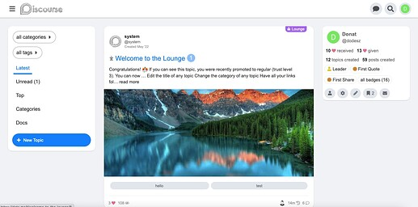](../../../assets/images/234323/7d890aedc66b78523545ab6b223aa94870ff4a65.jpeg "Screenshot 2023-01-02 at 20.10.14")

[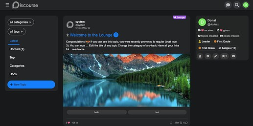](../../../assets/images/234323/b3bc25823b2149ac961ce2e4e5112ce555c9f582.jpeg "Screenshot 2023-01-02 at 20.12.55")

The theme contains two color schemes **FKB Pro - Light** and **FKB Pro - Dark**.

Color Schemes

FKB Pro - Light

  * primary `#242526`
  * secondary `#ffffff`
  * tertiary `#147efb`
  * quaternary `#147efb`
  * header_background `#ffffff`
  * header_primary `#242526`
  * highlight `#147efb`
  * danger `#f8745c`
  * success `#42b72a`
  * love `#fa6c8d`

FKB Pro - Dark

  * primary `#ffffff`
  * secondary `#242526`
  * tertiary `#147efb`
  * quaternary `#4267b2`
  * header_background `#242526`
  * header_primary `#ffffff`
  * highlight `#147efb`
  * danger `#f8745c`
  * success `#42b72a`
  * love `#fa6c8d`

There are some custom color schemes too which you can change on settings.

Custom Color Schemes

fkb-bg

  * light `#f0f2f5`
  * dark `#18191a`

fkb-header-btn

  * light `#e1e5eb`
  * dark `#3a3b3e`

fkb-header-btn-hover

  * light `#d2d8e1`
  * dark `rgba(var(--primary-rgb),.1)`

fkb-btn

  * light `#e1e5eb`
  * dark `#383838`

fkb-btn-hover

  * light `#d2d8e1`
  * dark `rgba(var(--primary-rgb),.1)`

* * *

More about the latest updates 🔽

[FKB Pro - Social theme](../../../assets/images/234323/563927b03fe1da3c50c017dfdd7d22c217352b4b_2_1035x582.jpeg) [Theme](/c/theme/61)

> Hello, I’ve create a bigger update on this theme. I will merge this soon.  Changes change layout from flexbox to grid sidebar compatibility new revamped user menu (redesign) clean up the code redesign chat floating navigation controls (notification, create topic button) on mobile desktop version navigation bar on mobile redesign oneboxes and quotes removed avatar and stats (fkb panel) from topic list on mobile removed full width (paddingless) mobile version Desktop… 

and here 🔽

[FKB Pro - Social theme](../../../assets/images/234323/578354e95c8608b602d9cf8a13943a2fbbadc68f.png) [Theme](/c/theme/61)

> Hello, I’ve added more updates, fixes etc: improve responsive layout added Discourse Reactions support added sticky new topic banner (floating from top) I testing it a little bit more and after I can merge these changes.  Responsive Sticky new topic banner Desktop Mobile 

There are so many other customizations what I didn’t mention. 

* * *

> **Credit** ❤️ Huge thanks to [@awesomerobot](/u/awesomerobot) to created [Fakebook](https://meta.discourse.org/t/fakebook-a-theme-for-social-media-lovers/109079) theme and [@jordan.vidrine](/u/jordan.vidrine) to created Fakebook Modern theme.

|  |   
---|---|---  
👓 | **Preview** | [Theme Creator](https://discourse.theme-creator.io/theme/Don/fkb-pro)  
🛠️ | **Repository** | [FKB Pro theme](https://github.com/VaperinaDEV/fkb-pro-theme)  
❓ | **Install Guide** | [How to install a theme or theme component](https://meta.discourse.org/t/how-do-i-install-a-theme-or-theme-component/63682)  
📖 | **New to Discourse Themes?** | [Beginner’s guide to using Discourse Themes](https://meta.discourse.org/t/beginners-guide-to-using-discourse-themes/91966)

---

### Post #2 by [Jagster](../../users/Jagster.md)
*Posted: 2022-07-28 22:23*

With iPad it is quite… wide. I mean, really wide 😉  
  
[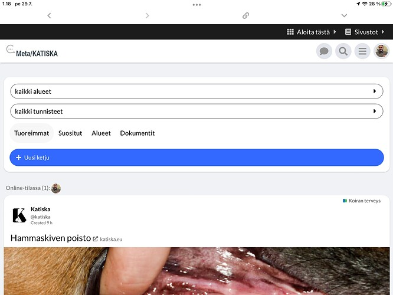](../../../assets/images/234323/daef2fdf7733a3eb68def539ff9673d913963f48.jpeg "image")

That is because of there is no sidebar, I guess. Any ideas why?

---

### Post #3 by [darkpixlz](../../users/darkpixlz.md)
*Posted: 2022-07-28 22:33*

I love it!

My only suggestion is to make the hamburger menu wider and then add padding  
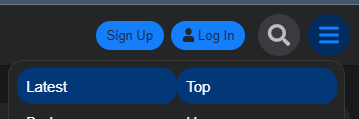

---

### Post #4 by [Jagster](../../users/Jagster.md)
*Posted: 2022-07-28 23:04*

Another small one:

  * my forum doesn’t use solved-plugin
  * we don’t use badges

You know better how I hide those two 😉

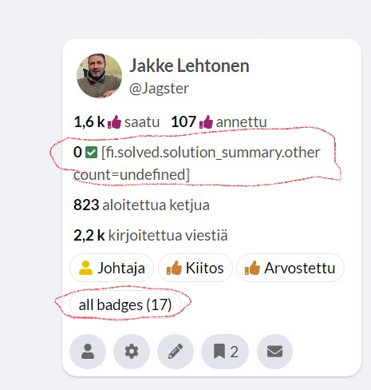

Otherwise… this theme looks really promising on desktops and mobiles (tablets are little bit problematic)

BTW — there is small layout issue with versatile banner. It pushes content below it a little bit too much to left.

---

### Post #5 by [Don](../../users/Don.md)
*Posted: 2022-07-28 23:18*

Hello,

I pushed a fix to tablet view. Please update the theme. 

[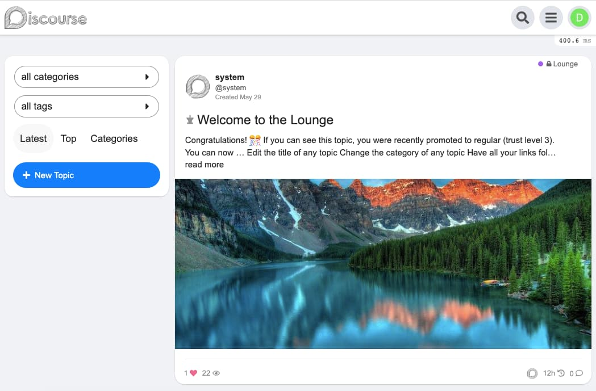](../../../assets/images/234323/d69f190224187f0eb5c5b8ae99d5d0ddc00a6e91.jpeg "Screenshot 2022-07-29 at 1.17.00")

---

### Post #6 by [Jagster](../../users/Jagster.md)
*Posted: 2022-07-28 23:20*

That was fast.

Much better, thanks. I got a new default theme…

---

### Post #7 by [Don](../../users/Don.md)
*Posted: 2022-07-28 23:23*

Thanks  Yep, I think this is default. The first item is in focus when you open menu.

---

### Post #8 by [darkpixlz](../../users/darkpixlz.md)
*Posted: 2022-07-28 23:25*

Yeah, I was just sugesting that there’s a bit of space inbetween them, besides that the theme looks good for how much I hate facebook and meta haha

---

### Post #9 by [Don](../../users/Don.md)
*Posted: 2022-07-28 23:44*

Thanks  I pushed a fix for this.

I’ve added two theme settings.  
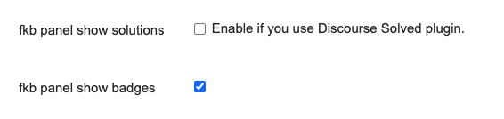

 Jakke Flemming:

> there is small layout issue with versatile banner

I will check this.

---

### Post #10 by [Jagster](../../users/Jagster.md)
*Posted: 2022-07-29 00:05*

I must be pain in the tender places 

There is one issue. Not for me, but for my top 5 contributers it is matter of life and dead — well, that was perhaps too much but they really want this.

Category settings:

[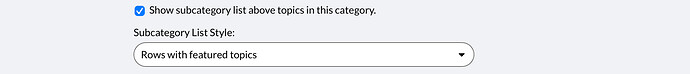](../../../assets/images/234323/8d4f4794490f779dea3abcc79417d35e5d6c622a.jpeg "image")

It normally shows something like this (on iPad, but you understand what I’m meaning)

[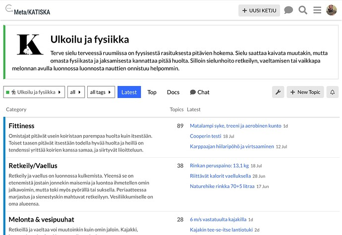](../../../assets/images/234323/2fb224b14982cc02e2932f30c719a449825995a3.jpeg "image")

Your layout breaks if there is a description or name of category is longer than few characters:

[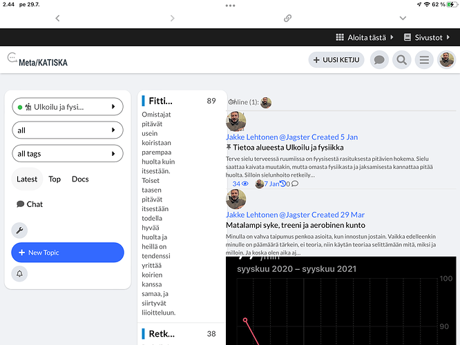](../../../assets/images/234323/651930d8cd28cef1161e6a0634b8ec7c947562dc.png "image")

Disabling `show subcategory list above…` solves out this, of course.

But I’m moving toward using only top-level categories and heavily relying on tags anyway (and then your theme is actually quite suitable in many ways) — so if fixing that would take a little bit too much work and/or you have something more important to do, I’m totally ok if you work with this later.

---

### Post #11 by [Don](../../users/Don.md)
*Posted: 2022-07-29 11:33*

Hello, I’ve added a [fix for Discourse Reactions](https://meta.discourse.org/t/fkb-pro-social-theme/234323#plugins-fixes-10).   
You can install it as a theme component.

---

### Post #12 by [Don](../../users/Don.md)
*Posted: 2022-07-29 14:41*

Thanks for the report [@Jagster](/u/jagster). I have pushed a fix for this issue. [FIX: Topic list category layout by VaperinaDEV · Pull Request #3 · VaperinaDEV/fkb-pro-theme · GitHub](../../../assets/images/234323/3001378bdca66eeb1440d265104daabb853aefa1_2_1035x492.jpeg)

[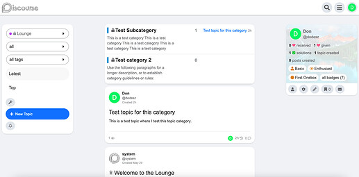](../../../assets/images/234323/d0a60df567bf9b2f21d97bc1dceda8afcd392833.jpeg "Screenshot 2022-07-29 at 16.36.10")

[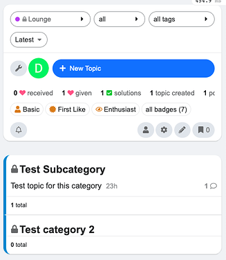](../../../assets/images/234323/658f9d491266d545ee7447670d8b2ddd5f095f7a.png "Screenshot 2022-07-30 at 17.31.10")

---

### Post #13 by [Don](../../users/Don.md)
*Posted: 2022-07-30 08:04*

 Jakke Flemming:

> BTW — there is small layout issue with versatile banner. It pushes content below it a little bit too much to left.

Hello, I have pushed a fix for this. Thanks  Please update the theme.

Before

[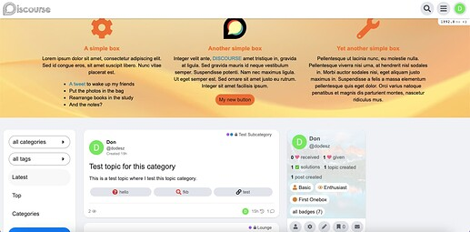](../../../assets/images/234323/adcf3ae9bcc2362524c5e1e51ec6ff00c8aa8c94.jpeg "Screenshot 2022-07-30 at 10.01.07")

After

[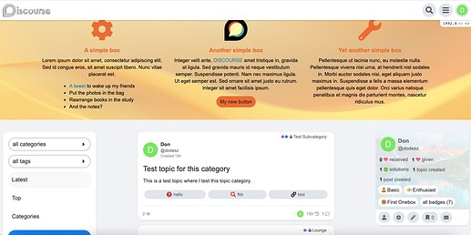](../../../assets/images/234323/43f26909e1bc2337ee9b74dfc4eec24e785269a4.jpeg "Screenshot 2022-07-30 at 10.01.32")

---

### Post #14 by [tmn](../../users/tmn.md)
*Posted: 2022-07-30 11:04*

very cool theme. pls ad more post for test.

---

### Post #15 by [Don](../../users/Don.md)
*Posted: 2022-07-30 11:58*

Thanks  I updated the OP with the theme creator preview link so now you can try it on [Discourse Theme Creator](https://discourse.theme-creator.io/theme/dodesz/fkb-pro) too.

---

### Post #16 by [png](../../users/png.md)
*Posted: 2022-07-30 23:03*

Awesome theme! If I can figure out a way to get a freaking domain and an email server ill def use this theme.

---

### Post #18 by [Don](../../users/Don.md)
*Posted: 2022-07-31 12:53*

Hello,

I’ve added a **new feature**  Now you can add custom sidebar content for visitors.

[github.com/VaperinaDEV/fkb-pro-theme](../../../assets/images/234323/64fff8939c130da66014ea2c1a8d32c27b21a44f_2_1035x580.jpeg)

####  [FEATURE: Custom sidebar content for Visitor](../../../assets/images/234323/64fff8939c130da66014ea2c1a8d32c27b21a44f_2_1035x580.jpeg)

`main` ← `custom-visitor-sidebar`

merged 12:43PM - 31 Jul 22 UTC

[  VaperinaDEV ](https://github.com/VaperinaDEV)

[ +207 -210 ](https://github.com/VaperinaDEV/fkb-pro-theme/pull/6/files)

In this update: A new feature to add custom content (image, description) to visi[…](../../../assets/images/234323/64fff8939c130da66014ea2c1a8d32c27b21a44f_2_1035x580.jpeg)tors sidebar.

[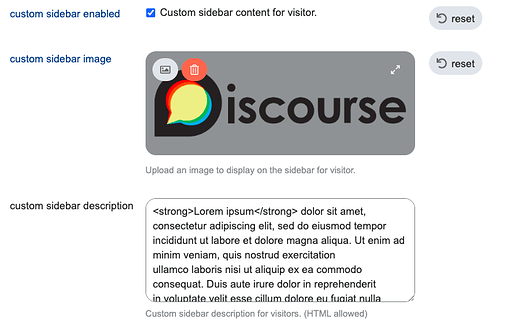](../../../assets/images/234323/056935a8a10bed0e21f1e1231087947a750d33e7.png "Screenshot 2022-07-31 at 14.51.42")

[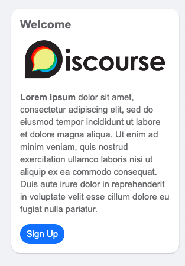](../../../assets/images/234323/790dd2afab2d0b1a322010a9bbacb1675055d50a.png "Screenshot 2022-07-31 at 14.52.00")

---

### Post #19 by [tmn](../../users/tmn.md)
*Posted: 2022-08-01 09:30*

thank for updated this theme.

It would be so great if you develope this theme like blog (forget facebook theme 😅)

suggestion from <https://www.newsbreak.com/>

[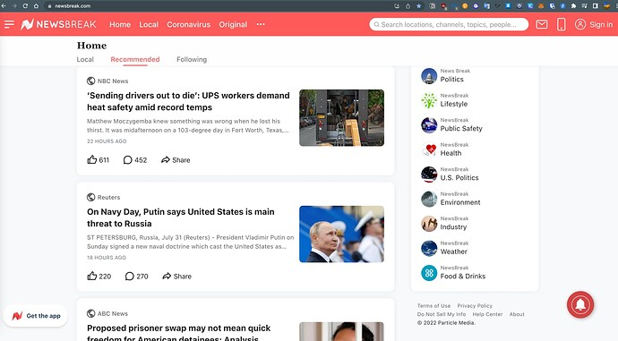](../../../assets/images/234323/4c4c40304bfab2f3951280c69d2d1dead114f6f4.jpeg "image")

---

### Post #20 by [Jagster](../../users/Jagster.md)
*Posted: 2022-08-01 11:22*

I disagree 😉

Blogish needs are different than trying to offer more SoMe-style for those who thinks Faceboom/insta/etc are the best possible UX/UI-experience.

So — out there could be a theme that looks a bit more like blog (what ever that now is meaning…). But this is just fine as it is now.

(WordPress is much more superior as blog-platform than Discourse; those are two totally different tools for different purposes…)

---

### Post #21 by [Paracelsus](../../users/Paracelsus.md)
*Posted: 2022-08-01 11:44*

Hi, great theme!

The theme preview in our forum doesn’t show with 3 columns, only a one-column layout. I suspect some css problem, but still trying to figure it out.

2 questions:

  * Is it possible to have fixed width columns upon a minimum screen width (or several, using for instance media css rules) on desktop-mode? The flexible width gives me a bit of headaches in very large monitors (24 or 27’') and the “dead space” between the three columns is a bit awkward
  * Is the theme compatible with the component for right side blocks [Right Sidebar Blocks - theme-component - Discourse Meta](https://meta.discourse.org/t/right-sidebar-blocks/231067)? If so, it makes the right column more useful/feature rich.

---

### Post #22 by [Don](../../users/Don.md)
*Posted: 2022-08-01 12:59*

 Paracelsus:

> Is it possible to have fixed width columns upon a minimum screen width (or several, using for instance media css rules) on desktop-mode? The flexible width gives me a bit of headaches in very large monitors (24 or 27’') and the “dead space” between the three columns is a bit awkward

Hi [@Paracelsus](/u/paracelsus), Thanks for the feedback.  I merged a fix [Fix: main-outlet width on larger screen by VaperinaDEV · Pull Request #7 · VaperinaDEV/fkb-pro-theme · GitHub](../../../assets/images/234323/70434c0678d7aa915a84836c319ef7fec4a47646_2_225x500.jpeg)

 Paracelsus:

> The theme preview in our forum doesn’t show with 3 columns, only a one-column layout. I suspect some css problem, but still trying to figure it out.

Can I check this somehow?

 Paracelsus:

> Is the theme compatible with the component for right side blocks [Right Sidebar Blocks - theme-component - Discourse Meta ](https://meta.discourse.org/t/right-sidebar-blocks/231067)? If so, it makes the right column more useful/feature rich.

I’ll take a look at it. 

---

### Post #23 by [tmn](../../users/tmn.md)
*Posted: 2022-08-01 14:35*

[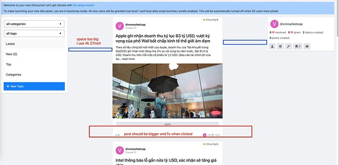](../../../assets/images/234323/c3f9ba3c3f9bf1cbf2607ed4258ac4721e8bba1a.jpeg "image")

  
some suggestion.

---

### Post #24 by [darkpixlz](../../users/darkpixlz.md)
*Posted: 2022-08-02 00:10*

Just tried installing it on my site and it looks _really_ small.  

[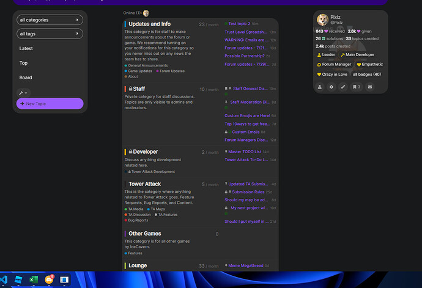](../../../assets/images/234323/f09e4410e08fe5918d12cc30a229d11b5ade654c.jpeg "image")

---

### Post #25 by [Don](../../users/Don.md)
*Posted: 2022-08-02 06:52*

Yeah, I’ll fix it soon.

---

### Post #26 by [Paracelsus](../../users/Paracelsus.md)
*Posted: 2022-08-02 08:50*

 Don:

>  Paracelsus:
>
>> Is it possible to have fixed width columns upon a minimum screen width (or several, using for instance media css rules) on desktop-mode? The flexible width gives me a bit of headaches in very large monitors (24 or 27’') and the “dead space” between the three columns is a bit awkward
> 
> Hi [@Paracelsus](/u/paracelsus), Thanks for the feedback.  I merged a fix [Fix: main-outlet width on larger screen by VaperinaDEV · Pull Request #7 · VaperinaDEV/fkb-pro-theme · GitHub](../../../assets/images/234323/70434c0678d7aa915a84836c319ef7fec4a47646_2_225x500.jpeg)
> 
>  Paracelsus:
>
>> The theme preview in our forum doesn’t show with 3 columns, only a one-column layout. I suspect some css problem, but still trying to figure it out.
> 
> Can I check this somehow?
> 
>  Paracelsus:
>
>> Is the theme compatible with the component for right side blocks [Right Sidebar Blocks - theme-component - Discourse Meta ](https://meta.discourse.org/t/right-sidebar-blocks/231067)? If so, it makes the right column more useful/feature rich.
> 
> I’ll take a look at it. 

Thanks for the fix, it’s better now. 👍  
I’ll try to get you an url where you can see the one-column issue.

---

### Post #27 by [Don](../../users/Don.md)
*Posted: 2022-08-02 11:57*

Hello, I merged some fixes:

[github.com/VaperinaDEV/fkb-pro-theme](https://github.com/VaperinaDEV/fkb-pro-theme/commit/0cd38c1e1d1ed2784632aa9c4edb51eafd00a76b)

####  [Merge pull request #8 from VaperinaDEV/fix-layout-take-2](https://github.com/VaperinaDEV/fkb-pro-theme/commit/0cd38c1e1d1ed2784632aa9c4edb51eafd00a76b)

committed 11:37AM - 02 Aug 22 UTC

[  VaperinaDEV ](https://github.com/VaperinaDEV)

[ +62 -34 ](https://github.com/VaperinaDEV/fkb-pro-theme/commit/0cd38c1e1d1ed2784632aa9c4edb51eafd00a76b)

Take 2: Fix layout issues for larger screens

[github.com/VaperinaDEV/fkb-pro-theme](https://github.com/VaperinaDEV/fkb-pro-theme/commit/3f009b8dc303ab3a64fb1541ba273381536b29ec)

####  [UX: fix some styling issue with categories](https://github.com/VaperinaDEV/fkb-pro-theme/commit/3f009b8dc303ab3a64fb1541ba273381536b29ec)

committed 11:51AM - 02 Aug 22 UTC

[  VaperinaDEV ](https://github.com/VaperinaDEV)

[ +9 -0 ](https://github.com/VaperinaDEV/fkb-pro-theme/commit/3f009b8dc303ab3a64fb1541ba273381536b29ec)

---

### Post #28 by [tmn](../../users/tmn.md)
*Posted: 2022-08-03 10:25*

Just search around Meta and found this forum. This is what I looking for.

 [Better Century](https://community.bettercentury.org/)

### [Better Century](https://community.bettercentury.org/)

Sharing knowledge, experience and recommendations to make a better future.

[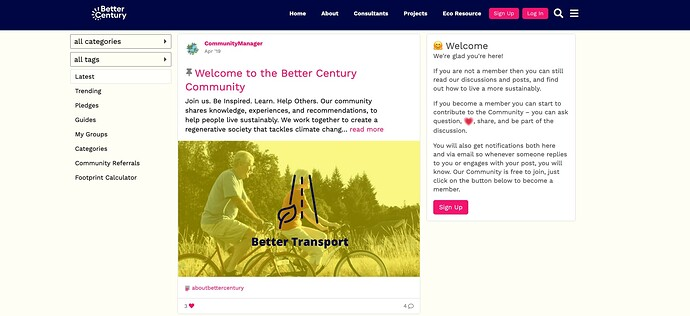](../../../assets/images/234323/e99c7fda59ee7600d9e25629a591d92cb86b1a64.jpeg "image")

---

### Post #29 by [Don](../../users/Don.md)
*Posted: 2022-08-03 10:34*

Ah I see  This is looks like [Fakebook, a theme for social media lovers](https://meta.discourse.org/t/fakebook-a-theme-for-social-media-lovers/109079) I think you looking for that. 

---

### Post #30 by [tmn](../../users/tmn.md)
*Posted: 2022-08-03 10:36*

Hi [@Don](/u/Don). Thank so much for your theme. 😍

---

### Post #31 by [darkpixlz](../../users/darkpixlz.md)
*Posted: 2022-09-23 22:10*

Still having some issues.  

[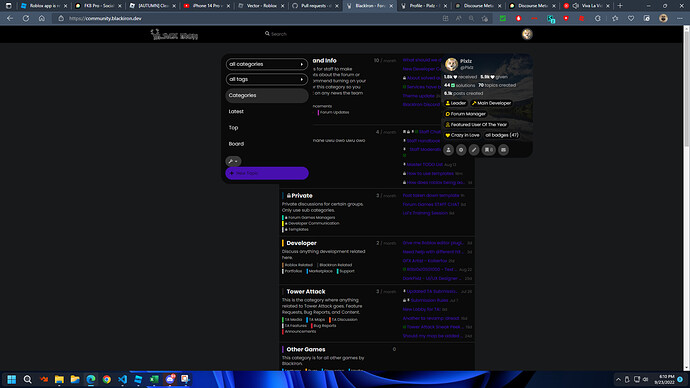](../../../assets/images/234323/563927b03fe1da3c50c017dfdd7d22c217352b4b.jpeg "image")

---

### Post #32 by [Tiago_santos](../../users/Tiago_santos.md)
*Posted: 2022-09-26 14:05*

Congratulations [@Don](/u/Don) , I am very very happy with your theme. It is beautiful and elegant and the site has also increased the scores in core web vitals and google speed insights  
Thank you so much for everything, I really admire your work in the discourse community  
greetings from Brazil

---

### Post #33 by [Don](../../users/Don.md)
*Posted: 2022-09-26 17:31*

 Pyx :

> Still having some issues.
> 
> 

Thank you [@darkpixlz](/u/darkpixlz)! I will update the theme to work with sidebar. 

* * *

[@Tiago_santos](/u/tiago_santos), I am really glad you like it  Thank you so much! ❤️

---

### Post #34 by [Tiago_santos](../../users/Tiago_santos.md)
*Posted: 2022-09-26 23:00*

hi [@Don](/u/Don)  
how to fix this bug (field credit card number black) discourse subscription

[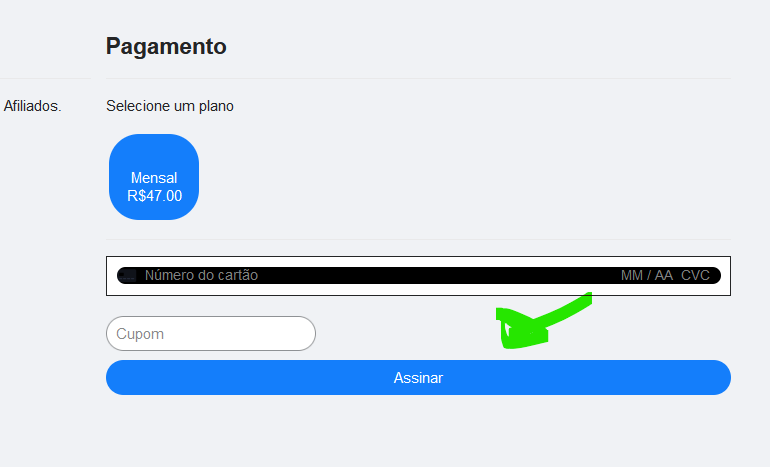](../../../assets/images/234323/e840ceb62344a78dc493ad0cf4c6c8b5da6257bc.png "Captura de tela 2022-09-26 195821")

---

### Post #35 by [Don](../../users/Don.md)
*Posted: 2022-09-27 00:05*

Thanks. I’ve [pushed a fix](https://github.com/VaperinaDEV/fkb-pro-theme/commit/8b042be57867361c53f7b94f16baa498ef8ac4ab) for this…please update the theme. 

---

### Post #36 by [Tiago_santos](../../users/Tiago_santos.md)
*Posted: 2022-09-27 00:32*

perfect, it’s beautiful, thank a lot

---

### Post #39 by [Tiago_santos](../../users/Tiago_santos.md)
*Posted: 2022-10-05 19:50*

Hello [@Don](/u/don)  
i am following this post for discourse plugin ads (house ads)

 [[PAID] Make House Ads Responsive](../../../assets/images/234323/3001378bdca66eeb1440d265104daabb853aefa1_2_1035x492.jpeg) [marketplace](/c/marketplace/14)

> If you read House ads post, they give you the way to set a desktop picture and a mobile one.  Just set the images for each (Less width for phones and more width for desktop) and thats it! I personally use this dimensions: Mobile: 1282x311 Desktop 755x90 Then create a component and add this CSS: $cta-background-color: #FE4644; $cta-text-color: #FFFFFF; .banner-ad { displa… 

apparently the ads plugin is not compatible with fakebook pro (bugs)

In the mobile version, the image is off the screen (large)

in the fakepro theme it cannot differentiate which image is mobile and which image is desktop

can you please check it

---

### Post #40 by [Don](../../users/Don.md)
*Posted: 2022-10-06 03:26*

Hi Tiago,

Can you please clarify it a little bit? Some screenshots, your actual code and where is your advert appear would be very helpful. Thank you 

---

### Post #41 by [Tiago_santos](../../users/Tiago_santos.md)
*Posted: 2022-10-06 14:01*

Hi, so sorry

The image is bigger in the mobile version  
in the default theme it works normally

## My code (house ads)
    
    
    
    

## Mobile

**even if I switch desktop to mobile in the code above, the problem remains**

## Desktop (it´s ok)

[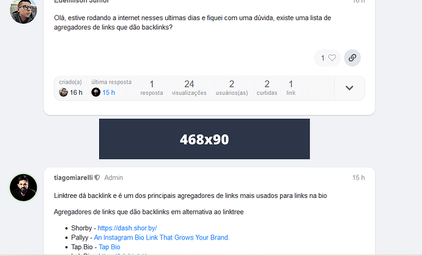](../../../assets/images/234323/fab03ebdffa7fb997b292adeeb07ec089eab8bfd.png "Captura de tela 2022-10-06 105652")

---

### Post #42 by [Don](../../users/Don.md)
*Posted: 2022-10-06 14:44*

Hello,

Yeah, I think because you have to use some css also to make it responsive. 

Something like this should work:
    
    
    
    

Common / CSS
    
    
    .house-creative.house-post-bottom {
      max-width: calc(#{$topic-body-width} + (#{$topic-body-width-padding} * 2) + (12px * 2));
      margin: 8px 0 8px auto;
      .mobile-view & {
        max-width: 100%;
        .banner-ad {
          .banner-img {
            max-width: 100%;
          }
        }
      }
    }

---

### Post #43 by [Tiago_santos](../../users/Tiago_santos.md)
*Posted: 2022-10-06 15:08*

Very great. thank a lot  
it’s working perfectly.  
Once again, thank you very much for your attention. Your discourse theme is the best

---

### Post #44 by [Jagster](../../users/Jagster.md)
*Posted: 2022-10-16 11:51*

This is already known issue, I’m sure, but I’ll push it up anyway: the new sidebar shows only empty space.

I realize FKB Pro shows quite many things that can be found from the sidebar, and location will raise some conflicts, but then the hamburger icon should be hidden.

---

### Post #45 by [lubezniy](../../users/lubezniy.md)
*Posted: 2022-10-19 06:14*

Hi. Thanks for great job.

We installed FKB Pro theme by default in our self-hosted Discourse about a month ago, configured it, and everything was OK. Yesterday we installed Discourse telegram-auth plugin. Discourse container was rebuilt from the fresh Discourse official sources and updated to 2.9.0.beta10 version. After it we have a big empty space in the right part of the wide screen. Here’s the screenshot: <https://www.lubezniy.ru/screens/34a13ea1a87622d4158d85d15d8e9d65372832.png>  
Can you say, what and where can we do (check, change, report or something other) to fix it? Thank you.

---

### Post #46 by [Don](../../users/Don.md)
*Posted: 2022-10-19 10:38*

Hello Victor,

Thank you for the report 

Here is the fix: [Connectors not rendering - #6 by david](../../../assets/images/234323/64fff8939c130da66014ea2c1a8d32c27b21a44f_2_1035x580.jpeg)

It will working after you update your site to the latest version Discourse.

---

### Post #47 by [lubezniy](../../users/lubezniy.md)
*Posted: 2022-10-19 11:15*

Greatest thanks, Don. After upgrading, problem was solved.

---

### Post #48 by [ozkn](../../users/ozkn.md)
*Posted: 2022-11-12 21:40*

[@Don](/u/Don) Hi first thanks for the theme. I use your theme and there are some problems I have.

  1. The label pages look corrupt. There is a shift in the page layout.

  2. For those who use tablets, the left Sidebar is not lost.

I would be glad if you help with these problems

---

### Post #49 by [Don](../../users/Don.md)
*Posted: 2022-11-13 08:45*

Hello, Can you share some screenshot about the issues? Thanks 

* * *

Little update:

We had a conversation privately and successfully fixed the issues.

The first issue has been fixed via [FIX: Modify tag page template to fit to the theme by VaperinaDEV · Pull Request #12 · VaperinaDEV/fkb-pro-theme · GitHub](../../../assets/images/234323/12192179563addc1f6c4c2ba48354e2c9c260982_2_690x344.png)

The second issue was related with google adsense. The ads has fixed size width which cause the issue.

Adding `width: 100%` to ads in a new component Desktop / CSS seems to fix it.

---

### Post #50 by [ozkn](../../users/ozkn.md)
*Posted: 2022-11-13 15:54*

[@Don](/u/Don) Thanks for your help

---

### Post #51 by [Jay91](../../users/Jay91.md)
*Posted: 2022-11-25 22:06*

Hi [@Don](/u/Don),  
Any plans to support RTL out of the box?  
i installed this once, and did some CSS work, it does not look pretty when you switch to RTL languages.

---

### Post #52 by [darkpixlz](../../users/darkpixlz.md)
*Posted: 2022-11-30 00:35*

Still seems to be a bit broken with the sidebar enabled.  
Enabled:  

[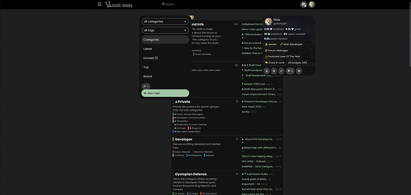](../../../assets/images/234323/3001378bdca66eeb1440d265104daabb853aefa1.jpeg "image")

  
Disabled:  

[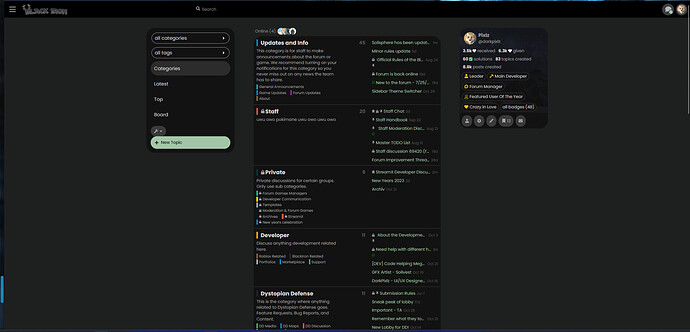](../../../assets/images/234323/87409b324757f15eb14b46bacf24d3e1fe1acd1e.jpeg "image")

  
I’m seeing some padding issues as well.  
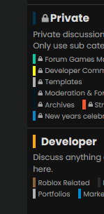  

[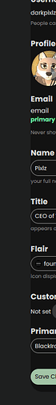](../../../assets/images/234323/5ce95ed26a74ff6a2ba57252cb763f1dfc16589a.png "image")

  

[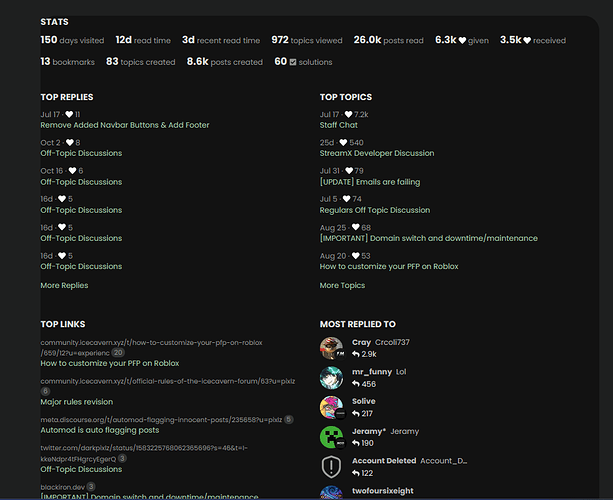](../../../assets/images/234323/411a90e7261e11303a7a3dd2376f78ae2b8a6807.png "image")

Also some issues are present with the new profile buttons.  

[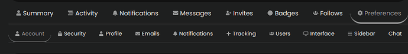](../../../assets/images/234323/0454a537afaa8ecc4399d6640661159313e2a1d0.png "image")

---

### Post #53 by [ozkn](../../users/ozkn.md)
*Posted: 2022-12-25 13:01*

 Pyx :

> Still seems to be a bit broken with the sidebar enabled.  
>  Enabled:
> 
> 
> 
> Disabled:
> 
> 

[@Don](/u/don) Hi, I am having the same problem. If you could help with this situation, I would greatly appreciate it.

---

← Previous | **Page 1 of 10** | [Next →](234323-page-2.md)
