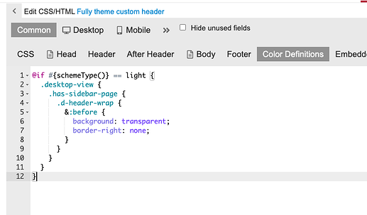
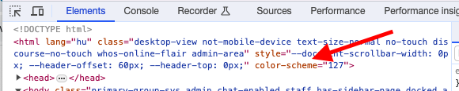
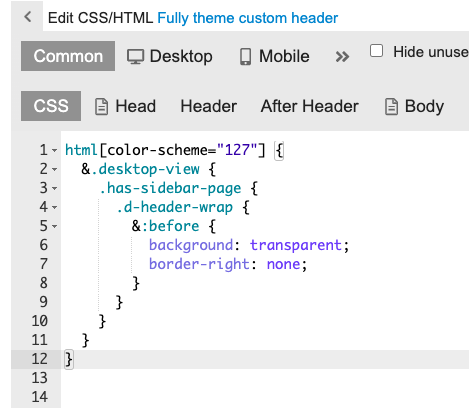
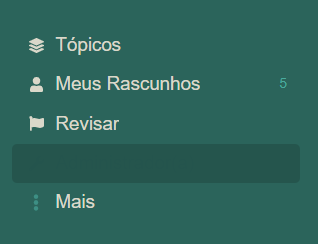
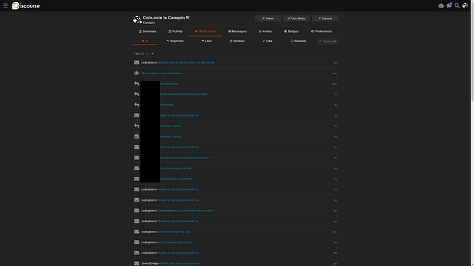
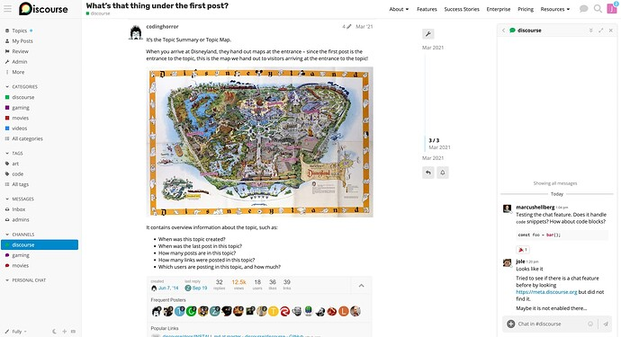
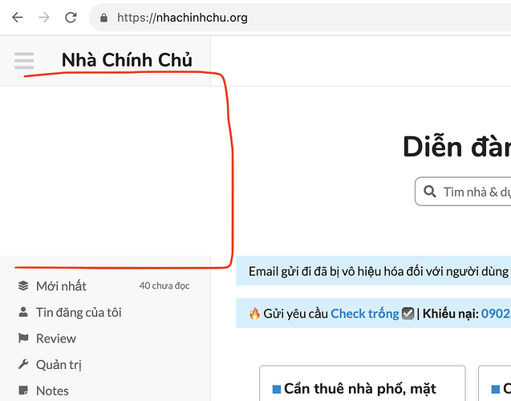
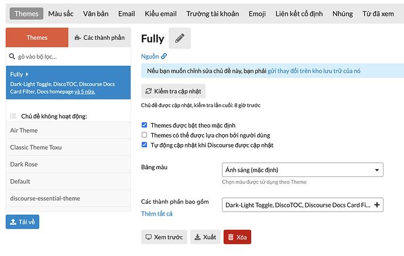
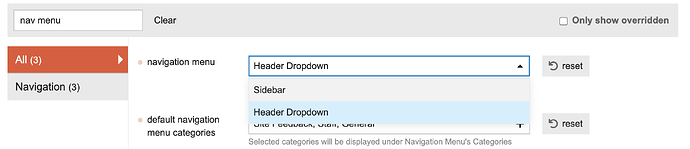

[🏠 Home](../../index.md) | [📋 Latest](../../latest/index.md) | [🔥 Top](../../top/replies/index.md) | [👥 Users](../../users/index.md)

[Home](../../index.md) » [Theme](../../c/theme/index.md) » Fully Theme

---

# Fully Theme (Page 2 of 2)

> **Category:** Theme
> **Author:** packman
> **Created:** 2023-04-25 15:07

[← Previous](262833.md) | **Page 2 of 2** | Next →

---

### Post #63 by [packman](../../users/packman.md)
*Posted: 2023-10-07 10:42*

Thanks for that Don. I’ve not modified Discourse CSS before though…where do I make this change?

---

### Post #64 by [Don](../../users/Don.md)
*Posted: 2023-10-07 11:18*

I’ve updated the post above. 🙂

---

### Post #65 by [packman](../../users/packman.md)
*Posted: 2023-10-07 12:45*

Thank you. Just done it and everything looks good again 😃

---

### Post #66 by [Renato_Mendes](../../users/Renato_Mendes.md)
*Posted: 2023-10-07 14:13*

As the theme is now, there’s a very tiny space left on the right border for this to be done. I think it would be interesting to have more space there and use it for widgets.

---

### Post #67 by [packman](../../users/packman.md)
*Posted: 2023-10-07 14:50*

I let my users have access to the theme and they quickly found something odd going on 

I use the [Custom Header Links](https://meta.discourse.org/t/custom-header-links/90588) theme component and with the other theme I use (Material Design), as you reduce the browser window width when you reach the point that that links would overwrite the site logo the logo shrinks, eventually becoming pretty tiny, e.g.

With Fully the logo doesn’t shrink so eventually you get this…

Custom Header Links removes the links and displays the topic title when viewing a topic. The topic title also overwrites the logo in narrower browser widths, although eventually the logo is completely removed which resolves the issue.

I’m not sure if this is a Fully or a Custom Header Links issue, but I’m starting here as CHL does work OK in the other theme.

---

### Post #68 by [Don](../../users/Don.md)
*Posted: 2023-10-07 15:44*

It seems it has a little conflict with `discourse-full-width-component` and wider logos.

You can quick fix this with 🔽

Paste this in the previously created component after the previous code just to be in one place.

It will shrink the logo.
    
    
    .desktop-view .d-header .title a {
      flex: auto;
    }
    

Update: Hmm I think it probably shrink too much with hidden sidebar…  I just take a quick look and I think it will be something with grid. But I think better to wait the official way of this because I don’t want to break the header ux with changing on the grid.

[@packman](/u/packman) please remove this code.

---

### Post #69 by [packman](../../users/packman.md)
*Posted: 2023-10-07 15:56*

Thank you again! You’re doing wonderful deeds today 🙂

---

### Post #70 by [Renato_Mendes](../../users/Renato_Mendes.md)
*Posted: 2023-10-07 20:43*

Hey, Don! Another issue: changing it this way makes it look the same on dark mode. How can I change the css only for a specific color scheme?

---

### Post #71 by [packman](../../users/packman.md)
*Posted: 2023-10-07 21:41*

 Don:

> Hmm I think it probably shrink too much with hidden sidebar…

The logo does get very small in a narrow window but that also happens with Custom Header Links when used with the Material Design Theme.

I was looking at the CSS earlier and I think it might not be helping that the logo is included inside span.header-sidebar-toggle, although maybe that’s the only sensible place for it in a wider display?

---

### Post #72 by [Don](../../users/Don.md)
*Posted: 2023-10-08 08:27*

 Renato Mendes:

> changing it this way makes it look the same on dark mode

Hello [@Renato_Mendes](/u/renato_mendes) 👋

Oh I see, so you only want to use the transparent background on one color scheme. I didn’t know that.

 Renato Mendes:

> How can I change the css only for a specific color scheme?

There are several ways to do this 🔽

  1. `dark-light-choose()`: It’s possible to do this with it but not to practical in this case as it’s create variables. Better to use for colors.

* * *

  2. `schemeType`: This one is better to this use case if you want to use it by scheme type.

Use schemeType

Here is how to use `schemeType`

Remove the previous code from the component you created and place the new one to the component **Color Definitions** section as you see on the image.  

This will only activate the code on light scheme.

Common / Color Definitions
    
    
    @if #{schemeType()} == light {
      .desktop-view {
        .has-sidebar-page {
          .d-header-wrap {
            &:before {
              background: transparent;
              border-right: none;
            }
          }
        }
      }
    }
    

* * *

  3. [Targetable Color Schemes](https://meta.discourse.org/t/targetable-color-schemes/276967) : If you have more color schemes and/or want to target a specific color scheme where you want to change things then this theme component is ideal for you.

Use Targetable Color Schemes

This component puts the actual color scheme to the `html` so you can target it with CSS.

Here is how to use it:

Install the component.  
Check the color scheme id where you want to change things.  
You can find here  

or

`/admin/customize/colors`  
Colors page. Here if you click a color scheme the id will adds to the URL.

Now you can use this in the code. Don’t forget to remove the previously added code.

    
    
    html[color-scheme="your-color-scheme-id"] {  
      &.desktop-view {
        .has-sidebar-page {
          .d-header-wrap {
            &:before {
              background: transparent;
              border-right: none;
            }
          }
        }
      }
    }
    

* * *

Hello [@packman](/u/packman) 👋 I sent you a PM.

---

### Post #73 by [Renato_Mendes](../../users/Renato_Mendes.md)
*Posted: 2023-10-09 18:37*

Many many thanks, Don! And I’m sorry, but I got confused. My question actually is: how do I change and apply any color of only one color scheme through the CSS?  
I blindly tried this and it didn’t work:
    
    
    @if #{schemeType()} == dark {
        #main-outlet-wrapper .sidebar-container, .sidebar-footer-wrapper .sidebar-footer-container, .sidebar-hamburger-dropdown .sidebar-footer-wrapper .sidebar-footer-container, .sidebar-hamburger-dropdown, .hamburger-panel .revamped.menu-panel.slide-in {
        background-color: #24544D var(--sidebar-color);
            }
          }
    
    

😳

Now the wrapped text looks the same color as the wrapper, and if I change it through CSS, the light theme wrapped text will be changed too, but I don’t want that:  

I’m sorry to bother you again with that.

---

### Post #74 by [Canapin](../../users/Canapin.md)
*Posted: 2023-10-12 11:54*

The [all notifications page](https://meta.discourse.org/my/notifications) feels a bit “empty” and the last activity indicator, using the default font size, is a bit tiny in my opinion:

It’s more nitpicking than anything else though. 🙂

---

### Post #75 by [Alon1](../../users/Alon1.md)
*Posted: 2023-10-20 18:46*

I’d like to use a full width theme in a way that the chat will always be opened on the right sidebar. Would this theme enable that?

---

### Post #76 by [jordan.vidrine](../../users/jordan.vidrine.md)
*Posted: 2023-10-20 19:10*

Theoretically I think so. It isnt a “right sidebar” technically, but if you open the chat window pane (not the full screen version) you can size it like so, and be able to chat and browse the forum:

---

### Post #77 by [thaidb](../../users/thaidb.md)
*Posted: 2023-11-14 15:04*

My site have a blank local when install with [search Banner component](https://meta.discourse.org/t/search-banner/122939)

This error due to component or your theme?  
Thank you!  

---

### Post #78 by [manuel](../../users/manuel.md)
*Posted: 2023-11-14 15:42*

 thaidb:

> This error due to component or your theme?

Looks like you’re using `below-site-header` as plugin outlet on the component settings? You should choose `above-main-container` if you want the search banner to show next to the sidebar.

---

### Post #79 by [thaidb](../../users/thaidb.md)
*Posted: 2023-11-14 22:40*

  
Is the theme locked Edit CSS/HTML?

---

### Post #80 by [Arkshine](../../users/Arkshine.md)
*Posted: 2023-11-14 23:04*

For any themes (or components) installed from a URL, you will not see a button to edit HTML/CSS. It’s because, on update, it will overwrite your changes.

You can either propose your changes to the theme [component] repository (or Discourse topic), or insert extra HTML/CSS to your theme or a new component. 👍

---

### Post #81 by [thaidb](../../users/thaidb.md)
*Posted: 2023-11-15 11:57*

My Logo (text) overflowed to div login, Is this error by theme or my setting?

---

### Post #82 by [Arkshine](../../users/Arkshine.md)
*Posted: 2023-11-15 12:42*

Try this CSS.

    
    
    .d-header {
        height: auto;
        padding-bottom: 0.5em;
    }
    
    .d-header>.wrap .contents {
        flex-wrap: wrap;
        justify-content: center;
    }

---

### Post #83 by [xu2](../../users/xu2.md)
*Posted: 2024-01-23 05:51*

I installed this theme on My site, but The left sidebar doesn’t display.

I don’t know why. Can you help me?

---

### Post #84 by [chapoi](../../users/chapoi.md)
*Posted: 2024-01-23 07:16*

Do you have a hamburger menu on the right side of your navbar? If so, you have the hamburger-dropdown menu enabled and just need to change a setting to switch this to sidebar menu.

Choose “Sidebar” in this setting:  

Does that fix the issue? If not, a screenshot would be helpful.

---

### Post #85 by [xu2](../../users/xu2.md)
*Posted: 2024-01-23 08:22*

Thanks so much!

---

### Post #86 by [supermathie](../../users/supermathie.md)
*Posted: 2024-02-05 17:04*

In the sidebar, `DMs` is a plural acronym and shouldn’t be capitalised to `DMS`.

Or, if you insist, it could be `DIRECT MESSAGES` 🙂

---

### Post #87 by [jordan.vidrine](../../users/jordan.vidrine.md)
*Posted: 2024-02-05 17:06*

 Michael Brown:

> In the sidebar, `DMs` is a plural acronym and shouldn’t be capitalised to `DMS`

That makes sense!

---

[← Previous](262833.md) | **Page 2 of 2** | Next →
