[🏠 Home](../../index.md) | [📋 Latest](../../latest/index.md) | [🔥 Top](../../top/replies/index.md) | [👥 Users](../../users/index.md)

[Home](../../index.md) » [Theme](../../c/theme/index.md) » Fully Theme

---

# Fully Theme (Page 1 of 2)

> **Category:** Theme
> **Author:** Discourse
> **Created:** 2023-04-25 15:07

← Previous | **Page 1 of 2** | [Next →](262833-page-2.md)

---

### Post #1 by [Discourse](../../users/Discourse.md)
*Posted: 2023-04-25 15:07*

|  |   
---|---|---  
 | **Summary** |  **Fully** is a simple and fun-to-use theme based on a full-width layout  
👓 | **Preview** | [Preview on Discourse Theme Creator](https://discourse.theme-creator.io/theme/Discourse/fully-theme)  
🛠️ | **Repository** | <https://github.com/discourse/discourse-fully>  
📖 | **New to Discourse Themes?** | [Beginner’s guide to using Discourse Themes](https://meta.discourse.org/t/beginners-guide-to-using-discourse-themes/91966)  
  
Install this theme

>  As this is an [official](/tag/official) theme maintained by the Discourse team, [Support](/c/support/6) issues, [Bug](/c/bug/1) reports, [UX](/c/ux/9) suggestions, and requests for [Dev](/c/dev/7) advice can be made in the respective categories here on Meta, and tagged with the appropriate theme tag. Click on a link below to get one started. 👍
> 
> ` [❓ **Support**](https://meta.discourse.org/new-topic?category_id=6&tags=fully-theme "Ask for support on configuring and using the Fully Theme") ` ` [🐛 **Bug**](https://meta.discourse.org/new-topic?category_id=1&tags=fully-theme "A bug report means something is broken, preventing normal/typical use of the theme") ` ` [👀 **UX**](https://meta.discourse.org/new-topic?category_id=9&tags=fully-theme "Discussion about the user interface of the Fully Theme, and how features are presented \(including language and UI elements\)") ` ` [ **Dev**](https://meta.discourse.org/new-topic?category_id=7&tags=fully-theme "Advice on how to customise this theme for your site")`

###  Features

This theme utilizes a [full-width theme component](https://github.com/discourse/discourse-full-width-component) made by [@awesomerobot](/u/awesomerobot) 🙏 This theme includes the component for full-width as well as the dark/light theme toggle.

[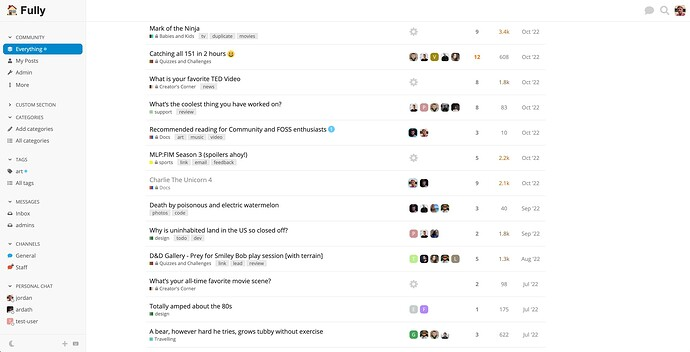](../../../assets/images/262833/6e59ee8db1eb6a132628d3365e46699914f7033c.jpeg "fully light example")

[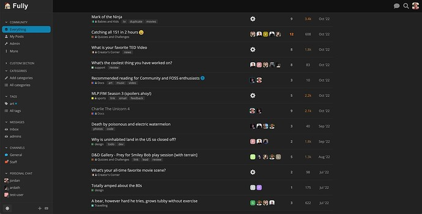](../../../assets/images/262833/a321e6b2d99259ec145a97343c18c69816d26c1e.jpeg "full dark example")

  

>  **Hosted by us?** Themes are available to use on our Standard, Business, and Enterprise plans.

> Last edited by [@JammyDodger](/u/jammydodger) 2024-06-17T12:11:16Z
> 
> Check documentPerform check on document:

---

### Post #2 by [twofoursixeight](../../users/twofoursixeight.md)
*Posted: 2023-04-25 19:18*

This theme can also be previewed here on this website.  
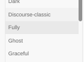

---

### Post #3 by [Lilly](../../users/Lilly.md)
*Posted: 2023-04-25 20:42*

so no hamburger icon or collapsing sidebar? when i have the sidebar collapsed before switching to this one, how do i get it without having to switch back to get the hamburger icon? unless i am missing something obvious in the UI?

---

### Post #4 by [jordan.vidrine](../../users/jordan.vidrine.md)
*Posted: 2023-04-25 20:52*

 Lilly:

> when i have the sidebar collapsed before switching to this one, how do i get it without having to switch back to get the hamburger icon? unless i am missing something obvious in the UI?

This is an interesting point I totally looked over!

There is no toggle on this theme except at small widths.

---

### Post #5 by [Jagster](../../users/Jagster.md)
*Posted: 2023-04-25 21:57*

At phone size screens there isn’t bigger change how it looks compared to other ”basic” ones so basically this changes things a bit at tablet level — because there is no functional hamburger icon. It may work and look differently at bigger laptops and desktops.

But I really like how the sidebar looks with that, fonts are nice.

So could I suggest you make a component that gives same look to other themes? That would be really nice 😉

Or is it just matter of CSS?

---

### Post #6 by [manuel](../../users/manuel.md)
*Posted: 2023-04-28 09:02*

Love this! 💛 Discourse looks great at full width  

Will there be a dedicated topic for the full-width theme component? I see some glitches, but they are related to the component, so I wonder if it makes sense to post here? There will likely be more full-width themes coming that use the component.

---

### Post #17 by [mk0r](../../users/mk0r.md)
*Posted: 2023-05-01 17:28*

[in my opinion] this should be the default discourse theme! with consistent border-radius applied to all buttons

edit: or a simple way to pick a globally border radius

---

### Post #18 by [frold](../../users/frold.md)
*Posted: 2023-05-07 06:32*

I like this theme but wonder if something like this i possible?

[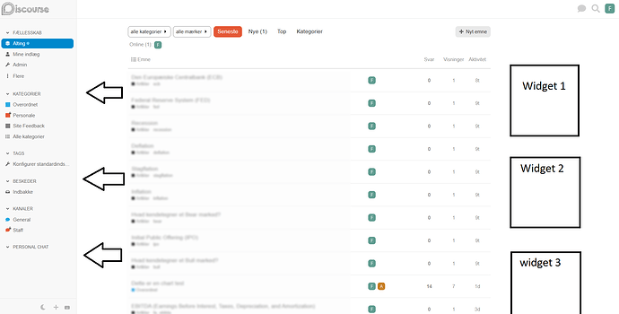](../../../assets/images/262833/374174b30693de5af8fb3d8bb170d92b604f77ca.png "download")

---

### Post #19 by [manuel](../../users/manuel.md)
*Posted: 2023-05-09 12:57*

It seems like the full width setup is changing the header layout? I tried using the [Header Search](https://meta.discourse.org/t/header-search/194093) component, but it doesn’t show with the theme.  
edit: ok, that’s weird. The component didn’t show on my instance where it was already installed and I added the theme. But when I install it after the theme, it shows.

Also, the sidebar scrolls up along with the composer. Well, it also does that on the default layout. But it looks a bit strange when the sidebar is not above the composer, but left of it:

<https://d11a6trkgmumsb.cloudfront.net/original/4X/6/7/0/67000a736158a28f7834ced7566e817ad40a218b.webm>

---

### Post #20 by [frold](../../users/frold.md)
*Posted: 2023-05-09 21:11*

 Manuel Kostka:

> Also, the sidebar scrolls up along with the composer. Well, it also does that on the default layout. But it looks a bit strange when the sidebar is not above the composer, but left of it:

I can confirm this at <https://studmed.dk/>

---

### Post #21 by [jordan.vidrine](../../users/jordan.vidrine.md)
*Posted: 2023-05-10 13:39*

Yes this is an artifact of what is actually currently happening in core discourse.

---

### Post #22 by [frold](../../users/frold.md)
*Posted: 2023-05-10 19:11*

Any solution for this?

---

### Post #23 by [twofoursixeight](../../users/twofoursixeight.md)
*Posted: 2023-05-11 17:24*

Random question: Is there a non full-width version of this theme?

---

### Post #24 by [jordan.vidrine](../../users/jordan.vidrine.md)
*Posted: 2023-05-12 13:56*

There is not, this is meant to be used with full width.

---

### Post #25 by [jordan.vidrine](../../users/jordan.vidrine.md)
*Posted: 2023-05-15 14:49*

Are you meaning that each of the sections with arrows would be moved to a widget to the right side of the topic list?

---

### Post #26 by [frold](../../users/frold.md)
*Posted: 2023-05-15 20:18*

[@jordan-vidrine](/u/jordan-vidrine)  
What I mean is that the “dead” area - the white area that is visible at high resolution, disappears. So the block with the post list moves to the left. Additionally, when using a high-resolution screen, it was possible to place widgets in the area to the right without compressing the size of the block with posts.

If you understand?

---

### Post #27 by [jordan.vidrine](../../users/jordan.vidrine.md)
*Posted: 2023-05-15 20:24*

[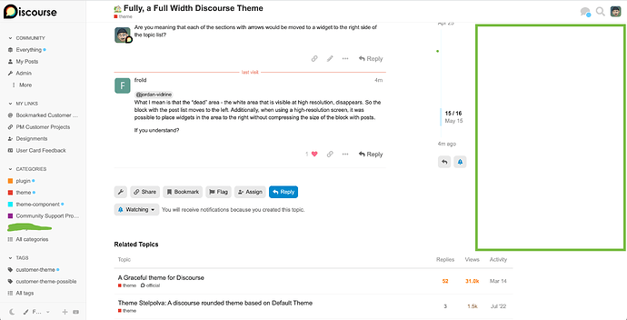](../../../assets/images/262833/effdac238685f0ce76acddf7545cf5f51d6b4a78.png "image")

This theme currently could possibly handle some widgets on the right hand side. With some tweaking you could also customize some of the CSS here to change widths if you want.

---

### Post #28 by [manuel](../../users/manuel.md)
*Posted: 2023-06-14 13:28*

The full-screen chat layout stretches to, well, full-screen. But it’s quite a lot of screen then …

[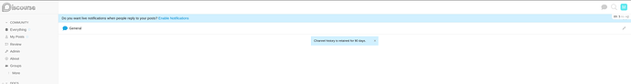](../../../assets/images/262833/cfceda1ef7f0f50b8ac72b5af73339f6afb3061a.png "image")

---

### Post #29 by [jordan.vidrine](../../users/jordan.vidrine.md)
*Posted: 2023-06-14 14:29*

This was intended in order to “mimic” other chat first sites.

---

### Post #30 by [rishabh](../../users/rishabh.md)
*Posted: 2023-06-15 04:40*

After using Fully for a couple of weeks (and loving it ), here are two things that popped up:

#### 1\. Chat indicator (online/green) isn’t visible when a row is selected

#### 2\. Is it possible to add the option to Show/Hide navigation menu?

I’ve often wanted to collapse the navigation menu to be able to focus on the main body of content in a topic, and also if I’m splitting screens vertically to find more screen space. This is more of a nice-to-have feature request so even a slightly hidden hover option could work.

---

### Post #31 by [jordan.vidrine](../../users/jordan.vidrine.md)
*Posted: 2023-06-15 11:32*

 rishabh:

> #### Is it possible to add the option to Show/Hide navigation menu?
> 
> 

Working on this this week actually, after more use, I agree that it should be available.

* * *

 rishabh:

> Chat indicator (online/green) isn’t visible when a row is selected

In regard to this, I tried to follow another chat services design implementation.

The thing I now realize is that the sidebar background is a darker/different color. So turning the green “online” circle to white when active make sense. I think for the fully theme the issue is that it is turning the same color as the sidebar background, and causing confusion.

I’ll look into changing this as well.

---

### Post #32 by [darkpixlz](../../users/darkpixlz.md)
*Posted: 2023-07-11 03:06*

This is just a small thing I noticed, but it’s present on my site and Meta - the “Move” link is now offcenter in the main section of the sidebar.

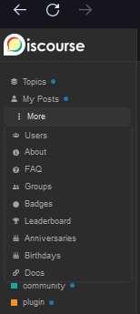

This is more of a small issue, but something that was bugging me a bit.

---

### Post #33 by [tgxworld](../../users/tgxworld.md)
*Posted: 2023-07-11 05:25*

Which theme do you happen to be using? On the default theme I see this:

---

### Post #34 by [darkpixlz](../../users/darkpixlz.md)
*Posted: 2023-07-11 05:37*

On Meta, I’m using Fully. I also saw it on [try.discourse.org](http://try.discourse.org), and I’m not sure if the theme is on there, I’m not using my PC anymore to check.

Update: The theme is indeed installed there and it’s off center too, probably a theme issue.  

[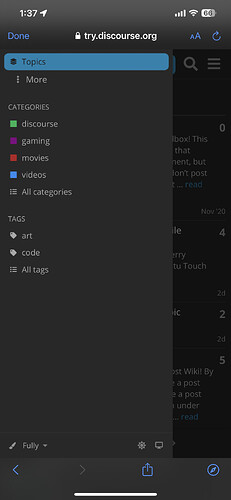](../../../assets/images/262833/02595d347850d0cbaf9584f32536b975e16a5a30.jpeg "IMG_7908")

---

### Post #35 by [darkpixlz](../../users/darkpixlz.md)
*Posted: 2023-07-11 17:12*

Seems to have been resolved [here](https://github.com/discourse/discourse-fully/commit/2f6ed2f29253c22e2bca178c2ef423f531b722c6), thanks!

---

### Post #36 by [jordan.vidrine](../../users/jordan.vidrine.md)
*Posted: 2023-07-11 19:24*

I pushed a fix today actually, thanks for reporting 😄

---

### Post #37 by [grahamperrin](../../users/grahamperrin.md)
*Posted: 2023-07-23 09:53*

### Posts

Can posts be wider?

Consider [Themes: too narrow - #2 by grahamperrin - Site Feedback - Practical ZFS](../../../assets/images/262833/253e8d67ab59c9e7ab282221a680aa3895e3c57b.png)

  * the _Unix Linux Community_ examples
  * the uppermost window in the screenshot.

Thanks

---

### Post #38 by [jordan.vidrine](../../users/jordan.vidrine.md)
*Posted: 2023-07-24 19:05*

I suggest doing this in a theme-component rather than me changing this theme’s post width for all of those using this theme.

---

### Post #39 by [twofoursixeight](../../users/twofoursixeight.md)
*Posted: 2023-08-01 21:47*

# issue with theme

When setting device to portrait mode then back to landscape and scrolling down, the post looks off when navigating forum

---

### Post #40 by [Canapin](../../users/Canapin.md)
*Posted: 2023-08-18 16:32*

On [try.discourse.org](http://try.discourse.org), hovering the theme selector on fully makes the text roughly the same color as the background:

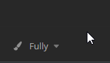

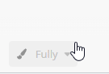

It only happens on Fully 🙂 🖌️

---

### Post #42 by [jordan.vidrine](../../users/jordan.vidrine.md)
*Posted: 2023-08-21 19:50*

Got a fix for this one in.

---

### Post #43 by [Jeff_Gilmore](../../users/Jeff_Gilmore.md)
*Posted: 2023-09-14 15:31*

Forgive me if this is obvious, but I don’t see a way to duplicate and edit the light color palette used by this theme.

When I look at the Colors section under customize, I see (among others) “Dark” which seems to go with this theme, but I don’t see one called “Light”.

The Theme shows “Light (default)”, but I don’t know how to clone and edit that.

Can you clarify for a poor noob? Thanks!

---

### Post #44 by [codergautam](../../users/codergautam.md)
*Posted: 2023-09-14 16:02*

Is there a way to remove the boxy profiles? We are used to the circle ones

---

### Post #45 by [jordan.vidrine](../../users/jordan.vidrine.md)
*Posted: 2023-09-14 19:13*

You dont see a “Light” theme in your Discourse customize colors section?

Can you send me a screenshot of what you are seeing?

---

### Post #46 by [jordan.vidrine](../../users/jordan.vidrine.md)
*Posted: 2023-09-14 19:13*

This is part of the theme, you’d need to override it with a custom theme component if you wish to do so.

---

### Post #48 by [manuel](../../users/manuel.md)
*Posted: 2023-09-16 07:59*

 Jordan Vidrine:

> You dont see a “Light” theme in your Discourse customize colors section?

I don’t see the default light scheme on any new instance, so this is not related to the theme.

To have the Light scheme on the colors section I’d need to add a new color scheme and then it’s suggested I base it on the default light scheme. But the Light scheme is not present on the colors section by default.

---

### Post #49 by [simon](../../users/simon.md)
*Posted: 2023-09-16 17:26*

 Manuel Kostka:

> I don’t see the default light scheme on any new instance,

That’s surprising. I wonder if it depends on the color scheme that’s selected when the site is first configured with the setup wizard. Here’s what I’m seeing on a Discourse site I created last week:

[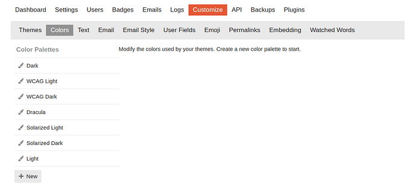](../../../assets/images/262833/630869fcd27729dda298d8a9c40dab32c3206ecf.png "image")

If anyone’s running into an issue with there _not_ being a Light color scheme, the method you’re describing should work to create one. Click the “New” button, then create a new color scheme based off the “default light” scheme.

---

### Post #50 by [codergautam](../../users/codergautam.md)
*Posted: 2023-09-17 23:30*

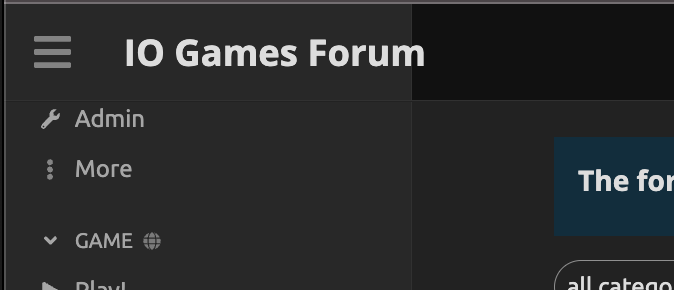  
The sidebar doesnt expand to fit the site text, is there a way to fix this?

---

### Post #51 by [codergautam](../../users/codergautam.md)
*Posted: 2023-09-17 23:34*

[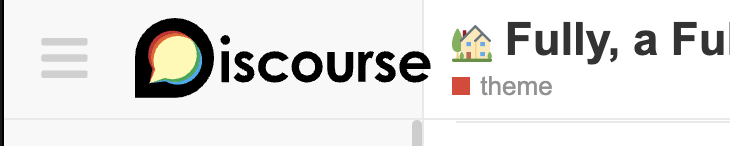](../../../assets/images/262833/a63a76e79d663e92928d037695097e5069af0606.png "image")

  
happens here too on some screen size

---

### Post #52 by [denvergeeks](../../users/denvergeeks.md)
*Posted: 2023-09-18 00:39*

Something here is wonky…

Go to this page and hit the hamburger menu to hide the sidebar…

 [Discourse Demo – 28 Jan 21](https://try.discourse.org/t/what-do-the-avatars-in-the-topic-list-mean/65 "08:04AM - 28 January 2021")

### [What do the avatars in the topic list mean?](https://try.discourse.org/t/what-do-the-avatars-in-the-topic-list-mean/65)

discourse

In the topic list, I see a list of anywhere from one to five avatar images next to each topic. Why are these 5 folks selected to appear here? Is it just the avatars of the last 5 people to post in the topic?

Reading time: 1 mins 🕑 Likes: 3 ❤

Here’s what I’m seeing…

[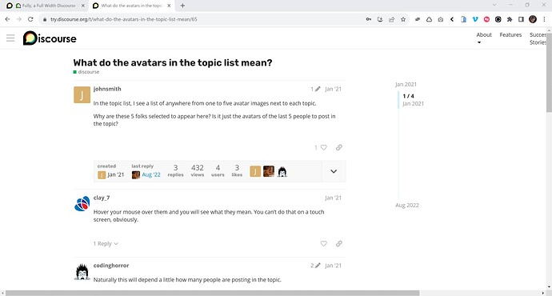](../../../assets/images/262833/ca3569ce02f38062858d77564628ed9509faee8d.jpeg "fully-over-full")

---

### Post #53 by [simon](../../users/simon.md)
*Posted: 2023-09-18 04:38*

 denvergeeks:

> Go to this page and hit the hamburger menu to hide the sidebar…

What surprised me was that the first time I tried that after selecting the “Fully” theme on Meta, the `try.discourse.org` topic was displayed with the Fully theme. I’m assuming that’s a caching issue related to the sites being on the same domain.

Is the issue you are pointing out that the Discourse logo isn’t being replace by the small logo when the hamburger menu is clicked on `try.discourse.org`?

---

### Post #54 by [denvergeeks](../../users/denvergeeks.md)
*Posted: 2023-09-18 04:59*

Hmm – The navigation panel on the [try.discourse.org](http://try.discourse.org) site includes an extra div with menu links (.try-header-nav-wrapper) that is breaking the page layout (just on that site) by pushing the header way out to the right when the side menu is hidden, so I see now it’s not a bug in the Fully theme.

[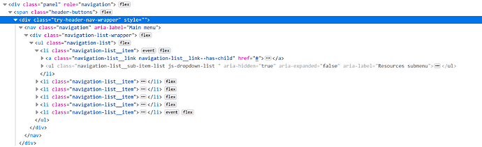](../../../assets/images/262833/880a963e0a2348dfa509b3985b834aa8880eade3.png "try-discourse-header-nav-bug")

---

### Post #55 by [Aaron_Walsh](../../users/Aaron_Walsh.md)
*Posted: 2023-10-04 09:58*

Good morning!

I really enjoy using this theme for my forum, but I’ve noticed that, like the default theme, there isn’t an option to customize the CSS/HTML. I would like to add a background wallpaper to the theme. Is it possible to do that?

---

### Post #56 by [jordan.vidrine](../../users/jordan.vidrine.md)
*Posted: 2023-10-04 19:11*

You could do this by using the customization theme / theme component menu to create a new theme component and add it to this theme.

In your theme component you can add the custom code to add your background.

---

### Post #57 by [Aaron_Walsh](../../users/Aaron_Walsh.md)
*Posted: 2023-10-04 19:26*

Hi [@jordan.vidrine](/u/jordan.vidrine),

Thank you for your response. I believe I saw this somewhere when I searched for “background change,” but I assumed it was only possible within customizing the CSS/HTML of the theme.

I will give this a try!

---

### Post #58 by [Renato_Mendes](../../users/Renato_Mendes.md)
*Posted: 2023-10-05 22:02*

Hey, guys! I love this theme! When previewing it on my site, though, I had an issue with the header of the sidebar navigation. Could just the header use a different color (the normal header color for the site)?

This:

Instead of this:

How can do that? Changing the CSS, the whole navigation got green.  
Thanks!

---

### Post #59 by [jordan.vidrine](../../users/jordan.vidrine.md)
*Posted: 2023-10-06 00:29*

You want to change the specific variable for `—sidebar-color)` and that will change the sidebar and above the sidebar.

---

### Post #60 by [Renato_Mendes](../../users/Renato_Mendes.md)
*Posted: 2023-10-07 03:59*

Hmmm there’s no way of changing just the sidebar header?

---

### Post #61 by [packman](../../users/packman.md)
*Posted: 2023-10-07 09:53*

 Jordan Vidrine:

> You want to change the specific variable for `—sidebar-color)` and that will change the sidebar and above the sidebar.

I have the same problem, with my header logo falling across two different colours which looks weird.

I thought that editing CSS in themes was discouraged these days? The CSS editor option has been removed for remote themes so how would we change that variable? That also assumes that we want the sidebar colour to be the same as the header.

---

### Post #62 by [Don](../../users/Don.md)
*Posted: 2023-10-07 10:26*

Hello, You can change that section separately from sidebar with CSS.

For this, you need to create a new component or add to an existing one. 

  1. Go to `/admin/customize/themes/`  
Customize → Themes

  2. Click the **Components** tab and then the `Install` button

  3. On the popup window click `Create new` button and type the new component name.  

[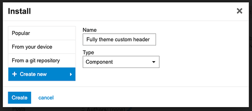](../../../assets/images/262833/5d07b8102f41794a62493dd111bf066f45b977da.png "Screenshot 2023-10-07 at 12.52.19")

  4. Click `Create` button.

  5. The component created. Now select Fully theme to activate it.  
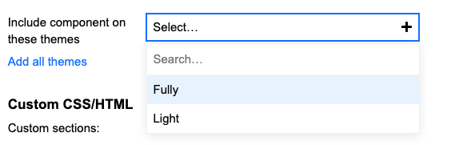

  6. Click the `Edit CSS/HTML` button.  
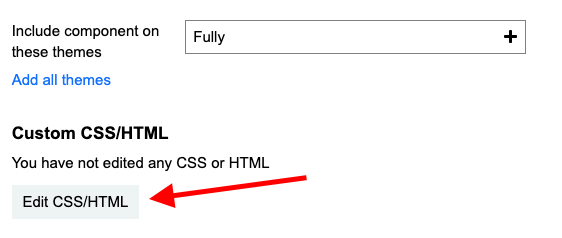

  7. Paste the below code to the **CSS** section.  
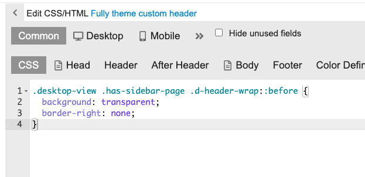

  8. Don’t forget to save it with the `Save` button at the bottom.

    
    
    .desktop-view .has-sidebar-page .d-header-wrap::before {
      background: transparent;
      border-right: none;
    }
    

If you want to keep the right side border then remove that line from code.

---

← Previous | **Page 1 of 2** | [Next →](262833-page-2.md)
