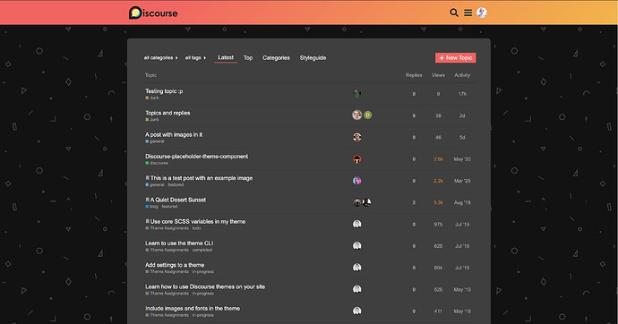
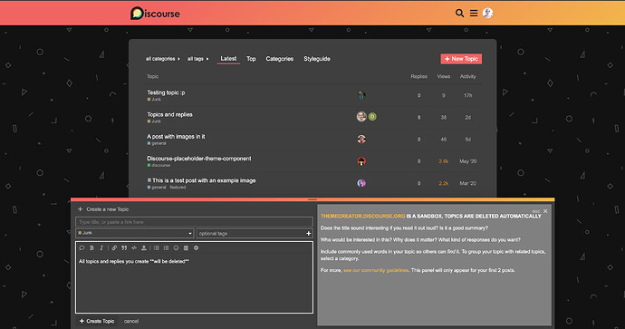
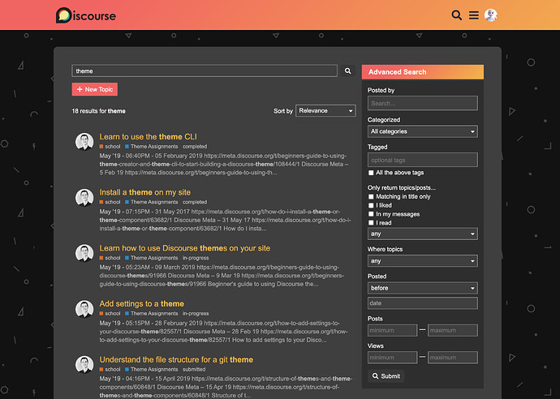
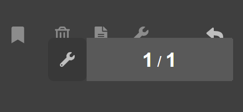
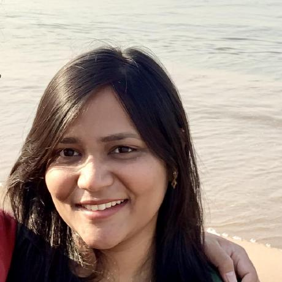
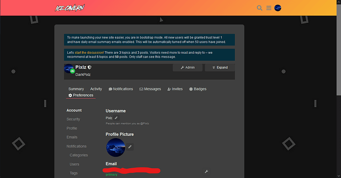
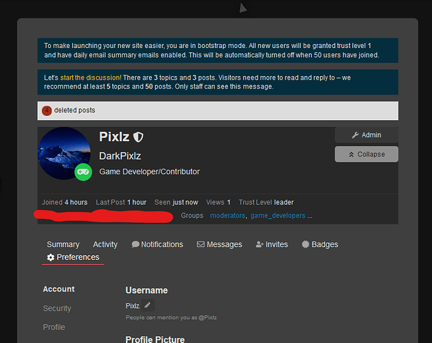
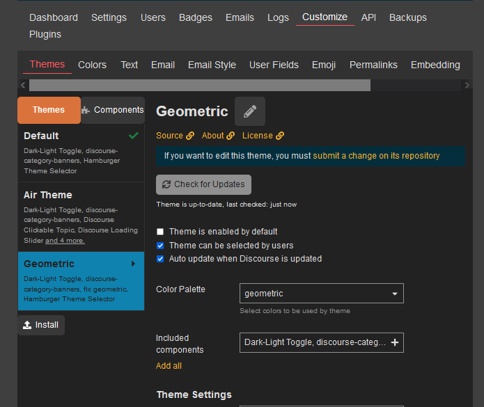
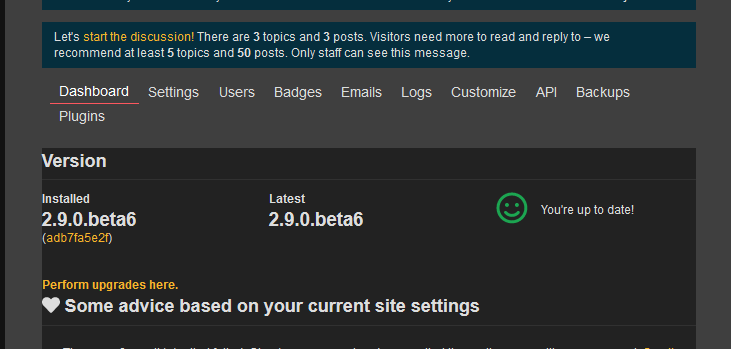

[🏠 Home](../../index.md) | [📋 Latest](../../latest/index.md) | [🔥 Top](../../top/replies/index.md) | [👥 Users](../../users/index.md)

[Home](../../index.md) » [Theme](../../c/theme/index.md) » Geometric, a dark theme for Discourse

---

# Geometric, a dark theme for Discourse

> **Category:** Theme
> **Author:** meghna
> **Created:** 2021-02-16 17:58

---

### Post #1 by [meghna](../../users/meghna.md)
*Posted: 2021-02-16 17:58*

This dark theme uses sunset gradient in header and a background with various geometric patterns. The topic container has minimal colors to highlight the content.

 🎨

Homepage:

Homepage with composer open:

Full page search:

Let me know how this theme can be further improved. Enjoy! 😃

|  |   
---|---|---  
😎 | **Preview** | [Preview on theme creator](https://theme-creator.discourse.org/theme/meghna/geometric)  
🔗 | **Github Repo** | [discourse-geometric-theme](https://github.com/meghnaAJ/discourse-geometric-theme)  
🛠️ | **Install Guide** | [How to install a theme or theme component](https://meta.discourse.org/t/how-do-i-install-a-theme-or-theme-component/63682)

---

### Post #2 by [ondrej](../../users/ondrej.md)
*Posted: 2021-02-17 16:18*

Lovely theme and thanks for your continuous contribution to Discourse!  
  
Just a little thing I noticed on mobile the topic admin wrench overlays the post actions.

---

### Post #4 by [meghna](../../users/meghna.md)
*Posted: 2021-02-18 17:15*

I just pushed a pushed a fix. 🙂

[github.com/MeghnaAJ/discourse-geometric-theme](https://github.com/MeghnaAJ/discourse-geometric-theme/commit/9e6e578946d681997b4ca5c89582efba8034a459)

####  [Remove extra margin from mobile devices](https://github.com/MeghnaAJ/discourse-geometric-theme/commit/9e6e578946d681997b4ca5c89582efba8034a459)

committed 05:11PM - 18 Feb 21 UTC

[ +0 -3 ](https://github.com/MeghnaAJ/discourse-geometric-theme/commit/9e6e578946d681997b4ca5c89582efba8034a459)

---

### Post #5 by [ondrej](../../users/ondrej.md)
*Posted: 2021-02-18 18:06*

Great! Thanks for the fix 😎

---

### Post #6 by [meghna](../../users/meghna.md)
*Posted: 2021-09-02 15:59*

I’ve updated this theme to allow custom background image.

[github.com/MeghnaAJ/discourse-geometric-theme](https://github.com/MeghnaAJ/discourse-geometric-theme/commit/10d0a7e944c45fb784105b9dd414e820abfa7f4b)

####  [FEATURE: theme setting to customize background image](https://github.com/MeghnaAJ/discourse-geometric-theme/commit/10d0a7e944c45fb784105b9dd414e820abfa7f4b)

committed 03:56PM - 02 Sep 21 UTC

[  MeghnaAJ ](https://github.com/MeghnaAJ)

[ +25 -3 ](https://github.com/MeghnaAJ/discourse-geometric-theme/commit/10d0a7e944c45fb784105b9dd414e820abfa7f4b)

---

### Post #7 by [Salome](../../users/Salome.md)
*Posted: 2021-09-14 22:18*

Thank you  

---

### Post #8 by [mognet](../../users/mognet.md)
*Posted: 2021-10-12 05:22*

Is this similar to Radiant theme?, looks great for dark mode.

---

### Post #9 by [meghna](../../users/meghna.md)
*Posted: 2021-10-18 09:29*

Not exactly similar to Radiant theme but it was largely inspired from the Radiant theme with some further additions.

---

### Post #10 by [jo-andre](../../users/jo-andre.md)
*Posted: 2022-01-25 23:10*

great theme! am i allowed to change the colors? if, how would i do that?

---

### Post #11 by [FunnySmile](../../users/FunnySmile.md)
*Posted: 2022-06-24 09:11*

It seems that the display is a little out of whack. After using the theme, the following theme is a little narrow

---

### Post #12 by [darkpixlz](../../users/darkpixlz.md)
*Posted: 2022-07-03 06:28*

The main outlet isn’t centering, and some things aren’t being colored  

  
Also it’s probably me being picky but the corners are a bit inconsistent 😅  

  
Somw things are also unchanged and dont look that good  

  

---

### Post #13 by [45thj5ej](../../users/45thj5ej.md)
*Posted: 2024-03-29 05:42*

Almost 2 full years later and the author dipped 😦

---
