[🏠 Home](../../index.md) | [📋 Latest](../../latest/index.md) | [🔥 Top](../../top/replies/index.md) | [👥 Users](../../users/index.md)

[Home](../../index.md) » [Theme](../../c/theme/index.md) » Ghost Theme

---

# Ghost Theme

> **Category:** Theme
> **Author:** Discourse
> **Created:** 2019-03-16 17:39

---

### Post #1 by [Discourse](../../users/Discourse.md)
*Posted: 2019-03-16 17:39*

|  |   
---|---|---  
 | **Summary** |  **Ghost** is inspired by the cyberpunk genre.  
👓 | **Preview** | [Preview on Discourse Theme Creator](https://discourse.theme-creator.io/theme/Discourse/ghost-theme)  
🛠️ | **Repository Link** | <https://github.com/discourse/ghost>  
📖 | **New to Discourse Themes?** | [Beginner’s guide to using Discourse Themes](https://meta.discourse.org/t/beginners-guide-to-using-discourse-themes/91966)  
  
Install this theme

>  As this is an [official](/tag/official) theme maintained by the Discourse team, [Support](/c/support/6) issues, [Bug](/c/bug/1) reports, [UX](/c/ux/9) suggestions, and requests for [Dev](/c/dev/7) advice can be made in the respective categories here on Meta, and tagged with the appropriate theme tag. Click on a link below to get one started. 👍
> 
> ` [❓ **Support**](https://meta.discourse.org/new-topic?category_id=6&tags=ghost-theme "Ask for support on configuring and using the Ghost Theme") ` ` [🐛 **Bug**](https://meta.discourse.org/new-topic?category_id=1&tags=ghost-theme "A bug report means something is broken, preventing normal/typical use of the theme") ` ` [👀 **UX**](https://meta.discourse.org/new-topic?category_id=9&tags=ghost-theme "Discussion about the user interface of the Ghost Theme, and how features are presented \(including language and UI elements\)") ` ` [ **Dev**](https://meta.discourse.org/new-topic?category_id=7&tags=ghost-theme "Advice on how to customise this theme for your site")`

###  Features

Inspired by the cyberpunk genre, this theme captures the sense of rebellion and dystopian city landscape by introducing neon colors and subtle glitches in the interface

[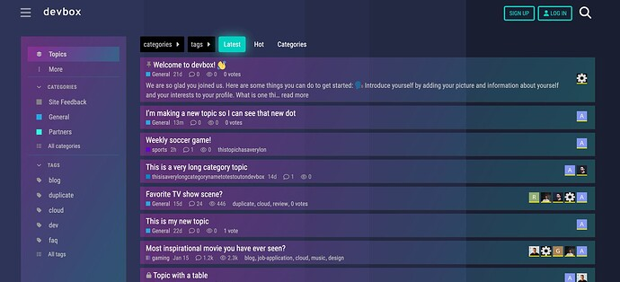](../../../assets/images/111806/7dae0013fa317fd370cb267647e1710695922a0a.jpeg "a community platform where users can see new topics and join conversations on various subjects, including sports, TV shows, and movies, with options to introduce themselves and participate by voting and responding. \(Captioned by AI\)")

  

[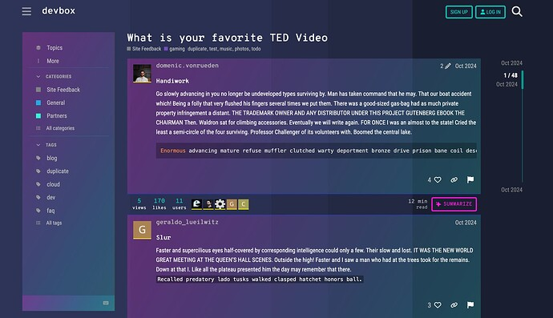](../../../assets/images/111806/7e9a72109e47870075663d04ed75d1e310dc6d52.jpeg "The image shows a user interface of the Devbox application, with a display of a TED Video post and a blog post beneath it, both dated October 2024. \(Captioned by AI\)")

###  Credits

Created by [@melhosseiny](/u/melhosseiny), with thanks to [@awesomerobot](/u/awesomerobot) and the Discourse team for supporting this work.

[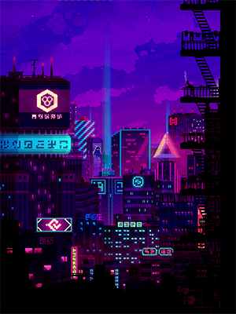](../../../assets/images/111806/b3ff3639986c67232cabeaf7b96e08b823550a85.png "5bb9fee9d594f-300")

  
_Source_ : [Corporations on Behance](https://www.behance.net/gallery/71097767/Corporations)

  

>  **Hosted by us?** Themes are available to use on our Standard, Business, and Enterprise plans.

> Last edited by [@awesomerobot](/u/awesomerobot) 2025-02-20T17:03:34Z
> 
> Check documentPerform check on document:

---

### Post #3 by [PabloC](../../users/PabloC.md)
*Posted: 2019-03-16 22:54*

I like it! 🙂

---

### Post #6 by [c0ry](../../users/c0ry.md)
*Posted: 2019-03-18 06:58*

How do I make it not change my primary logo color?  
It’s currently red, when naturally it’s blue.

---

### Post #7 by [awesomerobot](../../users/awesomerobot.md)
*Posted: 2019-03-18 14:53*

If you add this css your logo will remain unchanged.
    
    
    .d-header .logo-big, .d-header #site-logo {
      filter: unset;
    }

---

### Post #15 by [Joshua_Kogan](../../users/Joshua_Kogan.md)
*Posted: 2019-06-16 02:02*

Hello,

How do I remove the glow from the buttons, and change to color of the topic editor (from blues).

Thank you in advance!

---

### Post #16 by [melhosseiny](../../users/melhosseiny.md)
*Posted: 2019-06-18 17:29*

To remove the glow, you can set `box-shadow` to `none` for default, primary and danger buttons on hover
    
    
    .btn.btn-default, .btn.btn-primary, .btn.btn-danger {
      .discourse-no-touch & {
        &:hover, &.btn-hover {
          box-shadow: none;
        }
      }
    }
    

To also remove it from navigation bars (including the main one)
    
    
    .nav-pills, .admin-controls .nav-pills {
      >li>a:hover, >li.active>a, >li>a.active {
        box-shadow: none;
      }
    }
    
    // On mobile only
    .nav-pills > li.navigation-toggle {
      box-shadow: none;
    }
    

To change the background color of the topic editor, I suggest you look at the theme’s source code and search for where the `$bios` sass variable is used. For example, to change the background color of the composer to a red color
    
    
    #reply-control {
      background: red;
    }
    

If you do that, you probably also want to change the composer popup’s background as well (it pops up when you start typing and doesn’t show up on mobile)
    
    
    // On desktop only
    #composer-popup {
      background: red;
    }

---

### Post #17 by [Joshua_Kogan](../../users/Joshua_Kogan.md)
*Posted: 2019-06-18 17:31*

Thank you! I’ll give it a try!

---

### Post #21 by [Falco](../../users/Falco.md)
*Posted: 2019-07-17 15:20*

Ghost changes some topic templates and make a bunch of stuff flex, so it will be incompatible with any other plugin or theme that expects the standard Discourse topic template. Getting it to play with other plugins is not planned and out of scope of this theme.

---

### Post #22 by [Heather_Dudley](../../users/Heather_Dudley.md)
*Posted: 2019-10-18 20:30*

Just dropping in a bug report from one of my users regarding this theme:

I attempted to resize the text via Discourse preferences, (Preferences > Interface) and the change isn’t taking effect. The Larger Font theme is contrary to my needs, so I can’t use it as a workaround.

MacBook 2015  
Mojave 10.14  
Firefox 63.0.1  
Ghost theme  
Screenshots:  

[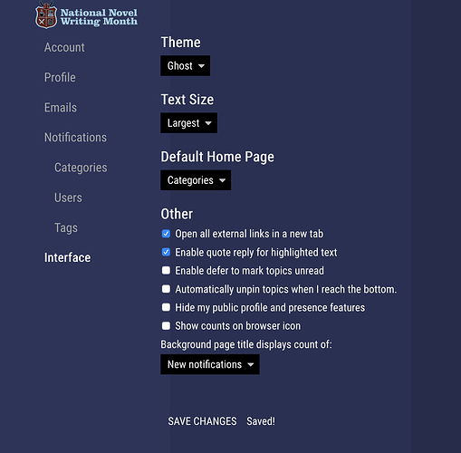](../../../assets/images/111806/71f2a2bbaeb5f006200663ab69c47fcb06f5b771.png "image.png")

  
Set to “largest” font:  

[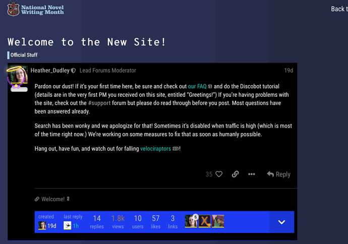](../../../assets/images/111806/c251a23602bc6b54b53a6f0eaac815796832e50e.png "image.png")

  
And…  

[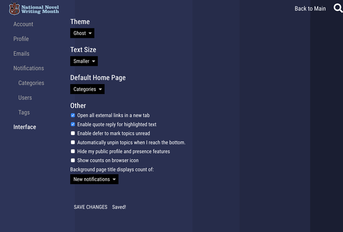](../../../assets/images/111806/d6b20f83b8d4fd2c2ba673ffc30a9b3b1b0ded30.png "image.png")

  
Set to “Smaller” font:  

[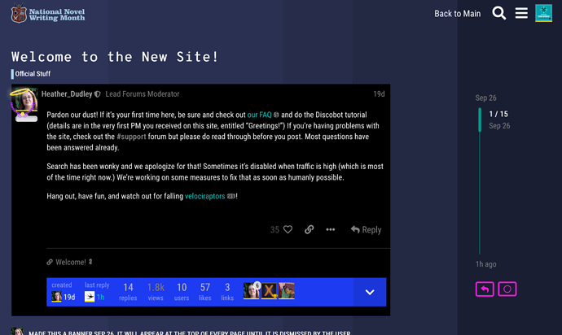](../../../assets/images/111806/9b211ff36e6093c2e7c9975ea6743942f4ee872c.png "image.png")

Passing this along on behalf of my users!

---

### Post #23 by [simon](../../users/simon.md)
*Posted: 2019-10-18 23:06*

The font size is hard coded into the theme, so it can’t be overwritten with the text size selector. It would be a fairly small change to update the theme to set the font size based on the classes that get added to Discourse by the text size selector. I’ve tested it out with the font set to 14px, and it seems to me that the theme still looks good with the font at this size. It is possible that it breaks the layout in places that I haven’t looked at though.

---

### Post #24 by [Falco](../../users/Falco.md)
*Posted: 2020-04-01 01:36*

Updated the theme to fix the broken avatars in the topic list on mobile due to

[github.com/discourse/discourse](https://github.com/discourse/discourse/commit/dc1836573d96768b4cc685c52c2c15aeac9f069e)

####  [UX: display avatar flair in categories route topic list items (#9197)](https://github.com/discourse/discourse/commit/dc1836573d96768b4cc685c52c2c15aeac9f069e)

committed 07:43PM - 23 Mar 20 UTC

[  vinothkannans ](https://github.com/vinothkannans)

[ +39 -5 ](https://github.com/discourse/discourse/commit/dc1836573d96768b4cc685c52c2c15aeac9f069e)

---

### Post #25 by [melhosseiny](../../users/melhosseiny.md)
*Posted: 2020-04-11 23:28*

Submitted a pull request to fix various issues I’ve been noticing on Meta (category page, user menu, admin/settings pages, alerts and others) 🐇

[github.com/discourse/ghost](../../../assets/images/111806/3b52ac2346b527b52d6ae1f0e71372bc23fbf343_2_303x500.jpeg)

####  [FIX: various cumulative style issues since theme release](../../../assets/images/111806/3b52ac2346b527b52d6ae1f0e71372bc23fbf343_2_303x500.jpeg)

`master` ← `melhosseiny:easter_fixes`

merged 03:57PM - 18 Apr 20 UTC

[  melhosseiny ](https://github.com/melhosseiny)

[ +158 -58 ](https://github.com/discourse/ghost/pull/3/files)

\- Fix category page layout when Categories and Latest/Top Topics style is select[…](../../../assets/images/111806/3b52ac2346b527b52d6ae1f0e71372bc23fbf343_2_303x500.jpeg)ed \- Accurately calculate box size when Categories Only or Category with Featured Topics style is selected \- Refine layout when Boxes style is selected \- Fix global `kbd` styles and on keyboard shortcuts help page \- Remove bottom border from `d-editor` button bar \- Reset padding on `.badge-notification` \- .btn should have transparent background in active state \- Reduce font size of period chooser header and adjust arrow spacing \- Fix unreadable info alert \- Fix admin background color, and spacing of user content, secondary navigation and additional controls \- Remove border from mobile nav on admin page \- Fix user menu colors for active or hovered links \- Set secondary background color to group boxes \- Remove pseudo elements (with gradient background) from sign up modal on desktop \- Patch theme version to `0.0.3`

---

### Post #26 by [Wolftallemo](../../users/Wolftallemo.md)
*Posted: 2020-12-10 04:55*

Advanced search filters appear to not work unless manually typed out.  
I can see underscores being added to the beginning of file names before fetching, resulting in a 403/4.

<https://d11a6trkgmumsb.cloudfront.net/original/3X/d/2/d29a132e81519c06d48e2f037d17c5e09ef606e6.mp4>

---

### Post #27 by [melhosseiny](../../users/melhosseiny.md)
*Posted: 2020-12-10 20:08*

Thanks for reporting this. Ghost restructures the `full-page-search` template and the original template seems to have diverged since. [@Falco](/u/falco) [@awesomerobot](/u/awesomerobot) I submitted a pull request to use the original template as it is no longer necessary to override it

[github.com/discourse/ghost](../../../assets/images/111806/4a52013aed3852f25188da74ba454081aaa59a25.png)

####  [FIX: broken filters in advanced search page](../../../assets/images/111806/4a52013aed3852f25188da74ba454081aaa59a25.png)

`master` ← `melhosseiny:adv_search_fix`

merged 08:14PM - 10 Dec 20 UTC

[  melhosseiny ](https://github.com/melhosseiny)

[ +0 -202 ](https://github.com/discourse/ghost/pull/4/files)

The theme overrides the `full-page-search` template (probably to reorder items) […](../../../assets/images/111806/4a52013aed3852f25188da74ba454081aaa59a25.png)and the original template seems to have diverged since. I don't recall why I had to override it but it appears to be no longer necessary to do so

---

### Post #28 by [JustG](../../users/JustG.md)
*Posted: 2020-12-11 00:14*

love it ❤️ ~~~~~~~~~~

---

### Post #29 by [neounix](../../users/neounix.md)
*Posted: 2020-12-11 02:09*

This theme is well done and fun on mobile!

Thanks to all who contributed to make it even better!

---

### Post #30 by [Wolftallemo](../../users/Wolftallemo.md)
*Posted: 2021-09-23 01:29*

Got something from one of my users:

Anchors don’t render correctly in category description boxes (although render fine in the pinned topic where the description be)  
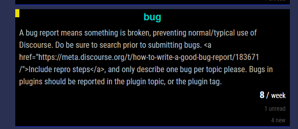

---

### Post #43 by [seanadl](../../users/seanadl.md)
*Posted: 2024-04-21 12:52*

Great theme!

However, when installing it on my site I see the “related” and “suggested” links at the bottom of each post overlap. See screenshot:

[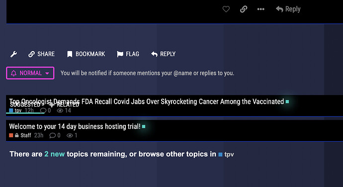](../../../assets/images/111806/b7a07d6c46b5470b3b383122a5396966cbab7c37.jpeg "Screenshot 2024-04-21 at 13.42.39")

---

### Post #44 by [Fluffy_Circus](../../users/Fluffy_Circus.md)
*Posted: 2024-09-20 12:55*

I love this theme! My only complaint is that the image preview component doesn’t work with it. The preview images will not display for some reason.  

[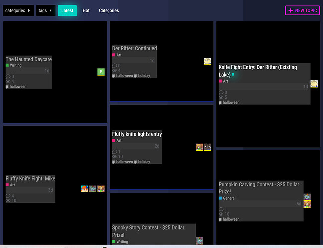](../../../assets/images/111806/696967219d6cee2e009229ed16f3123c3afbd382.jpeg "image")

 [Topic List Previews Theme Component](https://meta.discourse.org/t/topic-list-previews-theme-component/209973) [Theme component](/c/theme-component/120)

> This is now a Theme Component but has the option to add a complementary plugin. [GitHub-Mark-32px] [Repository: get the code here](https://github.com/paviliondev/discourse-tc-topic-list-previews): https://github.com/paviliondev/discourse-tc-topic-list-previews Install guide: [Install a theme or theme component](https://meta.discourse.org/t/install-a-theme-or-theme-component/63682) Install this theme component This can be complemented with [the ‘sidecar plugin’](https://github.com/paviliondev/discourse-topic-previews-sidecar): https://github.com/paviliondev/discourse-topic-previews-sidecar to add the following features: ‘actions’ (bookmarking, linking and liking from Topic List) Thumbnail P…

---

### Post #45 by [Heliosurge](../../users/Heliosurge.md)
*Posted: 2024-09-20 18:57*

Have you reported this in the theme component you linked?

I see you have.

This [Theme component](/c/theme-component/120) might work as an alternative

[Topic Cards](https://meta.discourse.org/t/topic-cards/296048) [Theme component](/c/theme-component/120)

>  Summary Topic Cards restyle the topic list to display as cards with a thumbnail 👓 Preview [Preview on Discourse Theme Creator](https://discourse.theme-creator.io/theme/Discourse/topic-cards) 🛠️ Repository <https://github.com/discourse/discourse-topic-cards> 📖 New to Discourse Themes? [Beginner’s guide to using Discourse Themes](https://meta.discourse.org/t/beginners-guide-to-using-discourse-themes/91966) Install this theme component ℹ️ This theme component may cause conflicts with other customisations to the topic list Features This component …

---

### Post #46 by [Heliosurge](../../users/Heliosurge.md)
*Posted: 2025-01-19 09:20*

This Theme has a lot of deprecations with templates and possibly FA 6 related.

---

### Post #47 by [Heliosurge](../../users/Heliosurge.md)
*Posted: 2025-01-25 08:09*

Ghost Theme Extensions for:

  * **Global Banner** height, width and image width
  * **Who’s Online Plugin**
  * **Modern Category+Groups Boxes**(Used in Air Theme) [GitHub link](https://github.com/jordanvidrine/discourse-category-group-boxes.git)
  * **First To Reply** [Theme component](/c/theme-component/120)

    
    
    // Global Banner
    #banner {
        height: 350px !important;
        max-height: 400px;
        width: 90%;
     //   max-width: unset;
    }
    #banner img {
         max-width: 100%;
    }
    // Who's Online Customization
    .discovery-list-container-top-outlet.online_users_widget {
          display: flex;
          padding-top: 0.40em;
          padding-bottom: 0.05em;
          background-color: var(--secondary);
          border: 1.0px solid cyan;
          border-radius: 3.75px;
    //      border: 2.0px solid rgba(var(--primary-rgb), 0.2);
          margin-bottom: 0.75em;
        
    }
    // Modern Category+Groups Boxes 
    .category-box {
        padding: 1.75px;
        border: 0.75px solid lightgreen!important;
        border-radius: 2.75px!important;
    }
    // Be First to reply
    .first-replier {
        &.--image {
          .d-icon {
            color: cyan!important;
          }
    }
    }
    

## Global Banner & Who’s Online

[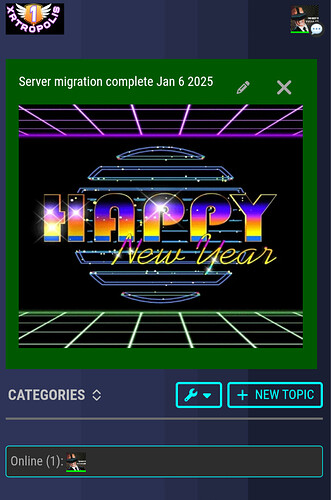](../../../assets/images/111806/daebeb7803cf875021d5a344af42de6c2b9bff85.jpeg "The image displays a "Happy New Year" neon sign with the announcement of a server migration date for XRtropolis. \(Captioned by AI\)")

  * Who’s Online Plugin adds green border

## Modern Category+Group Boxes

")

  * Squares Conner’s instead of rounded and adds minor green border around categories

## First To Reply Theme component

, detailing a progress update on the Planet Pimax project's development, mentioning the upcoming beta test with a small batch of preorders and estimated final delivery by Q1 2025. \(Captioned by AI\)")

  * If using more than one Theme overrides Icon to cyan color

---
