[🏠 Home](../../index.md) | [📋 Latest](../../latest/index.md) | [🔥 Top](../../top/replies/index.md) | [👥 Users](../../users/index.md)

[Home](../../index.md) » [Theme](../../c/theme/index.md) » Glacier Theme

---

# Glacier Theme

> **Category:** Theme
> **Author:** ばこん
> **Created:** 2025-11-08 16:46

---

### Post #1 by [ばこん](../../users/ばこん.md)
*Posted: 2025-11-08 16:46*

|  |   
---|---|---  
ℹ️ | **Summary** | Glacier Theme is a modern theme that supports dark mode.  
👓 | **Preview** | [Theme Creator](https://discourse.theme-creator.io/theme/user36/glacier-theme)  
🛠️ | **Repository** | [GitHub - Kaisan10/Glacier-Theme: Discourse Theme](https://github.com/Kaisan10/Glacier-Theme)  
❓ | **Install Guide** | [How to install a theme or theme component](https://meta.discourse.org/t/how-do-i-install-a-theme-or-theme-component/63682)  
📖 | **New to Discourse Themes?** | [Beginner’s guide to using Discourse Themes](https://meta.discourse.org/t/beginners-guide-to-using-discourse-themes/91966)  
  
Glacier Theme is a modern theme that supports dark mode.

## light mode

[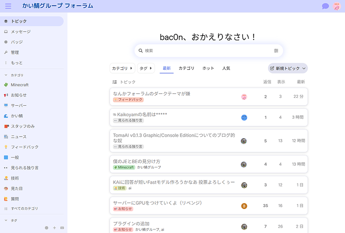](../../../assets/images/387941/7c822b72b0e20939ff11345c8fb273fcfeb2ecb8.png "image")

## dark mode

[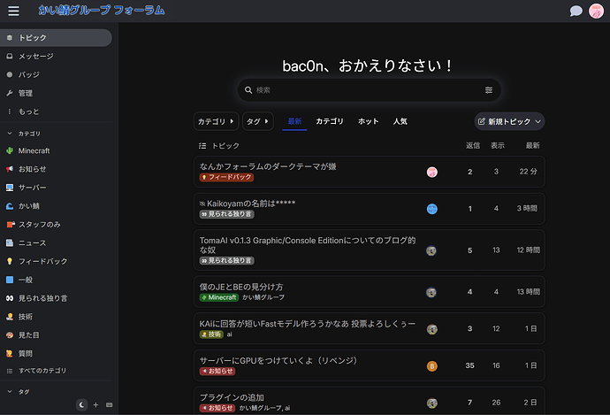](../../../assets/images/387941/5f85c31c8c4c348f4df6e2fd9f59a8e11f98796e.png "image")

It is still under development and the design may change significantly with updates.  
This theme was inspired by the Horizon theme.

---

### Post #2 by [祁同伟](../../users/祁同伟.md)
*Posted: 2025-11-09 09:56*

There is a large empty space between the topic and time navigation, which we hope can be optimized.

---

### Post #3 by [ばこん](../../users/ばこん.md)
*Posted: 2025-11-09 14:15*

Thank you for your request! I realize it’s probably difficult to see as is, so I’ll fix it tomorrow. (I’m going to sleep now.)

---

### Post #4 by [Canapin](../../users/Canapin.md)
*Posted: 2025-11-09 14:32*

I like the theme, but the full-width is too large for high resolution and wide screens:

[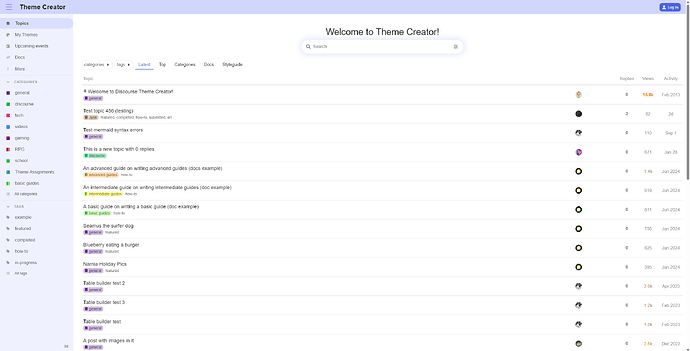](../../../assets/images/387941/be4166f4f3576e0da611b587617afadac9770c9b.png "image")

When viewing a post, having all the main content off-center is a bit weird:

[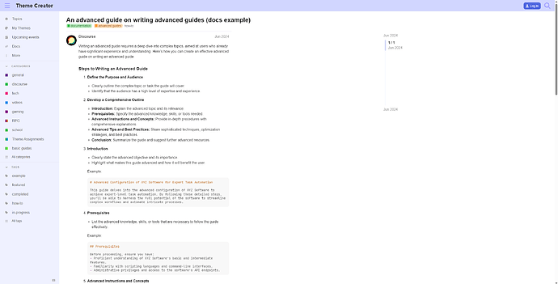](../../../assets/images/387941/f8765c100b5e375674c9c847bebbb2337689130b.png "image")

---

### Post #5 by [DevTeVe](../../users/DevTeVe.md)
*Posted: 2025-11-09 19:23*

Excellent theme, I really love it!

---

### Post #6 by [ばこん](../../users/ばこん.md)
*Posted: 2025-11-10 08:20*

Corrected the issue of excessive overall width!  

[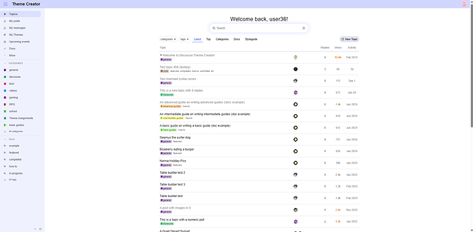](../../../assets/images/387941/4eeeedd52c4ac6436ec08320008bcf1b145af63f.png "image")

---

### Post #7 by [DevTeVe](../../users/DevTeVe.md)
*Posted: 2025-11-11 23:03*

Awesome!!!

There’s a new bug report though… Only seems to happen on safari for mobile devices, there’s added borders that make it hard to actually use it nicely. Doesn’t seem to happen on other devices. It’s also replicable on MacOS, so it’s a safari thing.

[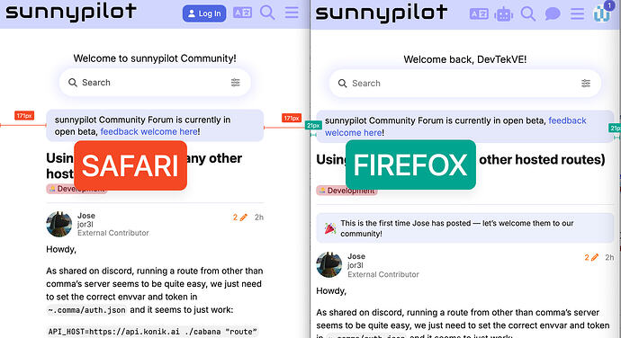](../../../assets/images/387941/d921876fb42d3b534329e06c16ced0a51257240a.jpeg "image")

**edit:**  
I am told that

> Chrome Android is also the same. Not just Safari

---

### Post #8 by [ばこん](../../users/ばこん.md)
*Posted: 2025-11-12 06:50*

Corrected!  

[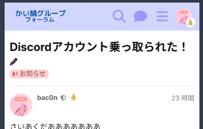](../../../assets/images/387941/1621c1c3af30b2b2cb622eeee3d90ed74f623e76.png "image")

---

### Post #9 by [Ngoc_Nguyen](../../users/Ngoc_Nguyen.md)
*Posted: 2025-11-12 07:02*

Hi, i just updated the theme, but it does not solve the issue, the 2 spacings are too wide

[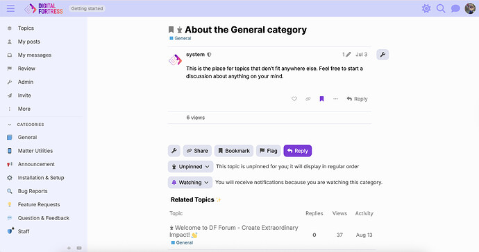](../../../assets/images/387941/0fb7b8ecd9c3a3e33b0dd1be7a3d878e3673fdc3.jpeg "image")

---

### Post #10 by [ばこん](../../users/ばこん.md)
*Posted: 2025-11-12 07:34*

To improve visibility on desktops, we’ve added some spacing. Would you like the option to adjust this in the settings?

---

### Post #11 by [Ngoc_Nguyen](../../users/Ngoc_Nguyen.md)
*Posted: 2025-11-12 07:40*

Yeah, it’s great if I can adjust it!!

---

### Post #12 by [asa](../../users/asa.md)
*Posted: 2025-11-12 10:07*

It would be very good if it could be adjusted. Currently, I have too much space on my 21:9 screen.

---

### Post #13 by [ばこん](../../users/ばこん.md)
*Posted: 2025-11-12 10:50*

I’ve made it configurable in the settings! Please give it a try.

Edit: I regret to inform you that per-user configuration is not supported.

---

### Post #14 by [DevTeVe](../../users/DevTeVe.md)
*Posted: 2025-11-12 12:57*

Excellent! I can confirm that issue is no longer present <3 awesome work as always!!

Another bug reported is that the “chat” input disappears when you type and hide the keyboard once (and in my video you basically can see the input dissappears even when i type)

only seems to happen when welcome banner is in use.  

[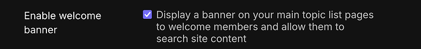](../../../assets/images/387941/27e3dc040a3cac8109a2eaf8a3e7fc87ae049b1f.png "image")

Comparing it with Horizon Theme, I see that the welcome banner is not visible on my phone, could it be that the problem?

---

### Post #15 by [ばこん](../../users/ばこん.md)
*Posted: 2025-11-12 13:35*

I’ve tested this on my systems (Windows, Android) and haven’t encountered the issue. It may be isolated to iOS.

---

### Post #16 by [DevTeVe](../../users/DevTeVe.md)
*Posted: 2025-11-12 14:26*

Android was seen too, but you need the welcome banner enabled , see how on the video you see the “welcome back, search” box ? In foundation I don’t have that when on mobile

---

### Post #17 by [ばこん](../../users/ばこん.md)
*Posted: 2025-11-12 14:33*

I’m having trouble reproducing the issue with the welcome banner in my environment. Could you please provide the steps you took to reproduce it?

---

### Post #18 by [DevTeVe](../../users/DevTeVe.md)
*Posted: 2025-11-12 17:41*

I’ve reached out on a private message with a link to invite you to the forum so you can take a look if you want

---

### Post #19 by [ばこん](../../users/ばこん.md)
*Posted: 2025-11-13 11:17*

The issue has been resolved! Please update and try again.  
Let me know if any problems arise.

---

### Post #20 by [DevTeVe](../../users/DevTeVe.md)
*Posted: 2025-11-13 18:00*

Excellent! completely resolved!

---

### Post #21 by [ばこん](../../users/ばこん.md)
*Posted: 2026-01-11 07:32*

I’ve substantially revised the design of the topic!  
What are your thoughts?  

[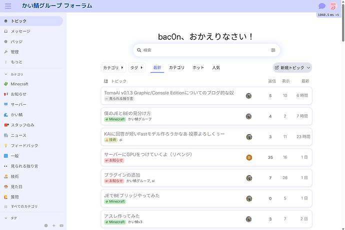](../../../assets/images/387941/c4ffdffaa5d6fcba617225f17e90179f854d643b.png "image")

---

### Post #22 by [祁同伟](../../users/祁同伟.md)
*Posted: 2026-01-12 02:52*

### Adjusting Left-and-right-margins has no effect now

---

### Post #23 by [ばこん](../../users/ばこん.md)
*Posted: 2026-01-12 08:59*

My apologies!  
I have rectified the issue.

[github.com/Kaisan10/Glacier-Theme](https://github.com/Kaisan10/Glacier-Theme/commit/ca7b302083fe123746863cfb302a45eb595ff112)

####  [Update common.scss](https://github.com/Kaisan10/Glacier-Theme/commit/ca7b302083fe123746863cfb302a45eb595ff112)

コミット済み 08:57AM - 12 Jan 26 UTC

[ 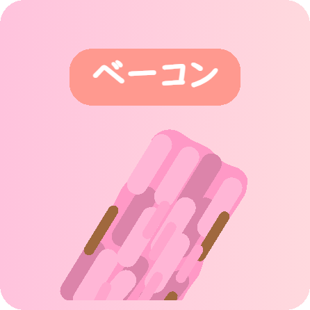 Kaisan10 ](https://github.com/Kaisan10)

[ +1 -1 ](https://github.com/Kaisan10/Glacier-Theme/commit/ca7b302083fe123746863cfb302a45eb595ff112)

---

### Post #24 by [ばこん](../../users/ばこん.md)
*Posted: 2026-01-27 10:00*

The mobile version now mirrors the desktop experience in appearance!  

[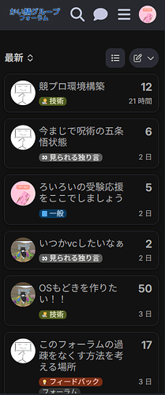](../../../assets/images/387941/cce3cfabc4819bbfe437ca53f8f2e9748080dc16.png "image")

---

### Post #25 by [祁同伟](../../users/祁同伟.md)
*Posted: 2026-01-27 10:28*

Hello, could you add an option to place the “Create New Topic” button in the upper left corner (like in Horizon)?

---

### Post #27 by [ばこん](../../users/ばこん.md)
*Posted: 2026-01-27 10:52*

[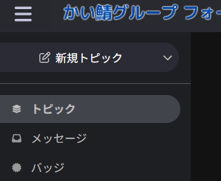](../../../assets/images/387941/24a1ac8865ab1ae02b0399a5e39a57f1ad3a06a8.png "image")

  
How does something like this strike you? (Not yet implemented).

---

### Post #28 by [祁同伟](../../users/祁同伟.md)
*Posted: 2026-01-27 10:56*

Yes, that’s the effect. Thank you very much for your hard work! 

---

### Post #29 by [ばこん](../../users/ばこん.md)
*Posted: 2026-01-27 13:22*

I am currently in the process of implementing this, but I may be delayed due to unforeseen complexities. I apologize for any inconvenience.

---

### Post #30 by [ばこん](../../users/ばこん.md)
*Posted: 2026-01-28 12:46*

I extend my apologies for the delay!  
The implementation is now complete and available for activation via the settings.  
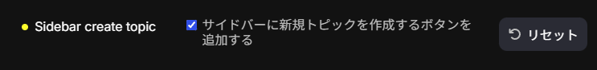  

[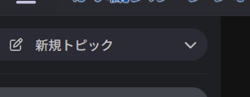](../../../assets/images/387941/5d8dcc9b6d344f950db21830b71b3826dcbba250.png "image")

Please excuse the Japanese text in the images.

---

### Post #31 by [祁同伟](../../users/祁同伟.md)
*Posted: 2026-02-01 09:58*

Thank you for your efforts.  
Currently, there are three bugs/requests:

  1. When checking “Show new topics” in the upper left, could the “New Topic” button in the upper right be hidden only on the desktop version (while remaining visible on the mobile version)?
  2. I would like to add a setting item to the front end so that the button text can be freely changed (or, for Chinese i18n support, I would like “新建话题” translated as “新規トピック”).
  3. When viewing a topic, pressing “New Topic” does not open the posting screen.

---

### Post #32 by [ばこん](../../users/ばこん.md)
*Posted: 2026-02-01 12:19*

I’ve implemented #1 and #2! I’m currently fixing #3.

---

### Post #33 by [ばこん](../../users/ばこん.md)
*Posted: 2026-02-05 12:50*

Sorry for the wait!!! We’ve fixed it!!!  

[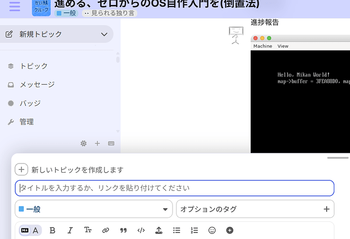](../../../assets/images/387941/724fad0852927710c01e1e963d95457ce7d70fa0.png "image")

---

### Post #34 by [ばこん](../../users/ばこん.md)
*Posted: 2026-02-27 11:47*

It’s a small tweak, but we’ve subtly changed the shadow color of the topic list when in light mode.

* * *

Before modification  
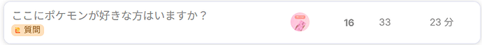

After modification  
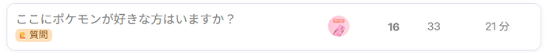

---
