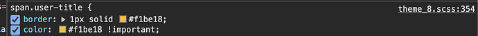
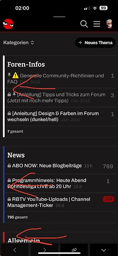
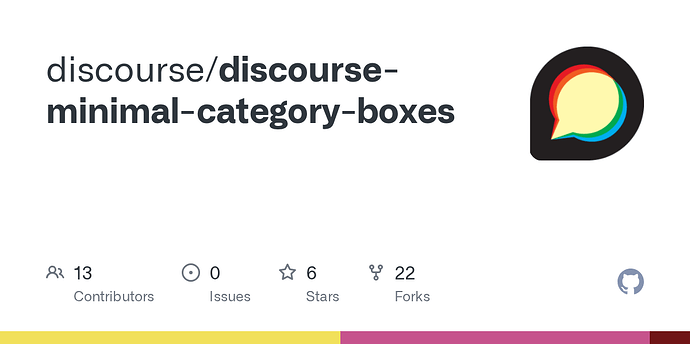

[🏠 Home](../../index.md) | [📋 Latest](../../latest/index.md) | [🔥 Top](../../top/replies/index.md) | [👥 Users](../../users/index.md)

[Home](../../index.md) » [Theme](../../c/theme/index.md) » Graceful Theme

---

# Graceful Theme (Page 2 of 2)

> **Category:** Theme
> **Author:** GoldenSound
> **Created:** 2018-07-24 20:09

[← Previous](93040.md) | **Page 2 of 2** | Next →

---

### Post #151 by [GoldenSound](../../users/GoldenSound.md)
*Posted: 2025-02-17 17:38*

It seems like the reason for issue 1 is that the theme already has an !important tag on the user title color

Given as we aren’t able to edit the HTML/CSS for this theme is there any way to change or override this?
  *[PR]: Pull Request

---

### Post #152 by [danvanmoll](../../users/danvanmoll.md)
*Posted: 2025-04-27 12:55*

Hello!

Vertical color bars are still not showing up on my forum’s mobile version. Am I missing sth?

 [Two Geeks One Cup](https://forum.twogeeksonecup.wtf)

### [Two Geeks One Cup](https://forum.twogeeksonecup.wtf)

Das weltbeste Forum des weltbesten True Nerd Podcasts!

Thx!  
Dan
  *[PR]: Pull Request

---

### Post #153 by [Heliosurge](../../users/Heliosurge.md)
*Posted: 2025-05-01 23:59*

Can you provide a pic detailing where these vertical bars would be?

Nice forum btw
  *[PR]: Pull Request

---

### Post #154 by [danvanmoll](../../users/danvanmoll.md)
*Posted: 2025-05-02 00:03*

Thanks!

I’ve attached a screenshot from another forum that actually has these bars.

")

Basically the same bars that show on the desktop version.
  *[PR]: Pull Request

---

### Post #155 by [Heliosurge](../../users/Heliosurge.md)
*Posted: 2025-05-02 00:07*

You’re very welcome.

Okay was taking a look here on Meta with Graceful theme selected. On mobile for some reason there are no colored bars like in desktop. I myself am not sure why.

Though on desktop in the sidebar switch it to mobile view and should be able to use inspect element. I would also check on desktop mode and see how the CSS differs. If needed can likely create a custom component with overrides in Mobile to get the colored bars working as expected.
  *[PR]: Pull Request

---

### Post #156 by [danvanmoll](../../users/danvanmoll.md)
*Posted: 2025-05-02 00:09*

Thanks! I appreciate it. Since other users had already reported the issue earlier in this thread, I was hoping for a more permanent fix that would hold even after future updates to Grace.
  *[PR]: Pull Request

---

### Post #157 by [Heliosurge](../../users/Heliosurge.md)
*Posted: 2025-05-02 00:16*

Most ghr be an idea to post this as a [Bug](/c/bug/1) using tag [ux](/tag/ux) & [graceful-theme](/tag/graceful-theme)

As that may help with visibility.

Alternatively this theme component adds a nice category view. It is used in the Air Theme.

[github.com](https://github.com/discourse/discourse-minimal-category-boxes)

### [GitHub - discourse/discourse-minimal-category-boxes](https://github.com/discourse/discourse-minimal-category-boxes)

Contribute to discourse/discourse-minimal-category-boxes development by creating an account on GitHub.
  *[PR]: Pull Request

---

### Post #158 by [danvanmoll](../../users/danvanmoll.md)
*Posted: 2025-05-02 00:17*

Thanks!! I will def. have a look!
  *[PR]: Pull Request

---

### Post #159 by [PatrickH](../../users/PatrickH.md)
*Posted: 2025-09-25 11:53*

Great theme!  
Is it possible to add a text to the background like (C) Name Person  
I want to have every month a photo from a user in the background
  *[PR]: Pull Request

---

[← Previous](93040.md) | **Page 2 of 2** | Next →
