[🏠 Home](../../index.md) | [📋 Latest](../../latest/index.md) | [🔥 Top](../../top/replies/index.md) | [👥 Users](../../users/index.md)

[Home](../../index.md) » [Theme](../../c/theme/index.md) » Graceful Theme

---

# Graceful Theme (Page 1 of 2)

> **Category:** Theme
> **Author:** Discourse
> **Created:** 2018-07-24 20:09

← Previous | **Page 1 of 2** | [Next →](93040-page-2.md)

---

### Post #1 by [Discourse](../../users/Discourse.md)
*Posted: 2018-07-24 20:09*

|  |   
---|---|---  
 | **Summary** |  **Graceful** \- A graceful theme for Discourse  
👓 | **Preview** | [Preview on Discourse Theme Creator](https://discourse.theme-creator.io/theme/Discourse/graceful-theme)  
🛠️ | **Repository Link** | <https://github.com/discourse/graceful>  
📖 | **New to Discourse Themes?** | [Beginner’s guide to using Discourse Themes](https://meta.discourse.org/t/beginners-guide-to-using-discourse-themes/91966)  
  
Install this theme

>  As this is an [official](/tag/official) theme maintained by the Discourse team, [Support](/c/support/6) issues, [Bug](/c/bug/1) reports, [UX](/c/ux/9) suggestions, and requests for [Dev](/c/dev/7) advice can be made in the respective categories here on Meta, and tagged with the appropriate theme tag. Click on a link below to get one started. 👍
> 
> ` [❓ **Support**](https://meta.discourse.org/new-topic?category_id=6&tags=graceful-theme "Ask for support on configuring and using the Graceful Theme") ` ` [🐛 **Bug**](https://meta.discourse.org/new-topic?category_id=1&tags=graceful-theme "A bug report means something is broken, preventing normal/typical use of the theme") ` ` [👀 **UX**](https://meta.discourse.org/new-topic?category_id=9&tags=graceful-theme "Discussion about the user interface of the Graceful Theme, and how features are presented \(including language and UI elements\)") ` ` [ **Dev**](https://meta.discourse.org/new-topic?category_id=7&tags=graceful-theme "Advice on how to customise this theme for your site")`

###  Features

I really liked the [theme shared way back in 2016](https://meta.discourse.org/t/a-graceful-style-for-discourse/43429) by [@jsthon](/u/jsthon) 😍. They haven’t been around since it was initially posted, so I’ve updated it, expanded it, and added it to github.

[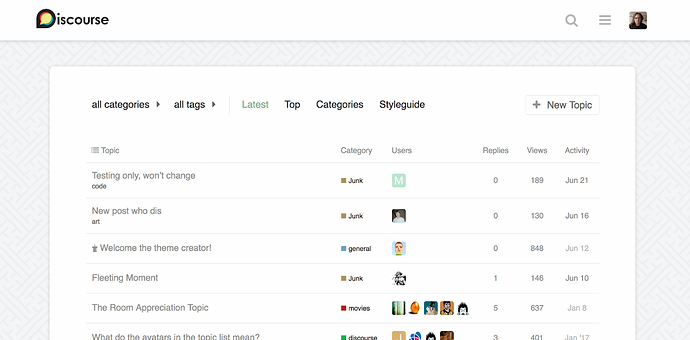](../../../assets/images/93040/b8954e01130435768e28041f009961982a448b28.jpg "graceful theme example")

###  Settings

Name | Description  
---|---  
background image | Enter image url  
tile background |   
no background image | Disable the background image and tiling settings above.  
  
This theme has three settings:

  * A field to add your own background image
  * An option to tile it
  * And an option to remove both of the above options

If you disable the tile option, the image will be set to `background-size: cover`, and your browser will scale your image to proportionately cover the full background. For example:

[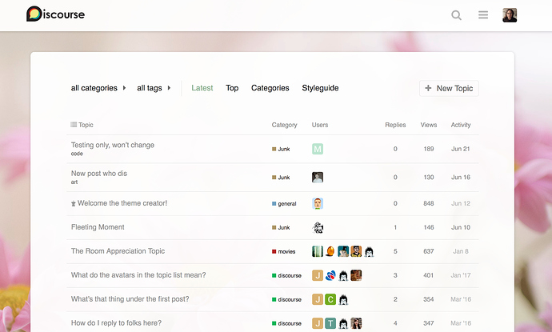](../../../assets/images/93040/9cd11e869697f78ef0e96d9abb29351e07063357.jpg "graceful theme no tile example")

###  Credits

Credit for the default background pattern included goes to [Toptal Subtle Patterns](https://www.toptal.com/designers/subtlepatterns/japanese-sayagata/).

  

>  **Hosted by us?** Themes are available to use on our Standard, Business, and Enterprise plans.

> Last edited by [@JammyDodger](/u/jammydodger) 2024-06-17T11:28:20Z
> 
> Check documentPerform check on document: 
  *[PR]: Pull Request

---

### Post #54 by [eextra](../../users/eextra.md)
*Posted: 2020-01-18 14:00*

Am I the only one with this problem using this theme ? When I test in google page speed gets 99% but the page doesn’t load, so the results are misleading.

What is it because google can’t see - it doesn’t load this page?
  *[PR]: Pull Request

---

### Post #55 by [awesomerobot](../../users/awesomerobot.md)
*Posted: 2020-01-23 20:52*

Hmm, yeah I’m seeing the same issue… it seems like something in the theme is interfering with the version of Discourse we serve Google. I’ll investigate. Looks like it might be the same issue messing with the print view reported above.
  *[PR]: Pull Request

---

### Post #70 by [neounix](../../users/neounix.md)
*Posted: 2020-03-22 04:41*

[@awesomerobot](/u/awesomerobot)

Very nice theme.

I’m trying to make Graceful much wider on desktop. Tried this:
    
    
    #main-outlet {
      width: auto;
      max-width: 1210px; /* This makes the container as wide as the logo/header controls */ 
    }
    

and this CSS made the overall container wider; and the suggested topics at the bottom span the page nicely but the overall width of the posts in the topics are too narrow (for my wide version).

Tried inspector, and a number of elements but not being a expert, could not get the width of the topics / posts to match the width of `#main-outlet` .

Do you mind to help me out?

Thanks

Also, tried this:
    
    
    #main-outlet {
      width: auto;
      max-width: 80%; 
    }
    

But cannot the the posts width to match the container width:

[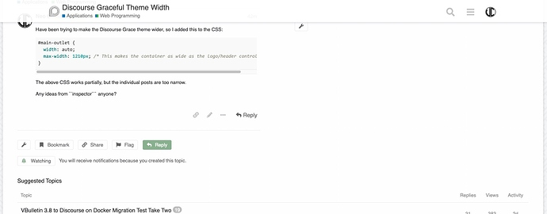](../../../assets/images/93040/83a95411ac9743698020629201d7926478d0f495.jpeg "Screen Shot 2020-03-22 at 12.17.12 PM")
  *[PR]: Pull Request

---

### Post #71 by [Steven](../../users/Steven.md)
*Posted: 2020-03-22 20:20*

topic-body has his own width setting.

Default:
    
    
    .topic-body {
        width: calc(690px + (11px * 2));
    }
    

Change only the 690px and keep the rest (it’s linked to the padding of the topic post)
  *[PR]: Pull Request

---

### Post #72 by [neounix](../../users/neounix.md)
*Posted: 2020-03-23 07:32*

Thanks! Will give it a go later and post back the results.

I tried changing `.topic-body` yesterday, but I’ll try again based on your suggestion [@Steven](/u/steven)
  *[PR]: Pull Request

---

### Post #73 by [neounix](../../users/neounix.md)
*Posted: 2020-03-23 11:20*

 Steven:

> 
>     .topic-body {
>         width: calc(690px + (11px * 2));
>     }
>     
> 
> Change

Hi [@Steven](/u/steven),

Added the following to the desktop CSS:
    
    
    #main-outlet {
      width: auto;
      max-width: 80%; 
    }
    
    .topic-body {
        width: calc(1020px + (11px * 2));
    }
    

It worked partially, but there is some issue. Perhaps you know the CSS trick to fix it?

See Image:

[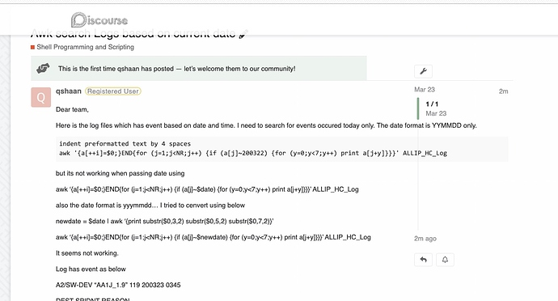](../../../assets/images/93040/ed7492c908e893d5cbd10b2fd050c8be82a2f5a8.jpeg "Screen Shot 2020-03-23 at 6.17.50 PM")
  *[PR]: Pull Request

---

### Post #74 by [Steven](../../users/Steven.md)
*Posted: 2020-03-23 12:10*

I’m not on my computer but I know there is some margin-left to correct with the class timeline-container
  *[PR]: Pull Request

---

### Post #75 by [awesomerobot](../../users/awesomerobot.md)
*Posted: 2020-03-23 12:14*

Right, for the timeline there are a few margin-lefts that need to be overridden on `.timeline-container ` (three breakpoints):

[github.com/discourse/discourse](https://github.com/discourse/discourse/blob/cd5b7109d04722df5c39b2ded9fa4ead6c290ce4/app/assets/stylesheets/common/topic-timeline.scss#L8)

#### [app/assets/stylesheets/common/topic-timeline.scss](https://github.com/discourse/discourse/blob/cd5b7109d04722df5c39b2ded9fa4ead6c290ce4/app/assets/stylesheets/common/topic-timeline.scss#L8)

[`cd5b7109d`](https://github.com/discourse/discourse/blob/cd5b7109d04722df5c39b2ded9fa4ead6c290ce4/app/assets/stylesheets/common/topic-timeline.scss#L8)
    
    
          
    
    
              
        1. .timeline-loading {
    
              
        2.   width: 900px;
    
              
        3. }
    
              
        4. 
              
        5. .timeline-container {
    
              
        6.   box-sizing: border-box;
    
              
        7.   z-index: z("timeline");
    
              
        8.   margin-left: 757px;
    
              
        9. 
              
        10.   @include breakpoint(extra-large, min-width) {
    
              
        11.     margin-left: 820px;
    
              
        12.   }
    
              
        13.   @media all and (min-width: 1250px) {
    
              
        14.     margin-left: 900px;
    
              
        15.   }
    
              
        16. 
              
        17.   position: fixed;
    
              
        18.   -webkit-transform: translate3d(0, 0, 0);
    
          
    
        
  *[PR]: Pull Request

---

### Post #76 by [neounix](../../users/neounix.md)
*Posted: 2020-03-24 09:11*

Hi [@awesomerobot](/u/awesomerobot)

Kris,

The way we got the `wide look` we wanted was to be less `graceful` and hide the `.timeline-container`.
    
    
    #main-outlet {
      width: auto;
      max-width: 70%; 
    }
    
    .topic-body {
        width: 100%;
    }
    
    .timeline-container .topic-timeline {
          display: none;
     }
    

Not very `graceful` but at least it’s working ‘ok’ with large blocks of code, it is easier to read on the big developers screen.

Would be nice to show the `.timeline-container` but I could not get it to work overriding the class as suggested, surely because of my not well-developed CSS skills:

Thank you for your help and for this nice theme.
  *[PR]: Pull Request

---

### Post #80 by [Solari](../../users/Solari.md)
*Posted: 2020-08-08 15:09*

I am loving this theme so far. Many thanks for sharing it with us!

I’ve noticed on mobile view the category color bars disappear. Is this on purpose and is there a way to restore it?

Also, is there a way to turn off the background if a category has a background set? It seems to work okay but when scrolling on long posts the screen gets jerky and you can glimpse the theme set background.

Thanks!  
Ray
  *[PR]: Pull Request

---

### Post #81 by [Solari](../../users/Solari.md)
*Posted: 2020-08-20 20:00*

 Solari:

> I’ve noticed on mobile view the category color bars disappear. Is this on purpose and is there a way to restore it?

I dug into mobile CSS and saw it was being excluded; commenting out the “left-border” portion turned the colored borders back on:
    
    
    .category-list-item {
    //  border-left: none;
      border-top: 2px solid;
      .category-name {
        font-weight: normal;
      }
    }
    

However, I know this will be overwritten whenever the theme is updated. What’s the best way to keep modifications in those situations?

I do have a custom theme component where I keep custom CSS changes, this in the mobile CSS portion:
    
    
    .category-list-item {
      border-left: 4px !important; 
    }
    

…but it doesn’t show the specific category color, just a white bar. How do I get it to show the proper category color? I know it has something to do with category color variables but I can’t seem to find reference to it.

I’m a newb when it comes to CSS and such so I may be doing something wrong.

Thanks,  
Ray
  *[PR]: Pull Request

---

### Post #91 by [IAmGav](../../users/IAmGav.md)
*Posted: 2020-11-29 18:04*

Have issue with the header colors.

Changed the header backgroup colour and the header Text, but it’s not not honoring the settings

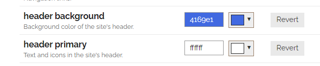

The icons stays grey

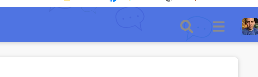

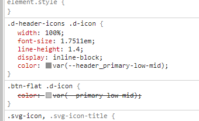
  *[PR]: Pull Request

---

### Post #92 by [dax](../../users/dax.md)
*Posted: 2020-11-30 10:51*

It’s the default behavior since the color is a “low-mid” variable of `#ffffff` and not the pure color.

See here to overwrite that color, [How to Change Header Icon Color?](../../../assets/images/93040/24d3661b33124f80c795597d4dcd23ce7b1e20d7_2_294x500.jpeg)
  *[PR]: Pull Request

---

### Post #100 by [Jack51](../../users/Jack51.md)
*Posted: 2021-01-17 04:39*

Just want to call out what an awesome theme this has proven to be. Absolutely love its clean look.
  *[PR]: Pull Request

---

### Post #101 by [Solari](../../users/Solari.md)
*Posted: 2021-01-20 04:01*

Agreed! One of the best looking Discourse themes out there.

Ray
  *[PR]: Pull Request

---

### Post #102 by [oshyan](../../users/oshyan.md)
*Posted: 2021-02-12 02:06*

I must be dense, but I can’t get the logo to change size with a theme component created to adjust CSS. I can change the overall header height, but the logo remains stubbornly the same. This CSS seems to knock out any changes I attempt to make:

.d-header #site-logo {  
max-height: 35px !important;  
}

According to Chrome Inspector it’s coming from: desktop-scss-graceful.scss

Changing logo size works fine with the default theme and, as I said, changing header height works with Graceful, just not the logo…
  *[PR]: Pull Request

---

### Post #103 by [awesomerobot](../../users/awesomerobot.md)
*Posted: 2021-02-12 04:31*

Yeah the `!important` overrides any other CSS without an `!important`… I don’t recall why it’s there but I should look into removing it. Does it work if you include an important with your own CSS?
    
    
    .d-header #site-logo {
    max-height: 50px !important; // <-- your custom height here
    }
    
  *[PR]: Pull Request

---

### Post #104 by [oshyan](../../users/oshyan.md)
*Posted: 2021-02-12 06:13*

Thanks for the quick reply! I had actually noticed the !important and tried adding it to mine, to no avail. The odd thing is, trying it now, when I save that change and it refreshes, for a _moment_ it appears the right size, then it shrinks down again. And in the Inspector it _appears_ to be doing the right thing:

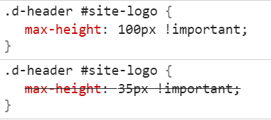

At least in the sense that the 35px is disabled. But the order seems funny, at the least. And in any case it’s still not working. Strange.

I’m putting this in Common CSS for what it’s worth…

Update: found it! It’s :

> 
>     .d-header #site-logo {
>          height: 2.667em;
>      }
>     

in header.scss!

And if I add my own height: with !important it works!
  *[PR]: Pull Request

---

### Post #105 by [oshyan](../../users/oshyan.md)
*Posted: 2021-02-13 01:49*

OK, next question, which I _think_ is specific to this theme. I’m using it as a basis to make a sort of personal “blog” (actually a digital garden, but that’s kind of an obscure term). Since basically every post will be authored by me, I want to remove or reduce the prominence of certain authorial visual elements, mainly avatars, and especially in the topic lists on the front page and in categories. Outlined in red is what I want to hide, if possible:  

[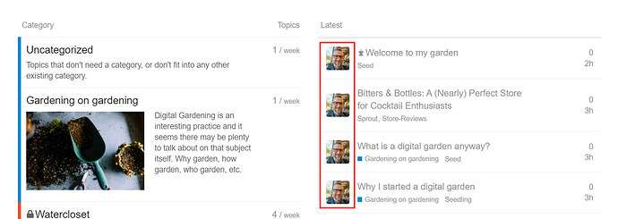](../../../assets/images/93040/7ed682969dc7cd5025d13f7997aed3d58345272a.jpeg "topic-list-avatar")

You can probably see why. 

Things I’ve tried:

  * Advice in [How to hide users column on latest?](https://meta.discourse.org/t/how-to-hide-users-column-on-latest/64229)
  * Advice in [Removing avatars in category view](https://meta.discourse.org/t/removing-avatars-in-category-view/29036)
  * [MD Topic List component](https://meta.discourse.org/t/md-topic-list-component/117694) (does not appear to be compatible with theme)
  * Using Chrome dev tools to find the classes/IDs and attempt to hide them (note to self: do not hide ember-view 😬 😆 )

I am also looking into and experimenting with various components to show the first image in a topic as a thumbnail. If I could replace those avatars with little thumbnails of first image in the topic, that’d be great too. But hiding them is a good start.

Thanks in advance!
  *[PR]: Pull Request

---

### Post #106 by [Sheppard](../../users/Sheppard.md)
*Posted: 2021-03-11 11:48*

I would like to start by saying thanks for such a great theme. and Special thanks for giving us the option to add a custom background image that was very important for us.

I am however running into a bit of a bump while trying to properly set up the header for the forums.

a- I am trying to increase the size of the logo top left corner.  
b- I am trying to change the header color to match with the logo background as for some reason I am not sure how to get discourse to accept a .png image that will go along any header color. Without discourse changing it to a jpg and adding automatically adding the background.

The image below will show what I have now

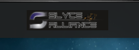

 [Gyazo](https://gyazo.com/27ada614c3eaa0f540762c1e8c855c28)

### [Gyazo](https://gyazo.com/27ada614c3eaa0f540762c1e8c855c28)

I know there were a few mentions above about this and creating a custom component to override the CSS however I am not very familiar with CSS and I am not sure what lines to add where in my custom component I created.

any help with this will be greatly appreciated!
  *[PR]: Pull Request

---

### Post #116 by [awesomerobot](../../users/awesomerobot.md)
*Posted: 2022-01-07 15:18*

I’ve just made an update that should fix the recently mentioned color issues (mismatched background, dark mode), thanks for reporting the issues everyone!
  *[PR]: Pull Request

---

### Post #117 by [danielabc](../../users/danielabc.md)
*Posted: 2022-02-26 10:08*

How do I edit the CSS for this theme?

[image]
  *[PR]: Pull Request

---

### Post #118 by [hpatel](../../users/hpatel.md)
*Posted: 2022-05-06 20:59*

I am having issue with page width, which shows narrow from right side. attached screenshot for reference.

is anyone else having same issue with this theme and any idea how can we fix this?  

[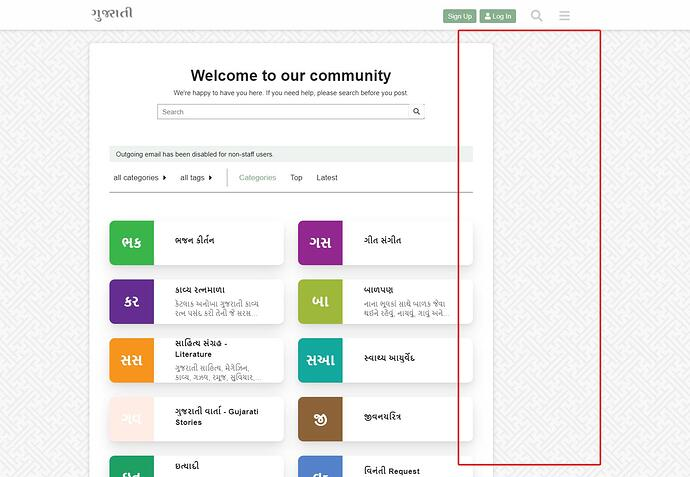](../../../assets/images/93040/1800aa108bc4632696b3a16721eb230bec54bb86.jpeg "Gujarati World - A collections for Gujarati People - Google Chrome 2022-05-07 at 8.57.11 AM")
  *[PR]: Pull Request

---

### Post #119 by [4ong](../../users/4ong.md)
*Posted: 2022-05-11 19:11*

There is some issue with avatars - placing on top of names  

[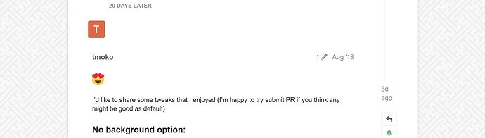](../../../assets/images/93040/9b4e84c3a171eba2b934046d2331c1a6c9b3d182.png "изображение")

[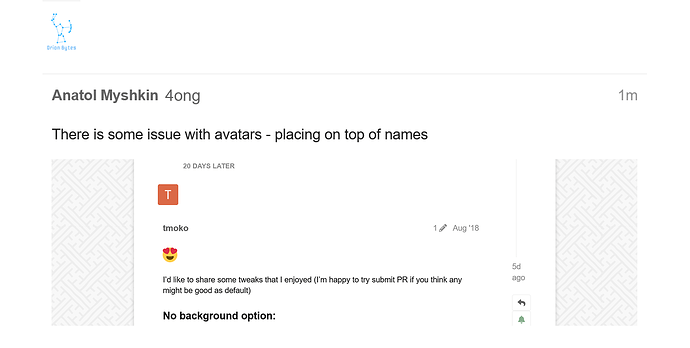](../../../assets/images/93040/e77eed379744f573b24646fc8c261d78480f7303.png "изображение")
  *[PR]: Pull Request

---

### Post #120 by [sdpiowa](../../users/sdpiowa.md)
*Posted: 2022-05-11 19:21*

We’re seeing this issue, as well.
  *[PR]: Pull Request

---

### Post #122 by [awesomerobot](../../users/awesomerobot.md)
*Posted: 2022-05-19 16:27*

Thanks for reporting! I’ve just made another update — take another look and let me know if there are any issues.
  *[PR]: Pull Request

---

### Post #123 by [hpatel](../../users/hpatel.md)
*Posted: 2022-05-20 23:47*

[@awesomerobot](/u/awesomerobot) thanks for the update, I think you may need to look mobile view, looks bit extra space on both side?
  *[PR]: Pull Request

---

### Post #124 by [oshyan](../../users/oshyan.md)
*Posted: 2022-06-05 20:50*

I’m not certain this is a theme change/issue, but recently when I updated Discourse and all my plugins, my front page with [Topic List Thumbnails Theme Component](https://meta.discourse.org/t/topic-list-thumbnails-theme-component/150602) installed went from being 3 columns to 2 columns:  

[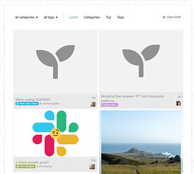](../../../assets/images/93040/8cf2d69ac02c4e027ec038dd6d73602a59e8d1c3.jpeg "digital-garden-became-2-column")

If I use Chrome Inspector and slightly increase the width of the main container, it fixes it. So I’m guessing it _may_ have to do with this recent commit which has some width changes in it:

[github.com/discourse/graceful](https://github.com/discourse/graceful/commit/5dba7eb8c502e011242f9f0f2a618debff0c3a49)

####  [UX: layout adjustments and fixes (#19)](https://github.com/discourse/graceful/commit/5dba7eb8c502e011242f9f0f2a618debff0c3a49)

committed 04:27PM - 19 May 22 UTC

[  awesomerobot ](https://github.com/awesomerobot)

[ +37 -10 ](https://github.com/discourse/graceful/commit/5dba7eb8c502e011242f9f0f2a618debff0c3a49)

For now I am addressing it by overriding the width in CSS with `main-outlet`, but I’m not sure if there are any unintended consequences, or if this is the best way to address it. So this is not necessarily to say that anything needs to be changed, but to mention it did affect layout on my site in this scenario, and to ask if there is any other approach I should be taking to get my desired result (3 column masonry layout). I’ve already fixed the issue so if that should take care of it long-term I’m happy to leave it. 🙂
  *[PR]: Pull Request

---

### Post #125 by [sdpiowa](../../users/sdpiowa.md)
*Posted: 2022-07-24 14:53*

Is this going to support the new sidebar being integrated into Discourse?
  *[PR]: Pull Request

---

### Post #127 by [awesomerobot](../../users/awesomerobot.md)
*Posted: 2022-08-05 15:56*

Yes, we plan on updating all of our themes to support it.
  *[PR]: Pull Request

---

### Post #128 by [dae](../../users/dae.md)
*Posted: 2022-09-19 03:22*

Small bug report: the latest version of this theme seems to truncate the forum title when viewed on a small mobile device like an iPhone, as can be seen on <https://forums.ankiweb.net/>
  *[PR]: Pull Request

---

### Post #132 by [blakeb](../../users/blakeb.md)
*Posted: 2022-12-13 09:09*

Full-screen chat appears to be semi-broken on the Graceful theme, with both the main window and chat window having a scrollbar. I haven’t been able to recreate this issue with other themes, so it appears to be specific to Graceful.
  *[PR]: Pull Request

---

### Post #133 by [twofoursixeight](../../users/twofoursixeight.md)
*Posted: 2023-03-12 08:51*

Why does this theme force the cards to be legacy-style? (the old style before the new [Usercard Redesign Experiment](https://meta.discourse.org/t/usercard-redesign-experiment/254353)) Otherwise, great theme.  
Image:  
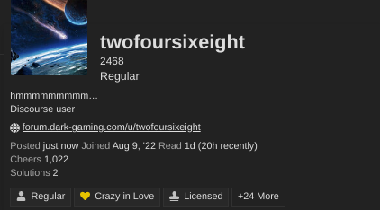
  *[PR]: Pull Request

---

### Post #134 by [awesomerobot](../../users/awesomerobot.md)
*Posted: 2023-03-14 16:55*

The updated usercards are an experimental theme component, and it looks like it just wasn’t added to all themes here on Meta… I added it to that one if you’re curious.
  *[PR]: Pull Request

---

### Post #135 by [philipp96](../../users/philipp96.md)
*Posted: 2024-01-16 09:57*

IPhone 11, Safari Browser, there are two Problems  

[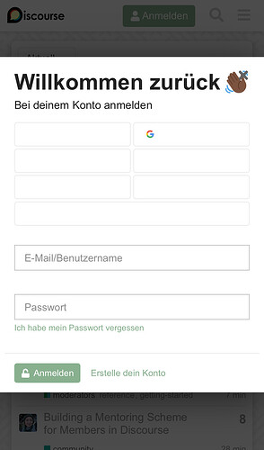](../../../assets/images/93040/24d3661b33124f80c795597d4dcd23ce7b1e20d7.jpeg "IMG_4205")

  

[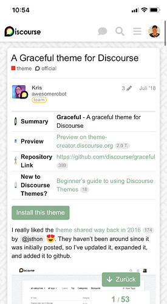](../../../assets/images/93040/d8ce695980d3bcf38948b364491ec4d02985a0b6.jpeg "IMG_4206")
  *[PR]: Pull Request

---

### Post #136 by [Moin](../../users/Moin.md)
*Posted: 2024-01-16 10:18*

It is the same on Android. The other sign-in options’ texts are invisible, and the first column of the theme component table is distorted.
  *[PR]: Pull Request

---

### Post #137 by [lifehome](../../users/lifehome.md)
*Posted: 2024-03-11 10:18*

Hi,

I just discovered it on my forum as well, fixed it with custom styling:
    
    
    .btn.btn-social {
        color: var(--d-sidebar-link-color);
    }
    

This gives the same color as your sidebar links.  
Hope this helps.

– Ivan
  *[PR]: Pull Request

---

### Post #138 by [awesomerobot](../../users/awesomerobot.md)
*Posted: 2024-03-11 16:07*

Thanks for the reports and the CSS workarounds! I’ve just updated the theme to address this: [UX: fix social login button color, sidebar headings, transparent buttons by awesomerobot · Pull Request #28 · discourse/graceful · GitHub](https://github.com/discourse/graceful/pull/28)
  *[PR]: Pull Request

---

### Post #139 by [wxs7655](../../users/wxs7655.md)
*Posted: 2024-05-22 16:53*

Hello, I noticed that the Delete Topic button color isn’t prominent enough. Could you please fix it?  

  *[PR]: Pull Request

---

### Post #140 by [icaria36](../../users/icaria36.md)
*Posted: 2024-06-22 21:37*

Is it possible to define a specific color for the background container without affecting the Dark mode background color?

We have selected `Disable the background image and tiling settings above` from the Graceful theme settings and we have added this CSS:
    
    
    // Background color instead of Graceful background image
    .background-container {
      background-color: #FAF0FC;
    }
    

This light violet looks great in the default color palette, but it also appears in the Dark one instead of the dark gray, which is not good.

The original CSS mentions a variable but I don’t know how to use it in a way that provides different colors for light or dark:

`background-color: var(--gf-primary-very-low-or-primary-low, #f8f8f8);`

Important detail, we just want to change the color of the main background, not the background of the areas with text. This is why we can’t use the Color Palette values directly (unless I have missed something).
  *[PR]: Pull Request

---

### Post #141 by [icaria36](../../users/icaria36.md)
*Posted: 2024-06-25 20:05*

Still trying to change the background for the default (light) mode while keeping the dark background for dark mode.

Even if we want a plain color for the light background, anything we have tried with CSS adds the same color to the background in dark mode.

This is why we are trying with an image instead. When the background image is set to default, the stock Graceful image background is used for light, but for dark mode there is a dark background. It would be great if we could add a custom image that would be used only the light mode as well, but when we try, the same image is used in dark mode. Because the background image is bright and fitting for the light mode, it ruins dark mode.

Can someone help me figure out this, please?
  *[PR]: Pull Request

---

### Post #142 by [piffy](../../users/piffy.md)
*Posted: 2024-06-25 20:12*

A quick temporary workaround is to use a bg with like 20-50% opacity so it picks up the background colour on both light and dark
  *[PR]: Pull Request

---

### Post #143 by [icaria36](../../users/icaria36.md)
*Posted: 2024-06-25 21:10*

[@piffy](/u/piffy) Thank you very much. This is a decent workaround indeed.

I got lost in the math of calculating a SVG number that with a 20% opacity will, result in #FAF0FC but this gets close enough to my eyes, and dark mode is dark. Phew!
    
    
    // Background color instead of Graceful background image
    .background-container {
      background: rgb(200 190 192 / 20%);
    }
    
  *[PR]: Pull Request

---

### Post #144 by [awesomerobot](../../users/awesomerobot.md)
*Posted: 2024-07-02 19:48*

Thanks for reporting it, this update will fix it

[github.com/discourse/graceful](https://github.com/discourse/graceful/pull/31)

####  [UX: fix powered by discourse location, delete button color](https://github.com/discourse/graceful/pull/31)

`main` ← `ux-style-adjustments`

merged 07:48PM - 02 Jul 24 UTC

[  awesomerobot ](https://github.com/awesomerobot)

[ +8 -1 ](https://github.com/discourse/graceful/pull/31/files)

Before: 037a-4906-bf69-ccd0cafe9cca)  After:  
  *[PR]: Pull Request

---

### Post #145 by [Joffrey_Persia](../../users/Joffrey_Persia.md)
*Posted: 2024-07-20 16:06*

In the theme option, if you click on “edit the parameters”  
You can change the json for this :
    
    
    [
    	{
    		"setting": "background_image",
    		"value": "false"
    	},
    	{
    		"setting": "tile_background",
    		"value": false
    	},
    	{
    		"setting": "no_background_image",
    		"value": false
    	}
    ]
    

And it removes the background svg
  *[PR]: Pull Request

---

### Post #146 by [GoldenSound](../../users/GoldenSound.md)
*Posted: 2025-02-16 05:43*

Has anyone found a way to properly adjust the width of the forum with this theme?

My CSS changes do not seem to be having an effect, and [Canapin’s custom width component](https://github.com/Canapin/Discourse-custom-width) works fine on the default theme but seems to have no effect on Graceful.

By default the forum is really narrow and it would be great to be able to change this
  *[PR]: Pull Request

---

### Post #148 by [Arkshine](../../users/Arkshine.md)
*Posted: 2025-02-16 17:20*

The Canapin’s TC works for me on this theme.  
This TC sets `--d-max-width` and `--topic-body-width` CSS variables.  
You might have another TC or customizations that overwrites these values.

You can try manually, for example:
    
    
    body {
        --d-max-width: 1500px;
        --topic-body-width: 1500px;
    }
    
  *[PR]: Pull Request

---

### Post #149 by [GoldenSound](../../users/GoldenSound.md)
*Posted: 2025-02-17 05:05*

This worked thank you!
  *[PR]: Pull Request

---

### Post #150 by [GoldenSound](../../users/GoldenSound.md)
*Posted: 2025-02-17 05:09*

Width issue is solved for desktop, though I’m now running into three issues:

  1. I cannot seem to change the color of user titles with CSS.

using:
    
    
    .user-title{
    background: #F55;
    border-radius: 3px;
    color: #FFF !important;
    font-size: 12px!important;
    padding-left: 7px;
    }
    

as an example, the change to padding, background etc are applied correctly, but the actual text color itself is ignored and remains the default yellow. Is there a different thing I should be addressing to change that? The yellow is extremely hard to read against a white background by default.

  2. On Mobile, the width of the forum is now slightly more than the screen should be, is there a way to have it stay at max 100% width on mobile and not go over, but without undoing the width increase for desktop users?

  3. I’m having the same issue [@Solari](/u/solari) was above in that the color bars on mobile are not present. I tried using the CSS code suggested in response but that didn’t seem to resolve the issue, did anyone figure out how to get category color bars back on mobile?

  *[PR]: Pull Request

---

← Previous | **Page 1 of 2** | [Next →](93040-page-2.md)
