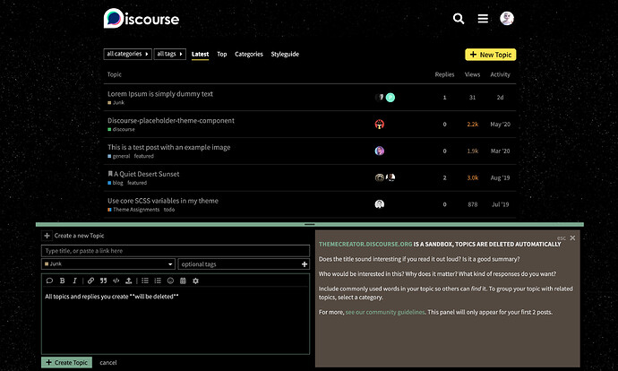
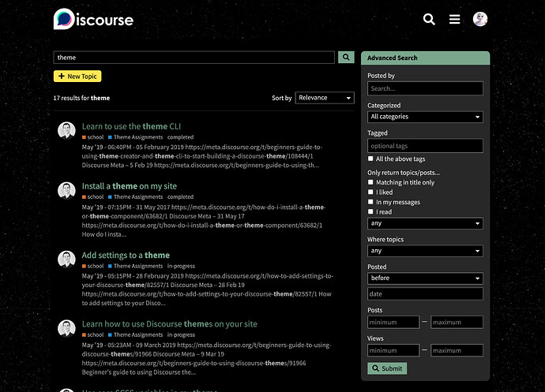
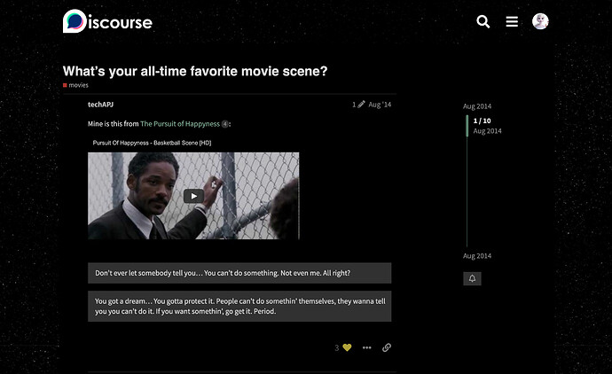
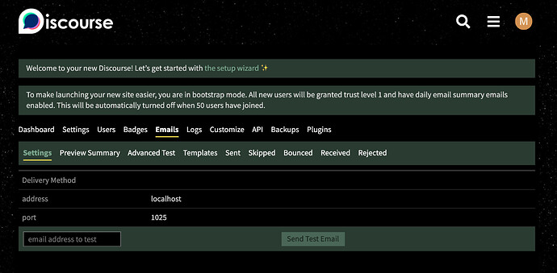
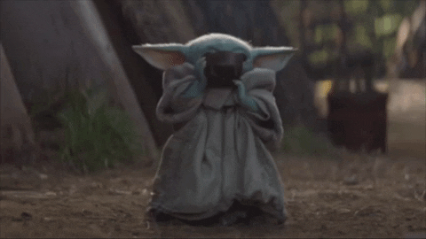

[🏠 Home](../../index.md) | [📋 Latest](../../latest/index.md) | [🔥 Top](../../top/replies/index.md) | [👥 Users](../../users/index.md)

[Home](../../index.md) » [Theme](../../c/theme/index.md) » Grogu, a theme inspired by "The Mandalorian"

---

# Grogu, a theme inspired by "The Mandalorian"

> **Category:** Theme
> **Author:** meghna
> **Created:** 2021-01-01 18:34

---

### Post #1 by [meghna](../../users/meghna.md)
*Posted: 2021-01-01 18:34*

On this New Year’s Day I present you the theme which is closest to my heart. ❤️  
  
The theme is inspired by [Grogu](https://en.wikipedia.org/wiki/Grogu) from (my favourite) [The Mandalorian](https://en.wikipedia.org/wiki/The_Mandalorian) TV series. I travelled far across the galaxy to fine tune the colour scheme to match Grogu’s appearance and maintain [Star Wars](https://en.wikipedia.org/wiki/Star_Wars) aesthetic all-around.

This is the way. 

Homepage with composer open:

Full page search:

Topic page:

Admin section:

User card avatar flair:

This theme also has a custom Mandalorian _Mythosaur_ skull as loading icon:

I have spoken! 😊

|  |   
---|---|---  
😎 | **Preview** | [Preview on theme creator](https://theme-creator.discourse.org/theme/meghna/grogu)  
🔗 | **Github Repo** | [discourse-grogu-theme](https://github.com/meghnaAJ/discourse-grogu-theme)  
🛠️ | **Install Guide** | [How to install a theme or theme component](https://meta.discourse.org/t/how-do-i-install-a-theme-or-theme-component/63682)  
📖 | **New to Discourse Themes?** | [Beginner’s guide to using Discourse Themes](https://meta.discourse.org/t/beginners-guide-to-using-discourse-themes/91966)

---
