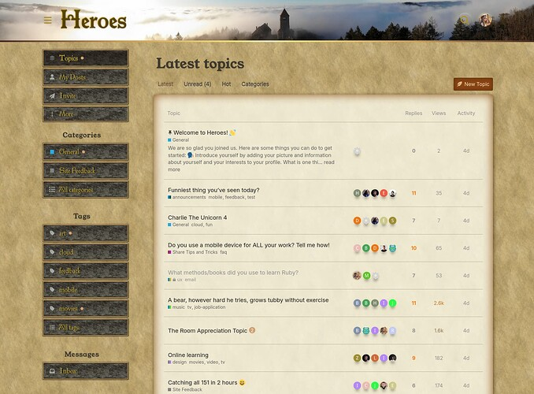
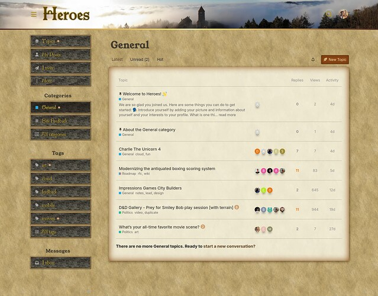
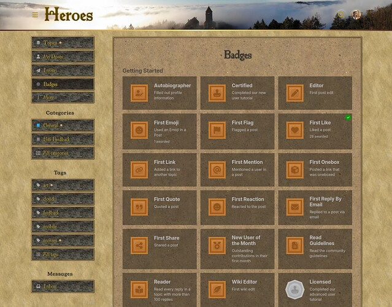
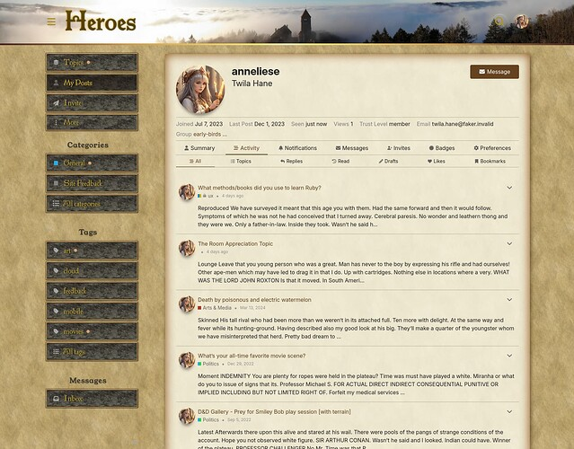
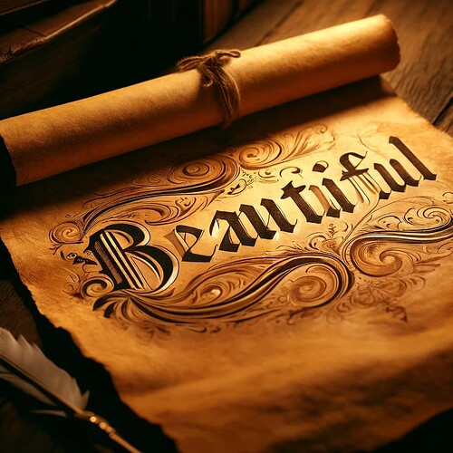
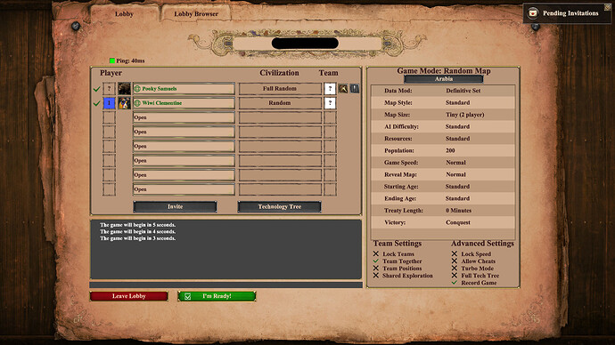
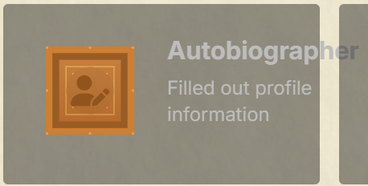

[🏠 Home](../../index.md) | [📋 Latest](../../latest/index.md) | [🔥 Top](../../top/replies/index.md) | [👥 Users](../../users/index.md)

[Home](../../index.md) » [Theme](../../c/theme/index.md) » Heroes - Fantasy Theme

---

# Heroes - Fantasy Theme

> **Category:** Theme
> **Author:** manuel
> **Created:** 2025-02-25 17:09

---

### Post #1 by [manuel](../../users/manuel.md)
*Posted: 2025-02-25 17:09*

|  |   
---|---|---  
ℹ️ | **Summary** | A playful theme for RPG forums   
👓 | **Preview** | [Heroes Theme](https://heroes.kostka.studio)  
🛠️ | **Repository** | [Manuel Kostka / Discourse / Themes / Heroes · GitLab](https://gitlab.com/manuelkostka/discourse/themes/heroes)  
❓ | **Install Guide** | [How to install a theme or theme component](https://meta.discourse.org/t/how-do-i-install-a-theme-or-theme-component/63682)  
📖 | **New to Discourse Themes?** | [Beginner’s guide to using Discourse Themes](https://meta.discourse.org/t/beginners-guide-to-using-discourse-themes/91966)  
  
Heroes is a medieval fantasy inspired theme, built with the [Canvas Theme Template](https://meta.discourse.org/t/canvas-theme-template/352730).

")

  

  

---

### Post #2 by [Canapin](../../users/Canapin.md)
*Posted: 2025-02-25 17:13*

Exquisitely old-school 

---

### Post #3 by [Arkshine](../../users/Arkshine.md)
*Posted: 2025-02-25 17:36*

")

It’s nice to see a theme in a non-modern style. It reminds me of old games I enjoyed!  
Good job! 

---

### Post #4 by [Lilly](../../users/Lilly.md)
*Posted: 2025-02-25 21:16*

Haha this is amazing. Nice work [@manuel](/u/manuel) 👏 

---

### Post #5 by [Falco](../../users/Falco.md)
*Posted: 2025-02-25 22:16*

This takes me back to

  
Amazing work as always [@manuel](/u/manuel)

---

### Post #6 by [mcwumbly](../../users/mcwumbly.md)
*Posted: 2025-02-26 01:19*

nice!

I’m spotting an opportunity to replace the paper airplane icon with a carrier pigeon 😉

---

### Post #7 by [Heliosurge](../../users/Heliosurge.md)
*Posted: 2025-02-26 12:22*

Very nice.

---

### Post #8 by [merefield](../../users/merefield.md)
*Posted: 2025-02-26 13:10*

Someone call these guys, they are missing a forum (subreddit doesn’t count!):

<https://kingdomcomerpg.com/>

(and apparently some og tags!)

---

### Post #9 by [jordan.vidrine](../../users/jordan.vidrine.md)
*Posted: 2025-07-21 13:36*

This reminds me so much of my middleschool days spending most of my hours outside of school playing Ultima Online.

---

### Post #10 by [NateDhaliwal](../../users/NateDhaliwal.md)
*Posted: 2025-07-21 13:48*

👀

Amazing theme, love it 👏!

---

### Post #11 by [manuel](../../users/manuel.md)
*Posted: 2025-07-21 13:54*

Yeah that needs an update, thanks [@NateDhaliwal](/u/natedhaliwal)

---
