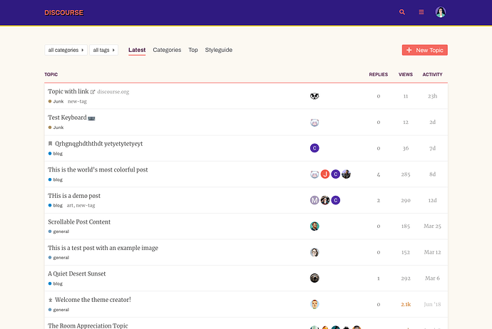
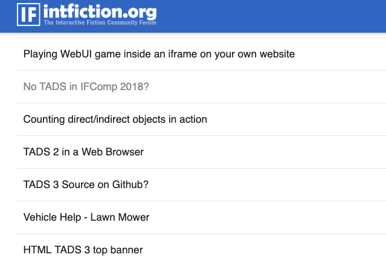
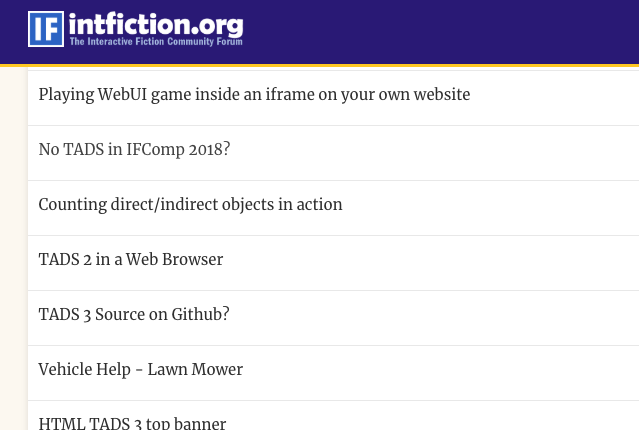
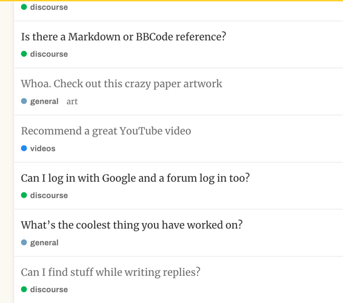
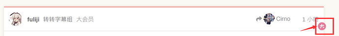

[🏠 Home](../../index.md) | [📋 Latest](../../latest/index.md) | [🔥 Top](../../top/replies/index.md) | [👥 Users](../../users/index.md)

[Home](../../index.md) » [Theme](../../c/theme/index.md) » Hibiscus Theme

---

# Hibiscus Theme

> **Category:** Theme
> **Author:** Discourse
> **Created:** 2019-05-15 14:41

---

### Post #1 by [Discourse](../../users/Discourse.md)
*Posted: 2019-05-15 14:41*

|  |   
---|---|---  
 | **Summary** |  **Hibiscus** is a bright, colorful and warm Discourse theme  
👓 | **Preview** | [Preview on Discourse Theme Creator](https://discourse.theme-creator.io/theme/Discourse/hibiscus-theme)  
🛠️ | **Repository Link** | <https://github.com/discourse/discourse-theme-hibiscus>  
📖 | **New to Discourse Themes?** | [Beginner’s guide to using Discourse Themes](https://meta.discourse.org/t/beginners-guide-to-using-discourse-themes/91966)  
  
Install this theme

>  As this is an [official](/tag/official) theme maintained by the Discourse team, [Support](/c/support/6) issues, [Bug](/c/bug/1) reports, [UX](/c/ux/9) suggestions, and requests for [Dev](/c/dev/7) advice can be made in the respective categories here on Meta, and tagged with the appropriate theme tag. Click on a link below to get one started. 👍
> 
> ` [❓ **Support**](https://meta.discourse.org/new-topic?category_id=6&tags=hibiscus-theme "Ask for support on configuring and using the Hibiscus Theme") ` ` [🐛 **Bug**](https://meta.discourse.org/new-topic?category_id=1&tags=hibiscus-theme "A bug report means something is broken, preventing normal/typical use of the theme") ` ` [👀 **UX**](https://meta.discourse.org/new-topic?category_id=9&tags=hibiscus-theme "Discussion about the user interface of the Hibiscus Theme, and how features are presented \(including language and UI elements\)") ` ` [ **Dev**](https://meta.discourse.org/new-topic?category_id=7&tags=hibiscus-theme "Advice on how to customise this theme for your site")`

###  Features

Hibiscus is a bright, colorful and warm Discourse theme. The name comes from the Spanish word “Jamaica” for the [Hibiscus](https://en.wikipedia.org/wiki/Hibiscus) flower. The theme supports both desktop and tablet/mobile styles.

##  Credits

Created by [@sodevious](/u/sodevious)

  

>  **Hosted by us?** Themes are available to use on our Standard, Business, and Enterprise plans.

> Last edited by [@JammyDodger](/u/jammydodger) 2024-06-17T12:04:57Z
> 
> Check documentPerform check on document:

---

### Post #2 by [sodevious](../../users/sodevious.md)
*Posted: 2019-05-15 14:42*

If you come across any bugs, report them below and I will address them!

_PS: Your custom uploaded logo will remain intact. If you aren’t using a custom logo, your site title will appear with the styled text like the screenshot shows._

---

### Post #9 by [Eduardo_Braga](../../users/Eduardo_Braga.md)
*Posted: 2019-05-15 18:08*

Can I change all the colors?

[@sam](/u/sam) creator of the theme is still old version?

---

### Post #10 by [sodevious](../../users/sodevious.md)
*Posted: 2019-05-15 18:46*

I can work on more color support for the theme, but because it uses brighter colors in a lot of places, not all colors will look good. Will post an update regarding color support this weekend.

---

### Post #11 by [Hanon_Ondricek](../../users/Hanon_Ondricek.md)
*Posted: 2019-05-17 14:52*

I’ve noticed when I preview Hibiscus in theme creator, it dims topics with no new messages, however on our board it does not - read and unread topics are uniformly black text.

What CSS setting could I look for to see what might be overriding this?

---

### Post #12 by [sodevious](../../users/sodevious.md)
*Posted: 2019-05-17 15:12*

Hi [@Hanon_Ondricek](/u/hanon_ondricek)! Thanks for pointing that out, I can have answer/fix to you tomorrow.

---

### Post #13 by [sodevious](../../users/sodevious.md)
*Posted: 2019-05-18 15:25*

[@Hanon_Ondricek](/u/hanon_ondricek) can you post a screenshot please?

I pushed an update that should make this easier by editing the primary color in the color schemes.

---

### Post #14 by [sodevious](../../users/sodevious.md)
*Posted: 2019-05-18 16:18*

[@Eduardo_Braga](/u/eduardo_braga) I just pushed an update that allows you to edit more of the colors like the background color, the header color, etc.

---

### Post #15 by [Hanon_Ondricek](../../users/Hanon_Ondricek.md)
*Posted: 2019-05-19 01:41*

Here is our default theme. Notice the topic “No TADS in IFComp 2018” is grey, meaning it has no new content. In the second one, this is not distinguishable. When previewing the theme in preview from here, it does have greyed-out topics.

---

### Post #16 by [sodevious](../../users/sodevious.md)
*Posted: 2019-05-19 02:02*

[@Hanon_Ondricek](/u/hanon_ondricek) I updated the theme this morning: [Discourse Theme Creator](https://theme-creator.discourse.org/theme/sodevious/hibiscus)  
`  

---

### Post #17 by [keyboardstaff](../../users/keyboardstaff.md)
*Posted: 2019-05-22 01:31*

The theme is very nice.😘

---

### Post #18 by [Frank2](../../users/Frank2.md)
*Posted: 2020-05-28 14:04*

Love the theme, great work!  
However, I have to report a styling bug.

Small profile icon should be next to the profile pic.

It somehow goes like this:  

If someone could provide a quick fix I would much appreciate it.

---

### Post #19 by [awesomerobot](../../users/awesomerobot.md)
*Posted: 2020-06-10 22:50*

I’ve just added a fix:

[github.com/discourse/discourse-theme-hibiscus](https://github.com/discourse/discourse-theme-hibiscus/commit/4dc68ebdf70493cf89b980deffb18e666f5356dd)

####  [Avatar flair position fix (in topics)](https://github.com/discourse/discourse-theme-hibiscus/commit/4dc68ebdf70493cf89b980deffb18e666f5356dd)

committed 10:46PM - 10 Jun 20 UTC

[  awesomerobot ](https://github.com/awesomerobot)

[ +23 -24 ](https://github.com/discourse/discourse-theme-hibiscus/commit/4dc68ebdf70493cf89b980deffb18e666f5356dd)

---

### Post #20 by [trasek](../../users/trasek.md)
*Posted: 2020-12-14 21:52*

There is some errors with white buttons. On Admin panel too.

---

### Post #22 by [awesomerobot](../../users/awesomerobot.md)
*Posted: 2020-12-15 01:34*

I fixed these issues and some other I discovered along the way, you’ll just need to update the theme. Thanks for making an account and reporting these issues!

[github.com/discourse/discourse-theme-hibiscus](https://github.com/discourse/discourse-theme-hibiscus/commit/92c484fe614d4f2c5d0b6c1ed9d414d87f175066)

####  [UX: General style maintance, core updates](https://github.com/discourse/discourse-theme-hibiscus/commit/92c484fe614d4f2c5d0b6c1ed9d414d87f175066)

committed 01:33AM - 15 Dec 20 UTC

[  awesomerobot ](https://github.com/awesomerobot)

[ +126 -29 ](https://github.com/discourse/discourse-theme-hibiscus/commit/92c484fe614d4f2c5d0b6c1ed9d414d87f175066)

---
